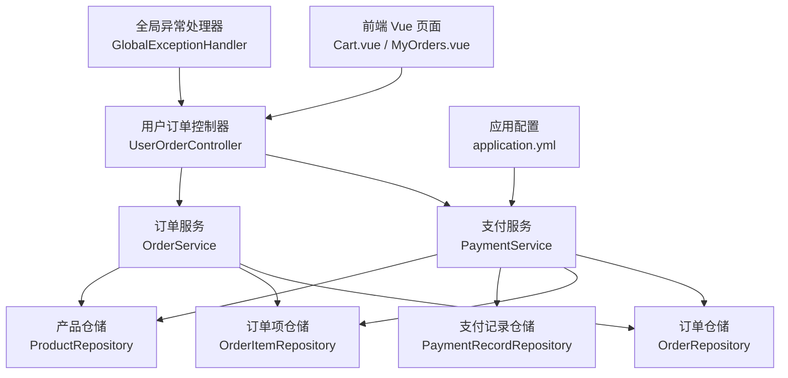
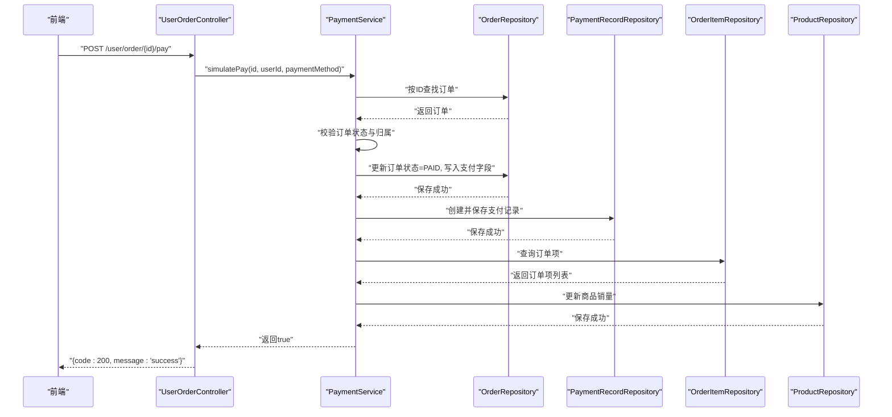
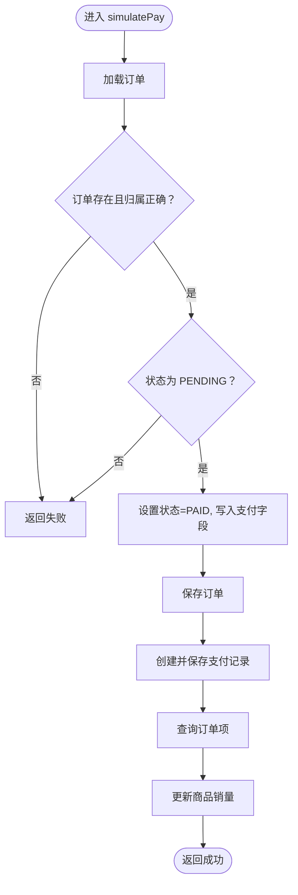
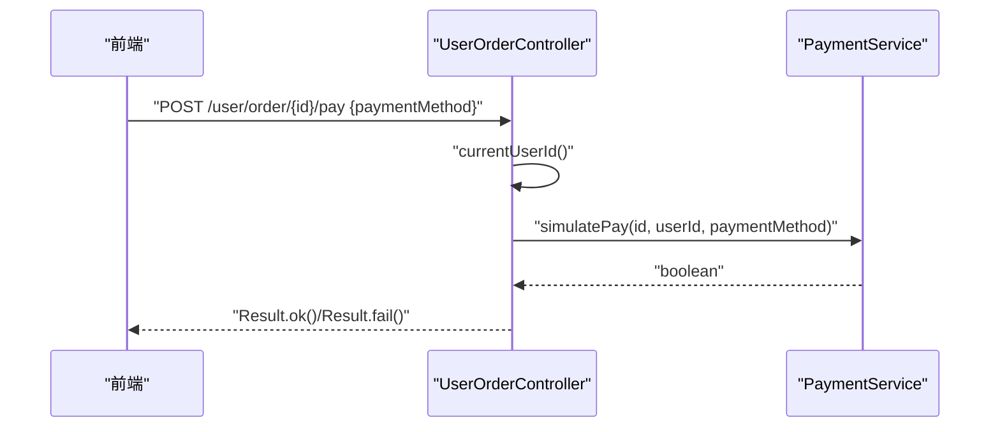
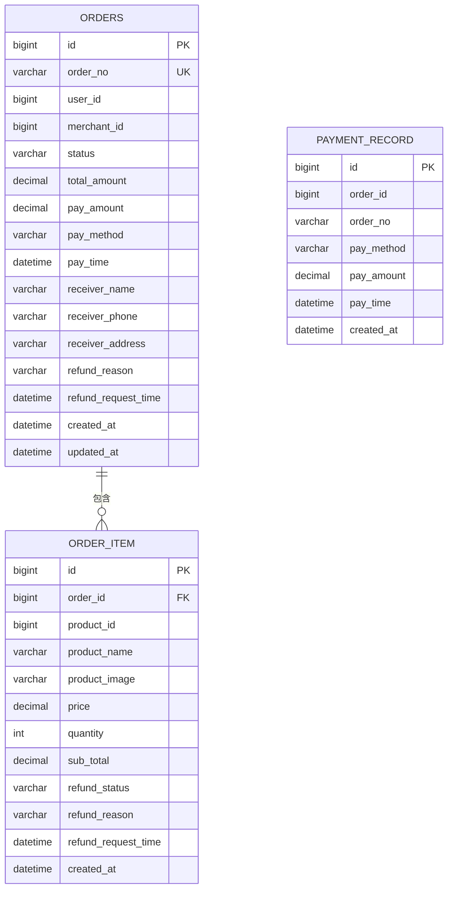
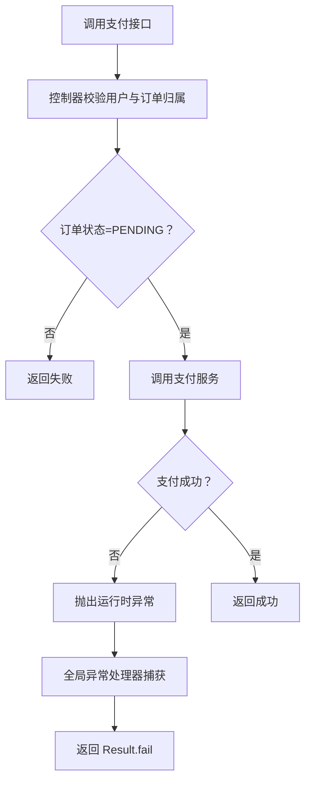
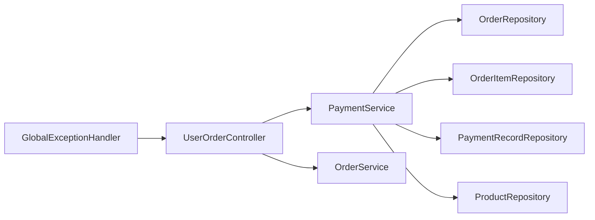

# 支付处理

<cite>
**本文引用的文件**   
- [PaymentService.java](file://backend/src/main/java/com/mall/service/PaymentService.java)
- [UserOrderController.java](file://backend/src/main/java/com/mall/controller/user/UserOrderController.java)
- [OrderService.java](file://backend/src/main/java/com/mall/service/OrderService.java)
- [Order.java](file://backend/src/main/java/com/mall/entity/Order.java)
- [OrderItem.java](file://backend/src/main/java/com/mall/entity/OrderItem.java)
- [PaymentRecord.java](file://backend/src/main/java/com/mall/entity/PaymentRecord.java)
- [PaymentRecordRepository.java](file://backend/src/main/java/com/mall/repository/PaymentRecordRepository.java)
- [application.yml](file://backend/src/main/resources/application.yml)
- [GlobalExceptionHandler.java](file://backend/src/main/java/com/mall/exception/GlobalExceptionHandler.java)
- [Result.java](file://backend/src/main/java/com/mall/dto/Result.java)
- [MyOrders.vue](file://frontend/src/views/user/MyOrders.vue)
- [Cart.vue](file://frontend/src/views/user/Cart.vue)
- [mall.sql](file://mall.sql)
</cite>

## 目录
1. [简介](#简介)
2. [项目结构](#项目结构)
3. [核心组件](#核心组件)
4. [架构总览](#架构总览)
5. [详细组件分析](#详细组件分析)
6. [依赖分析](#依赖分析)
7. [性能考量](#性能考量)
8. [故障排查指南](#故障排查指南)
9. [结论](#结论)
10. [附录](#附录)

## 简介
本技术文档聚焦于电商商城系统的支付处理模块，系统采用“模拟支付”模式：用户在前端完成下单后，通过用户端控制器触发支付流程，服务层执行支付逻辑，将订单状态置为已支付，并写入支付记录，同时更新商品销量。支付方式字段可由前端传入或默认为微信支付。系统当前未接入第三方支付平台，所有支付均视为模拟完成。

## 项目结构
支付处理模块位于后端 Java 工程中，主要涉及以下层次：
- 控制器层：用户端订单控制器提供支付入口
- 服务层：支付服务与订单服务协同完成支付与状态管理
- 数据模型层：订单、订单项、支付记录实体及 JPA 仓库
- 前端：用户端页面展示与调用支付接口
- 配置与异常：全局异常处理、应用配置

图表来源
- [UserOrderController.java:1-198](file://backend/src/main/java/com/mall/controller/user/UserOrderController.java#L1-L198)
- [PaymentService.java:1-67](file://backend/src/main/java/com/mall/service/PaymentService.java#L1-L67)
- [OrderService.java:1-280](file://backend/src/main/java/com/mall/service/OrderService.java#L1-L280)
- [application.yml:1-36](file://backend/src/main/resources/application.yml#L1-L36)
- [GlobalExceptionHandler.java:1-20](file://backend/src/main/java/com/mall/exception/GlobalExceptionHandler.java#L1-L20)

章节来源
- [UserOrderController.java:102-111](file://backend/src/main/java/com/mall/controller/user/UserOrderController.java#L102-L111)
- [PaymentService.java:30-65](file://backend/src/main/java/com/mall/service/PaymentService.java#L30-L65)
- [application.yml:1-36](file://backend/src/main/resources/application.yml#L1-L36)

## 核心组件
- 支付服务 PaymentService：负责模拟支付，校验订单状态与归属，设置支付方式、时间与金额，写入支付记录，并更新商品销量。
- 用户订单控制器 UserOrderController：提供支付接口，接收支付方式参数，调用支付服务。
- 订单服务 OrderService：负责下单、状态流转与退款流程（与支付流程互补）。
- 实体与仓储：Order、OrderItem、PaymentRecord 及其对应仓储。
- 全局异常处理 GlobalExceptionHandler：统一捕获运行时异常并返回业务失败响应。
- 前端交互：Cart.vue 与 MyOrders.vue 负责选择支付方式与触发支付请求。

章节来源
- [PaymentService.java:18-67](file://backend/src/main/java/com/mall/service/PaymentService.java#L18-L67)
- [UserOrderController.java:102-111](file://backend/src/main/java/com/mall/controller/user/UserOrderController.java#L102-L111)
- [OrderService.java:25-280](file://backend/src/main/java/com/mall/service/OrderService.java#L25-L280)
- [GlobalExceptionHandler.java:7-18](file://backend/src/main/java/com/mall/exception/GlobalExceptionHandler.java#L7-L18)
- [Cart.vue:230-249](file://frontend/src/views/user/Cart.vue#L230-L249)
- [MyOrders.vue:727-736](file://frontend/src/views/user/MyOrders.vue#L727-L736)

## 架构总览
支付处理采用典型的 MVC 分层：
- 前端通过 HTTP 请求调用后端接口
- 控制器进行参数解析与权限校验
- 服务层执行业务规则与事务控制
- 仓储层持久化数据
- 异常统一由全局处理器拦截

图表来源
- [UserOrderController.java:102-111](file://backend/src/main/java/com/mall/controller/user/UserOrderController.java#L102-L111)
- [PaymentService.java:30-65](file://backend/src/main/java/com/mall/service/PaymentService.java#L30-L65)

## 详细组件分析

### 支付服务 PaymentService
职责与流程
- 接收订单ID、用户ID与支付方式
- 校验订单存在性、归属与状态（必须为待支付）
- 将订单状态置为已支付，填充支付方式、时间与金额
- 创建并保存支付记录
- 遍历订单项，更新商品销量

复杂度与性能
- 时间复杂度：O(n)，n 为订单项数量，主要消耗在遍历与更新商品销量
- 事务：方法标注事务，确保支付与销量更新原子性

错误处理
- 若订单不存在或非当前用户或状态非待支付，直接返回失败
- 业务异常通过全局异常处理器统一转换为业务失败响应

图表来源
- [PaymentService.java:30-65](file://backend/src/main/java/com/mall/service/PaymentService.java#L30-L65)

章节来源
- [PaymentService.java:18-67](file://backend/src/main/java/com/mall/service/PaymentService.java#L18-L67)

### 用户订单控制器 UserOrderController
职责与流程
- 提供支付接口 /user/order/{id}/pay
- 从前端请求体提取支付方式，若为空则默认微信
- 调用支付服务执行模拟支付
- 统一返回 Result 结构

安全与校验
- 使用 Spring Security 的 Authentication 获取当前用户ID
- 对订单归属进行校验，防止越权操作

图表来源
- [UserOrderController.java:102-111](file://backend/src/main/java/com/mall/controller/user/UserOrderController.java#L102-L111)
- [Result.java:16-22](file://backend/src/main/java/com/mall/dto/Result.java#L16-L22)

章节来源
- [UserOrderController.java:102-111](file://backend/src/main/java/com/mall/controller/user/UserOrderController.java#L102-L111)
- [Result.java:10-23](file://backend/src/main/java/com/mall/dto/Result.java#L10-L23)

### 订单与订单项实体
- 订单 Order：包含订单号、用户ID、商户ID、状态、金额、支付字段、收货信息、退款相关信息与时间戳
- 订单项 OrderItem：包含商品快照、单价、数量、小计、退款状态与时间戳
- 支付记录 PaymentRecord：记录每次支付的金额、时间、订单号与支付方式

图表来源
- [Order.java:16-82](file://backend/src/main/java/com/mall/entity/Order.java#L16-L82)
- [OrderItem.java:16-72](file://backend/src/main/java/com/mall/entity/OrderItem.java#L16-L72)
- [PaymentRecord.java:17-44](file://backend/src/main/java/com/mall/entity/PaymentRecord.java#L17-L44)
- [mall.sql:253-320](file://mall.sql#L253-L320)

章节来源
- [Order.java:16-82](file://backend/src/main/java/com/mall/entity/Order.java#L16-L82)
- [OrderItem.java:16-72](file://backend/src/main/java/com/mall/entity/OrderItem.java#L16-L72)
- [PaymentRecord.java:17-44](file://backend/src/main/java/com/mall/entity/PaymentRecord.java#L17-L44)
- [mall.sql:253-320](file://mall.sql#L253-L320)

### 支付方式集成方案（现状与扩展建议）
现状
- 当前支付为模拟支付，支付方式可由前端传入，若为空则默认为微信
- 支付记录中 pay_method 字段用于标识支付渠道

扩展建议（第三方支付平台对接）
- 选择平台：微信支付、支付宝等主流第三方支付
- 对接策略
  - 服务端统一封装支付网关客户端，抽象出统一下单、查询、关闭、退款等接口
  - 在下单阶段生成预支付订单，返回前端支付凭证（如微信 JSAPI/小程序/APP 或支付宝 SDK 参数）
  - 前端根据支付凭证调起客户端完成支付
  - 支付结果通过异步回调通知服务端，服务端幂等处理并更新订单状态
- 安全考虑
  - 回调签名验证（MD5/HMAC），校验参数完整性与来源合法性
  - 防重放：基于订单号与随机串构造唯一键，消费后标记
  - 敏感信息加密存储与传输，日志脱敏
  - 交易金额与币种一致性校验
  - 幂等性：依据订单号与支付流水号去重
  - 超时与重试：合理设置超时与指数退避重试，避免风暴

章节来源
- [UserOrderController.java:105-108](file://backend/src/main/java/com/mall/controller/user/UserOrderController.java#L105-L108)
- [PaymentRecord.java:29-30](file://backend/src/main/java/com/mall/entity/PaymentRecord.java#L29-L30)

### 支付状态同步机制（主动查询与被动回调）
当前实现
- 主动查询：前端轮询订单状态或刷新页面查看支付结果
- 被动回调：当前未实现第三方回调处理，支付状态变更完全由模拟支付驱动

扩展建议
- 主动查询：服务端提供订单状态查询接口，支持分页与条件过滤
- 被动回调：接入第三方回调，实现异步通知处理与幂等校验
- 双向同步：下单时记录支付流水号，回调时比对并更新状态，避免重复处理

章节来源
- [OrderService.java:95-108](file://backend/src/main/java/com/mall/service/OrderService.java#L95-L108)

### 支付异常处理
- 运行时异常：通过全局异常处理器统一捕获，返回 Result.fail
- 支付前置校验失败：订单不存在、非当前用户、状态非待支付等直接返回失败
- 前端提示：前端根据 Result.code 判断成功/失败并提示

图表来源
- [UserOrderController.java:102-111](file://backend/src/main/java/com/mall/controller/user/UserOrderController.java#L102-L111)
- [GlobalExceptionHandler.java:13-17](file://backend/src/main/java/com/mall/exception/GlobalExceptionHandler.java#L13-L17)

章节来源
- [GlobalExceptionHandler.java:7-18](file://backend/src/main/java/com/mall/exception/GlobalExceptionHandler.java#L7-L18)
- [UserOrderController.java:102-111](file://backend/src/main/java/com/mall/controller/user/UserOrderController.java#L102-L111)

### 支付安全机制与防重放
- 当前实现
  - 支付记录包含支付方式与时间，便于审计
  - 订单状态与金额字段用于核对一致性
- 建议增强
  - 回调签名：第三方回调需校验签名
  - 防重放：基于订单号+随机串构建唯一键，消费后标记
  - 加密与脱敏：敏感字段加密存储，日志脱敏
  - 幂等：依据订单号与支付流水号去重
  - 超时与重试：设置超时与指数退避重试

章节来源
- [PaymentRecord.java:29-36](file://backend/src/main/java/com/mall/entity/PaymentRecord.java#L29-L36)
- [Order.java:31-45](file://backend/src/main/java/com/mall/entity/Order.java#L31-L45)

## 依赖分析
- 控制器依赖服务：UserOrderController 依赖 PaymentService 与 OrderService
- 支付服务依赖仓储：PaymentService 依赖 OrderRepository、OrderItemRepository、PaymentRecordRepository、ProductRepository
- 异常处理：GlobalExceptionHandler 统一拦截运行时异常
- 前端依赖：Cart.vue 与 MyOrders.vue 通过 API 调用后端接口

图表来源
- [UserOrderController.java:25-26](file://backend/src/main/java/com/mall/controller/user/UserOrderController.java#L25-L26)
- [PaymentService.java:25-28](file://backend/src/main/java/com/mall/service/PaymentService.java#L25-L28)
- [GlobalExceptionHandler.java:10-17](file://backend/src/main/java/com/mall/exception/GlobalExceptionHandler.java#L10-L17)

章节来源
- [UserOrderController.java:25-26](file://backend/src/main/java/com/mall/controller/user/UserOrderController.java#L25-L26)
- [PaymentService.java:25-28](file://backend/src/main/java/com/mall/service/PaymentService.java#L25-L28)
- [GlobalExceptionHandler.java:10-17](file://backend/src/main/java/com/mall/exception/GlobalExceptionHandler.java#L10-L17)

## 性能考量
- 事务边界：支付流程在单事务内完成，减少并发冲突
- 数据库索引：建议在订单号、用户ID、商户ID等常用查询字段建立索引
- 批量更新：商品销量更新为逐条更新，若订单项较多可考虑批量优化
- 缓存策略：对热点商品库存与价格可引入缓存，降低读压力

## 故障排查指南
- 支付失败
  - 检查订单是否存在、是否为当前用户、状态是否为待支付
  - 查看全局异常返回的具体错误信息
- 支付记录缺失
  - 确认支付服务是否成功保存支付记录
  - 核对订单号与支付方式是否一致
- 商品销量未更新
  - 检查订单项是否正确加载
  - 确认产品仓储保存是否成功

章节来源
- [GlobalExceptionHandler.java:13-17](file://backend/src/main/java/com/mall/exception/GlobalExceptionHandler.java#L13-L17)
- [PaymentService.java:56-63](file://backend/src/main/java/com/mall/service/PaymentService.java#L56-L63)

## 结论
当前支付模块采用“模拟支付”，流程简洁可靠，满足演示与测试需求。若要接入真实第三方支付，应在现有架构基础上增加网关封装、回调签名验证、防重放与幂等处理，并完善主动查询与状态同步机制。同时加强安全与性能优化，确保高并发下的稳定性与一致性。

## 附录
- 前端支付方式选择与调用
  - Cart.vue 中提供微信与支付宝两种支付方式选择
  - MyOrders.vue 中提供支付按钮并调用后端支付接口

章节来源
- [Cart.vue:230-249](file://frontend/src/views/user/Cart.vue#L230-L249)
- [MyOrders.vue:727-736](file://frontend/src/views/user/MyOrders.vue#L727-L736)