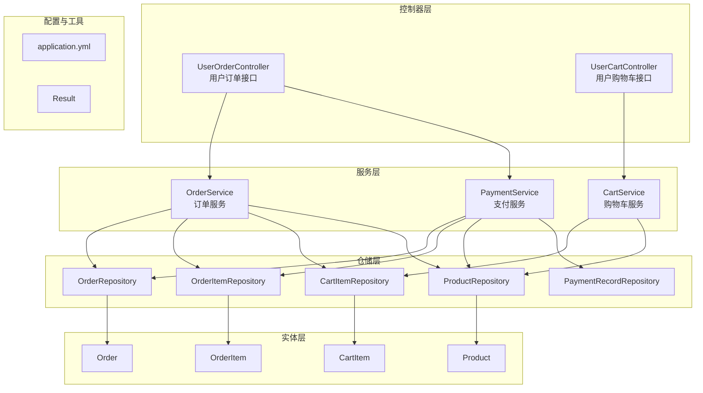
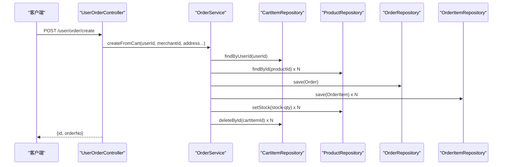
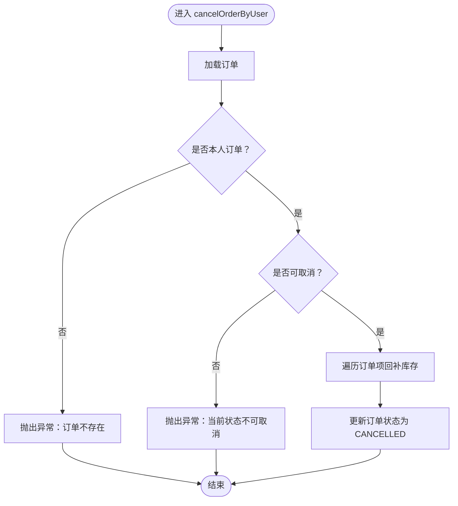
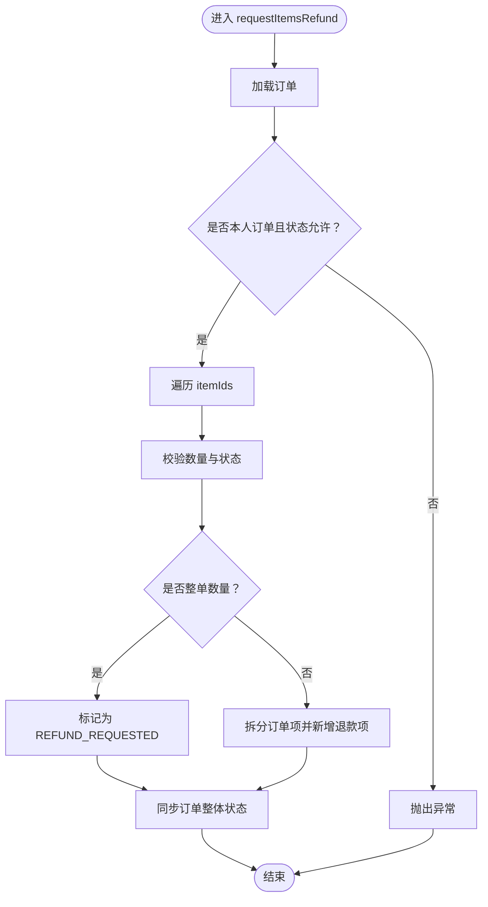
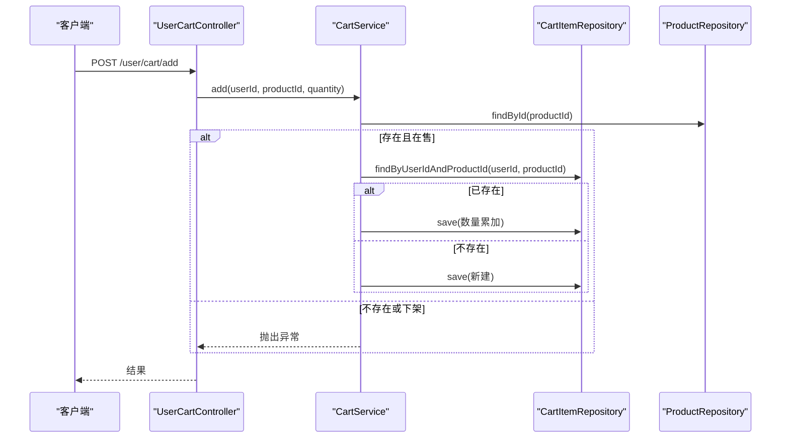
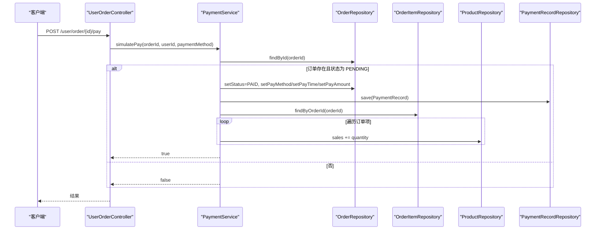
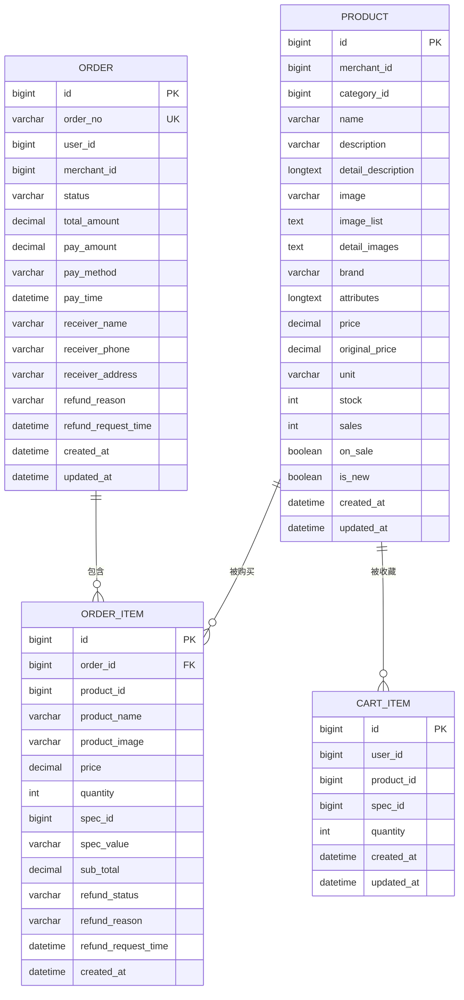
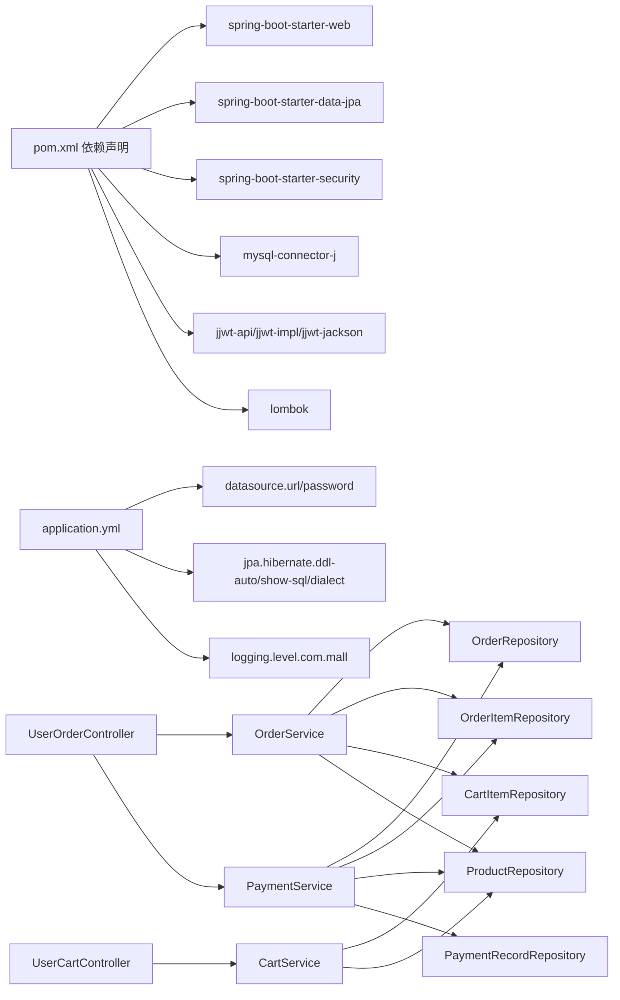

# 订单服务

<cite>
**本文引用的文件列表**
- [OrderService.java](file://backend/src/main/java/com/mall/service/OrderService.java)
- [CartService.java](file://backend/src/main/java/com/mall/service/CartService.java)
- [PaymentService.java](file://backend/src/main/java/com/mall/service/PaymentService.java)
- [Order.java](file://backend/src/main/java/com/mall/entity/Order.java)
- [OrderItem.java](file://backend/src/main/java/com/mall/entity/OrderItem.java)
- [CartItem.java](file://backend/src/main/java/com/mall/entity/CartItem.java)
- [Product.java](file://backend/src/main/java/com/mall/entity/Product.java)
- [OrderRepository.java](file://backend/src/main/java/com/mall/repository/OrderRepository.java)
- [CartItemRepository.java](file://backend/src/main/java/com/mall/repository/CartItemRepository.java)
- [UserOrderController.java](file://backend/src/main/java/com/mall/controller/user/UserOrderController.java)
- [UserCartController.java](file://backend/src/main/java/com/mall/controller/user/UserCartController.java)
- [application.yml](file://backend/src/main/resources/application.yml)
- [pom.xml](file://backend/pom.xml)
- [Result.java](file://backend/src/main/java/com/mall/dto/Result.java)
</cite>

## 目录
1. [简介](#简介)
2. [项目结构](#项目结构)
3. [核心组件](#核心组件)
4. [架构总览](#架构总览)
5. [详细组件分析](#详细组件分析)
6. [依赖分析](#依赖分析)
7. [性能考量](#性能考量)
8. [故障排查指南](#故障排查指南)
9. [结论](#结论)
10. [附录](#附录)

## 简介
本技术文档围绕电商商城系统的“订单服务”展开，覆盖订单创建、支付处理、订单状态管理、购物车管理等完整业务流程。重点解析订单生成的业务规则、库存锁定与扣减、价格计算、退款申请与审批等核心逻辑；同时阐述支付服务的集成方案、支付状态同步与销量更新；并总结购物车服务的商品添加、数量修改与批量操作实现。最后给出事务一致性保证、并发控制策略与异常恢复机制的建议与现状说明。

## 项目结构
后端采用 Spring Boot + JPA 的分层架构，主要目录与职责如下：
- controller 层：对外暴露 REST 接口，处理用户与运营端请求
- service 层：封装业务逻辑，协调仓储与实体
- repository 层：基于 JPA 的数据访问层
- entity 层：领域模型与数据库映射
- dto 层：统一响应结构
- resources：配置文件与静态资源

图表来源
- [UserOrderController.java:1-198](file://backend/src/main/java/com/mall/controller/user/UserOrderController.java#L1-L198)
- [UserCartController.java:1-67](file://backend/src/main/java/com/mall/controller/user/UserCartController.java#L1-L67)
- [OrderService.java:1-280](file://backend/src/main/java/com/mall/service/OrderService.java#L1-L280)
- [CartService.java:1-62](file://backend/src/main/java/com/mall/service/CartService.java#L1-L62)
- [PaymentService.java:1-67](file://backend/src/main/java/com/mall/service/PaymentService.java#L1-L67)
- [OrderRepository.java:1-28](file://backend/src/main/java/com/mall/repository/OrderRepository.java#L1-L28)
- [CartItemRepository.java:1-21](file://backend/src/main/java/com/mall/repository/CartItemRepository.java#L1-L21)
- [Order.java:1-83](file://backend/src/main/java/com/mall/entity/Order.java#L1-L83)
- [OrderItem.java:1-73](file://backend/src/main/java/com/mall/entity/OrderItem.java#L1-L73)
- [CartItem.java:1-50](file://backend/src/main/java/com/mall/entity/CartItem.java#L1-L50)
- [Product.java:1-101](file://backend/src/main/java/com/mall/entity/Product.java#L1-L101)
- [application.yml:1-36](file://backend/src/main/resources/application.yml#L1-L36)

章节来源
- [UserOrderController.java:1-198](file://backend/src/main/java/com/mall/controller/user/UserOrderController.java#L1-L198)
- [UserCartController.java:1-67](file://backend/src/main/java/com/mall/controller/user/UserCartController.java#L1-L67)
- [application.yml:1-36](file://backend/src/main/resources/application.yml#L1-L36)

## 核心组件
- 订单服务（OrderService）：负责从购物车创建订单、库存校验与扣减、订单状态更新、取消订单与退款申请/审批等
- 购物车服务（CartService）：负责用户购物车的查询、添加、数量修改与删除
- 支付服务（PaymentService）：负责模拟支付、设置支付状态与支付记录、更新商品销量
- 控制器（UserOrderController、UserCartController）：对外提供 REST 接口，封装业务调用与返回结果
- 实体与仓储：Order、OrderItem、CartItem、Product 及其对应的 Repository

章节来源
- [OrderService.java:1-280](file://backend/src/main/java/com/mall/service/OrderService.java#L1-L280)
- [CartService.java:1-62](file://backend/src/main/java/com/mall/service/CartService.java#L1-L62)
- [PaymentService.java:1-67](file://backend/src/main/java/com/mall/service/PaymentService.java#L1-L67)
- [UserOrderController.java:1-198](file://backend/src/main/java/com/mall/controller/user/UserOrderController.java#L1-L198)
- [UserCartController.java:1-67](file://backend/src/main/java/com/mall/controller/user/UserCartController.java#L1-L67)

## 架构总览
系统采用典型的三层架构：
- 表现层：REST 控制器接收请求，进行鉴权与参数校验，调用服务层
- 领域层：服务层封装业务规则，协调仓储与实体
- 数据持久层：JPA Repository 提供数据访问能力

图表来源
- [UserOrderController.java:34-50](file://backend/src/main/java/com/mall/controller/user/UserOrderController.java#L34-L50)
- [OrderService.java:34-88](file://backend/src/main/java/com/mall/service/OrderService.java#L34-L88)
- [OrderRepository.java:1-28](file://backend/src/main/java/com/mall/repository/OrderRepository.java#L1-L28)
- [OrderItem.java:1-73](file://backend/src/main/java/com/mall/entity/OrderItem.java#L1-L73)
- [Product.java:1-101](file://backend/src/main/java/com/mall/entity/Product.java#L1-L101)

## 详细组件分析

### 订单服务（OrderService）
- 订单创建（createFromCart）
  - 从购物车筛选指定商户的商品，按商品单价与数量计算小计与订单总价
  - 校验库存是否充足，不足则抛出异常
  - 保存订单与订单明细，逐条扣减对应商品库存
  - 清空购物车中已下单的商品
  - 使用事务确保创建与扣减的原子性
- 订单状态管理
  - 支持按用户、商户、全站分页查询
  - 支持根据订单 ID 查询与更新状态
- 取消订单（cancelOrderByUser）
  - 仅在未收货且非取消状态下允许取消
  - 取消时回补库存
- 退款流程
  - 整体退款：仅已收货订单可申请，状态置为 REFUND_REQUESTED
  - 单项退款：校验订单项状态与数量合法性，支持部分数量退款拆分订单项
  - 商户审批：单项同意退款后，若全部已退款则整体标记为 REFUNDED
- 同步逻辑
  - 当所有订单项均处于“已申请/已退款”时，订单整体同步为 REFUND_REQUESTED 或 REFUNDED

图表来源
- [OrderService.java:123-145](file://backend/src/main/java/com/mall/service/OrderService.java#L123-L145)

图表来源
- [OrderService.java:187-240](file://backend/src/main/java/com/mall/service/OrderService.java#L187-L240)

章节来源
- [OrderService.java:34-88](file://backend/src/main/java/com/mall/service/OrderService.java#L34-L88)
- [OrderService.java:123-145](file://backend/src/main/java/com/mall/service/OrderService.java#L123-L145)
- [OrderService.java:147-278](file://backend/src/main/java/com/mall/service/OrderService.java#L147-L278)

### 购物车服务（CartService）
- 查询：按用户 ID 获取购物车列表
- 添加：校验商品存在且在售，若已存在则累加数量，否则新建购物车项
- 修改数量：数量小于等于 0 则删除该项
- 删除：按用户与商品 ID 删除

图表来源
- [UserCartController.java:34-45](file://backend/src/main/java/com/mall/controller/user/UserCartController.java#L34-L45)
- [CartService.java:25-43](file://backend/src/main/java/com/mall/service/CartService.java#L25-L43)
- [CartItemRepository.java:1-21](file://backend/src/main/java/com/mall/repository/CartItemRepository.java#L1-L21)
- [Product.java:1-101](file://backend/src/main/java/com/mall/entity/Product.java#L1-L101)

章节来源
- [CartService.java:21-61](file://backend/src/main/java/com/mall/service/CartService.java#L21-L61)
- [UserCartController.java:27-65](file://backend/src/main/java/com/mall/controller/user/UserCartController.java#L27-L65)

### 支付服务（PaymentService）
- 模拟支付：校验订单存在、归属与状态（仅 PENDING），设置为已支付、记录支付信息、更新商品销量
- 支付方式默认为 WECHAT（若未传）

图表来源
- [UserOrderController.java:102-111](file://backend/src/main/java/com/mall/controller/user/UserOrderController.java#L102-L111)
- [PaymentService.java:30-65](file://backend/src/main/java/com/mall/service/PaymentService.java#L30-L65)
- [OrderRepository.java:1-28](file://backend/src/main/java/com/mall/repository/OrderRepository.java#L1-L28)
- [OrderItem.java:1-73](file://backend/src/main/java/com/mall/entity/OrderItem.java#L1-L73)
- [Product.java:1-101](file://backend/src/main/java/com/mall/entity/Product.java#L1-L101)

章节来源
- [PaymentService.java:30-65](file://backend/src/main/java/com/mall/service/PaymentService.java#L30-L65)
- [UserOrderController.java:102-111](file://backend/src/main/java/com/mall/controller/user/UserOrderController.java#L102-L111)

### 数据模型与关系

图表来源
- [Order.java:1-83](file://backend/src/main/java/com/mall/entity/Order.java#L1-L83)
- [OrderItem.java:1-73](file://backend/src/main/java/com/mall/entity/OrderItem.java#L1-L73)
- [CartItem.java:1-50](file://backend/src/main/java/com/mall/entity/CartItem.java#L1-L50)
- [Product.java:1-101](file://backend/src/main/java/com/mall/entity/Product.java#L1-L101)

## 依赖分析
- 技术栈
  - Spring Boot 3.4.1、Spring Web、Spring Data JPA、Spring Security、MySQL Connector/J、JWT（jjwt）
- 数据源与 JPA 配置
  - MySQL 数据源、Hibernate Dialect、DDL 自动更新、SQL 格式化与日志级别
- 控制器与服务的依赖关系
  - 控制器依赖服务；服务依赖仓储与实体；仓储依赖 JPA

图表来源
- [pom.xml:19-74](file://backend/pom.xml#L19-L74)
- [application.yml:1-36](file://backend/src/main/resources/application.yml#L1-L36)
- [UserOrderController.java:1-198](file://backend/src/main/java/com/mall/controller/user/UserOrderController.java#L1-L198)
- [UserCartController.java:1-67](file://backend/src/main/java/com/mall/controller/user/UserCartController.java#L1-L67)
- [OrderService.java:1-280](file://backend/src/main/java/com/mall/service/OrderService.java#L1-L280)
- [CartService.java:1-62](file://backend/src/main/java/com/mall/service/CartService.java#L1-L62)
- [PaymentService.java:1-67](file://backend/src/main/java/com/mall/service/PaymentService.java#L1-L67)

章节来源
- [pom.xml:1-107](file://backend/pom.xml#L1-L107)
- [application.yml:1-36](file://backend/src/main/resources/application.yml#L1-L36)

## 性能考量
- 事务边界
  - 订单创建与支付流程均使用 @Transactional，确保数据库层面的原子性
- 查询优化
  - 控制器分页查询订单与购物车，避免一次性加载大量数据
- 写入热点
  - 库存扣减与销量更新在循环中执行，建议在高并发场景下考虑批量更新或队列异步化
- 并发控制
  - 现状：通过服务层方法级事务与 JPA 持久化上下文保证一致性，未见显式的锁或版本字段
  - 建议：库存扣减可引入悲观锁（SELECT ... FOR UPDATE）或乐观锁（版本号）以降低超卖风险
- 缓存策略
  - 可对商品详情与热销榜进行缓存，减少数据库压力
- 日志与监控
  - 建议增加关键路径的埋点与链路追踪，便于定位性能瓶颈

## 故障排查指南
- 订单创建失败
  - 检查购物车是否存在目标商户商品、商品是否存在且在售、库存是否充足
  - 关注事务回滚导致的数据不一致问题
- 支付失败
  - 确认订单存在、归属正确、状态为 PENDING
  - 检查支付记录是否成功写入
- 退款异常
  - 校验订单状态与订单项状态是否允许退款
  - 部分退款时检查拆分逻辑与数量合法性
- 取消订单异常
  - 确认订单状态是否允许取消，以及是否为本人订单
- 并发问题
  - 高并发下可能出现超卖或重复退款，建议引入库存锁或幂等设计

章节来源
- [OrderService.java:34-88](file://backend/src/main/java/com/mall/service/OrderService.java#L34-L88)
- [OrderService.java:123-145](file://backend/src/main/java/com/mall/service/OrderService.java#L123-L145)
- [OrderService.java:147-278](file://backend/src/main/java/com/mall/service/OrderService.java#L147-L278)
- [PaymentService.java:30-65](file://backend/src/main/java/com/mall/service/PaymentService.java#L30-L65)
- [UserOrderController.java:102-111](file://backend/src/main/java/com/mall/controller/user/UserOrderController.java#L102-L111)

## 结论
本订单服务实现了从购物车下单、库存校验与扣减、支付模拟、订单状态流转与退款处理的闭环。通过 JPA 与 Spring 事务保证了基本的一致性，但在高并发场景下建议补充库存锁与幂等设计，以进一步提升可靠性与性能。后续可在支付网关对接、退款审批流程细化、库存与销量异步化等方面持续演进。

## 附录
- 统一响应结构：Result，包含 code、message、data 字段
- 接口示例（节选）
  - 创建订单：POST /user/order/create
  - 支付订单：POST /user/order/{id}/pay
  - 确认收货：POST /user/order/{id}/confirm-receive
  - 完成订单：POST /user/order/{id}/complete
  - 取消订单：POST /user/order/{id}/cancel
  - 申请退款：POST /user/order/{id}/refund-request
  - 单项退款：POST /user/order/{orderId}/items/{itemId}/refund-request
  - 批量退款：POST /user/order/{orderId}/items/batch-refund-request
  - 购物车查询：GET /user/cart
  - 添加商品：POST /user/cart/add
  - 修改数量：PUT /user/cart/quantity
  - 移除商品：DELETE /user/cart/{productId}

章节来源
- [UserOrderController.java:34-196](file://backend/src/main/java/com/mall/controller/user/UserOrderController.java#L34-L196)
- [UserCartController.java:27-65](file://backend/src/main/java/com/mall/controller/user/UserCartController.java#L27-L65)
- [Result.java:1-24](file://backend/src/main/java/com/mall/dto/Result.java#L1-L24)