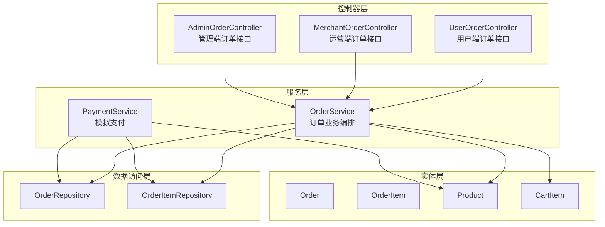
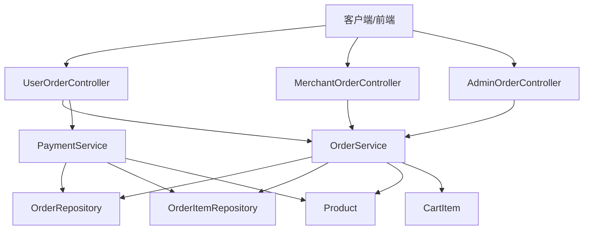
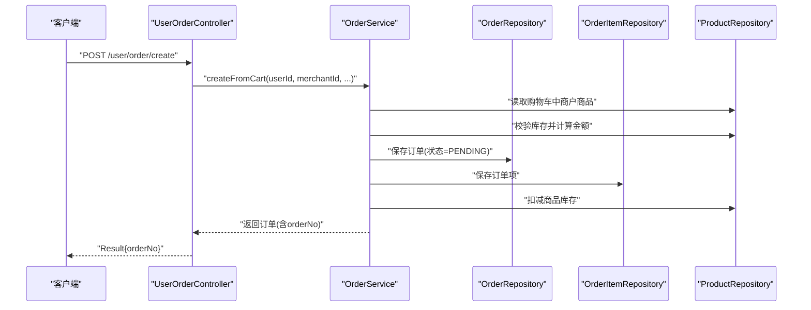
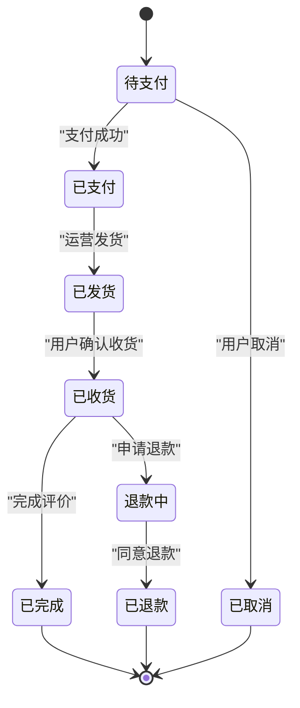
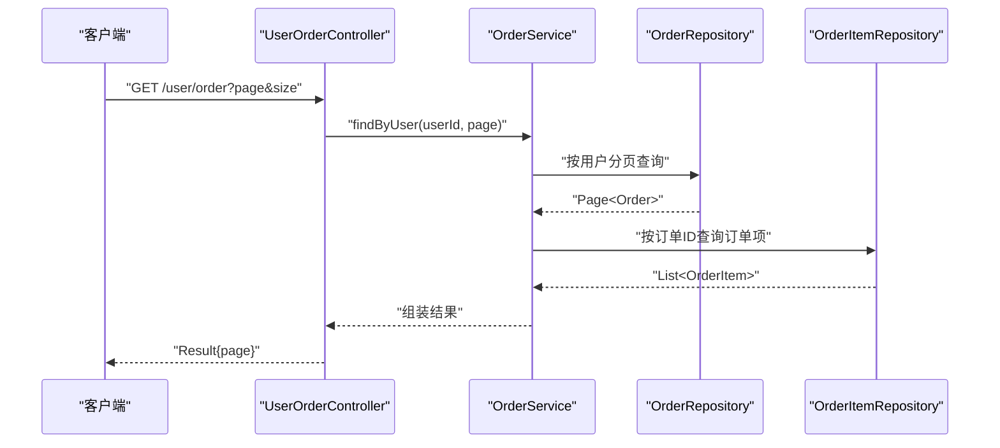
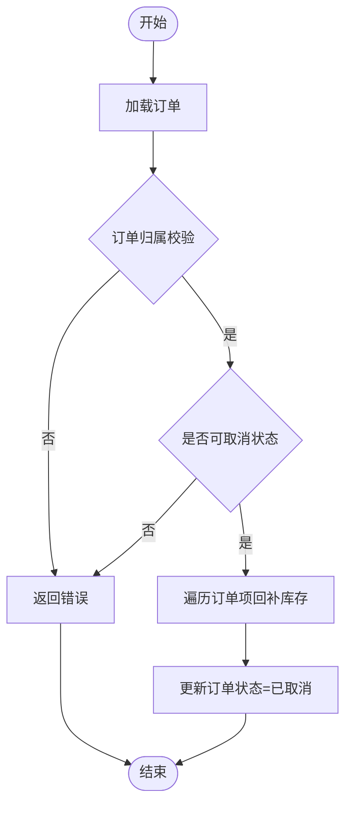
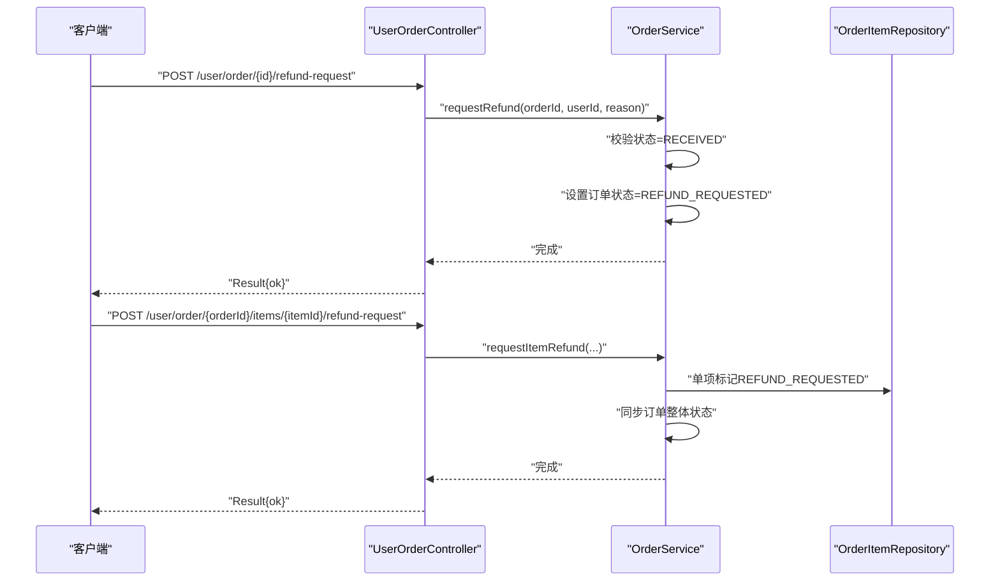
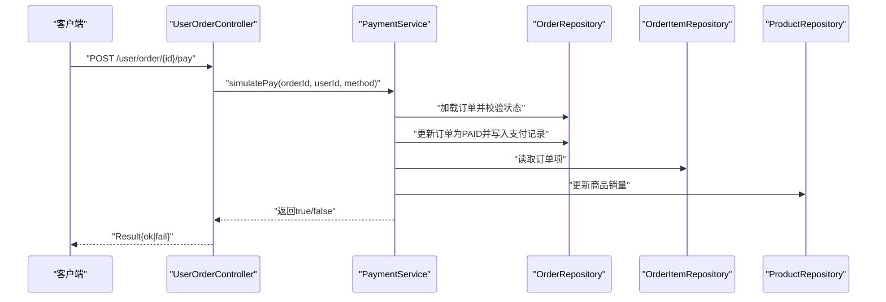
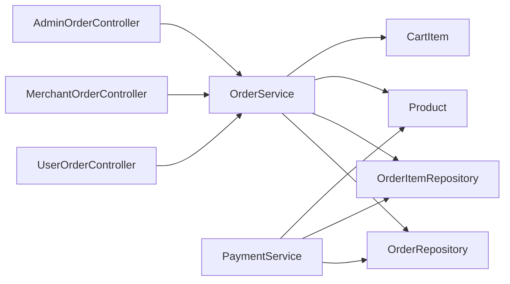

# 订单管理

<cite>
**本文引用的文件**
- [MallApplication.java](file://backend/src/main/java/com/mall/MallApplication.java)
- [application.yml](file://backend/src/main/resources/application.yml)
- [UserOrderController.java](file://backend/src/main/java/com/mall/controller/user/UserOrderController.java)
- [AdminOrderController.java](file://backend/src/main/java/com/mall/controller/admin/AdminOrderController.java)
- [MerchantOrderController.java](file://backend/src/main/java/com/mall/controller/merchant/MerchantOrderController.java)
- [OrderService.java](file://backend/src/main/java/com/mall/service/OrderService.java)
- [PaymentService.java](file://backend/src/main/java/com/mall/service/PaymentService.java)
- [Order.java](file://backend/src/main/java/com/mall/entity/Order.java)
- [OrderItem.java](file://backend/src/main/java/com/mall/entity/OrderItem.java)
- [Product.java](file://backend/src/main/java/com/mall/entity/Product.java)
- [CartItem.java](file://backend/src/main/java/com/mall/entity/CartItem.java)
- [OrderRepository.java](file://backend/src/main/java/com/mall/repository/OrderRepository.java)
- [OrderItemRepository.java](file://backend/src/main/java/com/mall/repository/OrderItemRepository.java)
- [CartItemRequest.java](file://backend/src/main/java/com/mall/dto/CartItemRequest.java)
</cite>

## 目录
1. [简介](#简介)
2. [项目结构](#项目结构)
3. [核心组件](#核心组件)
4. [架构总览](#架构总览)
5. [详细组件分析](#详细组件分析)
6. [依赖分析](#依赖分析)
7. [性能考虑](#性能考虑)
8. [故障排查指南](#故障排查指南)
9. [结论](#结论)
10. [附录](#附录)

## 简介
本技术文档聚焦于电商商城系统的“订单管理”模块，围绕订单创建、库存扣减、订单号生成、状态管理、查询能力、取消与退款机制、以及并发与异常处理等方面进行系统化梳理。文档同时给出关键流程的时序图与类图，帮助开发者快速理解与扩展。

## 项目结构
后端采用 Spring Boot + JPA 的分层架构，订单相关代码主要分布在以下层次：
- 控制器层：用户、运营、管理端的订单接口
- 服务层：订单业务编排、状态流转、退款与库存回补
- 数据访问层：JPA 仓库接口
- 实体层：订单、订单项、商品、购物车等核心模型
- 配置：数据源、JPA、日志、JWT 等

图表来源
- [UserOrderController.java:19-198](file://backend/src/main/java/com/mall/controller/user/UserOrderController.java#L19-L198)
- [MerchantOrderController.java:20-100](file://backend/src/main/java/com/mall/controller/merchant/MerchantOrderController.java#L20-L100)
- [AdminOrderController.java:17-45](file://backend/src/main/java/com/mall/controller/admin/AdminOrderController.java#L17-L45)
- [OrderService.java:23-280](file://backend/src/main/java/com/mall/service/OrderService.java#L23-L280)
- [PaymentService.java:18-67](file://backend/src/main/java/com/mall/service/PaymentService.java#L18-L67)
- [OrderRepository.java:13-27](file://backend/src/main/java/com/mall/repository/OrderRepository.java#L13-L27)
- [OrderItemRepository.java:9-19](file://backend/src/main/java/com/mall/repository/OrderItemRepository.java#L9-L19)
- [Order.java:9-83](file://backend/src/main/java/com/mall/entity/Order.java#L9-L83)
- [OrderItem.java:9-73](file://backend/src/main/java/com/mall/entity/OrderItem.java#L9-L73)
- [Product.java:9-101](file://backend/src/main/java/com/mall/entity/Product.java#L9-L101)
- [CartItem.java:8-50](file://backend/src/main/java/com/mall/entity/CartItem.java#L8-L50)

章节来源
- [MallApplication.java:1-13](file://backend/src/main/java/com/mall/MallApplication.java#L1-L13)
- [application.yml:1-36](file://backend/src/main/resources/application.yml#L1-L36)

## 核心组件
- 订单实体与订单项实体：承载订单状态、金额、收货信息、退款状态等字段，并通过 JPA 映射持久化。
- 订单仓库与订单项仓库：提供按用户、运营、分页等维度的查询能力。
- 订单服务：实现从购物车创建订单、库存扣减、状态更新、取消与库存回补、退款申请与审批等核心业务。
- 支付服务：模拟支付，完成状态变更、支付记录落库与销量更新。
- 控制器层：暴露用户、运营、管理端的订单接口，统一返回 Result 包装。

章节来源
- [Order.java:16-83](file://backend/src/main/java/com/mall/entity/Order.java#L16-L83)
- [OrderItem.java:16-73](file://backend/src/main/java/com/mall/entity/OrderItem.java#L16-L73)
- [OrderRepository.java:13-27](file://backend/src/main/java/com/mall/repository/OrderRepository.java#L13-L27)
- [OrderItemRepository.java:9-19](file://backend/src/main/java/com/mall/repository/OrderItemRepository.java#L9-L19)
- [OrderService.java:23-280](file://backend/src/main/java/com/mall/service/OrderService.java#L23-L280)
- [PaymentService.java:18-67](file://backend/src/main/java/com/mall/service/PaymentService.java#L18-L67)
- [UserOrderController.java:19-198](file://backend/src/main/java/com/mall/controller/user/UserOrderController.java#L19-L198)
- [MerchantOrderController.java:20-100](file://backend/src/main/java/com/mall/controller/merchant/MerchantOrderController.java#L20-L100)
- [AdminOrderController.java:17-45](file://backend/src/main/java/com/mall/controller/admin/AdminOrderController.java#L17-L45)

## 架构总览
订单管理模块遵循典型的 MVC + 服务层模式，控制器负责请求接入与鉴权，服务层封装业务规则，仓库层负责数据持久化。事务边界在服务层通过注解声明，确保库存扣减、状态更新、退款审批等关键路径的一致性。

图表来源
- [UserOrderController.java:19-198](file://backend/src/main/java/com/mall/controller/user/UserOrderController.java#L19-L198)
- [MerchantOrderController.java:20-100](file://backend/src/main/java/com/mall/controller/merchant/MerchantOrderController.java#L20-L100)
- [AdminOrderController.java:17-45](file://backend/src/main/java/com/mall/controller/admin/AdminOrderController.java#L17-L45)
- [OrderService.java:23-280](file://backend/src/main/java/com/mall/service/OrderService.java#L23-L280)
- [PaymentService.java:18-67](file://backend/src/main/java/com/mall/service/PaymentService.java#L18-L67)
- [OrderRepository.java:13-27](file://backend/src/main/java/com/mall/repository/OrderRepository.java#L13-L27)
- [OrderItemRepository.java:9-19](file://backend/src/main/java/com/mall/repository/OrderItemRepository.java#L9-L19)

## 详细组件分析

### 订单创建流程（从购物车生成订单）
- 输入：当前用户、商户、收货人信息、收货地址
- 关键步骤：
  - 读取用户购物车中属于该商户的商品
  - 校验商品库存是否充足，否则抛出异常
  - 计算订单总金额，构建订单项
  - 生成唯一订单号（包含时间戳与随机片段）
  - 保存订单与订单项，扣减对应商品库存
  - 清空购物车中已下单的商品
- 并发与一致性：使用事务包裹，确保库存扣减与订单落库原子性

图表来源
- [UserOrderController.java:33-50](file://backend/src/main/java/com/mall/controller/user/UserOrderController.java#L33-L50)
- [OrderService.java:33-88](file://backend/src/main/java/com/mall/service/OrderService.java#L33-L88)
- [OrderRepository.java:13-27](file://backend/src/main/java/com/mall/repository/OrderRepository.java#L13-L27)
- [OrderItemRepository.java:9-19](file://backend/src/main/java/com/mall/repository/OrderItemRepository.java#L9-L19)
- [Product.java:68-74](file://backend/src/main/java/com/mall/entity/Product.java#L68-L74)

章节来源
- [OrderService.java:33-88](file://backend/src/main/java/com/mall/service/OrderService.java#L33-L88)
- [Order.java:31-33](file://backend/src/main/java/com/mall/entity/Order.java#L31-L33)
- [OrderItem.java:37-38](file://backend/src/main/java/com/mall/entity/OrderItem.java#L37-L38)

### 订单状态管理机制
- 支持的状态：PENDING（待支付）、PAID（已支付）、SHIPPED（已发货）、RECEIVED（已收货）、COMPLETED（已完成，用户侧）、CANCELLED（已取消）、REFUND_REQUESTED（退款中）、REFUNDED（已退款）
- 状态流转规则（基于控制器与服务层约束）：
  - 用户侧：PENDING → PAID（支付成功）；PAID → SHIPPED（运营发货）；SHIPPED → RECEIVED（用户确认收货）；RECEIVED → COMPLETED（完成评价）；PENDING/PAID/SHIPPED → CANCELLED（用户取消）
  - 运营侧：仅对已支付订单可发货；仅对退款申请中的订单可同意退款
  - 退款：RECEIVED/REFUND_REQUESTED → REFUND_REQUESTED（单项或批量申请）；单项同意退款后若全部项已退款，则订单整体变为 REFUNDED

图表来源
- [UserOrderController.java:102-133](file://backend/src/main/java/com/mall/controller/user/UserOrderController.java#L102-L133)
- [MerchantOrderController.java:61-85](file://backend/src/main/java/com/mall/controller/merchant/MerchantOrderController.java#L61-L85)
- [OrderService.java:115-161](file://backend/src/main/java/com/mall/service/OrderService.java#L115-L161)

章节来源
- [Order.java:31-33](file://backend/src/main/java/com/mall/entity/Order.java#L31-L33)
- [OrderItem.java:50-52](file://backend/src/main/java/com/mall/entity/OrderItem.java#L50-L52)
- [UserOrderController.java:102-133](file://backend/src/main/java/com/mall/controller/user/UserOrderController.java#L102-L133)
- [MerchantOrderController.java:61-85](file://backend/src/main/java/com/mall/controller/merchant/MerchantOrderController.java#L61-L85)
- [OrderService.java:115-161](file://backend/src/main/java/com/mall/service/OrderService.java#L115-L161)

### 订单查询功能
- 用户维度：按用户 ID 分页查询，按创建时间倒序
- 商户维度：按商户 ID 分页查询，按创建时间倒序
- 全站维度：管理员分页查询所有订单
- 订单详情：返回订单与订单项集合，便于前端展示

图表来源
- [UserOrderController.java:52-86](file://backend/src/main/java/com/mall/controller/user/UserOrderController.java#L52-L86)
- [OrderService.java:95-113](file://backend/src/main/java/com/mall/service/OrderService.java#L95-L113)
- [OrderRepository.java:17-21](file://backend/src/main/java/com/mall/repository/OrderRepository.java#L17-L21)
- [OrderItemRepository.java:11-14](file://backend/src/main/java/com/mall/repository/OrderItemRepository.java#L11-L14)

章节来源
- [OrderRepository.java:17-21](file://backend/src/main/java/com/mall/repository/OrderRepository.java#L17-L21)
- [OrderItemRepository.java:11-14](file://backend/src/main/java/com/mall/repository/OrderItemRepository.java#L11-L14)
- [OrderService.java:95-113](file://backend/src/main/java/com/mall/service/OrderService.java#L95-L113)
- [UserOrderController.java:52-86](file://backend/src/main/java/com/mall/controller/user/UserOrderController.java#L52-L86)
- [AdminOrderController.java:25-31](file://backend/src/main/java/com/mall/controller/admin/AdminOrderController.java#L25-L31)

### 订单取消机制（用户取消与库存回补）
- 触发条件：仅在订单处于可取消状态（非 RECEIVED、REFUND_REQUESTED、REFUNDED，且非已取消）时允许取消
- 处理流程：遍历订单项，将对应商品库存回补，设置订单状态为 CANCELLED
- 事务性：使用事务保证库存回补与状态更新的原子性

图表来源
- [OrderService.java:123-145](file://backend/src/main/java/com/mall/service/OrderService.java#L123-L145)

章节来源
- [OrderService.java:123-145](file://backend/src/main/java/com/mall/service/OrderService.java#L123-L145)

### 退款申请与审批
- 申请入口：
  - 整单申请：仅对已收货订单发起，状态置为 REFUND_REQUESTED
  - 单项申请：对已收货或退款申请中订单发起，单项标记 REFUND_REQUESTED；当所有项均申请/已退款时，订单整体同步为 REFUND_REQUESTED
  - 批量申请：支持部分数量退款，必要时拆分子订单项
- 审批入口（运营）：同意单项退款，若所有有申请的项均已退款，则订单整体变为 REFUNDED

图表来源
- [UserOrderController.java:146-168](file://backend/src/main/java/com/mall/controller/user/UserOrderController.java#L146-L168)
- [OrderService.java:147-185](file://backend/src/main/java/com/mall/service/OrderService.java#L147-L185)

章节来源
- [OrderService.java:147-278](file://backend/src/main/java/com/mall/service/OrderService.java#L147-L278)
- [OrderItem.java:50-52](file://backend/src/main/java/com/mall/entity/OrderItem.java#L50-L52)

### 支付流程（模拟支付）
- 触发条件：订单状态必须为 PENDING
- 处理流程：设置支付方式、支付时间、实付金额，状态变更为 PAID；写入支付记录；更新商品销量

图表来源
- [UserOrderController.java:102-111](file://backend/src/main/java/com/mall/controller/user/UserOrderController.java#L102-L111)
- [PaymentService.java:30-65](file://backend/src/main/java/com/mall/service/PaymentService.java#L30-L65)
- [OrderRepository.java:15-16](file://backend/src/main/java/com/mall/repository/OrderRepository.java#L15-L16)
- [OrderItemRepository.java:11-14](file://backend/src/main/java/com/mall/repository/OrderItemRepository.java#L11-L14)
- [Product.java](file://backend/src/main/java/com/mall/entity/Product.java#L74)

章节来源
- [PaymentService.java:30-65](file://backend/src/main/java/com/mall/service/PaymentService.java#L30-L65)
- [Order.java:42-45](file://backend/src/main/java/com/mall/entity/Order.java#L42-L45)

### 订单号生成策略
- 采用“固定前缀 + 时间戳 + 随机片段”的组合，保证全局唯一性与可读性（包含创建时间信息）

章节来源
- [OrderService.java](file://backend/src/main/java/com/mall/service/OrderService.java#L65)

## 依赖分析
- 控制器依赖服务层，服务层依赖仓库层与实体模型
- 订单服务与支付服务共同依赖订单与订单项仓库，以及商品仓库
- 仓库层基于 JPA 提供分页查询与条件查询能力

图表来源
- [UserOrderController.java:25-26](file://backend/src/main/java/com/mall/controller/user/UserOrderController.java#L25-L26)
- [MerchantOrderController.java:26-27](file://backend/src/main/java/com/mall/controller/merchant/MerchantOrderController.java#L26-L27)
- [AdminOrderController.java](file://backend/src/main/java/com/mall/controller/admin/AdminOrderController.java#L23)
- [OrderService.java:28-31](file://backend/src/main/java/com/mall/service/OrderService.java#L28-L31)
- [PaymentService.java:25-28](file://backend/src/main/java/com/mall/service/PaymentService.java#L25-L28)

章节来源
- [OrderRepository.java:13-27](file://backend/src/main/java/com/mall/repository/OrderRepository.java#L13-L27)
- [OrderItemRepository.java:9-19](file://backend/src/main/java/com/mall/repository/OrderItemRepository.java#L9-L19)
- [OrderService.java:28-31](file://backend/src/main/java/com/mall/service/OrderService.java#L28-L31)
- [PaymentService.java:25-28](file://backend/src/main/java/com/mall/service/PaymentService.java#L25-L28)

## 性能考虑
- 分页查询：优先使用仓库提供的分页方法，避免一次性加载大量订单
- 批量操作：退款批量申请时建议限制单次申请的商品数量，避免大事务
- 缓存策略：对商品库存与价格可引入缓存，但需注意与数据库的一致性
- 并发控制：库存扣减与回补使用数据库行级锁与事务隔离，避免超卖与重复回补
- 日志与监控：对关键状态变更与异常场景增加日志埋点，便于问题定位

## 故障排查指南
- 创建订单失败：检查购物车中是否存在商户商品、商品库存是否充足、是否触发库存不足异常
- 支付失败：确认订单状态为 PENDING，支付方式合法，以及支付服务返回值
- 取消订单失败：确认订单状态是否允许取消（非 RECEIVED、REFUND_REQUESTED、REFUNDED），是否已取消
- 退款异常：核对订单状态是否为 RECEIVED 或 REFUND_REQUESTED，单项数量是否合法，是否正确触发订单整体状态同步
- 查询无数据：确认分页参数与权限（用户/商户/管理员）是否匹配

章节来源
- [OrderService.java:49-51](file://backend/src/main/java/com/mall/service/OrderService.java#L49-L51)
- [PaymentService.java:32-36](file://backend/src/main/java/com/mall/service/PaymentService.java#L32-L36)
- [OrderService.java:127-133](file://backend/src/main/java/com/mall/service/OrderService.java#L127-L133)
- [OrderService.java:153-154](file://backend/src/main/java/com/mall/service/OrderService.java#L153-L154)
- [OrderService.java:194-196](file://backend/src/main/java/com/mall/service/OrderService.java#L194-L196)

## 结论
订单管理模块通过清晰的分层设计与严格的事务边界，实现了从购物车下单、库存扣减、支付、发货、收货、取消与退款的完整闭环。建议在生产环境中进一步完善并发控制、缓存一致性与可观测性建设，以提升系统稳定性与用户体验。

## 附录
- 订单状态映射（用户侧界面显示）：PENDING→待付款、PAID→已付款、SHIPPED→已发货、RECEIVED→已完成、CANCELLED→已取消、REFUND_REQUESTED→退款中、REFUNDED→已退款
- 支付方式映射：WECHAT→微信支付、ALIPAY→支付宝、CARD→银行卡、COD→货到付款