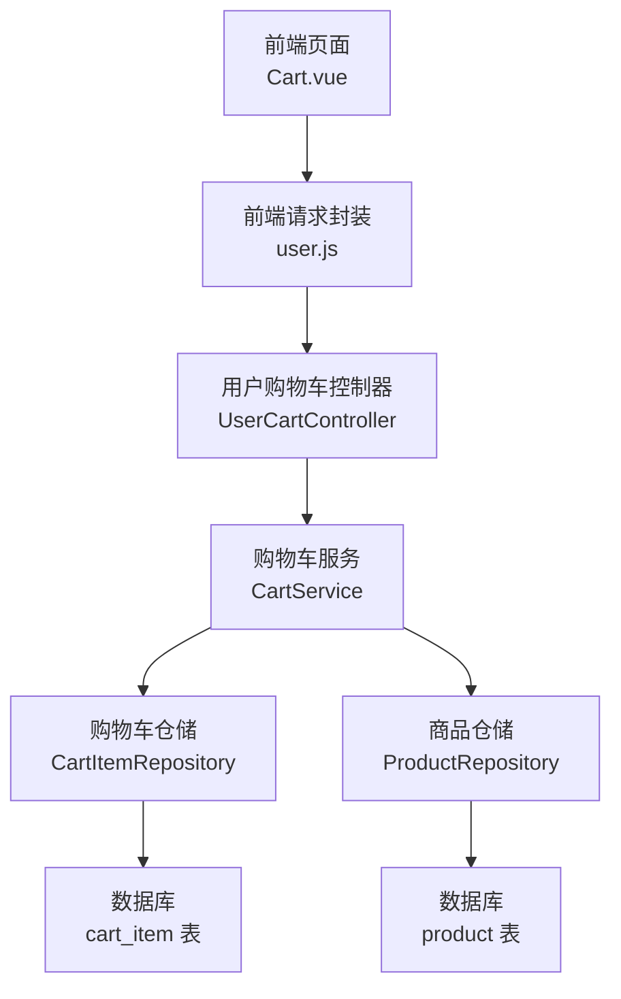
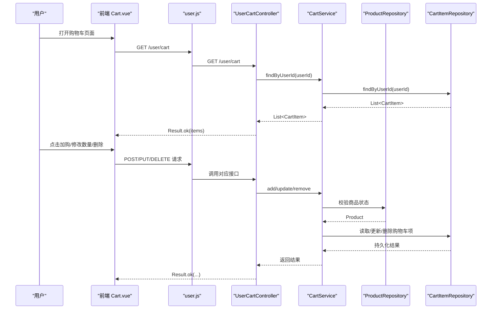
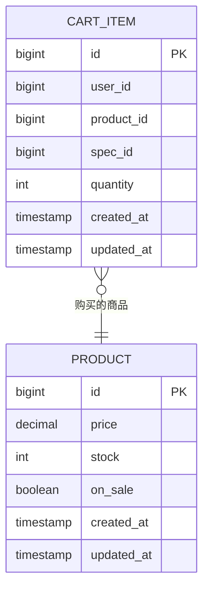
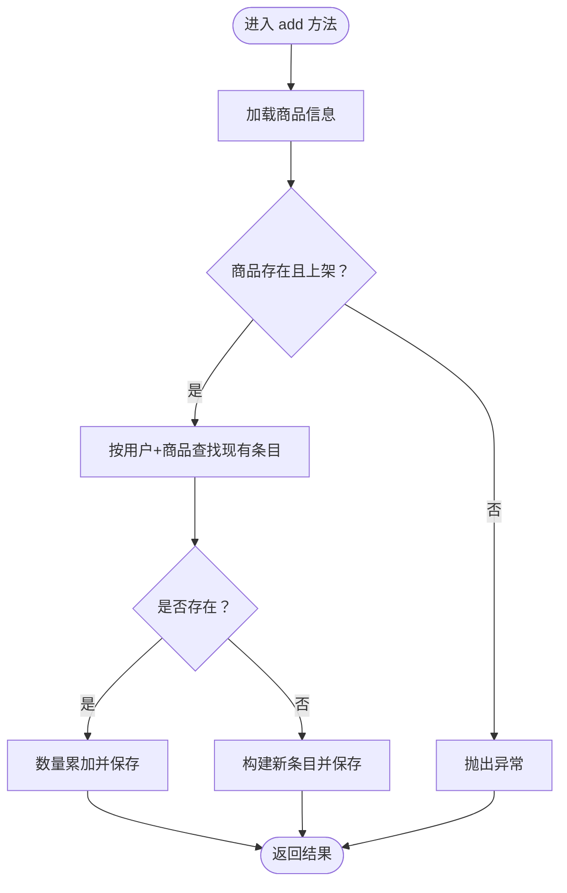
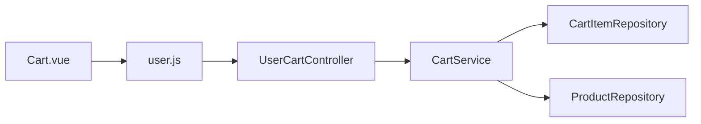

# 购物车管理

<cite>
**本文引用的文件**
- [UserCartController.java](file://backend/src/main/java/com/mall/controller/user/UserCartController.java)
- [CartService.java](file://backend/src/main/java/com/mall/service/CartService.java)
- [CartItemRepository.java](file://backend/src/main/java/com/mall/repository/CartItemRepository.java)
- [CartItem.java](file://backend/src/main/java/com/mall/entity/CartItem.java)
- [CartItemDTO.java](file://backend/src/main/java/com/mall/dto/CartItemDTO.java)
- [CartItemRequest.java](file://backend/src/main/java/com/mall/dto/CartItemRequest.java)
- [Product.java](file://backend/src/main/java/com/mall/entity/Product.java)
- [ProductRepository.java](file://backend/src/main/java/com/mall/repository/ProductRepository.java)
- [application.yml](file://backend/src/main/resources/application.yml)
- [Cart.vue](file://frontend/src/views/user/Cart.vue)
- [user.js](file://frontend/src/api/user.js)
</cite>

## 目录
1. [简介](#简介)
2. [项目结构](#项目结构)
3. [核心组件](#核心组件)
4. [架构总览](#架构总览)
5. [详细组件分析](#详细组件分析)
6. [依赖分析](#依赖分析)
7. [性能考虑](#性能考虑)
8. [故障排查指南](#故障排查指南)
9. [结论](#结论)
10. [附录](#附录)

## 简介
本技术文档围绕电商商城系统的“购物车管理”模块展开，系统性阐述购物车商品添加、数量修改、删除等核心操作的实现逻辑；解释购物车数据持久化策略（用户会话与数据存储）、数据清理机制；明确购物车与商品库存的关联关系及库存不足时的处理策略；给出购物车数据结构设计、索引优化与查询性能提升方案；并覆盖购物车清空、合并等高级功能的实现细节与使用场景。

## 项目结构
后端采用 Spring Boot + JPA 的分层架构，前端基于 Vue 3 + Element Plus 构建用户界面。购物车模块涉及控制器、服务、仓储、实体与 DTO，前后端通过 REST 接口交互。

图表来源
- [UserCartController.java:14-66](file://backend/src/main/java/com/mall/controller/user/UserCartController.java#L14-L66)
- [CartService.java:14-61](file://backend/src/main/java/com/mall/service/CartService.java#L14-L61)
- [CartItemRepository.java:9-20](file://backend/src/main/java/com/mall/repository/CartItemRepository.java#L9-L20)
- [ProductRepository.java:13-124](file://backend/src/main/java/com/mall/repository/ProductRepository.java#L13-L124)

章节来源
- [UserCartController.java:14-66](file://backend/src/main/java/com/mall/controller/user/UserCartController.java#L14-L66)
- [application.yml:1-36](file://backend/src/main/resources/application.yml#L1-L36)

## 核心组件
- 控制器层：提供用户购物车的查询、添加、修改数量、删除等 REST 接口，统一接收认证上下文并转换为用户标识。
- 服务层：封装购物车业务逻辑，负责与商品库存校验、购物车记录读写协调。
- 仓储层：基于 JPA 提供购物车与商品的查询、删除等操作。
- 实体层：定义购物车条目与商品的数据模型，含时间戳与唯一约束。
- DTO 层：用于接口返回与请求参数的轻量对象。
- 前端层：提供购物车页面、数量变更、删除、下单流程等交互。

章节来源
- [UserCartController.java:27-65](file://backend/src/main/java/com/mall/controller/user/UserCartController.java#L27-L65)
- [CartService.java:21-60](file://backend/src/main/java/com/mall/service/CartService.java#L21-L60)
- [CartItemRepository.java:11-19](file://backend/src/main/java/com/mall/repository/CartItemRepository.java#L11-L19)
- [ProductRepository.java:17-30](file://backend/src/main/java/com/mall/repository/ProductRepository.java#L17-L30)
- [CartItem.java:8-49](file://backend/src/main/java/com/mall/entity/CartItem.java#L8-L49)
- [Product.java:9-100](file://backend/src/main/java/com/mall/entity/Product.java#L9-L100)
- [CartItemDTO.java:11-32](file://backend/src/main/java/com/mall/dto/CartItemDTO.java#L11-L32)
- [CartItemRequest.java:9-16](file://backend/src/main/java/com/mall/dto/CartItemRequest.java#L9-L16)
- [Cart.vue:375-479](file://frontend/src/views/user/Cart.vue#L375-L479)
- [user.js:18-36](file://frontend/src/api/user.js#L18-L36)

## 架构总览
购物车模块遵循典型的 MVC 分层与领域驱动设计：
- 控制器接收请求，解析用户身份，调用服务层。
- 服务层进行业务校验（商品状态、库存），更新或新增购物车记录。
- 仓储层通过 JPA 操作数据库，确保事务一致性。
- 前端通过 API 获取购物车列表，实时展示与交互。

图表来源
- [UserCartController.java:27-65](file://backend/src/main/java/com/mall/controller/user/UserCartController.java#L27-L65)
- [CartService.java:25-60](file://backend/src/main/java/com/mall/service/CartService.java#L25-L60)
- [ProductRepository.java:27-30](file://backend/src/main/java/com/mall/repository/ProductRepository.java#L27-L30)
- [CartItemRepository.java:11-19](file://backend/src/main/java/com/mall/repository/CartItemRepository.java#L11-L19)
- [Cart.vue:375-479](file://frontend/src/views/user/Cart.vue#L375-L479)
- [user.js:18-36](file://frontend/src/api/user.js#L18-L36)

## 详细组件分析

### 数据模型与结构设计
- 购物车条目实体包含用户标识、商品标识、规格标识、数量与时间戳字段，并在持久化与更新前自动填充时间戳。
- 商品实体包含价格、库存、上下架状态等关键字段，用于购物车业务校验。
- 购物车表具有“用户+商品+规格”的唯一约束，避免重复添加同规格商品。

图表来源
- [CartItem.java:17-48](file://backend/src/main/java/com/mall/entity/CartItem.java#L17-L48)
- [Product.java:18-99](file://backend/src/main/java/com/mall/entity/Product.java#L18-L99)

章节来源
- [CartItem.java:8-49](file://backend/src/main/java/com/mall/entity/CartItem.java#L8-L49)
- [Product.java:9-100](file://backend/src/main/java/com/mall/entity/Product.java#L9-L100)

### 控制器与接口定义
- 查询购物车：GET /user/cart
- 添加商品：POST /user/cart/add
- 修改数量：PUT /user/cart/quantity
- 删除商品：DELETE /user/cart/{productId}

控制器从认证上下文中提取当前用户 ID，并将请求参数传递给服务层执行业务逻辑。

章节来源
- [UserCartController.java:27-65](file://backend/src/main/java/com/mall/controller/user/UserCartController.java#L27-L65)

### 服务层核心逻辑
- 查询：按用户 ID 查询购物车列表。
- 添加：校验商品存在且处于上架状态；若已存在相同商品则累加数量，否则新建购物车项。
- 修改数量：数量小于等于 0 时直接删除该项；否则更新数量。
- 删除：按用户与商品 ID 删除购物车项。

图表来源
- [CartService.java:25-43](file://backend/src/main/java/com/mall/service/CartService.java#L25-L43)

章节来源
- [CartService.java:21-60](file://backend/src/main/java/com/mall/service/CartService.java#L21-L60)

### 仓储层与数据持久化
- 购物车仓储提供按用户 ID 查询、按用户+商品+规格查询、按用户+商品删除、按用户删除等方法。
- 商品仓储提供多种查询方法，包括公开上架商品、按分类与商家筛选等，便于前端展示与校验。

章节来源
- [CartItemRepository.java:11-19](file://backend/src/main/java/com/mall/repository/CartItemRepository.java#L11-L19)
- [ProductRepository.java:17-30](file://backend/src/main/java/com/mall/repository/ProductRepository.java#L17-L30)

### 前端交互与使用场景
- 页面加载时拉取购物车列表，并并发请求商品详情以渲染单价、图片、名称等。
- 数量变更通过 PUT 接口更新，删除通过 DELETE 接口移除。
- 结算流程从前端收集收货信息与支付方式，提交后进入支付流程。

章节来源
- [Cart.vue:375-479](file://frontend/src/views/user/Cart.vue#L375-L479)
- [user.js:18-36](file://frontend/src/api/user.js#L18-L36)

### 购物车与库存的关联关系
- 在添加商品时，服务层会检查商品是否存在且处于上架状态；虽然未直接校验库存，但结合商品实体的库存字段，可在后续下单环节统一校验。
- 若需要在购物车阶段限制购买数量，可在服务层增加库存校验逻辑，例如比较请求数量与库存余量。

章节来源
- [CartService.java:27-28](file://backend/src/main/java/com/mall/service/CartService.java#L27-L28)
- [Product.java:70](file://backend/src/main/java/com/mall/entity/Product.java#L70)

### 数据清理机制
- 当购物车数量更新为 0 或以下时，服务层会删除该条目，实现自动清理。
- 可扩展策略：按用户维度定期清理长时间未使用的购物车项，或在用户注销/切换账号时迁移/清理。

章节来源
- [CartService.java:47-54](file://backend/src/main/java/com/mall/service/CartService.java#L47-L54)

### 高级功能：清空与合并
- 清空：可新增清空接口，调用按用户删除所有购物车项的方法。
- 合并：可新增合并接口，将临时会话中的购物车与登录后的购物车合并，依据唯一约束避免重复。

章节来源
- [CartItemRepository.java:19](file://backend/src/main/java/com/mall/repository/CartItemRepository.java#L19)

## 依赖分析
- 控制器依赖服务层；服务层依赖两个仓储；仓储依赖数据库。
- 前端通过统一请求封装调用后端接口。

图表来源
- [UserCartController.java:20](file://backend/src/main/java/com/mall/controller/user/UserCartController.java#L20)
- [CartService.java:18-19](file://backend/src/main/java/com/mall/service/CartService.java#L18-L19)
- [CartItemRepository.java:9](file://backend/src/main/java/com/mall/repository/CartItemRepository.java#L9)
- [ProductRepository.java:13](file://backend/src/main/java/com/mall/repository/ProductRepository.java#L13)
- [user.js:18-36](file://frontend/src/api/user.js#L18-L36)

章节来源
- [UserCartController.java:14-66](file://backend/src/main/java/com/mall/controller/user/UserCartController.java#L14-L66)
- [CartService.java:14-61](file://backend/src/main/java/com/mall/service/CartService.java#L14-L61)
- [CartItemRepository.java:9-20](file://backend/src/main/java/com/mall/repository/CartItemRepository.java#L9-L20)
- [ProductRepository.java:13-124](file://backend/src/main/java/com/mall/repository/ProductRepository.java#L13-L124)
- [user.js:18-36](file://frontend/src/api/user.js#L18-L36)

## 性能考虑
- 数据库层面
  - 为 cart_item 表建立复合索引：(user_id, product_id, spec_id)，以支持唯一约束与高频查询。
  - 对 user_id 建立单独索引，优化按用户查询。
- 服务层层面
  - 批量操作建议使用批量查询与批量更新，减少往返次数。
  - 对频繁访问的商品详情，可在服务层引入缓存（如 Redis）以降低数据库压力。
- 前端层面
  - 列表渲染时采用虚拟滚动与懒加载，减少 DOM 压力。
  - 并发请求商品详情时使用 Promise.all，缩短首屏等待时间。

章节来源
- [CartItem.java:9](file://backend/src/main/java/com/mall/entity/CartItem.java#L9)
- [Cart.vue:375-393](file://frontend/src/views/user/Cart.vue#L375-L393)

## 故障排查指南
- 添加商品失败
  - 检查商品是否存在且处于上架状态；确认请求参数 productId、quantity 正确。
  - 查看服务层异常信息与控制器返回的错误码。
- 数量更新无效
  - 确认 quantity 大于 0；若为 0 或以下，服务层会直接删除该项。
- 删除失败
  - 确认 productId 与当前用户匹配；检查仓储删除条件是否正确。
- 前端显示异常
  - 检查 /user/cart 接口返回数据结构；确认前端并发请求商品详情是否成功。

章节来源
- [CartService.java:27-28](file://backend/src/main/java/com/mall/service/CartService.java#L27-L28)
- [CartService.java:47-54](file://backend/src/main/java/com/mall/service/CartService.java#L47-L54)
- [UserCartController.java:39-44](file://backend/src/main/java/com/mall/controller/user/UserCartController.java#L39-L44)
- [Cart.vue:375-479](file://frontend/src/views/user/Cart.vue#L375-L479)

## 结论
购物车模块通过清晰的分层设计与简洁的业务逻辑实现了核心功能：添加、数量修改、删除与查询。结合商品实体的库存与上下架状态，可在服务层进一步增强库存校验与购买限制。通过合理的数据库索引与缓存策略，可显著提升查询与交互性能。未来可扩展清空与合并等高级功能，以满足更复杂的业务场景。

## 附录
- 接口清单
  - GET /user/cart：查询当前用户购物车
  - POST /user/cart/add：添加商品到购物车
  - PUT /user/cart/quantity：更新购物车商品数量
  - DELETE /user/cart/{productId}：从购物车移除商品
- 关键配置
  - 数据源与 JPA 配置位于 application.yml，包含数据库连接、方言与 DDL 自动更新策略。

章节来源
- [UserCartController.java:27-65](file://backend/src/main/java/com/mall/controller/user/UserCartController.java#L27-L65)
- [application.yml:4-17](file://backend/src/main/resources/application.yml#L4-L17)