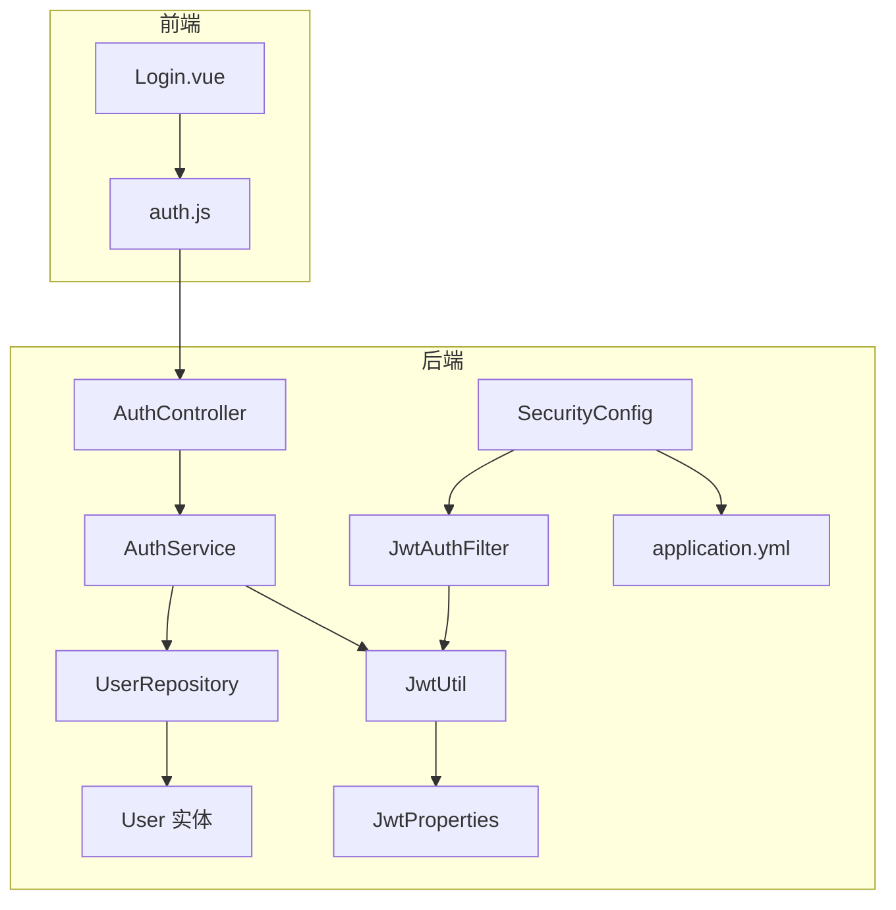
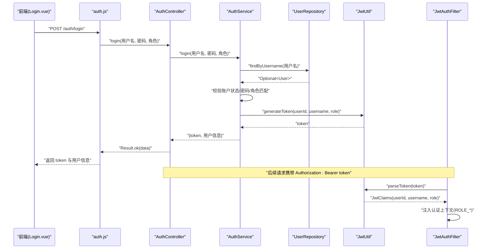
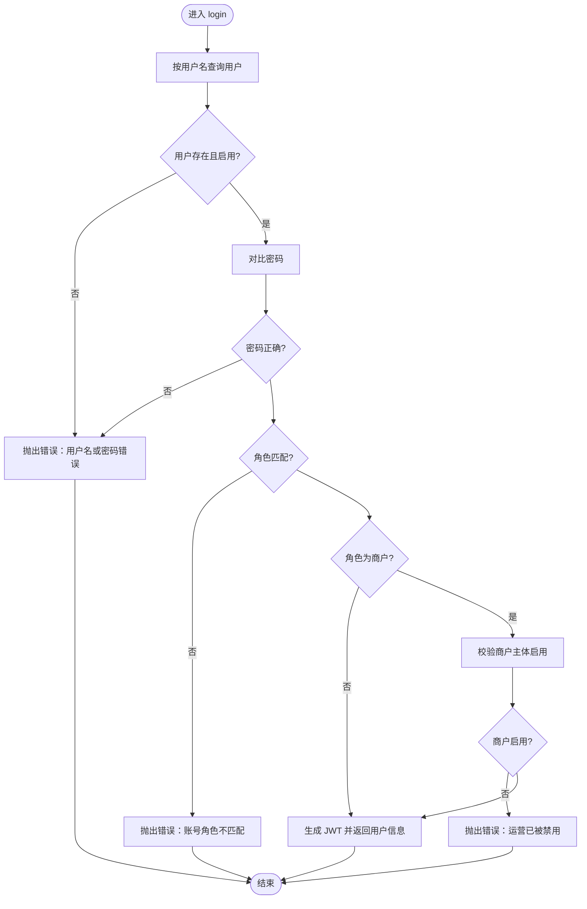
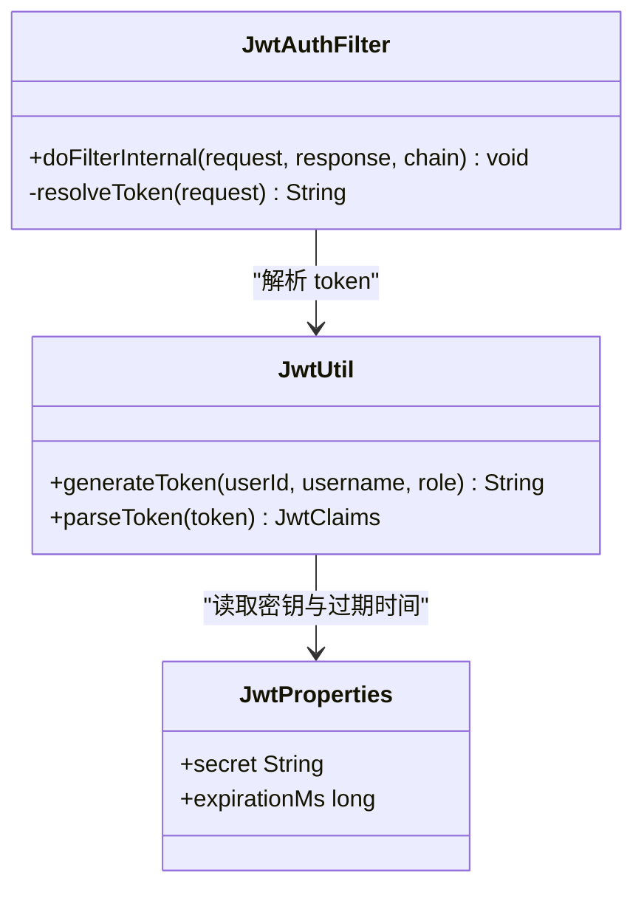
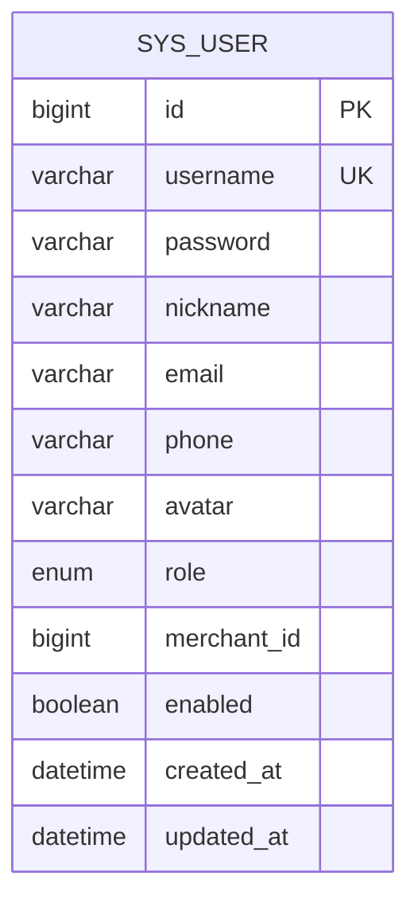
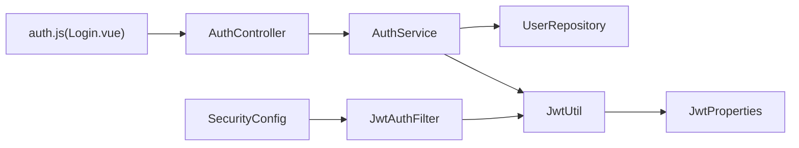

# 认证服务

<cite>
**本文引用的文件**
- [AuthController.java](file://backend/src/main/java/com/mall/controller/AuthController.java)
- [AuthService.java](file://backend/src/main/java/com/mall/service/AuthService.java)
- [JwtUtil.java](file://backend/src/main/java/com/mall/security/JwtUtil.java)
- [JwtAuthFilter.java](file://backend/src/main/java/com/mall/security/JwtAuthFilter.java)
- [SecurityConfig.java](file://backend/src/main/java/com/mall/config/SecurityConfig.java)
- [JwtProperties.java](file://backend/src/main/java/com/mall/config/JwtProperties.java)
- [Role.java](file://backend/src/main/java/com/mall/common/Role.java)
- [User.java](file://backend/src/main/java/com/mall/entity/User.java)
- [UserRepository.java](file://backend/src/main/java/com/mall/repository/UserRepository.java)
- [application.yml](file://backend/src/main/resources/application.yml)
- [Result.java](file://backend/src/main/java/com/mall/dto/Result.java)
- [auth.js](file://frontend/src/api/auth.js)
- [Login.vue](file://frontend/src/views/Login.vue)
</cite>

## 目录
1. [简介](#简介)
2. [项目结构](#项目结构)
3. [核心组件](#核心组件)
4. [架构总览](#架构总览)
5. [详细组件分析](#详细组件分析)
6. [依赖关系分析](#依赖关系分析)
7. [性能考量](#性能考量)
8. [故障排查指南](#故障排查指南)
9. [结论](#结论)
10. [附录](#附录)

## 简介
本文件面向电商商城系统的认证服务，系统性梳理用户注册、登录验证、密码加密、JWT 令牌生成与验证、角色授权、会话管理与安全策略等核心能力。文档同时覆盖前后端交互流程、API 接口定义、错误处理与安全注意事项，并以图示方式展示认证服务在控制器层、业务服务层与数据访问层之间的协作关系。

## 项目结构
认证服务位于后端 Java 工程中，采用分层架构组织：
- 控制器层：对外暴露 /auth 登录与注册接口
- 业务服务层：封装登录校验、注册流程、JWT 签发与校验
- 安全配置层：基于 Spring Security 的过滤器链、CORS、无状态会话策略
- 数据访问层：JPA Repository 访问用户实体
- 配置层：JWT 密钥与过期时间配置
- 前端层：通过统一请求模块调用认证接口

**图表来源**
- [AuthController.java:11-35](file://backend/src/main/java/com/mall/controller/AuthController.java#L11-L35)
- [AuthService.java:17-59](file://backend/src/main/java/com/mall/service/AuthService.java#L17-L59)
- [JwtAuthFilter.java:18-47](file://backend/src/main/java/com/mall/security/JwtAuthFilter.java#L18-L47)
- [JwtUtil.java:12-46](file://backend/src/main/java/com/mall/security/JwtUtil.java#L12-L46)
- [JwtProperties.java:12-17](file://backend/src/main/java/com/mall/config/JwtProperties.java#L12-L17)
- [UserRepository.java:10-18](file://backend/src/main/java/com/mall/repository/UserRepository.java#L10-L18)
- [application.yml:27-30](file://backend/src/main/resources/application.yml#L27-L30)

**章节来源**
- [AuthController.java:11-71](file://backend/src/main/java/com/mall/controller/AuthController.java#L11-L71)
- [SecurityConfig.java:22-54](file://backend/src/main/java/com/mall/config/SecurityConfig.java#L22-L54)
- [application.yml:27-30](file://backend/src/main/resources/application.yml#L27-L30)

## 核心组件
- 控制器层：提供 /auth/login 与 /auth/register 接口，负责参数校验与结果封装
- 业务服务层：执行用户查询、密码比对、角色匹配、商户主体有效性校验、JWT 生成与返回数据组装
- 安全配置层：无状态会话、CORS 允许、放行公开接口、按角色保护受控路径
- 安全工具层：JWT 生成与解析、密钥加载、过期时间配置
- 数据访问层：用户查询、去重校验、按角色/商户 ID 查询
- 前端接口层：统一请求模块封装认证 API 调用

**章节来源**
- [AuthController.java:18-71](file://backend/src/main/java/com/mall/controller/AuthController.java#L18-L71)
- [AuthService.java:27-90](file://backend/src/main/java/com/mall/service/AuthService.java#L27-L90)
- [SecurityConfig.java:33-54](file://backend/src/main/java/com/mall/config/SecurityConfig.java#L33-L54)
- [JwtUtil.java:23-46](file://backend/src/main/java/com/mall/security/JwtUtil.java#L23-L46)
- [UserRepository.java:10-18](file://backend/src/main/java/com/mall/repository/UserRepository.java#L10-L18)
- [auth.js:9-25](file://frontend/src/api/auth.js#L9-L25)

## 架构总览
认证服务遵循“控制器-服务-数据访问-安全”的分层设计，结合 Spring Security 的过滤器链实现无状态鉴权。JWT 在登录成功后签发，后续请求由过滤器解析并注入认证上下文，控制器根据角色路由到不同业务域。

**图表来源**
- [AuthController.java:18-35](file://backend/src/main/java/com/mall/controller/AuthController.java#L18-L35)
- [AuthService.java:27-59](file://backend/src/main/java/com/mall/service/AuthService.java#L27-L59)
- [UserRepository.java](file://backend/src/main/java/com/mall/repository/UserRepository.java#L12)
- [JwtUtil.java:23-44](file://backend/src/main/java/com/mall/security/JwtUtil.java#L23-L44)
- [JwtAuthFilter.java:30-46](file://backend/src/main/java/com/mall/security/JwtAuthFilter.java#L30-L46)
- [auth.js:14-15](file://frontend/src/api/auth.js#L14-L15)
- [Login.vue:470-530](file://frontend/src/views/Login.vue#L470-L530)

## 详细组件分析

### 控制器层：AuthController
- 登录接口：接收用户名、密码、角色，进行非空校验后委托服务层；异常统一包装为 Result 失败
- 注册接口：接收用户资料，进行必填项校验后调用服务层完成用户创建；异常统一包装为 Result 失败
- 返回体：使用 Result 统一结构，包含 code、message、data

**章节来源**
- [AuthController.java:18-71](file://backend/src/main/java/com/mall/controller/AuthController.java#L18-L71)
- [Result.java:10-22](file://backend/src/main/java/com/mall/dto/Result.java#L10-L22)

### 业务服务层：AuthService
- 登录流程：
  - 查询用户并检查启用状态
  - 使用 PasswordEncoder 对比明文与存储密码
  - 校验前端选择的角色与用户实际角色一致性
  - 商户角色需校验运营主体启用状态
  - 成功后调用 JwtUtil 生成 token，并返回用户完整信息
- 注册流程：
  - 校验用户名唯一性
  - 使用 PasswordEncoder 加密密码
  - 构建 USER 角色用户并持久化

**图表来源**
- [AuthService.java:27-59](file://backend/src/main/java/com/mall/service/AuthService.java#L27-L59)

**章节来源**
- [AuthService.java:27-90](file://backend/src/main/java/com/mall/service/AuthService.java#L27-L90)
- [UserRepository.java](file://backend/src/main/java/com/mall/repository/UserRepository.java#L12)
- [Role.java:3-7](file://backend/src/main/java/com/mall/common/Role.java#L3-L7)

### 安全工具层：JwtUtil 与 JwtAuthFilter
- JwtUtil：基于配置的密钥与过期时间生成与解析 JWT，返回 JwtClaims
- JwtAuthFilter：从请求头提取 Bearer Token，解析后注入 Spring Security 上下文，设置 ROLE_* 权限

**图表来源**
- [JwtUtil.java:12-46](file://backend/src/main/java/com/mall/security/JwtUtil.java#L12-L46)
- [JwtAuthFilter.java:18-56](file://backend/src/main/java/com/mall/security/JwtAuthFilter.java#L18-L56)
- [JwtProperties.java:12-17](file://backend/src/main/java/com/mall/config/JwtProperties.java#L12-L17)

**章节来源**
- [JwtUtil.java:23-46](file://backend/src/main/java/com/mall/security/JwtUtil.java#L23-L46)
- [JwtAuthFilter.java:30-46](file://backend/src/main/java/com/mall/security/JwtAuthFilter.java#L30-L46)
- [JwtProperties.java:15-16](file://backend/src/main/java/com/mall/config/JwtProperties.java#L15-L16)

### 安全配置层：SecurityConfig
- 无状态会话策略（STATELESS）
- 放行公开接口（/auth/**、部分静态资源）
- 按角色保护受控路径（/user/**、/merchant/**、/admin/**）
- 注入 JwtAuthFilter，在 UsernamePasswordAuthenticationFilter 前执行
- CORS 配置允许指定来源

**章节来源**
- [SecurityConfig.java:33-54](file://backend/src/main/java/com/mall/config/SecurityConfig.java#L33-L54)

### 数据模型与访问层
- User 实体：包含用户名、密码、昵称、性别、手机号、邮箱、角色、商户关联、启用状态等字段
- UserRepository：提供按用户名查询、唯一性校验、按角色与商户 ID 查询

**图表来源**
- [User.java:10-87](file://backend/src/main/java/com/mall/entity/User.java#L10-L87)
- [UserRepository.java:10-18](file://backend/src/main/java/com/mall/repository/UserRepository.java#L10-L18)

**章节来源**
- [User.java:17-87](file://backend/src/main/java/com/mall/entity/User.java#L17-L87)
- [UserRepository.java:10-18](file://backend/src/main/java/com/mall/repository/UserRepository.java#L10-L18)

### 前端交互与认证流程
- 前端通过 auth.js 调用 /auth/login 与 /auth/register
- 登录成功后，前端校验返回角色与选择一致，写入本地存储与全局状态，随后跳转对应角色页面
- 后续请求由前端统一携带 Authorization: Bearer token，交由后端 JwtAuthFilter 解析并注入认证上下文

**章节来源**
- [auth.js:14-25](file://frontend/src/api/auth.js#L14-L25)
- [Login.vue:470-530](file://frontend/src/views/Login.vue#L470-L530)

## 依赖关系分析
- 控制器依赖业务服务
- 业务服务依赖数据访问层、密码编码器、JWT 工具
- 安全配置依赖 JWT 过滤器
- JWT 工具依赖配置属性
- 前端依赖统一请求模块

**图表来源**
- [AuthController.java](file://backend/src/main/java/com/mall/controller/AuthController.java#L16)
- [AuthService.java:22-25](file://backend/src/main/java/com/mall/service/AuthService.java#L22-L25)
- [UserRepository.java](file://backend/src/main/java/com/mall/repository/UserRepository.java#L10)
- [JwtUtil.java](file://backend/src/main/java/com/mall/security/JwtUtil.java#L15)
- [JwtProperties.java:15-16](file://backend/src/main/java/com/mall/config/JwtProperties.java#L15-L16)
- [SecurityConfig.java:27-28](file://backend/src/main/java/com/mall/config/SecurityConfig.java#L27-L28)
- [JwtAuthFilter.java](file://backend/src/main/java/com/mall/security/JwtAuthFilter.java#L24)
- [auth.js:14-25](file://frontend/src/api/auth.js#L14-L25)

**章节来源**
- [AuthService.java:22-25](file://backend/src/main/java/com/mall/service/AuthService.java#L22-L25)
- [SecurityConfig.java:27-28](file://backend/src/main/java/com/mall/config/SecurityConfig.java#L27-L28)

## 性能考量
- 密码加密：使用 BCryptPasswordEncoder，具备自适应成本因子，兼顾安全性与性能
- JWT 过期：默认 24 小时，建议结合刷新策略与短期令牌实践优化用户体验
- 查询优化：UserRepository 提供按用户名与角色查询，注意索引与缓存策略
- 无状态：过滤器链解析 JWT，避免服务器端会话存储，提升横向扩展能力

[本节为通用指导，无需列出具体文件来源]

## 故障排查指南
- 登录失败（用户名或密码错误）：检查用户名是否存在、是否启用、密码是否正确
- 角色不匹配：确认前端选择的角色与用户实际角色一致
- 商户被禁用：检查商户主体启用状态
- JWT 解析异常：核对 Authorization 头格式（Bearer token）、密钥与过期时间配置
- CORS 问题：确认前端允许来源与凭证配置
- 注册重复用户名：确保用户名唯一性校验通过

**章节来源**
- [AuthService.java:30-46](file://backend/src/main/java/com/mall/service/AuthService.java#L30-L46)
- [JwtAuthFilter.java:34-44](file://backend/src/main/java/com/mall/security/JwtAuthFilter.java#L34-L44)
- [SecurityConfig.java:57-67](file://backend/src/main/java/com/mall/config/SecurityConfig.java#L57-L67)
- [application.yml:27-30](file://backend/src/main/resources/application.yml#L27-L30)

## 结论
认证服务以清晰的分层设计实现了用户注册、登录验证、密码加密与 JWT 鉴权，配合 Spring Security 的无状态策略与按角色保护，满足多角色场景下的安全需求。建议后续引入令牌刷新、密码复杂度策略与更细粒度的权限控制，持续提升安全性与可用性。

[本节为总结性内容，无需列出具体文件来源]

## 附录

### 认证 API 接口文档

- 登录接口
  - 方法与路径：POST /api/auth/login
  - 请求头：Content-Type: application/json
  - 请求参数：
    - username: string，必填
    - password: string，必填
    - role: enum，可选值为 ADMIN/MERCHANT/USER，必填
  - 响应数据：
    - token: string
    - userId: number
    - username: string
    - role: string
    - nickname: string
    - avatar: string
    - gender: string
    - merchantId: number|null
  - 错误码：400，消息为具体错误描述
  - 安全考虑：返回的 token 需妥善保管，建议 HTTPS 传输与安全存储

- 注册接口
  - 方法与路径：POST /api/auth/register
  - 请求头：Content-Type: application/json
  - 请求参数：
    - username: string，必填
    - password: string，必填
    - nickname: string，必填
    - gender: string，可选
    - email: string，可选
    - phone: string，可选
    - receiverName: string，可选
    - receiverPhone: string，可选
    - receiverAddress: string，可选
  - 响应数据：包含 message 字段的通用成功提示
  - 错误码：400，消息为具体错误描述
  - 安全考虑：密码经后端加密存储，前端不应记录明文

- 前端调用参考
  - 登录：auth.js 中 login(data) -> /auth/login
  - 注册：auth.js 中 register(data) -> /auth/register

**章节来源**
- [AuthController.java:18-71](file://backend/src/main/java/com/mall/controller/AuthController.java#L18-L71)
- [auth.js:14-25](file://frontend/src/api/auth.js#L14-L25)
- [Result.java:16-22](file://backend/src/main/java/com/mall/dto/Result.java#L16-L22)

### 安全机制与配置要点
- 密码加密：BCryptPasswordEncoder
- JWT 配置：密钥与过期时间来源于 application.yml
- 无状态会话：SessionCreationPolicy.STATELESS
- 角色授权：/user/** 需要 USER 角色，/merchant/** 需要 MERCHANT 角色，/admin/** 需要 ADMIN 角色
- CORS：允许本地开发环境来源与凭证

**章节来源**
- [SecurityConfig.java:33-54](file://backend/src/main/java/com/mall/config/SecurityConfig.java#L33-L54)
- [application.yml:27-30](file://backend/src/main/resources/application.yml#L27-L30)