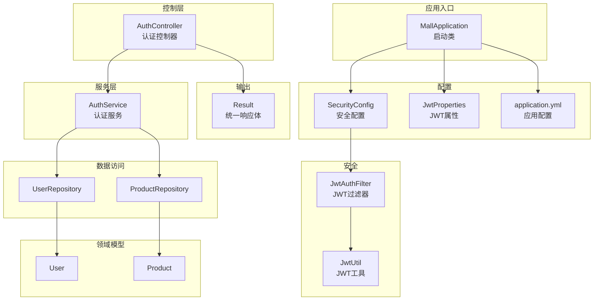
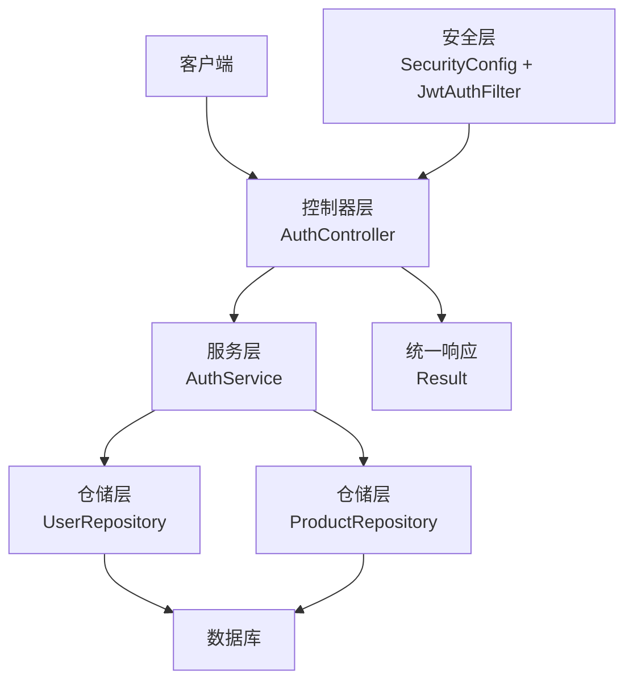
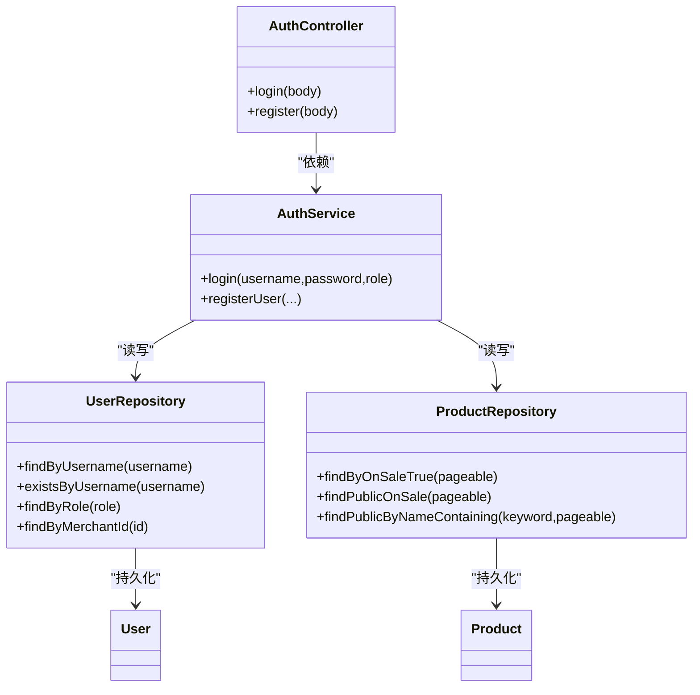
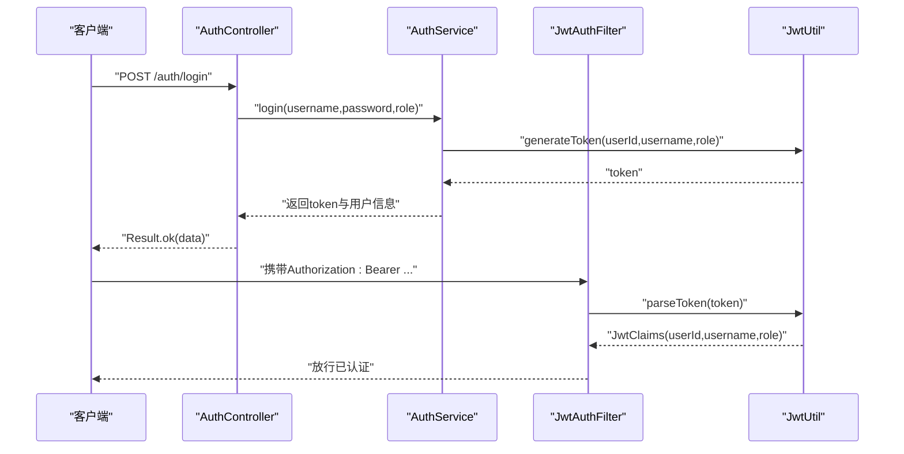
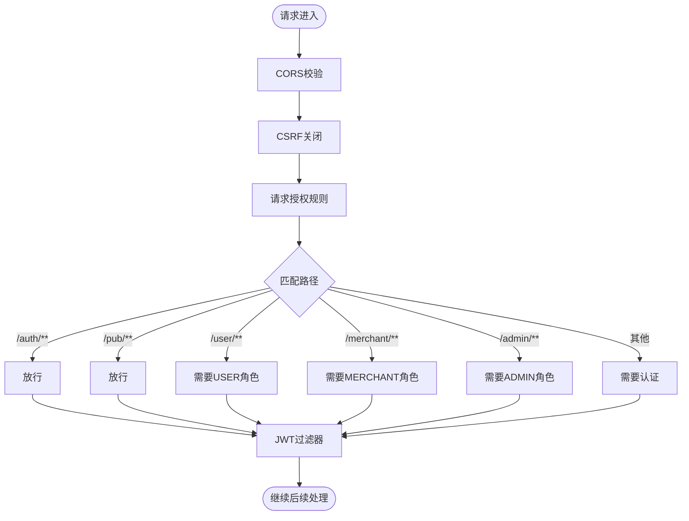
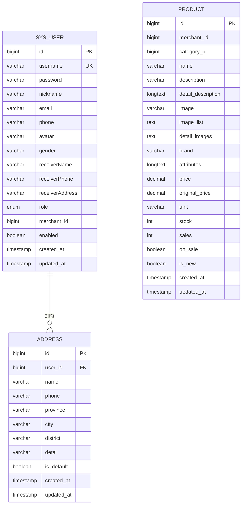
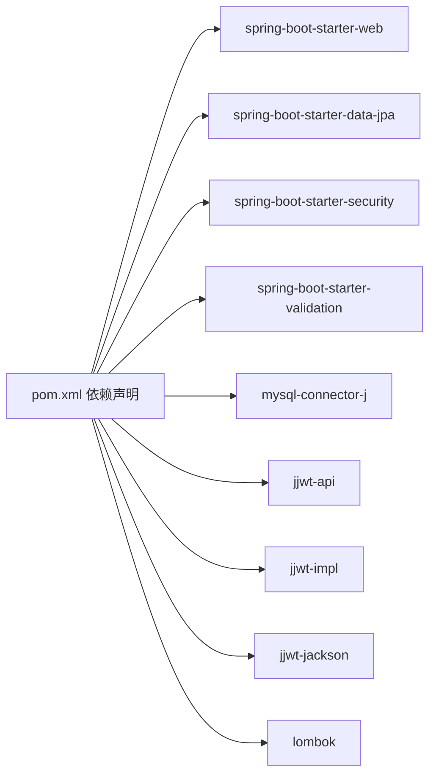

# 后端架构详解

<cite>
**本文引用的文件**
- [MallApplication.java](file://backend/src/main/java/com/mall/MallApplication.java)
- [application.yml](file://backend/src/main/resources/application.yml)
- [pom.xml](file://backend/pom.xml)
- [SecurityConfig.java](file://backend/src/main/java/com/mall/config/SecurityConfig.java)
- [JwtProperties.java](file://backend/src/main/java/com/mall/config/JwtProperties.java)
- [JwtUtil.java](file://backend/src/main/java/com/mall/security/JwtUtil.java)
- [JwtAuthFilter.java](file://backend/src/main/java/com/mall/security/JwtAuthFilter.java)
- [AuthService.java](file://backend/src/main/java/com/mall/service/AuthService.java)
- [AuthController.java](file://backend/src/main/java/com/mall/controller/AuthController.java)
- [Result.java](file://backend/src/main/java/com/mall/dto/Result.java)
- [Role.java](file://backend/src/main/java/com/mall/common/Role.java)
- [User.java](file://backend/src/main/java/com/mall/entity/User.java)
- [Product.java](file://backend/src/main/java/com/mall/entity/Product.java)
- [UserRepository.java](file://backend/src/main/java/com/mall/repository/UserRepository.java)
- [ProductRepository.java](file://backend/src/main/java/com/mall/repository/ProductRepository.java)
</cite>

## 目录
1. [简介](#简介)
2. [项目结构](#项目结构)
3. [核心组件](#核心组件)
4. [架构总览](#架构总览)
5. [详细组件分析](#详细组件分析)
6. [依赖分析](#依赖分析)
7. [性能考虑](#性能考虑)
8. [故障排查指南](#故障排查指南)
9. [结论](#结论)
10. [附录](#附录)

## 简介
本文件面向电商商城系统后端，围绕Spring Boot MVC分层架构进行深入解析，涵盖Controller、Service、Repository三层职责与交互；详解JWT认证授权机制与Spring Security配置；梳理数据模型与JPA映射关系；解释RESTful API设计原则、错误处理与全局异常策略；并给出数据库设计思路、索引优化建议与事务管理配置要点。文档同时提供架构图与代码示例路径，帮助开发者快速理解系统整体设计。

## 项目结构
后端采用标准Spring Boot工程结构，按功能域分包组织：
- config：安全与初始化配置
- security：JWT工具与过滤器
- controller：控制器层（含用户、商户、管理员、公共接口）
- service：业务服务层
- repository：数据访问层（JPA）
- entity：领域模型（JPA实体）
- dto：传输对象
- common：通用枚举与常量

**图表来源**
- [MallApplication.java:1-13](file://backend/src/main/java/com/mall/MallApplication.java#L1-L13)
- [SecurityConfig.java:1-74](file://backend/src/main/java/com/mall/config/SecurityConfig.java#L1-L74)
- [JwtProperties.java:1-18](file://backend/src/main/java/com/mall/config/JwtProperties.java#L1-L18)
- [JwtUtil.java:1-48](file://backend/src/main/java/com/mall/security/JwtUtil.java#L1-L48)
- [JwtAuthFilter.java:1-57](file://backend/src/main/java/com/mall/security/JwtAuthFilter.java#L1-L57)
- [AuthService.java:1-92](file://backend/src/main/java/com/mall/service/AuthService.java#L1-L92)
- [AuthController.java:1-73](file://backend/src/main/java/com/mall/controller/AuthController.java#L1-L73)
- [UserRepository.java:1-20](file://backend/src/main/java/com/mall/repository/UserRepository.java#L1-L20)
- [ProductRepository.java:1-125](file://backend/src/main/java/com/mall/repository/ProductRepository.java#L1-L125)
- [User.java:1-88](file://backend/src/main/java/com/mall/entity/User.java#L1-L88)
- [Product.java:1-101](file://backend/src/main/java/com/mall/entity/Product.java#L1-L101)
- [Result.java:1-24](file://backend/src/main/java/com/mall/dto/Result.java#L1-L24)

**章节来源**
- [MallApplication.java:1-13](file://backend/src/main/java/com/mall/MallApplication.java#L1-L13)
- [application.yml:1-36](file://backend/src/main/resources/application.yml#L1-L36)
- [pom.xml:1-107](file://backend/pom.xml#L1-L107)

## 核心组件
- 启动类：负责应用引导与组件扫描
- 安全配置：基于Spring Security的无状态认证策略、CORS、权限规则
- JWT工具链：密钥生成、令牌签发与解析
- 控制器：对外暴露REST API，返回统一结果包装
- 服务层：业务编排与校验，调用仓储持久化
- 数据访问层：基于JPA Repository的查询扩展
- 领域模型：User、Product等核心实体及字段约束
- 统一响应体：Result封装标准响应结构

**章节来源**
- [MallApplication.java:1-13](file://backend/src/main/java/com/mall/MallApplication.java#L1-L13)
- [SecurityConfig.java:1-74](file://backend/src/main/java/com/mall/config/SecurityConfig.java#L1-L74)
- [JwtUtil.java:1-48](file://backend/src/main/java/com/mall/security/JwtUtil.java#L1-L48)
- [JwtAuthFilter.java:1-57](file://backend/src/main/java/com/mall/security/JwtAuthFilter.java#L1-L57)
- [AuthController.java:1-73](file://backend/src/main/java/com/mall/controller/AuthController.java#L1-L73)
- [AuthService.java:1-92](file://backend/src/main/java/com/mall/service/AuthService.java#L1-L92)
- [UserRepository.java:1-20](file://backend/src/main/java/com/mall/repository/UserRepository.java#L1-L20)
- [ProductRepository.java:1-125](file://backend/src/main/java/com/mall/repository/ProductRepository.java#L1-L125)
- [User.java:1-88](file://backend/src/main/java/com/mall/entity/User.java#L1-L88)
- [Product.java:1-101](file://backend/src/main/java/com/mall/entity/Product.java#L1-L101)
- [Result.java:1-24](file://backend/src/main/java/com/mall/dto/Result.java#L1-L24)

## 架构总览
系统采用经典的三层架构与分层解耦设计：
- 表现层（Controller）：接收请求、参数校验、调用服务、封装响应
- 领域服务（Service）：业务逻辑编排、角色与状态校验、跨表聚合
- 数据访问（Repository）：JPA抽象、自定义查询、分页排序
- 安全层（Security + JWT）：无状态认证、权限拦截、CORS跨域

**图表来源**
- [AuthController.java:1-73](file://backend/src/main/java/com/mall/controller/AuthController.java#L1-L73)
- [AuthService.java:1-92](file://backend/src/main/java/com/mall/service/AuthService.java#L1-L92)
- [UserRepository.java:1-20](file://backend/src/main/java/com/mall/repository/UserRepository.java#L1-L20)
- [ProductRepository.java:1-125](file://backend/src/main/java/com/mall/repository/ProductRepository.java#L1-L125)
- [SecurityConfig.java:1-74](file://backend/src/main/java/com/mall/config/SecurityConfig.java#L1-L74)
- [JwtAuthFilter.java:1-57](file://backend/src/main/java/com/mall/security/JwtAuthFilter.java#L1-L57)
- [Result.java:1-24](file://backend/src/main/java/com/mall/dto/Result.java#L1-L24)

## 详细组件分析

### 分层架构与职责
- Controller层：集中于路由与参数校验，调用服务层完成业务处理，并通过Result统一返回
- Service层：封装业务规则与流程，如登录校验、角色匹配、JWT签发、用户注册等
- Repository层：基于JPA提供CRUD与复杂查询能力，支持分页、排序与条件组合
- Entity层：使用注解定义表结构、索引与默认值，结合生命周期回调维护时间戳

**图表来源**
- [AuthController.java:1-73](file://backend/src/main/java/com/mall/controller/AuthController.java#L1-L73)
- [AuthService.java:1-92](file://backend/src/main/java/com/mall/service/AuthService.java#L1-L92)
- [UserRepository.java:1-20](file://backend/src/main/java/com/mall/repository/UserRepository.java#L1-L20)
- [ProductRepository.java:1-125](file://backend/src/main/java/com/mall/repository/ProductRepository.java#L1-L125)
- [User.java:1-88](file://backend/src/main/java/com/mall/entity/User.java#L1-L88)
- [Product.java:1-101](file://backend/src/main/java/com/mall/entity/Product.java#L1-L101)

**章节来源**
- [AuthController.java:1-73](file://backend/src/main/java/com/mall/controller/AuthController.java#L1-L73)
- [AuthService.java:1-92](file://backend/src/main/java/com/mall/service/AuthService.java#L1-L92)
- [UserRepository.java:1-20](file://backend/src/main/java/com/mall/repository/UserRepository.java#L1-L20)
- [ProductRepository.java:1-125](file://backend/src/main/java/com/mall/repository/ProductRepository.java#L1-L125)
- [User.java:1-88](file://backend/src/main/java/com/mall/entity/User.java#L1-L88)
- [Product.java:1-101](file://backend/src/main/java/com/mall/entity/Product.java#L1-L101)

### JWT认证授权机制
- 密钥与过期配置：从配置文件读取密钥与过期时间，生成HMAC密钥
- 令牌签发：携带用户标识、用户名、角色，设置签发与过期时间
- 请求解析：从请求头提取Bearer Token，解析出用户身份与角色，注入到Security上下文
- 角色授权：基于路径前缀匹配不同角色访问权限

**图表来源**
- [AuthController.java:1-73](file://backend/src/main/java/com/mall/controller/AuthController.java#L1-L73)
- [AuthService.java:1-92](file://backend/src/main/java/com/mall/service/AuthService.java#L1-L92)
- [JwtAuthFilter.java:1-57](file://backend/src/main/java/com/mall/security/JwtAuthFilter.java#L1-L57)
- [JwtUtil.java:1-48](file://backend/src/main/java/com/mall/security/JwtUtil.java#L1-L48)

**章节来源**
- [JwtProperties.java:1-18](file://backend/src/main/java/com/mall/config/JwtProperties.java#L1-L18)
- [JwtUtil.java:1-48](file://backend/src/main/java/com/mall/security/JwtUtil.java#L1-L48)
- [JwtAuthFilter.java:1-57](file://backend/src/main/java/com/mall/security/JwtAuthFilter.java#L1-L57)
- [SecurityConfig.java:1-74](file://backend/src/main/java/com/mall/config/SecurityConfig.java#L1-L74)

### Spring Security配置策略
- 无状态会话：禁用CSRF，SessionCreationPolicy.STATELESS
- CORS：允许指定前端地址，支持常用方法与头
- 路由权限：公开接口放行，受保护接口按角色限制
- 过滤器链：在用户名密码过滤器之前插入JWT过滤器

**图表来源**
- [SecurityConfig.java:1-74](file://backend/src/main/java/com/mall/config/SecurityConfig.java#L1-L74)

**章节来源**
- [SecurityConfig.java:1-74](file://backend/src/main/java/com/mall/config/SecurityConfig.java#L1-L74)

### 数据模型与JPA映射
- User实体：用户名唯一、密码加密存储、角色枚举、收货人信息、启用状态、时间戳
- Product实体：名称、描述、图片、品牌、价格、库存、销量、上下架状态、新品标记、时间戳
- 关系映射：User与Address一对多（懒加载、级联删除），避免循环序列化
- 生命周期：PrePersist/PreUpdate自动填充创建与更新时间

**图表来源**
- [User.java:1-88](file://backend/src/main/java/com/mall/entity/User.java#L1-L88)
- [Product.java:1-101](file://backend/src/main/java/com/mall/entity/Product.java#L1-L101)

**章节来源**
- [User.java:1-88](file://backend/src/main/java/com/mall/entity/User.java#L1-L88)
- [Product.java:1-101](file://backend/src/main/java/com/mall/entity/Product.java#L1-L101)

### RESTful API设计原则
- 资源命名：使用名词复数，如“/auth/login”、“/user/**”
- 方法语义：POST用于创建/登录，GET用于查询，PUT/DELETE用于更新/删除
- 统一响应：Result封装code、message、data，便于前端统一处理
- 参数校验：控制器层进行基础必填校验，服务层进行业务规则校验

**章节来源**
- [AuthController.java:1-73](file://backend/src/main/java/com/mall/controller/AuthController.java#L1-L73)
- [Result.java:1-24](file://backend/src/main/java/com/mall/dto/Result.java#L1-L24)

### 错误处理与全局异常策略
- 控制器层：对空参数与业务异常进行捕获，返回Result.fail
- 服务层：对登录失败、角色不匹配、运营主体禁用等场景抛出异常
- 全局异常：当前仓库未提供全局异常处理器，建议新增GlobalExceptionHandler以统一处理运行时异常与业务异常，返回标准化响应

**章节来源**
- [AuthController.java:1-73](file://backend/src/main/java/com/mall/controller/AuthController.java#L1-L73)
- [AuthService.java:1-92](file://backend/src/main/java/com/mall/service/AuthService.java#L1-L92)

### 数据库设计思路与索引优化
- 设计思路
  - 用户与地址：一对多，地址默认字段与时间戳
  - 商品：多字段检索（名称、分类、商家、上下架、新品、销量），支持分页与排序
- 索引建议
  - sys_user(username)：唯一索引，加速登录与去重
  - product(merchant_id, on_sale)：加速商家商品列表与公开筛选
  - product(category_id, on_sale)：加速分类筛选
  - product(on_sale, sales)：加速销量排行
  - product(on_sale, created_at)：加速新品列表
  - product(name, description)：全文检索或模糊匹配（配合公开查询）

[本节为通用数据库设计建议，不直接分析具体文件，故无“章节来源”]

## 依赖分析
- Spring Boot Starter：web、data-jpa、security、validation
- MySQL驱动：连接MySQL数据库
- JWT：jjwt-api/impl/jackson
- Lombok：简化实体与DTO代码

**图表来源**
- [pom.xml:1-107](file://backend/pom.xml#L1-L107)

**章节来源**
- [pom.xml:1-107](file://backend/pom.xml#L1-L107)

## 性能考虑
- 查询优化
  - 使用Repository自定义查询，避免N+1问题；对关联表使用JOIN或子查询
  - 对高频查询建立复合索引，减少回表与排序成本
- 缓存策略
  - 对热点商品列表（新品、热销）引入Redis缓存，降低数据库压力
- 分页与排序
  - 明确排序字段与索引，避免大偏移分页导致慢查询
- 事务管理
  - 在Service层标注@Transactional，确保业务原子性；避免长事务占用锁资源
- 日志与监控
  - 开启慢查询日志与SQL格式化，结合AOP记录请求耗时

[本节提供通用性能指导，不直接分析具体文件，故无“章节来源”]

## 故障排查指南
- 登录失败
  - 检查用户名是否存在且启用；确认密码编码匹配；核对所选角色与用户角色一致
  - 若运营主体被禁用，登录会被拒绝
- 权限不足
  - 确认请求头Authorization是否携带Bearer Token；检查角色是否正确
  - 核对SecurityConfig中路径与角色映射
- 数据库连接
  - 检查application.yml中的数据库URL、用户名、密码与时区配置
- SQL与DDL
  - 当前配置为自动更新DDL，若出现字段不一致，可临时调整为validate或手动迁移

**章节来源**
- [AuthService.java:1-92](file://backend/src/main/java/com/mall/service/AuthService.java#L1-L92)
- [SecurityConfig.java:1-74](file://backend/src/main/java/com/mall/config/SecurityConfig.java#L1-L74)
- [application.yml:1-36](file://backend/src/main/resources/application.yml#L1-L36)

## 结论
该系统以清晰的分层架构为基础，结合Spring Security与JWT实现了无状态认证与细粒度权限控制；通过JPA Repository提供了灵活的数据访问能力；统一响应体与RESTful设计提升了前后端协作效率。建议后续完善全局异常处理、引入缓存与事务优化，并持续完善索引与查询性能。

## 附录
- 配置文件关键项
  - 数据源与JPA：数据库连接、方言、DDL策略、SQL显示与格式化
  - 服务器：端口与上下文路径
  - JWT：密钥与过期时间
  - 日志：应用与安全框架日志级别

**章节来源**
- [application.yml:1-36](file://backend/src/main/resources/application.yml#L1-L36)