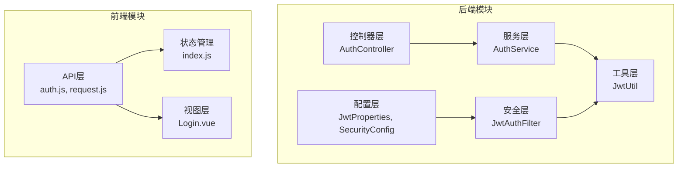
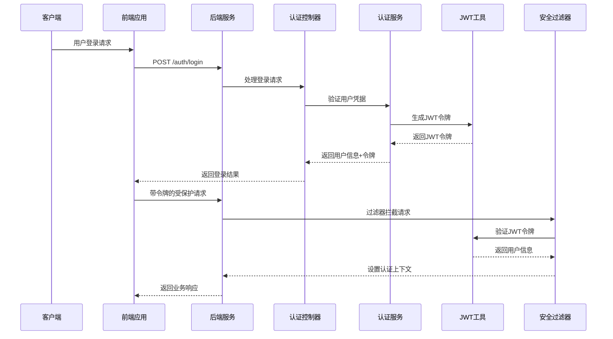
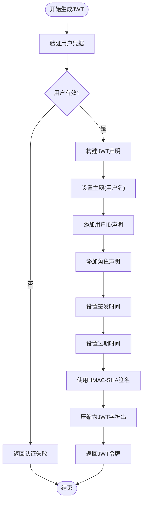
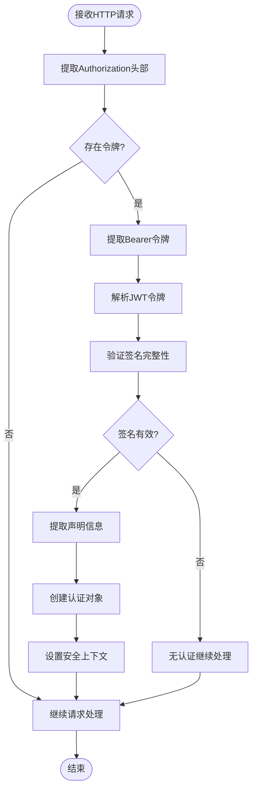
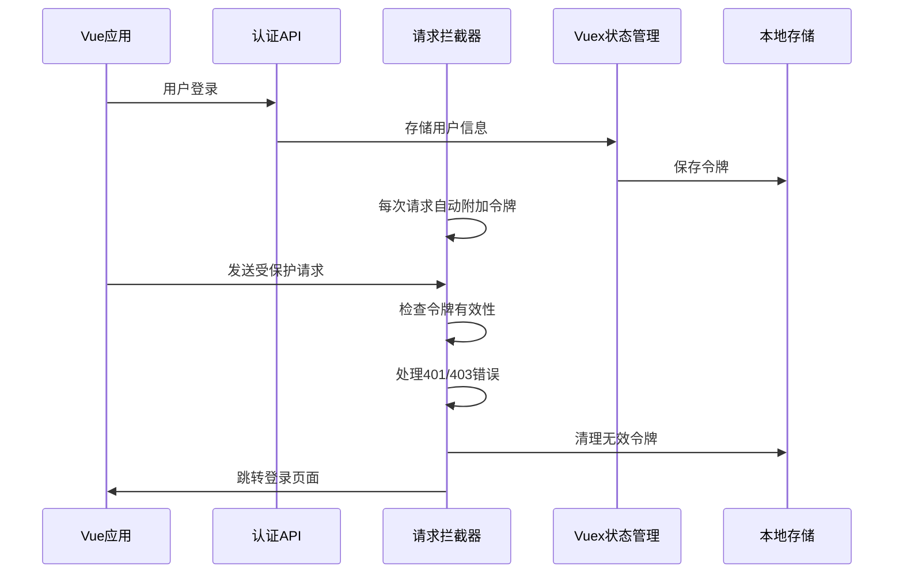
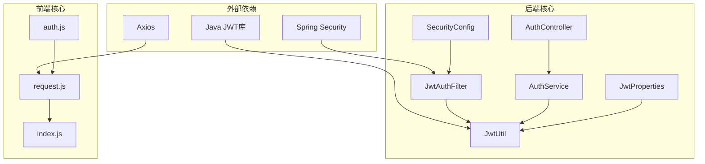

# JWT认证机制

<cite>
**本文档引用的文件**
- [JwtUtil.java](file://backend/src/main/java/com/mall/security/JwtUtil.java)
- [JwtAuthFilter.java](file://backend/src/main/java/com/mall/security/JwtAuthFilter.java)
- [JwtProperties.java](file://backend/src/main/java/com/mall/config/JwtProperties.java)
- [SecurityConfig.java](file://backend/src/main/java/com/mall/config/SecurityConfig.java)
- [AuthService.java](file://backend/src/main/java/com/mall/service/AuthService.java)
- [AuthController.java](file://backend/src/main/java/com/mall/controller/AuthController.java)
- [application.yml](file://backend/src/main/resources/application.yml)
- [auth.js](file://frontend/src/api/auth.js)
- [request.js](file://frontend/src/api/request.js)
- [index.js](file://frontend/src/store/index.js)
- [Role.java](file://backend/src/main/java/com/mall/common/Role.java)
</cite>

## 目录
1. [简介](#简介)
2. [项目结构](#项目结构)
3. [核心组件](#核心组件)
4. [架构概览](#架构概览)
5. [详细组件分析](#详细组件分析)
6. [依赖关系分析](#依赖关系分析)
7. [性能考虑](#性能考虑)
8. [故障排除指南](#故障排除指南)
9. [结论](#结论)

## 简介

本项目采用JWT（JSON Web Token）作为主要的身份认证机制，实现了完整的用户登录、令牌生成、验证和权限控制功能。系统通过Spring Security集成JWT认证，提供了安全、可扩展的认证解决方案。

JWT认证机制的核心优势包括：
- 无状态认证：服务器不需要存储会话信息
- 跨域支持：便于前后端分离架构
- 移动端友好：支持多种客户端类型
- 性能优化：减少数据库查询次数

## 项目结构

项目采用标准的Spring Boot分层架构，JWT认证相关的代码分布在以下模块中：

**图表来源**
- [AuthController.java:1-73](file://backend/src/main/java/com/mall/controller/AuthController.java#L1-73)
- [AuthService.java:1-92](file://backend/src/main/java/com/mall/service/AuthService.java#L1-92)
- [JwtAuthFilter.java:1-57](file://backend/src/main/java/com/mall/security/JwtAuthFilter.java#L1-57)
- [JwtUtil.java:1-48](file://backend/src/main/java/com/mall/security/JwtUtil.java#L1-48)

**章节来源**
- [AuthController.java:1-73](file://backend/src/main/java/com/mall/controller/AuthController.java#L1-73)
- [AuthService.java:1-92](file://backend/src/main/java/com/mall/service/AuthService.java#L1-92)
- [JwtAuthFilter.java:1-57](file://backend/src/main/java/com/mall/security/JwtAuthFilter.java#L1-57)
- [JwtUtil.java:1-48](file://backend/src/main/java/com/mall/security/JwtUtil.java#L1-48)

## 核心组件

### JWT工具类（JwtUtil）

JwtUtil是JWT认证的核心工具类，负责令牌的生成、解析和验证。该类使用HMAC-SHA算法进行签名，确保令牌的完整性和安全性。

**主要功能特性：**
- **令牌生成**：基于用户信息生成JWT令牌
- **令牌解析**：验证并解析JWT令牌内容
- **密钥管理**：使用配置文件中的密钥进行签名
- **过期时间管理**：支持自定义令牌有效期

**章节来源**
- [JwtUtil.java:12-48](file://backend/src/main/java/com/mall/security/JwtUtil.java#L12-L48)

### JWT认证过滤器（JwtAuthFilter）

JwtAuthFilter是一个自定义的Spring Security过滤器，负责拦截HTTP请求并验证JWT令牌的有效性。

**核心工作流程：**
1. 从请求头中提取Authorization头部
2. 解析Bearer令牌格式
3. 使用JwtUtil验证令牌签名
4. 设置Spring Security的认证上下文
5. 继续请求处理链

**章节来源**
- [JwtAuthFilter.java:18-57](file://backend/src/main/java/com/mall/security/JwtAuthFilter.java#L18-L57)

### JWT配置属性（JwtProperties）

JwtProperties类封装了JWT相关的配置参数，通过Spring Boot的@ConfigurationProperties注解实现自动绑定。

**配置参数说明：**
- `secret`：JWT签名密钥（最小256位）
- `expirationMs`：令牌过期时间（毫秒）

**章节来源**
- [JwtProperties.java:12-17](file://backend/src/main/java/com/mall/config/JwtProperties.java#L12-L17)

### 安全配置（SecurityConfig）

SecurityConfig类配置了Spring Security的整体安全策略，集成了JWT认证过滤器。

**安全策略：**
- 禁用CSRF保护
- 无状态会话管理
- 基于角色的URL访问控制
- CORS跨域配置

**章节来源**
- [SecurityConfig.java:25-74](file://backend/src/main/java/com/mall/config/SecurityConfig.java#L25-L74)

## 架构概览

JWT认证系统的整体架构采用分层设计，从前端请求到后端处理形成完整的认证流程。

**图表来源**
- [AuthController.java:18-35](file://backend/src/main/java/com/mall/controller/AuthController.java#L18-L35)
- [AuthService.java:28-59](file://backend/src/main/java/com/mall/service/AuthService.java#L28-L59)
- [JwtUtil.java:23-32](file://backend/src/main/java/com/mall/security/JwtUtil.java#L23-L32)
- [JwtAuthFilter.java:30-47](file://backend/src/main/java/com/mall/security/JwtAuthFilter.java#L30-L47)

## 详细组件分析

### JWT生成流程

JWT令牌的生成过程涉及多个步骤，确保令牌的安全性和有效性。

**图表来源**
- [AuthService.java:48-48](file://backend/src/main/java/com/mall/service/AuthService.java#L48-L48)
- [JwtUtil.java:23-32](file://backend/src/main/java/com/mall/security/JwtUtil.java#L23-L32)

**章节来源**
- [AuthService.java:28-59](file://backend/src/main/java/com/mall/service/AuthService.java#L28-L59)
- [JwtUtil.java:23-32](file://backend/src/main/java/com/mall/security/JwtUtil.java#L23-L32)

### JWT验证流程

JWT令牌的验证过程确保请求的安全性和用户身份的真实性。

**图表来源**
- [JwtAuthFilter.java:30-47](file://backend/src/main/java/com/mall/security/JwtAuthFilter.java#L30-L47)
- [JwtUtil.java:34-44](file://backend/src/main/java/com/mall/security/JwtUtil.java#L34-L44)

**章节来源**
- [JwtAuthFilter.java:30-47](file://backend/src/main/java/com/mall/security/JwtAuthFilter.java#L30-L47)
- [JwtUtil.java:34-44](file://backend/src/main/java/com/mall/security/JwtUtil.java#L34-L44)

### 前端集成实现

前端通过Axios拦截器自动处理JWT令牌的附加和验证。

**图表来源**
- [auth.js:14-25](file://frontend/src/api/auth.js#L14-L25)
- [request.js:9-16](file://frontend/src/api/request.js#L9-L16)
- [index.js:10-21](file://frontend/src/store/index.js#L10-L21)

**章节来源**
- [auth.js:14-25](file://frontend/src/api/auth.js#L14-L25)
- [request.js:9-16](file://frontend/src/api/request.js#L9-L16)
- [index.js:10-21](file://frontend/src/store/index.js#L10-L21)

## 依赖关系分析

JWT认证系统的依赖关系体现了清晰的分层架构和职责分离。

**图表来源**
- [JwtAuthFilter.java:1-17](file://backend/src/main/java/com/mall/security/JwtAuthFilter.java#L1-L17)
- [JwtUtil.java:1-11](file://backend/src/main/java/com/mall/security/JwtUtil.java#L1-L11)
- [AuthService.java:1-16](file://backend/src/main/java/com/mall/service/AuthService.java#L1-L16)
- [request.js:1-7](file://frontend/src/api/request.js#L1-L7)

**章节来源**
- [JwtAuthFilter.java:1-17](file://backend/src/main/java/com/mall/security/JwtAuthFilter.java#L1-L17)
- [JwtUtil.java:1-11](file://backend/src/main/java/com/mall/security/JwtUtil.java#L1-L11)
- [AuthService.java:1-16](file://backend/src/main/java/com/mall/service/AuthService.java#L1-L16)
- [request.js:1-7](file://frontend/src/api/request.js#L1-L7)

## 性能考虑

JWT认证机制在性能方面具有显著优势，但也需要注意一些潜在的性能影响因素：

### 性能优势
- **无状态设计**：服务器无需维护会话状态，降低内存消耗
- **零数据库查询**：令牌验证仅依赖本地计算，避免数据库访问
- **缓存友好**：令牌可以被浏览器和CDN缓存

### 性能优化建议
- **令牌大小控制**：避免在JWT中存储过多用户信息
- **过期时间合理设置**：平衡安全性与性能需求
- **密钥管理优化**：使用硬件安全模块(HSM)存储密钥
- **并发处理**：合理配置线程池大小以处理高并发请求

## 故障排除指南

### 常见问题及解决方案

**1. 令牌过期问题**
- **症状**：401未授权错误
- **原因**：令牌超过配置的过期时间
- **解决方案**：检查application.yml中的expiration-ms配置

**2. 密钥不匹配问题**
- **症状**：JWT解析失败
- **原因**：前端和后端使用不同的密钥
- **解决方案**：确保前后端使用相同的jwt.secret配置

**3. CORS跨域问题**
- **症状**：浏览器控制台出现跨域错误
- **原因**：前端域名与后端CORS配置不匹配
- **解决方案**：检查SecurityConfig中的allowedOrigins配置

**4. 前端令牌丢失**
- **症状**：登录后立即被重定向到登录页面
- **原因**：localStorage中的令牌被意外清除
- **解决方案**：检查Vuex store的setUser mutation实现

**章节来源**
- [application.yml:27-30](file://backend/src/main/resources/application.yml#L27-L30)
- [SecurityConfig.java:58-67](file://backend/src/main/java/com/mall/config/SecurityConfig.java#L58-L67)
- [index.js:10-21](file://frontend/src/store/index.js#L10-L21)

## 结论

本JWT认证机制实现了完整的身份验证和授权功能，具有以下特点：

**技术优势：**
- 采用标准的JWT协议，兼容性强
- Spring Security深度集成，安全性高
- 前后端分离架构，易于维护
- 支持多角色权限控制

**最佳实践：**
- 使用HTTPS传输令牌，防止中间人攻击
- 定期轮换密钥，提高安全性
- 实施适当的日志记录和监控
- 提供令牌刷新机制以改善用户体验

该实现为体育电商平台提供了可靠的身份认证基础设施，支持管理员、运营和普通用户的差异化权限管理，为后续的功能扩展奠定了坚实的基础。