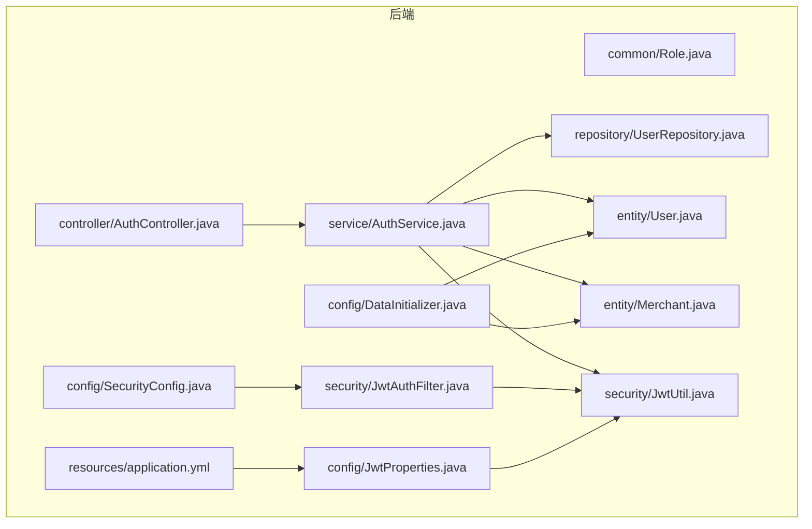
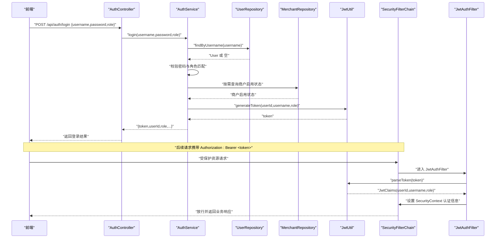
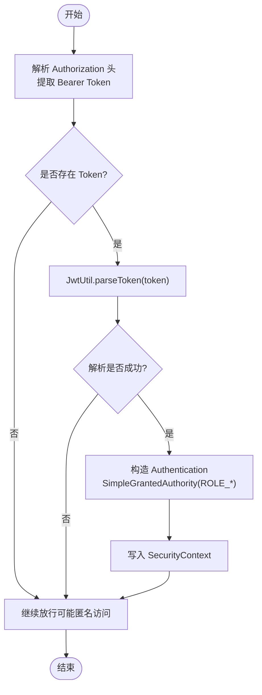
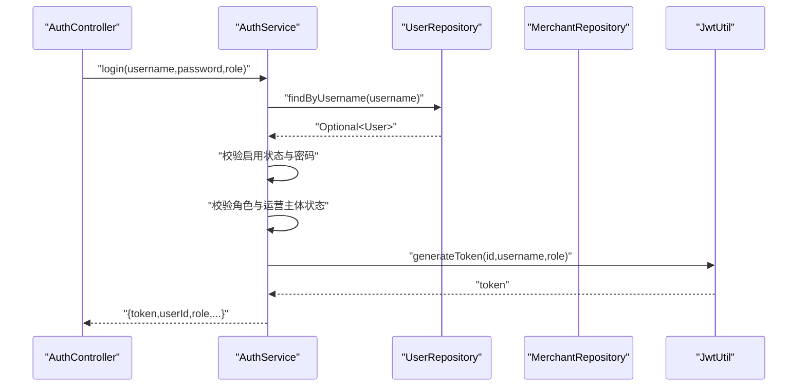
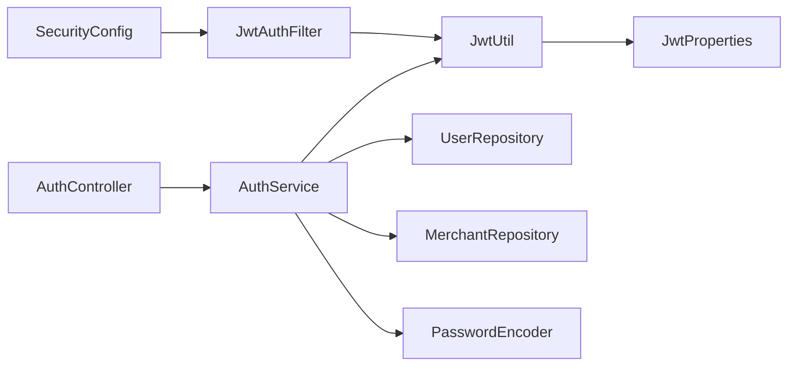

# 安全认证与授权

<cite>
**本文引用的文件**
- [Role.java](file://backend/src/main/java/com/mall/common/Role.java)
- [SecurityConfig.java](file://backend/src/main/java/com/mall/config/SecurityConfig.java)
- [JwtUtil.java](file://backend/src/main/java/com/mall/security/JwtUtil.java)
- [JwtAuthFilter.java](file://backend/src/main/java/com/mall/security/JwtAuthFilter.java)
- [JwtProperties.java](file://backend/src/main/java/com/mall/config/JwtProperties.java)
- [AuthController.java](file://backend/src/main/java/com/mall/controller/AuthController.java)
- [AuthService.java](file://backend/src/main/java/com/mall/service/AuthService.java)
- [User.java](file://backend/src/main/java/com/mall/entity/User.java)
- [Merchant.java](file://backend/src/main/java/com/mall/entity/Merchant.java)
- [UserRepository.java](file://backend/src/main/java/com/mall/repository/UserRepository.java)
- [DataInitializer.java](file://backend/src/main/java/com/mall/config/DataInitializer.java)
- [application.yml](file://backend/src/main/resources/application.yml)
- [auth.js](file://frontend/src/api/auth.js)
- [index.js](file://frontend/src/store/index.js)
- [index.js](file://frontend/src/router/index.js)
</cite>

## 目录
1. [简介](#简介)
2. [项目结构](#项目结构)
3. [核心组件](#核心组件)
4. [架构总览](#架构总览)
5. [详细组件分析](#详细组件分析)
6. [依赖分析](#依赖分析)
7. [性能考虑](#性能考虑)
8. [故障排查指南](#故障排查指南)
9. [结论](#结论)
10. [附录](#附录)

## 简介
本文件面向电商商城系统的安全认证与授权机制，围绕基于 Spring Security 的 RBAC 权限控制模型进行系统化技术说明。重点覆盖以下方面：
- 角色定义与权限分配策略：ADMIN（管理员）、MERCHANT（运营）、USER（普通用户）
- 基于 JWT 的认证流程：token 生成、验证、刷新机制
- 关键组件职责：JwtUtil 工具类、JwtAuthFilter 过滤器、SecurityConfig 安全配置
- 完整认证授权流程图与代码示例路径，帮助开发者快速理解多角色权限控制的实现细节

## 项目结构
后端采用分层架构，安全相关的核心代码集中在以下模块：
- common：角色枚举 Role
- config：安全配置 SecurityConfig、JWT 属性 JwtProperties、数据初始化 DataInitializer
- security：JWT 工具 JwtUtil、JWT 过滤器 JwtAuthFilter
- controller：认证控制器 AuthController
- service：认证服务 AuthService
- entity/repository：用户与商户实体及仓库
- resources：应用配置 application.yml

图表来源
- [SecurityConfig.java:33-55](file://backend/src/main/java/com/mall/config/SecurityConfig.java#L33-L55)
- [JwtAuthFilter.java:18-28](file://backend/src/main/java/com/mall/security/JwtAuthFilter.java#L18-L28)
- [JwtUtil.java:12-21](file://backend/src/main/java/com/mall/security/JwtUtil.java#L12-L21)
- [JwtProperties.java:9-17](file://backend/src/main/java/com/mall/config/JwtProperties.java#L9-L17)
- [AuthController.java:11-35](file://backend/src/main/java/com/mall/controller/AuthController.java#L11-L35)
- [AuthService.java:17-25](file://backend/src/main/java/com/mall/service/AuthService.java#L17-L25)
- [User.java:10-16](file://backend/src/main/java/com/mall/entity/User.java#L10-L16)
- [Merchant.java:8-14](file://backend/src/main/java/com/mall/entity/Merchant.java#L8-L14)
- [UserRepository.java:10-18](file://backend/src/main/java/com/mall/repository/UserRepository.java#L10-L18)
- [DataInitializer.java:14-23](file://backend/src/main/java/com/mall/config/DataInitializer.java#L14-L23)
- [application.yml:27-30](file://backend/src/main/resources/application.yml#L27-L30)

章节来源
- [SecurityConfig.java:22-55](file://backend/src/main/java/com/mall/config/SecurityConfig.java#L22-L55)
- [JwtUtil.java:12-47](file://backend/src/main/java/com/mall/security/JwtUtil.java#L12-L47)
- [JwtAuthFilter.java:18-56](file://backend/src/main/java/com/mall/security/JwtAuthFilter.java#L18-L56)
- [JwtProperties.java:9-17](file://backend/src/main/java/com/mall/config/JwtProperties.java#L9-L17)
- [AuthController.java:11-72](file://backend/src/main/java/com/mall/controller/AuthController.java#L11-L72)
- [AuthService.java:17-91](file://backend/src/main/java/com/mall/service/AuthService.java#L17-L91)
- [User.java:10-87](file://backend/src/main/java/com/mall/entity/User.java#L10-L87)
- [Merchant.java:8-54](file://backend/src/main/java/com/mall/entity/Merchant.java#L8-L54)
- [UserRepository.java:10-19](file://backend/src/main/java/com/mall/repository/UserRepository.java#L10-L19)
- [DataInitializer.java:14-94](file://backend/src/main/java/com/mall/config/DataInitializer.java#L14-L94)
- [application.yml:27-30](file://backend/src/main/resources/application.yml#L27-L30)

## 核心组件
- 角色枚举 Role：定义 ADMIN、MERCHANT、USER 三种角色，用于数据库存储与权限判断
- SecurityConfig：声明式 Web 安全配置，开启方法级安全注解，配置 CORS、CSRF、会话策略与 URL 授权规则，并注入 JwtAuthFilter
- JwtProperties：读取 application.yml 中的 jwt.secret 与 jwt.expiration-ms，作为 JWT 密钥与过期时间
- JwtUtil：封装 JWT 生成与解析，使用对称密钥签名，返回包含 userId、username、role 的 JwtClaims
- JwtAuthFilter：从 Authorization 请求头中提取 Bearer Token，解析并构建 Spring Security 的 Authentication 对象，写入 SecurityContext
- AuthController：对外暴露 /auth/login 与 /auth/register 接口，接收用户名、密码、角色等参数
- AuthService：执行登录校验（用户名存在性、密码匹配、角色一致性、运营主体启用状态），签发 JWT；执行用户注册
- User/Merchant 实体：持久化用户与商户信息，支持角色与运营主体关联
- UserRepository：提供按用户名、角色、商户 ID 查询用户的能力
- DataInitializer：启动时初始化管理员、运营与普通用户示例数据

章节来源
- [Role.java:3-7](file://backend/src/main/java/com/mall/common/Role.java#L3-L7)
- [SecurityConfig.java:22-73](file://backend/src/main/java/com/mall/config/SecurityConfig.java#L22-L73)
- [JwtProperties.java:9-17](file://backend/src/main/java/com/mall/config/JwtProperties.java#L9-L17)
- [JwtUtil.java:12-46](file://backend/src/main/java/com/mall/security/JwtUtil.java#L12-L46)
- [JwtAuthFilter.java:18-56](file://backend/src/main/java/com/mall/security/JwtAuthFilter.java#L18-L56)
- [AuthController.java:11-72](file://backend/src/main/java/com/mall/controller/AuthController.java#L11-L72)
- [AuthService.java:17-91](file://backend/src/main/java/com/mall/service/AuthService.java#L17-L91)
- [User.java:10-87](file://backend/src/main/java/com/mall/entity/User.java#L10-L87)
- [Merchant.java:8-54](file://backend/src/main/java/com/mall/entity/Merchant.java#L8-L54)
- [UserRepository.java:10-19](file://backend/src/main/java/com/mall/repository/UserRepository.java#L10-L19)
- [DataInitializer.java:14-94](file://backend/src/main/java/com/mall/config/DataInitializer.java#L14-L94)

## 架构总览
下图展示了从客户端到后端的认证授权整体流程，以及各组件之间的交互关系。

图表来源
- [AuthController.java:18-35](file://backend/src/main/java/com/mall/controller/AuthController.java#L18-L35)
- [AuthService.java:27-59](file://backend/src/main/java/com/mall/service/AuthService.java#L27-L59)
- [UserRepository.java:12](file://backend/src/main/java/com/mall/repository/UserRepository.java#L12)
- [Merchant.java:36](file://backend/src/main/java/com/mall/entity/Merchant.java#L36)
- [JwtUtil.java:23-32](file://backend/src/main/java/com/mall/security/JwtUtil.java#L23-L32)
- [SecurityConfig.java:34-55](file://backend/src/main/java/com/mall/config/SecurityConfig.java#L34-L55)
- [JwtAuthFilter.java:30-47](file://backend/src/main/java/com/mall/security/JwtAuthFilter.java#L30-L47)

## 详细组件分析

### 角色与权限模型（RBAC）
- 角色定义：ADMIN（管理员）、MERCHANT（运营）、USER（普通用户），以枚举形式在数据库与业务逻辑中统一使用
- 权限分配策略：
  - /user/** 仅允许 ROLE_USER
  - /merchant/** 仅允许 ROLE_MERCHANT
  - /admin/** 仅允许 ROLE_ADMIN
  - 公共资源与登录接口无需认证
- 方法级安全：通过 @EnableMethodSecurity 开启方法级注解，结合 @PreAuthorize/@PostAuthorize 等可进一步细化细粒度权限

章节来源
- [Role.java:3-7](file://backend/src/main/java/com/mall/common/Role.java#L3-L7)
- [SecurityConfig.java:48-51](file://backend/src/main/java/com/mall/config/SecurityConfig.java#L48-L51)
- [SecurityConfig.java:24](file://backend/src/main/java/com/mall/config/SecurityConfig.java#L24)

### JWT 认证流程与实现
- JWT 生成：JwtUtil 使用对称密钥（来自 JwtProperties）与过期时间生成 token，载荷包含 userId、username、role
- JWT 解析：JwtAuthFilter 从请求头 Authorization 中提取 Bearer token，调用 JwtUtil.parseToken 获取 JwtClaims
- 认证上下文：根据 JwtClaims 构造 SimpleGrantedAuthority（前缀 ROLE_），填充 Authentication 并写入 SecurityContext
- 刷新机制：当前实现未提供自动刷新接口，建议在前端轮询或基于刷新令牌的扩展方案

图表来源
- [JwtAuthFilter.java:30-47](file://backend/src/main/java/com/mall/security/JwtAuthFilter.java#L30-L47)
- [JwtUtil.java:34-44](file://backend/src/main/java/com/mall/security/JwtUtil.java#L34-L44)

章节来源
- [JwtUtil.java:12-46](file://backend/src/main/java/com/mall/security/JwtUtil.java#L12-L46)
- [JwtAuthFilter.java:18-56](file://backend/src/main/java/com/mall/security/JwtAuthFilter.java#L18-L56)
- [JwtProperties.java:9-17](file://backend/src/main/java/com/mall/config/JwtProperties.java#L9-L17)

### 安全配置策略（SecurityConfig）
- CORS：允许本地开发环境跨域
- CSRF：关闭（前后端分离场景）
- Session：无状态（STATELESS）
- 授权规则：公开接口与静态资源放行；按路径前缀限制角色；其余请求必须认证
- 过滤器链：在 UsernamePasswordAuthenticationFilter 之前插入 JwtAuthFilter

章节来源
- [SecurityConfig.java:33-67](file://backend/src/main/java/com/mall/config/SecurityConfig.java#L33-L67)

### 认证控制器与服务
- AuthController：接收登录参数（用户名、密码、角色），调用 AuthService 执行登录；注册接口校验必填字段并调用 AuthService
- AuthService：登录流程包含用户名存在性与启用状态检查、密码匹配、角色一致性校验、运营主体启用状态校验，成功后签发 JWT；注册流程对用户名唯一性校验并保存用户

图表来源
- [AuthController.java:18-35](file://backend/src/main/java/com/mall/controller/AuthController.java#L18-L35)
- [AuthService.java:27-59](file://backend/src/main/java/com/mall/service/AuthService.java#L27-L59)
- [UserRepository.java:12](file://backend/src/main/java/com/mall/repository/UserRepository.java#L12)
- [Merchant.java:36](file://backend/src/main/java/com/mall/entity/Merchant.java#L36)
- [JwtUtil.java:23-32](file://backend/src/main/java/com/mall/security/JwtUtil.java#L23-L32)

章节来源
- [AuthController.java:11-72](file://backend/src/main/java/com/mall/controller/AuthController.java#L11-L72)
- [AuthService.java:17-91](file://backend/src/main/java/com/mall/service/AuthService.java#L17-L91)

### 数据模型与初始化
- User 实体：包含 username、password、nickname、email、phone、avatar、gender、role、merchantId、enabled 等字段
- Merchant 实体：包含名称、描述、logo、联系方式、启用状态等
- DataInitializer：启动时创建管理员、运营与普通用户示例，以及基础商品与公告数据

章节来源
- [User.java:10-87](file://backend/src/main/java/com/mall/entity/User.java#L10-L87)
- [Merchant.java:8-54](file://backend/src/main/java/com/mall/entity/Merchant.java#L8-L54)
- [DataInitializer.java:14-94](file://backend/src/main/java/com/mall/config/DataInitializer.java#L14-L94)

### 前端集成要点
- 登录接口：/api/auth/login，返回 token 与用户信息
- 存储：Vuex Store 将用户信息与 token 写入 localStorage
- 路由守卫：根据用户角色重定向至对应布局（/admin、/merchant、/）

章节来源
- [auth.js:14-25](file://frontend/src/api/auth.js#L14-L25)
- [index.js:6-30](file://frontend/src/store/index.js#L6-L30)
- [index.js:176-205](file://frontend/src/router/index.js#L176-L205)

## 依赖分析
- 组件耦合
  - SecurityConfig 依赖 JwtAuthFilter
  - JwtAuthFilter 依赖 JwtUtil
  - JwtUtil 依赖 JwtProperties
  - AuthService 依赖 UserRepository、MerchantRepository、JwtUtil、PasswordEncoder
  - AuthController 依赖 AuthService
- 外部依赖
  - Spring Security（WebSecurity、方法级安全）
  - Java JWT 库（io.jsonwebtoken）
  - MySQL/Hibernate（JPA）

图表来源
- [SecurityConfig.java:27-31](file://backend/src/main/java/com/mall/config/SecurityConfig.java#L27-L31)
- [JwtAuthFilter.java:24-28](file://backend/src/main/java/com/mall/security/JwtAuthFilter.java#L24-L28)
- [JwtUtil.java:15-21](file://backend/src/main/java/com/mall/security/JwtUtil.java#L15-L21)
- [JwtProperties.java:15-16](file://backend/src/main/java/com/mall/config/JwtProperties.java#L15-L16)
- [AuthController.java:16](file://backend/src/main/java/com/mall/controller/AuthController.java#L16)
- [AuthService.java:22-25](file://backend/src/main/java/com/mall/service/AuthService.java#L22-L25)
- [UserRepository.java:10-19](file://backend/src/main/java/com/mall/repository/UserRepository.java#L10-L19)
- [Merchant.java:36](file://backend/src/main/java/com/mall/entity/Merchant.java#L36)

章节来源
- [SecurityConfig.java:22-73](file://backend/src/main/java/com/mall/config/SecurityConfig.java#L22-L73)
- [JwtAuthFilter.java:18-56](file://backend/src/main/java/com/mall/security/JwtAuthFilter.java#L18-L56)
- [JwtUtil.java:12-47](file://backend/src/main/java/com/mall/security/JwtUtil.java#L12-L47)
- [JwtProperties.java:9-17](file://backend/src/main/java/com/mall/config/JwtProperties.java#L9-L17)
- [AuthController.java:11-72](file://backend/src/main/java/com/mall/controller/AuthController.java#L11-L72)
- [AuthService.java:17-91](file://backend/src/main/java/com/mall/service/AuthService.java#L17-L91)
- [UserRepository.java:10-19](file://backend/src/main/java/com/mall/repository/UserRepository.java#L10-L19)

## 性能考虑
- 无状态认证：移除会话管理，降低服务器内存压力
- JWT 解析开销：建议在高并发场景下缓存密钥与短时校验失败的 token 拒绝列表
- 数据库查询：登录时仅按用户名查询一次，避免重复 IO
- 密码编码：使用 BCrypt，成本因子适中以平衡安全性与性能

## 故障排查指南
- 登录失败
  - 用户名不存在或未启用：检查 DataInitializer 初始化数据与 User.enabled 字段
  - 密码不匹配：确认前端传入明文与后端 BCrypt 匹配逻辑
  - 角色不一致：确保登录时选择的角色与数据库中一致
  - 运营主体禁用：检查 Merchant.enabled 与 User.merchantId 关联
- Token 无效
  - 请求头格式错误：确认 Authorization 头为 Bearer <token> 格式
  - 密钥不一致或过期：核对 application.yml 中 jwt.secret 与 jwt.expiration-ms
  - 过滤器未生效：确认 SecurityConfig 中 JwtAuthFilter 已添加到过滤器链
- 路由访问受限
  - 未登录或角色不符：检查前端 Store 中 token 与用户角色，以及路由 meta.role 配置

章节来源
- [AuthService.java:27-59](file://backend/src/main/java/com/mall/service/AuthService.java#L27-L59)
- [JwtAuthFilter.java:30-47](file://backend/src/main/java/com/mall/security/JwtAuthFilter.java#L30-L47)
- [SecurityConfig.java:34-55](file://backend/src/main/java/com/mall/config/SecurityConfig.java#L34-L55)
- [application.yml:27-30](file://backend/src/main/resources/application.yml#L27-L30)
- [index.js:182-205](file://frontend/src/router/index.js#L182-L205)

## 结论
本系统采用基于 Spring Security 的 RBAC 权限模型与 JWT 无状态认证机制，通过明确的角色定义与路径授权策略，配合 JwtUtil 与 JwtAuthFilter 的协同工作，实现了清晰、可扩展的认证授权体系。前端通过路由守卫与本地存储保障了用户体验与安全性。建议在生产环境中补充刷新令牌与审计日志能力，持续提升安全与可观测性。

## 附录
- 配置项参考
  - jwt.secret：JWT 对称密钥（至少 256 位）
  - jwt.expiration-ms：token 过期毫秒数
- 示例数据
  - 管理员：admin/admin123
  - 运营：merchant/merchant123
  - 普通用户：user/user123

章节来源
- [application.yml:27-30](file://backend/src/main/resources/application.yml#L27-L30)
- [DataInitializer.java:30-61](file://backend/src/main/java/com/mall/config/DataInitializer.java#L30-L61)