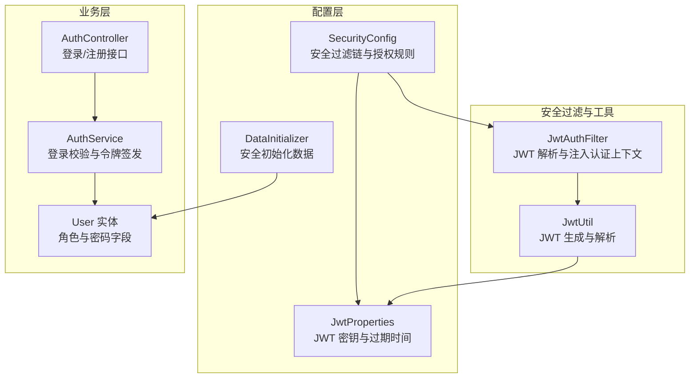
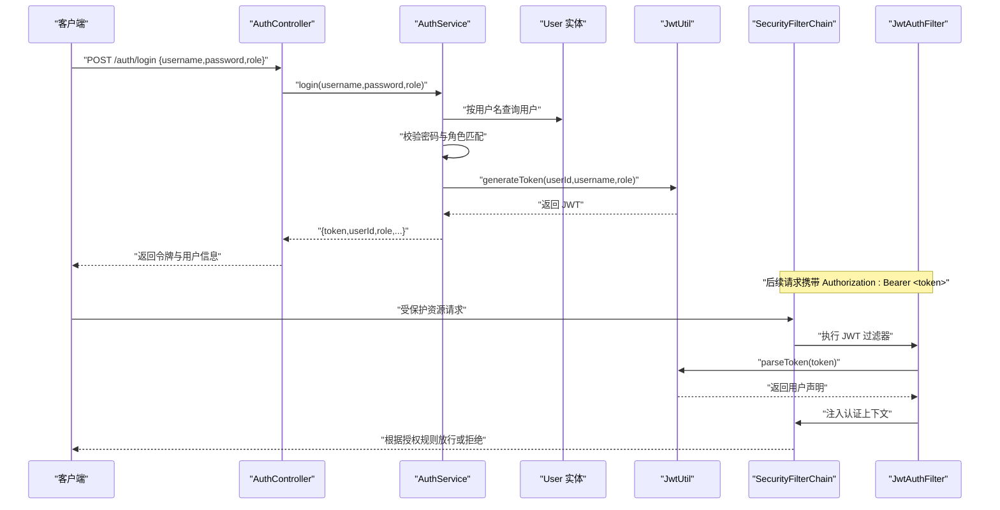
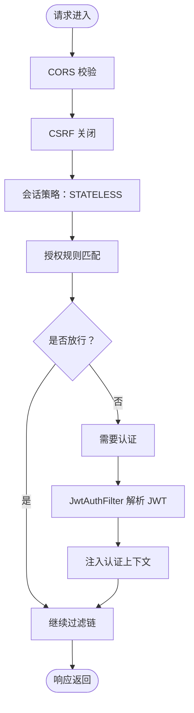
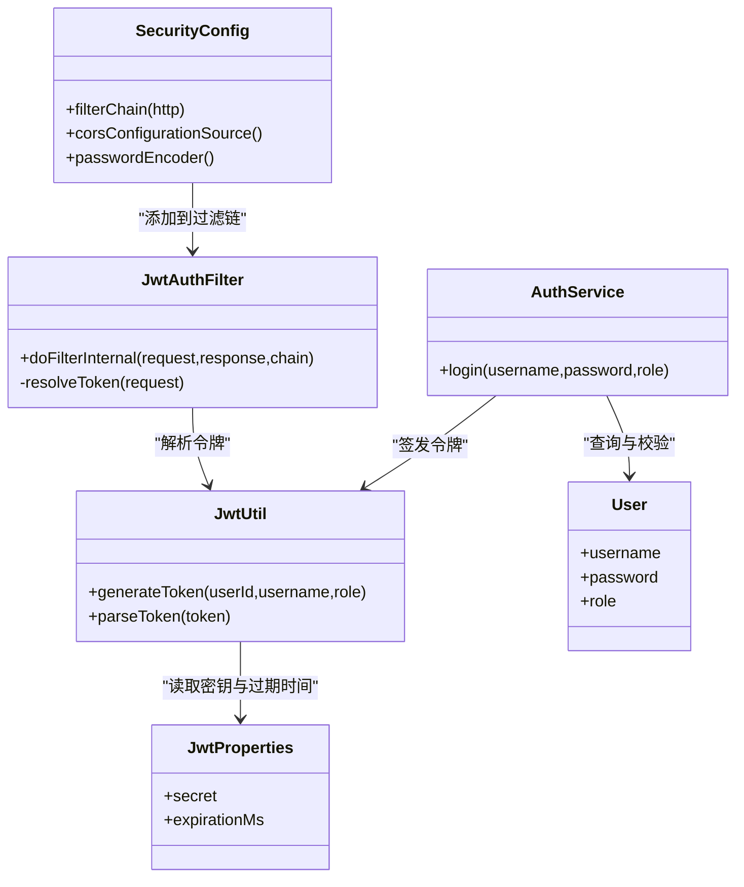
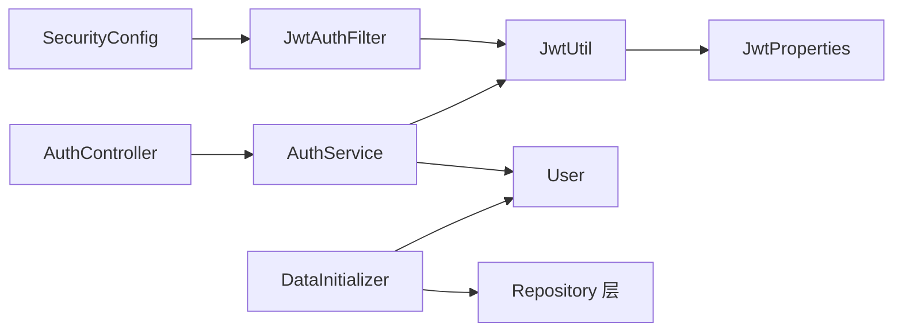

# 安全配置管理

<cite>
**本文引用的文件列表**
- [SecurityConfig.java](file://backend/src/main/java/com/mall/config/SecurityConfig.java)
- [DataInitializer.java](file://backend/src/main/java/com/mall/config/DataInitializer.java)
- [Role.java](file://backend/src/main/java/com/mall/common/Role.java)
- [JwtAuthFilter.java](file://backend/src/main/java/com/mall/security/JwtAuthFilter.java)
- [JwtUtil.java](file://backend/src/main/java/com/mall/security/JwtUtil.java)
- [JwtProperties.java](file://backend/src/main/java/com/mall/config/JwtProperties.java)
- [User.java](file://backend/src/main/java/com/mall/entity/User.java)
- [AuthService.java](file://backend/src/main/java/com/mall/service/AuthService.java)
- [AuthController.java](file://backend/src/main/java/com/mall/controller/AuthController.java)
- [application.yml](file://backend/src/main/resources/application.yml)
</cite>

## 目录
1. [简介](#简介)
2. [项目结构](#项目结构)
3. [核心组件](#核心组件)
4. [架构总览](#架构总览)
5. [详细组件分析](#详细组件分析)
6. [依赖关系分析](#依赖关系分析)
7. [性能考量](#性能考量)
8. [故障排查指南](#故障排查指南)
9. [结论](#结论)
10. [附录](#附录)

## 简介
本文件面向安全配置管理，系统性解析后端安全体系，重点覆盖：
- SecurityConfig 中的安全策略：CORS 跨域、CSRF 防护、会话管理、HTTP 安全头与请求授权规则
- PasswordEncoder 密码编码器与 BCrypt 加密机制
- DataInitializer 中的安全相关初始化数据（默认用户与角色）
- 基于 Spring Security 与 JWT 的认证与授权流程
- 安全最佳实践与常见漏洞防范

## 项目结构
后端安全相关模块主要分布在以下位置：
- 配置层：SecurityConfig、JwtProperties、DataInitializer
- 安全过滤与工具：JwtAuthFilter、JwtUtil
- 实体与服务：User、AuthService
- 控制器：AuthController
- 配置文件：application.yml

图表来源
- [SecurityConfig.java:33-55](file://backend/src/main/java/com/mall/config/SecurityConfig.java#L33-L55)
- [JwtAuthFilter.java:18-56](file://backend/src/main/java/com/mall/security/JwtAuthFilter.java#L18-L56)
- [JwtUtil.java:12-47](file://backend/src/main/java/com/mall/security/JwtUtil.java#L12-L47)
- [JwtProperties.java:9-17](file://backend/src/main/java/com/mall/config/JwtProperties.java#L9-L17)
- [AuthController.java:11-72](file://backend/src/main/java/com/mall/controller/AuthController.java#L11-L72)
- [AuthService.java:17-91](file://backend/src/main/java/com/mall/service/AuthService.java#L17-L91)
- [User.java:10-87](file://backend/src/main/java/com/mall/entity/User.java#L10-L87)
- [DataInitializer.java:14-94](file://backend/src/main/java/com/mall/config/DataInitializer.java#L14-L94)

章节来源
- [SecurityConfig.java:22-73](file://backend/src/main/java/com/mall/config/SecurityConfig.java#L22-L73)
- [application.yml:1-36](file://backend/src/main/resources/application.yml#L1-L36)

## 核心组件
- SecurityConfig：定义全局安全过滤链、CORS、CSRF、会话策略、授权规则与密码编码器
- JwtAuthFilter：从请求头提取 JWT 并注入 Spring Security 上下文
- JwtUtil：基于对称密钥生成与解析 JWT
- JwtProperties：JWT 密钥与过期时间配置
- AuthService：登录校验、角色匹配、令牌签发
- DataInitializer：初始化管理员、运营、普通用户及基础数据

章节来源
- [SecurityConfig.java:33-73](file://backend/src/main/java/com/mall/config/SecurityConfig.java#L33-L73)
- [JwtAuthFilter.java:18-56](file://backend/src/main/java/com/mall/security/JwtAuthFilter.java#L18-L56)
- [JwtUtil.java:12-47](file://backend/src/main/java/com/mall/security/JwtUtil.java#L12-L47)
- [JwtProperties.java:9-17](file://backend/src/main/java/com/mall/config/JwtProperties.java#L9-L17)
- [AuthService.java:17-91](file://backend/src/main/java/com/mall/service/AuthService.java#L17-L91)
- [DataInitializer.java:14-94](file://backend/src/main/java/com/mall/config/DataInitializer.java#L14-L94)

## 架构总览
整体安全架构采用“无状态会话 + JWT”的认证模式，通过自定义过滤器在请求进入时解析 JWT 并注入认证上下文，随后由授权规则控制访问权限。

图表来源
- [AuthController.java:18-35](file://backend/src/main/java/com/mall/controller/AuthController.java#L18-L35)
- [AuthService.java:28-58](file://backend/src/main/java/com/mall/service/AuthService.java#L28-L58)
- [JwtUtil.java:23-43](file://backend/src/main/java/com/mall/security/JwtUtil.java#L23-L43)
- [SecurityConfig.java:34-54](file://backend/src/main/java/com/mall/config/SecurityConfig.java#L34-L54)
- [JwtAuthFilter.java:30-46](file://backend/src/main/java/com/mall/security/JwtAuthFilter.java#L30-L46)

## 详细组件分析

### SecurityConfig 安全配置策略
- CORS 跨域配置
  - 允许来源：本地开发环境的特定端口
  - 允许方法：GET、POST、PUT、DELETE、OPTIONS
  - 允许头：所有头
  - 凭据允许：开启
- CSRF 防护
  - 显式关闭 CSRF，适用于无状态 API
- 会话管理策略
  - 无状态会话（STATELESS），避免服务器端会话存储
- HTTP 安全头
  - 未显式配置额外安全头，默认遵循 Spring Boot 安全默认
- 授权规则
  - OPTIONS 预检放行
  - 认证接口放行
  - 图片资源放行
  - 公共接口放行
  - 各路径前缀按角色授权
  - 其他请求均需认证
- 密码编码器
  - 使用 BCryptPasswordEncoder

图表来源
- [SecurityConfig.java:34-54](file://backend/src/main/java/com/mall/config/SecurityConfig.java#L34-L54)
- [SecurityConfig.java:57-67](file://backend/src/main/java/com/mall/config/SecurityConfig.java#L57-L67)
- [SecurityConfig.java:69-72](file://backend/src/main/java/com/mall/config/SecurityConfig.java#L69-L72)

章节来源
- [SecurityConfig.java:33-73](file://backend/src/main/java/com/mall/config/SecurityConfig.java#L33-L73)

### PasswordEncoder 与 BCrypt 加密机制
- 密码编码器 Bean
  - 在 SecurityConfig 中定义 BCryptPasswordEncoder
- 登录校验
  - AuthService 使用 PasswordEncoder.matches 对比明文与数据库中哈希值
- 注册流程
  - DataInitializer 与 AuthService 在保存用户时使用 passwordEncoder.encode 对密码进行编码
- 安全特性
  - BCrypt 是自适应散列函数，具备成本因子可调、盐值随机化等特性，能有效抵御彩虹表与暴力破解

章节来源
- [SecurityConfig.java:69-72](file://backend/src/main/java/com/mall/config/SecurityConfig.java#L69-L72)
- [AuthService.java:34-36](file://backend/src/main/java/com/mall/service/AuthService.java#L34-L36)
- [AuthService.java:78-88](file://backend/src/main/java/com/mall/service/AuthService.java#L78-L88)
- [DataInitializer.java:33-33](file://backend/src/main/java/com/mall/config/DataInitializer.java#L33-L33)

### DataInitializer 安全相关初始化数据
- 默认用户与角色
  - 管理员：用户名、密码、昵称、角色 ADMIN、启用状态
  - 运营：用户名、密码、昵称、角色 MERCHANT、绑定商户 ID、启用状态
  - 普通用户：用户名、密码、昵称、角色 USER、启用状态
- 密码处理
  - 使用 PasswordEncoder 编码后持久化
- 角色枚举
  - Role 提供 ADMIN、MERCHANT、USER 三类角色

章节来源
- [DataInitializer.java:30-61](file://backend/src/main/java/com/mall/config/DataInitializer.java#L30-L61)
- [Role.java:3-7](file://backend/src/main/java/com/mall/common/Role.java#L3-L7)
- [User.java:56-58](file://backend/src/main/java/com/mall/entity/User.java#L56-L58)

### JwtAuthFilter 与 JwtUtil
- JwtAuthFilter
  - 从 Authorization 头解析 Bearer Token
  - 解析失败则忽略，继续放行（无认证）
  - 成功解析后将用户声明注入到 SecurityContext
- JwtUtil
  - 基于对称密钥（来自 JwtProperties）生成与解析 JWT
  - 令牌包含用户标识、用户名、角色、签发时间与过期时间

图表来源
- [SecurityConfig.java:27-31](file://backend/src/main/java/com/mall/config/SecurityConfig.java#L27-L31)
- [JwtAuthFilter.java:24-27](file://backend/src/main/java/com/mall/security/JwtAuthFilter.java#L24-L27)
- [JwtUtil.java:15-21](file://backend/src/main/java/com/mall/security/JwtUtil.java#L15-L21)
- [JwtProperties.java:13-17](file://backend/src/main/java/com/mall/config/JwtProperties.java#L13-L17)
- [AuthService.java:27-58](file://backend/src/main/java/com/mall/service/AuthService.java#L27-L58)
- [User.java:23-28](file://backend/src/main/java/com/mall/entity/User.java#L23-L28)

章节来源
- [JwtAuthFilter.java:18-56](file://backend/src/main/java/com/mall/security/JwtAuthFilter.java#L18-L56)
- [JwtUtil.java:12-47](file://backend/src/main/java/com/mall/security/JwtUtil.java#L12-L47)
- [JwtProperties.java:9-17](file://backend/src/main/java/com/mall/config/JwtProperties.java#L9-L17)

### 授权规则与角色映射
- 授权规则
  - OPTIONS 预检放行
  - 认证接口放行
  - 图片资源放行
  - 公共接口放行
  - /user/** 需要 ROLE_USER
  - /merchant/** 需要 ROLE_MERCHANT
  - /admin/** 需要 ROLE_ADMIN
  - 其他请求均需认证
- 角色映射
  - JwtAuthFilter 将用户声明转换为 "ROLE_<role>" 形式的权限
  - SecurityConfig 的 hasRole(...) 与 JwtAuthFilter 的权限字符串保持一致

章节来源
- [SecurityConfig.java:39-52](file://backend/src/main/java/com/mall/config/SecurityConfig.java#L39-L52)
- [JwtAuthFilter.java:37-38](file://backend/src/main/java/com/mall/security/JwtAuthFilter.java#L37-L38)

### 认证流程与登录接口
- AuthController
  - /auth/login：接收用户名、密码、角色，调用 AuthService.login
  - /auth/register：接收用户注册信息，调用 AuthService.registerUser
- AuthService.login
  - 查询用户并校验启用状态
  - 使用 PasswordEncoder.matches 校验密码
  - 校验选择的角色与用户实际角色一致
  - 运营账号需校验商户主体启用状态
  - 生成 JWT 并返回用户信息
- AuthService.registerUser
  - 校验用户名唯一性
  - 使用 PasswordEncoder.encode 编码密码
  - 保存为普通用户（Role.USER）

章节来源
- [AuthController.java:18-71](file://backend/src/main/java/com/mall/controller/AuthController.java#L18-L71)
- [AuthService.java:28-58](file://backend/src/main/java/com/mall/service/AuthService.java#L28-L58)
- [AuthService.java:62-90](file://backend/src/main/java/com/mall/service/AuthService.java#L62-L90)

## 依赖关系分析
- 组件耦合
  - SecurityConfig 依赖 JwtAuthFilter
  - JwtAuthFilter 依赖 JwtUtil
  - JwtUtil 依赖 JwtProperties
  - AuthService 依赖 UserRepository、MerchantRepository、PasswordEncoder、JwtUtil
  - AuthController 依赖 AuthService
  - DataInitializer 依赖 UserRepository、MerchantRepository、CategoryRepository、ProductRepository、NewsRepository、PasswordEncoder
- 外部依赖
  - Spring Security（WebSecurity、MethodSecurity、SecurityFilterChain）
  - Spring Boot Starter Security
  - JWT 库（io.jsonwebtoken）
  - MySQL 数据源与 JPA

图表来源
- [SecurityConfig.java:27-31](file://backend/src/main/java/com/mall/config/SecurityConfig.java#L27-L31)
- [JwtAuthFilter.java:24-27](file://backend/src/main/java/com/mall/security/JwtAuthFilter.java#L24-L27)
- [JwtUtil.java:15-21](file://backend/src/main/java/com/mall/security/JwtUtil.java#L15-L21)
- [AuthController.java:16-16](file://backend/src/main/java/com/mall/controller/AuthController.java#L16-L16)
- [AuthService.java:22-25](file://backend/src/main/java/com/mall/service/AuthService.java#L22-L25)
- [DataInitializer.java:18-23](file://backend/src/main/java/com/mall/config/DataInitializer.java#L18-L23)

章节来源
- [application.yml:1-36](file://backend/src/main/resources/application.yml#L1-L36)

## 性能考量
- 无状态会话
  - STATELESS 策略避免服务器端会话存储，降低内存占用与扩展复杂度
- JWT 解析开销
  - 每次请求解析一次签名与负载，建议合理设置密钥长度与过期时间
- 密码编码成本
  - BCrypt 成本因子影响登录耗时，应结合硬件能力调整
- 授权规则
  - 精准的放行规则减少不必要的认证检查

[本节为通用指导，无需具体文件引用]

## 故障排查指南
- 登录失败
  - 用户名或密码错误：检查 AuthService.login 的异常抛出逻辑
  - 角色不匹配：确认前端传入的 role 与用户实际角色一致
  - 商户被禁用：运营账号需确保商户主体处于启用状态
- JWT 无效
  - 检查 Authorization 头格式是否为 Bearer <token>
  - 核对密钥与过期时间配置（application.yml 与 JwtProperties）
  - 确认令牌未过期
- CORS 问题
  - 检查 SecurityConfig 中的 allowedOrigins 是否包含前端地址
  - 确认前端请求头与预检 OPTIONS 是否正确
- CSRF 与会话
  - 由于关闭了 CSRF，确保前端不再依赖会话态；如需会话态，请评估风险并谨慎开启

章节来源
- [AuthService.java:30-47](file://backend/src/main/java/com/mall/service/AuthService.java#L30-L47)
- [JwtAuthFilter.java:33-44](file://backend/src/main/java/com/mall/security/JwtAuthFilter.java#L33-L44)
- [SecurityConfig.java:58-67](file://backend/src/main/java/com/mall/config/SecurityConfig.java#L58-L67)
- [application.yml:27-30](file://backend/src/main/resources/application.yml#L27-L30)

## 结论
本项目采用“无状态 + JWT”的安全架构，通过 SecurityConfig 统一配置 CORS、CSRF、会话与授权规则，配合 JwtAuthFilter 与 JwtUtil 实现令牌解析与注入，结合 BCrypt 与 PasswordEncoder 确保密码安全。DataInitializer 提供初始安全数据，便于开发与测试。整体设计简洁、可维护性强，适合微服务与前后端分离场景。

[本节为总结，无需具体文件引用]

## 附录

### 安全最佳实践与配置优化建议
- 密钥与过期时间
  - 使用足够强度的密钥（≥256bit），定期轮换
  - 合理设置过期时间，短期令牌配合刷新机制
- CORS 与跨域
  - 生产环境限制 allowedOrigins，避免使用通配符
  - 明确允许的方法与头，最小化暴露面
- CSRF 与会话
  - API 通常关闭 CSRF，若仍需会话态，务必启用 CSRF 保护并妥善管理会话
- 授权与角色
  - 明确各前缀的访问角色，避免过度放行
  - 使用方法级安全注解（@PreAuthorize 等）细化权限控制
- 密码策略
  - 强制最小长度与复杂度，定期更换
  - 启用账户锁定与登录失败阈值
- 日志与监控
  - 记录安全事件（登录失败、权限拒绝），但避免泄露敏感信息
  - 监控异常登录与高频请求

[本节为通用指导，无需具体文件引用]