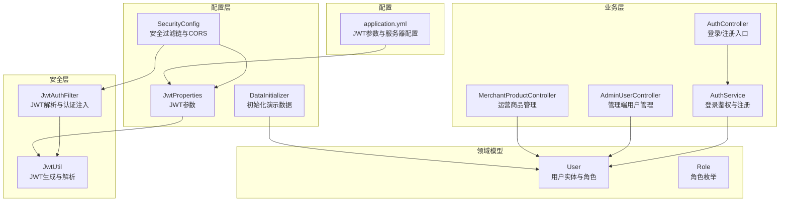
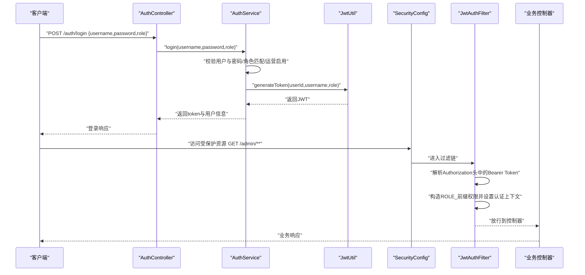
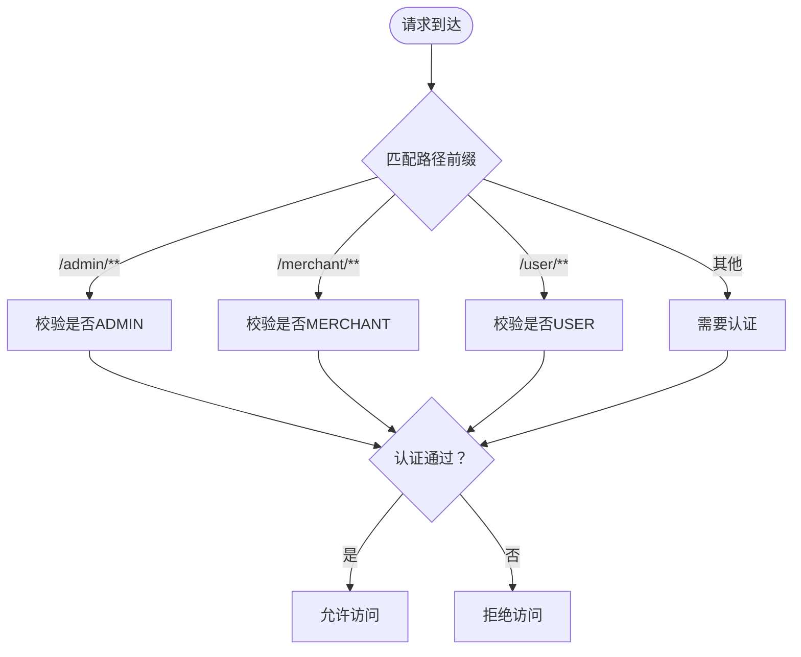
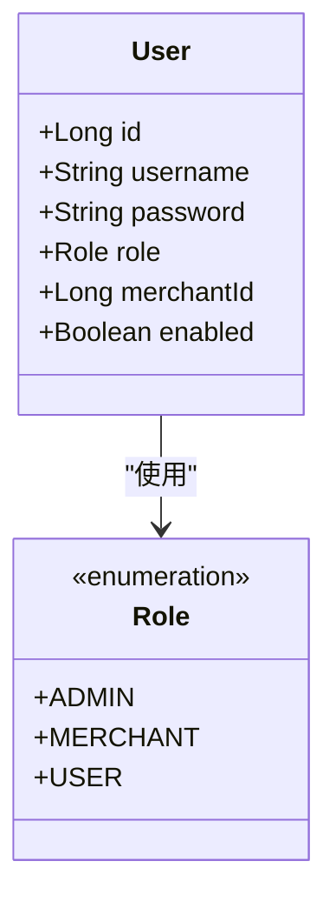
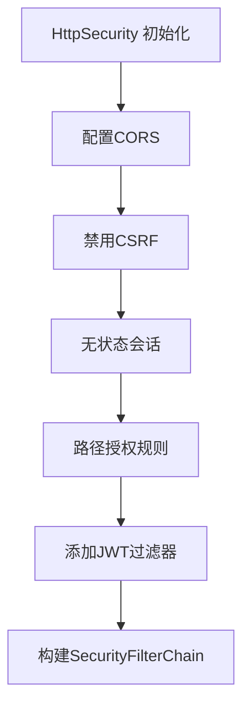
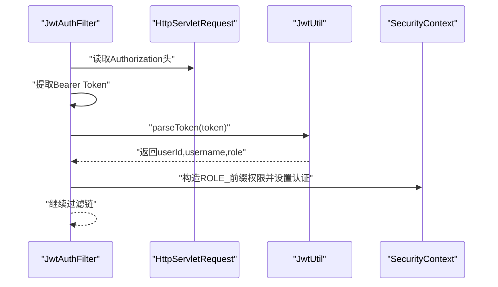
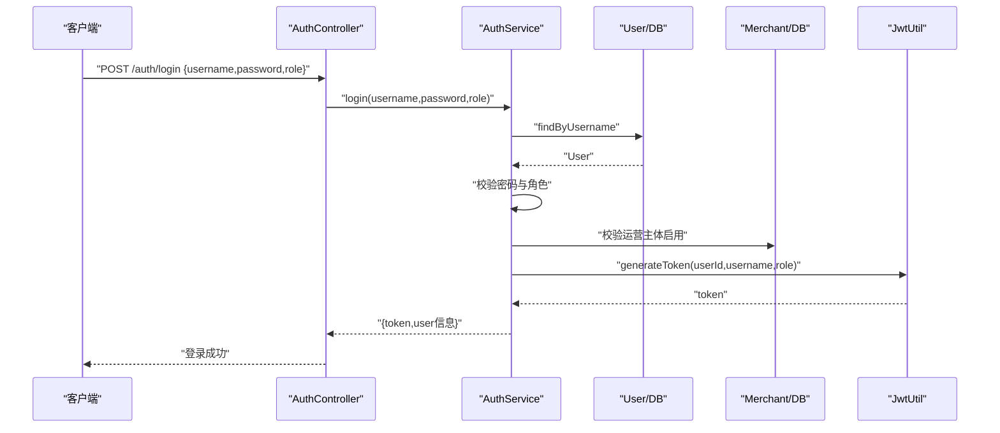
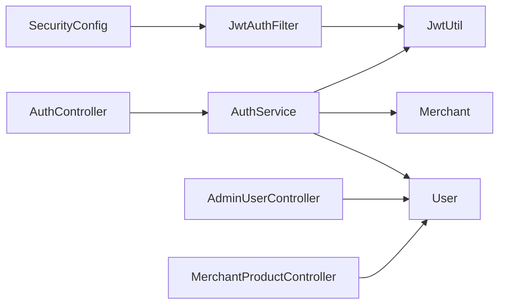

# 角色权限控制

<cite>
**本文引用的文件**
- [Role.java](file://backend/src/main/java/com/mall/common/Role.java)
- [SecurityConfig.java](file://backend/src/main/java/com/mall/config/SecurityConfig.java)
- [JwtAuthFilter.java](file://backend/src/main/java/com/mall/security/JwtAuthFilter.java)
- [JwtUtil.java](file://backend/src/main/java/com/mall/security/JwtUtil.java)
- [JwtProperties.java](file://backend/src/main/java/com/mall/config/JwtProperties.java)
- [AuthService.java](file://backend/src/main/java/com/mall/service/AuthService.java)
- [AuthController.java](file://backend/src/main/java/com/mall/controller/AuthController.java)
- [User.java](file://backend/src/main/java/com/mall/entity/User.java)
- [AdminUserController.java](file://backend/src/main/java/com/mall/controller/admin/AdminUserController.java)
- [MerchantProductController.java](file://backend/src/main/java/com/mall/controller/merchant/MerchantProductController.java)
- [application.yml](file://backend/src/main/resources/application.yml)
- [DataInitializer.java](file://backend/src/main/java/com/mall/config/DataInitializer.java)
</cite>

## 目录
1. [简介](#简介)
2. [项目结构](#项目结构)
3. [核心组件](#核心组件)
4. [架构总览](#架构总览)
5. [详细组件分析](#详细组件分析)
6. [依赖分析](#依赖分析)
7. [性能考虑](#性能考虑)
8. [故障排查指南](#故障排查指南)
9. [结论](#结论)
10. [附录](#附录)

## 简介
本技术文档围绕角色权限控制系统展开，重点解析多角色权限模型的设计理念与实现方式，涵盖 ADMIN（管理员）、MERCHANT（商户/运营）、USER（普通用户）三类角色的权限边界与访问范围；详解 Role 枚举类的定义与使用；解释 SecurityConfig 中基于路径的权限控制策略与基于注解的权限控制配置思路；提供角色权限分配的最佳实践与常见问题解决方案，并给出完整的权限控制流程图与配置示例。

## 项目结构
后端采用 Spring Boot + Spring Security + JWT 的典型分层架构：
- common：通用枚举与数据传输对象
- config：安全配置、JWT 参数、初始化器
- security：JWT 过滤器与工具
- controller：按角色划分的控制器层（admin、merchant、user、pub）
- service：业务服务层
- repository：数据访问层
- entity：领域实体
- resources：配置文件与静态资源

图表来源
- [SecurityConfig.java:33-55](file://backend/src/main/java/com/mall/config/SecurityConfig.java#L33-L55)
- [JwtAuthFilter.java:30-47](file://backend/src/main/java/com/mall/security/JwtAuthFilter.java#L30-L47)
- [JwtUtil.java:23-44](file://backend/src/main/java/com/mall/security/JwtUtil.java#L23-L44)
- [JwtProperties.java:13-17](file://backend/src/main/java/com/mall/config/JwtProperties.java#L13-L17)
- [AuthController.java:18-35](file://backend/src/main/java/com/mall/controller/AuthController.java#L18-L35)
- [AuthService.java:28-59](file://backend/src/main/java/com/mall/service/AuthService.java#L28-L59)
- [AdminUserController.java:26-36](file://backend/src/main/java/com/mall/controller/admin/AdminUserController.java#L26-L36)
- [MerchantProductController.java:36-44](file://backend/src/main/java/com/mall/controller/merchant/MerchantProductController.java#L36-L44)
- [User.java:56-58](file://backend/src/main/java/com/mall/entity/User.java#L56-L58)
- [Role.java:3-7](file://backend/src/main/java/com/mall/common/Role.java#L3-L7)
- [application.yml:27-30](file://backend/src/main/resources/application.yml#L27-L30)
- [DataInitializer.java:30-61](file://backend/src/main/java/com/mall/config/DataInitializer.java#L30-L61)

章节来源
- [SecurityConfig.java:33-55](file://backend/src/main/java/com/mall/config/SecurityConfig.java#L33-L55)
- [application.yml:27-30](file://backend/src/main/resources/application.yml#L27-L30)

## 核心组件
- Role 枚举：定义 ADMIN、MERCHANT、USER 三类角色，用于实体存储与权限判定。
- SecurityConfig：配置基于路径的授权规则（如 /admin/**、/merchant/**、/user/**），开启方法级安全与 CORS。
- JwtAuthFilter：从请求头解析 Bearer Token，构建认证上下文，注入 ROLE_ 前缀的权限。
- JwtUtil：基于密钥生成与解析 JWT，携带用户标识与角色信息。
- AuthService：登录校验、角色匹配、运营主体启用检查、签发 JWT。
- 控制器层：AdminUserController、MerchantProductController 等按角色划分，体现不同访问范围。

章节来源
- [Role.java:3-7](file://backend/src/main/java/com/mall/common/Role.java#L3-L7)
- [SecurityConfig.java:33-55](file://backend/src/main/java/com/mall/config/SecurityConfig.java#L33-L55)
- [JwtAuthFilter.java:30-47](file://backend/src/main/java/com/mall/security/JwtAuthFilter.java#L30-L47)
- [JwtUtil.java:23-44](file://backend/src/main/java/com/mall/security/JwtUtil.java#L23-L44)
- [AuthService.java:28-59](file://backend/src/main/java/com/mall/service/AuthService.java#L28-L59)

## 架构总览
下图展示从客户端到控制器的完整权限控制流程，包括登录、JWT 解析、角色注入与路径授权。

图表来源
- [AuthController.java:18-35](file://backend/src/main/java/com/mall/controller/AuthController.java#L18-L35)
- [AuthService.java:28-59](file://backend/src/main/java/com/mall/service/AuthService.java#L28-L59)
- [JwtUtil.java:23-32](file://backend/src/main/java/com/mall/security/JwtUtil.java#L23-L32)
- [SecurityConfig.java:33-55](file://backend/src/main/java/com/mall/config/SecurityConfig.java#L33-L55)
- [JwtAuthFilter.java:30-47](file://backend/src/main/java/com/mall/security/JwtAuthFilter.java#L30-L47)

## 详细组件分析

### 角色模型与权限边界
- ADMIN（管理员）：拥有系统最高权限，通过路径 /admin/** 受限，适合后台管理功能。
- MERCHANT（商户/运营）：面向运营主体，通过路径 /merchant/** 受限，适合商品管理、订单处理等。
- USER（普通用户）：面向终端消费者，通过路径 /user/** 受限，适合个人中心、购物车、订单等。

图表来源
- [SecurityConfig.java:48-50](file://backend/src/main/java/com/mall/config/SecurityConfig.java#L48-L50)

章节来源
- [SecurityConfig.java:48-50](file://backend/src/main/java/com/mall/config/SecurityConfig.java#L48-L50)
- [User.java:56-58](file://backend/src/main/java/com/mall/entity/User.java#L56-L58)

### Role 枚举与实体绑定
- Role 枚举在 User 实体中以字符串形式持久化，便于跨模块一致使用。
- 登录时 AuthService 会校验前端选择的角色与实体角色是否一致，避免越权登录。

图表来源
- [Role.java:3-7](file://backend/src/main/java/com/mall/common/Role.java#L3-L7)
- [User.java:56-58](file://backend/src/main/java/com/mall/entity/User.java#L56-L58)

章节来源
- [Role.java:3-7](file://backend/src/main/java/com/mall/common/Role.java#L3-L7)
- [User.java:56-58](file://backend/src/main/java/com/mall/entity/User.java#L56-L58)

### 安全配置与路径授权
- 启用 Web 与方法级安全，关闭 CSRF，会话策略为无状态。
- 明确放行公开接口（如 /auth/**、图片资源等），并对 /admin/**、/merchant/**、/user/** 设置角色要求。
- 注入 JwtAuthFilter，在用户名密码过滤器之前执行，完成 JWT 解析与认证上下文注入。

图表来源
- [SecurityConfig.java:33-55](file://backend/src/main/java/com/mall/config/SecurityConfig.java#L33-L55)

章节来源
- [SecurityConfig.java:33-55](file://backend/src/main/java/com/mall/config/SecurityConfig.java#L33-L55)

### JWT 认证流程与权限注入
- JwtAuthFilter 从 Authorization 头解析 Bearer Token，调用 JwtUtil 解析出用户标识与角色。
- 将角色转换为 ROLE_ADMIN/ROLE_MERCHANT/ROLE_USER 并注入到认证上下文，供后续授权判断使用。

图表来源
- [JwtAuthFilter.java:30-47](file://backend/src/main/java/com/mall/security/JwtAuthFilter.java#L30-L47)
- [JwtUtil.java:34-44](file://backend/src/main/java/com/mall/security/JwtUtil.java#L34-L44)

章节来源
- [JwtAuthFilter.java:30-47](file://backend/src/main/java/com/mall/security/JwtAuthFilter.java#L30-L47)
- [JwtUtil.java:34-44](file://backend/src/main/java/com/mall/security/JwtUtil.java#L34-L44)

### 登录与注册流程
- AuthController 提供 /auth/login 与 /auth/register 接口。
- AuthService.login 校验用户状态、密码、角色匹配与运营主体启用状态，随后签发 JWT。
- 注册流程默认赋予 USER 角色。

图表来源
- [AuthController.java:18-35](file://backend/src/main/java/com/mall/controller/AuthController.java#L18-L35)
- [AuthService.java:28-59](file://backend/src/main/java/com/mall/service/AuthService.java#L28-L59)
- [JwtUtil.java:23-32](file://backend/src/main/java/com/mall/security/JwtUtil.java#L23-L32)

章节来源
- [AuthController.java:18-35](file://backend/src/main/java/com/mall/controller/AuthController.java#L18-L35)
- [AuthService.java:28-59](file://backend/src/main/java/com/mall/service/AuthService.java#L28-L59)

### 方法级权限控制（设计建议）
当前 SecurityConfig 已启用方法级安全，但未在控制器上使用 @PreAuthorize/@PostAuthorize 等注解。若需在方法级别进行细粒度权限控制，可参考以下实践：
- 在业务方法上使用 @PreAuthorize("hasRole('ADMIN')") 或 @PreAuthorize("hasRole('MERCHANT')")。
- 对于返回值校验，可使用 @PostAuthorize(...)。
- 结合 @Secured 或 SpEL 表达式实现更灵活的条件授权。

注意：本仓库未直接使用上述注解，此处为最佳实践建议与扩展方向。

### 控制器权限边界示例
- 管理端用户管理：AdminUserController 支持按角色筛选、创建、更新、删除用户，体现 ADMIN 权限边界。
- 运营商品管理：MerchantProductController 通过 Authentication 获取当前用户，再根据 merchantId 限定操作范围，体现 MERCHANT 权限边界。

章节来源
- [AdminUserController.java:26-36](file://backend/src/main/java/com/mall/controller/admin/AdminUserController.java#L26-L36)
- [MerchantProductController.java:28-34](file://backend/src/main/java/com/mall/controller/merchant/MerchantProductController.java#L28-L34)

## 依赖分析
- SecurityConfig 依赖 JwtAuthFilter，负责在过滤链中注入认证上下文。
- JwtAuthFilter 依赖 JwtUtil，负责 JWT 的解析与声明提取。
- AuthService 依赖 UserRepository、MerchantRepository、JwtUtil、PasswordEncoder，承担登录与注册逻辑。
- 控制器依赖服务层，服务层依赖仓储与工具类。

图表来源
- [SecurityConfig.java:27-31](file://backend/src/main/java/com/mall/config/SecurityConfig.java#L27-L31)
- [JwtAuthFilter.java:24-28](file://backend/src/main/java/com/mall/security/JwtAuthFilter.java#L24-L28)
- [JwtUtil.java:18-21](file://backend/src/main/java/com/mall/security/JwtUtil.java#L18-L21)
- [AuthController.java:16-17](file://backend/src/main/java/com/mall/controller/AuthController.java#L16-L17)
- [AuthService.java:22-25](file://backend/src/main/java/com/mall/service/AuthService.java#L22-L25)
- [AdminUserController.java:23-24](file://backend/src/main/java/com/mall/controller/admin/AdminUserController.java#L23-L24)
- [MerchantProductController.java:24-26](file://backend/src/main/java/com/mall/controller/merchant/MerchantProductController.java#L24-L26)

章节来源
- [SecurityConfig.java:27-31](file://backend/src/main/java/com/mall/config/SecurityConfig.java#L27-L31)
- [JwtAuthFilter.java:24-28](file://backend/src/main/java/com/mall/security/JwtAuthFilter.java#L24-L28)
- [JwtUtil.java:18-21](file://backend/src/main/java/com/mall/security/JwtUtil.java#L18-L21)
- [AuthService.java:22-25](file://backend/src/main/java/com/mall/service/AuthService.java#L22-L25)

## 性能考虑
- 无状态会话：通过 JWT 与无状态会话减少服务器端会话开销。
- 过滤器链最小化：仅在必要路径启用复杂授权，避免过度拦截。
- 密钥长度与过期时间：合理设置 JWT 密钥与过期时间，平衡安全性与性能。
- 数据库查询优化：在控制器中尽量使用分页与精确查询，避免 N+1 查询。

## 故障排查指南
- 登录失败：检查用户名是否存在、密码是否匹配、角色是否正确、运营主体是否启用。
- 路径访问被拒：确认请求头是否包含有效的 Bearer Token，且 Token 未过期；检查 SecurityConfig 中的路径授权规则。
- 运营主体异常：当角色为 MERCHANT 时，需确保绑定的运营主体处于启用状态。
- CORS 问题：确认 application.yml 中允许的源与方法配置是否覆盖前端地址。

章节来源
- [AuthService.java:30-47](file://backend/src/main/java/com/mall/service/AuthService.java#L30-L47)
- [SecurityConfig.java:33-55](file://backend/src/main/java/com/mall/config/SecurityConfig.java#L33-L55)
- [application.yml:27-30](file://backend/src/main/resources/application.yml#L27-L30)

## 结论
本权限系统通过 Role 枚举与基于路径的授权策略，结合 JWT 认证与无状态会话，实现了 ADMIN、MERCHANT、USER 三类角色的清晰边界与可控访问范围。配合 DataInitializer 的演示数据，开发者可快速验证登录与授权流程。若需进一步精细化授权，可在方法级别引入 @PreAuthorize/@PostAuthorize 等注解，实现更细粒度的权限控制。

## 附录

### 角色权限分配最佳实践
- 明确角色职责：ADMIN 负责全局管理，MERCHANT 负责自身运营域，USER 仅限消费与个人事务。
- 强制角色匹配：登录时严格校验前端选择的角色与实体角色一致。
- 运营主体校验：MERCHANT 登录时需校验运营主体启用状态。
- 最小权限原则：控制器内对资源操作进行归属校验（如运营仅能操作自身商品）。
- 安全配置统一：集中维护 SecurityConfig，避免分散授权导致的疏漏。

### 常见问题与解决方案
- 问题：登录后仍提示未授权
  - 解决：确认 Authorization 头格式为 Bearer <token>，且 SecurityFilterChain 正常执行。
- 问题：MERCHANT 无法访问运营接口
  - 解决：确认用户实体的 merchantId 与运营主体启用状态，以及控制器内的归属校验逻辑。
- 问题：跨域失败
  - 解决：核对 application.yml 中的 allowedOrigins 与 allowedMethods 是否包含前端地址与请求类型。

### 配置示例（要点）
- application.yml 中的 jwt.secret 与 jwt.expiration-ms 需保持一致且满足安全要求。
- SecurityConfig 中的路径授权规则应与控制器前缀保持一致，避免遗漏。

章节来源
- [application.yml:27-30](file://backend/src/main/resources/application.yml#L27-L30)
- [SecurityConfig.java:33-55](file://backend/src/main/java/com/mall/config/SecurityConfig.java#L33-L55)