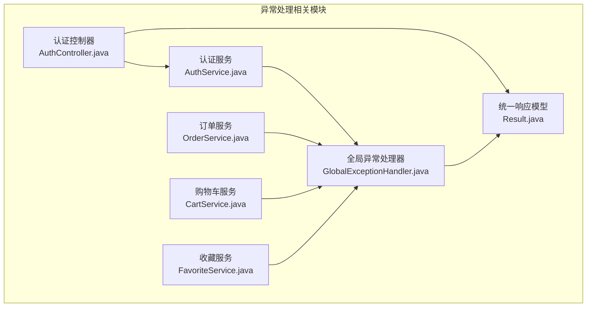
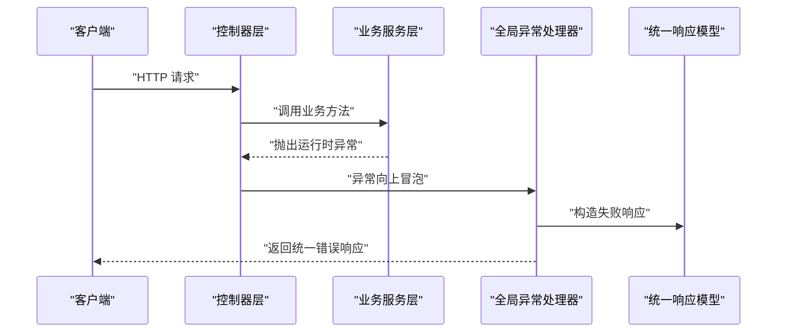
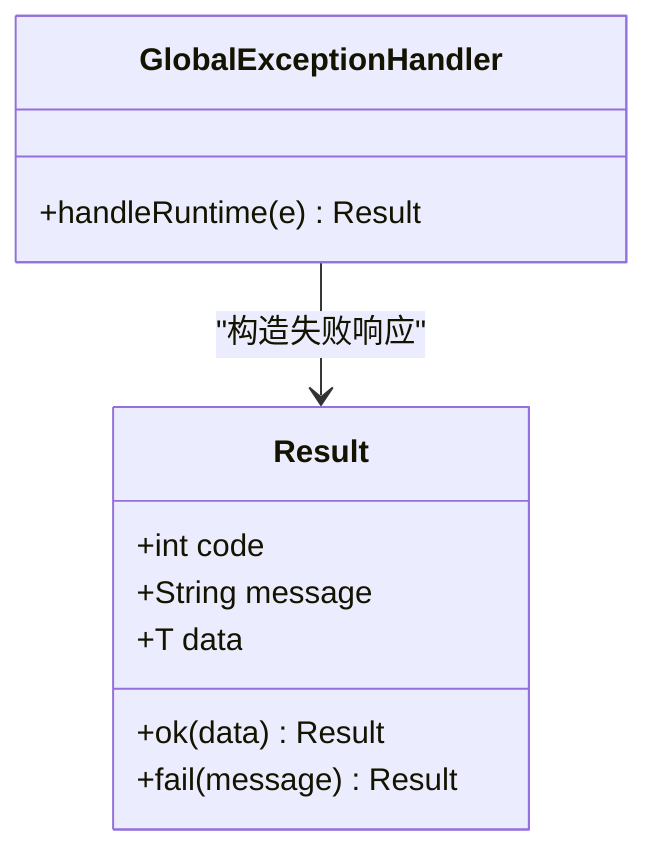
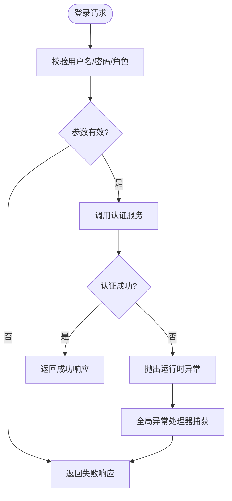
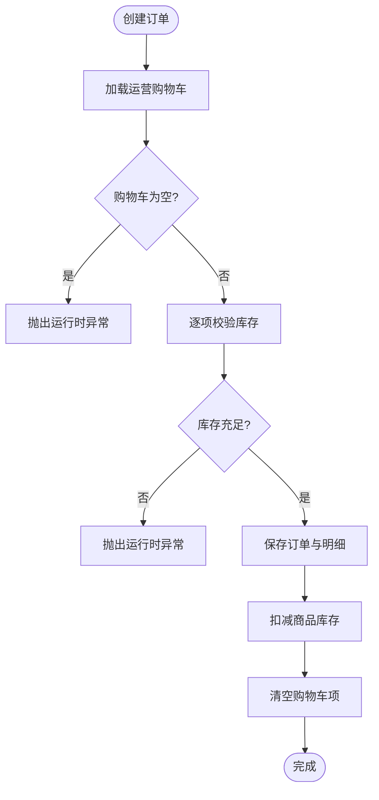
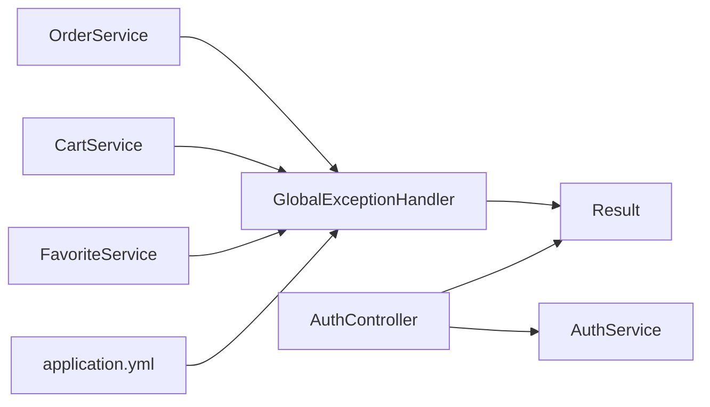

# 异常处理机制

<cite>
**本文引用的文件**
- [GlobalExceptionHandler.java](file://backend/src/main/java/com/mall/exception/GlobalExceptionHandler.java)
- [Result.java](file://backend/src/main/java/com/mall/dto/Result.java)
- [AuthService.java](file://backend/src/main/java/com/mall/service/AuthService.java)
- [OrderService.java](file://backend/src/main/java/com/mall/service/OrderService.java)
- [CartService.java](file://backend/src/main/java/com/mall/service/CartService.java)
- [FavoriteService.java](file://backend/src/main/java/com/mall/service/FavoriteService.java)
- [AuthController.java](file://backend/src/main/java/com/mall/controller/AuthController.java)
- [application.yml](file://backend/src/main/resources/application.yml)
</cite>

## 目录
1. [简介](#简介)
2. [项目结构](#项目结构)
3. [核心组件](#核心组件)
4. [架构总览](#架构总览)
5. [详细组件分析](#详细组件分析)
6. [依赖分析](#依赖分析)
7. [性能考虑](#性能考虑)
8. [故障排查指南](#故障排查指南)
9. [结论](#结论)
10. [附录](#附录)

## 简介
本文件面向电商商城系统的异常处理机制，系统性梳理全局异常处理器的设计与实现、统一错误响应格式、业务异常处理策略、国际化与日志记录现状与改进建议，以及最佳实践与排障指引。当前系统采用 Spring MVC 的全局异常处理器将运行时异常统一转换为统一响应体，业务层通过抛出运行时异常表达“业务失败”，控制器层也对部分场景进行显式拦截与封装。

## 项目结构
围绕异常处理的关键模块与文件如下：
- 全局异常处理器：用于捕获运行时异常并返回统一响应
- 统一响应模型：定义统一的响应结构
- 业务服务层：在业务规则不满足时抛出运行时异常
- 控制器层：对部分输入校验与异常进行显式处理
- 日志配置：应用日志级别与输出位置

图表来源
- [GlobalExceptionHandler.java:10-18](file://backend/src/main/java/com/mall/exception/GlobalExceptionHandler.java#L10-L18)
- [Result.java:10-23](file://backend/src/main/java/com/mall/dto/Result.java#L10-L23)
- [AuthController.java:18-35](file://backend/src/main/java/com/mall/controller/AuthController.java#L18-L35)
- [AuthService.java:28-59](file://backend/src/main/java/com/mall/service/AuthService.java#L28-L59)
- [OrderService.java:34-88](file://backend/src/main/java/com/mall/service/OrderService.java#L34-L88)
- [CartService.java:26-43](file://backend/src/main/java/com/mall/service/CartService.java#L26-L43)
- [FavoriteService.java:33-36](file://backend/src/main/java/com/mall/service/FavoriteService.java#L33-L36)

章节来源
- [GlobalExceptionHandler.java:10-18](file://backend/src/main/java/com/mall/exception/GlobalExceptionHandler.java#L10-L18)
- [Result.java:10-23](file://backend/src/main/java/com/mall/dto/Result.java#L10-L23)
- [AuthController.java:18-35](file://backend/src/main/java/com/mall/controller/AuthController.java#L18-L35)
- [AuthService.java:28-59](file://backend/src/main/java/com/mall/service/AuthService.java#L28-L59)
- [OrderService.java:34-88](file://backend/src/main/java/com/mall/service/OrderService.java#L34-L88)
- [CartService.java:26-43](file://backend/src/main/java/com/mall/service/CartService.java#L26-L43)
- [FavoriteService.java:33-36](file://backend/src/main/java/com/mall/service/FavoriteService.java#L33-L36)

## 核心组件
- 全局异常处理器：以注解驱动的方式捕获运行时异常，统一返回“失败”响应，避免前端直接暴露底层异常堆栈。
- 统一响应模型：包含状态码、消息与数据三要素，提供成功与失败两类静态工厂方法，便于控制器与服务层快速构造响应。
- 业务服务层异常：在业务前置条件不满足时抛出运行时异常，由全局异常处理器接管。
- 控制器层异常：对输入参数与业务调用过程中的异常进行显式捕获与封装，确保对外一致的错误语义。
- 日志配置：应用日志级别在配置文件中定义，便于后续扩展到异常日志记录。

章节来源
- [GlobalExceptionHandler.java:10-18](file://backend/src/main/java/com/mall/exception/GlobalExceptionHandler.java#L10-L18)
- [Result.java:16-22](file://backend/src/main/java/com/mall/dto/Result.java#L16-L22)
- [AuthController.java:29-34](file://backend/src/main/java/com/mall/controller/AuthController.java#L29-L34)
- [application.yml:32-36](file://backend/src/main/resources/application.yml#L32-L36)

## 架构总览
全局异常处理的端到端流程如下：

图表来源
- [GlobalExceptionHandler.java:13-17](file://backend/src/main/java/com/mall/exception/GlobalExceptionHandler.java#L13-L17)
- [Result.java:20-22](file://backend/src/main/java/com/mall/dto/Result.java#L20-L22)

## 详细组件分析

### 全局异常处理器
- 设计原则：集中捕获运行时异常，屏蔽底层细节，向客户端返回可读性强的错误消息。
- 实现要点：使用注解声明为全局控制器增强，针对运行时异常进行统一处理；当异常消息为空或空白时，回退为默认提示。
- 响应格式：通过统一响应模型构造失败响应，状态码与消息字段标准化。

图表来源
- [GlobalExceptionHandler.java:13-17](file://backend/src/main/java/com/mall/exception/GlobalExceptionHandler.java#L13-L17)
- [Result.java:10-23](file://backend/src/main/java/com/mall/dto/Result.java#L10-L23)

章节来源
- [GlobalExceptionHandler.java:10-18](file://backend/src/main/java/com/mall/exception/GlobalExceptionHandler.java#L10-L18)
- [Result.java:16-22](file://backend/src/main/java/com/mall/dto/Result.java#L16-L22)

### 统一响应模型
- 结构定义：包含状态码、消息与数据三部分，便于前后端约定一致的契约。
- 工厂方法：提供成功与失败两类静态方法，简化调用侧构造逻辑。
- 使用范围：被全局异常处理器与控制器层广泛使用，保证错误与成功的响应格式一致。

章节来源
- [Result.java:10-23](file://backend/src/main/java/com/mall/dto/Result.java#L10-L23)

### 认证服务与控制器
- 输入校验：控制器对关键参数进行前置校验，不符合要求时直接返回失败响应，避免进入业务流程。
- 业务异常：认证服务在用户不存在、密码错误、角色不匹配、运营主体禁用等场景抛出运行时异常，交由全局异常处理器处理。
- 失败路径：控制器对业务异常进行捕获并封装为统一响应，提升用户体验与一致性。

图表来源
- [AuthController.java:23-34](file://backend/src/main/java/com/mall/controller/AuthController.java#L23-L34)
- [AuthService.java:28-59](file://backend/src/main/java/com/mall/service/AuthService.java#L28-L59)
- [GlobalExceptionHandler.java:13-17](file://backend/src/main/java/com/mall/exception/GlobalExceptionHandler.java#L13-L17)

章节来源
- [AuthController.java:18-35](file://backend/src/main/java/com/mall/controller/AuthController.java#L18-L35)
- [AuthService.java:28-59](file://backend/src/main/java/com/mall/service/AuthService.java#L28-L59)
- [GlobalExceptionHandler.java:13-17](file://backend/src/main/java/com/mall/exception/GlobalExceptionHandler.java#L13-L17)

### 订单服务（典型业务异常）
- 场景覆盖：购物车为空、库存不足、订单状态不合法、重复申请退款等。
- 处理策略：在业务前置条件不满足时抛出运行时异常，由全局异常处理器统一返回。
- 并发与事务：涉及库存扣减与状态更新，使用事务保障一致性，异常发生时自动回滚。

图表来源
- [OrderService.java:34-88](file://backend/src/main/java/com/mall/service/OrderService.java#L34-L88)
- [GlobalExceptionHandler.java:13-17](file://backend/src/main/java/com/mall/exception/GlobalExceptionHandler.java#L13-L17)

章节来源
- [OrderService.java:34-88](file://backend/src/main/java/com/mall/service/OrderService.java#L34-L88)
- [OrderService.java:124-145](file://backend/src/main/java/com/mall/service/OrderService.java#L124-L145)
- [OrderService.java:150-161](file://backend/src/main/java/com/mall/service/OrderService.java#L150-L161)
- [OrderService.java:166-185](file://backend/src/main/java/com/mall/service/OrderService.java#L166-L185)
- [OrderService.java:190-240](file://backend/src/main/java/com/mall/service/OrderService.java#L190-L240)

### 购物车与收藏服务（边界与存在性校验）
- 购物车：添加商品时校验商品是否存在且处于在售状态，否则抛出运行时异常。
- 收藏：添加收藏前校验商品存在性，否则抛出运行时异常。
- 处理方式：均由全局异常处理器统一捕获并返回失败响应。

章节来源
- [CartService.java:26-43](file://backend/src/main/java/com/mall/service/CartService.java#L26-L43)
- [FavoriteService.java:33-36](file://backend/src/main/java/com/mall/service/FavoriteService.java#L33-L36)

## 依赖分析
- 控制器依赖服务：控制器通过服务层执行业务，服务层在不满足条件时抛出运行时异常。
- 全局异常处理器依赖统一响应模型：将异常转换为统一的响应结构。
- 日志配置依赖应用配置：日志级别在配置文件中定义，便于后续扩展异常日志记录。

图表来源
- [AuthController.java:18-35](file://backend/src/main/java/com/mall/controller/AuthController.java#L18-L35)
- [AuthService.java:28-59](file://backend/src/main/java/com/mall/service/AuthService.java#L28-L59)
- [OrderService.java:34-88](file://backend/src/main/java/com/mall/service/OrderService.java#L34-L88)
- [CartService.java:26-43](file://backend/src/main/java/com/mall/service/CartService.java#L26-L43)
- [FavoriteService.java:33-36](file://backend/src/main/java/com/mall/service/FavoriteService.java#L33-L36)
- [GlobalExceptionHandler.java:13-17](file://backend/src/main/java/com/mall/exception/GlobalExceptionHandler.java#L13-L17)
- [Result.java:16-22](file://backend/src/main/java/com/mall/dto/Result.java#L16-L22)
- [application.yml:32-36](file://backend/src/main/resources/application.yml#L32-L36)

章节来源
- [AuthController.java:18-35](file://backend/src/main/java/com/mall/controller/AuthController.java#L18-L35)
- [AuthService.java:28-59](file://backend/src/main/java/com/mall/service/AuthService.java#L28-L59)
- [OrderService.java:34-88](file://backend/src/main/java/com/mall/service/OrderService.java#L34-L88)
- [CartService.java:26-43](file://backend/src/main/java/com/mall/service/CartService.java#L26-L43)
- [FavoriteService.java:33-36](file://backend/src/main/java/com/mall/service/FavoriteService.java#L33-L36)
- [GlobalExceptionHandler.java:13-17](file://backend/src/main/java/com/mall/exception/GlobalExceptionHandler.java#L13-L17)
- [Result.java:16-22](file://backend/src/main/java/com/mall/dto/Result.java#L16-L22)
- [application.yml:32-36](file://backend/src/main/resources/application.yml#L32-L36)

## 性能考虑
- 异常路径与正常路径分离：异常路径尽量轻量化，避免在异常处理中执行复杂计算或IO。
- 统一响应开销：统一响应模型为轻量级对象，序列化成本低，适合频繁的错误返回。
- 事务边界：业务异常导致事务回滚，注意避免在异常路径中引入不必要的长事务。
- 日志级别：当前日志级别为 INFO，建议在生产环境对异常日志单独配置更细粒度级别，以便快速定位问题。

## 故障排查指南
- 参数校验失败：控制器层对必填参数进行前置校验，若失败会直接返回失败响应。检查控制器的参数校验逻辑与调用方请求体。
- 业务规则触发异常：服务层在业务前置条件不满足时抛出运行时异常，例如库存不足、订单状态不合法、重复申请等。根据异常消息定位具体业务分支。
- 全局异常处理生效：若业务异常未被控制器显式捕获，将由全局异常处理器统一拦截并返回失败响应。可通过日志级别与异常消息确认异常来源。
- 日志记录：当前日志级别在配置文件中定义，建议在异常处理器中增加结构化日志记录，包含异常类型、消息、时间戳与请求上下文，便于审计与追踪。

章节来源
- [AuthController.java:23-34](file://backend/src/main/java/com/mall/controller/AuthController.java#L23-L34)
- [OrderService.java:49-51](file://backend/src/main/java/com/mall/service/OrderService.java#L49-L51)
- [OrderService.java:127-133](file://backend/src/main/java/com/mall/service/OrderService.java#L127-L133)
- [GlobalExceptionHandler.java:13-17](file://backend/src/main/java/com/mall/exception/GlobalExceptionHandler.java#L13-L17)
- [application.yml:32-36](file://backend/src/main/resources/application.yml#L32-L36)

## 结论
当前电商商城系统的异常处理机制以“全局统一 + 业务前置校验”为核心策略：控制器层对关键输入进行前置校验并显式捕获异常，服务层在业务规则不满足时抛出运行时异常，全局异常处理器统一拦截并返回标准化的失败响应。该方案具备实现简单、维护成本低、前后端契约清晰的优势。建议后续在异常日志记录、错误码体系与国际化方面进一步完善，以提升可观测性与可维护性。

## 附录

### 错误码设计建议（待实现）
- 状态码：建议使用标准HTTP状态码或自定义业务状态码，区分“参数错误”、“权限不足”、“业务规则不满足”、“系统异常”等类别。
- 错误标识：为每类错误分配唯一标识，便于前端展示与后端定位。
- 国际化：结合错误标识与消息模板，支持多语言返回。

### 国际化处理建议（待实现）
- 消息源：基于Spring MessageSource管理错误消息模板，按语言与区域加载对应文案。
- 控制器层：在控制器与全局异常处理器中注入消息源，按当前Locale解析消息。
- 服务层：服务层抛出带错误标识的异常，由上层统一解析为本地化消息。

### 日志记录策略（待实现）
- 结构化日志：在全局异常处理器中记录异常类型、消息、时间戳、请求路径、用户ID、租户信息等上下文。
- 日志级别：区分业务异常与系统异常，分别记录到不同日志文件或通道。
- 审计追踪：对关键业务（如订单、支付、退款）异常增加审计日志，便于合规与溯源。