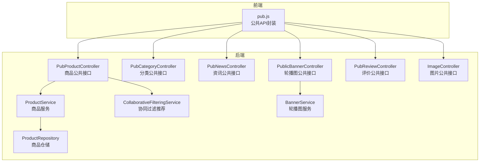
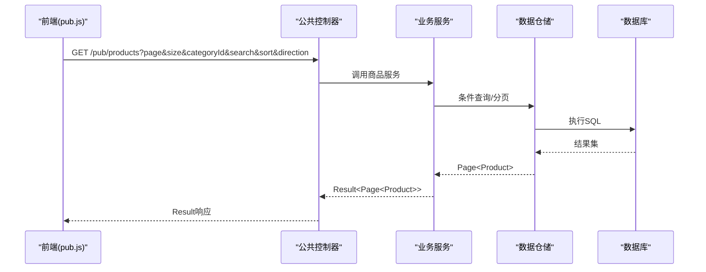
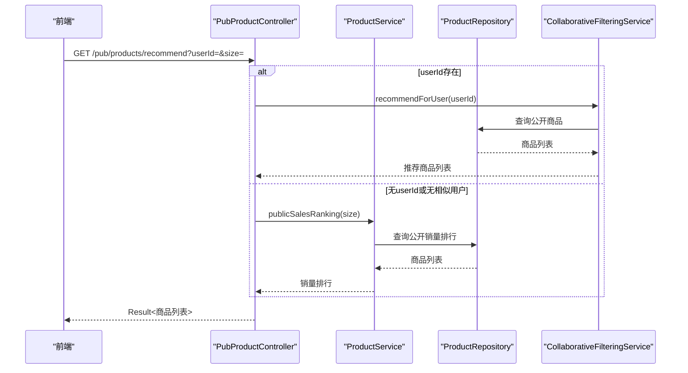
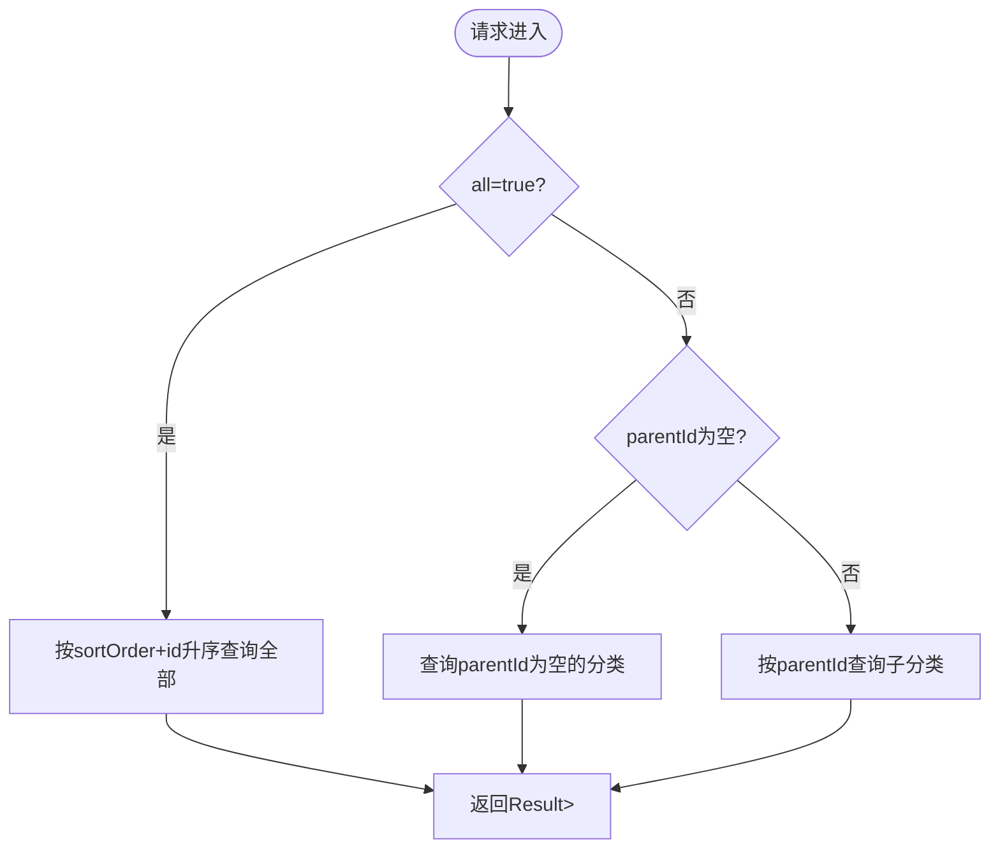
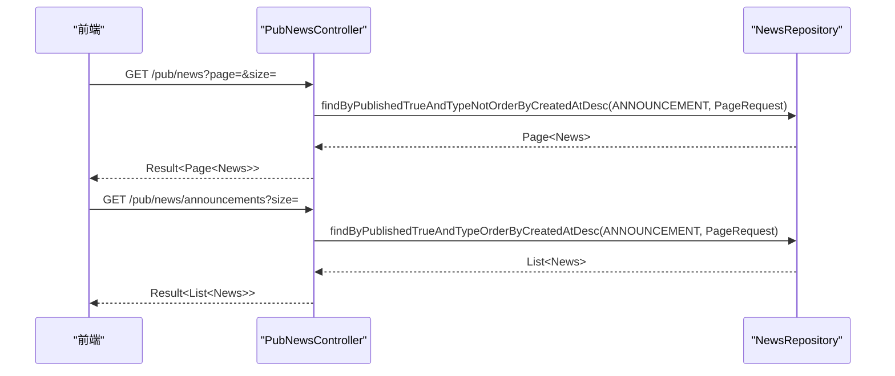
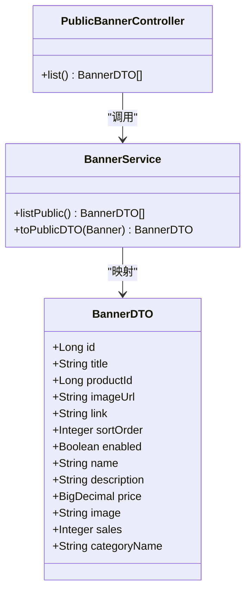
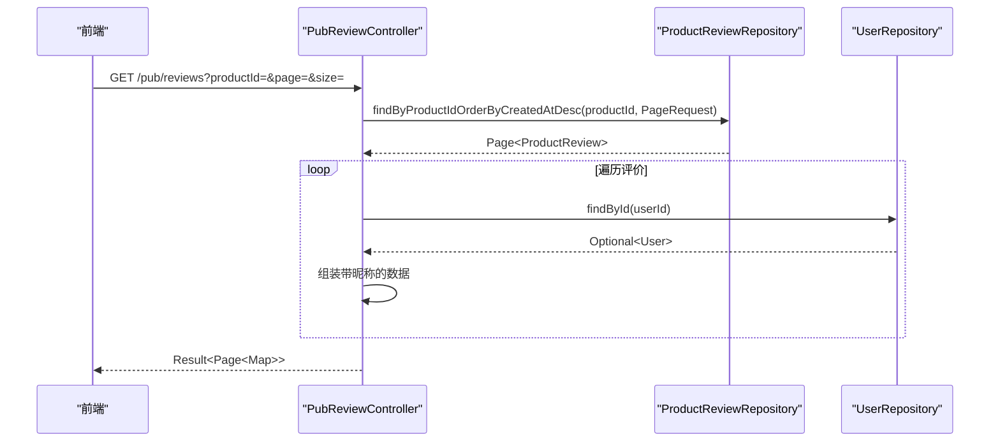
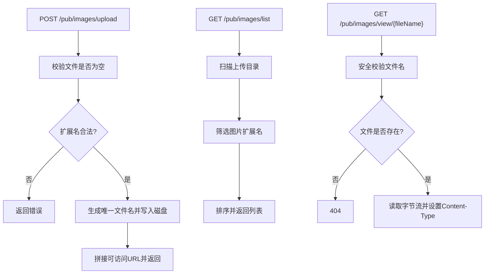
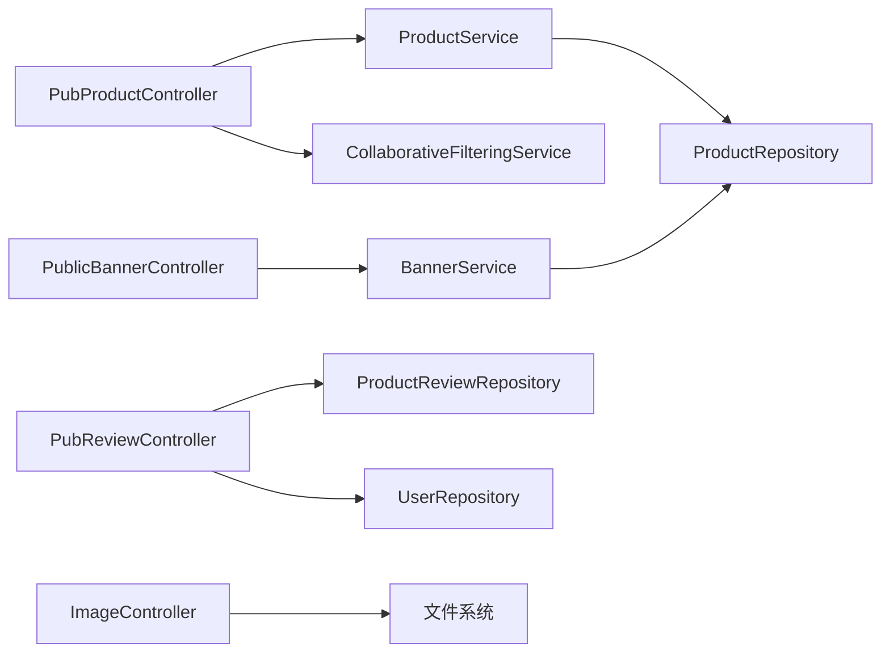

# 公共控制器

<cite>
**本文引用的文件**
- [ImageController.java](file://backend/src/main/java/com/mall/controller/pub/ImageController.java)
- [PubCategoryController.java](file://backend/src/main/java/com/mall/controller/pub/PubCategoryController.java)
- [PubNewsController.java](file://backend/src/main/java/com/mall/controller/pub/PubNewsController.java)
- [PubProductController.java](file://backend/src/main/java/com/mall/controller/pub/PubProductController.java)
- [PubReviewController.java](file://backend/src/main/java/com/mall/controller/pub/PubReviewController.java)
- [PublicBannerController.java](file://backend/src/main/java/com/mall/controller/pub/PublicBannerController.java)
- [BannerDTO.java](file://backend/src/main/java/com/mall/dto/BannerDTO.java)
- [CollaborativeFilteringService.java](file://backend/src/main/java/com/mall/service/CollaborativeFilteringService.java)
- [BannerService.java](file://backend/src/main/java/com/mall/service/BannerService.java)
- [ProductService.java](file://backend/src/main/java/com/mall/service/ProductService.java)
- [ProductRepository.java](file://backend/src/main/java/com/mall/repository/ProductRepository.java)
- [application.yml](file://backend/src/main/resources/application.yml)
- [pub.js](file://frontend/src/api/pub.js)
- [Product.java](file://backend/src/main/java/com/mall/entity/Product.java)
- [Result.java](file://backend/src/main/java/com/mall/dto/Result.java)
</cite>

## 目录
1. [简介](#简介)
2. [项目结构](#项目结构)
3. [核心组件](#核心组件)
4. [架构总览](#架构总览)
5. [详细组件分析](#详细组件分析)
6. [依赖分析](#依赖分析)
7. [性能考虑](#性能考虑)
8. [故障排查指南](#故障排查指南)
9. [结论](#结论)
10. [附录](#附录)

## 简介
本文件面向电商商城系统的“公共控制器群组”，系统性梳理并解读以下公共接口的实现与设计要点：
- 商品浏览与搜索：商品列表、详情、新品、销量排行、搜索、个性化推荐
- 分类查询：按父级或全量拉取分类树
- 新闻资讯：资讯与公告列表
- 轮播图展示：公开轮播图及关联商品信息
- 评价查看：按商品分页查询评价并匿名化昵称
- 图片上传与访问：图片上传、列表与直链访问

文档重点覆盖：
- 匿名用户访问控制策略
- 数据读取优化机制（JPA 分页、条件查询、DTO 展示）
- 图片资源管理（上传路径、媒体类型、直链生成）
- 与前端展示组件的接口对接方式
- 推荐算法的数据接口与实现思路
- 搜索 API 的设计与缓存策略建议
- 性能优化与前端集成最佳实践

## 项目结构
公共控制器位于后端模块的公共层，统一通过 /pub 前缀对外提供只读或弱登录能力的接口；前端通过独立的公共 API 模块进行调用。

图表来源
- [PubProductController.java:15-95](file://backend/src/main/java/com/mall/controller/pub/PubProductController.java#L15-L95)
- [PubCategoryController.java:13-38](file://backend/src/main/java/com/mall/controller/pub/PubCategoryController.java#L13-L38)
- [PubNewsController.java:13-36](file://backend/src/main/java/com/mall/controller/pub/PubNewsController.java#L13-L36)
- [PublicBannerController.java:12-23](file://backend/src/main/java/com/mall/controller/pub/PublicBannerController.java#L12-L23)
- [PubReviewController.java:19-64](file://backend/src/main/java/com/mall/controller/pub/PubReviewController.java#L19-L64)
- [ImageController.java:19-155](file://backend/src/main/java/com/mall/controller/pub/ImageController.java#L19-L155)
- [ProductService.java:15-126](file://backend/src/main/java/com/mall/service/ProductService.java#L15-L126)
- [CollaborativeFilteringService.java:14-81](file://backend/src/main/java/com/mall/service/CollaborativeFilteringService.java#L14-L81)
- [BannerService.java:16-85](file://backend/src/main/java/com/mall/service/BannerService.java#L16-L85)
- [ProductRepository.java:12-125](file://backend/src/main/java/com/mall/repository/ProductRepository.java#L12-L125)
- [pub.js:1-74](file://frontend/src/api/pub.js#L1-L74)

章节来源
- [application.yml:22-25](file://backend/src/main/resources/application.yml#L22-L25)

## 核心组件
- 商品公共接口：提供商品列表、详情、新品、销量排行、搜索、个性化推荐等能力
- 分类公共接口：支持按父级或全量拉取分类树
- 资讯公共接口：提供资讯与公告列表
- 轮播图公共接口：返回公开可用的轮播图及其关联商品信息
- 评价公共接口：按商品分页查询评价，并匿名化昵称
- 图片公共接口：图片上传、列表与直链访问

章节来源
- [PubProductController.java:15-95](file://backend/src/main/java/com/mall/controller/pub/PubProductController.java#L15-L95)
- [PubCategoryController.java:13-38](file://backend/src/main/java/com/mall/controller/pub/PubCategoryController.java#L13-L38)
- [PubNewsController.java:13-36](file://backend/src/main/java/com/mall/controller/pub/PubNewsController.java#L13-L36)
- [PublicBannerController.java:12-23](file://backend/src/main/java/com/mall/controller/pub/PublicBannerController.java#L12-L23)
- [PubReviewController.java:19-64](file://backend/src/main/java/com/mall/controller/pub/PubReviewController.java#L19-L64)
- [ImageController.java:19-155](file://backend/src/main/java/com/mall/controller/pub/ImageController.java#L19-L155)

## 架构总览
公共接口采用“控制器-服务-仓储”三层结构，统一返回 Result 包装体，前端通过 pub.js 统一封装请求。

图表来源
- [PubProductController.java:24-46](file://backend/src/main/java/com/mall/controller/pub/PubProductController.java#L24-L46)
- [ProductService.java:42-82](file://backend/src/main/java/com/mall/service/ProductService.java#L42-L82)
- [ProductRepository.java:32-105](file://backend/src/main/java/com/mall/repository/ProductRepository.java#L32-L105)
- [Result.java:10-23](file://backend/src/main/java/com/mall/dto/Result.java#L10-L23)
- [pub.js:8-11](file://frontend/src/api/pub.js#L8-L11)

## 详细组件分析

### 商品公共接口（PubProductController）
- 功能概览
  - 商品列表：支持分页、按分类过滤、关键词搜索、排序
  - 商品详情：仅返回公开状态的商品
  - 新品列表：公开的新品
  - 销量排行：公开的销量排行
  - 个性化推荐：基于协同过滤的“猜你喜欢”，需要传入 userId
- 访问控制
  - 除推荐接口外均为匿名可访问
  - 推荐接口需登录态（userId），未登录时降级为销量排行
- 数据读取优化
  - 使用 JPA 分页与排序，避免一次性加载全量数据
  - 搜索与分类查询均走公开条件（上架且商家启用）
- 推荐算法数据接口
  - 接口：GET /pub/products/recommend?userId=&size=
  - 服务：CollaborativeFilteringService.recommendForUser(userId)
  - 降级策略：若用户无历史购买记录或无足够相似用户，回退到销量排行

图表来源
- [PubProductController.java:85-93](file://backend/src/main/java/com/mall/controller/pub/PubProductController.java#L85-L93)
- [CollaborativeFilteringService.java:32-79](file://backend/src/main/java/com/mall/service/CollaborativeFilteringService.java#L32-L79)
- [ProductService.java:74-77](file://backend/src/main/java/com/mall/service/ProductService.java#L74-L77)
- [ProductRepository.java:69-75](file://backend/src/main/java/com/mall/repository/ProductRepository.java#L69-L75)

章节来源
- [PubProductController.java:15-95](file://backend/src/main/java/com/mall/controller/pub/PubProductController.java#L15-L95)
- [ProductService.java:15-126](file://backend/src/main/java/com/mall/service/ProductService.java#L15-L126)
- [ProductRepository.java:12-125](file://backend/src/main/java/com/mall/repository/ProductRepository.java#L12-L125)
- [CollaborativeFilteringService.java:14-81](file://backend/src/main/java/com/mall/service/CollaborativeFilteringService.java#L14-L81)

### 分类公共接口（PubCategoryController）
- 功能概览
  - 支持按父级查询子分类或全量拉取（all=true）
  - 返回排序后的分类列表
- 访问控制
  - 匿名可访问
- 数据读取优化
  - 使用排序字段保证稳定输出

图表来源
- [PubCategoryController.java:21-36](file://backend/src/main/java/com/mall/controller/pub/PubCategoryController.java#L21-L36)

章节来源
- [PubCategoryController.java:13-38](file://backend/src/main/java/com/mall/controller/pub/PubCategoryController.java#L13-L38)

### 资讯公共接口（PubNewsController）
- 功能概览
  - 分页查询已发布的资讯（排除公告）
  - 查询最新公告列表
- 访问控制
  - 匿名可访问
- 数据读取优化
  - 使用 PageRequest 控制分页大小

图表来源
- [PubNewsController.java:21-34](file://backend/src/main/java/com/mall/controller/pub/PubNewsController.java#L21-L34)

章节来源
- [PubNewsController.java:13-36](file://backend/src/main/java/com/mall/controller/pub/PubNewsController.java#L13-L36)

### 轮播图公共接口（PublicBannerController）
- 功能概览
  - 返回公开可用的轮播图列表
  - 轮播图 DTO 中包含商品名称、图片、价格、销量等信息
- 访问控制
  - 匿名可访问
- 数据读取优化
  - 仅返回启用且有商品图标的轮播图
  - 通过 BannerService 将 Banner 实体映射为 BannerDTO 并填充商品信息

图表来源
- [PublicBannerController.java:12-23](file://backend/src/main/java/com/mall/controller/pub/PublicBannerController.java#L12-L23)
- [BannerService.java:27-49](file://backend/src/main/java/com/mall/service/BannerService.java#L27-L49)
- [BannerDTO.java:6-33](file://backend/src/main/java/com/mall/dto/BannerDTO.java#L6-L33)

章节来源
- [PublicBannerController.java:12-23](file://backend/src/main/java/com/mall/controller/pub/PublicBannerController.java#L12-L23)
- [BannerService.java:16-85](file://backend/src/main/java/com/mall/service/BannerService.java#L16-L85)
- [BannerDTO.java:6-33](file://backend/src/main/java/com/mall/dto/BannerDTO.java#L6-L33)

### 评价公共接口（PubReviewController）
- 功能概览
  - 按商品分页查询评价
  - 关联用户昵称，若用户不存在或昵称为空则显示“匿名用户”
- 访问控制
  - 匿名可访问
- 数据读取优化
  - 使用分页查询，避免一次性加载全量评价
  - 在内存中组装带昵称的评价列表

图表来源
- [PubReviewController.java:28-61](file://backend/src/main/java/com/mall/controller/pub/PubReviewController.java#L28-L61)

章节来源
- [PubReviewController.java:19-64](file://backend/src/main/java/com/mall/controller/pub/PubReviewController.java#L19-L64)

### 图片公共接口（ImageController）
- 功能概览
  - 图片列表查询：扫描上传目录并返回可访问的图片清单
  - 图片直链访问：根据文件名返回对应字节流并设置正确的 Content-Type
  - 图片上传：校验类型、生成唯一文件名、保存至指定目录并返回可访问 URL
- 访问控制
  - 匿名可访问
- 安全与优化
  - 文件名校验防止路径穿越
  - 媒体类型根据扩展名自动识别
  - 上传目录与服务端口、上下文路径通过配置注入

图表来源
- [ImageController.java:34-153](file://backend/src/main/java/com/mall/controller/pub/ImageController.java#L34-L153)
- [application.yml:22-25](file://backend/src/main/resources/application.yml#L22-L25)

章节来源
- [ImageController.java:19-155](file://backend/src/main/java/com/mall/controller/pub/ImageController.java#L19-L155)
- [application.yml:22-25](file://backend/src/main/resources/application.yml#L22-L25)

## 依赖分析
- 控制器与服务层解耦良好，控制器仅负责参数解析与结果包装
- 服务层通过仓储接口屏蔽 SQL 细节，便于扩展与测试
- 推荐服务依赖订单与商品仓储，形成跨实体的协同过滤
- 轮播图服务将实体映射为 DTO，减少控制器直接暴露实体

图表来源
- [PubProductController.java:21-22](file://backend/src/main/java/com/mall/controller/pub/PubProductController.java#L21-L22)
- [ProductService.java](file://backend/src/main/java/com/mall/service/ProductService.java#L20)
- [CollaborativeFilteringService.java:22-24](file://backend/src/main/java/com/mall/service/CollaborativeFilteringService.java#L22-L24)
- [PublicBannerController.java](file://backend/src/main/java/com/mall/controller/pub/PublicBannerController.java#L16)
- [BannerService.java:19-20](file://backend/src/main/java/com/mall/service/BannerService.java#L19-L20)
- [PubReviewController.java:25-26](file://backend/src/main/java/com/mall/controller/pub/PubReviewController.java#L25-L26)
- [ImageController.java:25-32](file://backend/src/main/java/com/mall/controller/pub/ImageController.java#L25-L32)

## 性能考虑
- 分页与排序
  - 所有列表查询均使用 PageRequest 控制分页，避免全量加载
  - 排序字段映射到数据库索引列，提升查询效率
- 条件查询
  - 商品搜索与分类查询均限定“上架且商家启用”，减少无效数据
- 内存处理
  - 评价接口在内存中拼装昵称，注意大页 size 的内存占用
- 缓存策略建议
  - 轮播图与分类树可引入 Redis 缓存，设置合理过期时间
  - 商品详情与热门榜单可做热点缓存，结合失效策略
  - 推荐结果可短期缓存（如 5-10 分钟），降低协同过滤计算压力
- IO 优化
  - 图片直链访问建议由 CDN 或静态服务器承载，减轻应用服务器压力
- 数据库优化
  - 为常用查询字段建立索引（如商品的 onSale、merchantId、categoryId、sales、createdAt 等）

## 故障排查指南
- 商品搜索无结果
  - 检查关键字是否匹配公开条件（上架且商家启用）
  - 参考：[ProductRepository.java:93-105](file://backend/src/main/java/com/mall/repository/ProductRepository.java#L93-L105)
- 推荐接口异常
  - 确认 userId 是否传入，未传入时会回退到销量排行
  - 参考：[PubProductController.java:85-93](file://backend/src/main/java/com/mall/controller/pub/PubProductController.java#L85-L93)，[CollaborativeFilteringService.java:32-79](file://backend/src/main/java/com/mall/service/CollaborativeFilteringService.java#L32-L79)
- 图片访问 404
  - 校验文件名是否被安全校验拦截（禁止 .. 与 /）
  - 确认上传目录与 server.port、context-path 配置正确
  - 参考：[ImageController.java:37-68](file://backend/src/main/java/com/mall/controller/pub/ImageController.java#L37-L68)，[application.yml:22-25](file://backend/src/main/resources/application.yml#L22-L25)
- 评价昵称显示异常
  - 用户不存在或昵称为空时会显示“匿名用户”
  - 参考：[PubReviewController.java:45-52](file://backend/src/main/java/com/mall/controller/pub/PubReviewController.java#L45-L52)
- 轮播图为空
  - 确认轮播图启用且关联商品存在图片
  - 参考：[BannerService.java:27-33](file://backend/src/main/java/com/mall/service/BannerService.java#L27-L33)

章节来源
- [ProductRepository.java:93-105](file://backend/src/main/java/com/mall/repository/ProductRepository.java#L93-L105)
- [PubProductController.java:85-93](file://backend/src/main/java/com/mall/controller/pub/PubProductController.java#L85-L93)
- [CollaborativeFilteringService.java:32-79](file://backend/src/main/java/com/mall/service/CollaborativeFilteringService.java#L32-L79)
- [ImageController.java:37-68](file://backend/src/main/java/com/mall/controller/pub/ImageController.java#L37-L68)
- [application.yml:22-25](file://backend/src/main/resources/application.yml#L22-L25)
- [PubReviewController.java:45-52](file://backend/src/main/java/com/mall/controller/pub/PubReviewController.java#L45-L52)
- [BannerService.java:27-33](file://backend/src/main/java/com/mall/service/BannerService.java#L27-L33)

## 结论
公共控制器群组以清晰的职责划分与统一的结果包装，为前端提供了稳定高效的只读接口能力。通过 JPA 分页、公开条件查询与 DTO 映射，既保障了数据安全，又提升了性能。结合 CDN、Redis 缓存与索引优化，可进一步增强高并发场景下的稳定性与响应速度。推荐接口采用协同过滤并在无相似用户时回退销量排行，兼顾个性化与可用性。

## 附录

### 公共 API 文档（后端接口）
- 商品
  - GET /pub/products?page=&size=&categoryId=&search=&sort=&direction=：商品列表（支持分类过滤、搜索、排序）
  - GET /pub/products/{id}：商品详情（公开）
  - GET /pub/products/new?size=：新品列表
  - GET /pub/products/rank?size=：销量排行
  - GET /pub/products/recommend?userId=&size=：个性化推荐（需登录）
- 分类
  - GET /pub/categories?parentId=：按父级查询子分类
  - GET /pub/categories?all=true：全量分类（树构建）
- 资讯
  - GET /pub/news?page=&size=：资讯列表（不含公告）
  - GET /pub/news/announcements?size=：公告列表
- 轮播图
  - GET /pub/banner：公开轮播图
- 评价
  - GET /pub/reviews?productId=&page=&size=：评价列表
- 图片
  - GET /pub/images/list：图片列表
  - GET /pub/images/view/{fileName}：图片直链
  - POST /pub/images/upload：图片上传

章节来源
- [PubProductController.java:24-93](file://backend/src/main/java/com/mall/controller/pub/PubProductController.java#L24-L93)
- [PubCategoryController.java:22-36](file://backend/src/main/java/com/mall/controller/pub/PubCategoryController.java#L22-L36)
- [PubNewsController.java:21-34](file://backend/src/main/java/com/mall/controller/pub/PubNewsController.java#L21-L34)
- [PublicBannerController.java:18-21](file://backend/src/main/java/com/mall/controller/pub/PublicBannerController.java#L18-L21)
- [PubReviewController.java:28-61](file://backend/src/main/java/com/mall/controller/pub/PubReviewController.java#L28-L61)
- [ImageController.java:73-153](file://backend/src/main/java/com/mall/controller/pub/ImageController.java#L73-L153)

### 前端集成指南
- 使用 pub.js 统一封装公共接口调用
  - 商品：getProducts、getProduct、getNewArrivals、getSalesRank、getRecommend
  - 分类：getCategories、getAllCategories
  - 资讯：getNews、getAnnouncements
  - 轮播图：getBanners
  - 评价：getReviews
- 推荐接口建议在用户登录后调用，传入 userId
- 图片直链使用后端返回的 URL，建议接入 CDN 提升加载速度

章节来源
- [pub.js:1-74](file://frontend/src/api/pub.js#L1-L74)