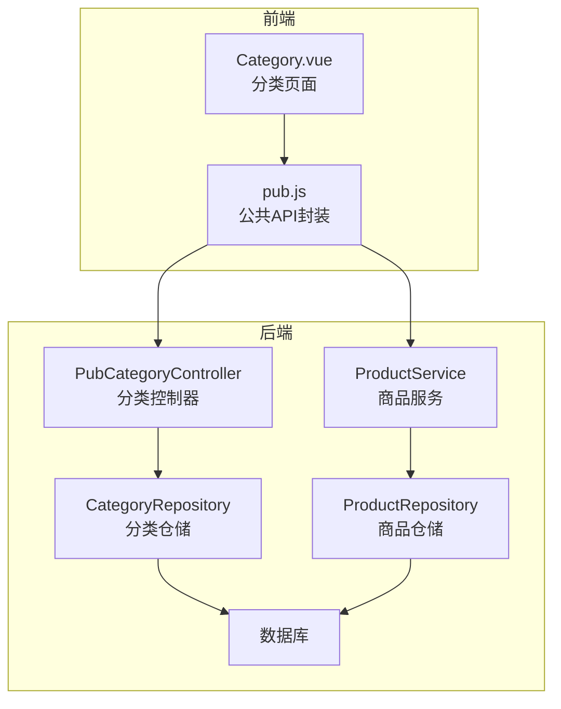
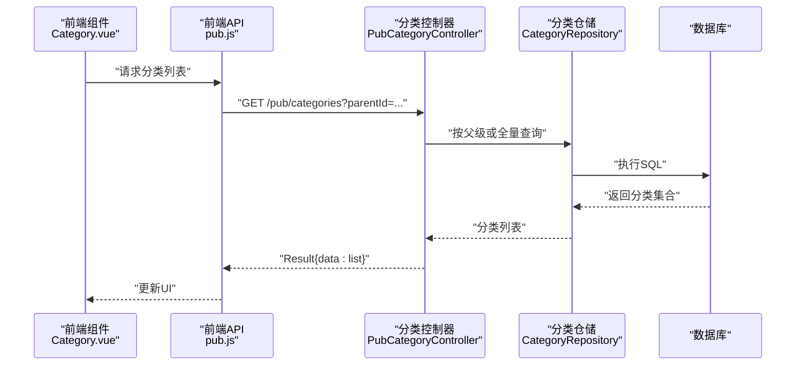
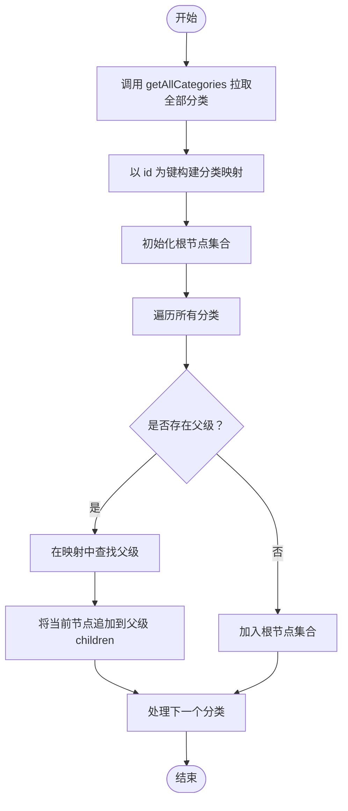
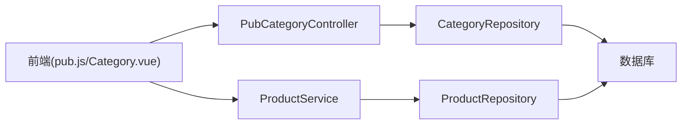

# 分类公共接口

<cite>
**本文引用的文件**
- [PubCategoryController.java](file://backend/src/main/java/com/mall/controller/pub/PubCategoryController.java)
- [Category.java](file://backend/src/main/java/com/mall/entity/Category.java)
- [CategoryRepository.java](file://backend/src/main/java/com/mall/repository/CategoryRepository.java)
- [ProductService.java](file://backend/src/main/java/com/mall/service/ProductService.java)
- [ProductRepository.java](file://backend/src/main/java/com/mall/repository/ProductRepository.java)
- [pub.js](file://frontend/src/api/pub.js)
- [Category.vue](file://frontend/src/views/user/Category.vue)
- [application.yml](file://backend/src/main/resources/application.yml)
</cite>

## 目录
1. [简介](#简介)
2. [项目结构](#项目结构)
3. [核心组件](#核心组件)
4. [架构总览](#架构总览)
5. [详细组件分析](#详细组件分析)
6. [依赖分析](#依赖分析)
7. [性能考虑](#性能考虑)
8. [故障排查指南](#故障排查指南)
9. [结论](#结论)
10. [附录](#附录)

## 简介
本技术文档聚焦于电商商城系统的“分类公共接口”，围绕以下目标展开：
- 解析商品分类查询、分类树形结构获取、分类下商品列表等核心功能的API实现
- 说明分类层级关系的数据结构设计、递归查询的实现机制
- 提供分类与商品关联的查询优化策略
- 给出完整的分类API文档，包括分类树构建算法、父子分类查询、分类商品筛选等接口说明
- 解释分类数据的缓存策略与前端分类导航组件的集成方式

## 项目结构
后端采用Spring Boot + JPA的分层架构，前端使用Vue 3 + Element Plus。分类相关的关键模块分布如下：
- 控制器层：提供对外的REST接口
- 仓储层：基于JPA定义分类与商品的查询方法
- 服务层：封装业务逻辑（如商品查询）
- 前端API层：封装HTTP请求
- 前端页面组件：消费分类与商品数据

图表来源
- [PubCategoryController.java:1-38](file://backend/src/main/java/com/mall/controller/pub/PubCategoryController.java#L1-L38)
- [CategoryRepository.java:1-17](file://backend/src/main/java/com/mall/repository/CategoryRepository.java#L1-L17)
- [ProductService.java:1-126](file://backend/src/main/java/com/mall/service/ProductService.java#L1-L126)
- [ProductRepository.java:1-125](file://backend/src/main/java/com/mall/repository/ProductRepository.java#L1-L125)
- [pub.js:1-74](file://frontend/src/api/pub.js#L1-L74)
- [Category.vue:1-35](file://frontend/src/views/user/Category.vue#L1-L35)

章节来源
- [application.yml:1-36](file://backend/src/main/resources/application.yml#L1-L36)

## 核心组件
- 分类控制器：提供分类列表查询接口，支持按父级过滤或全量拉取
- 分类实体：定义分类的字段与持久化映射
- 分类仓储：提供按父级排序查询的方法
- 商品服务与仓储：提供公开商品查询、按分类筛选等能力
- 前端API与视图：封装HTTP请求并消费分类与商品数据

章节来源
- [PubCategoryController.java:1-38](file://backend/src/main/java/com/mall/controller/pub/PubCategoryController.java#L1-L38)
- [Category.java:1-41](file://backend/src/main/java/com/mall/entity/Category.java#L1-L41)
- [CategoryRepository.java:1-17](file://backend/src/main/java/com/mall/repository/CategoryRepository.java#L1-L17)
- [ProductService.java:1-126](file://backend/src/main/java/com/mall/service/ProductService.java#L1-L126)
- [ProductRepository.java:1-125](file://backend/src/main/java/com/mall/repository/ProductRepository.java#L1-L125)
- [pub.js:1-74](file://frontend/src/api/pub.js#L1-L74)
- [Category.vue:1-35](file://frontend/src/views/user/Category.vue#L1-L35)

## 架构总览
分类公共接口的调用链路如下：
- 前端通过pub.js发起HTTP请求到后端控制器
- 控制器根据参数选择查询策略（按父级或全量）
- 仓储执行数据库查询并返回结果
- 前端在视图中渲染分类与商品列表

图表来源
- [Category.vue:16-33](file://frontend/src/views/user/Category.vue#L16-L33)
- [pub.js:33-43](file://frontend/src/api/pub.js#L33-L43)
- [PubCategoryController.java:22-36](file://backend/src/main/java/com/mall/controller/pub/PubCategoryController.java#L22-L36)
- [CategoryRepository.java:11-13](file://backend/src/main/java/com/mall/repository/CategoryRepository.java#L11-L13)

## 详细组件分析

### 分类控制器（PubCategoryController）
职责
- 对外暴露分类列表查询接口
- 支持两种模式：
  - 全量模式：返回所有分类，按sortOrder与id升序排列
  - 父级过滤模式：若传入parentId则按该父级查询；未传入则查询根分类（parentId为空）

关键点
- 使用Spring Data的排序能力保证输出顺序稳定
- 返回统一的结果包装对象（Result）

章节来源
- [PubCategoryController.java:1-38](file://backend/src/main/java/com/mall/controller/pub/PubCategoryController.java#L1-L38)

### 分类实体（Category）
数据模型
- 字段：id、name、parentId、icon、sortOrder、createdAt
- 关系：通过parentId形成父子层级
- 默认值：sortOrder默认0；创建时自动填充createdAt

复杂度与约束
- 层级查询依赖parentId索引（由JPA/Hibernate默认建立）
- 排序字段sortOrder确保同级有序展示

章节来源
- [Category.java:1-41](file://backend/src/main/java/com/mall/entity/Category.java#L1-L41)

### 分类仓储（CategoryRepository）
查询方法
- 按父级排序查询子分类
- 查询根分类（父级为空）
- 按名称与父级为空查询唯一分类（用于校验）

优化建议
- 在数据库层面为parentId与sortOrder建立复合索引以提升查询效率
- 如需频繁构建整棵树，可在应用层进行一次全量拉取并缓存

章节来源
- [CategoryRepository.java:1-17](file://backend/src/main/java/com/mall/repository/CategoryRepository.java#L1-L17)

### 商品服务与仓储（ProductService/ProductRepository）
与分类的关联
- 提供按分类筛选商品的能力（管理端与公开端）
- 公开端筛选条件：商品上架且所属商家处于启用状态

查询策略
- 使用原生JPQL/分页查询，避免一次性加载过多数据
- 对高频查询（新品、销量榜）提供独立方法

章节来源
- [ProductService.java:1-126](file://backend/src/main/java/com/mall/service/ProductService.java#L1-L126)
- [ProductRepository.java:1-125](file://backend/src/main/java/com/mall/repository/ProductRepository.java#L1-L125)

### 前端API与视图（pub.js/Category.vue）
前端API
- getCategories：按父级过滤或全量拉取分类
- getAllCategories：一次性拉取全部分类，便于前端构建树

前端视图
- Category.vue通过路由参数categoryId触发商品列表查询
- 使用分页参数控制每页数量

章节来源
- [pub.js:33-43](file://frontend/src/api/pub.js#L33-L43)
- [Category.vue:16-33](file://frontend/src/views/user/Category.vue#L16-L33)

### 分类树构建算法
当前实现
- 后端提供按父级查询与全量查询两个接口
- 前端在需要树形结构时调用getAllCategories，然后在内存中组装树

算法流程

图表来源
- [pub.js:40-43](file://frontend/src/api/pub.js#L40-L43)
- [Category.java:24-25](file://backend/src/main/java/com/mall/entity/Category.java#L24-L25)

## 依赖分析
组件耦合关系
- 控制器依赖仓储接口
- 服务层依赖仓储接口
- 前端API依赖控制器提供的REST接口
- 视图组件依赖API层

潜在风险
- 全量分类查询可能带来较大的网络传输与前端内存压力
- 无显式缓存策略，每次请求都会访问数据库

图表来源
- [PubCategoryController.java:1-38](file://backend/src/main/java/com/mall/controller/pub/PubCategoryController.java#L1-L38)
- [CategoryRepository.java:1-17](file://backend/src/main/java/com/mall/repository/CategoryRepository.java#L1-L17)
- [ProductService.java:1-126](file://backend/src/main/java/com/mall/service/ProductService.java#L1-L126)
- [ProductRepository.java:1-125](file://backend/src/main/java/com/mall/repository/ProductRepository.java#L1-L125)
- [pub.js:1-74](file://frontend/src/api/pub.js#L1-L74)
- [Category.vue:1-35](file://frontend/src/views/user/Category.vue#L1-L35)

## 性能考虑
- 数据库索引
  - 为category.parent_id与category.sort_order建立复合索引，提升按父级排序查询性能
- 查询策略
  - 全量拉取适合小规模分类；大规模场景建议后端分页+前端懒加载
  - 分类树构建尽量在服务端完成，减少前端重复计算
- 缓存策略
  - 分类列表可引入Redis缓存，设置合理TTL（如5-10分钟），热点分类可常驻缓存
  - 更新分类时同步失效或刷新缓存
- 前端优化
  - 使用虚拟列表渲染大量分类卡片
  - 避免重复请求相同参数的分类数据

## 故障排查指南
常见问题与定位
- 分类不显示或顺序异常
  - 检查sortOrder是否正确设置
  - 确认查询参数parentId是否符合预期
- 分类树不完整
  - 确认是否使用getAllCategories一次性拉取
  - 检查parentId与id映射是否正确
- 商品列表为空
  - 确认商品状态与商家启用状态满足公开查询条件
  - 检查路由参数categoryId是否传递正确

章节来源
- [PubCategoryController.java:22-36](file://backend/src/main/java/com/mall/controller/pub/PubCategoryController.java#L22-L36)
- [ProductRepository.java:46-58](file://backend/src/main/java/com/mall/repository/ProductRepository.java#L46-L58)
- [Category.vue:24-29](file://frontend/src/views/user/Category.vue#L24-L29)

## 结论
本系统通过简洁的REST接口实现了分类查询与分类树构建的基础能力。当前实现以“全量拉取+前端组装”为主，满足中小规模场景需求。对于更大规模的业务，建议引入缓存与服务端树构建，并结合数据库索引优化与分页策略进一步提升性能与稳定性。

## 附录

### 分类API文档
- 查询分类列表
  - 方法：GET
  - 路径：/pub/categories
  - 参数：
    - parentId（可选）：父级分类ID，不传入则查询根分类
    - all（可选）：true时返回全部分类，按sortOrder与id升序排列
  - 返回：Result{data: List<Category>}
  - 示例：/pub/categories?parentId=1 或 /pub/categories?all=true

- 获取全部分类（树构建）
  - 方法：GET
  - 路径：/pub/categories
  - 参数：all=true
  - 返回：Result{data: List<Category>}（全量分类）

章节来源
- [PubCategoryController.java:22-36](file://backend/src/main/java/com/mall/controller/pub/PubCategoryController.java#L22-L36)
- [pub.js:40-43](file://frontend/src/api/pub.js#L40-L43)

### 分类与商品关联查询
- 公开端按分类筛选商品
  - 方法：GET /pub/products
  - 参数：categoryId、page、size
  - 条件：商品上架且所属商家启用
  - 返回：Page<Product>

章节来源
- [ProductService.java:47-50](file://backend/src/main/java/com/mall/service/ProductService.java#L47-L50)
- [ProductRepository.java:46-58](file://backend/src/main/java/com/mall/repository/ProductRepository.java#L46-L58)
- [Category.vue:24-29](file://frontend/src/views/user/Category.vue#L24-L29)

### 前端集成要点
- 使用pub.js中的getCategories或getAllCategories获取分类数据
- 在Category.vue中通过路由参数categoryId触发商品列表查询
- 建议在应用入口处统一处理Result响应结构，减少重复代码

章节来源
- [pub.js:33-43](file://frontend/src/api/pub.js#L33-L43)
- [Category.vue:16-33](file://frontend/src/views/user/Category.vue#L16-L33)