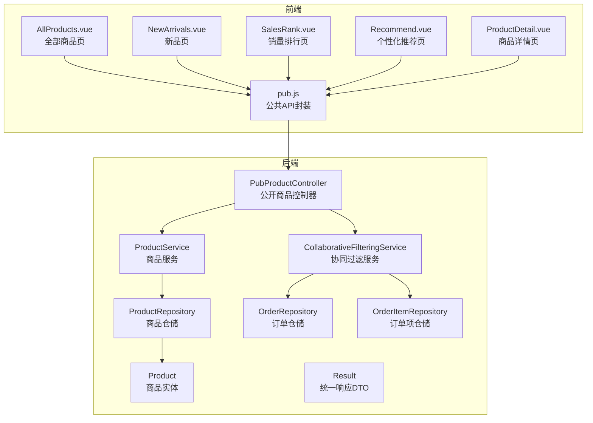
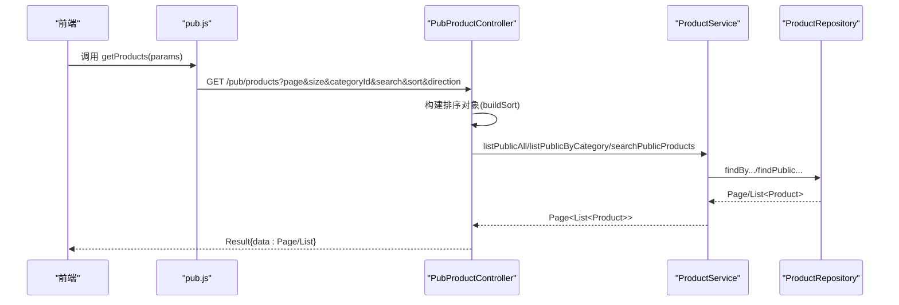
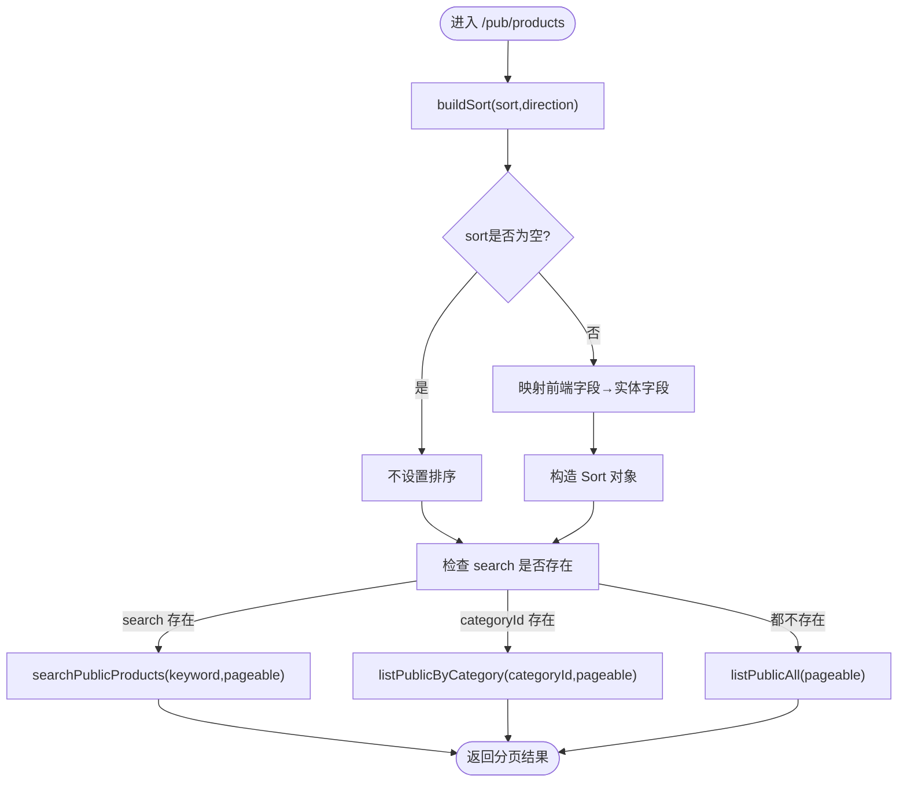
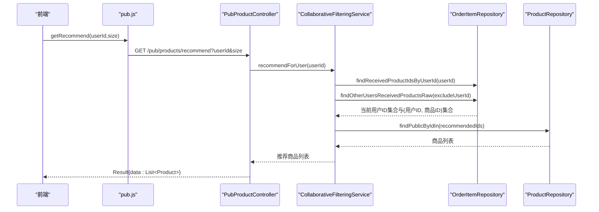
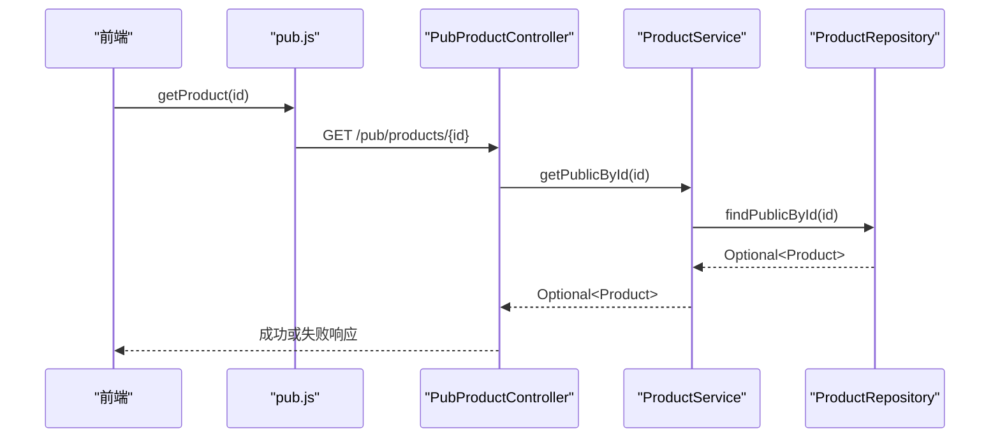
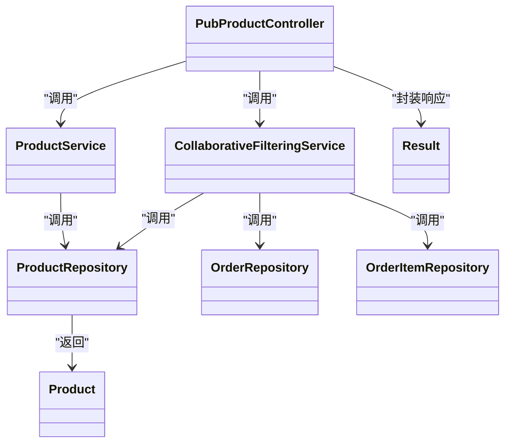

# 商品公共接口

<cite>
**本文引用的文件**
- [PubProductController.java](file://backend/src/main/java/com/mall/controller/pub/PubProductController.java)
- [ProductService.java](file://backend/src/main/java/com/mall/service/ProductService.java)
- [ProductRepository.java](file://backend/src/main/java/com/mall/repository/ProductRepository.java)
- [Product.java](file://backend/src/main/java/com/mall/entity/Product.java)
- [Result.java](file://backend/src/main/java/com/mall/dto/Result.java)
- [CollaborativeFilteringService.java](file://backend/src/main/java/com/mall/service/CollaborativeFilteringService.java)
- [OrderRepository.java](file://backend/src/main/java/com/mall/repository/OrderRepository.java)
- [OrderItemRepository.java](file://backend/src/main/java/com/mall/repository/OrderItemRepository.java)
- [application.yml](file://backend/src/main/resources/application.yml)
- [pub.js](file://frontend/src/api/pub.js)
- [AllProducts.vue](file://frontend/src/views/user/AllProducts.vue)
- [NewArrivals.vue](file://frontend/src/views/user/NewArrivals.vue)
- [SalesRank.vue](file://frontend/src/views/user/SalesRank.vue)
- [Recommend.vue](file://frontend/src/views/user/Recommend.vue)
- [ProductDetail.vue](file://frontend/src/views/user/ProductDetail.vue)
</cite>

## 目录
1. [简介](#简介)
2. [项目结构](#项目结构)
3. [核心组件](#核心组件)
4. [架构总览](#架构总览)
5. [详细组件分析](#详细组件分析)
6. [依赖分析](#依赖分析)
7. [性能考虑](#性能考虑)
8. [故障排查指南](#故障排查指南)
9. [结论](#结论)
10. [附录](#附录)

## 简介
本技术文档聚焦电商商城系统的“商品公共接口”，覆盖如下核心能力：
- 商品列表查询：支持分页、分类过滤、关键词搜索、排序
- 商品详情获取：仅返回“上架且运营启用”的公开商品
- 新品推荐：按商品上架时间倒序返回新品
- 销量排行：按销量降序返回热门商品
- 个性化推荐（协同过滤）：基于相似购买行为的“猜您想买”推荐

文档还提供完整的RESTful API定义、请求参数、响应格式、错误处理策略、查询优化与缓存建议，以及前端集成最佳实践。

## 项目结构
后端采用Spring Boot + Spring Data JPA，控制器位于公开模块，服务层负责业务逻辑，仓储层封装JPA查询；前端Vue应用通过统一API模块调用后端接口。

**图表来源**
- [PubProductController.java:15-95](file://backend/src/main/java/com/mall/controller/pub/PubProductController.java#L15-L95)
- [ProductService.java:15-126](file://backend/src/main/java/com/mall/service/ProductService.java#L15-L126)
- [ProductRepository.java:12-125](file://backend/src/main/java/com/mall/repository/ProductRepository.java#L12-L125)
- [CollaborativeFilteringService.java:14-81](file://backend/src/main/java/com/mall/service/CollaborativeFilteringService.java#L14-L81)
- [OrderRepository.java:13-28](file://backend/src/main/java/com/mall/repository/OrderRepository.java#L13-L28)
- [OrderItemRepository.java:9-20](file://backend/src/main/java/com/mall/repository/OrderItemRepository.java#L9-L20)
- [Product.java:9-101](file://backend/src/main/java/com/mall/entity/Product.java#L9-L101)
- [Result.java:7-24](file://backend/src/main/java/com/mall/dto/Result.java#L7-L24)
- [pub.js:1-74](file://frontend/src/api/pub.js#L1-L74)
- [AllProducts.vue:130-267](file://frontend/src/views/user/AllProducts.vue#L130-L267)
- [NewArrivals.vue:16-31](file://frontend/src/views/user/NewArrivals.vue#L16-L31)
- [SalesRank.vue:16-31](file://frontend/src/views/user/SalesRank.vue#L16-L31)
- [Recommend.vue:18-35](file://frontend/src/views/user/Recommend.vue#L18-L35)
- [ProductDetail.vue:383-553](file://frontend/src/views/user/ProductDetail.vue#L383-L553)

**章节来源**
- [PubProductController.java:15-95](file://backend/src/main/java/com/mall/controller/pub/PubProductController.java#L15-L95)
- [ProductService.java:15-126](file://backend/src/main/java/com/mall/service/ProductService.java#L15-L126)
- [ProductRepository.java:12-125](file://backend/src/main/java/com/mall/repository/ProductRepository.java#L12-L125)
- [CollaborativeFilteringService.java:14-81](file://backend/src/main/java/com/mall/service/CollaborativeFilteringService.java#L14-L81)
- [OrderRepository.java:13-28](file://backend/src/main/java/com/mall/repository/OrderRepository.java#L13-L28)
- [OrderItemRepository.java:9-20](file://backend/src/main/java/com/mall/repository/OrderItemRepository.java#L9-L20)
- [Product.java:9-101](file://backend/src/main/java/com/mall/entity/Product.java#L9-L101)
- [Result.java:7-24](file://backend/src/main/java/com/mall/dto/Result.java#L7-L24)
- [pub.js:1-74](file://frontend/src/api/pub.js#L1-L74)
- [AllProducts.vue:130-267](file://frontend/src/views/user/AllProducts.vue#L130-L267)
- [NewArrivals.vue:16-31](file://frontend/src/views/user/NewArrivals.vue#L16-L31)
- [SalesRank.vue:16-31](file://frontend/src/views/user/SalesRank.vue#L16-L31)
- [Recommend.vue:18-35](file://frontend/src/views/user/Recommend.vue#L18-L35)
- [ProductDetail.vue:383-553](file://frontend/src/views/user/ProductDetail.vue#L383-L553)

## 核心组件
- 控制器：提供REST端点，接收查询参数，调用服务层，封装统一响应
- 服务层：封装业务逻辑，协调仓储层执行查询
- 仓储层：基于Spring Data JPA的声明式查询与原生SQL查询
- 实体模型：商品实体包含价格、销量、上下架状态、新品标记等字段
- 统一响应：Result封装标准响应结构（code/message/data）

**章节来源**
- [PubProductController.java:24-93](file://backend/src/main/java/com/mall/controller/pub/PubProductController.java#L24-L93)
- [ProductService.java:22-82](file://backend/src/main/java/com/mall/service/ProductService.java#L22-L82)
- [ProductRepository.java:32-105](file://backend/src/main/java/com/mall/repository/ProductRepository.java#L32-L105)
- [Product.java:18-88](file://backend/src/main/java/com/mall/entity/Product.java#L18-L88)
- [Result.java:16-22](file://backend/src/main/java/com/mall/dto/Result.java#L16-L22)

## 架构总览
公开商品接口遵循“控制器-服务-仓储-实体”的分层架构，控制器负责参数校验与排序映射，服务层组织查询，仓储层执行数据库访问，最终以统一响应返回给前端。

**图表来源**
- [pub.js:8-11](file://frontend/src/api/pub.js#L8-L11)
- [PubProductController.java:24-61](file://backend/src/main/java/com/mall/controller/pub/PubProductController.java#L24-L61)
- [ProductService.java:42-82](file://backend/src/main/java/com/mall/service/ProductService.java#L42-L82)
- [ProductRepository.java:32-105](file://backend/src/main/java/com/mall/repository/ProductRepository.java#L32-L105)

## 详细组件分析

### RESTful API 定义
- 基础路径：/api（由配置决定，见附录）
- 公共前缀：/pub

1) 商品列表查询
- 方法：GET
- 路径：/pub/products
- 请求参数：
  - page：页码（从0开始，默认0）
  - size：每页大小（默认12）
  - categoryId：分类ID（可选）
  - search：关键词（可选）
  - sort：排序字段（可选，支持price/sales/createdAt）
  - direction：排序方向（可选，asc/desc，默认asc）
- 响应：Result{data: Page<Product>} 或 Result{data: List<Product>}
- 错误：当search为空字符串时，仍会走搜索逻辑；若无匹配则返回空列表

2) 商品详情获取
- 方法：GET
- 路径：/pub/products/{id}
- 请求参数：无
- 响应：Result{data: Product}（仅返回“上架且运营启用”的商品）
- 错误：商品不存在时返回 Result.fail

3) 新品推荐
- 方法：GET
- 路径：/pub/products/new
- 请求参数：size（默认10）
- 响应：Result{data: List<Product>}

4) 销量排行
- 方法：GET
- 路径：/pub/products/rank
- 请求参数：size（默认10）
- 响应：Result{data: List<Product>}

5) 个性化推荐（协同过滤）
- 方法：GET
- 路径：/pub/products/recommend
- 请求参数：userId（必填）、size（默认20）
- 响应：Result{data: List<Product>}
- 备注：若当前用户无历史收货记录，回退到销量排行

**章节来源**
- [PubProductController.java:24-93](file://backend/src/main/java/com/mall/controller/pub/PubProductController.java#L24-L93)
- [pub.js:8-31](file://frontend/src/api/pub.js#L8-L31)

### 分页查询参数与排序规则
- 分页：page、size
- 过滤：categoryId（分类）、search（关键词）
- 排序：sort（price/sales/createdAt），direction（asc/desc）
- 控制器内部将前端字段映射为实体字段，构造JPA Sort对象

**图表来源**
- [PubProductController.java:24-61](file://backend/src/main/java/com/mall/controller/pub/PubProductController.java#L24-L61)
- [ProductService.java:42-82](file://backend/src/main/java/com/mall/service/ProductService.java#L42-L82)
- [ProductRepository.java:32-105](file://backend/src/main/java/com/mall/repository/ProductRepository.java#L32-L105)

**章节来源**
- [PubProductController.java:24-61](file://backend/src/main/java/com/mall/controller/pub/PubProductController.java#L24-L61)
- [ProductService.java:42-82](file://backend/src/main/java/com/mall/service/ProductService.java#L42-L82)

### 搜索过滤条件
- 关键词搜索：对name与description进行LIKE匹配，且仅返回“上架且运营启用”的商品
- 分类过滤：categoryId非空时按分类查询“上架且运营启用”的商品
- 默认查询：均为空时返回“上架且运营启用”的商品全量列表

**章节来源**
- [ProductRepository.java:93-105](file://backend/src/main/java/com/mall/repository/ProductRepository.java#L93-L105)
- [ProductService.java:79-82](file://backend/src/main/java/com/mall/service/ProductService.java#L79-L82)

### 排序规则实现机制
- 前端传入sort与direction
- 控制器将sort映射到price/sales/createdAt对应的实体字段
- 构造Sort对象并结合PageRequest完成分页排序

**章节来源**
- [PubProductController.java:48-61](file://backend/src/main/java/com/mall/controller/pub/PubProductController.java#L48-L61)

### 协同过滤推荐算法数据接口设计
- 输入：userId（登录用户）、size（推荐数量上限）
- 数据来源：
  - 订单仓储：查询用户已收货的订单
  - 订单项仓储：提取用户已收货的商品ID集合，以及其它用户的(用户ID, 商品ID)集合
- 推荐策略：
  - 计算与当前用户有共同购买记录的其他用户
  - 对其他用户购买但当前用户未购买的商品进行评分（共同购买数作为权重）
  - 按评分降序取前N个商品
  - 若无共同记录或评分为空，回退到销量排行

**图表来源**
- [pub.js:28-31](file://frontend/src/api/pub.js#L28-L31)
- [PubProductController.java:85-93](file://backend/src/main/java/com/mall/controller/pub/PubProductController.java#L85-L93)
- [CollaborativeFilteringService.java:32-79](file://backend/src/main/java/com/mall/service/CollaborativeFilteringService.java#L32-L79)
- [OrderItemRepository.java:13-18](file://backend/src/main/java/com/mall/repository/OrderItemRepository.java#L13-L18)
- [ProductRepository.java:82-83](file://backend/src/main/java/com/mall/repository/ProductRepository.java#L82-L83)

**章节来源**
- [CollaborativeFilteringService.java:32-79](file://backend/src/main/java/com/mall/service/CollaborativeFilteringService.java#L32-L79)
- [OrderItemRepository.java:13-18](file://backend/src/main/java/com/mall/repository/OrderItemRepository.java#L13-L18)
- [ProductRepository.java:82-83](file://backend/src/main/java/com/mall/repository/ProductRepository.java#L82-L83)

### 商品详情获取流程
- 控制器调用服务层的公开详情查询
- 仓储层确保仅返回“上架且运营启用”的商品
- 若不存在，返回失败响应

**图表来源**
- [pub.js:13-16](file://frontend/src/api/pub.js#L13-L16)
- [PubProductController.java:63-69](file://backend/src/main/java/com/mall/controller/pub/PubProductController.java#L63-L69)
- [ProductService.java:27-30](file://backend/src/main/java/com/mall/service/ProductService.java#L27-L30)
- [ProductRepository.java:88-91](file://backend/src/main/java/com/mall/repository/ProductRepository.java#L88-L91)

**章节来源**
- [ProductService.java:27-30](file://backend/src/main/java/com/mall/service/ProductService.java#L27-L30)
- [ProductRepository.java:88-91](file://backend/src/main/java/com/mall/repository/ProductRepository.java#L88-L91)

### 前端集成最佳实践
- 全部商品页（分页+搜索+分类+排序）
  - 使用getProducts(params)传递page、size、categoryId、search、sort、direction
  - 监听路由查询变化，避免重复请求
  - 支持综合、价格升序、价格降序、销量排序
- 新品页、销量排行页、个性化推荐页
  - 使用对应API函数，传入size或userId
- 商品详情页
  - 使用getProduct(id)获取详情
  - 详情页标签切换、评价分页加载

**章节来源**
- [AllProducts.vue:176-261](file://frontend/src/views/user/AllProducts.vue#L176-L261)
- [NewArrivals.vue:16-26](file://frontend/src/views/user/NewArrivals.vue#L16-L26)
- [SalesRank.vue:16-26](file://frontend/src/views/user/SalesRank.vue#L16-L26)
- [Recommend.vue:18-31](file://frontend/src/views/user/Recommend.vue#L18-L31)
- [ProductDetail.vue:414-452](file://frontend/src/views/user/ProductDetail.vue#L414-L452)

## 依赖分析
- 控制器依赖服务层与协同过滤服务
- 服务层依赖商品仓储
- 协同过滤服务依赖订单与订单项仓储、商品仓储
- 仓储层依赖实体模型

**图表来源**
- [PubProductController.java:21-22](file://backend/src/main/java/com/mall/controller/pub/PubProductController.java#L21-L22)
- [ProductService.java:20](file://backend/src/main/java/com/mall/service/ProductService.java#L20)
- [CollaborativeFilteringService.java:22-24](file://backend/src/main/java/com/mall/service/CollaborativeFilteringService.java#L22-L24)
- [ProductRepository.java:13](file://backend/src/main/java/com/mall/repository/ProductRepository.java#L13)
- [OrderRepository.java:13](file://backend/src/main/java/com/mall/repository/OrderRepository.java#L13)
- [OrderItemRepository.java:9](file://backend/src/main/java/com/mall/repository/OrderItemRepository.java#L9)
- [Product.java:16](file://backend/src/main/java/com/mall/entity/Product.java#L16)
- [Result.java:10-14](file://backend/src/main/java/com/mall/dto/Result.java#L10-L14)

**章节来源**
- [PubProductController.java:21-22](file://backend/src/main/java/com/mall/controller/pub/PubProductController.java#L21-L22)
- [ProductService.java:20](file://backend/src/main/java/com/mall/service/ProductService.java#L20)
- [CollaborativeFilteringService.java:22-24](file://backend/src/main/java/com/mall/service/CollaborativeFilteringService.java#L22-L24)
- [ProductRepository.java:13](file://backend/src/main/java/com/mall/repository/ProductRepository.java#L13)
- [OrderRepository.java:13](file://backend/src/main/java/com/mall/repository/OrderRepository.java#L13)
- [OrderItemRepository.java:9](file://backend/src/main/java/com/mall/repository/OrderItemRepository.java#L9)
- [Product.java:16](file://backend/src/main/java/com/mall/entity/Product.java#L16)
- [Result.java:10-14](file://backend/src/main/java/com/mall/dto/Result.java#L10-L14)

## 性能考虑
- 数据库层面
  - 使用原生SQL或JPQL限制查询范围（仅“上架且运营启用”的商品）
  - 对高频查询字段建立索引（如onSale、categoryId、sales、createdAt）
  - 分页查询避免一次性加载大量数据
- 推荐算法
  - 协同过滤在用户无历史购买时回退销量排行，减少复杂计算
  - 限制推荐上限（默认20），避免过多商品ID参与评分
- 前端层面
  - 使用虚拟滚动或懒加载减少DOM压力
  - 合理缓存接口响应，避免重复请求
- 缓存策略建议
  - 商品列表分页结果短期缓存（如5-10分钟）
  - 新品与销量排行可做热点缓存（如1小时）
  - 个性化推荐结果按用户维度缓存（如10-30分钟）
  - 缓存Key包含查询参数（page/size/categoryId/search/sort/direction），避免污染

[本节为通用性能建议，不直接分析具体文件，故无“章节来源”]

## 故障排查指南
- 统一响应结构
  - 成功：code=200，message="success"，data为实际数据
  - 失败：code=400，message为错误信息，data=null
- 商品不存在
  - 详情接口返回失败响应，检查ID是否正确、商品是否上架且运营启用
- 排序无效
  - 确认sort字段是否为price/sales/createdAt之一，direction是否为asc/desc
- 搜索无结果
  - 确认关键词是否为空，搜索仅对name与description生效
- 个性化推荐为空
  - 当前用户无历史收货记录时会回退销量排行；若销量排行也为空，可能数据库无符合条件商品

**章节来源**
- [Result.java:16-22](file://backend/src/main/java/com/mall/dto/Result.java#L16-L22)
- [PubProductController.java:63-69](file://backend/src/main/java/com/mall/controller/pub/PubProductController.java#L63-L69)
- [ProductRepository.java:32-105](file://backend/src/main/java/com/mall/repository/ProductRepository.java#L32-L105)
- [CollaborativeFilteringService.java:77-79](file://backend/src/main/java/com/mall/service/CollaborativeFilteringService.java#L77-L79)

## 结论
本接口体系以清晰的分层架构实现了商品公共查询、详情、新品、排行与个性化推荐能力，配合前后端协作与合理的查询与缓存策略，能够满足电商前台的高并发与高性能需求。后续可在数据库索引、缓存粒度与推荐算法召回质量方面持续优化。

## 附录
- 基础路径与端口
  - 服务器端口：8080
  - 上下文路径：/api
  - 数据源：MySQL（账号密码见配置文件）

**章节来源**
- [application.yml:22-30](file://backend/src/main/resources/application.yml#L22-L30)