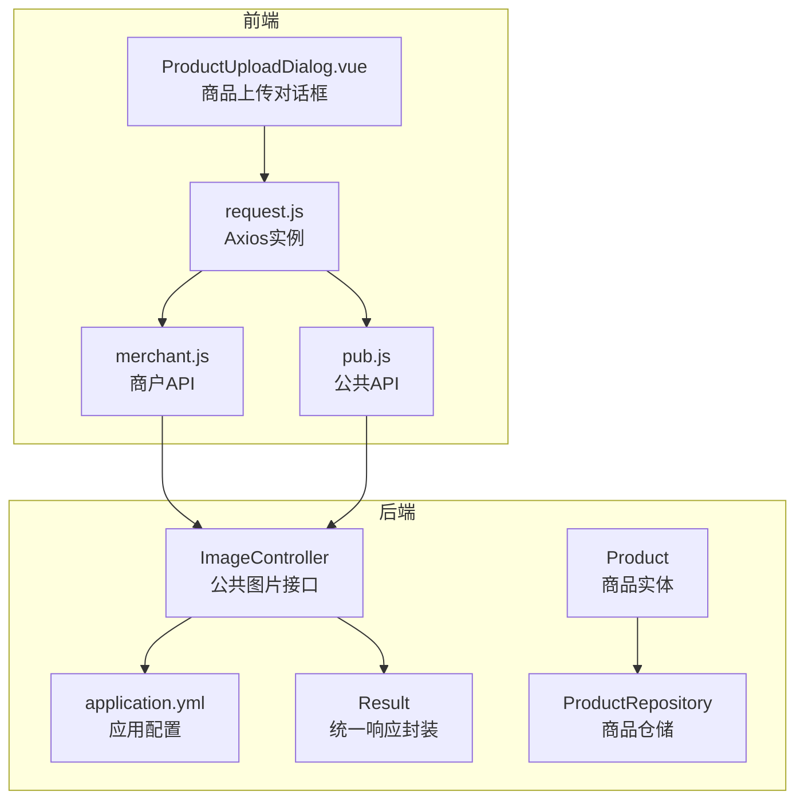
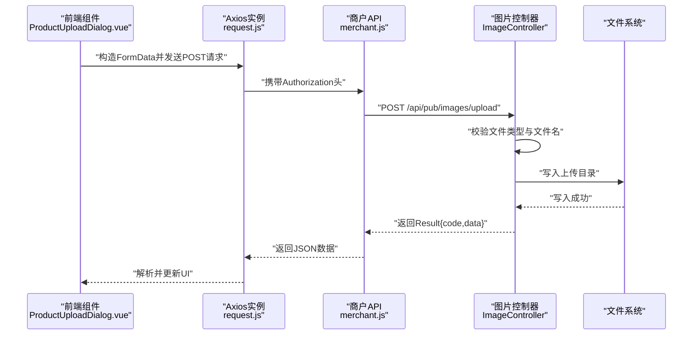
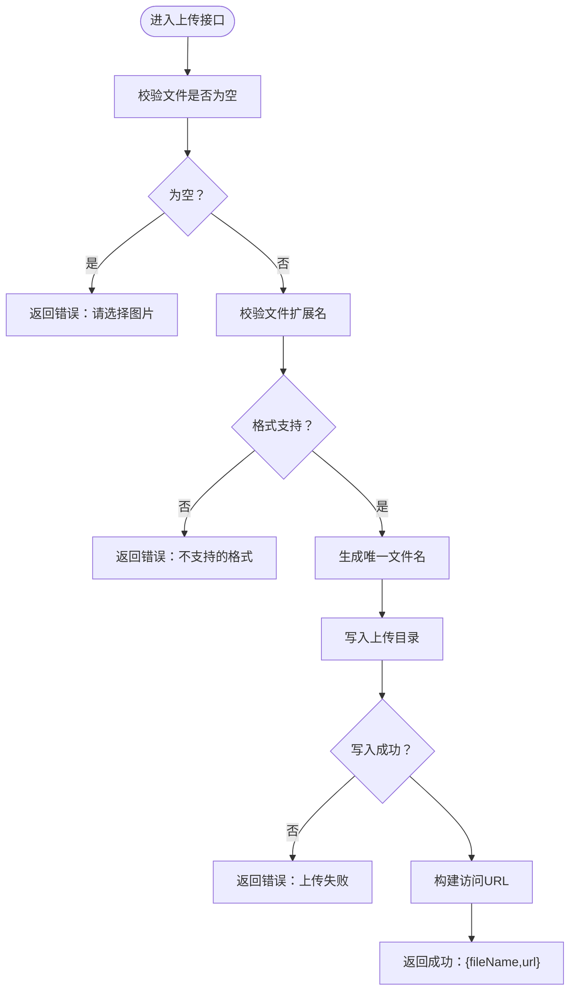
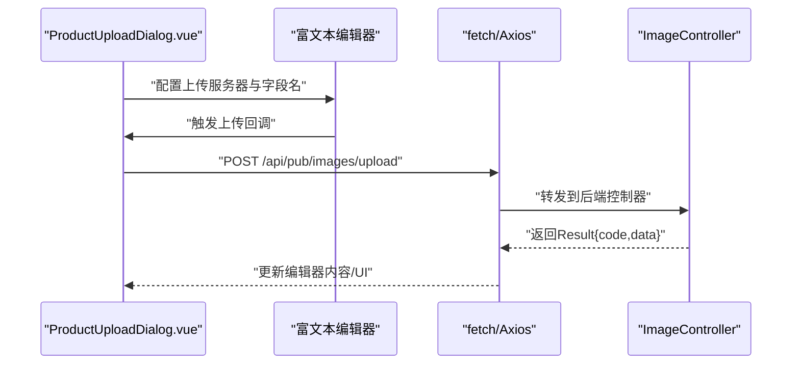
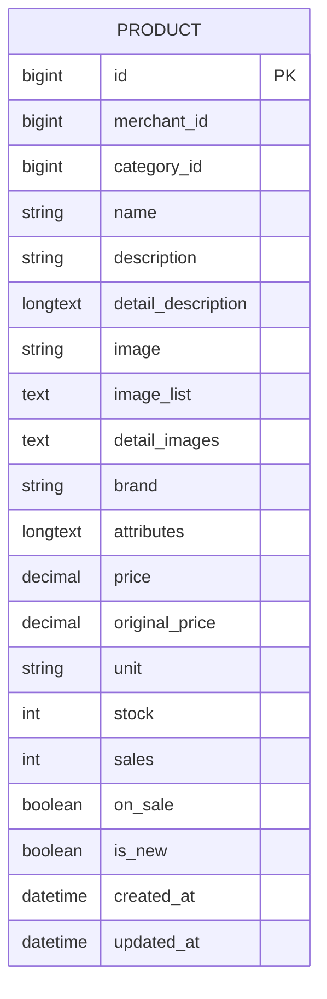
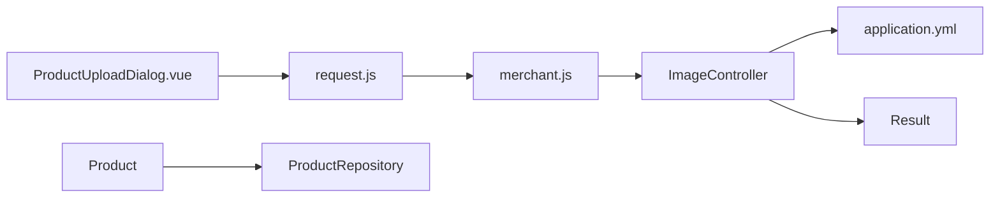

# 图片上传接口

<cite>
**本文引用的文件**
- [ImageController.java](file://backend/src/main/java/com/mall/controller/pub/ImageController.java)
- [application.yml](file://backend/src/main/resources/application.yml)
- [Result.java](file://backend/src/main/java/com/mall/dto/Result.java)
- [Product.java](file://backend/src/main/java/com/mall/entity/Product.java)
- [ProductRepository.java](file://backend/src/main/java/com/mall/repository/ProductRepository.java)
- [request.js](file://frontend/src/api/request.js)
- [merchant.js](file://frontend/src/api/merchant.js)
- [pub.js](file://frontend/src/api/pub.js)
- [ProductUploadDialog.vue](file://frontend/src/components/merchant/ProductUploadDialog.vue)
</cite>

## 目录
1. [引言](#引言)
2. [项目结构](#项目结构)
3. [核心组件](#核心组件)
4. [架构总览](#架构总览)
5. [详细组件分析](#详细组件分析)
6. [依赖关系分析](#依赖关系分析)
7. [性能考虑](#性能考虑)
8. [故障排查指南](#故障排查指南)
9. [结论](#结论)
10. [附录](#附录)

## 引言
本技术文档围绕电商商城系统的图片上传接口进行系统化梳理，覆盖后端API实现、前端调用流程、文件格式与大小限制、存储路径管理、访问控制与安全检查、CDN集成建议、缓存策略与防盗链配置，以及前端图片预览与上传进度展示的实现方式。目标是帮助开发者快速理解并扩展该接口，确保在生产环境中具备良好的安全性、可维护性与用户体验。

## 项目结构
后端采用Spring Boot工程，图片上传接口位于公共控制器中；前端使用Vue + Element UI，并通过Axios统一请求封装。静态资源目录与上传路径由配置文件集中管理。

**图表来源**
- [ImageController.java:19-155](file://backend/src/main/java/com/mall/controller/pub/ImageController.java#L19-L155)
- [application.yml:1-36](file://backend/src/main/resources/application.yml#L1-L36)
- [Result.java:1-24](file://backend/src/main/java/com/mall/dto/Result.java#L1-L24)
- [Product.java:1-101](file://backend/src/main/java/com/mall/entity/Product.java#L1-L101)
- [ProductRepository.java:1-125](file://backend/src/main/java/com/mall/repository/ProductRepository.java#L1-L125)
- [request.js:1-38](file://frontend/src/api/request.js#L1-L38)
- [merchant.js:1-135](file://frontend/src/api/merchant.js#L1-L135)
- [pub.js:1-74](file://frontend/src/api/pub.js#L1-L74)
- [ProductUploadDialog.vue:1-920](file://frontend/src/components/merchant/ProductUploadDialog.vue#L1-L920)

**章节来源**
- [ImageController.java:19-155](file://backend/src/main/java/com/mall/controller/pub/ImageController.java#L19-L155)
- [application.yml:1-36](file://backend/src/main/resources/application.yml#L1-L36)
- [request.js:1-38](file://frontend/src/api/request.js#L1-L38)
- [merchant.js:1-135](file://frontend/src/api/merchant.js#L1-L135)
- [pub.js:1-74](file://frontend/src/api/pub.js#L1-L74)
- [ProductUploadDialog.vue:1-920](file://frontend/src/components/merchant/ProductUploadDialog.vue#L1-L920)

## 核心组件
- 公共图片控制器：提供图片上传、图片列表查询与图片访问能力。
- 统一响应封装：Result类统一返回结构，便于前后端一致处理。
- 前端请求封装：Axios实例统一设置基础路径、超时与鉴权头。
- 前端图片上传组件：支持富文本编辑器图片上传、单图/多图上传与进度提示。

**章节来源**
- [ImageController.java:19-155](file://backend/src/main/java/com/mall/controller/pub/ImageController.java#L19-L155)
- [Result.java:1-24](file://backend/src/main/java/com/mall/dto/Result.java#L1-L24)
- [request.js:1-38](file://frontend/src/api/request.js#L1-L38)
- [ProductUploadDialog.vue:1-920](file://frontend/src/components/merchant/ProductUploadDialog.vue#L1-L920)

## 架构总览
图片上传的整体流程如下：前端通过统一请求实例向后端发起上传请求，后端对文件类型与文件名进行安全校验，生成唯一文件名并写入指定目录，随后返回可访问的URL；前端接收URL并在需要时进行图片预览与进度展示。

**图表来源**
- [ProductUploadDialog.vue:379-430](file://frontend/src/components/merchant/ProductUploadDialog.vue#L379-L430)
- [request.js:1-38](file://frontend/src/api/request.js#L1-L38)
- [merchant.js:127-135](file://frontend/src/api/merchant.js#L127-L135)
- [ImageController.java:107-153](file://backend/src/main/java/com/mall/controller/pub/ImageController.java#L107-L153)

## 详细组件分析

### 后端：图片上传与访问接口
- 接口路径与方法
  - 上传图片：POST /api/pub/images/upload
  - 查看图片：GET /api/pub/images/view/{fileName}
  - 列出图片：GET /api/pub/images/list
- 参数与约束
  - 上传接口接收multipart/form-data，字段名为file。
  - 支持的图片格式：jpg/jpeg、png、gif、webp、bmp。
  - 文件名安全校验：禁止包含路径遍历字符。
- 存储与访问
  - 上传路径由配置项file.upload.path决定，默认指向静态资源目录。
  - 返回的URL基于请求上下文拼接，包含协议、主机、端口与上下文路径。
- 安全与错误处理
  - 对文件名进行安全校验，避免目录穿越。
  - 对IO异常与业务异常进行统一错误返回。

**图表来源**
- [ImageController.java:107-153](file://backend/src/main/java/com/mall/controller/pub/ImageController.java#L107-L153)

**章节来源**
- [ImageController.java:19-155](file://backend/src/main/java/com/mall/controller/pub/ImageController.java#L19-L155)
- [application.yml:25-25](file://backend/src/main/resources/application.yml#L25-L25)

### 前端：请求封装与图片上传组件
- Axios实例
  - 基础路径：/api
  - 超时时间：10秒
  - 自动附加Authorization头（若存在）
- 图片上传组件
  - 富文本编辑器集成：配置上传服务器与文件字段名，自定义上传逻辑。
  - 单图上传：触发文件选择，构造FormData并调用上传接口。
  - 多图上传：循环逐张上传，显示上传进度对话框。
  - 图片预览：上传成功后即时渲染缩略图，支持删除操作。
- 公共与商户API
  - merchant.js提供统一的上传函数，供组件直接调用。
  - pub.js提供公共接口，但图片上传使用商户API路径。

**图表来源**
- [ProductUploadDialog.vue:379-430](file://frontend/src/components/merchant/ProductUploadDialog.vue#L379-L430)
- [request.js:1-38](file://frontend/src/api/request.js#L1-L38)
- [merchant.js:127-135](file://frontend/src/api/merchant.js#L127-L135)

**章节来源**
- [request.js:1-38](file://frontend/src/api/request.js#L1-L38)
- [merchant.js:127-135](file://frontend/src/api/merchant.js#L127-L135)
- [pub.js:1-74](file://frontend/src/api/pub.js#L1-L74)
- [ProductUploadDialog.vue:1-920](file://frontend/src/components/merchant/ProductUploadDialog.vue#L1-L920)

### 数据模型与持久化
- 商品实体包含主图与详情图字段，支持多图以逗号分隔存储。
- 商品仓储提供公开查询与库存管理相关方法，便于在商品详情页展示图片。

**图表来源**
- [Product.java:16-100](file://backend/src/main/java/com/mall/entity/Product.java#L16-L100)

**章节来源**
- [Product.java:1-101](file://backend/src/main/java/com/mall/entity/Product.java#L1-L101)
- [ProductRepository.java:1-125](file://backend/src/main/java/com/mall/repository/ProductRepository.java#L1-L125)

## 依赖关系分析
- 控制器依赖
  - 使用配置项file.upload.path确定上传目录。
  - 使用Result封装统一响应。
- 前端依赖
  - Axios实例统一处理请求与响应。
  - 组件通过API模块调用后端接口。
- 数据层依赖
  - 商品实体与仓储用于商品详情页展示图片列表。

**图表来源**
- [ImageController.java:25-32](file://backend/src/main/java/com/mall/controller/pub/ImageController.java#L25-L32)
- [application.yml:1-36](file://backend/src/main/resources/application.yml#L1-L36)
- [Result.java:1-24](file://backend/src/main/java/com/mall/dto/Result.java#L1-L24)
- [request.js:1-38](file://frontend/src/api/request.js#L1-L38)
- [merchant.js:127-135](file://frontend/src/api/merchant.js#L127-L135)
- [Product.java:1-101](file://backend/src/main/java/com/mall/entity/Product.java#L1-L101)
- [ProductRepository.java:1-125](file://backend/src/main/java/com/mall/repository/ProductRepository.java#L1-L125)

**章节来源**
- [ImageController.java:19-155](file://backend/src/main/java/com/mall/controller/pub/ImageController.java#L19-L155)
- [application.yml:1-36](file://backend/src/main/resources/application.yml#L1-L36)
- [Result.java:1-24](file://backend/src/main/java/com/mall/dto/Result.java#L1-L24)
- [request.js:1-38](file://frontend/src/api/request.js#L1-L38)
- [merchant.js:127-135](file://frontend/src/api/merchant.js#L127-L135)
- [Product.java:1-101](file://backend/src/main/java/com/mall/entity/Product.java#L1-L101)
- [ProductRepository.java:1-125](file://backend/src/main/java/com/mall/repository/ProductRepository.java#L1-L125)

## 性能考虑
- 上传性能
  - 当前实现为同步逐张上传，多图上传时建议引入并发控制与断点续传机制，减少总耗时。
  - 可在前端增加上传队列与重试策略，提升稳定性。
- 存储与访问
  - 上传目录位于应用资源目录，适合开发环境；生产环境建议迁移到独立对象存储或CDN，以提升吞吐与全球访问速度。
- 缓存策略
  - 建议在CDN层配置强缓存与协商缓存，结合ETag/Last-Modified实现高效命中。
- 防盗链
  - 在CDN侧开启Referer白名单与签名访问，防止图片被非法外链。
- 压缩与格式优化
  - 建议在上传后对图片进行压缩与格式转换（如WebP），降低带宽与存储成本。

[本节为通用性能建议，不直接分析具体文件，故无“章节来源”]

## 故障排查指南
- 常见问题与定位
  - 上传失败：检查后端日志与返回的错误消息；确认文件类型是否在支持范围内。
  - 访问404：确认上传目录是否存在且可读；核对返回URL中的上下文路径与端口。
  - 文件名异常：确保文件名不包含路径遍历字符；后端已进行安全校验。
  - 鉴权失败：确认Authorization头是否正确传递；前端Axios已自动附加Token。
- 建议措施
  - 增加上传前的客户端校验（如文件大小、格式）以减少无效请求。
  - 在生产环境启用CDN与防盗链，配合缓存策略提升性能与安全性。

**章节来源**
- [ImageController.java:37-68](file://backend/src/main/java/com/mall/controller/pub/ImageController.java#L37-L68)
- [ImageController.java:107-153](file://backend/src/main/java/com/mall/controller/pub/ImageController.java#L107-L153)
- [request.js:18-35](file://frontend/src/api/request.js#L18-L35)

## 结论
该图片上传接口实现了从文件校验、安全命名、落盘存储到URL返回的完整闭环，前端提供了富文本与多图上传的友好体验。建议在生产环境中结合CDN、缓存与防盗链策略，进一步提升性能与安全性；同时可引入压缩与并发上传优化，改善用户体验。

[本节为总结性内容，不直接分析具体文件，故无“章节来源”]

## 附录

### API定义与使用说明
- 上传图片
  - 方法：POST
  - 路径：/api/pub/images/upload
  - 参数：multipart/form-data，字段名：file
  - 成功返回：包含fileName与可访问URL的对象
  - 错误返回：统一Result结构，code非200
- 查看图片
  - 方法：GET
  - 路径：/api/pub/images/view/{fileName}
  - 安全校验：禁止路径遍历字符
  - 返回：对应图片的二进制流与正确的Content-Type
- 列出图片
  - 方法：GET
  - 路径：/api/pub/images/list
  - 返回：当前目录下支持格式的图片清单（name与url）

**章节来源**
- [ImageController.java:37-102](file://backend/src/main/java/com/mall/controller/pub/ImageController.java#L37-L102)
- [Result.java:16-22](file://backend/src/main/java/com/mall/dto/Result.java#L16-L22)

### 配置项说明
- 上传路径
  - key：file.upload.path
  - 默认值：src/main/resources/static/images
  - 作用：图片上传的本地存储目录
- 服务器端口与上下文
  - server.port：默认8080
  - server.servlet.context-path：默认空字符串
  - 作用：用于拼接访问URL

**章节来源**
- [application.yml:25-25](file://backend/src/main/resources/application.yml#L25-L25)
- [application.yml:22-25](file://backend/src/main/resources/application.yml#L22-L25)
- [ImageController.java:25-32](file://backend/src/main/java/com/mall/controller/pub/ImageController.java#L25-L32)

### 前端调用要点
- Axios实例已设置基础路径与超时，自动附加Authorization头。
- 组件通过merchant.js提供的uploadImage函数或直接使用fetch调用上传接口。
- 富文本编辑器配置了上传服务器与字段名，自定义上传回调以插入图片URL。

**章节来源**
- [request.js:4-7](file://frontend/src/api/request.js#L4-L7)
- [request.js:10-16](file://frontend/src/api/request.js#L10-L16)
- [merchant.js:127-135](file://frontend/src/api/merchant.js#L127-L135)
- [ProductUploadDialog.vue:379-430](file://frontend/src/components/merchant/ProductUploadDialog.vue#L379-L430)