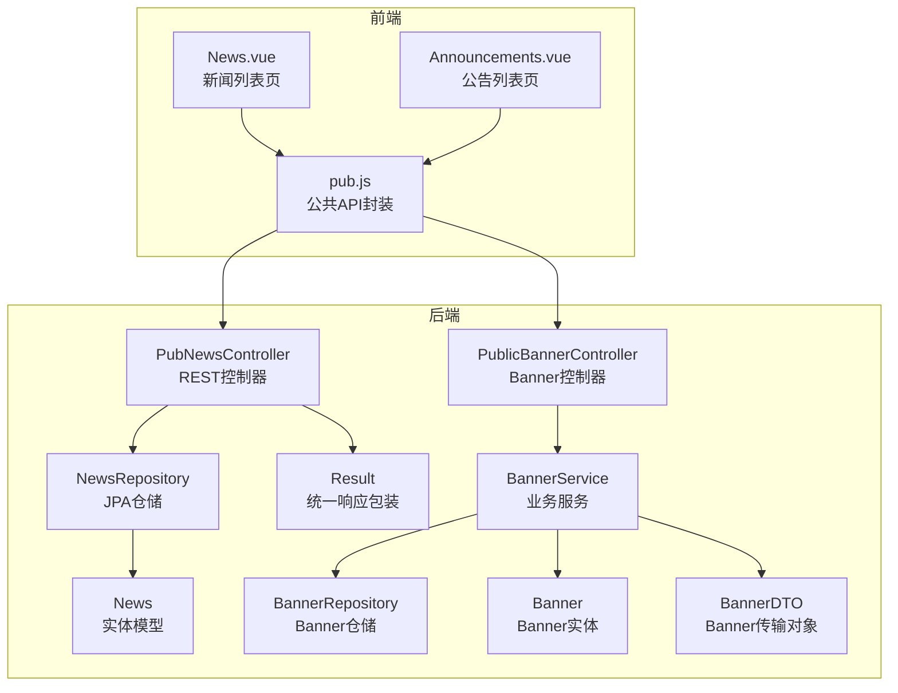
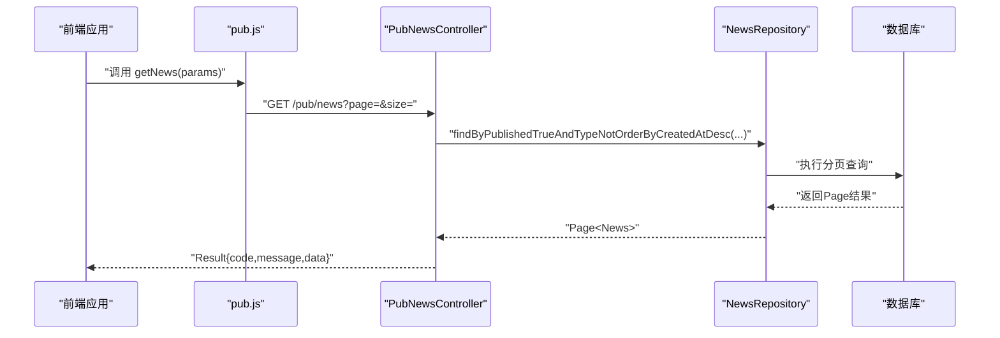
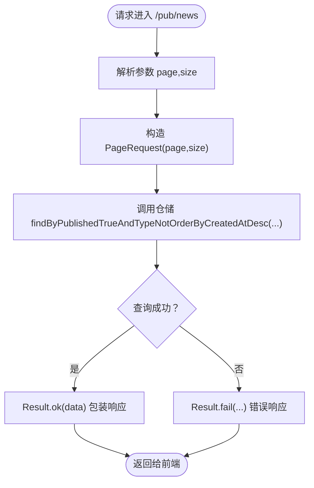
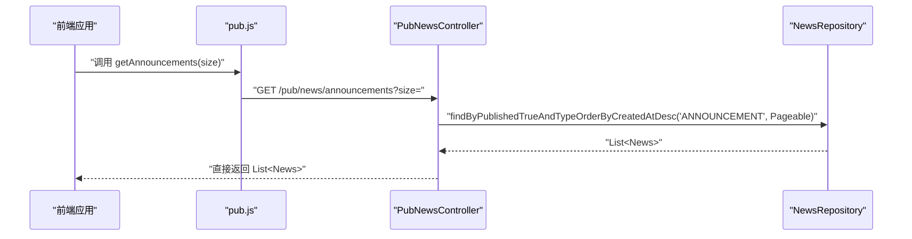
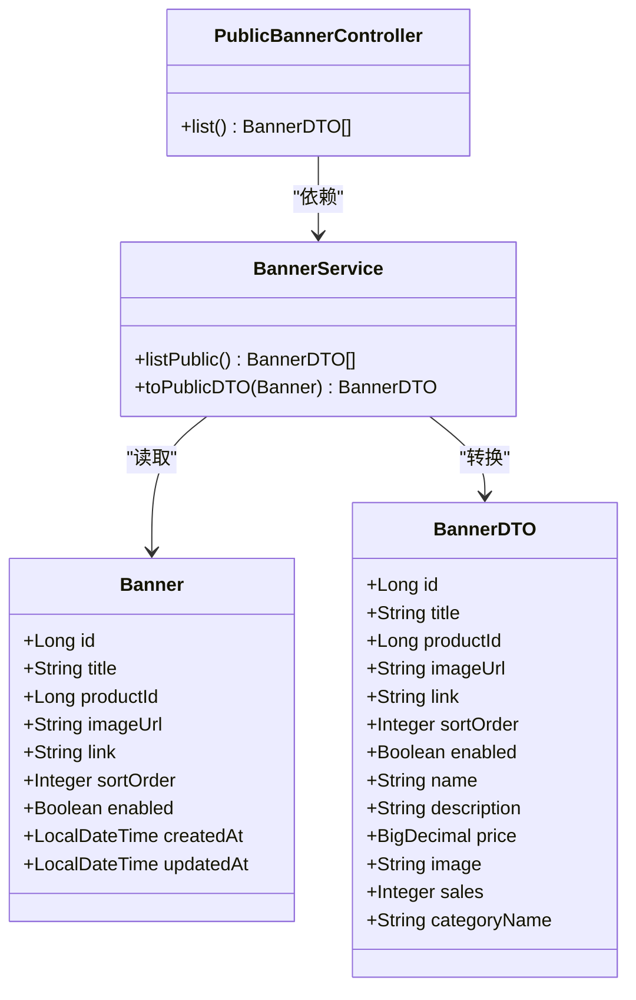
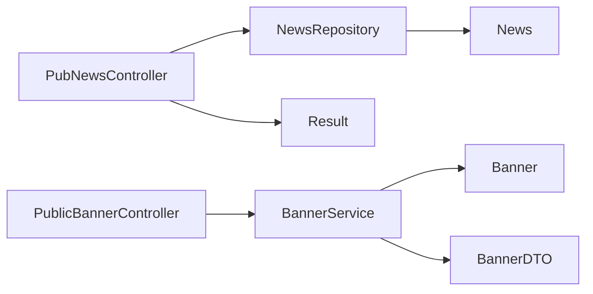

# 新闻资讯公共接口

<cite>
**本文引用的文件**
- [PubNewsController.java](file://backend/src/main/java/com/mall/controller/pub/PubNewsController.java)
- [NewsRepository.java](file://backend/src/main/java/com/mall/repository/NewsRepository.java)
- [News.java](file://backend/src/main/java/com/mall/entity/News.java)
- [Result.java](file://backend/src/main/java/com/mall/dto/Result.java)
- [application.yml](file://backend/src/main/resources/application.yml)
- [pub.js](file://frontend/src/api/pub.js)
- [News.vue](file://frontend/src/views/user/News.vue)
- [Announcements.vue](file://frontend/src/views/user/Announcements.vue)
- [PublicBannerController.java](file://backend/src/main/java/com/mall/controller/pub/PublicBannerController.java)
- [BannerService.java](file://backend/src/main/java/com/mall/service/BannerService.java)
- [BannerRepository.java](file://backend/src/main/java/com/mall/repository/BannerRepository.java)
- [Banner.java](file://backend/src/main/java/com/mall/entity/Banner.java)
- [BannerDTO.java](file://backend/src/main/java/com/mall/dto/BannerDTO.java)
</cite>

## 目录
1. [简介](#简介)
2. [项目结构](#项目结构)
3. [核心组件](#核心组件)
4. [架构总览](#架构总览)
5. [详细组件分析](#详细组件分析)
6. [依赖分析](#依赖分析)
7. [性能考量](#性能考量)
8. [故障排查指南](#故障排查指南)
9. [结论](#结论)
10. [附录](#附录)

## 简介
本技术文档围绕电商商城系统的“新闻资讯公共接口”展开，重点覆盖以下方面：
- 新闻列表查询、新闻详情获取、新闻分类筛选等核心功能的API实现
- 新闻内容的分页加载机制、排序规则
- 新闻与Banner的关联关系与前端集成
- 完整的新闻API文档（查询参数、内容格式、发布时间处理、SEO优化建议）
- 缓存策略、内容安全过滤与前端展示组件集成方案

## 项目结构
后端采用Spring Boot + JPA的数据访问层，前端使用Vue + Element Plus进行页面渲染。新闻模块位于公共接口层，通过REST控制器对外提供服务；数据库实体定义清晰，仓储接口提供分页查询能力；前端通过统一的API模块调用后端接口。

图表来源
- [PubNewsController.java:1-36](file://backend/src/main/java/com/mall/controller/pub/PubNewsController.java#L1-L36)
- [NewsRepository.java:1-19](file://backend/src/main/java/com/mall/repository/NewsRepository.java#L1-L19)
- [News.java:1-52](file://backend/src/main/java/com/mall/entity/News.java#L1-L52)
- [Result.java:1-24](file://backend/src/main/java/com/mall/dto/Result.java#L1-L24)
- [PublicBannerController.java:1-23](file://backend/src/main/java/com/mall/controller/pub/PublicBannerController.java#L1-L23)
- [BannerService.java:1-85](file://backend/src/main/java/com/mall/service/BannerService.java#L1-L85)
- [BannerRepository.java:1-10](file://backend/src/main/java/com/mall/repository/BannerRepository.java#L1-L10)
- [Banner.java:1-60](file://backend/src/main/java/com/mall/entity/Banner.java#L1-L60)
- [BannerDTO.java:1-33](file://backend/src/main/java/com/mall/dto/BannerDTO.java#L1-L33)

章节来源
- [application.yml:1-36](file://backend/src/main/resources/application.yml#L1-L36)

## 核心组件
- 控制器层：提供REST接口，负责接收请求参数、调用仓储层并返回统一响应包装
- 仓储层：基于JPA提供分页查询能力，支持按发布时间倒序、排除公告类型等条件
- 实体层：定义News与Banner的字段、默认值及生命周期回调
- 统一响应：Result类提供标准的响应结构，便于前后端约定
- 前端API封装：pub.js集中管理公共接口调用，News.vue与Announcements.vue消费数据

章节来源
- [PubNewsController.java:1-36](file://backend/src/main/java/com/mall/controller/pub/PubNewsController.java#L1-L36)
- [NewsRepository.java:1-19](file://backend/src/main/java/com/mall/repository/NewsRepository.java#L1-L19)
- [News.java:1-52](file://backend/src/main/java/com/mall/entity/News.java#L1-L52)
- [Result.java:1-24](file://backend/src/main/java/com/mall/dto/Result.java#L1-L24)
- [pub.js:1-74](file://frontend/src/api/pub.js#L1-L74)
- [News.vue:1-279](file://frontend/src/views/user/News.vue#L1-L279)
- [Announcements.vue:1-36](file://frontend/src/views/user/Announcements.vue#L1-L36)

## 架构总览
后端通过REST控制器暴露公共接口，前端通过API模块发起HTTP请求，控制器调用仓储层执行数据库查询，最终以Result封装返回。Banner模块与新闻模块解耦，但共同服务于前台展示。

图表来源
- [pub.js:45-48](file://frontend/src/api/pub.js#L45-L48)
- [PubNewsController.java:21-27](file://backend/src/main/java/com/mall/controller/pub/PubNewsController.java#L21-L27)
- [NewsRepository.java:15](file://backend/src/main/java/com/mall/repository/NewsRepository.java#L15)

## 详细组件分析

### 新闻列表查询
- 接口路径：/pub/news
- 方法：GET
- 查询参数
  - page：页码，从0开始，默认0
  - size：每页条数，默认10
- 返回结构
  - 使用Result包装，data为分页结果
  - 分页字段包含content、totalPages、totalElements、number、size等（由Spring Data提供）
- 排序规则
  - 按创建时间降序排列
- 过滤逻辑
  - 仅返回published为true的记录
  - 排除type为ANNOUNCEMENT的记录（即不包含公告）

图表来源
- [PubNewsController.java:21-27](file://backend/src/main/java/com/mall/controller/pub/PubNewsController.java#L21-L27)
- [NewsRepository.java:15](file://backend/src/main/java/com/mall/repository/NewsRepository.java#L15)

章节来源
- [PubNewsController.java:21-27](file://backend/src/main/java/com/mall/controller/pub/PubNewsController.java#L21-L27)
- [NewsRepository.java:15](file://backend/src/main/java/com/mall/repository/NewsRepository.java#L15)

### 最新公告查询
- 接口路径：/pub/news/announcements
- 方法：GET
- 查询参数
  - size：返回公告数量，默认5
- 返回结构
  - 直接返回List<News>，未使用Result包装
- 排序规则
  - 按创建时间降序排列
- 过滤逻辑
  - 仅返回published为true且type为ANNOUNCEMENT的记录

图表来源
- [pub.js:50-53](file://frontend/src/api/pub.js#L50-L53)
- [PubNewsController.java:29-34](file://backend/src/main/java/com/mall/controller/pub/PubNewsController.java#L29-L34)
- [NewsRepository.java:17](file://backend/src/main/java/com/mall/repository/NewsRepository.java#L17)

章节来源
- [PubNewsController.java:29-34](file://backend/src/main/java/com/mall/controller/pub/PubNewsController.java#L29-L34)
- [NewsRepository.java:17](file://backend/src/main/java/com/mall/repository/NewsRepository.java#L17)

### 新闻详情获取
- 当前代码库未提供新闻详情接口
- 建议新增接口：/pub/news/{id}，方法GET，返回单条News记录
- 若需要分页详情，可在NewsRepository中添加findById并配合Result包装

章节来源
- [NewsRepository.java:10-18](file://backend/src/main/java/com/mall/repository/NewsRepository.java#L10-L18)

### 新闻分类筛选
- 当前代码库未提供按type筛选的接口
- 建议新增接口：/pub/news?type=NEWS|ANNOUNCEMENT，方法GET
- 在NewsRepository中添加对应查询方法，如findByTypeOrderByCreatedAtDesc
- 前端News.vue中可增加type参数传递

章节来源
- [NewsRepository.java:13-17](file://backend/src/main/java/com/mall/repository/NewsRepository.java#L13-L17)
- [News.vue:100-132](file://frontend/src/views/user/News.vue#L100-L132)

### 分页加载机制
- 后端使用Spring Data的PageRequest(page,size)进行分页
- 前端News.vue在“全部”模式下通过Promise.all并发请求资讯与公告，再按createdAt倒序合并
- 建议前端在滚动加载时传入page与size，避免一次性拉取过多数据

章节来源
- [PubNewsController.java:24-26](file://backend/src/main/java/com/mall/controller/pub/PubNewsController.java#L24-L26)
- [News.vue:113-131](file://frontend/src/views/user/News.vue#L113-L131)

### 排序规则
- 新闻列表：按createdAt降序
- 公告列表：按createdAt降序
- Banner列表：按enabled=true且sortOrder升序

章节来源
- [NewsRepository.java:13-17](file://backend/src/main/java/com/mall/repository/NewsRepository.java#L13-L17)
- [BannerRepository.java:8](file://backend/src/main/java/com/mall/repository/BannerRepository.java#L8)

### 新闻与Banner的关联关系
- 新闻模块与Banner模块独立，均通过各自控制器对外提供接口
- Banner模块提供PublicBannerController，返回BannerDTO，其中包含商品信息字段
- 前端News.vue与Announcements.vue未直接调用Banner接口，若需在新闻页展示Banner，可在News.vue中补充调用

图表来源
- [Banner.java:1-60](file://backend/src/main/java/com/mall/entity/Banner.java#L1-L60)
- [BannerDTO.java:1-33](file://backend/src/main/java/com/mall/dto/BannerDTO.java#L1-L33)
- [BannerService.java:27-49](file://backend/src/main/java/com/mall/service/BannerService.java#L27-L49)
- [PublicBannerController.java:18-21](file://backend/src/main/java/com/mall/controller/pub/PublicBannerController.java#L18-L21)

章节来源
- [PublicBannerController.java:1-23](file://backend/src/main/java/com/mall/controller/pub/PublicBannerController.java#L1-L23)
- [BannerService.java:1-85](file://backend/src/main/java/com/mall/service/BannerService.java#L1-L85)
- [BannerRepository.java:1-10](file://backend/src/main/java/com/mall/repository/BannerRepository.java#L1-L10)
- [Banner.java:1-60](file://backend/src/main/java/com/mall/entity/Banner.java#L1-L60)
- [BannerDTO.java:1-33](file://backend/src/main/java/com/mall/dto/BannerDTO.java#L1-L33)

### 前端集成方案
- pub.js封装了getNews与getAnnouncements方法，分别对应后端的两个接口
- News.vue在“全部”模式下并发请求资讯与公告，并按时间合并排序
- Announcements.vue单独加载公告列表
- 建议在News.vue中增加type参数与分页参数，以支持更灵活的筛选与加载

章节来源
- [pub.js:45-53](file://frontend/src/api/pub.js#L45-L53)
- [News.vue:84-145](file://frontend/src/views/user/News.vue#L84-L145)
- [Announcements.vue:16-27](file://frontend/src/views/user/Announcements.vue#L16-L27)

## 依赖分析
- 控制器依赖仓储接口，仓储接口继承JPA，实体定义字段与默认值
- Banner模块与新闻模块相互独立，通过各自的控制器对外提供服务
- 前端通过pub.js统一管理公共接口调用

图表来源
- [PubNewsController.java:19](file://backend/src/main/java/com/mall/controller/pub/PubNewsController.java#L19)
- [NewsRepository.java:11](file://backend/src/main/java/com/mall/repository/NewsRepository.java#L11)
- [News.java:16-50](file://backend/src/main/java/com/mall/entity/News.java#L16-L50)
- [Result.java:10-23](file://backend/src/main/java/com/mall/dto/Result.java#L10-L23)
- [PublicBannerController.java:16](file://backend/src/main/java/com/mall/controller/pub/PublicBannerController.java#L16)
- [BannerService.java:19-49](file://backend/src/main/java/com/mall/service/BannerService.java#L19-L49)
- [Banner.java:14-58](file://backend/src/main/java/com/mall/entity/Banner.java#L14-L58)
- [BannerDTO.java:7-32](file://backend/src/main/java/com/mall/dto/BannerDTO.java#L7-L32)

章节来源
- [PubNewsController.java:1-36](file://backend/src/main/java/com/mall/controller/pub/PubNewsController.java#L1-L36)
- [NewsRepository.java:1-19](file://backend/src/main/java/com/mall/repository/NewsRepository.java#L1-L19)
- [News.java:1-52](file://backend/src/main/java/com/mall/entity/News.java#L1-L52)
- [Result.java:1-24](file://backend/src/main/java/com/mall/dto/Result.java#L1-L24)
- [PublicBannerController.java:1-23](file://backend/src/main/java/com/mall/controller/pub/PublicBannerController.java#L1-L23)
- [BannerService.java:1-85](file://backend/src/main/java/com/mall/service/BannerService.java#L1-L85)
- [Banner.java:1-60](file://backend/src/main/java/com/mall/entity/Banner.java#L1-L60)
- [BannerDTO.java:1-33](file://backend/src/main/java/com/mall/dto/BannerDTO.java#L1-L33)

## 性能考量
- 数据库索引
  - 建议对News的published、type、createdAt建立复合索引，以提升分页查询效率
  - 对Banner的enabled与sortOrder建立索引，确保Banner列表查询高效
- 分页参数
  - 前端应限制默认size，避免过大导致内存压力
  - 支持懒加载与虚拟滚动，减少DOM节点数量
- 缓存策略
  - 公告列表可短期缓存（如5分钟），热点资讯可设置LRU缓存
  - 缓存键建议包含type与size，避免脏数据
- 排序与过滤
  - 优先在数据库层面完成排序与过滤，减少Java侧处理

## 故障排查指南
- 常见错误
  - 参数非法：page或size非数字或小于0，返回空列表或异常
  - 数据库连接失败：检查application.yml中的数据库配置
  - CORS跨域问题：确认后端未拦截OPTIONS预检请求
- 日志定位
  - 开启SQL日志（show-sql）有助于定位查询性能问题
  - 结合Result.code与message判断接口调用是否成功
- 前端调试
  - 在News.vue中打印合并后的list长度与createdAt排序验证
  - 使用浏览器Network面板查看请求参数与响应结构

章节来源
- [application.yml:4-17](file://backend/src/main/resources/application.yml#L4-L17)
- [Result.java:16-22](file://backend/src/main/java/com/mall/dto/Result.java#L16-L22)

## 结论
当前系统已具备新闻列表与公告列表的基础能力，分页与排序规则明确，前端通过pub.js统一调用。建议后续增强新闻详情与分类筛选接口，完善Banner与新闻的联动展示，并引入缓存与索引优化以提升性能与用户体验。

## 附录

### API定义与参数说明
- 新闻列表
  - 路径：/pub/news
  - 方法：GET
  - 参数：page（默认0）、size（默认10）
  - 返回：Result包装的分页对象（包含content、totalPages、totalElements等）
- 最新公告
  - 路径：/pub/news/announcements
  - 方法：GET
  - 参数：size（默认5）
  - 返回：List<News>

章节来源
- [PubNewsController.java:21-34](file://backend/src/main/java/com/mall/controller/pub/PubNewsController.java#L21-L34)
- [pub.js:45-53](file://frontend/src/api/pub.js#L45-L53)

### 数据模型与字段说明
- News实体
  - 字段：id、title、content、type、published、createdAt、updatedAt
  - 默认值：published=false，createdAt/updatedAt在持久化/更新时自动填充
- Banner实体
  - 字段：id、title、productId、imageUrl、link、sortOrder、enabled、createdAt、updatedAt
  - 默认值：enabled=true，sortOrder=0，createdAt/updatedAt自动填充

章节来源
- [News.java:18-50](file://backend/src/main/java/com/mall/entity/News.java#L18-L50)
- [Banner.java:15-58](file://backend/src/main/java/com/mall/entity/Banner.java#L15-L58)

### 发布时间处理与SEO优化
- 时间处理
  - 后端使用LocalDateTime存储createdAt/updatedAt，前端统一格式化显示
  - 建议在接口层输出ISO 8601格式字符串，便于前端统一解析
- SEO优化
  - 为新闻详情页生成唯一URL（如/pub/news/{id}），并返回meta信息
  - 在HTML head中注入title、description、canonical等标签
  - 提供sitemap.xml与robots.txt规范爬虫抓取

### 内容安全过滤
- 输入校验
  - 对page、size参数进行范围校验，防止超大请求
- 输出过滤
  - 对content字段进行XSS过滤，移除危险标签与脚本
  - 对外暴露的DTO中避免泄露敏感字段

### 前端展示组件集成
- News.vue
  - 支持“全部/资讯/公告”三类Tab切换
  - “全部”模式下并发请求并合并排序
  - 支持懒加载与分页参数传递
- Announcements.vue
  - 单独展示公告列表，适合独立入口

章节来源
- [News.vue:84-145](file://frontend/src/views/user/News.vue#L84-L145)
- [Announcements.vue:16-27](file://frontend/src/views/user/Announcements.vue#L16-L27)