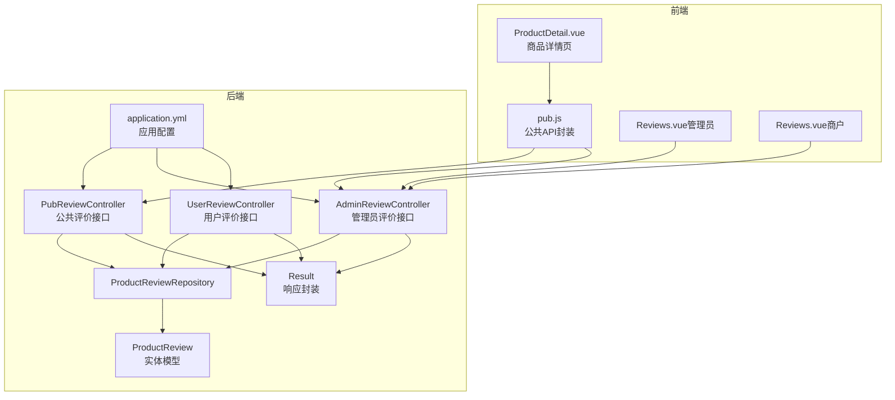
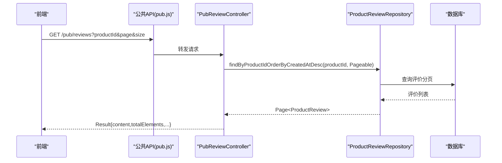
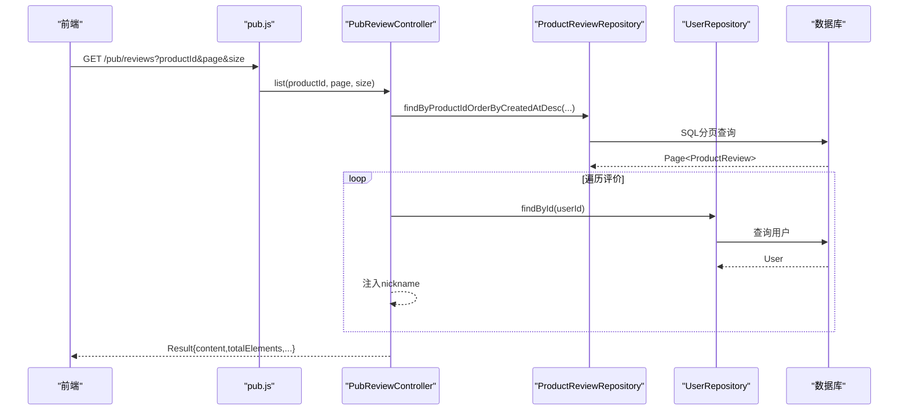
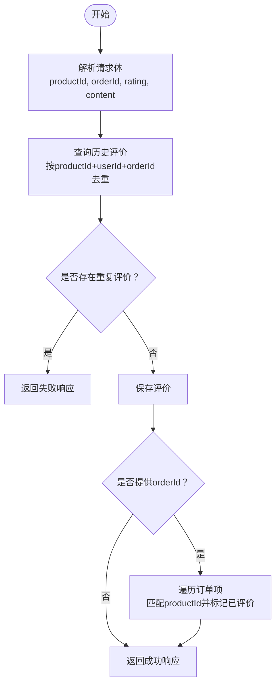
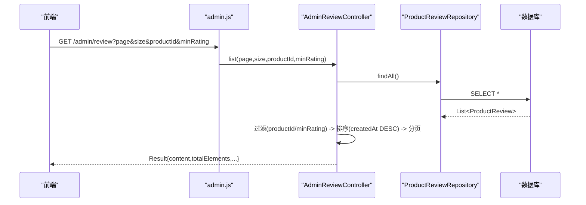
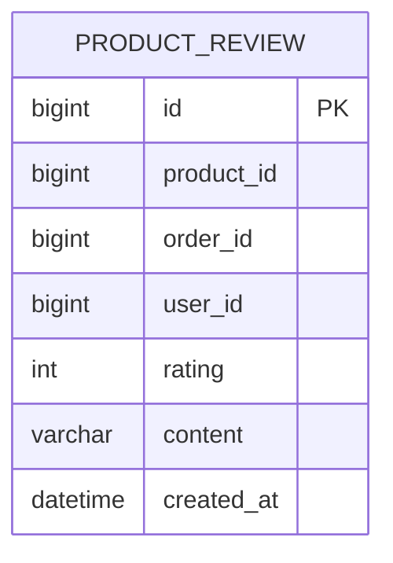
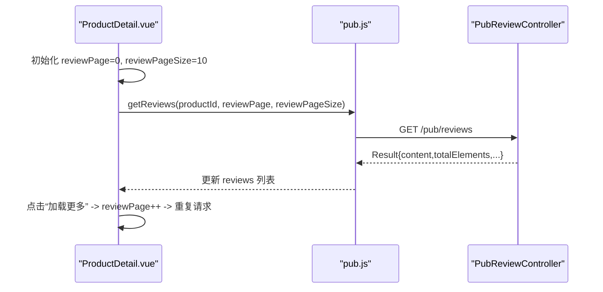
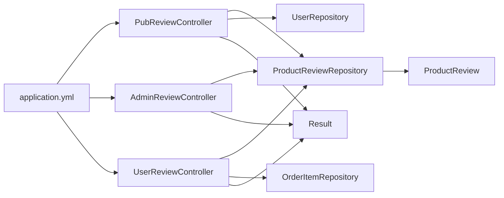

# 评价公共接口

<cite>
**本文引用的文件**
- [PubReviewController.java](file://backend/src/main/java/com/mall/controller/pub/PubReviewController.java)
- [UserReviewController.java](file://backend/src/main/java/com/mall/controller/user/UserReviewController.java)
- [AdminReviewController.java](file://backend/src/main/java/com/mall/controller/admin/AdminReviewController.java)
- [ProductReview.java](file://backend/src/main/java/com/mall/entity/ProductReview.java)
- [ProductReviewRepository.java](file://backend/src/main/java/com/mall/repository/ProductReviewRepository.java)
- [application.yml](file://backend/src/main/resources/application.yml)
- [Result.java](file://backend/src/main/java/com/mall/dto/Result.java)
- [pub.js](file://frontend/src/api/pub.js)
- [ProductDetail.vue](file://frontend/src/views/user/ProductDetail.vue)
- [Reviews.vue（管理员）](file://frontend/src/views/admin/Reviews.vue)
- [Reviews.vue（商户）](file://frontend/src/views/merchant/Reviews.vue)
</cite>

## 目录
1. [简介](#简介)
2. [项目结构](#项目结构)
3. [核心组件](#核心组件)
4. [架构总览](#架构总览)
5. [详细组件分析](#详细组件分析)
6. [依赖分析](#依赖分析)
7. [性能考虑](#性能考虑)
8. [故障排查指南](#故障排查指南)
9. [结论](#结论)
10. [附录](#附录)

## 简介
本技术文档聚焦于电商商城系统的“评价公共接口”，系统性解析以下能力：
- 商品评价查询：按商品分页查询评价列表，支持分页与排序。
- 评价详情获取：在商品详情页加载评价列表，并支持“加载更多”。
- 评价统计分析：管理员与商户端可查看评价总数、五星评价数、平均评分、低分评价等统计指标。
- 审核与过滤：管理员可按商品与最低星级过滤评价；支持删除与批量删除。
- 前端集成：前端通过统一的公共接口获取评价数据，并在商品详情页与后台管理界面展示。

本文件不直接展示代码内容，所有实现细节均以源码路径标注的方式呈现，便于追溯与复用。

## 项目结构
后端采用 Spring Boot + JPA 的分层架构，评价相关模块分布如下：
- 控制器层：公共接口控制器、用户接口控制器、管理员接口控制器。
- 数据访问层：JPA Repository。
- 实体模型：ProductReview。
- 响应封装：Result。
- 前端：公共 API 封装与商品详情页、后台管理页的集成。

图表来源
- [PubReviewController.java:19-62](file://backend/src/main/java/com/mall/controller/pub/PubReviewController.java#L19-L62)
- [UserReviewController.java:17-72](file://backend/src/main/java/com/mall/controller/user/UserReviewController.java#L17-L72)
- [AdminReviewController.java:16-91](file://backend/src/main/java/com/mall/controller/admin/AdminReviewController.java#L16-L91)
- [ProductReviewRepository.java:10-15](file://backend/src/main/java/com/mall/repository/ProductReviewRepository.java#L10-L15)
- [ProductReview.java:8-43](file://backend/src/main/java/com/mall/entity/ProductReview.java#L8-L43)
- [Result.java:7-23](file://backend/src/main/java/com/mall/dto/Result.java#L7-L23)
- [application.yml:1-36](file://backend/src/main/resources/application.yml#L1-L36)
- [pub.js:60-63](file://frontend/src/api/pub.js#L60-L63)
- [ProductDetail.vue:432-456](file://frontend/src/views/user/ProductDetail.vue#L432-L456)
- [Reviews.vue（管理员）:236-259](file://frontend/src/views/admin/Reviews.vue#L236-L259)
- [Reviews.vue（商户）:236-259](file://frontend/src/views/merchant/Reviews.vue#L236-L259)

章节来源
- [PubReviewController.java:19-62](file://backend/src/main/java/com/mall/controller/pub/PubReviewController.java#L19-L62)
- [UserReviewController.java:17-72](file://backend/src/main/java/com/mall/controller/user/UserReviewController.java#L17-L72)
- [AdminReviewController.java:16-91](file://backend/src/main/java/com/mall/controller/admin/AdminReviewController.java#L16-L91)
- [ProductReviewRepository.java:10-15](file://backend/src/main/java/com/mall/repository/ProductReviewRepository.java#L10-L15)
- [ProductReview.java:8-43](file://backend/src/main/java/com/mall/entity/ProductReview.java#L8-L43)
- [Result.java:7-23](file://backend/src/main/java/com/mall/dto/Result.java#L7-L23)
- [application.yml:1-36](file://backend/src/main/resources/application.yml#L1-L36)
- [pub.js:60-63](file://frontend/src/api/pub.js#L60-L63)
- [ProductDetail.vue:432-456](file://frontend/src/views/user/ProductDetail.vue#L432-L456)
- [Reviews.vue（管理员）:236-259](file://frontend/src/views/admin/Reviews.vue#L236-L259)
- [Reviews.vue（商户）:236-259](file://frontend/src/views/merchant/Reviews.vue#L236-L259)

## 核心组件
- 公共评价接口控制器：提供按商品分页查询评价列表的能力，并在结果中注入用户昵称。
- 用户评价接口控制器：负责用户提交评价，避免重复评价，并标记订单项为已评价。
- 管理员评价接口控制器：提供评价列表查询、过滤（商品ID、最低星级）、删除与批量删除。
- 数据访问层：基于 JPA 的仓库接口，提供按商品分页查询与全量查询。
- 实体模型：ProductReview，包含评价的核心字段与创建时间。
- 响应封装：Result，统一返回结构（code/message/data）。
- 前端集成：公共 API 封装与商品详情页、后台管理页的数据绑定与分页交互。

章节来源
- [PubReviewController.java:28-61](file://backend/src/main/java/com/mall/controller/pub/PubReviewController.java#L28-L61)
- [UserReviewController.java:31-71](file://backend/src/main/java/com/mall/controller/user/UserReviewController.java#L31-L71)
- [AdminReviewController.java:24-90](file://backend/src/main/java/com/mall/controller/admin/AdminReviewController.java#L24-L90)
- [ProductReviewRepository.java:10-15](file://backend/src/main/java/com/mall/repository/ProductReviewRepository.java#L10-L15)
- [ProductReview.java:15-42](file://backend/src/main/java/com/mall/entity/ProductReview.java#L15-L42)
- [Result.java:10-22](file://backend/src/main/java/com/mall/dto/Result.java#L10-L22)
- [pub.js:60-63](file://frontend/src/api/pub.js#L60-L63)
- [ProductDetail.vue:432-456](file://frontend/src/views/user/ProductDetail.vue#L432-L456)
- [Reviews.vue（管理员）:236-259](file://frontend/src/views/admin/Reviews.vue#L236-L259)
- [Reviews.vue（商户）:236-259](file://frontend/src/views/merchant/Reviews.vue#L236-L259)

## 架构总览
公共评价接口遵循“前端请求 → 控制器 → 仓储 → 实体 → 统一响应”的标准流程；管理员与用户端分别通过独立控制器扩展业务能力。

图表来源
- [pub.js:60-63](file://frontend/src/api/pub.js#L60-L63)
- [PubReviewController.java:28-61](file://backend/src/main/java/com/mall/controller/pub/PubReviewController.java#L28-L61)
- [ProductReviewRepository.java:12-14](file://backend/src/main/java/com/mall/repository/ProductReviewRepository.java#L12-L14)

## 详细组件分析

### 公共评价接口（按商品分页查询）
- 接口定义：GET /pub/reviews
- 参数
  - productId：必填，商品ID
  - page：可选，默认0
  - size：可选，默认10
- 处理逻辑
  - 使用仓储按商品ID与创建时间倒序分页查询。
  - 对每条评价补充用户昵称（若用户存在则取昵称，否则用户名），并封装为通用Map列表。
  - 返回统一响应结构，包含分页元数据（页码、大小、总数）。
- 性能与复杂度
  - 分页查询由数据库完成，时间复杂度 O(logN + M)，N为总记录数，M为分页大小。
  - 关联用户信息存在逐条查询风险，建议在高并发场景引入缓存或预聚合。

图表来源
- [PubReviewController.java:28-61](file://backend/src/main/java/com/mall/controller/pub/PubReviewController.java#L28-L61)
- [ProductReviewRepository.java:12-14](file://backend/src/main/java/com/mall/repository/ProductReviewRepository.java#L12-L14)

章节来源
- [PubReviewController.java:28-61](file://backend/src/main/java/com/mall/controller/pub/PubReviewController.java#L28-L61)
- [ProductReviewRepository.java:12-14](file://backend/src/main/java/com/mall/repository/ProductReviewRepository.java#L12-L14)

### 用户评价接口（提交评价）
- 接口定义：POST /user/review
- 请求体字段
  - productId：必填，商品ID
  - orderId：可选，订单ID（用于标记订单项已评价）
  - rating：可选，默认5，评价分数
  - content：评价内容
- 业务规则
  - 防止同一用户对同一商品（或同一订单项）重复评价。
  - 保存评价后，若提供orderId，则遍历订单项并标记对应项为已评价。
- 返回值：统一响应结构，data为保存后的评价对象。

图表来源
- [UserReviewController.java:31-71](file://backend/src/main/java/com/mall/controller/user/UserReviewController.java#L31-L71)

章节来源
- [UserReviewController.java:26-71](file://backend/src/main/java/com/mall/controller/user/UserReviewController.java#L26-L71)

### 管理员评价接口（查询、过滤、删除）
- 接口定义：GET /admin/review；DELETE /admin/review/{reviewId}；POST /admin/review/batch-delete
- 查询参数
  - page、size：分页
  - productId：可选，按商品过滤
  - minRating：可选，最低星级；传入-3表示低于3星
- 处理逻辑
  - 先全量加载评价，再在内存中应用过滤与排序，最后分页切片。
  - 支持单条删除与批量删除。
- 注意事项
  - 内存过滤在数据量大时可能成为瓶颈，建议改为数据库侧过滤或引入索引优化。

图表来源
- [AdminReviewController.java:24-64](file://backend/src/main/java/com/mall/controller/admin/AdminReviewController.java#L24-L64)

章节来源
- [AdminReviewController.java:24-90](file://backend/src/main/java/com/mall/controller/admin/AdminReviewController.java#L24-L90)

### 数据模型与仓储
- 实体 ProductReview
  - 字段：id、productId、orderId、userId、rating、content、createdAt。
  - 创建时自动填充 createdAt。
- 仓储 ProductReviewRepository
  - 提供按商品ID分页查询与全量查询方法。

图表来源
- [ProductReview.java:15-42](file://backend/src/main/java/com/mall/entity/ProductReview.java#L15-L42)

章节来源
- [ProductReview.java:15-42](file://backend/src/main/java/com/mall/entity/ProductReview.java#L15-L42)
- [ProductReviewRepository.java:10-15](file://backend/src/main/java/com/mall/repository/ProductReviewRepository.java#L10-L15)

### 前端集成方案
- 公共 API 封装
  - getReviews(productId, page, size)：调用 /pub/reviews。
- 商品详情页
  - 首次加载第一页评价；点击“加载更多”递增页码并拼接结果。
  - 展示用户昵称、评分与评价内容。
- 后台管理页
  - 管理员与商户均可加载评价列表，支持分页与筛选（商品、最低星级）。
  - 展示统计卡片（总评价数、五星评价、平均评分、低评价）。

图表来源
- [pub.js:60-63](file://frontend/src/api/pub.js#L60-L63)
- [ProductDetail.vue:432-456](file://frontend/src/views/user/ProductDetail.vue#L432-L456)

章节来源
- [pub.js:60-63](file://frontend/src/api/pub.js#L60-L63)
- [ProductDetail.vue:432-456](file://frontend/src/views/user/ProductDetail.vue#L432-L456)
- [Reviews.vue（管理员）:236-259](file://frontend/src/views/admin/Reviews.vue#L236-L259)
- [Reviews.vue（商户）:236-259](file://frontend/src/views/merchant/Reviews.vue#L236-L259)

## 依赖分析
- 控制器与仓储
  - PubReviewController 依赖 ProductReviewRepository 与 UserRepository。
  - AdminReviewController 依赖 ProductReviewRepository。
  - UserReviewController 依赖 ProductReviewRepository 与 OrderItemRepository。
- 统一响应
  - Result 提供 ok/fail 两种静态工厂方法，控制器统一返回。
- 应用配置
  - application.yml 定义了数据库连接、JPA方言、端口与上下文路径等。

图表来源
- [PubReviewController.java:25-26](file://backend/src/main/java/com/mall/controller/pub/PubReviewController.java#L25-L26)
- [AdminReviewController.java](file://backend/src/main/java/com/mall/controller/admin/AdminReviewController.java#L22)
- [UserReviewController.java:23-24](file://backend/src/main/java/com/mall/controller/user/UserReviewController.java#L23-L24)
- [ProductReviewRepository.java:10-15](file://backend/src/main/java/com/mall/repository/ProductReviewRepository.java#L10-L15)
- [ProductReview.java:15-42](file://backend/src/main/java/com/mall/entity/ProductReview.java#L15-L42)
- [Result.java:16-22](file://backend/src/main/java/com/mall/dto/Result.java#L16-L22)
- [application.yml:1-36](file://backend/src/main/resources/application.yml#L1-L36)

章节来源
- [PubReviewController.java:25-26](file://backend/src/main/java/com/mall/controller/pub/PubReviewController.java#L25-L26)
- [AdminReviewController.java](file://backend/src/main/java/com/mall/controller/admin/AdminReviewController.java#L22)
- [UserReviewController.java:23-24](file://backend/src/main/java/com/mall/controller/user/UserReviewController.java#L23-L24)
- [ProductReviewRepository.java:10-15](file://backend/src/main/java/com/mall/repository/ProductReviewRepository.java#L10-L15)
- [Result.java:16-22](file://backend/src/main/java/com/mall/dto/Result.java#L16-L22)
- [application.yml:1-36](file://backend/src/main/resources/application.yml#L1-L36)

## 性能考虑
- 分页查询
  - 当前公共接口使用数据库分页，具备良好扩展性；建议在商品与评价维度建立复合索引以提升排序与过滤性能。
- 内存过滤
  - 管理员接口先全量加载再过滤排序，大数据量时会带来内存压力；建议改为数据库侧过滤或引入分页游标。
- 用户昵称关联
  - 每条评价单独查询用户信息可能导致 N+1 查询；建议在查询阶段通过 JOIN 或批量预加载优化。
- 统计计算
  - 前端统计卡片在列表页计算，建议后端提供聚合接口（如按商品统计星级分布）以减少前端计算开销。

## 故障排查指南
- 常见错误与定位
  - 重复评价：用户提交评价时若已存在相同商品与订单的评价，接口返回失败提示。
  - 评价不存在：管理员删除评价时若 ID 不存在，返回失败提示。
  - 分页参数异常：前端传入非法 page/size 时，后端按默认值处理；建议在前端校验并提示。
- 日志与监控
  - application.yml 中已关闭 show-sql，生产环境可根据需要开启以辅助排查慢查询。
- 响应结构
  - 所有接口统一返回 Result 结构，前端可通过 code/message/data 判断成功与失败。

章节来源
- [UserReviewController.java:40-47](file://backend/src/main/java/com/mall/controller/user/UserReviewController.java#L40-L47)
- [AdminReviewController.java:66-76](file://backend/src/main/java/com/mall/controller/admin/AdminReviewController.java#L66-L76)
- [Result.java:16-22](file://backend/src/main/java/com/mall/dto/Result.java#L16-L22)
- [application.yml:12-12](file://backend/src/main/resources/application.yml#L12-L12)

## 结论
本评价公共接口以清晰的分层设计实现了“查询、提交、管理、统计”的完整闭环。公共接口满足商品详情页的分页展示需求，用户接口保障评价的真实性与一致性，管理员接口提供灵活的审核与治理能力。建议在后续版本中引入数据库索引优化、缓存策略与后端聚合统计，以进一步提升性能与可维护性。

## 附录

### API 文档概览
- 公共接口
  - GET /pub/reviews
    - 参数：productId（必填）、page（默认0）、size（默认10）
    - 返回：分页评价列表，每条记录包含评价基础信息与用户昵称
- 用户接口
  - POST /user/review
    - 请求体：productId、orderId（可选）、rating（默认5）、content
    - 返回：保存后的评价对象
- 管理员接口
  - GET /admin/review
    - 参数：page、size、productId（可选）、minRating（-3表示低于3星）
    - 返回：分页评价列表与统计信息
  - DELETE /admin/review/{reviewId}
    - 返回：删除结果
  - POST /admin/review/batch-delete
    - 请求体：[reviewId...]
    - 返回：批量删除结果

章节来源
- [PubReviewController.java:28-61](file://backend/src/main/java/com/mall/controller/pub/PubReviewController.java#L28-L61)
- [UserReviewController.java:31-71](file://backend/src/main/java/com/mall/controller/user/UserReviewController.java#L31-L71)
- [AdminReviewController.java:24-90](file://backend/src/main/java/com/mall/controller/admin/AdminReviewController.java#L24-L90)