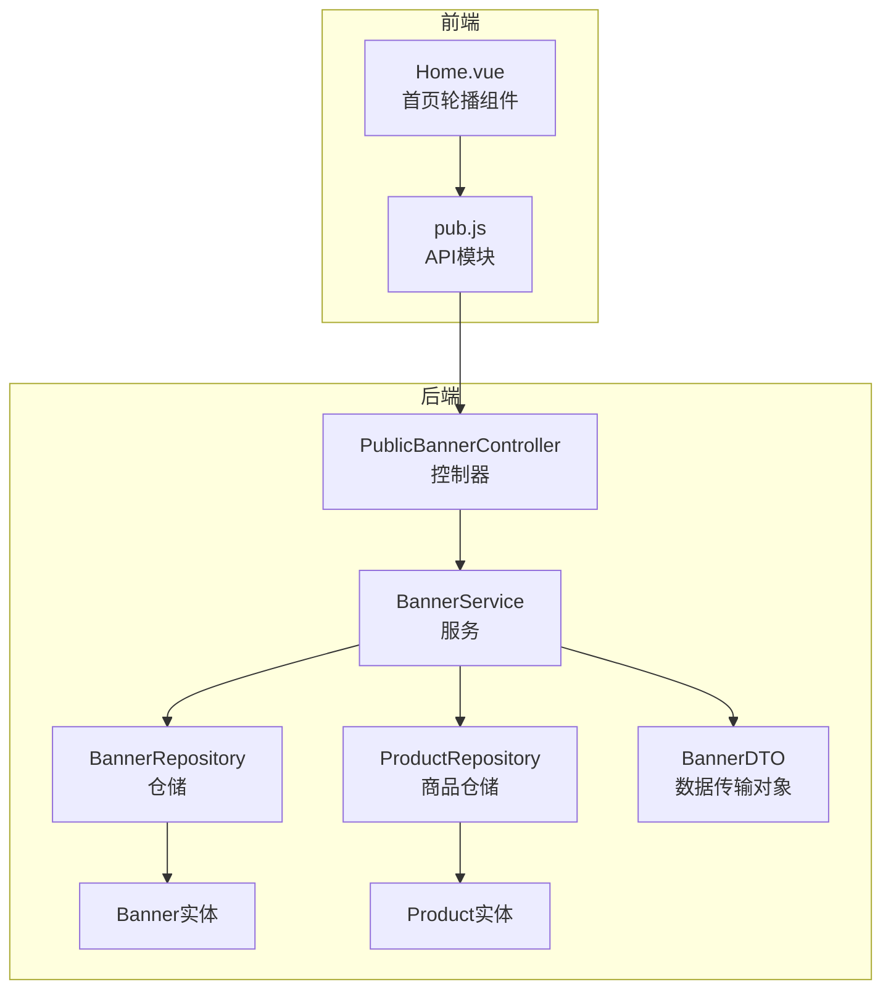
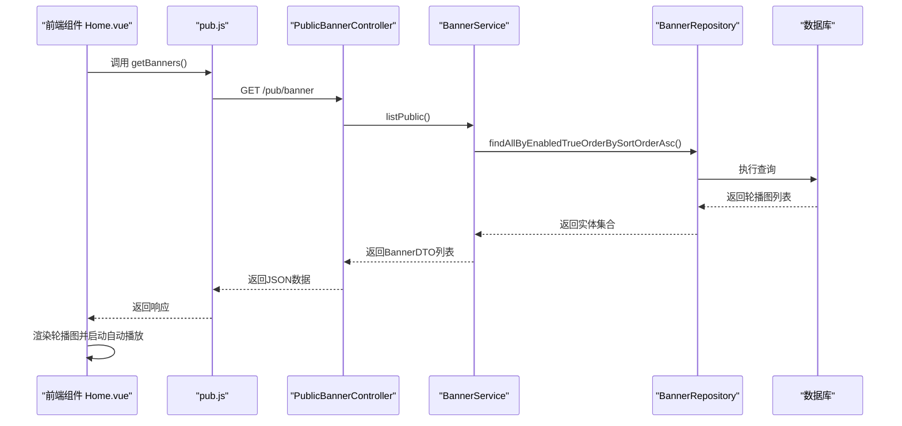
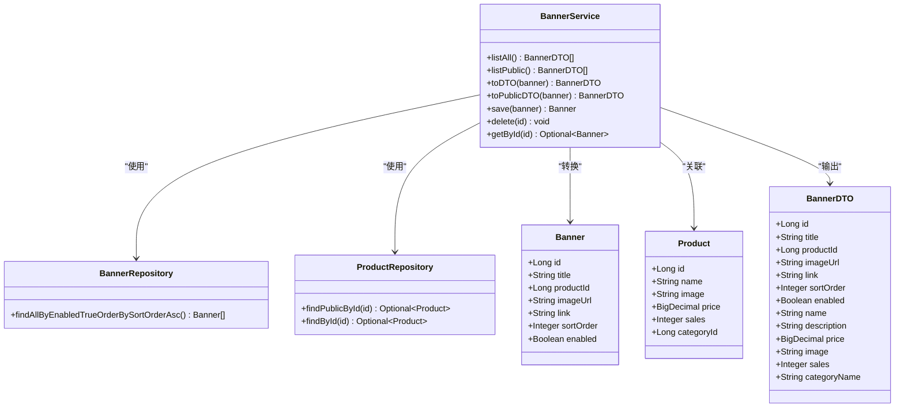
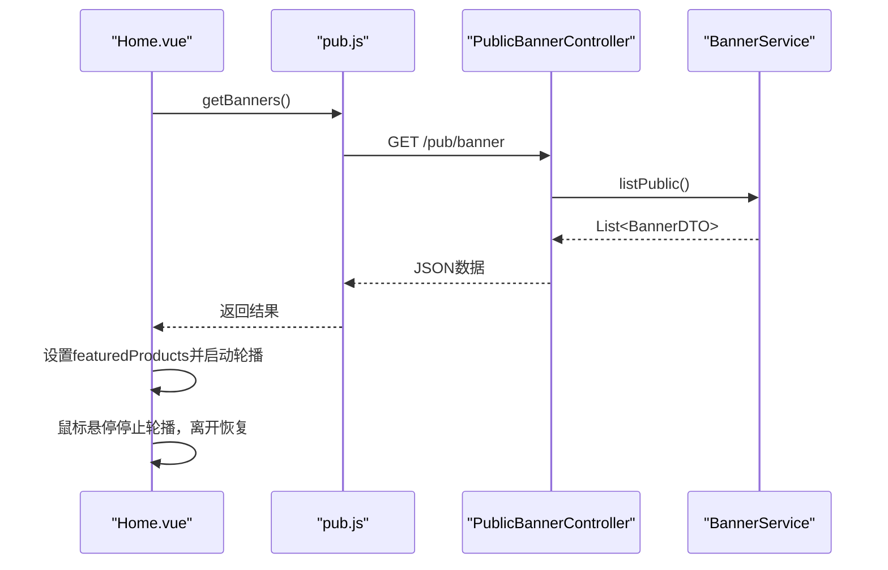
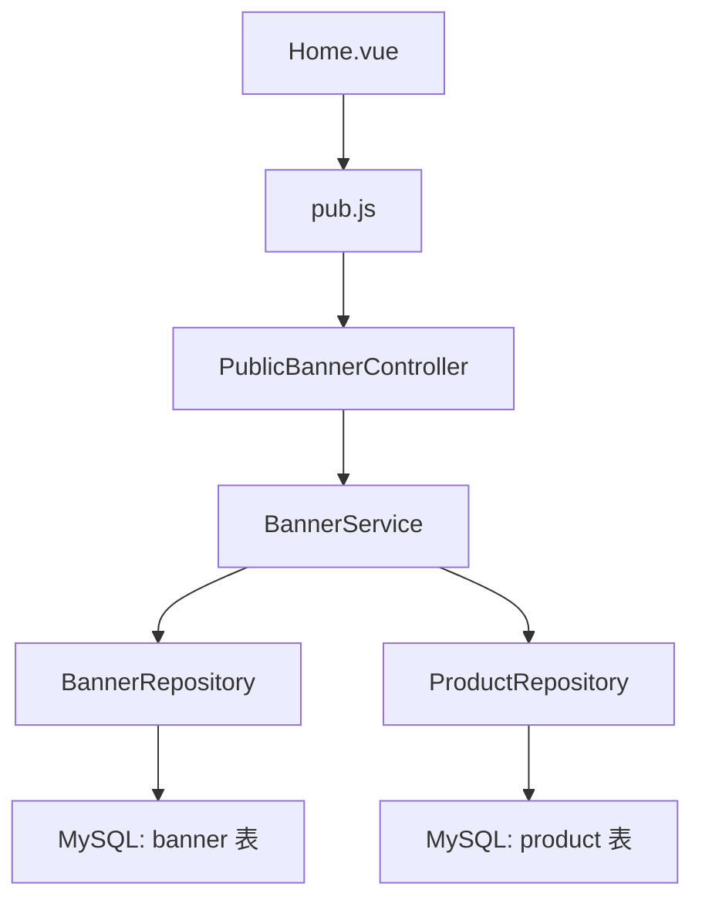
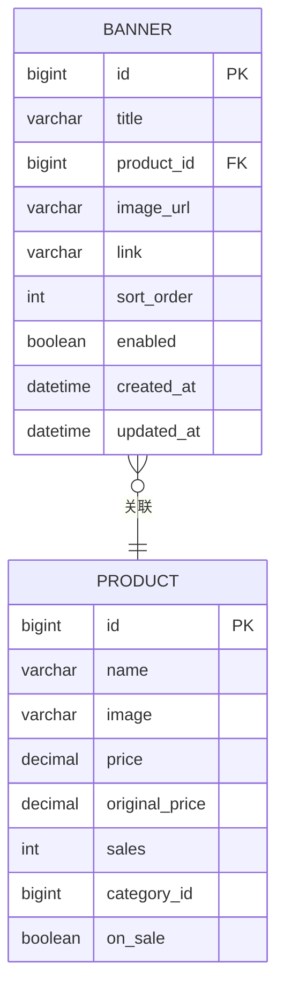

# 轮播图公共接口

<cite>
**本文档引用的文件**
- [PublicBannerController.java](file://backend/src/main/java/com/mall/controller/pub/PublicBannerController.java)
- [BannerService.java](file://backend/src/main/java/com/mall/service/BannerService.java)
- [Banner.java](file://backend/src/main/java/com/mall/entity/Banner.java)
- [BannerRepository.java](file://backend/src/main/java/com/mall/repository/BannerRepository.java)
- [BannerDTO.java](file://backend/src/main/java/com/mall/dto/BannerDTO.java)
- [Product.java](file://backend/src/main/java/com/mall/entity/Product.java)
- [ProductRepository.java](file://backend/src/main/java/com/mall/repository/ProductRepository.java)
- [Home.vue](file://frontend/src/views/user/Home.vue)
- [pub.js](file://frontend/src/api/pub.js)
- [application.yml](file://backend/src/main/resources/application.yml)
- [banner.sql](file://backend/src/main/resources/banner.sql)
- [mall.sql](file://mall.sql)
</cite>

## 目录
1. [简介](#简介)
2. [项目结构](#项目结构)
3. [核心组件](#核心组件)
4. [架构概览](#架构概览)
5. [详细组件分析](#详细组件分析)
6. [依赖关系分析](#依赖关系分析)
7. [性能考虑](#性能考虑)
8. [故障排除指南](#故障排除指南)
9. [结论](#结论)
10. [附录](#附录)

## 简介
本文件为电商商城系统的轮播图公共接口技术文档，围绕轮播图列表查询、轮播图详情获取、轮播图状态管理等核心功能进行深入解析。文档详细说明轮播图的展示逻辑、轮播顺序控制、轮播图与商品的关联关系，并提供完整的轮播图API文档，包括查询参数、图片资源管理、点击跳转处理和移动端适配考虑。同时解释轮播图数据的缓存策略、图片压缩优化和前端轮播组件的集成方式。

## 项目结构
轮播图系统由后端Spring Boot服务与前端Vue应用共同组成，采用RESTful API进行交互。后端通过控制器层暴露公共接口，服务层负责业务逻辑与数据转换，仓储层访问数据库；前端通过API模块调用后端接口并渲染轮播组件。

**图表来源**
- [PublicBannerController.java:12-22](file://backend/src/main/java/com/mall/controller/pub/PublicBannerController.java#L12-L22)
- [BannerService.java:16-84](file://backend/src/main/java/com/mall/service/BannerService.java#L16-L84)
- [BannerRepository.java:7-9](file://backend/src/main/java/com/mall/repository/BannerRepository.java#L7-L9)
- [ProductRepository.java:13-124](file://backend/src/main/java/com/mall/repository/ProductRepository.java#L13-L124)
- [Banner.java:7-59](file://backend/src/main/java/com/mall/entity/Banner.java#L7-L59)
- [Product.java:9-100](file://backend/src/main/java/com/mall/entity/Product.java#L9-L100)
- [BannerDTO.java:6-32](file://backend/src/main/java/com/mall/dto/BannerDTO.java#L6-L32)
- [pub.js:55-58](file://frontend/src/api/pub.js#L55-L58)
- [Home.vue:441-456](file://frontend/src/views/user/Home.vue#L441-L456)

**章节来源**
- [PublicBannerController.java:12-22](file://backend/src/main/java/com/mall/controller/pub/PublicBannerController.java#L12-L22)
- [BannerService.java:16-84](file://backend/src/main/java/com/mall/service/BannerService.java#L16-L84)
- [Home.vue:441-456](file://frontend/src/views/user/Home.vue#L441-L456)
- [pub.js:55-58](file://frontend/src/api/pub.js#L55-L58)

## 核心组件
- 控制器层：提供公共轮播图接口，当前仅支持轮播图列表查询。
- 服务层：负责轮播图数据的查询、转换与商品信息填充。
- 仓储层：基于JPA的数据访问，提供按启用状态和排序权重查询。
- 数据模型：轮播图实体包含标题、商品ID、图片URL、跳转链接、排序权重与启用状态等字段。
- 前端API：封装HTTP请求，统一调用后端公共接口。
- 前端组件：首页轮播组件负责轮播播放、暂停、切换与缩略图导航。

**章节来源**
- [PublicBannerController.java:12-22](file://backend/src/main/java/com/mall/controller/pub/PublicBannerController.java#L12-L22)
- [BannerService.java:16-84](file://backend/src/main/java/com/mall/service/BannerService.java#L16-L84)
- [BannerRepository.java:7-9](file://backend/src/main/java/com/mall/repository/BannerRepository.java#L7-L9)
- [Banner.java:7-59](file://backend/src/main/java/com/mall/entity/Banner.java#L7-L59)
- [BannerDTO.java:6-32](file://backend/src/main/java/com/mall/dto/BannerDTO.java#L6-L32)
- [pub.js:55-58](file://frontend/src/api/pub.js#L55-L58)
- [Home.vue:441-456](file://frontend/src/views/user/Home.vue#L441-L456)

## 架构概览
轮播图公共接口遵循经典的三层架构：表现层（前端）、业务层（服务）、数据层（仓储）。前端通过API模块发起HTTP请求，控制器接收请求并调用服务层，服务层查询数据库并返回DTO对象，前端组件渲染轮播图。

**图表来源**
- [Home.vue:441-456](file://frontend/src/views/user/Home.vue#L441-L456)
- [pub.js:55-58](file://frontend/src/api/pub.js#L55-L58)
- [PublicBannerController.java:18-21](file://backend/src/main/java/com/mall/controller/pub/PublicBannerController.java#L18-L21)
- [BannerService.java:27-33](file://backend/src/main/java/com/mall/service/BannerService.java#L27-L33)
- [BannerRepository.java:8-8](file://backend/src/main/java/com/mall/repository/BannerRepository.java#L8-L8)

## 详细组件分析

### 控制器层：PublicBannerController
- 路径映射：/pub/banner
- 方法：GET /pub/banner 返回轮播图列表
- 实现：调用BannerService.listPublic()获取公开轮播图

**章节来源**
- [PublicBannerController.java:12-22](file://backend/src/main/java/com/mall/controller/pub/PublicBannerController.java#L12-L22)

### 服务层：BannerService
- 列表查询：
  - listAll(): 查询所有启用的轮播图，按sortOrder升序排列
  - listPublic(): 查询所有启用的轮播图，过滤掉缺少商品信息的记录
- DTO转换：
  - toDTO(): 将Banner实体转换为BannerDTO，并填充商品信息
  - toPublicDTO(): 使用公开商品查询，填充商品信息
- 商品信息填充：从ProductRepository获取商品详情，填充名称、图片、价格、销量等字段
- 保存逻辑：当存在productId时，自动设置imageUrl为商品主图

**图表来源**
- [BannerService.java:16-84](file://backend/src/main/java/com/mall/service/BannerService.java#L16-L84)
- [BannerRepository.java:7-9](file://backend/src/main/java/com/mall/repository/BannerRepository.java#L7-L9)
- [ProductRepository.java:85-91](file://backend/src/main/java/com/mall/repository/ProductRepository.java#L85-L91)
- [Banner.java:14-59](file://backend/src/main/java/com/mall/entity/Banner.java#L14-L59)
- [Product.java:16-100](file://backend/src/main/java/com/mall/entity/Product.java#L16-L100)
- [BannerDTO.java:7-32](file://backend/src/main/java/com/mall/dto/BannerDTO.java#L7-L32)

**章节来源**
- [BannerService.java:16-84](file://backend/src/main/java/com/mall/service/BannerService.java#L16-L84)

### 数据模型：Banner与Product
- Banner实体字段：
  - id：自增主键
  - title：轮播图标题
  - productId：关联商品ID（必须为已上架商品）
  - imageUrl：轮播图图片URL
  - link：跳转链接（可选，默认跳商品详情）
  - sortOrder：排序权重
  - enabled：是否启用
  - 时间戳：createdAt、updatedAt
- Product实体字段：
  - id：商品ID
  - name：商品名称
  - image：商品主图
  - price：现价
  - originalPrice：原价
  - sales：销量
  - categoryId：分类ID
  - onSale：是否上架

**章节来源**
- [Banner.java:14-59](file://backend/src/main/java/com/mall/entity/Banner.java#L14-L59)
- [Product.java:16-100](file://backend/src/main/java/com/mall/entity/Product.java#L16-L100)

### 前端集成：Home.vue与pub.js
- 首页轮播组件：
  - 加载流程：优先调用getBanners()获取运营配置的轮播图，若为空则回退到商品列表
  - 自动播放：使用定时器每5秒切换一次，鼠标悬停暂停
  - 导航控制：左右箭头切换、底部指示器与缩略图导航
- API调用：
  - getBanners(): GET /pub/banner
  - 跳转处理：点击进入商品详情页

**图表来源**
- [Home.vue:441-456](file://frontend/src/views/user/Home.vue#L441-L456)
- [pub.js:55-58](file://frontend/src/api/pub.js#L55-L58)
- [PublicBannerController.java:18-21](file://backend/src/main/java/com/mall/controller/pub/PublicBannerController.java#L18-L21)
- [BannerService.java:27-33](file://backend/src/main/java/com/mall/service/BannerService.java#L27-L33)

**章节来源**
- [Home.vue:441-456](file://frontend/src/views/user/Home.vue#L441-L456)
- [pub.js:55-58](file://frontend/src/api/pub.js#L55-L58)

## 依赖关系分析
- 控制器依赖服务层，服务层依赖仓储层与商品仓储层
- 服务层通过BeanUtils进行实体与DTO的属性复制
- 前端通过API模块统一管理HTTP请求，避免直接耦合后端路径
- 数据库层面，Banner表外键关联Product表，确保轮播图与有效商品的绑定

**图表来源**
- [PublicBannerController.java:12-22](file://backend/src/main/java/com/mall/controller/pub/PublicBannerController.java#L12-L22)
- [BannerService.java:16-21](file://backend/src/main/java/com/mall/service/BannerService.java#L16-L21)
- [BannerRepository.java:7-9](file://backend/src/main/java/com/mall/repository/BannerRepository.java#L7-L9)
- [ProductRepository.java:13-124](file://backend/src/main/java/com/mall/repository/ProductRepository.java#L13-L124)
- [Home.vue:441-456](file://frontend/src/views/user/Home.vue#L441-L456)
- [pub.js:55-58](file://frontend/src/api/pub.js#L55-L58)

**章节来源**
- [BannerRepository.java:7-9](file://backend/src/main/java/com/mall/repository/BannerRepository.java#L7-L9)
- [ProductRepository.java:13-124](file://backend/src/main/java/com/mall/repository/ProductRepository.java#L13-L124)

## 性能考虑
- 数据库索引：banner表对(enabled, sort_order)建立复合索引，优化查询性能
- 排序与过滤：服务层按sortOrder升序排列，减少前端排序开销
- DTO转换：服务层在后端完成实体到DTO的转换，减少前端复杂逻辑
- 前端轮播：使用CSS3 transform进行滑动动画，配合will-change提升渲染性能
- 回退机制：若轮播图为空，自动回退到商品列表，保证页面可用性

**章节来源**
- [banner.sql:11-11](file://backend/src/main/resources/banner.sql#L11-L11)
- [BannerService.java:22-33](file://backend/src/main/java/com/mall/service/BannerService.java#L22-L33)
- [Home.vue:508-541](file://frontend/src/views/user/Home.vue#L508-L541)

## 故障排除指南
- 轮播图不显示：
  - 检查数据库中banner表enabled字段是否为true
  - 确认sortOrder字段正确且大于等于0
  - 验证productId对应的product是否存在且onSale为true
- 图片加载失败：
  - 检查imageUrl字段是否为有效的图片URL
  - 确认静态资源服务器配置正确
- 跳转异常：
  - 若link为空，将默认跳转至商品详情页
  - 检查商品详情接口是否正常
- 前端轮播不滚动：
  - 确认Home.vue中的定时器逻辑正常执行
  - 检查featuredProducts数据是否正确加载

**章节来源**
- [BannerService.java:43-67](file://backend/src/main/java/com/mall/service/BannerService.java#L43-L67)
- [Home.vue:508-541](file://frontend/src/views/user/Home.vue#L508-L541)

## 结论
轮播图公共接口通过清晰的分层架构实现了高效的数据查询与展示。后端提供简洁的REST API，前端组件具备良好的用户体验与性能表现。系统通过数据库索引、DTO转换与前端动画优化确保了整体性能。未来可在现有基础上扩展轮播图详情接口、支持多语言与多终端适配等功能。

## 附录

### API定义
- 轮播图列表查询
  - 方法：GET
  - 路径：/pub/banner
  - 认证：无需登录
  - 响应：BannerDTO数组
  - 说明：返回所有启用的轮播图，按sortOrder升序排列

### 数据模型

**图表来源**
- [banner.sql:1-14](file://backend/src/main/resources/banner.sql#L1-L14)
- [mall.sql:47-64](file://mall.sql#L47-L64)
- [Banner.java:14-59](file://backend/src/main/java/com/mall/entity/Banner.java#L14-L59)
- [Product.java:16-100](file://backend/src/main/java/com/mall/entity/Product.java#L16-L100)

### 配置参考
- 服务器端口：8080
- 上下文路径：/api
- 静态资源位置：classpath:/static/

**章节来源**
- [application.yml:22-25](file://backend/src/main/resources/application.yml#L22-L25)