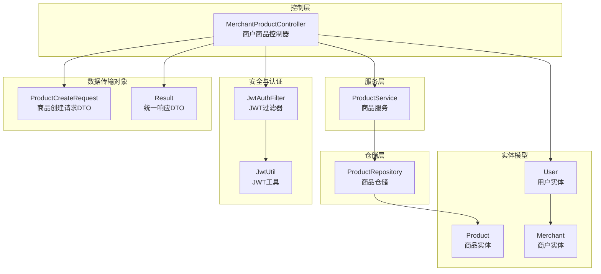
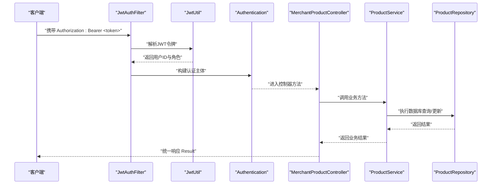
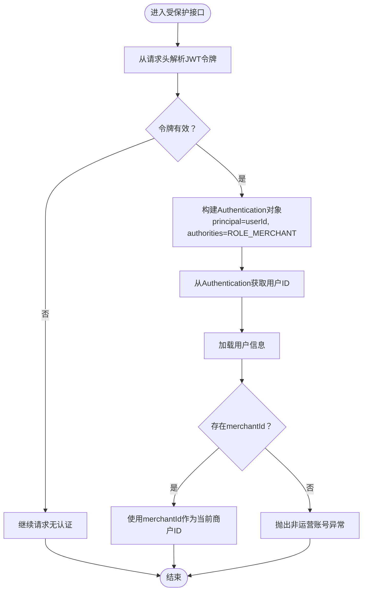
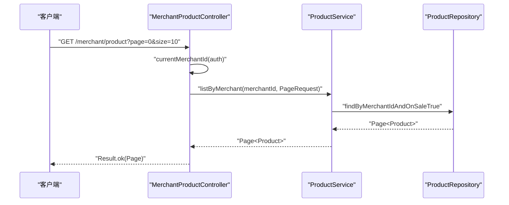
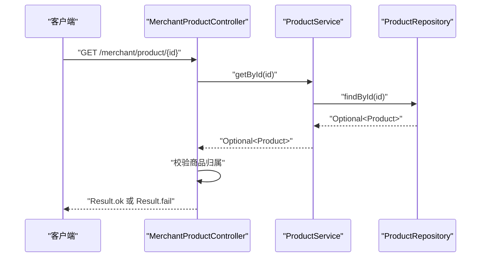
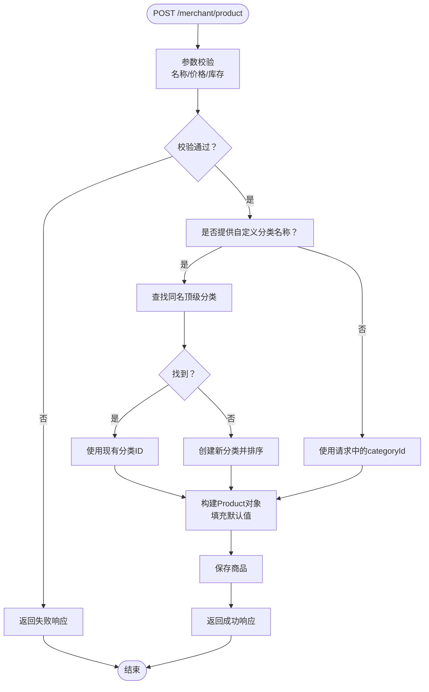
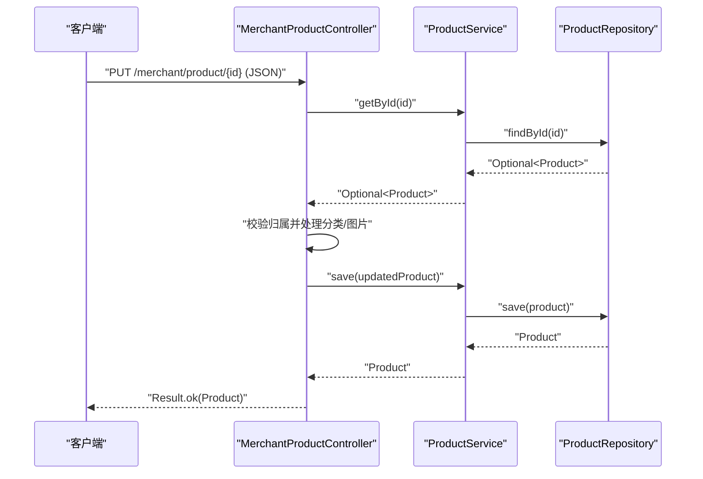
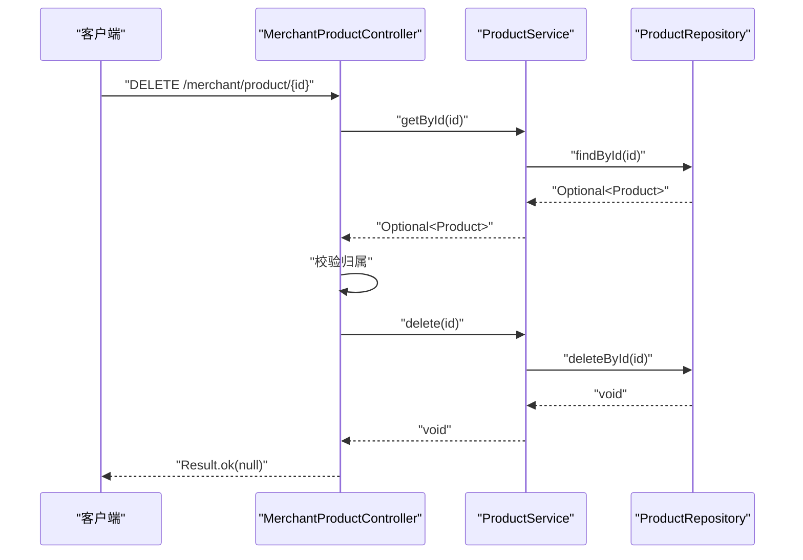
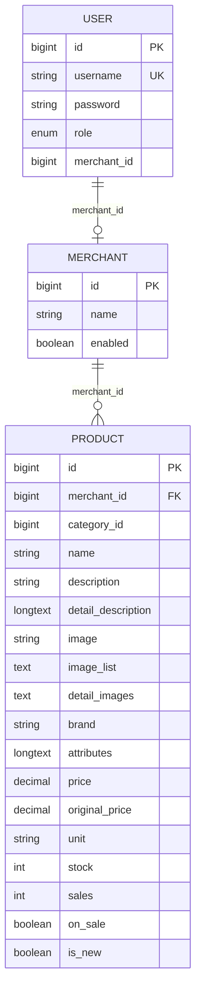
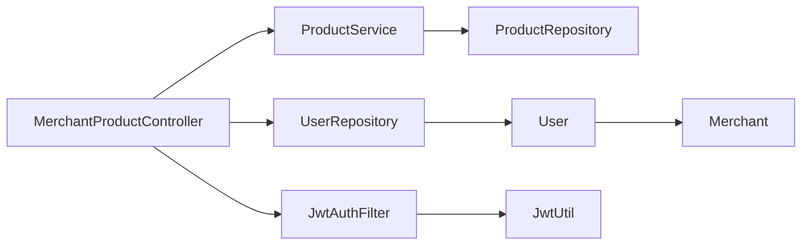

# 商户商品控制器

<cite>
**本文引用的文件**
- [MerchantProductController.java](file://backend/src/main/java/com/mall/controller/merchant/MerchantProductController.java)
- [ProductService.java](file://backend/src/main/java/com/mall/service/ProductService.java)
- [ProductRepository.java](file://backend/src/main/java/com/mall/repository/ProductRepository.java)
- [Product.java](file://backend/src/main/java/com/mall/entity/Product.java)
- [ProductCreateRequest.java](file://backend/src/main/java/com/mall/dto/ProductCreateRequest.java)
- [User.java](file://backend/src/main/java/com/mall/entity/User.java)
- [Merchant.java](file://backend/src/main/java/com/mall/entity/Merchant.java)
- [JwtAuthFilter.java](file://backend/src/main/java/com/mall/security/JwtAuthFilter.java)
- [JwtUtil.java](file://backend/src/main/java/com/mall/security/JwtUtil.java)
- [Result.java](file://backend/src/main/java/com/mall/dto/Result.java)
- [application.yml](file://backend/src/main/resources/application.yml)
- [Role.java](file://backend/src/main/java/com/mall/common/Role.java)
</cite>

## 目录
1. [简介](#简介)
2. [项目结构](#项目结构)
3. [核心组件](#核心组件)
4. [架构总览](#架构总览)
5. [详细组件分析](#详细组件分析)
6. [依赖关系分析](#依赖关系分析)
7. [性能考虑](#性能考虑)
8. [故障排查指南](#故障排查指南)
9. [结论](#结论)
10. [附录](#附录)

## 简介
本技术文档围绕商户商品控制器展开，系统性解析商品管理的核心功能实现，包括：
- 商品列表查询、详情获取、创建、更新、删除
- 商户权限验证机制（通过 Authentication 获取当前商户ID）
- 商品创建时的参数验证规则（名称、价格、库存等）
- 分类自动创建与管理机制（自定义分类名称的创建或查找）
- 商品图片处理逻辑（主图与详情图片的存储格式）
- 商品状态管理（在售/下架）、品牌信息、新品标识等特性
- 完整的 API 接口文档、请求响应示例与错误处理机制

## 项目结构
后端采用 Spring Boot + JPA 的分层架构，商户商品控制器位于 `controller/merchant` 包中，配合服务层、仓储层与实体模型协同工作。认证与授权通过 JWT 实现，商户权限通过用户实体中的 `merchantId` 字段进行绑定。

图表来源
- [MerchantProductController.java:1-180](file://backend/src/main/java/com/mall/controller/merchant/MerchantProductController.java#L1-L180)
- [ProductService.java:1-126](file://backend/src/main/java/com/mall/service/ProductService.java#L1-L126)
- [ProductRepository.java:1-125](file://backend/src/main/java/com/mall/repository/ProductRepository.java#L1-L125)
- [Product.java:1-101](file://backend/src/main/java/com/mall/entity/Product.java#L1-L101)
- [User.java:1-88](file://backend/src/main/java/com/mall/entity/User.java#L1-L88)
- [Merchant.java:1-56](file://backend/src/main/java/com/mall/entity/Merchant.java#L1-L56)
- [JwtAuthFilter.java:1-57](file://backend/src/main/java/com/mall/security/JwtAuthFilter.java#L1-L57)
- [JwtUtil.java:1-48](file://backend/src/main/java/com/mall/security/JwtUtil.java#L1-L48)
- [ProductCreateRequest.java:1-32](file://backend/src/main/java/com/mall/dto/ProductCreateRequest.java#L1-L32)
- [Result.java:1-24](file://backend/src/main/java/com/mall/dto/Result.java#L1-L24)

章节来源
- [MerchantProductController.java:1-180](file://backend/src/main/java/com/mall/controller/merchant/MerchantProductController.java#L1-L180)
- [application.yml:1-36](file://backend/src/main/resources/application.yml#L1-L36)

## 核心组件
- 控制器：负责接收 HTTP 请求、执行权限校验、调用服务层、组装统一响应。
- 服务层：封装业务逻辑，如分页查询、按商户查询、库存管理等。
- 仓储层：基于 JPA 提供商品数据访问，包含公开端与运营端查询方法。
- 实体模型：商品、用户、商户三者通过外键关联，支撑权限与业务约束。
- DTO：请求参数封装与统一响应封装。
- 安全模块：JWT 认证过滤器与工具，将用户身份注入到 Spring Security 上下文中。

章节来源
- [ProductService.java:1-126](file://backend/src/main/java/com/mall/service/ProductService.java#L1-L126)
- [ProductRepository.java:1-125](file://backend/src/main/java/com/mall/repository/ProductRepository.java#L1-L125)
- [Product.java:1-101](file://backend/src/main/java/com/mall/entity/Product.java#L1-L101)
- [User.java:1-88](file://backend/src/main/java/com/mall/entity/User.java#L1-L88)
- [Merchant.java:1-56](file://backend/src/main/java/com/mall/entity/Merchant.java#L1-L56)
- [JwtAuthFilter.java:1-57](file://backend/src/main/java/com/mall/security/JwtAuthFilter.java#L1-L57)
- [JwtUtil.java:1-48](file://backend/src/main/java/com/mall/security/JwtUtil.java#L1-L48)
- [ProductCreateRequest.java:1-32](file://backend/src/main/java/com/mall/dto/ProductCreateRequest.java#L1-L32)
- [Result.java:1-24](file://backend/src/main/java/com/mall/dto/Result.java#L1-L24)

## 架构总览
商户商品控制器遵循典型的 MVC + 分层架构，结合 Spring Security 的 JWT 认证，确保只有具备商户角色的用户才能访问相关接口，并通过用户实体中的 `merchantId` 绑定到具体商户。

图表来源
- [JwtAuthFilter.java:30-47](file://backend/src/main/java/com/mall/security/JwtAuthFilter.java#L30-L47)
- [JwtUtil.java:34-44](file://backend/src/main/java/com/mall/security/JwtUtil.java#L34-L44)
- [MerchantProductController.java:28-34](file://backend/src/main/java/com/mall/controller/merchant/MerchantProductController.java#L28-L34)
- [ProductService.java:84-92](file://backend/src/main/java/com/mall/service/ProductService.java#L84-L92)
- [ProductRepository.java:13-125](file://backend/src/main/java/com/mall/repository/ProductRepository.java#L13-L125)

## 详细组件分析

### 商户权限验证机制
- 认证流程：JWT 过滤器从请求头提取 Bearer 令牌，解析出用户ID与角色，构造 `UsernamePasswordAuthenticationToken` 并写入 `SecurityContext`。
- 当前商户ID获取：控制器通过 `Authentication.getPrincipal()` 获取用户ID，再从用户表读取 `merchantId`，若为空则抛出异常，确保仅商户账号可操作。
- 角色枚举：商户角色为 `MERCHANT`，与 JWT 中的角色声明对应。

图表来源
- [JwtAuthFilter.java:30-47](file://backend/src/main/java/com/mall/security/JwtAuthFilter.java#L30-L47)
- [JwtUtil.java:34-44](file://backend/src/main/java/com/mall/security/JwtUtil.java#L34-L44)
- [MerchantProductController.java:28-34](file://backend/src/main/java/com/mall/controller/merchant/MerchantProductController.java#L28-L34)
- [User.java:60-62](file://backend/src/main/java/com/mall/entity/User.java#L60-L62)
- [Role.java:3-7](file://backend/src/main/java/com/mall/common/Role.java#L3-L7)

章节来源
- [JwtAuthFilter.java:1-57](file://backend/src/main/java/com/mall/security/JwtAuthFilter.java#L1-L57)
- [JwtUtil.java:1-48](file://backend/src/main/java/com/mall/security/JwtUtil.java#L1-L48)
- [MerchantProductController.java:28-34](file://backend/src/main/java/com/mall/controller/merchant/MerchantProductController.java#L28-L34)
- [User.java:1-88](file://backend/src/main/java/com/mall/entity/User.java#L1-L88)
- [Role.java:1-8](file://backend/src/main/java/com/mall/common/Role.java#L1-L8)

### 商品列表查询
- 接口路径：GET `/merchant/product`
- 分页参数：page（默认0）、size（默认10）
- 权限校验：通过 `currentMerchantId(auth)` 获取商户ID，仅查询该商户的“在售”商品
- 返回值：统一响应包装的分页结果

图表来源
- [MerchantProductController.java:36-44](file://backend/src/main/java/com/mall/controller/merchant/MerchantProductController.java#L36-L44)
- [ProductService.java:52-55](file://backend/src/main/java/com/mall/service/ProductService.java#L52-L55)
- [ProductRepository.java:21-21](file://backend/src/main/java/com/mall/repository/ProductRepository.java#L21-L21)

章节来源
- [MerchantProductController.java:36-44](file://backend/src/main/java/com/mall/controller/merchant/MerchantProductController.java#L36-L44)
- [ProductService.java:52-55](file://backend/src/main/java/com/mall/service/ProductService.java#L52-L55)
- [ProductRepository.java:21-21](file://backend/src/main/java/com/mall/repository/ProductRepository.java#L21-L21)

### 商品详情获取
- 接口路径：GET `/merchant/product/{id}`
- 权限校验：先查询商品是否存在且属于当前商户，否则返回失败
- 返回值：统一响应包装的商品详情

图表来源
- [MerchantProductController.java:46-54](file://backend/src/main/java/com/mall/controller/merchant/MerchantProductController.java#L46-L54)
- [ProductService.java:22-25](file://backend/src/main/java/com/mall/service/ProductService.java#L22-L25)
- [ProductRepository.java:13-13](file://backend/src/main/java/com/mall/repository/ProductRepository.java#L13-L13)

章节来源
- [MerchantProductController.java:46-54](file://backend/src/main/java/com/mall/controller/merchant/MerchantProductController.java#L46-L54)
- [ProductService.java:22-25](file://backend/src/main/java/com/mall/service/ProductService.java#L22-L25)
- [ProductRepository.java:13-13](file://backend/src/main/java/com/mall/repository/ProductRepository.java#L13-L13)

### 商品创建
- 接口路径：POST `/merchant/product`
- 参数验证：
  - 名称非空
  - 价格必须大于0
  - 库存不能为负数
- 分类处理：
  - 若提供自定义分类名称且不为空：优先查找同名顶级分类；不存在则创建新分类并设置排序序号
- 图片处理：
  - 将前端传入的图片数组转换为逗号分隔的字符串，写入详情图片字段
- 默认值：
  - 单位默认“件”
  - 是否新品默认false
  - 是否在售默认true
- 返回值：统一响应包装的新建商品

图表来源
- [MerchantProductController.java:56-114](file://backend/src/main/java/com/mall/controller/merchant/MerchantProductController.java#L56-L114)
- [ProductCreateRequest.java:14-31](file://backend/src/main/java/com/mall/dto/ProductCreateRequest.java#L14-L31)
- [Product.java:64-82](file://backend/src/main/java/com/mall/entity/Product.java#L64-L82)

章节来源
- [MerchantProductController.java:56-114](file://backend/src/main/java/com/mall/controller/merchant/MerchantProductController.java#L56-L114)
- [ProductCreateRequest.java:1-32](file://backend/src/main/java/com/mall/dto/ProductCreateRequest.java#L1-L32)
- [Product.java:1-101](file://backend/src/main/java/com/mall/entity/Product.java#L1-L101)

### 商品更新
- 接口路径：PUT `/merchant/product/{id}`
- 权限校验：先查询商品是否存在且属于当前商户
- 分类处理与图片处理逻辑同创建流程
- 返回值：统一响应包装的更新后的商品

图表来源
- [MerchantProductController.java:116-167](file://backend/src/main/java/com/mall/controller/merchant/MerchantProductController.java#L116-L167)
- [ProductService.java:84-87](file://backend/src/main/java/com/mall/service/ProductService.java#L84-L87)
- [ProductRepository.java:13-13](file://backend/src/main/java/com/mall/repository/ProductRepository.java#L13-L13)

章节来源
- [MerchantProductController.java:116-167](file://backend/src/main/java/com/mall/controller/merchant/MerchantProductController.java#L116-L167)
- [ProductService.java:84-87](file://backend/src/main/java/com/mall/service/ProductService.java#L84-L87)
- [ProductRepository.java:13-13](file://backend/src/main/java/com/mall/repository/ProductRepository.java#L13-L13)

### 商品删除
- 接口路径：DELETE `/merchant/product/{id}`
- 权限校验：先查询商品是否存在且属于当前商户
- 执行删除并返回成功响应

图表来源
- [MerchantProductController.java:169-178](file://backend/src/main/java/com/mall/controller/merchant/MerchantProductController.java#L169-L178)
- [ProductService.java:89-92](file://backend/src/main/java/com/mall/service/ProductService.java#L89-L92)
- [ProductRepository.java:13-13](file://backend/src/main/java/com/mall/repository/ProductRepository.java#L13-L13)

章节来源
- [MerchantProductController.java:169-178](file://backend/src/main/java/com/mall/controller/merchant/MerchantProductController.java#L169-L178)
- [ProductService.java:89-92](file://backend/src/main/java/com/mall/service/ProductService.java#L89-L92)
- [ProductRepository.java:13-13](file://backend/src/main/java/com/mall/repository/ProductRepository.java#L13-L13)

### 数据模型与字段说明
- 商品实体包含主图、详情图列表、品牌、属性、价格、原价、单位、库存、销量、在售状态、新品标识等字段
- 用户实体包含角色与商户ID字段，用于商户权限绑定
- 商户实体包含启用状态，影响公开端商品查询

图表来源
- [Product.java:16-101](file://backend/src/main/java/com/mall/entity/Product.java#L16-L101)
- [User.java:17-88](file://backend/src/main/java/com/mall/entity/User.java#L17-L88)
- [Merchant.java:15-56](file://backend/src/main/java/com/mall/entity/Merchant.java#L15-L56)

章节来源
- [Product.java:1-101](file://backend/src/main/java/com/mall/entity/Product.java#L1-L101)
- [User.java:1-88](file://backend/src/main/java/com/mall/entity/User.java#L1-L88)
- [Merchant.java:1-56](file://backend/src/main/java/com/mall/entity/Merchant.java#L1-L56)

## 依赖关系分析
- 控制器依赖服务层与仓储层，服务层依赖仓储层
- 控制器通过用户仓储获取当前商户ID，用户实体与商户实体形成一对多关系
- 安全过滤器与工具负责认证，控制器通过 Spring Security 的 Authentication 获取用户ID

图表来源
- [MerchantProductController.java:24-26](file://backend/src/main/java/com/mall/controller/merchant/MerchantProductController.java#L24-L26)
- [ProductService.java:20-20](file://backend/src/main/java/com/mall/service/ProductService.java#L20-L20)
- [ProductRepository.java:13-13](file://backend/src/main/java/com/mall/repository/ProductRepository.java#L13-L13)
- [User.java:60-62](file://backend/src/main/java/com/mall/entity/User.java#L60-L62)
- [Merchant.java:37-37](file://backend/src/main/java/com/mall/entity/Merchant.java#L37-L37)
- [JwtAuthFilter.java:30-47](file://backend/src/main/java/com/mall/security/JwtAuthFilter.java#L30-L47)
- [JwtUtil.java:34-44](file://backend/src/main/java/com/mall/security/JwtUtil.java#L34-L44)

章节来源
- [MerchantProductController.java:1-180](file://backend/src/main/java/com/mall/controller/merchant/MerchantProductController.java#L1-L180)
- [ProductService.java:1-126](file://backend/src/main/java/com/mall/service/ProductService.java#L1-L126)
- [ProductRepository.java:1-125](file://backend/src/main/java/com/mall/repository/ProductRepository.java#L1-L125)
- [User.java:1-88](file://backend/src/main/java/com/mall/entity/User.java#L1-L88)
- [Merchant.java:1-56](file://backend/src/main/java/com/mall/entity/Merchant.java#L1-L56)
- [JwtAuthFilter.java:1-57](file://backend/src/main/java/com/mall/security/JwtAuthFilter.java#L1-L57)
- [JwtUtil.java:1-48](file://backend/src/main/java/com/mall/security/JwtUtil.java#L1-L48)

## 性能考虑
- 分页查询：列表与库存查询均使用分页参数，避免一次性加载大量数据
- 条件查询：按商户ID、分类ID、关键字、库存状态等条件组合查询，减少不必要的扫描
- 图片存储：详情图片以逗号分隔的字符串存储，便于快速序列化/反序列化，但需注意超长文本的索引与查询成本
- 在售过滤：公开端与运营端查询均包含在售状态过滤，降低无效数据的传输与渲染

## 故障排查指南
- 非商户账号访问：当用户未绑定商户ID时，控制器会直接抛出异常，返回失败响应
- 商品不存在或不属于当前商户：查询详情与更新/删除时会进行归属校验，失败返回相应错误
- 参数校验失败：创建/更新时对名称、价格、库存进行严格校验，不符合要求返回失败
- JWT 令牌无效：过滤器解析失败时会忽略认证继续请求，导致后续权限校验失败

章节来源
- [MerchantProductController.java:28-34](file://backend/src/main/java/com/mall/controller/merchant/MerchantProductController.java#L28-L34)
- [MerchantProductController.java:46-54](file://backend/src/main/java/com/mall/controller/merchant/MerchantProductController.java#L46-L54)
- [MerchantProductController.java:116-167](file://backend/src/main/java/com/mall/controller/merchant/MerchantProductController.java#L116-L167)
- [MerchantProductController.java:169-178](file://backend/src/main/java/com/mall/controller/merchant/MerchantProductController.java#L169-L178)
- [JwtAuthFilter.java:42-44](file://backend/src/main/java/com/mall/security/JwtAuthFilter.java#L42-L44)

## 结论
商户商品控制器通过清晰的分层设计与严格的权限校验，实现了商品全生命周期管理。其参数验证、分类自动创建、图片处理与状态管理等特性，既保证了业务正确性，也为后续扩展提供了良好基础。建议在生产环境中进一步完善日志记录、缓存策略与图片资源管理。

## 附录

### API 接口文档

- 列表查询
  - 方法：GET
  - 路径：`/merchant/product`
  - 查询参数：
    - page：页码，默认0
    - size：每页大小，默认10
  - 成功响应：统一响应，data 为分页商品列表
  - 失败响应：统一响应，message 为错误信息

- 商品详情
  - 方法：GET
  - 路径：`/merchant/product/{id}`
  - 路径参数：id（商品ID）
  - 成功响应：统一响应，data 为商品详情
  - 失败响应：统一响应，message 为错误信息

- 商品创建
  - 方法：POST
  - 路径：`/merchant/product`
  - 请求体：ProductCreateRequest
  - 成功响应：统一响应，data 为新建商品
  - 失败响应：统一响应，message 为错误信息

- 商品更新
  - 方法：PUT
  - 路径：`/merchant/product/{id}`
  - 路径参数：id（商品ID）
  - 请求体：ProductCreateRequest
  - 成功响应：统一响应，data 为更新后的商品
  - 失败响应：统一响应，message 为错误信息

- 商品删除
  - 方法：DELETE
  - 路径：`/merchant/product/{id}`
  - 路径参数：id（商品ID）
  - 成功响应：统一响应，data 为null
  - 失败响应：统一响应，message 为错误信息

章节来源
- [MerchantProductController.java:36-178](file://backend/src/main/java/com/mall/controller/merchant/MerchantProductController.java#L36-L178)
- [ProductCreateRequest.java:1-32](file://backend/src/main/java/com/mall/dto/ProductCreateRequest.java#L1-L32)
- [Result.java:10-23](file://backend/src/main/java/com/mall/dto/Result.java#L10-L23)

### 请求与响应示例
- 统一响应结构
  - code：状态码（200 表示成功，400 表示业务错误）
  - message：消息
  - data：数据内容

- 创建商品请求示例（简化）
  - name：商品名称
  - description：商品描述
  - detailDescription：详细描述
  - images：图片URL数组（将被转换为逗号分隔字符串）
  - brand：品牌
  - attributes：商品参数/规格
  - unit：价格单位
  - categoryId：分类ID（可选）
  - categoryName：自定义分类名称（可选）
  - price：现价
  - originalPrice：原价（可选）
  - stock：库存
  - image：主图URL
  - isNew：是否新品
  - onSale：是否在售

- 成功响应示例
  - code：200
  - message："success"
  - data：商品对象

- 失败响应示例
  - code：400
  - message："商品不存在" 或 "商品名称不能为空" 等
  - data：null

章节来源
- [Result.java:10-23](file://backend/src/main/java/com/mall/dto/Result.java#L10-L23)
- [ProductCreateRequest.java:14-31](file://backend/src/main/java/com/mall/dto/ProductCreateRequest.java#L14-L31)

### 错误处理机制
- 参数校验：名称、价格、库存的必填与范围校验
- 权限校验：非商户账号、商品归属不符
- 业务异常：商品不存在、非法操作等
- 统一响应：所有接口返回统一的 Result 结构，便于前端处理

章节来源
- [MerchantProductController.java:56-114](file://backend/src/main/java/com/mall/controller/merchant/MerchantProductController.java#L56-L114)
- [MerchantProductController.java:116-178](file://backend/src/main/java/com/mall/controller/merchant/MerchantProductController.java#L116-L178)
- [Result.java:10-23](file://backend/src/main/java/com/mall/dto/Result.java#L10-L23)