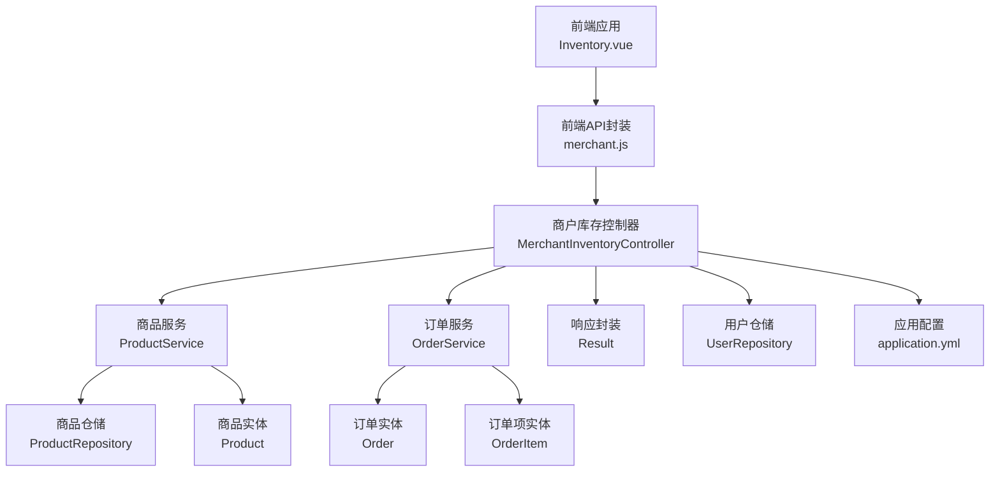
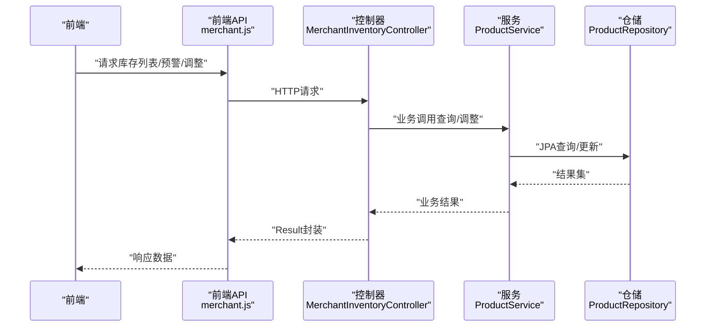
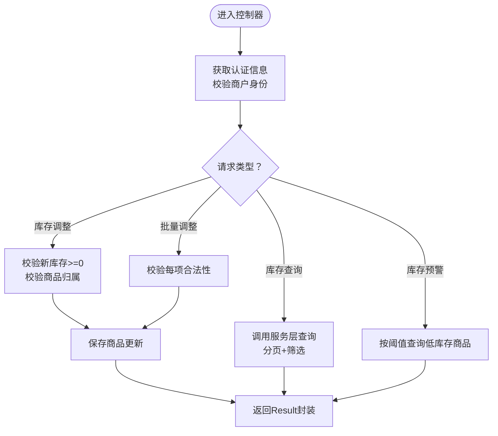
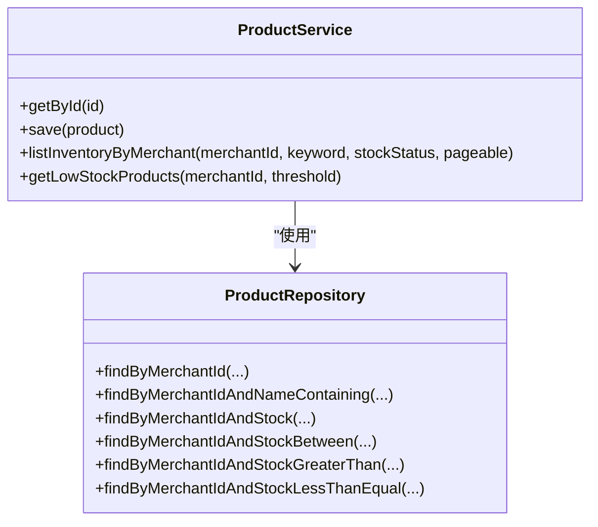
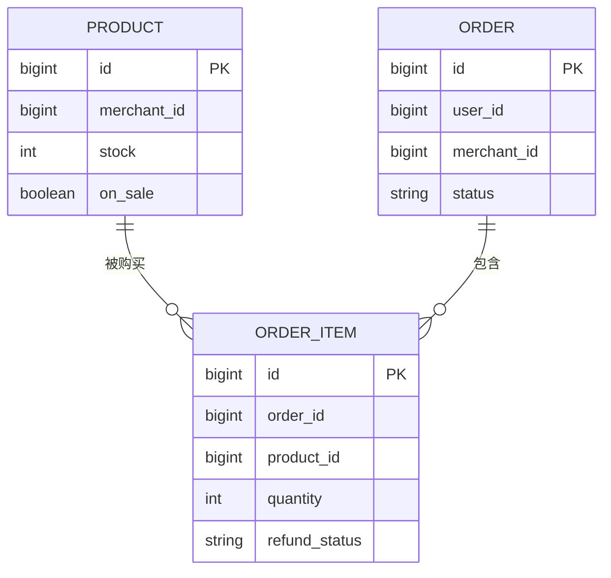
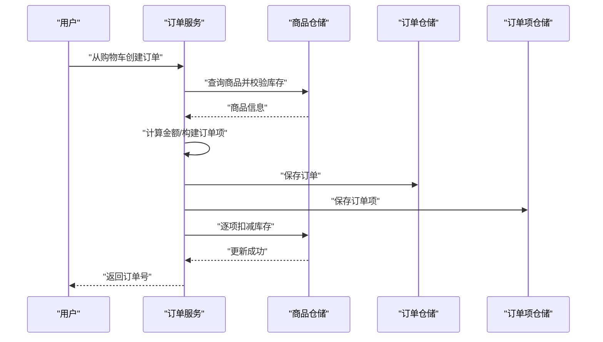
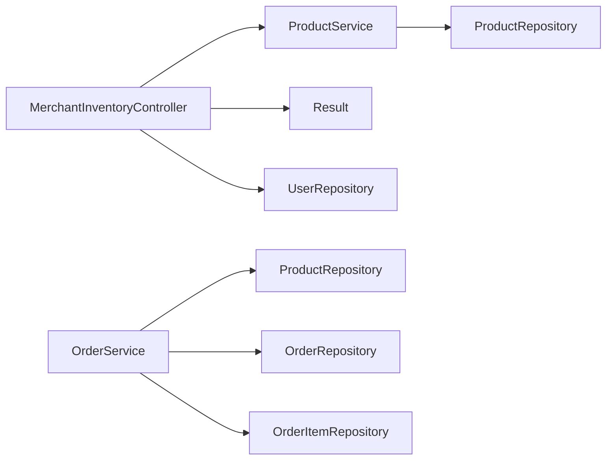

# 商户库存控制器

<cite>
**本文引用的文件**
- [MerchantInventoryController.java](file://backend/src/main/java/com/mall/controller/merchant/MerchantInventoryController.java)
- [ProductService.java](file://backend/src/main/java/com/mall/service/ProductService.java)
- [OrderService.java](file://backend/src/main/java/com/mall/service/OrderService.java)
- [ProductRepository.java](file://backend/src/main/java/com/mall/repository/ProductRepository.java)
- [Product.java](file://backend/src/main/java/com/mall/entity/Product.java)
- [Order.java](file://backend/src/main/java/com/mall/entity/Order.java)
- [OrderItem.java](file://backend/src/main/java/com/mall/entity/OrderItem.java)
- [application.yml](file://backend/src/main/resources/application.yml)
- [merchant.js](file://frontend/src/api/merchant.js)
- [Inventory.vue](file://frontend/src/views/merchant/Inventory.vue)
- [Result.java](file://backend/src/main/java/com/mall/dto/Result.java)
- [UserRepository.java](file://backend/src/main/java/com/mall/repository/UserRepository.java)
</cite>

## 目录
1. [简介](#简介)
2. [项目结构](#项目结构)
3. [核心组件](#核心组件)
4. [架构总览](#架构总览)
5. [详细组件分析](#详细组件分析)
6. [依赖关系分析](#依赖关系分析)
7. [性能考量](#性能考量)
8. [故障排查指南](#故障排查指南)
9. [结论](#结论)
10. [附录](#附录)

## 简介
本技术文档围绕“商户库存控制器”展开，系统性解析库存管理的核心功能与实现细节，包括：
- 库存查询与筛选（关键词、库存状态）
- 库存调整与批量调整
- 库存预警（低库存、缺货）
- 实时性保障机制
- 日志与审计（基于实体时间戳字段）
- 库存与销售订单的联动（下单扣减、取消回补）
- 库存统计与报表（概览卡片、低库存/缺货统计）
- 安全机制（防超卖、一致性保障）
- 完整API接口文档、业务流程示例与最佳实践

## 项目结构
后端采用Spring Boot + JPA分层架构，前端Vue集成Element UI，通过统一的REST接口进行交互。

图表来源
- [MerchantInventoryController.java:1-118](file://backend/src/main/java/com/mall/controller/merchant/MerchantInventoryController.java#L1-L118)
- [ProductService.java:1-126](file://backend/src/main/java/com/mall/service/ProductService.java#L1-L126)
- [OrderService.java:1-280](file://backend/src/main/java/com/mall/service/OrderService.java#L1-L280)
- [ProductRepository.java:1-125](file://backend/src/main/java/com/mall/repository/ProductRepository.java#L1-L125)
- [Product.java:1-101](file://backend/src/main/java/com/mall/entity/Product.java#L1-L101)
- [Order.java:1-83](file://backend/src/main/java/com/mall/entity/Order.java#L1-L83)
- [OrderItem.java:1-73](file://backend/src/main/java/com/mall/entity/OrderItem.java#L1-L73)
- [Result.java:1-24](file://backend/src/main/java/com/mall/dto/Result.java#L1-L24)
- [UserRepository.java:1-20](file://backend/src/main/java/com/mall/repository/UserRepository.java#L1-L20)
- [application.yml:1-36](file://backend/src/main/resources/application.yml#L1-L36)

章节来源
- [MerchantInventoryController.java:1-118](file://backend/src/main/java/com/mall/controller/merchant/MerchantInventoryController.java#L1-L118)
- [application.yml:1-36](file://backend/src/main/resources/application.yml#L1-L36)

## 核心组件
- 控制器层：商户库存控制器，提供库存查询、库存调整、批量调整、库存预警等接口。
- 服务层：商品服务，封装库存查询、低库存商品检索等业务逻辑。
- 仓储层：商品仓储，提供库存相关的分页查询与条件过滤。
- 实体层：商品、订单、订单项实体，承载库存字段与状态字段。
- 响应封装：Result统一返回结构，便于前后端约定。
- 前端集成：Inventory页面与merchant.js API封装，完成库存列表、预警、调整与批量调整的交互。

章节来源
- [MerchantInventoryController.java:1-118](file://backend/src/main/java/com/mall/controller/merchant/MerchantInventoryController.java#L1-L118)
- [ProductService.java:1-126](file://backend/src/main/java/com/mall/service/ProductService.java#L1-L126)
- [ProductRepository.java:1-125](file://backend/src/main/java/com/mall/repository/ProductRepository.java#L1-L125)
- [Product.java:1-101](file://backend/src/main/java/com/mall/entity/Product.java#L1-L101)
- [OrderService.java:1-280](file://backend/src/main/java/com/mall/service/OrderService.java#L1-L280)
- [Order.java:1-83](file://backend/src/main/java/com/mall/entity/Order.java#L1-L83)
- [OrderItem.java:1-73](file://backend/src/main/java/com/mall/entity/OrderItem.java#L1-L73)
- [Result.java:1-24](file://backend/src/main/java/com/mall/dto/Result.java#L1-L24)
- [merchant.js:1-135](file://frontend/src/api/merchant.js#L1-L135)
- [Inventory.vue:1-455](file://frontend/src/views/merchant/Inventory.vue#L1-L455)

## 架构总览
商户库存控制器通过控制器接收请求，调用服务层执行业务逻辑，服务层访问仓储层完成数据库查询与更新。库存调整与订单扣减均在事务内执行，确保一致性。

图表来源
- [MerchantInventoryController.java:1-118](file://backend/src/main/java/com/mall/controller/merchant/MerchantInventoryController.java#L1-L118)
- [ProductService.java:1-126](file://backend/src/main/java/com/mall/service/ProductService.java#L1-L126)
- [ProductRepository.java:1-125](file://backend/src/main/java/com/mall/repository/ProductRepository.java#L1-L125)
- [merchant.js:1-135](file://frontend/src/api/merchant.js#L1-L135)

## 详细组件分析

### 控制器：商户库存控制器
- 身份校验与权限控制：通过Authentication获取当前用户ID，再从UserRepository读取用户信息，校验其merchantId是否为空，确保操作者为商户运营账号。
- 库存查询：支持分页、关键词过滤、库存状态筛选（缺货、低库存、正常），内部委托ProductService完成。
- 库存调整：单个商品库存更新，校验新库存非负，校验商品归属商户，保存后返回调整前后对比。
- 批量调整：校验每个商品的新库存合法性与归属，随后逐个更新。
- 库存预警：根据阈值查询低库存商品列表。

图表来源
- [MerchantInventoryController.java:25-118](file://backend/src/main/java/com/mall/controller/merchant/MerchantInventoryController.java#L25-L118)

章节来源
- [MerchantInventoryController.java:1-118](file://backend/src/main/java/com/mall/controller/merchant/MerchantInventoryController.java#L1-L118)
- [UserRepository.java:1-20](file://backend/src/main/java/com/mall/repository/UserRepository.java#L1-L20)

### 服务：商品服务
- 列表查询：按商户维度查询商品，支持关键词与库存状态组合筛选。
- 低库存查询：按阈值查询库存小于等于阈值的商品。

图表来源
- [ProductService.java:94-124](file://backend/src/main/java/com/mall/service/ProductService.java#L94-L124)
- [ProductRepository.java:107-124](file://backend/src/main/java/com/mall/repository/ProductRepository.java#L107-L124)

章节来源
- [ProductService.java:1-126](file://backend/src/main/java/com/mall/service/ProductService.java#L1-L126)
- [ProductRepository.java:1-125](file://backend/src/main/java/com/mall/repository/ProductRepository.java#L1-L125)

### 仓储：商品仓储
- 提供按商户维度的库存相关查询方法，包括：
  - 按名称关键词与库存范围组合查询
  - 按阈值查询低库存商品
- 用于支撑控制器的库存查询与预警功能。

章节来源
- [ProductRepository.java:107-124](file://backend/src/main/java/com/mall/repository/ProductRepository.java#L107-L124)

### 实体模型：商品、订单、订单项
- 商品实体包含库存字段与上下架状态，用于库存管理与销售排行等场景。
- 订单与订单项实体包含退款状态字段，用于售后与库存回补。

图表来源
- [Product.java:22-70](file://backend/src/main/java/com/mall/entity/Product.java#L22-L70)
- [Order.java:25-33](file://backend/src/main/java/com/mall/entity/Order.java#L25-L33)
- [OrderItem.java:22-38](file://backend/src/main/java/com/mall/entity/OrderItem.java#L22-L38)

章节来源
- [Product.java:1-101](file://backend/src/main/java/com/mall/entity/Product.java#L1-L101)
- [Order.java:1-83](file://backend/src/main/java/com/mall/entity/Order.java#L1-L83)
- [OrderItem.java:1-73](file://backend/src/main/java/com/mall/entity/OrderItem.java#L1-L73)

### 订单服务：库存联动与防超卖
- 下单流程：从购物车筛选属于当前商户的商品，逐项检查库存是否充足，不足则抛错；通过事务保存订单与订单项，并逐项扣减商品库存。
- 取消订单：在收货前取消，将订单项数量回补至商品库存。
- 退款流程：支持单项/多项退款，部分退款时拆分订单项，不影响其他项状态。

图表来源
- [OrderService.java:34-88](file://backend/src/main/java/com/mall/service/OrderService.java#L34-L88)

章节来源
- [OrderService.java:1-280](file://backend/src/main/java/com/mall/service/OrderService.java#L1-L280)

### 前端集成：库存管理页面
- 列表展示：分页加载库存列表，支持关键词与库存状态筛选。
- 统计概览：低库存、缺货、总商品数、总库存等卡片式统计。
- 单个调整：弹窗输入新库存，提交后刷新统计。
- 批量调整：勾选目标商品，选择调整方式（固定值/加减），确认后批量更新。
- 预警查询：按阈值获取低库存商品列表。

章节来源
- [merchant.js:70-88](file://frontend/src/api/merchant.js#L70-L88)
- [Inventory.vue:1-455](file://frontend/src/views/merchant/Inventory.vue#L1-L455)

## 依赖关系分析
- 控制器依赖服务层，服务层依赖仓储层，形成清晰的分层依赖。
- 控制器与服务层之间通过Result封装返回，前端通过merchant.js统一调用。
- 订单服务与商品仓储存在直接耦合，用于下单时的库存扣减与取消时的回补。

图表来源
- [MerchantInventoryController.java:1-118](file://backend/src/main/java/com/mall/controller/merchant/MerchantInventoryController.java#L1-L118)
- [ProductService.java:1-126](file://backend/src/main/java/com/mall/service/ProductService.java#L1-L126)
- [ProductRepository.java:1-125](file://backend/src/main/java/com/mall/repository/ProductRepository.java#L1-L125)
- [OrderService.java:1-280](file://backend/src/main/java/com/mall/service/OrderService.java#L1-L280)

章节来源
- [MerchantInventoryController.java:1-118](file://backend/src/main/java/com/mall/controller/merchant/MerchantInventoryController.java#L1-L118)
- [ProductService.java:1-126](file://backend/src/main/java/com/mall/service/ProductService.java#L1-L126)
- [OrderService.java:1-280](file://backend/src/main/java/com/mall/service/OrderService.java#L1-L280)

## 性能考量
- 分页查询：控制器与服务层均支持分页参数，避免一次性加载过多数据。
- 条件筛选：仓储层提供多条件查询方法，减少不必要的数据传输。
- 事务边界：库存调整与订单扣减均在事务内执行，保证一致性，但需注意长事务带来的锁竞争。
- 建议：
  - 对高频查询建立合适的索引（如merchant_id、stock、name等）。
  - 批量调整时建议限制单次更新数量，避免长时间占用数据库连接。
  - 使用异步任务处理大批量库存导入/导出，避免阻塞主线程。

## 故障排查指南
- “非运营账号”错误：确认登录用户是否绑定merchantId。
- “商品不存在或无权限操作”：检查商品是否属于当前商户，或是否存在非法修改。
- “库存数量必须大于等于0”：前端已做校验，若仍出现需检查请求体格式。
- “库存不足”异常：下单时若提示库存不足，请检查商品真实库存与购物车数量。
- “订单状态不可取消/退货”：仅在特定状态下允许取消与退款，需遵循状态机规则。

章节来源
- [MerchantInventoryController.java:25-118](file://backend/src/main/java/com/mall/controller/merchant/MerchantInventoryController.java#L25-L118)
- [OrderService.java:124-161](file://backend/src/main/java/com/mall/service/OrderService.java#L124-L161)

## 结论
商户库存控制器提供了完善的库存查询、调整、预警与统计能力，并通过订单服务实现了下单扣减与取消回补的闭环。结合事务与实体时间戳，系统在一致性与审计方面具备基础保障。建议后续引入更细粒度的日志审计、库存变更流水表以及异步批量处理，进一步提升可观测性与性能。

## 附录

### API 接口文档

- 获取库存列表
  - 方法：GET
  - 路径：/merchant/inventory
  - 参数：
    - page：页码（默认0）
    - size：每页大小（默认10）
    - keyword：关键词（可选）
    - stockStatus：库存状态（0=缺货，1=低库存，2=正常，可选）
  - 返回：Result封装的分页数据

- 调整单个商品库存
  - 方法：PUT
  - 路径：/merchant/inventory/{productId}/stock
  - 请求体：{"stock": 数值}
  - 返回：Result封装的调整详情（旧库存、新库存、变化量）

- 批量调整库存
  - 方法：PUT
  - 路径：/merchant/inventory/batch-stock
  - 请求体：{"productId": "newStock", ...}
  - 返回：Result封装的成功消息

- 获取库存预警（低库存）
  - 方法：GET
  - 路径：/merchant/inventory/warnings
  - 参数：threshold：阈值（默认10）
  - 返回：Result封装的低库存商品列表

章节来源
- [MerchantInventoryController.java:33-118](file://backend/src/main/java/com/mall/controller/merchant/MerchantInventoryController.java#L33-L118)
- [merchant.js:70-88](file://frontend/src/api/merchant.js#L70-L88)

### 业务流程示例

- 库存查询与筛选
  - 前端传入关键词与库存状态，控制器调用服务层，服务层通过仓储层构造查询条件，返回分页结果。
- 库存调整
  - 前端提交新库存，控制器校验与权限，保存后返回调整详情。
- 批量调整
  - 前端提交多个商品ID与新库存，控制器逐一校验并保存。
- 库存预警
  - 前端传入阈值，控制器查询低库存商品列表。
- 下单扣减库存
  - 订单服务从购物车筛选商户商品，逐项校验库存，保存订单与订单项并扣减库存。
- 取消订单回补
  - 订单服务遍历订单项，将数量回补至商品库存。

章节来源
- [MerchantInventoryController.java:33-118](file://backend/src/main/java/com/mall/controller/merchant/MerchantInventoryController.java#L33-L118)
- [ProductService.java:94-124](file://backend/src/main/java/com/mall/service/ProductService.java#L94-L124)
- [OrderService.java:34-88](file://backend/src/main/java/com/mall/service/OrderService.java#L34-L88)

### 最佳实践
- 在控制器层严格校验请求参数与权限，避免越权与非法数据。
- 将库存调整与订单扣减置于事务中，确保原子性。
- 对高频查询建立索引，优化分页查询性能。
- 使用阈值参数化配置库存预警，避免硬编码。
- 引入日志与审计追踪（如新增库存变更流水表），便于问题定位与合规审计。
- 批量操作建议限制单次处理数量，并提供进度反馈。