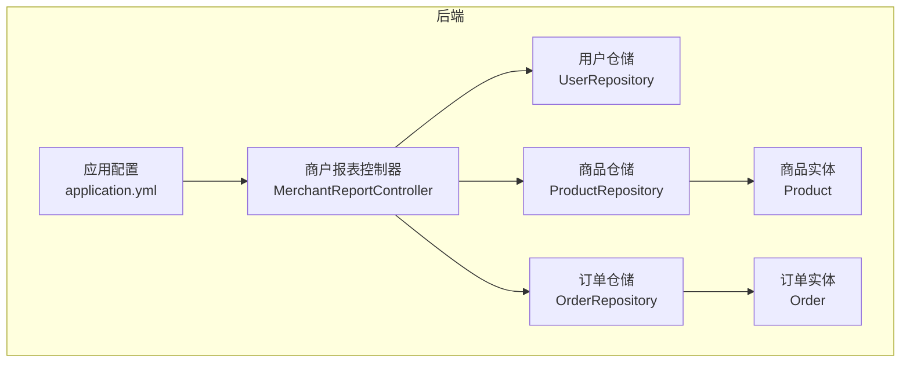
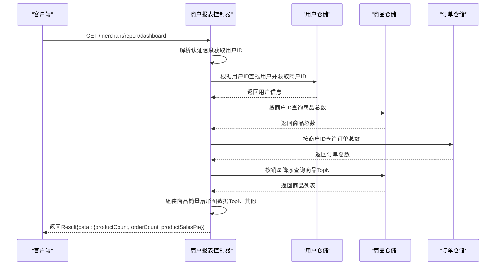
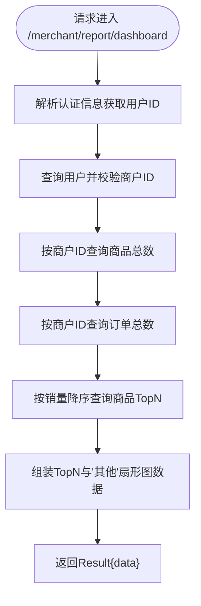
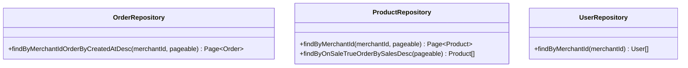
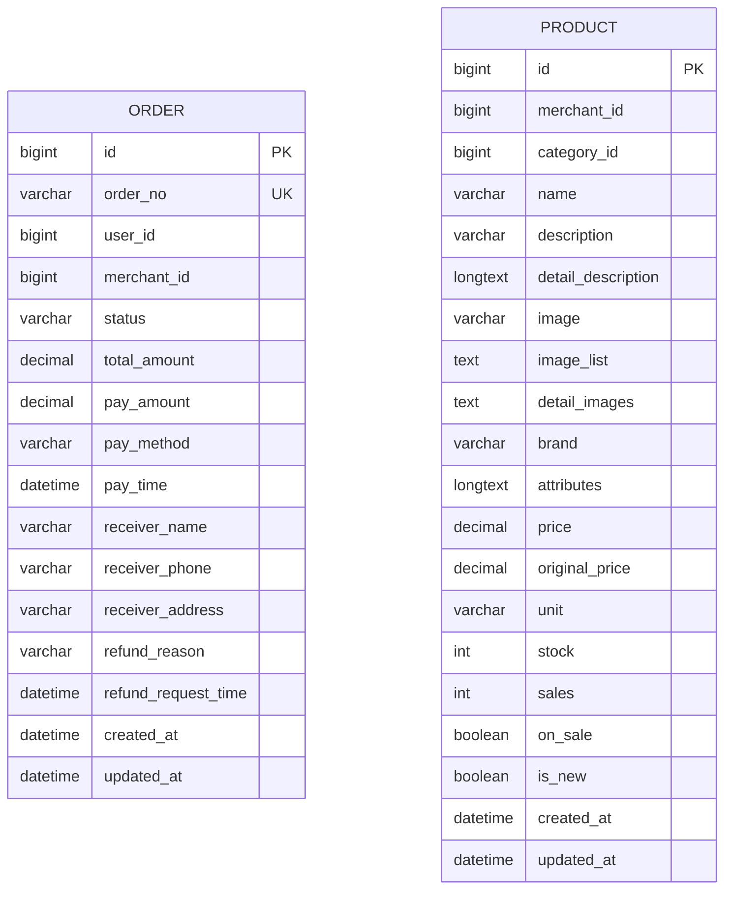
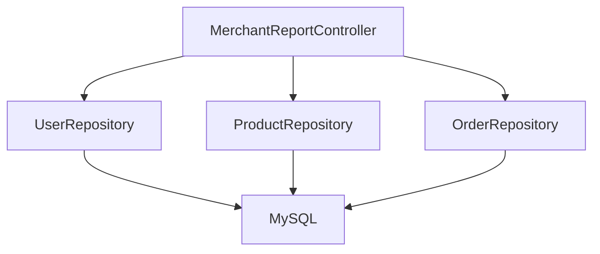

# 商户报表控制器

<cite>
**本文档引用的文件**
- [MerchantReportController.java](file://backend/src/main/java/com/mall/controller/merchant/MerchantReportController.java)
- [OrderRepository.java](file://backend/src/main/java/com/mall/repository/OrderRepository.java)
- [ProductRepository.java](file://backend/src/main/java/com/mall/repository/ProductRepository.java)
- [UserRepository.java](file://backend/src/main/java/com/mall/repository/UserRepository.java)
- [Order.java](file://backend/src/main/java/com/mall/entity/Order.java)
- [Product.java](file://backend/src/main/java/com/mall/entity/Product.java)
- [application.yml](file://backend/src/main/resources/application.yml)
</cite>

## 目录
1. [简介](#简介)
2. [项目结构](#项目结构)
3. [核心组件](#核心组件)
4. [架构概览](#架构概览)
5. [详细组件分析](#详细组件分析)
6. [依赖分析](#依赖分析)
7. [性能考虑](#性能考虑)
8. [故障排除指南](#故障排除指南)
9. [结论](#结论)
10. [附录](#附录)

## 简介
本文件为商户报表控制器的技术文档，聚焦于销售报表与统计数据的核心功能实现。当前代码库中，商户报表控制器提供基础的看板统计与商品销量分布数据，涵盖商品数量、订单数量以及商品销量扇形图（Top N 合并“其他”）等关键指标。该控制器通过认证上下文解析当前登录用户的所属商户 ID，并基于仓储层查询完成数据聚合。

需要特别说明的是：当前仓库中尚未包含完整的销售统计（按日/周/月/年聚合）、商品销售排行（销量/销售额/利润排序）、订单量统计（总订单数/已完成/取消等）、客户购买行为分析（复购率/客单价/偏好）、库存报表（周转率/滞销识别/库存价值）、财务报表（收入明细/成本分析/利润）以及报表导出与可视化图表集成等功能的具体实现。本文档在现有代码基础上进行深入分析，并对缺失功能提出可扩展的设计建议与实现路径。

## 项目结构
后端采用 Spring Boot + JPA 的分层架构，商户报表控制器位于 `controller/merchant` 包下，依赖于仓储层（Repository）与实体模型（Entity）。应用配置位于 `resources/application.yml`，数据库连接与 JPA 配置在此文件中定义。

**图表来源**
- [MerchantReportController.java:1-81](file://backend/src/main/java/com/mall/controller/merchant/MerchantReportController.java#L1-L81)
- [OrderRepository.java:1-28](file://backend/src/main/java/com/mall/repository/OrderRepository.java#L1-L28)
- [ProductRepository.java:1-125](file://backend/src/main/java/com/mall/repository/ProductRepository.java#L1-L125)
- [UserRepository.java:1-20](file://backend/src/main/java/com/mall/repository/UserRepository.java#L1-L20)
- [Order.java:1-83](file://backend/src/main/java/com/mall/entity/Order.java#L1-L83)
- [Product.java:1-101](file://backend/src/main/java/com/mall/entity/Product.java#L1-L101)
- [application.yml:1-36](file://backend/src/main/resources/application.yml#L1-L36)

**章节来源**
- [MerchantReportController.java:1-81](file://backend/src/main/java/com/mall/controller/merchant/MerchantReportController.java#L1-L81)
- [application.yml:1-36](file://backend/src/main/resources/application.yml#L1-L36)

## 核心组件
- 商户报表控制器（MerchantReportController）
  - 负责解析当前登录用户的商户 ID，并返回看板数据与商品销量分布。
  - 提供 `/merchant/report/dashboard` 接口，返回商品总数、订单总数与商品销量扇形图数据。
- 仓储层
  - OrderRepository：提供按商户 ID 查询订单分页列表的能力。
  - ProductRepository：提供按商户 ID 查询商品分页列表、按销量排序查询等能力。
  - UserRepository：提供按商户 ID 查询用户列表的能力。
- 实体模型
  - Order：包含订单号、用户 ID、商户 ID、状态、金额、支付方式、创建/更新时间等字段。
  - Product：包含商品名称、价格、库存、销量、是否上架等字段。

**章节来源**
- [MerchantReportController.java:23-81](file://backend/src/main/java/com/mall/controller/merchant/MerchantReportController.java#L23-L81)
- [OrderRepository.java:13-27](file://backend/src/main/java/com/mall/repository/OrderRepository.java#L13-L27)
- [ProductRepository.java:12-124](file://backend/src/main/java/com/mall/repository/ProductRepository.java#L12-L124)
- [UserRepository.java:10-19](file://backend/src/main/java/com/mall/repository/UserRepository.java#L10-L19)
- [Order.java:16-82](file://backend/src/main/java/com/mall/entity/Order.java#L16-L82)
- [Product.java:16-100](file://backend/src/main/java/com/mall/entity/Product.java#L16-L100)

## 架构概览
商户报表控制器通过 Spring MVC 暴露 REST 接口，控制器依赖仓储层完成数据查询与聚合，最终以 Result 封装响应返回前端。认证信息来自 Spring Security 的 Authentication 对象，控制器从中提取当前用户 ID 并关联到商户 ID。

**图表来源**
- [MerchantReportController.java:42-79](file://backend/src/main/java/com/mall/controller/merchant/MerchantReportController.java#L42-L79)
- [UserRepository.java:18](file://backend/src/main/java/com/mall/repository/UserRepository.java#L18)
- [ProductRepository.java:15-25](file://backend/src/main/java/com/mall/repository/ProductRepository.java#L15-L25)
- [OrderRepository.java:19](file://backend/src/main/java/com/mall/repository/OrderRepository.java#L19)

**章节来源**
- [MerchantReportController.java:33-79](file://backend/src/main/java/com/mall/controller/merchant/MerchantReportController.java#L33-L79)

## 详细组件分析

### 商户报表控制器（MerchantReportController）
- 职责
  - 解析当前登录用户的商户 ID。
  - 统计商品数量与订单数量。
  - 生成商品销量扇形图数据（默认 Top10，其余合并为“其他”）。
- 关键流程
  - 认证解析：从 Authentication 中获取用户 ID，查询用户并校验存在商户 ID。
  - 商品统计：调用商品仓储按商户 ID 查询总数。
  - 订单统计：调用订单仓储按商户 ID 查询总数。
  - 销量分布：按销量降序查询商品，组装前 N 名与“其他”项。
- 数据结构
  - 返回数据包含：商品总数、订单总数、商品销量扇形图数组（每项含名称与值）。

**图表来源**
- [MerchantReportController.java:42-79](file://backend/src/main/java/com/mall/controller/merchant/MerchantReportController.java#L42-L79)

**章节来源**
- [MerchantReportController.java:27-79](file://backend/src/main/java/com/mall/controller/merchant/MerchantReportController.java#L27-L79)

### 仓储层（Repository）
- OrderRepository
  - 提供按商户 ID 查询订单分页列表的方法，用于统计订单数量。
- ProductRepository
  - 提供按商户 ID 查询商品分页列表的方法。
  - 提供按销量降序查询商品列表的方法，用于生成销量分布。
- UserRepository
  - 提供按商户 ID 查询用户列表的方法，用于解析当前商户。

**图表来源**
- [OrderRepository.java:19](file://backend/src/main/java/com/mall/repository/OrderRepository.java#L19)
- [ProductRepository.java:15-25](file://backend/src/main/java/com/mall/repository/ProductRepository.java#L15-L25)
- [UserRepository.java:18](file://backend/src/main/java/com/mall/repository/UserRepository.java#L18)

**章节来源**
- [OrderRepository.java:13-27](file://backend/src/main/java/com/mall/repository/OrderRepository.java#L13-L27)
- [ProductRepository.java:12-124](file://backend/src/main/java/com/mall/repository/ProductRepository.java#L12-L124)
- [UserRepository.java:10-19](file://backend/src/main/java/com/mall/repository/UserRepository.java#L10-L19)

### 实体模型（Entity）
- Order
  - 字段：订单号、用户 ID、商户 ID、状态、总金额、支付金额、支付方式、支付时间、收货人信息、退款相关信息、创建/更新时间。
  - 用途：统计订单数量与金额（当前控制器未直接使用金额字段，后续可扩展）。
- Product
  - 字段：名称、价格、原价、库存、销量、是否上架、品牌、属性、图片、创建/更新时间。
  - 用途：统计商品数量与销量分布（当前控制器使用销量字段进行排序）。

**图表来源**
- [Order.java:16-82](file://backend/src/main/java/com/mall/entity/Order.java#L16-L82)
- [Product.java:16-100](file://backend/src/main/java/com/mall/entity/Product.java#L16-L100)

**章节来源**
- [Order.java:16-82](file://backend/src/main/java/com/mall/entity/Order.java#L16-L82)
- [Product.java:16-100](file://backend/src/main/java/com/mall/entity/Product.java#L16-L100)

### 当前功能与扩展建议
- 已实现功能
  - 看板数据：商品总数、订单总数。
  - 商品销量分布：Top N 商品与“其他”合并。
- 待实现功能（基于当前实体与仓储能力的扩展设计）
  - 销售额统计（按日/周/月/年聚合）
    - 扩展点：在订单实体中增加支付时间字段，结合支付金额字段进行聚合；或新增销售明细表记录每日/每周/每月销售额。
  - 商品销售排行（销量/销售额/利润）
    - 扩展点：利用商品销量字段生成销量排行；若需销售额排行，可在订单实体中使用支付金额字段；利润排行需引入成本字段或成本明细表。
  - 订单量统计（总订单数/已完成/取消等）
    - 扩展点：利用订单状态字段进行分类统计；当前仓储层已提供按商户 ID 查询订单分页列表，可扩展按状态过滤。
  - 客户购买行为分析（复购率/客单价/偏好）
    - 扩展点：基于用户 ID 与订单状态统计复购次数；计算客单价需使用支付金额字段；偏好可通过商品类别与购买频次分析。
  - 库存报表（周转率/滞销识别/库存价值）
    - 扩展点：库存价值 = 库存 × 成本；滞销识别可基于历史销量阈值；周转率 = 销售成本 ÷ 平均库存。
  - 财务报表（收入明细/成本分析/利润）
    - 扩展点：收入明细来源于订单支付金额；成本分析需引入成本字段或成本明细表；利润 = 收入 - 成本。
  - 报表导出（Excel/PDF）
    - 扩展点：引入 Apache POI 或 OpenCSV 进行 Excel 导出；引入 PDF 库进行 PDF 导出；结合分页查询与批量处理提升性能。
  - 数据可视化图表（ECharts）
    - 扩展点：在前端集成 ECharts，后端提供标准化数据格式（如时间序列、分类数据），控制器按维度返回聚合结果。
  - 缓存策略与性能优化
    - 扩展点：使用 Redis 缓存热点报表数据；对高频查询设置 TTL；对大结果集采用分页与懒加载；对复杂聚合查询引入物化视图或定时任务预计算。

**章节来源**
- [Order.java:35-45](file://backend/src/main/java/com/mall/entity/Order.java#L35-L45)
- [Product.java:57-78](file://backend/src/main/java/com/mall/entity/Product.java#L57-L78)
- [OrderRepository.java:19](file://backend/src/main/java/com/mall/repository/OrderRepository.java#L19)
- [ProductRepository.java:15-25](file://backend/src/main/java/com/mall/repository/ProductRepository.java#L15-L25)

## 依赖分析
- 控制器依赖
  - UserRepository：解析商户 ID。
  - ProductRepository：统计商品数量与生成销量分布。
  - OrderRepository：统计订单数量。
- 外部依赖
  - Spring Security：提供认证信息。
  - Spring Data JPA：提供仓储层查询能力。
  - MySQL：持久化存储。

**图表来源**
- [MerchantReportController.java:29-31](file://backend/src/main/java/com/mall/controller/merchant/MerchantReportController.java#L29-L31)
- [UserRepository.java:18](file://backend/src/main/java/com/mall/repository/UserRepository.java#L18)
- [ProductRepository.java:15](file://backend/src/main/java/com/mall/repository/ProductRepository.java#L15)
- [OrderRepository.java:19](file://backend/src/main/java/com/mall/repository/OrderRepository.java#L19)

**章节来源**
- [MerchantReportController.java:29-31](file://backend/src/main/java/com/mall/controller/merchant/MerchantReportController.java#L29-L31)

## 性能考虑
- 分页与排序
  - 使用分页查询避免一次性加载大量数据；对销量等字段建立索引以提升排序性能。
- 缓存策略
  - 对看板数据设置短期缓存（如 5-10 分钟），降低数据库压力；对 Top N 商品销量分布可缓存热点商品。
- 查询优化
  - 在订单与商品表上针对商户 ID、状态、创建时间等常用查询条件建立复合索引。
- 导出与可视化
  - 导出时采用流式写入与分批处理；可视化图表数据按需加载，避免一次性传输大量数据。
- 并发与事务
  - 报表统计涉及读多写少场景，可使用只读事务与乐观锁避免脏读。

[本节为通用性能指导，无需特定文件引用]

## 故障排除指南
- 非商户账号访问
  - 现有逻辑会在用户不存在或无商户 ID 时抛出异常。建议在控制器层捕获异常并返回统一错误码与提示信息。
- 数据不一致
  - 若商品销量与实际订单不一致，检查订单状态与支付时间字段是否正确更新；确保支付完成后才计入销量。
- 查询性能问题
  - 对高频查询添加索引；对大结果集使用分页；避免 N+1 查询；必要时引入缓存中间件。

**章节来源**
- [MerchantReportController.java:34-39](file://backend/src/main/java/com/mall/controller/merchant/MerchantReportController.java#L34-L39)

## 结论
当前商户报表控制器实现了基础的看板统计与商品销量分布功能，具备良好的扩展性。围绕销售统计、订单量统计、客户行为分析、库存与财务报表、导出与可视化、缓存与性能优化等方面，可在现有实体与仓储能力的基础上逐步完善。建议优先实现销售额统计与商品销售排行，再扩展至订单量统计与客户行为分析，最后完善库存与财务报表及导出功能。

[本节为总结性内容，无需特定文件引用]

## 附录
- 接口定义
  - GET /merchant/report/dashboard
    - 请求参数：认证信息（Authorization）
    - 响应数据：商品总数、订单总数、商品销量扇形图数组
- 数据模型字段说明
  - 订单实体：订单号、用户 ID、商户 ID、状态、总金额、支付金额、支付方式、支付时间、收货人信息、退款相关信息、创建/更新时间。
  - 商品实体：名称、价格、原价、库存、销量、是否上架、品牌、属性、图片、创建/更新时间。

**章节来源**
- [Order.java:22-70](file://backend/src/main/java/com/mall/entity/Order.java#L22-L70)
- [Product.java:28-88](file://backend/src/main/java/com/mall/entity/Product.java#L28-L88)