# 商户控制器

<cite>
**本文引用的文件**
- [MerchantProductController.java](file://backend/src/main/java/com/mall/controller/merchant/MerchantProductController.java)
- [MerchantInventoryController.java](file://backend/src/main/java/com/mall/controller/merchant/MerchantInventoryController.java)
- [MerchantOrderController.java](file://backend/src/main/java/com/mall/controller/merchant/MerchantOrderController.java)
- [MerchantReportController.java](file://backend/src/main/java/com/mall/controller/merchant/MerchantReportController.java)
- [MerchantReviewController.java](file://backend/src/main/java/com/mall/controller/merchant/MerchantReviewController.java)
- [ProductService.java](file://backend/src/main/java/com/mall/service/ProductService.java)
- [OrderService.java](file://backend/src/main/java/com/mall/service/OrderService.java)
- [Product.java](file://backend/src/main/java/com/mall/entity/Product.java)
- [Order.java](file://backend/src/main/java/com/mall/entity/Order.java)
- [Role.java](file://backend/src/main/java/com/mall/common/Role.java)
- [JwtAuthFilter.java](file://backend/src/main/java/com/mall/security/JwtAuthFilter.java)
- [application.yml](file://backend/src/main/resources/application.yml)
- [ProductRepository.java](file://backend/src/main/java/com/mall/repository/ProductRepository.java)
- [OrderRepository.java](file://backend/src/main/java/com/mall/repository/OrderRepository.java)
- [merchant.js](file://frontend/src/api/merchant.js)
</cite>

## 目录
1. [简介](#简介)
2. [项目结构](#项目结构)
3. [核心组件](#核心组件)
4. [架构总览](#架构总览)
5. [详细组件分析](#详细组件分析)
6. [依赖关系分析](#依赖关系分析)
7. [性能考量](#性能考量)
8. [故障排查指南](#故障排查指南)
9. [结论](#结论)
10. [附录](#附录)

## 简介
本技术文档聚焦电商商城系统“商户控制器群组”，系统性解析商户在商品管理、库存控制、订单处理、报表统计与评价管理方面的控制器实现。文档深入说明商户权限验证机制、商品上架/下架流程、库存预警与调整策略、订单状态流转控制，以及商户报表数据的计算逻辑与销售统计接口设计，并阐明与 ProductService、OrderService 等业务服务的协作关系。同时提供完整的 API 接口清单、业务流程示例与最佳实践建议，帮助开发者快速理解并高效扩展商户功能。

## 项目结构
商户控制器位于后端模块的 merchant 包下，采用按功能域分层的组织方式：
- 控制器层：各控制器负责商户维度的业务入口与参数校验
- 服务层：ProductService、OrderService 提供领域逻辑与事务控制
- 数据访问层：ProductRepository、OrderRepository 封装 JPA 查询
- 安全层：基于 JWT 的认证过滤器与角色声明
- 实体层：Product、Order 等核心领域模型
- 前端对接：前端通过 merchant.js 统一调用商户相关接口

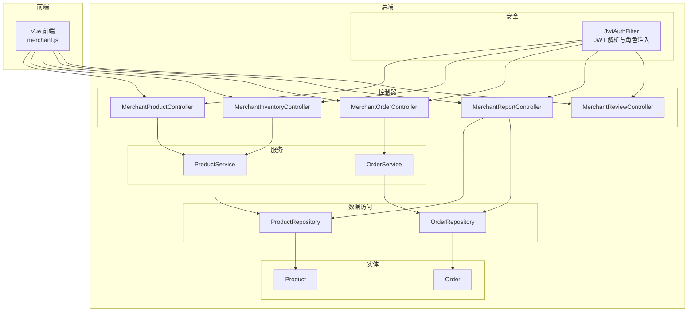

图表来源
- [MerchantProductController.java:18-180](file://backend/src/main/java/com/mall/controller/merchant/MerchantProductController.java#L18-L180)
- [MerchantInventoryController.java:16-118](file://backend/src/main/java/com/mall/controller/merchant/MerchantInventoryController.java#L16-L118)
- [MerchantOrderController.java:20-100](file://backend/src/main/java/com/mall/controller/merchant/MerchantOrderController.java#L20-L100)
- [MerchantReportController.java:23-81](file://backend/src/main/java/com/mall/controller/merchant/MerchantReportController.java#L23-L81)
- [MerchantReviewController.java:21-157](file://backend/src/main/java/com/mall/controller/merchant/MerchantReviewController.java#L21-L157)
- [ProductService.java:15-126](file://backend/src/main/java/com/mall/service/ProductService.java#L15-L126)
- [OrderService.java:23-280](file://backend/src/main/java/com/mall/service/OrderService.java#L23-L280)
- [ProductRepository.java:12-125](file://backend/src/main/java/com/mall/repository/ProductRepository.java#L12-L125)
- [OrderRepository.java:13-28](file://backend/src/main/java/com/mall/repository/OrderRepository.java#L13-L28)
- [Product.java:9-101](file://backend/src/main/java/com/mall/entity/Product.java#L9-L101)
- [Order.java:9-83](file://backend/src/main/java/com/mall/entity/Order.java#L9-L83)
- [JwtAuthFilter.java:18-57](file://backend/src/main/java/com/mall/security/JwtAuthFilter.java#L18-L57)
- [merchant.js:1-135](file://frontend/src/api/merchant.js#L1-L135)

章节来源
- [MerchantProductController.java:18-180](file://backend/src/main/java/com/mall/controller/merchant/MerchantProductController.java#L18-L180)
- [MerchantInventoryController.java:16-118](file://backend/src/main/java/com/mall/controller/merchant/MerchantInventoryController.java#L16-L118)
- [MerchantOrderController.java:20-100](file://backend/src/main/java/com/mall/controller/merchant/MerchantOrderController.java#L20-L100)
- [MerchantReportController.java:23-81](file://backend/src/main/java/com/mall/controller/merchant/MerchantReportController.java#L23-L81)
- [MerchantReviewController.java:21-157](file://backend/src/main/java/com/mall/controller/merchant/MerchantReviewController.java#L21-L157)
- [ProductService.java:15-126](file://backend/src/main/java/com/mall/service/ProductService.java#L15-L126)
- [OrderService.java:23-280](file://backend/src/main/java/com/mall/service/OrderService.java#L23-L280)
- [ProductRepository.java:12-125](file://backend/src/main/java/com/mall/repository/ProductRepository.java#L12-L125)
- [OrderRepository.java:13-28](file://backend/src/main/java/com/mall/repository/OrderRepository.java#L13-L28)
- [Product.java:9-101](file://backend/src/main/java/com/mall/entity/Product.java#L9-L101)
- [Order.java:9-83](file://backend/src/main/java/com/mall/entity/Order.java#L9-L83)
- [JwtAuthFilter.java:18-57](file://backend/src/main/java/com/mall/security/JwtAuthFilter.java#L18-L57)
- [merchant.js:1-135](file://frontend/src/api/merchant.js#L1-L135)

## 核心组件
- 商户商品控制器：提供商品列表、详情、创建、更新、删除，支持按分类名自动创建分类与图片字段处理。
- 商户库存控制器：提供库存列表、单个/批量库存调整、低库存预警查询。
- 商户订单控制器：提供订单列表、详情、发货、整单与单项退款审批。
- 商户报表控制器：提供看板数据（商品数、订单数、销量TopN扇形图）。
- 商户评价控制器：提供评价列表、按商品查询、删除与批量删除。
- 权限与安全：基于 JWT 的认证过滤器，将用户角色注入到认证上下文，控制器通过当前登录用户解析商户 ID 并进行资源级权限校验。

章节来源
- [MerchantProductController.java:28-180](file://backend/src/main/java/com/mall/controller/merchant/MerchantProductController.java#L28-L180)
- [MerchantInventoryController.java:25-118](file://backend/src/main/java/com/mall/controller/merchant/MerchantInventoryController.java#L25-L118)
- [MerchantOrderController.java:29-100](file://backend/src/main/java/com/mall/controller/merchant/MerchantOrderController.java#L29-L100)
- [MerchantReportController.java:33-81](file://backend/src/main/java/com/mall/controller/merchant/MerchantReportController.java#L33-L81)
- [MerchantReviewController.java:31-157](file://backend/src/main/java/com/mall/controller/merchant/MerchantReviewController.java#L31-L157)
- [JwtAuthFilter.java:30-47](file://backend/src/main/java/com/mall/security/JwtAuthFilter.java#L30-L47)

## 架构总览
商户控制器群组遵循“控制器-服务-仓储-实体”的分层架构，控制器负责请求接入与参数校验，服务层承载业务规则与事务边界，仓储层封装数据访问，实体层表达领域模型。前端通过统一的 merchant.js 接口集合调用后端接口，后端通过 JWT 过滤器完成身份认证与角色注入。

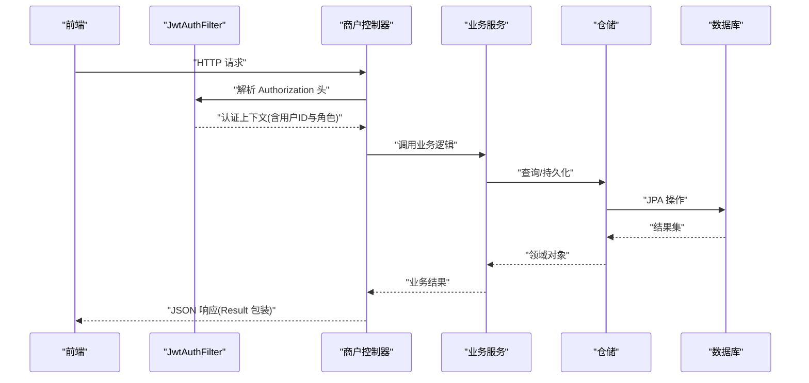

图表来源
- [JwtAuthFilter.java:30-47](file://backend/src/main/java/com/mall/security/JwtAuthFilter.java#L30-L47)
- [MerchantProductController.java:28-54](file://backend/src/main/java/com/mall/controller/merchant/MerchantProductController.java#L28-L54)
- [MerchantInventoryController.java:25-74](file://backend/src/main/java/com/mall/controller/merchant/MerchantInventoryController.java#L25-L74)
- [MerchantOrderController.java:29-71](file://backend/src/main/java/com/mall/controller/merchant/MerchantOrderController.java#L29-L71)
- [MerchantReportController.java:33-79](file://backend/src/main/java/com/mall/controller/merchant/MerchantReportController.java#L33-L79)
- [MerchantReviewController.java:31-91](file://backend/src/main/java/com/mall/controller/merchant/MerchantReviewController.java#L31-L91)
- [ProductService.java:84-126](file://backend/src/main/java/com/mall/service/ProductService.java#L84-L126)
- [OrderService.java:115-121](file://backend/src/main/java/com/mall/service/OrderService.java#L115-L121)
- [ProductRepository.java:12-125](file://backend/src/main/java/com/mall/repository/ProductRepository.java#L12-L125)
- [OrderRepository.java:13-28](file://backend/src/main/java/com/mall/repository/OrderRepository.java#L13-L28)

## 详细组件分析

### 商户商品控制器（商品管理）
- 功能要点
  - 当前商户 ID 解析：从认证上下文提取用户 ID，查询用户实体并读取其 merchantId，非商户账号直接拒绝。
  - 列表与详情：分页查询当前商户的商品，详情查询时进行资源归属校验。
  - 创建商品：参数校验（名称、价格、库存），支持按分类名自动创建/复用分类，处理详情图片字段。
  - 更新商品：同创建流程，但先校验是否存在且归属当前商户。
  - 删除商品：存在性与归属校验后删除。
- 关键协作
  - 与 ProductService 协作完成商品保存、分页查询与删除。
  - 与 CategoryRepository 协作完成分类自动创建。
  - 与 UserRepository 协作完成商户身份解析。

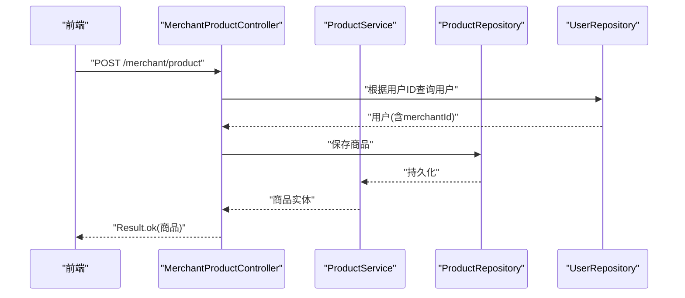

图表来源
- [MerchantProductController.java:56-114](file://backend/src/main/java/com/mall/controller/merchant/MerchantProductController.java#L56-L114)
- [ProductService.java:84-87](file://backend/src/main/java/com/mall/service/ProductService.java#L84-L87)
- [ProductRepository.java:12-125](file://backend/src/main/java/com/mall/repository/ProductRepository.java#L12-L125)
- [merchant.js:23-36](file://frontend/src/api/merchant.js#L23-L36)

章节来源
- [MerchantProductController.java:28-180](file://backend/src/main/java/com/mall/controller/merchant/MerchantProductController.java#L28-L180)
- [ProductService.java:52-92](file://backend/src/main/java/com/mall/service/ProductService.java#L52-L92)
- [ProductRepository.java:12-125](file://backend/src/main/java/com/mall/repository/ProductRepository.java#L12-L125)
- [merchant.js:13-36](file://frontend/src/api/merchant.js#L13-L36)

### 商户库存控制器（库存控制）
- 功能要点
  - 库存列表：支持关键词与库存状态筛选（缺货/低库存/正常），包含下架商品。
  - 单个库存调整：校验新库存非负，执行更新并返回变更前后对比。
  - 批量库存调整：逐项校验与更新，保证原子性与一致性。
  - 库存预警：按阈值查询低库存商品。
- 关键协作
  - 与 ProductService 协作完成库存查询、低库存查询与保存。
  - 与 UserRepository 协作完成商户身份解析。

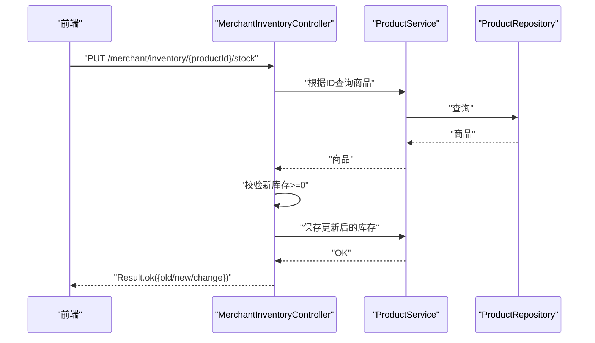

图表来源
- [MerchantInventoryController.java:46-74](file://backend/src/main/java/com/mall/controller/merchant/MerchantInventoryController.java#L46-L74)
- [ProductService.java:94-124](file://backend/src/main/java/com/mall/service/ProductService.java#L94-L124)
- [ProductRepository.java:107-123](file://backend/src/main/java/com/mall/repository/ProductRepository.java#L107-L123)
- [merchant.js:75-88](file://frontend/src/api/merchant.js#L75-L88)

章节来源
- [MerchantInventoryController.java:25-118](file://backend/src/main/java/com/mall/controller/merchant/MerchantInventoryController.java#L25-L118)
- [ProductService.java:94-124](file://backend/src/main/java/com/mall/service/ProductService.java#L94-L124)
- [ProductRepository.java:107-123](file://backend/src/main/java/com/mall/repository/ProductRepository.java#L107-L123)
- [merchant.js:68-88](file://frontend/src/api/merchant.js#L68-L88)

### 商户订单控制器（订单处理）
- 功能要点
  - 订单列表与详情：分页查询当前商户订单，详情聚合订单项。
  - 发货：仅允许“已支付”订单执行发货，状态置为“已发货”。
  - 退款审批：整单与单项退款审批，严格校验状态与归属。
- 关键协作
  - 与 OrderService 协作完成订单查询、状态更新与退款审批。
  - 与 UserRepository 协作完成商户身份解析。

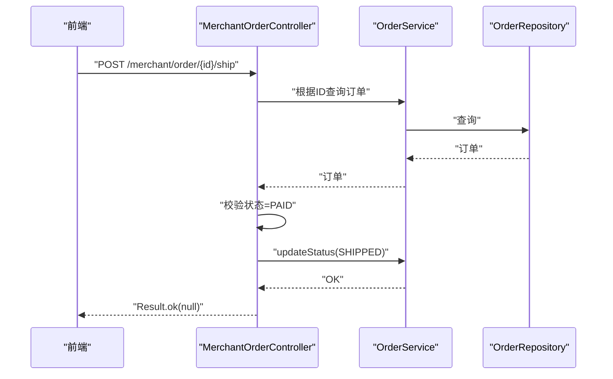

图表来源
- [MerchantOrderController.java:61-71](file://backend/src/main/java/com/mall/controller/merchant/MerchantOrderController.java#L61-L71)
- [OrderService.java:115-121](file://backend/src/main/java/com/mall/service/OrderService.java#L115-L121)
- [OrderRepository.java:13-28](file://backend/src/main/java/com/mall/repository/OrderRepository.java#L13-L28)
- [merchant.js:112-120](file://frontend/src/api/merchant.js#L112-L120)

章节来源
- [MerchantOrderController.java:29-100](file://backend/src/main/java/com/mall/controller/merchant/MerchantOrderController.java#L29-L100)
- [OrderService.java:100-121](file://backend/src/main/java/com/mall/service/OrderService.java#L100-L121)
- [OrderRepository.java:13-28](file://backend/src/main/java/com/mall/repository/OrderRepository.java#L13-L28)
- [merchant.js:58-67](file://frontend/src/api/merchant.js#L58-L67)

### 商户报表控制器（报表统计）
- 功能要点
  - 看板数据：商品总数、订单总数。
  - 销量分布：按销量降序取前 N（默认10）生成扇形图数据，其余合并为“其他”。
- 关键协作
  - 与 ProductRepository、OrderRepository 协作完成计数与排序查询。
  - 与 UserRepository 协作完成商户身份解析。

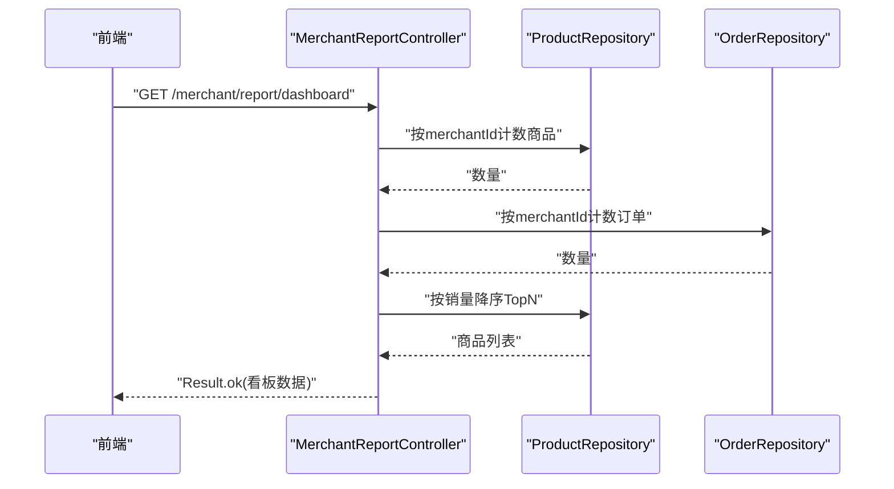

图表来源
- [MerchantReportController.java:41-79](file://backend/src/main/java/com/mall/controller/merchant/MerchantReportController.java#L41-L79)
- [ProductRepository.java:12-125](file://backend/src/main/java/com/mall/repository/ProductRepository.java#L12-L125)
- [OrderRepository.java:13-28](file://backend/src/main/java/com/mall/repository/OrderRepository.java#L13-L28)
- [merchant.js:8-11](file://frontend/src/api/merchant.js#L8-L11)

章节来源
- [MerchantReportController.java:33-81](file://backend/src/main/java/com/mall/controller/merchant/MerchantReportController.java#L33-L81)
- [ProductRepository.java:12-125](file://backend/src/main/java/com/mall/repository/ProductRepository.java#L12-L125)
- [OrderRepository.java:13-28](file://backend/src/main/java/com/mall/repository/OrderRepository.java#L13-L28)
- [merchant.js:8-11](file://frontend/src/api/merchant.js#L8-L11)

### 商户评价控制器（评价管理）
- 功能要点
  - 评价列表：按商户旗下所有商品汇总，支持按商品与最低评分过滤。
  - 按商品查询：校验商品归属当前商户后查询评价。
  - 删除与批量删除：校验商品归属后删除评价。
- 关键协作
  - 与 ProductReviewRepository、ProductRepository、UserRepository 协作完成查询与删除。

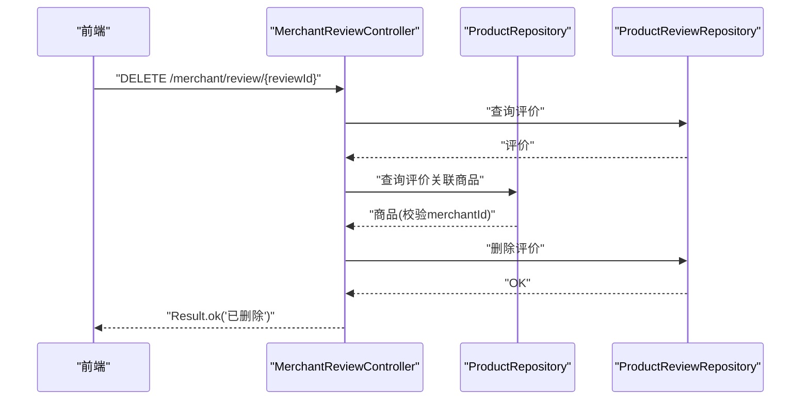

图表来源
- [MerchantReviewController.java:112-132](file://backend/src/main/java/com/mall/controller/merchant/MerchantReviewController.java#L112-L132)
- [ProductRepository.java:12-125](file://backend/src/main/java/com/mall/repository/ProductRepository.java#L12-L125)
- [ProductReviewRepository.java:1-200](file://backend/src/main/java/com/mall/repository/ProductReviewRepository.java#L1-L200)
- [merchant.js:102-110](file://frontend/src/api/merchant.js#L102-L110)

章节来源
- [MerchantReviewController.java:31-157](file://backend/src/main/java/com/mall/controller/merchant/MerchantReviewController.java#L31-L157)
- [ProductRepository.java:12-125](file://backend/src/main/java/com/mall/repository/ProductRepository.java#L12-L125)
- [merchant.js:90-110](file://frontend/src/api/merchant.js#L90-L110)

## 依赖关系分析
- 控制器与服务
  - MerchantProductController 依赖 ProductService 完成商品 CRUD 与分页。
  - MerchantInventoryController 依赖 ProductService 完成库存查询与更新。
  - MerchantOrderController 依赖 OrderService 完成订单状态与退款处理。
  - MerchantReportController 依赖 ProductRepository、OrderRepository 完成统计。
  - MerchantReviewController 依赖 ProductReviewRepository、ProductRepository 完成评价管理。
- 服务与仓储
  - ProductService 封装 ProductRepository 的多维查询与库存分页。
  - OrderService 封装 OrderRepository、OrderItemRepository、ProductRepository 的订单与库存事务。
- 安全与认证
  - JwtAuthFilter 从 Authorization 头解析 JWT，注入 ROLE_MERCHANT 等角色，控制器通过 Authentication 获取用户 ID 并解析 merchantId。

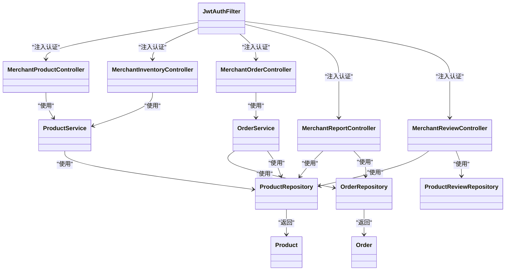

图表来源
- [MerchantProductController.java:24-26](file://backend/src/main/java/com/mall/controller/merchant/MerchantProductController.java#L24-L26)
- [MerchantInventoryController.java:22-23](file://backend/src/main/java/com/mall/controller/merchant/MerchantInventoryController.java#L22-L23)
- [MerchantOrderController.java:26-27](file://backend/src/main/java/com/mall/controller/merchant/MerchantOrderController.java#L26-L27)
- [MerchantReportController.java:29-31](file://backend/src/main/java/com/mall/controller/merchant/MerchantReportController.java#L29-L31)
- [MerchantReviewController.java:27-29](file://backend/src/main/java/com/mall/controller/merchant/MerchantReviewController.java#L27-L29)
- [ProductService.java:20](file://backend/src/main/java/com/mall/service/ProductService.java#L20)
- [OrderService.java:28-32](file://backend/src/main/java/com/mall/service/OrderService.java#L28-L32)
- [ProductRepository.java:12-125](file://backend/src/main/java/com/mall/repository/ProductRepository.java#L12-L125)
- [OrderRepository.java:13-28](file://backend/src/main/java/com/mall/repository/OrderRepository.java#L13-L28)
- [JwtAuthFilter.java:30-47](file://backend/src/main/java/com/mall/security/JwtAuthFilter.java#L30-L47)

章节来源
- [ProductService.java:15-126](file://backend/src/main/java/com/mall/service/ProductService.java#L15-L126)
- [OrderService.java:23-280](file://backend/src/main/java/com/mall/service/OrderService.java#L23-L280)
- [ProductRepository.java:12-125](file://backend/src/main/java/com/mall/repository/ProductRepository.java#L12-L125)
- [OrderRepository.java:13-28](file://backend/src/main/java/com/mall/repository/OrderRepository.java#L13-L28)
- [JwtAuthFilter.java:30-47](file://backend/src/main/java/com/mall/security/JwtAuthFilter.java#L30-L47)

## 性能考量
- 分页与排序
  - 控制器普遍使用 PageRequest 进行分页，避免一次性加载大量数据。
  - 报表控制器对销量排序使用数据库层面的降序排序，减少内存排序开销。
- 查询优化
  - ProductService 在库存查询中根据关键词与库存状态组合不同查询方法，降低全表扫描概率。
  - 报表控制器限制 TopN 数量，默认10，避免大扇形图带来的序列化与渲染压力。
- 事务与一致性
  - 订单创建与库存扣减、取消与回补库存均在事务内完成，确保数据一致性。
- 前端缓存与懒加载
  - 建议前端对商品列表与评价列表做分页缓存，结合关键词与评分筛选实现懒加载。

[本节为通用指导，无需列出具体文件来源]

## 故障排查指南
- 权限错误
  - 现象：返回“商品不存在/无权限操作/非运营账号”等提示。
  - 排查：确认登录用户是否为商户角色，检查 Authentication 中的用户 ID 是否与商品/订单的 merchantId 匹配。
- 参数校验失败
  - 现象：创建/更新商品时返回“名称/价格/库存非法”。
  - 排查：核对请求体字段类型与范围约束，确保分类名与图片字段格式正确。
- 库存调整异常
  - 现象：库存调整失败或返回负数。
  - 排查：确认新库存非负，检查商品是否存在且归属当前商户。
- 订单状态流转异常
  - 现象：发货失败或退款审批失败。
  - 排查：确认订单状态是否符合要求（如仅“已支付”可发货，“已收货/部分退款申请中”可申请退款），检查订单归属与项状态。
- 报表数据异常
  - 现象：看板数据与预期不符。
  - 排查：确认商品是否“上架且运营启用”，销量统计按销量降序取 TopN，其余合并为“其他”。

章节来源
- [MerchantProductController.java:49-54](file://backend/src/main/java/com/mall/controller/merchant/MerchantProductController.java#L49-L54)
- [MerchantInventoryController.java:53-61](file://backend/src/main/java/com/mall/controller/merchant/MerchantInventoryController.java#L53-L61)
- [MerchantOrderController.java:64-71](file://backend/src/main/java/com/mall/controller/merchant/MerchantOrderController.java#L64-L71)
- [MerchantReportController.java:46-76](file://backend/src/main/java/com/mall/controller/merchant/MerchantReportController.java#L46-L76)

## 结论
商户控制器群组以清晰的分层架构与严格的资源级权限校验为基础，围绕商品、库存、订单、报表与评价五大核心域构建了完整的商户运营能力。通过与 ProductService、OrderService 的紧密协作，实现了高内聚、低耦合的业务逻辑封装。配合前端统一接口与 JWT 安全机制，为商户提供了稳定、可扩展的功能支撑。建议在后续迭代中持续关注分页与排序性能、事务边界与一致性保障，并完善前端交互体验与错误提示。

[本节为总结性内容，无需列出具体文件来源]

## 附录

### API 接口清单（商户端）
- 商品管理
  - GET /merchant/product：分页查询当前商户商品
  - GET /merchant/product/{id}：查询商品详情
  - POST /merchant/product：创建商品
  - PUT /merchant/product/{id}：更新商品
  - DELETE /merchant/product/{id}：删除商品
- 库存管理
  - GET /merchant/inventory：分页查询库存（支持关键词与库存状态筛选）
  - PUT /merchant/inventory/{productId}/stock：调整单个商品库存
  - PUT /merchant/inventory/batch-stock：批量调整库存
  - GET /merchant/inventory/warnings：获取低库存预警（可传入阈值）
- 订单处理
  - GET /merchant/order：分页查询订单
  - GET /merchant/order/{id}：查询订单详情（含订单项）
  - POST /merchant/order/{id}/ship：发货（仅已支付订单）
  - POST /merchant/order/{id}/accept-refund：同意整单退款
  - POST /merchant/order/{orderId}/items/{itemId}/accept-refund：同意单项退款
- 报表统计
  - GET /merchant/report/dashboard：获取看板数据（商品数、订单数、销量TopN）
- 评价管理
  - GET /merchant/review：分页查询评价（支持按商品与最低评分过滤）
  - GET /merchant/review/product/{productId}：查询单个商品评价
  - DELETE /merchant/review/{reviewId}：删除单条评价
  - POST /merchant/review/batch-delete：批量删除评价

章节来源
- [merchant.js:8-135](file://frontend/src/api/merchant.js#L8-L135)

### 业务流程示例

#### 商品上架/下架流程
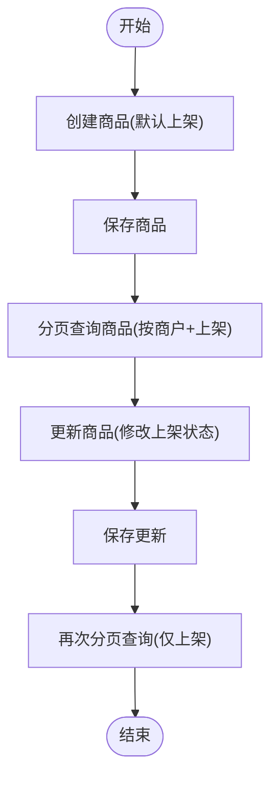

图表来源
- [MerchantProductController.java:56-114](file://backend/src/main/java/com/mall/controller/merchant/MerchantProductController.java#L56-L114)
- [ProductService.java:52-55](file://backend/src/main/java/com/mall/service/ProductService.java#L52-L55)
- [ProductRepository.java:12-125](file://backend/src/main/java/com/mall/repository/ProductRepository.java#L12-L125)

#### 库存预警与调整策略
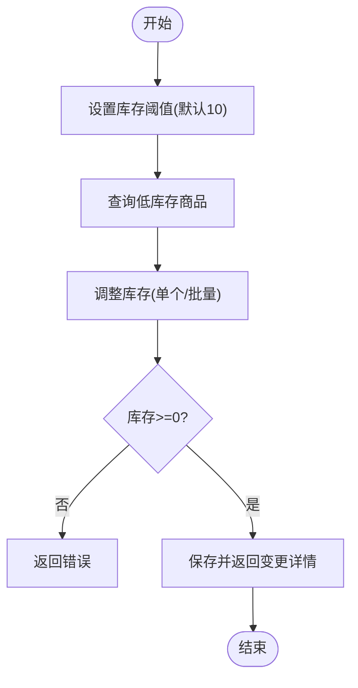

图表来源
- [MerchantInventoryController.java:110-118](file://backend/src/main/java/com/mall/controller/merchant/MerchantInventoryController.java#L110-L118)
- [ProductService.java:121-124](file://backend/src/main/java/com/mall/service/ProductService.java#L121-L124)

#### 订单状态流转控制
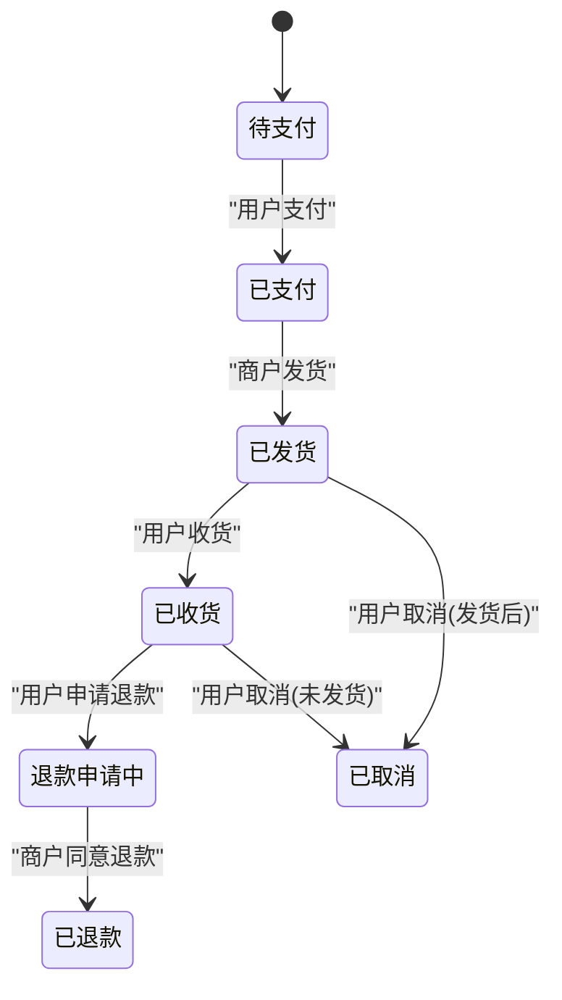

图表来源
- [Order.java:31-64](file://backend/src/main/java/com/mall/entity/Order.java#L31-L64)
- [OrderService.java:115-121](file://backend/src/main/java/com/mall/service/OrderService.java#L115-L121)
- [MerchantOrderController.java:61-85](file://backend/src/main/java/com/mall/controller/merchant/MerchantOrderController.java#L61-L85)

### 最佳实践
- 权限校验前置：所有写操作与跨资源查询均应先校验 merchantId 与资源归属。
- 参数校验完备：对关键字段（名称、价格、库存、状态）进行显式校验与边界控制。
- 事务边界明确：涉及库存与订单状态的复合操作必须在事务内完成，确保一致性。
- 分页与排序：优先使用数据库层面的分页与排序，避免内存压力。
- 前端交互：结合分页缓存与懒加载，提升用户体验与性能。

[本节为通用指导，无需列出具体文件来源]