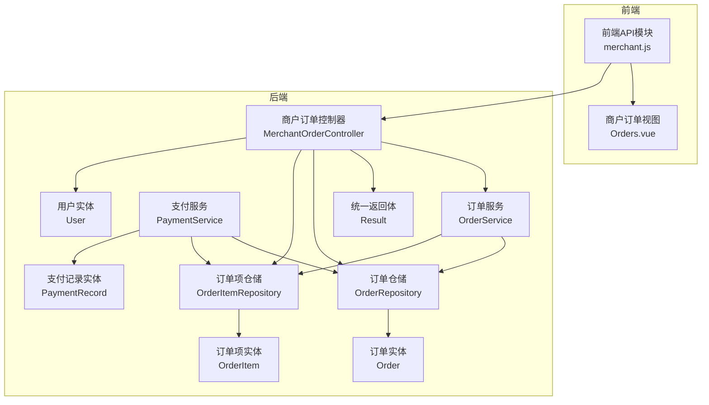
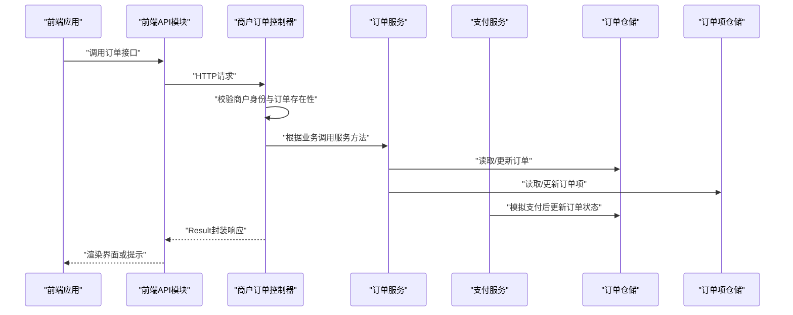
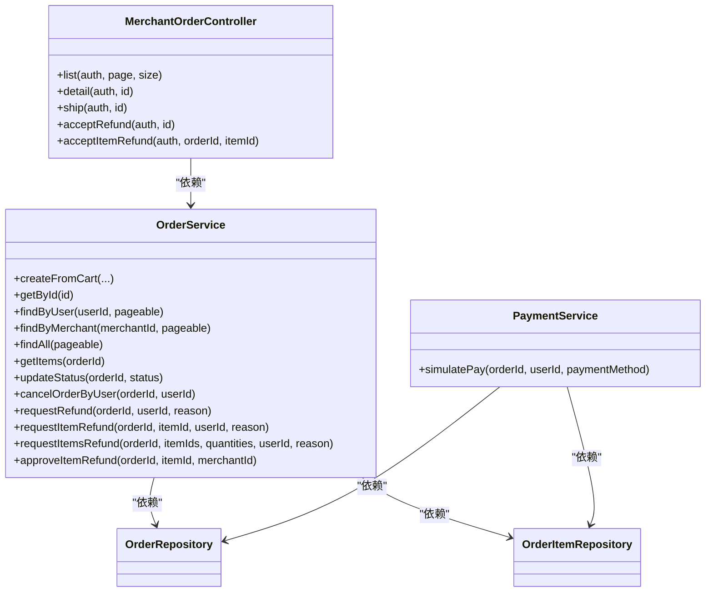
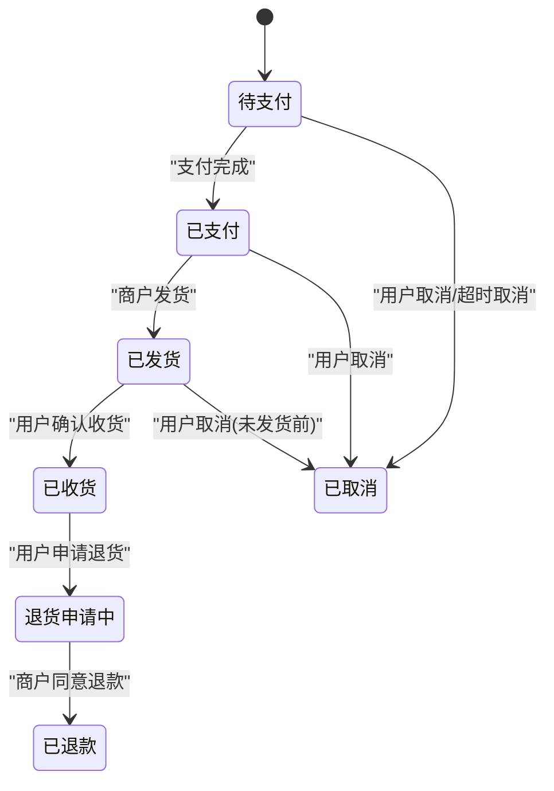
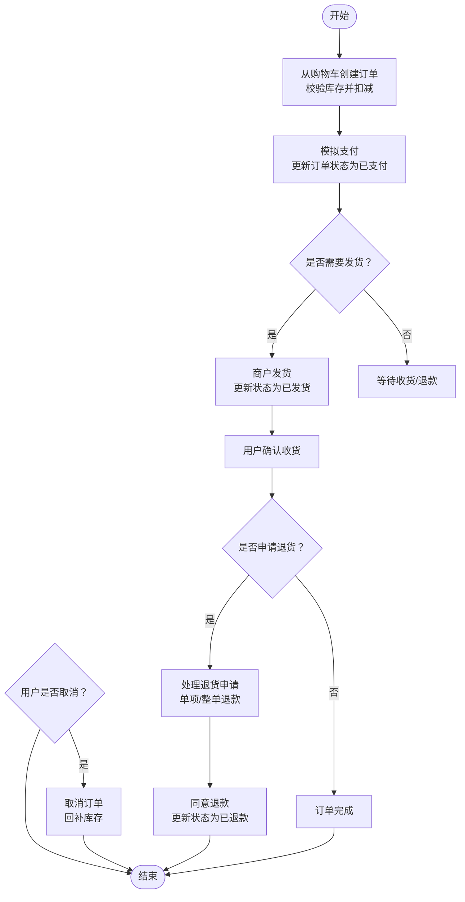

# 商户订单控制器

<cite>
**本文引用的文件**
- [MerchantOrderController.java](file://backend/src/main/java/com/mall/controller/merchant/MerchantOrderController.java)
- [OrderService.java](file://backend/src/main/java/com/mall/service/OrderService.java)
- [Order.java](file://backend/src/main/java/com/mall/entity/Order.java)
- [OrderItem.java](file://backend/src/main/java/com/mall/entity/OrderItem.java)
- [OrderRepository.java](file://backend/src/main/java/com/mall/repository/OrderRepository.java)
- [OrderItemRepository.java](file://backend/src/main/java/com/mall/repository/OrderItemRepository.java)
- [Result.java](file://backend/src/main/java/com/mall/dto/Result.java)
- [User.java](file://backend/src/main/java/com/mall/entity/User.java)
- [application.yml](file://backend/src/main/resources/application.yml)
- [merchant.js](file://frontend/src/api/merchant.js)
- [Orders.vue](file://frontend/src/views/merchant/Orders.vue)
- [PaymentService.java](file://backend/src/main/java/com/mall/service/PaymentService.java)
- [PaymentRecord.java](file://backend/src/main/java/com/mall/entity/PaymentRecord.java)
</cite>

## 目录
1. [简介](#简介)
2. [项目结构](#项目结构)
3. [核心组件](#核心组件)
4. [架构总览](#架构总览)
5. [详细组件分析](#详细组件分析)
6. [依赖分析](#依赖分析)
7. [性能考虑](#性能考虑)
8. [故障排查指南](#故障排查指南)
9. [结论](#结论)
10. [附录](#附录)

## 简介
本技术文档围绕“商户订单控制器”展开，系统性解析订单处理的核心功能与实现细节，覆盖订单查询、订单状态管理、订单发货、退款处理、订单详情展示、订单流程、异常订单处理、统计报表以及通知机制等。文档以代码为依据，结合前后端交互与数据库实体，提供清晰的架构图、流程图与API接口说明，帮助开发者快速理解并扩展业务。

## 项目结构
后端采用Spring Boot + JPA分层架构，商户侧订单控制位于“controller.merchant”包，核心业务由“service”层实现，数据持久化通过“repository”层访问数据库，统一返回体封装在“dto”中。前端Vue页面通过API模块调用后端接口。

图表来源
- [MerchantOrderController.java:1-100](file://backend/src/main/java/com/mall/controller/merchant/MerchantOrderController.java#L1-100)
- [OrderService.java:1-280](file://backend/src/main/java/com/mall/service/OrderService.java#L1-280)
- [OrderRepository.java:1-28](file://backend/src/main/java/com/mall/repository/OrderRepository.java#L1-28)
- [OrderItemRepository.java:1-20](file://backend/src/main/java/com/mall/repository/OrderItemRepository.java#L1-20)
- [Order.java:1-83](file://backend/src/main/java/com/mall/entity/Order.java#L1-83)
- [OrderItem.java:1-73](file://backend/src/main/java/com/mall/entity/OrderItem.java#L1-73)
- [User.java:1-88](file://backend/src/main/java/com/mall/entity/User.java#L1-88)
- [PaymentService.java:1-67](file://backend/src/main/java/com/mall/service/PaymentService.java#L1-67)
- [PaymentRecord.java:1-46](file://backend/src/main/java/com/mall/entity/PaymentRecord.java#L1-46)
- [Result.java:1-24](file://backend/src/main/java/com/mall/dto/Result.java#L1-24)
- [merchant.js:1-135](file://frontend/src/api/merchant.js#L1-135)
- [Orders.vue:1-203](file://frontend/src/views/merchant/Orders.vue#L1-203)

章节来源
- [application.yml:1-36](file://backend/src/main/resources/application.yml#L1-36)

## 核心组件
- 商户订单控制器：提供订单列表查询、订单详情查询、订单发货、同意退款、单项退款审批等接口，严格校验商户身份与订单状态。
- 订单服务：负责订单创建（从购物车）、状态更新、取消、退款申请与审批、单项退款审批与同步等事务性操作。
- 支付服务：模拟支付完成，更新订单状态、写入支付记录并更新商品销量。
- 数据模型：订单、订单项、支付记录、用户等实体定义字段与生命周期钩子。
- 统一返回体：Result封装响应码、消息与数据，便于前后端一致处理。

章节来源
- [MerchantOrderController.java:1-100](file://backend/src/main/java/com/mall/controller/merchant/MerchantOrderController.java#L1-100)
- [OrderService.java:1-280](file://backend/src/main/java/com/mall/service/OrderService.java#L1-280)
- [PaymentService.java:1-67](file://backend/src/main/java/com/mall/service/PaymentService.java#L1-67)
- [Result.java:1-24](file://backend/src/main/java/com/mall/dto/Result.java#L1-24)

## 架构总览
商户订单控制器作为REST入口，接收前端请求后进行安全校验与参数验证，随后委托订单服务执行业务逻辑。服务层通过仓储层访问数据库，确保事务一致性与数据完整性。支付服务独立于订单服务，用于模拟支付完成场景。

图表来源
- [MerchantOrderController.java:37-100](file://backend/src/main/java/com/mall/controller/merchant/MerchantOrderController.java#L37-L100)
- [OrderService.java:90-185](file://backend/src/main/java/com/mall/service/OrderService.java#L90-L185)
- [PaymentService.java:30-65](file://backend/src/main/java/com/mall/service/PaymentService.java#L30-L65)

## 详细组件分析

### 商户订单控制器
- 接口职责
  - 列表查询：按分页查询当前商户的所有订单。
  - 订单详情：返回订单主体与订单项明细。
  - 发货操作：仅允许“已支付”订单执行发货，成功后置为“已发货”。
  - 同意退款：仅允许“退货申请中”的订单执行同意退款，成功后置为“已退款”。
  - 单项退款审批：针对订单内某一个订单项执行退款审批，若全部项均退款，则整体订单置为“已退款”。

- 安全校验
  - 通过认证对象解析当前商户ID，确保订单归属正确。
  - 对订单存在性与归属进行双重校验，避免越权访问。

- 响应格式
  - 使用统一返回体Result，成功返回200，失败返回400及错误信息。

章节来源
- [MerchantOrderController.java:29-100](file://backend/src/main/java/com/mall/controller/merchant/MerchantOrderController.java#L29-L100)
- [Result.java:16-22](file://backend/src/main/java/com/mall/dto/Result.java#L16-L22)

### 订单服务
- 订单创建（从购物车）
  - 从用户购物车筛选属于当前商户的商品，校验库存充足后生成订单与订单项，原子性扣减库存并清空对应购物车项。
- 订单状态管理
  - 提供通用状态更新方法，支持外部调用。
  - 用户取消订单：仅在非“已收货/退货申请中/已退款”状态下允许取消，并回补库存。
  - 用户申请退货：仅允许“已收货”订单发起，状态置为“退货申请中”，并记录申请原因与时间。
  - 单项退款申请：支持整单或部分数量退款，必要时拆分订单项；当所有项均申请/退款后，整体订单同步为“退货申请中”或“已退款”。
  - 商户单项退款审批：校验订单归属与状态，审批通过后同步整体订单状态。
- 查询接口
  - 支持按用户、按商户、全站分页查询，支持按创建时间倒序排序。
  - 支持查询订单明细项。

章节来源
- [OrderService.java:33-88](file://backend/src/main/java/com/mall/service/OrderService.java#L33-L88)
- [OrderService.java:115-145](file://backend/src/main/java/com/mall/service/OrderService.java#L115-L145)
- [OrderService.java:147-161](file://backend/src/main/java/com/mall/service/OrderService.java#L147-L161)
- [OrderService.java:163-240](file://backend/src/main/java/com/mall/service/OrderService.java#L163-L240)
- [OrderService.java:254-278](file://backend/src/main/java/com/mall/service/OrderService.java#L254-L278)
- [OrderRepository.java:17-26](file://backend/src/main/java/com/mall/repository/OrderRepository.java#L17-L26)
- [OrderItemRepository.java:11-18](file://backend/src/main/java/com/mall/repository/OrderItemRepository.java#L11-L18)

### 支付服务
- 模拟支付流程
  - 校验订单存在性与状态是否为“待支付”，设置支付方式、支付金额、支付时间，更新订单状态为“已支付”。
  - 写入支付记录，更新商品销量。
- 与订单服务协作
  - 支付完成后由支付服务更新订单状态，后续发货与退款流程基于订单状态机推进。

章节来源
- [PaymentService.java:30-65](file://backend/src/main/java/com/mall/service/PaymentService.java#L30-L65)
- [PaymentRecord.java:17-45](file://backend/src/main/java/com/mall/entity/PaymentRecord.java#L17-L45)

### 数据模型
- 订单实体
  - 字段涵盖订单号、用户ID、商户ID、状态、应付金额、实付金额、支付方式与时间、收货人信息、退款原因与时间、创建/更新时间等。
  - 状态枚举：PENDING、PAID、SHIPPED、RECEIVED、REFUND_REQUESTED、REFUNDED、CANCELLED。
- 订单项实体
  - 字段包含商品快照、单价、数量、小计、单品退款状态与时间、是否已评价等。
- 用户实体
  - 包含角色与商户ID关联，用于识别商户账号并绑定订单。

章节来源
- [Order.java:31-81](file://backend/src/main/java/com/mall/entity/Order.java#L31-L81)
- [OrderItem.java:50-71](file://backend/src/main/java/com/mall/entity/OrderItem.java#L50-L71)
- [User.java:60-62](file://backend/src/main/java/com/mall/entity/User.java#L60-L62)

### 前端集成
- 接口映射
  - 订单列表、订单详情、发货、同意退款等接口在前端API模块中均有对应封装。
- 视图交互
  - 订单列表页根据状态显示“发货”、“查看退货原因”等按钮，点击后调用对应接口并更新本地状态。

章节来源
- [merchant.js:58-120](file://frontend/src/api/merchant.js#L58-L120)
- [Orders.vue:97-149](file://frontend/src/views/merchant/Orders.vue#L97-L149)

## 依赖分析
- 控制器依赖服务与仓储，服务依赖仓储与实体，形成清晰的分层依赖。
- 订单状态机与退款流程通过服务层集中管理，避免状态不一致。
- 前端通过API模块与控制器交互，视图层仅负责UI与事件绑定。

图表来源
- [MerchantOrderController.java:26-27](file://backend/src/main/java/com/mall/controller/merchant/MerchantOrderController.java#L26-L27)
- [OrderService.java:28-31](file://backend/src/main/java/com/mall/service/OrderService.java#L28-L31)
- [OrderRepository.java:13-27](file://backend/src/main/java/com/mall/repository/OrderRepository.java#L13-L27)
- [OrderItemRepository.java:9-19](file://backend/src/main/java/com/mall/repository/OrderItemRepository.java#L9-L19)
- [PaymentService.java:25-28](file://backend/src/main/java/com/mall/service/PaymentService.java#L25-L28)

## 性能考虑
- 分页查询：列表与详情查询均支持分页，建议前端传入合理页码与大小，避免一次性加载过多数据。
- 事务边界：订单创建、发货、退款等关键流程均在事务内执行，确保一致性但需关注长事务带来的锁竞争。
- 库存扣减：创建订单时一次性校验并扣减，避免并发场景下的超卖风险。
- 查询优化：仓储层提供按用户、商户、状态等索引查询，建议在高并发场景下结合数据库索引与缓存策略。

## 故障排查指南
- “订单不存在”或“非运营账号”
  - 检查用户是否具备商户角色且与订单绑定一致；确认认证信息是否正确传递。
- “订单未支付”或“订单不在退货申请状态”
  - 确认订单状态是否符合操作前置条件；检查支付流程是否已完成。
- “商品库存不足”
  - 检查商品实时库存与下单数量；避免并发下单导致的超卖。
- “当前订单状态不可取消/退货”
  - 确认订单状态是否为“已收货/退货申请中/已退款”，这些状态下不允许再次变更。
- “该商品已申请退款”
  - 检查订单项退款状态，避免重复申请。

章节来源
- [MerchantOrderController.java:61-85](file://backend/src/main/java/com/mall/controller/merchant/MerchantOrderController.java#L61-L85)
- [OrderService.java:49-51](file://backend/src/main/java/com/mall/service/OrderService.java#L49-L51)
- [OrderService.java:123-145](file://backend/src/main/java/com/mall/service/OrderService.java#L123-L145)
- [OrderService.java:147-161](file://backend/src/main/java/com/mall/service/OrderService.java#L147-L161)
- [OrderService.java:163-185](file://backend/src/main/java/com/mall/service/OrderService.java#L163-L185)

## 结论
商户订单控制器以清晰的分层设计与严格的业务校验，实现了从订单创建、支付、发货到退款的完整闭环。通过统一的状态机与事务管理，保障了数据一致性与业务正确性。前端通过标准化的API对接，提供了直观的操作界面。后续可在通知机制、报表统计与异常处理方面进一步增强。

## 附录

### 订单状态流转机制

图表来源
- [Order.java:31-33](file://backend/src/main/java/com/mall/entity/Order.java#L31-L33)
- [OrderService.java:115-145](file://backend/src/main/java/com/mall/service/OrderService.java#L115-L145)
- [OrderService.java:147-161](file://backend/src/main/java/com/mall/service/OrderService.java#L147-L161)
- [OrderService.java:254-278](file://backend/src/main/java/com/mall/service/OrderService.java#L254-L278)

### 订单详情展示字段
- 订单主体：订单号、用户ID、商户ID、状态、应付/实付金额、支付方式与时间、收货人信息、退款原因与时间、创建/更新时间。
- 订单项明细：商品名称、图片、单价、数量、小计、单品退款状态与时间、是否已评价。

章节来源
- [Order.java:22-71](file://backend/src/main/java/com/mall/entity/Order.java#L22-L71)
- [OrderItem.java:28-63](file://backend/src/main/java/com/mall/entity/OrderItem.java#L28-L63)

### 订单处理流程（关键环节）

图表来源
- [OrderService.java:33-88](file://backend/src/main/java/com/mall/service/OrderService.java#L33-L88)
- [PaymentService.java:30-65](file://backend/src/main/java/com/mall/service/PaymentService.java#L30-L65)
- [OrderService.java:115-161](file://backend/src/main/java/com/mall/service/OrderService.java#L115-L161)
- [OrderService.java:254-278](file://backend/src/main/java/com/mall/service/OrderService.java#L254-L278)

### 异常订单处理机制
- 退货申请：仅“已收货”订单可发起，记录申请原因与时间，状态置为“退货申请中”。
- 单项退款：支持整单或部分数量退款，必要时拆分订单项；当所有项均退款后整体状态更新。
- 商户审批：校验订单归属与状态，审批通过后同步整体订单状态。
- 取消订单：仅在特定状态下允许取消并回补库存。

章节来源
- [OrderService.java:147-161](file://backend/src/main/java/com/mall/service/OrderService.java#L147-L161)
- [OrderService.java:163-240](file://backend/src/main/java/com/mall/service/OrderService.java#L163-L240)
- [OrderService.java:254-278](file://backend/src/main/java/com/mall/service/OrderService.java#L254-L278)
- [OrderService.java:123-145](file://backend/src/main/java/com/mall/service/OrderService.java#L123-L145)

### 订单统计功能
- 销售额统计：可通过支付记录与订单状态聚合计算。
- 订单量统计：按日/周/月维度统计订单数与金额。
- 商品销售排行：基于订单项统计各商品销量与收入。
- 报表数据生成：建议在报表服务中按需查询并缓存结果，避免高频查询造成压力。

章节来源
- [PaymentRecord.java:23-36](file://backend/src/main/java/com/mall/entity/PaymentRecord.java#L23-L36)
- [OrderItemRepository.java:13-18](file://backend/src/main/java/com/mall/repository/OrderItemRepository.java#L13-L18)

### 订单通知机制
- 当前代码未发现短信/邮件通知的具体实现。
- 建议在关键节点（如发货、同意退款、订单取消）增加异步通知任务，集成第三方短信/邮件服务。

章节来源
- [MerchantOrderController.java:61-85](file://backend/src/main/java/com/mall/controller/merchant/MerchantOrderController.java#L61-L85)
- [OrderService.java:115-121](file://backend/src/main/java/com/mall/service/OrderService.java#L115-L121)

### API接口文档
- 订单列表
  - 方法：GET
  - 路径：/merchant/order
  - 参数：page（默认0）、size（默认10）
  - 返回：Result封装分页订单列表
- 订单详情
  - 方法：GET
  - 路径：/merchant/order/{id}
  - 返回：Result封装订单与订单项明细
- 订单发货
  - 方法：POST
  - 路径：/merchant/order/{id}/ship
  - 前置条件：订单状态为“已支付”
  - 返回：Result
- 同意退款
  - 方法：POST
  - 路径：/merchant/order/{id}/accept-refund
  - 前置条件：订单状态为“退货申请中”
  - 返回：Result
- 单项退款审批
  - 方法：POST
  - 路径：/merchant/order/{orderId}/items/{itemId}/accept-refund
  - 返回：Result

章节来源
- [MerchantOrderController.java:37-99](file://backend/src/main/java/com/mall/controller/merchant/MerchantOrderController.java#L37-L99)
- [merchant.js:58-120](file://frontend/src/api/merchant.js#L58-L120)