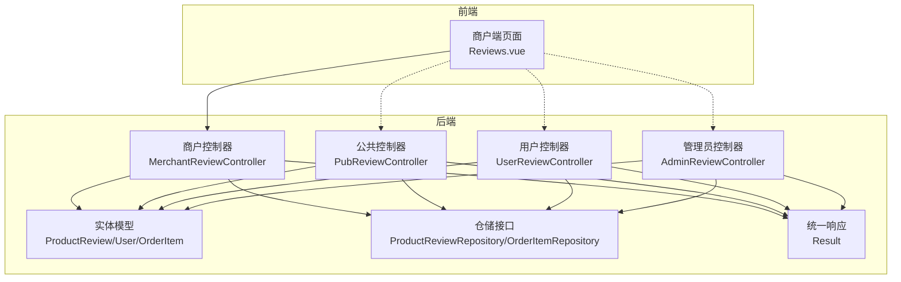
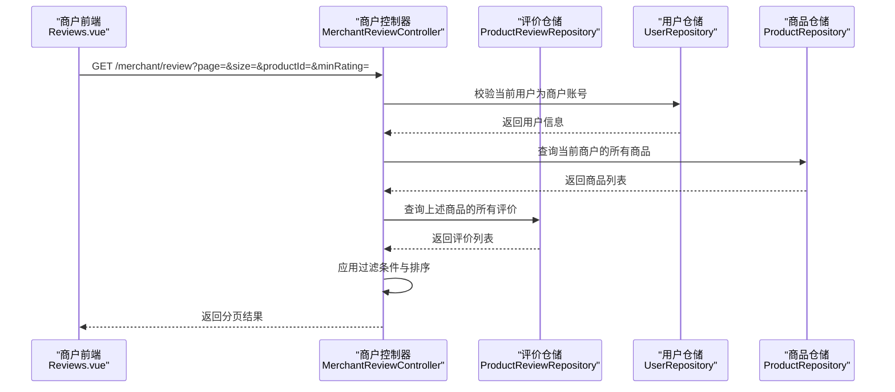
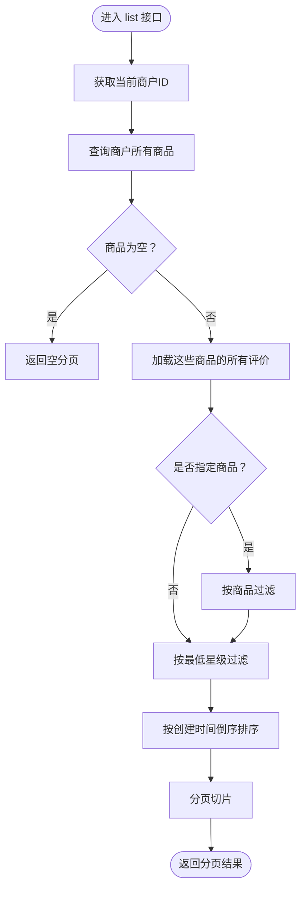
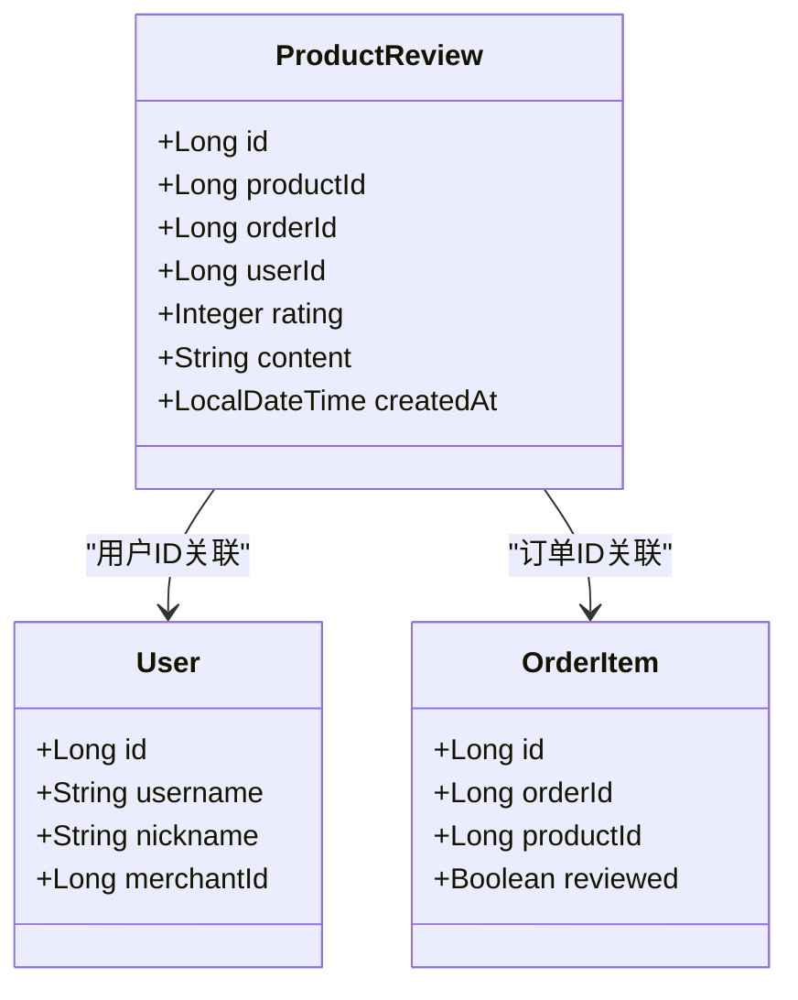
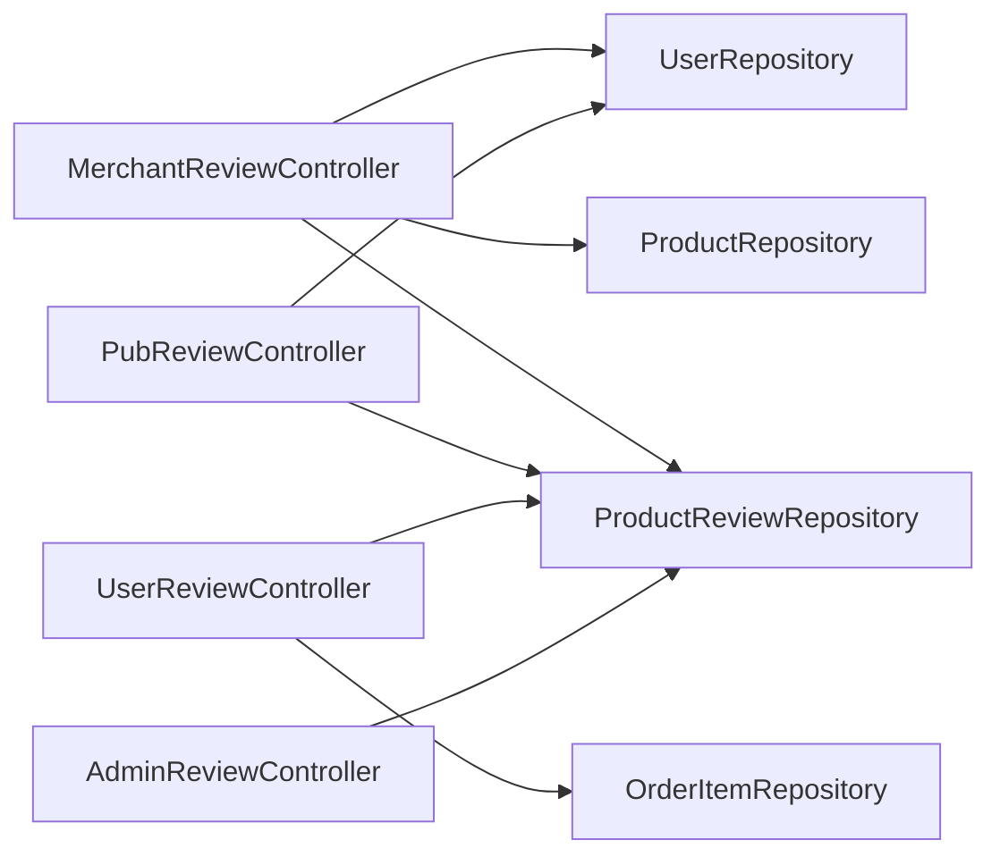

# 商户评价控制器

<cite>
**本文引用的文件**
- [MerchantReviewController.java](file://backend/src/main/java/com/mall/controller/merchant/MerchantReviewController.java)
- [ProductReview.java](file://backend/src/main/java/com/mall/entity/ProductReview.java)
- [ProductReviewRepository.java](file://backend/src/main/java/com/mall/repository/ProductReviewRepository.java)
- [PubReviewController.java](file://backend/src/main/java/com/mall/controller/pub/PubReviewController.java)
- [UserReviewController.java](file://backend/src/main/java/com/mall/controller/user/UserReviewController.java)
- [AdminReviewController.java](file://backend/src/main/java/com/mall/controller/admin/AdminReviewController.java)
- [Result.java](file://backend/src/main/java/com/mall/dto/Result.java)
- [User.java](file://backend/src/main/java/com/mall/entity/User.java)
- [OrderItem.java](file://backend/src/main/java/com/mall/entity/OrderItem.java)
- [OrderItemRepository.java](file://backend/src/main/java/com/mall/repository/OrderItemRepository.java)
- [application.yml](file://backend/src/main/resources/application.yml)
- [Reviews.vue（商户端）](file://frontend/src/views/merchant/Reviews.vue)
</cite>

## 目录
1. [简介](#简介)
2. [项目结构](#项目结构)
3. [核心组件](#核心组件)
4. [架构总览](#架构总览)
5. [详细组件分析](#详细组件分析)
6. [依赖分析](#依赖分析)
7. [性能考虑](#性能考虑)
8. [故障排查指南](#故障排查指南)
9. [结论](#结论)
10. [附录](#附录)

## 简介
本技术文档围绕“商户评价控制器”展开，系统性解析商品评价管理的核心功能实现，涵盖以下方面：
- 评价列表查询：按商品、按评价等级、按时间范围等条件的筛选与排序
- 审核机制：敏感词过滤、人工审核、自动屏蔽等能力现状与扩展建议
- 评价回复：商户对用户评价进行回复与互动的实现路径
- 统计分析：平均评分、评价数量、好评率等指标的生成
- 高级分析：关键词提取、情感分析、用户反馈挖掘等能力现状与扩展建议
- 关系分析：评价与商品质量的关系分析，如何通过评价数据改进商品管理与服务质量
- 举报与投诉：评价举报与投诉处理机制现状与改进建议
- 数据隐私：评价数据的隐私保护措施与合规建议
- API 接口文档：完整接口定义、参数说明、返回结构与示例
- 流程与最佳实践：评价管理流程、操作规范与优化建议

## 项目结构
后端采用 Spring Boot + JPA 的分层架构，评价相关模块分布如下：
- 控制器层：商户端、公共端、用户端、管理员端分别提供不同的评价接口
- 实体层：ProductReview、User、OrderItem 等实体定义
- 仓储层：ProductReviewRepository、OrderItemRepository 等仓库接口
- DTO 层：Result 统一响应包装
- 前端：商户端页面 Reviews.vue 提供评价列表与批量操作界面

图表来源
- [MerchantReviewController.java:21-157](file://backend/src/main/java/com/mall/controller/merchant/MerchantReviewController.java#L21-L157)
- [PubReviewController.java:19-64](file://backend/src/main/java/com/mall/controller/pub/PubReviewController.java#L19-L64)
- [UserReviewController.java:17-73](file://backend/src/main/java/com/mall/controller/user/UserReviewController.java#L17-L73)
- [AdminReviewController.java:16-92](file://backend/src/main/java/com/mall/controller/admin/AdminReviewController.java#L16-L92)
- [ProductReview.java:8-44](file://backend/src/main/java/com/mall/entity/ProductReview.java#L8-L44)
- [User.java:10-88](file://backend/src/main/java/com/mall/entity/User.java#L10-L88)
- [OrderItem.java:9-73](file://backend/src/main/java/com/mall/entity/OrderItem.java#L9-L73)
- [ProductReviewRepository.java:10-16](file://backend/src/main/java/com/mall/repository/ProductReviewRepository.java#L10-L16)
- [OrderItemRepository.java:9-20](file://backend/src/main/java/com/mall/repository/OrderItemRepository.java#L9-L20)
- [Result.java:10-24](file://backend/src/main/java/com/mall/dto/Result.java#L10-L24)

章节来源
- [application.yml:1-36](file://backend/src/main/resources/application.yml#L1-L36)

## 核心组件
- 商户评价控制器：提供评价列表查询、按商品查询、删除与批量删除能力，并基于商户维度进行权限校验
- 公共评价控制器：面向前端展示，按商品分页查询评价并注入用户昵称
- 用户评价控制器：用户提交评价，避免重复评价并标记订单项为已评价
- 管理员评价控制器：全站评价的查询与删除
- 实体与仓储：ProductReview、User、OrderItem 及其仓库接口
- 统一响应：Result 封装统一的响应结构

章节来源
- [MerchantReviewController.java:21-157](file://backend/src/main/java/com/mall/controller/merchant/MerchantReviewController.java#L21-L157)
- [PubReviewController.java:19-64](file://backend/src/main/java/com/mall/controller/pub/PubReviewController.java#L19-L64)
- [UserReviewController.java:17-73](file://backend/src/main/java/com/mall/controller/user/UserReviewController.java#L17-L73)
- [AdminReviewController.java:16-92](file://backend/src/main/java/com/mall/controller/admin/AdminReviewController.java#L16-L92)
- [ProductReview.java:8-44](file://backend/src/main/java/com/mall/entity/ProductReview.java#L8-L44)
- [User.java:10-88](file://backend/src/main/java/com/mall/entity/User.java#L10-L88)
- [OrderItem.java:9-73](file://backend/src/main/java/com/mall/entity/OrderItem.java#L9-L73)
- [ProductReviewRepository.java:10-16](file://backend/src/main/java/com/mall/repository/ProductReviewRepository.java#L10-L16)
- [OrderItemRepository.java:9-20](file://backend/src/main/java/com/mall/repository/OrderItemRepository.java#L9-L20)
- [Result.java:10-24](file://backend/src/main/java/com/mall/dto/Result.java#L10-L24)

## 架构总览
商户评价控制器在整体系统中的位置与交互如下：

图表来源
- [MerchantReviewController.java:31-91](file://backend/src/main/java/com/mall/controller/merchant/MerchantReviewController.java#L31-L91)
- [ProductReviewRepository.java:10-16](file://backend/src/main/java/com/mall/repository/ProductReviewRepository.java#L10-L16)
- [User.java:10-88](file://backend/src/main/java/com/mall/entity/User.java#L10-L88)

## 详细组件分析

### 商户评价控制器（MerchantReviewController）
- 功能职责
  - 分页查询当前商户旗下所有商品的评价，支持按商品与最低星级过滤
  - 按商品查询该商品的所有评价
  - 删除单条评价与批量删除
  - 基于商户权限进行严格校验，防止越权操作
- 关键实现要点
  - 当前商户 ID 通过认证主体映射到 User 并校验 merchantId
  - 通过商品仓储查询当前商户的所有商品，再从评价仓储中筛选对应评价
  - 支持最低星级过滤：>=N 星与“低于3星”的特殊逻辑
  - 结果按创建时间倒序排序并分页返回
- 错误处理
  - 商品不存在或无权限操作时返回失败
  - 评价不存在或无权限删除时返回失败
- 性能考量
  - 当前实现先加载所有评价再进行内存过滤与排序，存在潜在性能风险；建议引入数据库侧过滤与分页

图表来源
- [MerchantReviewController.java:39-91](file://backend/src/main/java/com/mall/controller/merchant/MerchantReviewController.java#L39-L91)

章节来源
- [MerchantReviewController.java:21-157](file://backend/src/main/java/com/mall/controller/merchant/MerchantReviewController.java#L21-L157)

### 公共评价接口（PubReviewController）
- 功能职责
  - 按商品分页查询评价列表，并为每条评价注入用户昵称
- 关键实现要点
  - 使用仓储接口按商品 ID 与创建时间倒序分页查询
  - 通过用户仓储获取用户昵称，若为空则回退到用户名，否则标注为匿名用户
- 性能考量
  - 分页查询避免一次性加载大量数据，适合前端展示场景

章节来源
- [PubReviewController.java:19-64](file://backend/src/main/java/com/mall/controller/pub/PubReviewController.java#L19-L64)

### 用户评价接口（UserReviewController）
- 功能职责
  - 用户提交商品评价，避免重复评价并标记订单项为已评价
- 关键实现要点
  - 校验同一用户对同一商品（可选同一订单）是否已评价
  - 保存评价并更新订单项的 reviewed 字段
- 性能考量
  - 重复评价检查与订单项更新均为轻量操作

章节来源
- [UserReviewController.java:17-73](file://backend/src/main/java/com/mall/controller/user/UserReviewController.java#L17-L73)

### 管理员评价接口（AdminReviewController）
- 功能职责
  - 全站评价的分页查询、删除与批量删除
- 关键实现要点
  - 对全量评价应用过滤与排序，再分页返回
  - 支持按商品与最低星级过滤
- 性能考量
  - 同样存在全量加载后过滤的潜在性能问题，建议数据库侧优化

章节来源
- [AdminReviewController.java:16-92](file://backend/src/main/java/com/mall/controller/admin/AdminReviewController.java#L16-L92)

### 数据模型与仓储
- ProductReview 实体
  - 包含商品 ID、订单 ID、用户 ID、评分、内容、创建时间等字段
  - 创建时自动填充创建时间
- ProductReviewRepository
  - 提供按商品 ID 查询评价并按创建时间倒序分页的能力
  - 提供按商品 ID 查询所有评价的能力
- OrderItem 实体
  - 订单项包含 reviewed 字段，用于标记是否已评价
- OrderItemRepository
  - 提供查询已收货商品 ID、其他用户已收货商品集合等能力

图表来源
- [ProductReview.java:15-44](file://backend/src/main/java/com/mall/entity/ProductReview.java#L15-L44)
- [User.java:17-88](file://backend/src/main/java/com/mall/entity/User.java#L17-L88)
- [OrderItem.java:16-73](file://backend/src/main/java/com/mall/entity/OrderItem.java#L16-L73)

章节来源
- [ProductReview.java:8-44](file://backend/src/main/java/com/mall/entity/ProductReview.java#L8-L44)
- [ProductReviewRepository.java:10-16](file://backend/src/main/java/com/mall/repository/ProductReviewRepository.java#L10-L16)
- [OrderItem.java:9-73](file://backend/src/main/java/com/mall/entity/OrderItem.java#L9-L73)
- [OrderItemRepository.java:9-20](file://backend/src/main/java/com/mall/repository/OrderItemRepository.java#L9-L20)

## 依赖分析
- 控制器之间的依赖关系
  - 商户控制器依赖商品仓储与用户仓储进行权限校验与商品筛选
  - 公共控制器依赖评价仓储与用户仓储进行展示增强
  - 用户控制器依赖评价仓储与订单项仓储进行评价提交与状态更新
  - 管理员控制器依赖评价仓储进行全站评价管理
- 外部依赖
  - Spring Data JPA 提供分页与查询能力
  - 统一响应 Result 提供一致的返回格式

图表来源
- [MerchantReviewController.java:27-29](file://backend/src/main/java/com/mall/controller/merchant/MerchantReviewController.java#L27-L29)
- [PubReviewController.java:25-26](file://backend/src/main/java/com/mall/controller/pub/PubReviewController.java#L25-L26)
- [UserReviewController.java:23-24](file://backend/src/main/java/com/mall/controller/user/UserReviewController.java#L23-L24)
- [AdminReviewController.java](file://backend/src/main/java/com/mall/controller/admin/AdminReviewController.java#L22)

章节来源
- [MerchantReviewController.java:21-157](file://backend/src/main/java/com/mall/controller/merchant/MerchantReviewController.java#L21-L157)
- [PubReviewController.java:19-64](file://backend/src/main/java/com/mall/controller/pub/PubReviewController.java#L19-L64)
- [UserReviewController.java:17-73](file://backend/src/main/java/com/mall/controller/user/UserReviewController.java#L17-L73)
- [AdminReviewController.java:16-92](file://backend/src/main/java/com/mall/controller/admin/AdminReviewController.java#L16-L92)

## 性能考虑
- 当前实现的潜在瓶颈
  - 商户控制器与管理员控制器在查询时会加载全量评价，再在内存中进行过滤与排序，可能导致大数据量下的性能问题
- 优化建议
  - 在仓储层增加数据库侧的过滤与排序查询方法，减少内存处理
  - 引入索引：在 product_id、rating、created_at 上建立索引以提升查询效率
  - 分页参数合理化：限制最大分页大小，避免超大页码带来的压力
  - 缓存策略：对热门商品的评价列表进行缓存，降低数据库压力

## 故障排查指南
- 常见错误与定位
  - “非运营账号”：当前用户未绑定 merchantId 或非 MERCHANT 角色
  - “商品不存在或无权限操作”：商品不属于当前商户或不存在
  - “评价不存在”：待删除或查询的评价 ID 无效
  - “无权限删除此评价”：评价所属商品不属于当前商户
- 建议排查步骤
  - 确认当前登录用户的角色与商户绑定关系
  - 校验商品 ID 是否属于当前商户
  - 检查评价 ID 是否正确且存在
  - 查看数据库中 product_review 与 order_item 的关联状态

章节来源
- [MerchantReviewController.java:32-37](file://backend/src/main/java/com/mall/controller/merchant/MerchantReviewController.java#L32-L37)
- [MerchantReviewController.java:100-103](file://backend/src/main/java/com/mall/controller/merchant/MerchantReviewController.java#L100-L103)
- [MerchantReviewController.java:120-128](file://backend/src/main/java/com/mall/controller/merchant/MerchantReviewController.java#L120-L128)

## 结论
商户评价控制器提供了基础的评价查询、筛选、排序与删除能力，并通过严格的商户权限校验保障安全性。当前实现具备良好的扩展性，但在大数据量场景下建议引入数据库侧过滤与分页、索引优化与缓存策略以提升性能。同时，现有代码未包含敏感词过滤、人工审核、自动屏蔽、评价回复、高级分析与举报投诉处理等能力，可在后续版本中逐步增强。

## 附录

### API 接口文档

- 商户评价列表
  - 方法与路径：GET /merchant/review
  - 请求参数
    - page：页码，默认 0
    - size：每页条数，默认 10
    - productId：商品 ID（可选）
    - minRating：最低星级（可选），支持 N 星及以上与“-3”表示低于 3 星
  - 返回结构：Result 分页对象，包含 ProductReview 列表
  - 权限要求：MERCHANT 角色
  - 示例请求
    - GET /merchant/review?page=0&size=10&productId=1&minRating=4
  - 示例响应
    - {
        "code": 200,
        "message": "success",
        "data": {
          "content": [...],
          "pageable": {...},
          "totalElements": 120
        }
      }

- 按商品查询评价
  - 方法与路径：GET /merchant/review/product/{productId}
  - 路径参数：productId
  - 返回结构：Result 列表，包含该商品的所有评价（按创建时间倒序）
  - 权限要求：MERCHANT 角色，且商品属于当前商户
  - 示例请求
    - GET /merchant/review/product/1

- 删除单条评价
  - 方法与路径：DELETE /merchant/review/{reviewId}
  - 路径参数：reviewId
  - 返回结构：Result 成功提示
  - 权限要求：MERCHANT 角色，且评价所属商品属于当前商户

- 批量删除评价
  - 方法与路径：POST /merchant/review/batch-delete
  - 请求体：reviewIds（数组）
  - 返回结构：Result 成功提示，包含删除数量
  - 权限要求：MERCHANT 角色，且评价所属商品属于当前商户

- 公共评价列表（前端展示）
  - 方法与路径：GET /pub/reviews
  - 请求参数
    - productId：商品 ID
    - page：页码，默认 0
    - size：每页条数，默认 10
  - 返回结构：Result 分页对象，内容包含评价详情与用户昵称
  - 示例请求
    - GET /pub/reviews?productId=1&page=0&size=10

- 用户提交评价
  - 方法与路径：POST /user/review
  - 请求体
    - productId：商品 ID
    - orderId：订单 ID（可选）
    - rating：评分（默认 5）
    - content：评价内容
  - 返回结构：Result 评价对象
  - 权限要求：USER 角色
  - 限制：同一用户对同一商品（同一订单）不可重复评价

- 管理员评价列表
  - 方法与路径：GET /admin/review
  - 请求参数
    - page：页码，默认 0
    - size：每页条数，默认 10
    - productId：商品 ID（可选）
    - minRating：最低星级（可选）
  - 返回结构：Result 分页对象，包含全站评价
  - 权限要求：ADMIN 角色

章节来源
- [MerchantReviewController.java:40-155](file://backend/src/main/java/com/mall/controller/merchant/MerchantReviewController.java#L40-L155)
- [PubReviewController.java:28-61](file://backend/src/main/java/com/mall/controller/pub/PubReviewController.java#L28-L61)
- [UserReviewController.java:31-71](file://backend/src/main/java/com/mall/controller/user/UserReviewController.java#L31-L71)
- [AdminReviewController.java:24-90](file://backend/src/main/java/com/mall/controller/admin/AdminReviewController.java#L24-L90)

### 评价管理流程与最佳实践
- 评价管理流程
  - 商户登录后进入评价管理页面，可按商品与最低星级筛选
  - 查看评价详情，必要时进行删除或批量删除
  - 建议定期导出评价数据进行统计分析与用户反馈挖掘
- 最佳实践
  - 合理设置分页大小，避免超大页码
  - 对高频查询商品的评价列表进行缓存
  - 在数据库层面建立必要的索引以提升查询性能
  - 对评价内容进行敏感词过滤与人工审核，维护健康评价环境
  - 提供评价回复功能，增强与用户的互动与信任
  - 建立举报与投诉处理机制，及时处置违规评价
  - 加强数据隐私保护，遵循最小化原则与用户授权

### 高级分析与扩展建议
- 当前现状
  - 代码库未包含敏感词过滤、人工审核、自动屏蔽、评价回复、情感分析、关键词提取、举报投诉处理等高级能力
- 建议扩展方向
  - 敏感词过滤：集成第三方敏感词服务或自建词库，结合规则引擎进行实时拦截
  - 人工审核：建立审核队列与审核人员分配机制，对高风险评价进行人工复核
  - 自动屏蔽：基于评分分布与举报次数的阈值触发自动屏蔽
  - 评价回复：新增评价回复实体与接口，允许商户对评价进行公开或私下回复
  - 情感分析与关键词提取：引入 NLP 能力，对评价内容进行情感打分与关键词抽取
  - 举报与投诉：新增举报实体与处理流程，支持用户举报与后台处置
  - 关系分析：基于评价与订单数据，构建商品质量评估模型，辅助库存与供应链优化