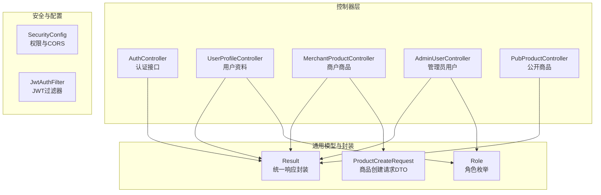
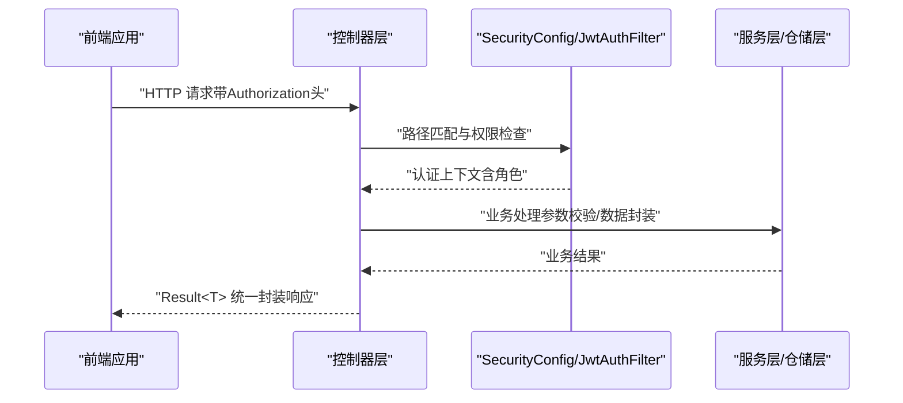
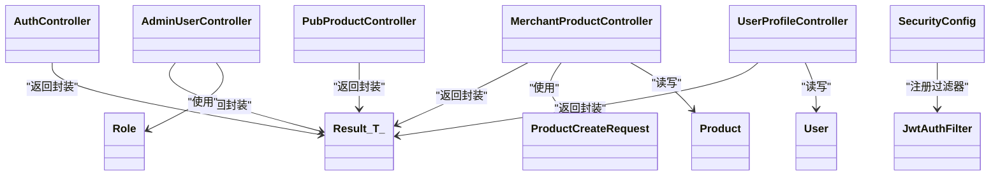

# 控制器层设计

<cite>
**本文引用的文件**
- [AuthController.java](file://backend/src/main/java/com/mall/controller/AuthController.java)
- [AdminUserController.java](file://backend/src/main/java/com/mall/controller/admin/AdminUserController.java)
- [MerchantProductController.java](file://backend/src/main/java/com/mall/controller/merchant/MerchantProductController.java)
- [UserProfileController.java](file://backend/src/main/java/com/mall/controller/user/UserProfileController.java)
- [PubProductController.java](file://backend/src/main/java/com/mall/controller/pub/PubProductController.java)
- [Result.java](file://backend/src/main/java/com/mall/dto/Result.java)
- [ProductCreateRequest.java](file://backend/src/main/java/com/mall/dto/ProductCreateRequest.java)
- [Role.java](file://backend/src/main/java/com/mall/common/Role.java)
- [SecurityConfig.java](file://backend/src/main/java/com/mall/config/SecurityConfig.java)
- [JwtAuthFilter.java](file://backend/src/main/java/com/mall/security/JwtAuthFilter.java)
- [GlobalExceptionHandler.java](file://backend/src/main/java/com/mall/exception/GlobalExceptionHandler.java)
- [User.java](file://backend/src/main/java/com/mall/entity/User.java)
- [Product.java](file://backend/src/main/java/com/mall/entity/Product.java)
- [application.yml](file://backend/src/main/resources/application.yml)
- [admin.js](file://frontend/src/api/admin.js)
- [user.js](file://frontend/src/api/user.js)
- [merchant.js](file://frontend/src/api/merchant.js)
</cite>

## 目录
1. [引言](#引言)
2. [项目结构](#项目结构)
3. [核心组件](#核心组件)
4. [架构总览](#架构总览)
5. [详细组件分析](#详细组件分析)
6. [依赖分析](#依赖分析)
7. [性能考虑](#性能考虑)
8. [故障排查指南](#故障排查指南)
9. [结论](#结论)
10. [附录](#附录)

## 引言
本文件面向电商商城系统的控制器层，系统性阐述RESTful API设计原则与控制器分层架构，覆盖用户控制器、商户控制器、管理员控制器的职责划分与接口设计；详解请求参数处理、响应数据封装、HTTP状态码使用规范；解释控制器层的权限验证机制、异常处理策略与数据校验规则，并提供完整API接口清单与请求/响应示例路径，帮助开发者设计符合RESTful规范的Web接口。

## 项目结构
后端采用Spring Boot + Spring Security + JPA，控制器层位于包 com.mall.controller 下，按角色划分为子包：
- admin：管理员端接口（用户、商户、分类、商品、订单、资讯、评价、报表等）
- merchant：商户端接口（商品、订单、库存、评价、报表等）
- user：用户端接口（个人资料、购物车、收藏、订单、评价、地址等）
- pub：公开接口（商品列表、详情、新品、销量排行、推荐等）
- auth：认证接口（登录、注册）

图表来源
- [AuthController.java:1-73](file://backend/src/main/java/com/mall/controller/AuthController.java#L1-L73)
- [UserProfileController.java:1-41](file://backend/src/main/java/com/mall/controller/user/UserProfileController.java#L1-L41)
- [MerchantProductController.java:1-180](file://backend/src/main/java/com/mall/controller/merchant/MerchantProductController.java#L1-L180)
- [AdminUserController.java:1-81](file://backend/src/main/java/com/mall/controller/admin/AdminUserController.java#L1-L81)
- [PubProductController.java:1-95](file://backend/src/main/java/com/mall/controller/pub/PubProductController.java#L1-L95)
- [Result.java:1-24](file://backend/src/main/java/com/mall/dto/Result.java#L1-L24)
- [ProductCreateRequest.java:1-32](file://backend/src/main/java/com/mall/dto/ProductCreateRequest.java#L1-L32)
- [Role.java:1-8](file://backend/src/main/java/com/mall/common/Role.java#L1-L8)
- [SecurityConfig.java:1-74](file://backend/src/main/java/com/mall/config/SecurityConfig.java#L1-L74)
- [JwtAuthFilter.java:1-57](file://backend/src/main/java/com/mall/security/JwtAuthFilter.java#L1-L57)

章节来源
- [application.yml:1-36](file://backend/src/main/resources/application.yml#L1-L36)

## 核心组件
- 统一响应封装 Result<T>：所有控制器返回值均通过 Result<T> 包装，包含 code、message、data 字段，默认成功 code=200，失败 code=400。
- 角色枚举 Role：ADMIN、MERCHANT、USER，用于权限控制与用户角色标识。
- 请求DTO ProductCreateRequest：商户创建/更新商品时使用的标准化请求对象。
- 安全配置 SecurityConfig：基于路径的权限控制、CORS、无状态会话、密码编码器。
- JWT过滤器 JwtAuthFilter：从 Authorization 头解析 Bearer Token，注入认证上下文。

章节来源
- [Result.java:1-24](file://backend/src/main/java/com/mall/dto/Result.java#L1-L24)
- [Role.java:1-8](file://backend/src/main/java/com/mall/common/Role.java#L1-L8)
- [ProductCreateRequest.java:1-32](file://backend/src/main/java/com/mall/dto/ProductCreateRequest.java#L1-L32)
- [SecurityConfig.java:1-74](file://backend/src/main/java/com/mall/config/SecurityConfig.java#L1-L74)
- [JwtAuthFilter.java:1-57](file://backend/src/main/java/com/mall/security/JwtAuthFilter.java#L1-L57)

## 架构总览
控制器层遵循“按角色分层”的RESTful设计，结合Spring Security进行路径级权限控制与JWT认证。请求流程概览：

图表来源
- [SecurityConfig.java:34-55](file://backend/src/main/java/com/mall/config/SecurityConfig.java#L34-L55)
- [JwtAuthFilter.java:30-47](file://backend/src/main/java/com/mall/security/JwtAuthFilter.java#L30-L47)
- [Result.java:16-22](file://backend/src/main/java/com/mall/dto/Result.java#L16-L22)

## 详细组件分析

### 认证控制器 AuthController
职责
- 提供登录与注册接口，返回统一 Result 封装。
- 登录时校验用户名、密码与角色；注册时校验必要字段并调用 AuthService 完成用户创建。

请求参数与响应
- POST /auth/login
  - 请求体：username、password、role
  - 成功返回：Result.ok(Map)，包含令牌与用户信息
  - 失败返回：Result.fail(message)
- POST /auth/register
  - 请求体：username、password、nickname、gender、email、phone、receiverName、receiverPhone、receiverAddress
  - 成功返回：Result.ok(Map) 包含 message
  - 失败返回：Result.fail(message)

章节来源
- [AuthController.java:18-71](file://backend/src/main/java/com/mall/controller/AuthController.java#L18-L71)

### 管理员控制器 AdminUserController
职责
- 管理端用户管理：分页查询（支持按角色过滤）、创建（密码加密）、更新（昵称、启用状态、商户绑定）、删除。
- 权限注解：基于路径 /admin/user，受 SecurityConfig 中 hasRole("ADMIN") 保护。

请求参数与响应
- GET /admin/user?role={ADMIN|USER}&page=&size=
  - 返回：Result.ok(List<User>)
- POST /admin/user
  - 请求体：username、password、nickname、role、merchantId（可选）
  - 成功返回：Result.ok(User)
- PUT /admin/user/{id}
  - 请求体：nickname（可选）、enabled（可选）、merchantId（可选）
  - 成功返回：Result.ok(User)
- DELETE /admin/user/{id}
  - 成功返回：Result.ok(null)

章节来源
- [AdminUserController.java:27-79](file://backend/src/main/java/com/mall/controller/admin/AdminUserController.java#L27-L79)
- [SecurityConfig.java:48-50](file://backend/src/main/java/com/mall/config/SecurityConfig.java#L48-L50)

### 商户控制器 MerchantProductController
职责
- 商户商品管理：分页查询、详情查询、创建、更新、删除。
- 当前商户ID由登录用户映射，确保只能操作自身商户下的商品。
- 商品创建/更新时支持“自定义分类名”自动创建或复用已有分类；支持将图片数组转换为逗号分隔字符串存储。

请求参数与响应
- GET /merchant/product?page=&size=
  - 成功返回：Result.ok(Page<Product>)
- GET /merchant/product/{id}
  - 成功返回：Result.ok(Product)
- POST /merchant/product
  - 请求体：ProductCreateRequest（名称、价格、库存、分类ID或分类名、图片列表/详情图、品牌、是否上架等）
  - 成功返回：Result.ok(Product)
- PUT /merchant/product/{id}
  - 请求体：ProductCreateRequest（同上）
  - 成功返回：Result.ok(Product)
- DELETE /merchant/product/{id}
  - 成功返回：Result.ok(null)

数据校验要点
- 名称非空校验
- 价格必须大于0
- 库存不能为负数
- 若提供分类名则自动创建或复用分类
- 图片列表转换为逗号分隔字符串

章节来源
- [MerchantProductController.java:36-178](file://backend/src/main/java/com/mall/controller/merchant/MerchantProductController.java#L36-L178)
- [ProductCreateRequest.java:14-31](file://backend/src/main/java/com/mall/dto/ProductCreateRequest.java#L14-L31)
- [User.java:60-62](file://backend/src/main/java/com/mall/entity/User.java#L60-L62)

### 用户控制器 UserProfileController
职责
- 当前登录用户资料查询与更新。
- 使用 Authentication 获取当前用户ID，避免越权访问。

请求参数与响应
- GET /user/profile
  - 成功返回：Result.ok(User)
- PUT /user/profile
  - 请求体：Map<String, Object>（昵称、性别、邮箱、电话、头像等）
  - 成功返回：Result.ok(User)

章节来源
- [UserProfileController.java:20-39](file://backend/src/main/java/com/mall/controller/user/UserProfileController.java#L20-L39)

### 公开控制器 PubProductController
职责
- 提供公开商品浏览能力：分页列表、按分类过滤、搜索、排序、详情、新品、销量排行、协同过滤推荐。
- 推荐接口需要传入 userId（登录用户）以实现个性化推荐。

请求参数与响应
- GET /pub/products?page=&size=&categoryId=&search=&sort=&direction=
  - 成功返回：Result.ok(Page<Product>)
- GET /pub/products/{id}
  - 成功返回：Result.ok(Product)
- GET /pub/products/new?size=
  - 成功返回：Result.ok(List<Product>)
- GET /pub/products/rank?size=
  - 成功返回：Result.ok(List<Product>)
- GET /pub/products/recommend?userId=&size=
  - 成功返回：Result.ok(List<Product>)

章节来源
- [PubProductController.java:24-93](file://backend/src/main/java/com/mall/controller/pub/PubProductController.java#L24-L93)

### 统一响应封装与异常处理
- Result<T>：成功 code=200，失败 code=400；统一封装 message 与 data。
- 全局异常：GlobalExceptionHandler 将运行时异常转换为 Result.fail(message)，避免前端直接看到错误堆栈。

章节来源
- [Result.java:16-22](file://backend/src/main/java/com/mall/dto/Result.java#L16-L22)
- [GlobalExceptionHandler.java:13-17](file://backend/src/main/java/com/mall/exception/GlobalExceptionHandler.java#L13-L17)

## 依赖分析
控制器层与安全、配置、DTO、实体之间的依赖关系如下：

图表来源
- [AuthController.java:1-73](file://backend/src/main/java/com/mall/controller/AuthController.java#L1-L73)
- [AdminUserController.java:1-81](file://backend/src/main/java/com/mall/controller/admin/AdminUserController.java#L1-L81)
- [MerchantProductController.java:1-180](file://backend/src/main/java/com/mall/controller/merchant/MerchantProductController.java#L1-L180)
- [UserProfileController.java:1-41](file://backend/src/main/java/com/mall/controller/user/UserProfileController.java#L1-L41)
- [PubProductController.java:1-95](file://backend/src/main/java/com/mall/controller/pub/PubProductController.java#L1-L95)
- [SecurityConfig.java:27-31](file://backend/src/main/java/com/mall/config/SecurityConfig.java#L27-L31)
- [JwtAuthFilter.java:24-28](file://backend/src/main/java/com/mall/security/JwtAuthFilter.java#L24-L28)
- [Result.java:1-24](file://backend/src/main/java/com/mall/dto/Result.java#L1-L24)
- [ProductCreateRequest.java:1-32](file://backend/src/main/java/com/mall/dto/ProductCreateRequest.java#L1-L32)
- [Role.java:1-8](file://backend/src/main/java/com/mall/common/Role.java#L1-L8)
- [User.java:1-88](file://backend/src/main/java/com/mall/entity/User.java#L1-L88)
- [Product.java:1-101](file://backend/src/main/java/com/mall/entity/Product.java#L1-L101)

## 性能考虑
- 分页查询：控制器普遍使用 PageRequest，建议前端合理设置 page、size，避免一次性加载过多数据。
- 排序与搜索：公开商品列表支持按 price/sales/createdAt 排序，搜索与分类过滤在服务层实现，注意数据库索引优化。
- 图片存储：详情图以逗号分隔字符串存储，建议在服务层进行去重与大小限制，避免超长字符串影响序列化性能。
- JWT无状态：SecurityConfig 设置为无状态会话，减少服务器端会话存储压力。

## 故障排查指南
常见问题与定位
- 403/401 未授权
  - 检查请求头 Authorization 是否携带 Bearer Token，且角色满足 /admin、/merchant、/user 路径要求。
  - 参考：[SecurityConfig.java:48-50](file://backend/src/main/java/com/mall/config/SecurityConfig.java#L48-L50)
- 参数校验失败
  - 登录/注册必填字段缺失、商户商品价格/库存校验不通过、用户资料更新字段非法。
  - 参考：[AuthController.java:23-28](file://backend/src/main/java/com/mall/controller/AuthController.java#L23-L28)
  - 参考：[MerchantProductController.java:59-67](file://backend/src/main/java/com/mall/controller/merchant/MerchantProductController.java#L59-L67)
  - 参考：[UserProfileController.java:33-38](file://backend/src/main/java/com/mall/controller/user/UserProfileController.java#L33-L38)
- 业务异常统一处理
  - 运行时异常会被全局处理器转换为 Result.fail(message)，查看 message 即可定位问题。
  - 参考：[GlobalExceptionHandler.java:13-17](file://backend/src/main/java/com/mall/exception/GlobalExceptionHandler.java#L13-L17)

章节来源
- [SecurityConfig.java:34-55](file://backend/src/main/java/com/mall/config/SecurityConfig.java#L34-L55)
- [JwtAuthFilter.java:30-47](file://backend/src/main/java/com/mall/security/JwtAuthFilter.java#L30-L47)
- [GlobalExceptionHandler.java:13-17](file://backend/src/main/java/com/mall/exception/GlobalExceptionHandler.java#L13-L17)

## 结论
本控制器层设计严格遵循RESTful风格，按角色分层清晰、职责明确；通过统一响应封装与全局异常处理提升一致性与可维护性；结合Spring Security与JWT实现细粒度权限控制与无状态认证。建议在后续迭代中进一步完善参数校验与数据校验规则，增强日志与监控埋点，持续优化分页与搜索性能。

## 附录

### RESTful API 接口清单与示例路径
以下为控制器层提供的主要接口，示例路径与参数来源于前端API文件与控制器源码。

- 认证
  - POST /auth/login
    - 示例：[admin.js:1-129](file://frontend/src/api/admin.js#L1-L129)、[user.js:1-162](file://frontend/src/api/user.js#L1-L162)、[merchant.js:1-135](file://frontend/src/api/merchant.js#L1-L135)
    - 控制器：[AuthController.java:18-35](file://backend/src/main/java/com/mall/controller/AuthController.java#L18-L35)
  - POST /auth/register
    - 示例：[admin.js:1-129](file://frontend/src/api/admin.js#L1-L129)、[user.js:1-162](file://frontend/src/api/user.js#L1-L162)、[merchant.js:1-135](file://frontend/src/api/merchant.js#L1-L135)
    - 控制器：[AuthController.java:37-71](file://backend/src/main/java/com/mall/controller/AuthController.java#L37-L71)

- 管理员
  - GET /admin/user
    - 示例：[admin.js:13-16](file://frontend/src/api/admin.js#L13-L16)
    - 控制器：[AdminUserController.java:27-36](file://backend/src/main/java/com/mall/controller/admin/AdminUserController.java#L27-L36)
  - POST /admin/user
    - 示例：[admin.js:18-21](file://frontend/src/api/admin.js#L18-L21)
    - 控制器：[AdminUserController.java:38-59](file://backend/src/main/java/com/mall/controller/admin/AdminUserController.java#L38-L59)
  - PUT /admin/user/{id}
    - 示例：[admin.js:23-26](file://frontend/src/api/admin.js#L23-L26)
    - 控制器：[AdminUserController.java:61-72](file://backend/src/main/java/com/mall/controller/admin/AdminUserController.java#L61-L72)
  - DELETE /admin/user/{id}
    - 示例：[admin.js:28-31](file://frontend/src/api/admin.js#L28-L31)
    - 控制器：[AdminUserController.java:74-79](file://backend/src/main/java/com/mall/controller/admin/AdminUserController.java#L74-L79)

- 商户
  - GET /merchant/product
    - 示例：[merchant.js:13-16](file://frontend/src/api/merchant.js#L13-L16)
    - 控制器：[MerchantProductController.java:36-44](file://backend/src/main/java/com/mall/controller/merchant/MerchantProductController.java#L36-L44)
  - GET /merchant/product/{id}
    - 示例：[merchant.js:18-21](file://frontend/src/api/merchant.js#L18-L21)
    - 控制器：[MerchantProductController.java:46-54](file://backend/src/main/java/com/mall/controller/merchant/MerchantProductController.java#L46-L54)
  - POST /merchant/product
    - 示例：[merchant.js:23-26](file://frontend/src/api/merchant.js#L23-L26)
    - 控制器：[MerchantProductController.java:56-114](file://backend/src/main/java/com/mall/controller/merchant/MerchantProductController.java#L56-L114)
  - PUT /merchant/product/{id}
    - 示例：[merchant.js:28-31](file://frontend/src/api/merchant.js#L28-L31)
    - 控制器：[MerchantProductController.java:116-167](file://backend/src/main/java/com/mall/controller/merchant/MerchantProductController.java#L116-L167)
  - DELETE /merchant/product/{id}
    - 示例：[merchant.js:33-36](file://frontend/src/api/merchant.js#L33-L36)
    - 控制器：[MerchantProductController.java:169-178](file://backend/src/main/java/com/mall/controller/merchant/MerchantProductController.java#L169-L178)

- 用户
  - GET /user/profile
    - 示例：[user.js:8-11](file://frontend/src/api/user.js#L8-L11)
    - 控制器：[UserProfileController.java:20-27](file://backend/src/main/java/com/mall/controller/user/UserProfileController.java#L20-L27)
  - PUT /user/profile
    - 示例：[user.js:13-16](file://frontend/src/api/user.js#L13-L16)
    - 控制器：[UserProfileController.java:29-39](file://backend/src/main/java/com/mall/controller/user/UserProfileController.java#L29-L39)

- 公开
  - GET /pub/products
    - 示例：[user.js:1-162](file://frontend/src/api/user.js#L1-L162)
    - 控制器：[PubProductController.java:24-46](file://backend/src/main/java/com/mall/controller/pub/PubProductController.java#L24-L46)
  - GET /pub/products/{id}
    - 示例：[user.js:1-162](file://frontend/src/api/user.js#L1-L162)
    - 控制器：[PubProductController.java:63-69](file://backend/src/main/java/com/mall/controller/pub/PubProductController.java#L63-L69)
  - GET /pub/products/new
    - 示例：[user.js:1-162](file://frontend/src/api/user.js#L1-L162)
    - 控制器：[PubProductController.java:71-76](file://backend/src/main/java/com/mall/controller/pub/PubProductController.java#L71-L76)
  - GET /pub/products/rank
    - 示例：[user.js:1-162](file://frontend/src/api/user.js#L1-L162)
    - 控制器：[PubProductController.java:78-83](file://backend/src/main/java/com/mall/controller/pub/PubProductController.java#L78-L83)
  - GET /pub/products/recommend
    - 示例：[user.js:1-162](file://frontend/src/api/user.js#L1-L162)
    - 控制器：[PubProductController.java:85-93](file://backend/src/main/java/com/mall/controller/pub/PubProductController.java#L85-L93)

### 请求/响应示例路径
- 登录成功响应（令牌与用户信息）
  - 示例：[admin.js:1-129](file://frontend/src/api/admin.js#L1-L129)、[user.js:1-162](file://frontend/src/api/user.js#L1-L162)、[merchant.js:1-135](file://frontend/src/api/merchant.js#L1-L135)
  - 控制器：[AuthController.java:18-35](file://backend/src/main/java/com/mall/controller/AuthController.java#L18-L35)
- 注册成功响应（message）
  - 示例：[admin.js:1-129](file://frontend/src/api/admin.js#L1-L129)、[user.js:1-162](file://frontend/src/api/user.js#L1-L162)、[merchant.js:1-135](file://frontend/src/api/merchant.js#L1-L135)
  - 控制器：[AuthController.java:37-71](file://backend/src/main/java/com/mall/controller/AuthController.java#L37-L71)
- 商品创建/更新成功响应（Product）
  - 示例：[merchant.js:1-135](file://frontend/src/api/merchant.js#L1-L135)
  - 控制器：[MerchantProductController.java:56-114](file://backend/src/main/java/com/mall/controller/merchant/MerchantProductController.java#L56-L114)

### 数据模型与DTO
- 用户 User
  - 关键字段：username、password、nickname、email、phone、avatar、gender、receiverName、receiverPhone、receiverAddress、role、merchantId、enabled、createdAt、updatedAt
  - 参考：[User.java:17-88](file://backend/src/main/java/com/mall/entity/User.java#L17-L88)
- 商品 Product
  - 关键字段：merchantId、categoryId、name、description、detailDescription、image、imageList、detailImages、brand、attributes、price、originalPrice、unit、stock、sales、onSale、isNew、createdAt、updatedAt
  - 参考：[Product.java:16-101](file://backend/src/main/java/com/mall/entity/Product.java#L16-L101)
- 请求DTO ProductCreateRequest
  - 关键字段：name、description、detailDescription、detailImages、images、brand、attributes、unit、categoryId、categoryName、price、originalPrice、stock、image、isNew、onSale
  - 参考：[ProductCreateRequest.java:14-31](file://backend/src/main/java/com/mall/dto/ProductCreateRequest.java#L14-L31)