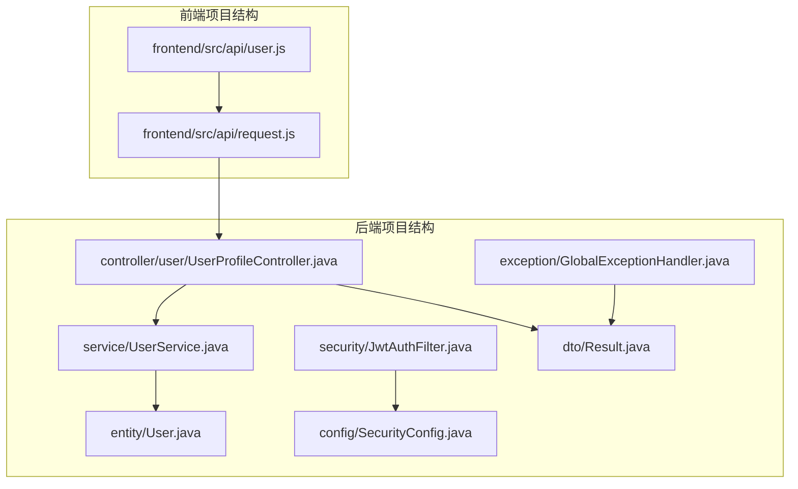
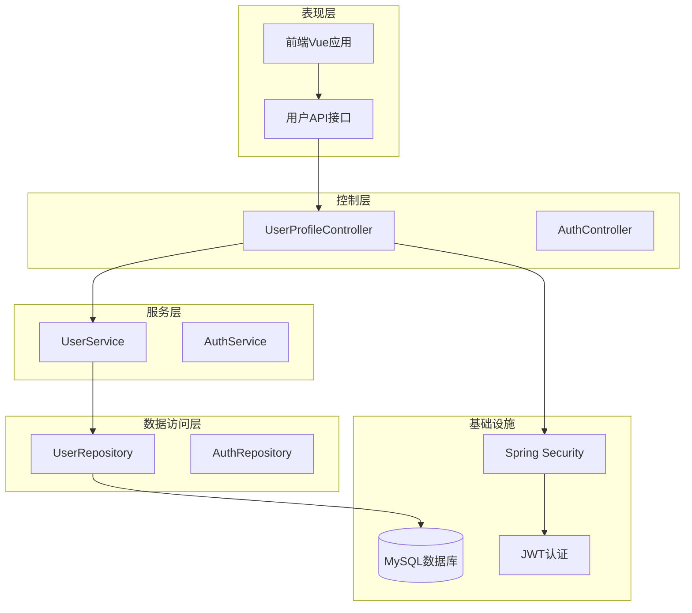
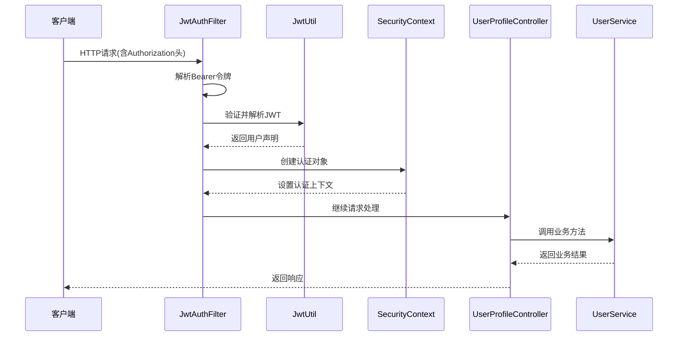
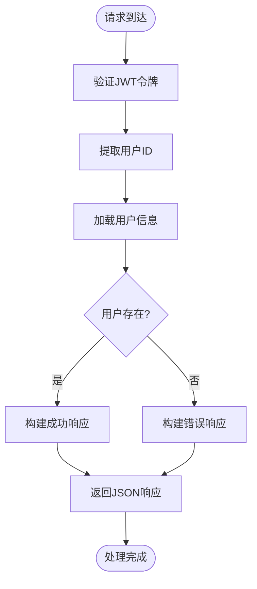
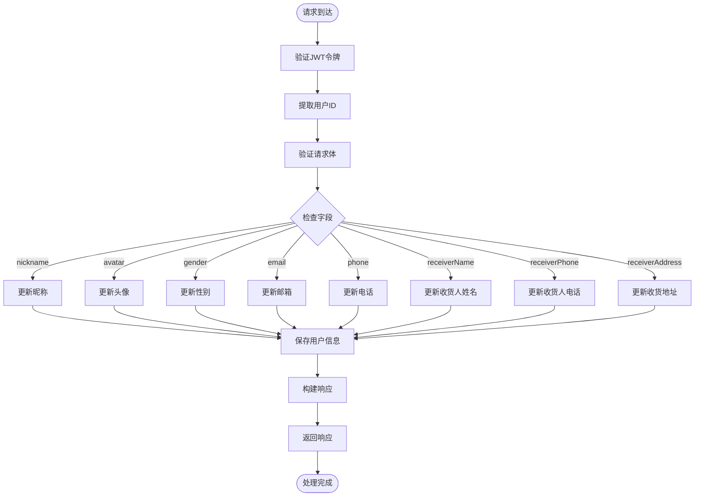
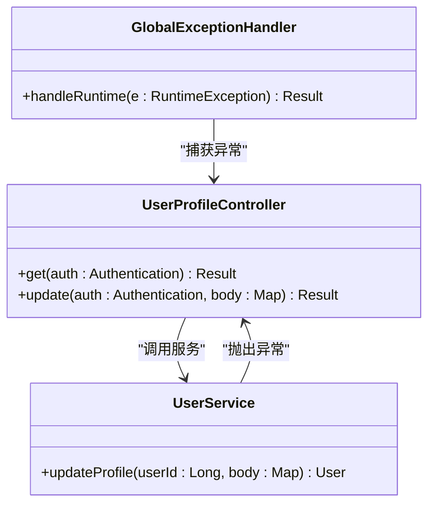
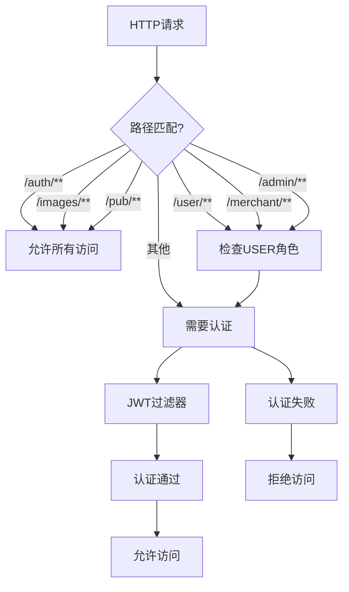
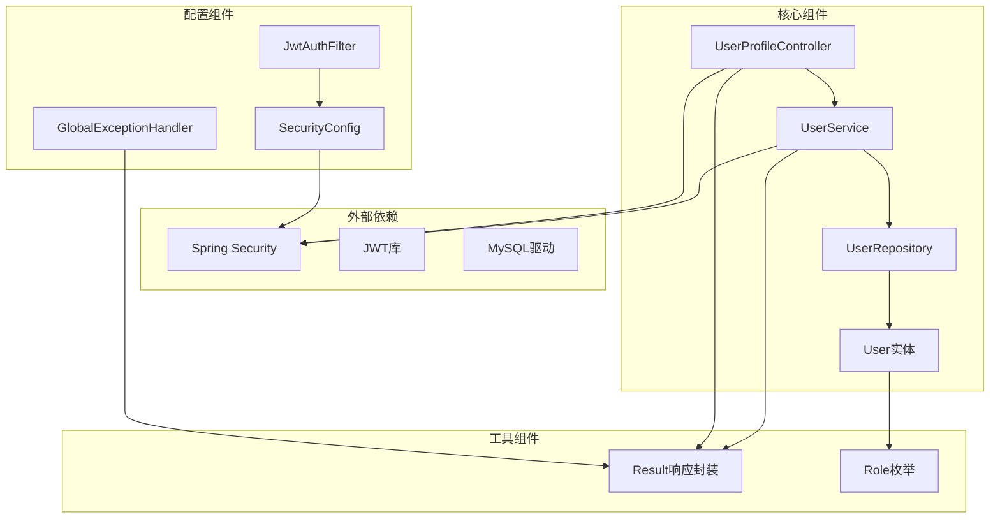
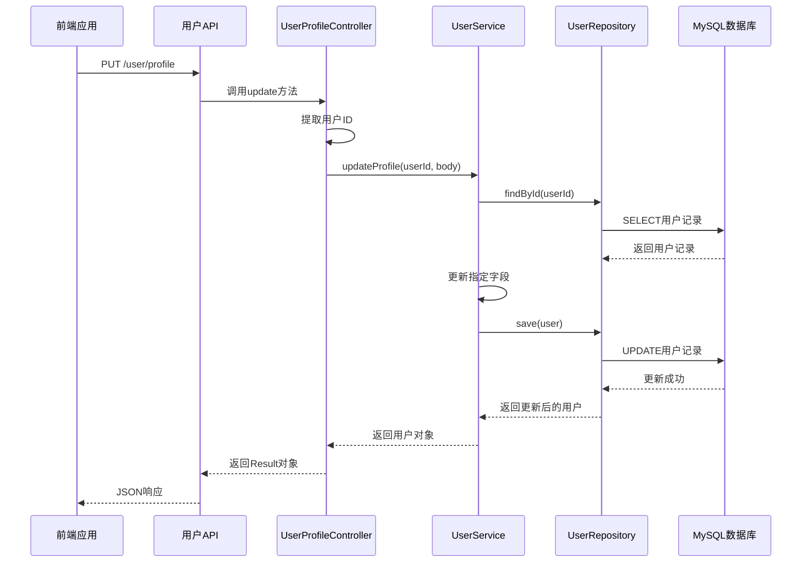

# 用户个人资料控制器

<cite>
**本文档引用的文件**
- [UserProfileController.java](file://backend/src/main/java/com/mall/controller/user/UserProfileController.java)
- [UserService.java](file://backend/src/main/java/com/mall/service/UserService.java)
- [User.java](file://backend/src/main/java/com/mall/entity/User.java)
- [JwtAuthFilter.java](file://backend/src/main/java/com/mall/security/JwtAuthFilter.java)
- [SecurityConfig.java](file://backend/src/main/java/com/mall/config/SecurityConfig.java)
- [Result.java](file://backend/src/main/java/com/mall/dto/Result.java)
- [GlobalExceptionHandler.java](file://backend/src/main/java/com/mall/exception/GlobalExceptionHandler.java)
- [Role.java](file://backend/src/main/java/com/mall/common/Role.java)
- [application.yml](file://backend/src/main/resources/application.yml)
- [user.js](file://frontend/src/api/user.js)
- [request.js](file://frontend/src/api/request.js)
</cite>

## 目录
1. [简介](#简介)
2. [项目结构](#项目结构)
3. [核心组件](#核心组件)
4. [架构概览](#架构概览)
5. [详细组件分析](#详细组件分析)
6. [依赖关系分析](#依赖关系分析)
7. [性能考虑](#性能考虑)
8. [故障排除指南](#故障排除指南)
9. [结论](#结论)

## 简介

用户个人资料控制器是电商系统中负责管理用户个人信息的核心组件。该控制器提供了两个主要功能：
- 获取当前登录用户的个人资料信息
- 更新当前登录用户的个人资料信息

该实现采用Spring Boot框架构建，使用JWT（JSON Web Token）进行身份认证，通过Spring Security实现权限控制，并采用统一的响应格式。

## 项目结构

用户个人资料控制器位于后端项目的用户控制器包中，遵循标准的分层架构设计：

**图表来源**
- [UserProfileController.java:1-41](file://backend/src/main/java/com/mall/controller/user/UserProfileController.java#L1-L41)
- [UserService.java:1-42](file://backend/src/main/java/com/mall/service/UserService.java#L1-L42)
- [User.java:1-88](file://backend/src/main/java/com/mall/entity/User.java#L1-L88)

**章节来源**
- [UserProfileController.java:1-41](file://backend/src/main/java/com/mall/controller/user/UserProfileController.java#L1-L41)
- [UserService.java:1-42](file://backend/src/main/java/com/mall/service/UserService.java#L1-L42)
- [User.java:1-88](file://backend/src/main/java/com/mall/entity/User.java#L1-L88)

## 核心组件

### 用户个人资料控制器

用户个人资料控制器是一个RESTful API控制器，提供以下核心功能：

#### 主要特性
- **基于注解的路由映射**：使用`@RestController`和`@RequestMapping`注解
- **依赖注入**：通过构造函数注入UserService实例
- **方法级权限控制**：使用`@PreAuthorize`注解控制访问权限
- **统一响应格式**：返回标准化的Result对象

#### 接口设计
- **GET /user/profile**：获取当前登录用户信息
- **PUT /user/profile**：更新当前登录用户资料

**章节来源**
- [UserProfileController.java:12-41](file://backend/src/main/java/com/mall/controller/user/UserProfileController.java#L12-L41)

### 用户服务层

用户服务层负责处理用户相关的业务逻辑：

#### 核心功能
- **用户查询**：根据ID获取用户信息
- **资料更新**：批量更新用户个人信息
- **数据验证**：确保数据的有效性和完整性

#### 数据处理
- 支持昵称、头像、性别、邮箱、电话等字段的更新
- 自动处理空值和空白字符
- 使用事务性操作确保数据一致性

**章节来源**
- [UserService.java:14-42](file://backend/src/main/java/com/mall/service/UserService.java#L14-L42)

### 用户实体模型

用户实体定义了数据库表结构和业务属性：

#### 数据库映射
- **主键**：自增ID
- **唯一约束**：用户名
- **枚举类型**：角色类型
- **时间戳**：创建和更新时间

#### 字段定义
- 基本信息：用户名、密码、昵称、头像
- 联系信息：邮箱、电话
- 收货信息：收货人姓名、电话、地址
- 系统信息：角色、启用状态、时间戳

**章节来源**
- [User.java:17-88](file://backend/src/main/java/com/mall/entity/User.java#L17-L88)

## 架构概览

系统采用分层架构设计，各层职责明确：

**图表来源**
- [UserProfileController.java:12-41](file://backend/src/main/java/com/mall/controller/user/UserProfileController.java#L12-L41)
- [UserService.java:12-42](file://backend/src/main/java/com/mall/service/UserService.java#L12-L42)
- [SecurityConfig.java:25-55](file://backend/src/main/java/com/mall/config/SecurityConfig.java#L25-L55)

## 详细组件分析

### 认证参数使用机制

#### JWT令牌解析流程

**图表来源**
- [JwtAuthFilter.java:30-47](file://backend/src/main/java/com/mall/security/JwtAuthFilter.java#L30-L47)
- [UserProfileController.java:21-39](file://backend/src/main/java/com/mall/controller/user/UserProfileController.java#L21-L39)

#### Authentication参数提取机制

在UserProfileController中，用户ID通过以下方式提取：

1. **认证对象获取**：方法参数使用`Authentication auth`接收Spring Security的认证对象
2. **主体信息提取**：通过`auth.getPrincipal()`获取认证主体
3. **类型转换**：将主体转换为Long类型的用户ID

这种设计确保了只有经过身份验证的用户才能访问个人资料接口。

**章节来源**
- [UserProfileController.java:22-26](file://backend/src/main/java/com/mall/controller/user/UserProfileController.java#L22-L26)
- [JwtAuthFilter.java:37-41](file://backend/src/main/java/com/mall/security/JwtAuthFilter.java#L37-L41)

### GET /user/profile 接口实现

#### 请求处理流程

**图表来源**
- [UserProfileController.java:20-27](file://backend/src/main/java/com/mall/controller/user/UserProfileController.java#L20-L27)

#### 响应数据格式

成功的响应包含以下结构：
- **状态码**：200
- **消息**：success
- **数据**：用户对象（不包含敏感信息如密码）

**章节来源**
- [UserProfileController.java:22-26](file://backend/src/main/java/com/mall/controller/user/UserProfileController.java#L22-L26)
- [Result.java:16-18](file://backend/src/main/java/com/mall/dto/Result.java#L16-L18)

### PUT /user/profile 接口实现

#### 请求参数处理

**图表来源**
- [UserService.java:22-34](file://backend/src/main/java/com/mall/service/UserService.java#L22-L34)

#### 参数验证策略

1. **字段检查**：使用`containsKey()`方法检查请求体中是否存在特定字段
2. **数据转换**：通过`toStr()`方法处理空值和空白字符
3. **原子性更新**：只更新提供的字段，未提供的字段保持不变

**章节来源**
- [UserService.java:23-33](file://backend/src/main/java/com/mall/service/UserService.java#L23-L33)

### 错误处理策略

#### 全局异常处理

系统采用全局异常处理器统一处理运行时异常：

**图表来源**
- [GlobalExceptionHandler.java:13-17](file://backend/src/main/java/com/mall/exception/GlobalExceptionHandler.java#L13-L17)
- [UserProfileController.java:36-38](file://backend/src/main/java/com/mall/controller/user/UserProfileController.java#L36-L38)

#### 错误响应格式

所有错误响应遵循统一格式：
- **状态码**：400
- **消息**：错误描述信息
- **数据**：null

**章节来源**
- [GlobalExceptionHandler.java:13-17](file://backend/src/main/java/com/mall/exception/GlobalExceptionHandler.java#L13-L17)
- [Result.java:20-22](file://backend/src/main/java/com/mall/dto/Result.java#L20-L22)

### 权限验证机制

#### Spring Security配置

系统通过SecurityConfig类配置权限控制：

**图表来源**
- [SecurityConfig.java:39-52](file://backend/src/main/java/com/mall/config/SecurityConfig.java#L39-L52)

#### 角色权限分配

系统支持三种用户角色：
- **USER**：普通用户，可访问个人资料接口
- **MERCHANT**：商户运营人员
- **ADMIN**：系统管理员

**章节来源**
- [SecurityConfig.java:48-50](file://backend/src/main/java/com/mall/config/SecurityConfig.java#L48-L50)
- [Role.java:3-7](file://backend/src/main/java/com/mall/common/Role.java#L3-L7)

## 依赖关系分析

### 组件依赖图

**图表来源**
- [UserProfileController.java:3-8](file://backend/src/main/java/com/mall/controller/user/UserProfileController.java#L3-L8)
- [UserService.java:3-7](file://backend/src/main/java/com/mall/service/UserService.java#L3-L7)
- [SecurityConfig.java:3-14](file://backend/src/main/java/com/mall/config/SecurityConfig.java#L3-L14)

### 数据流分析

#### 用户资料更新流程

**图表来源**
- [UserProfileController.java:30-39](file://backend/src/main/java/com/mall/controller/user/UserProfileController.java#L30-L39)
- [UserService.java:22-34](file://backend/src/main/java/com/mall/service/UserService.java#L22-L34)

**章节来源**
- [UserProfileController.java:18-39](file://backend/src/main/java/com/mall/controller/user/UserProfileController.java#L18-L39)
- [UserService.java:16-34](file://backend/src/main/java/com/mall/service/UserService.java#L16-L34)

## 性能考虑

### 缓存策略

系统目前采用以下缓存策略：
- **数据库连接池**：通过JPA配置自动管理
- **查询优化**：使用懒加载避免不必要的关联查询
- **事务管理**：合理使用事务边界减少数据库锁定

### 并发处理

- **线程安全**：Spring组件默认单例模式，无状态设计
- **乐观锁**：通过版本字段防止并发更新冲突
- **连接池**：数据库连接自动管理，避免连接泄漏

### 监控指标

建议添加以下监控点：
- API响应时间统计
- 数据库查询性能监控
- JWT令牌验证成功率
- 用户操作日志记录

## 故障排除指南

### 常见问题及解决方案

#### 认证失败问题

**症状**：返回401未授权或403禁止访问
**原因**：
- JWT令牌过期或无效
- 请求头缺少Authorization头
- 用户权限不足

**解决方案**：
1. 检查前端是否正确设置Authorization头
2. 验证JWT令牌格式和有效期
3. 确认用户角色权限

#### 用户不存在问题

**症状**：返回"用户不存在"错误
**原因**：
- 用户ID与令牌不匹配
- 用户已被删除
- 令牌被篡改

**解决方案**：
1. 重新登录获取新令牌
2. 检查用户状态
3. 验证令牌完整性

#### 数据更新失败

**症状**：用户资料更新操作失败
**原因**：
- 数据库连接异常
- 事务回滚
- 数据验证失败

**解决方案**：
1. 检查数据库连接状态
2. 查看事务日志
3. 验证输入数据格式

**章节来源**
- [GlobalExceptionHandler.java:13-17](file://backend/src/main/java/com/mall/exception/GlobalExceptionHandler.java#L13-L17)
- [UserProfileController.java:36-38](file://backend/src/main/java/com/mall/controller/user/UserProfileController.java#L36-L38)

### 调试技巧

1. **启用调试日志**：在application.yml中调整日志级别
2. **检查请求头**：确认Authorization头格式正确
3. **验证令牌内容**：使用JWT解码工具检查令牌声明
4. **数据库检查**：验证用户记录状态和字段值

**章节来源**
- [application.yml:32-36](file://backend/src/main/resources/application.yml#L32-L36)

## 结论

用户个人资料控制器实现了完整的用户个人信息管理功能，具有以下特点：

### 技术优势
- **安全性**：采用JWT认证和Spring Security权限控制
- **可维护性**：清晰的分层架构和依赖注入
- **可扩展性**：模块化设计便于功能扩展
- **可靠性**：统一的异常处理和响应格式

### 最佳实践
- **认证机制**：使用标准JWT协议确保安全性
- **权限控制**：基于角色的细粒度权限管理
- **数据保护**：敏感信息（如密码）不返回给客户端
- **错误处理**：统一的错误响应格式便于前端处理

### 改进建议
1. **添加输入验证**：对用户输入进行更严格的验证
2. **实现缓存**：增加用户信息缓存提高性能
3. **增强日志**：添加详细的审计日志
4. **完善测试**：增加单元测试和集成测试覆盖率

该控制器为整个电商系统的用户管理奠定了坚实的基础，为后续的功能扩展提供了良好的架构支撑。