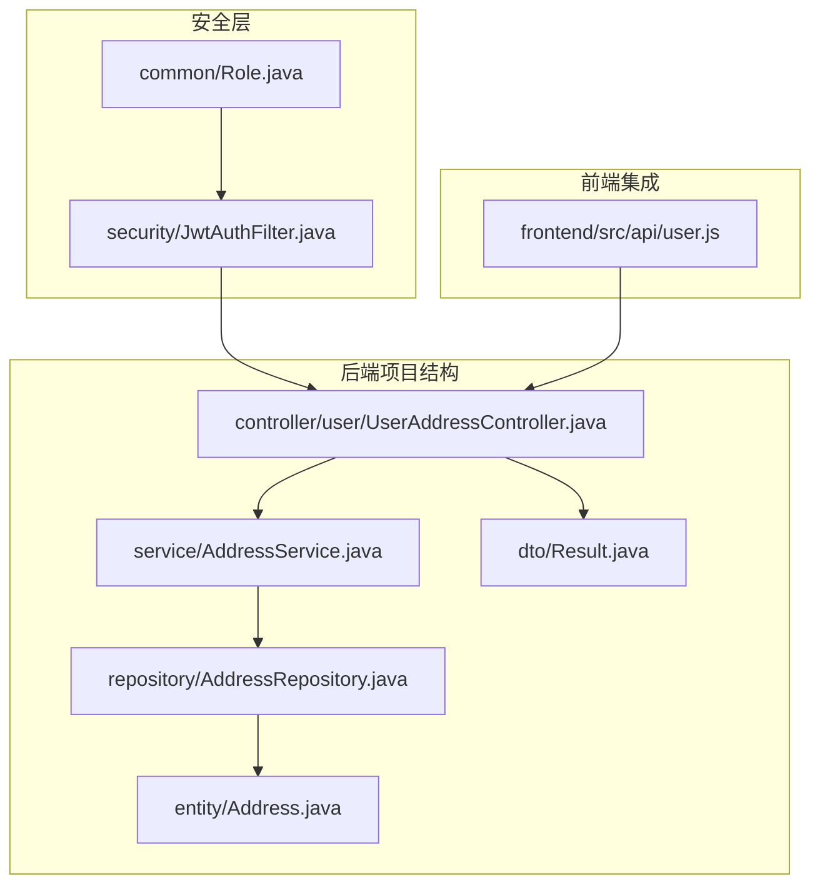
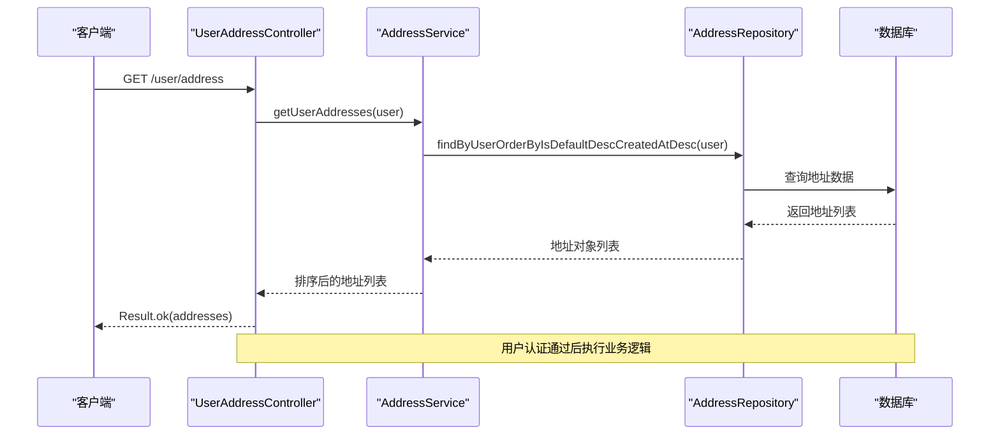
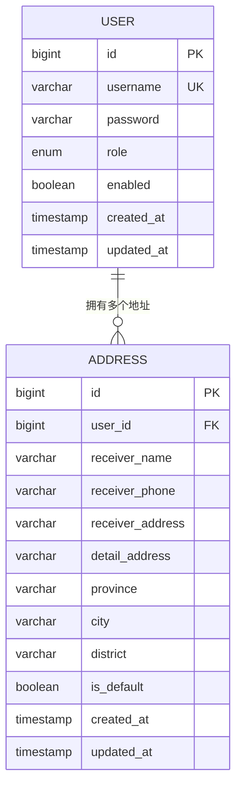
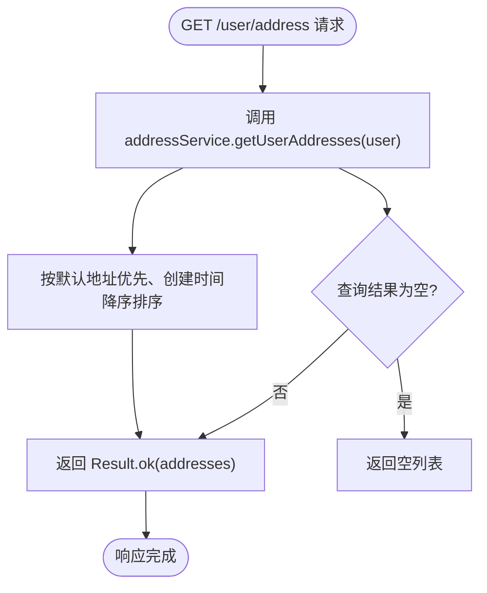
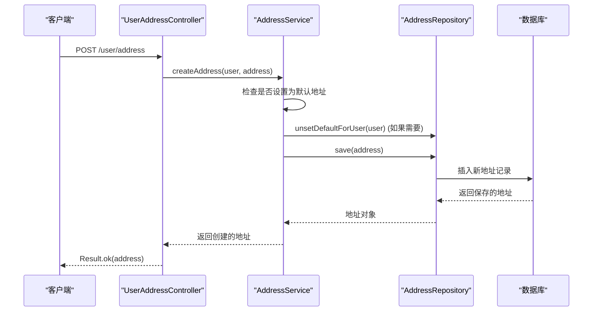
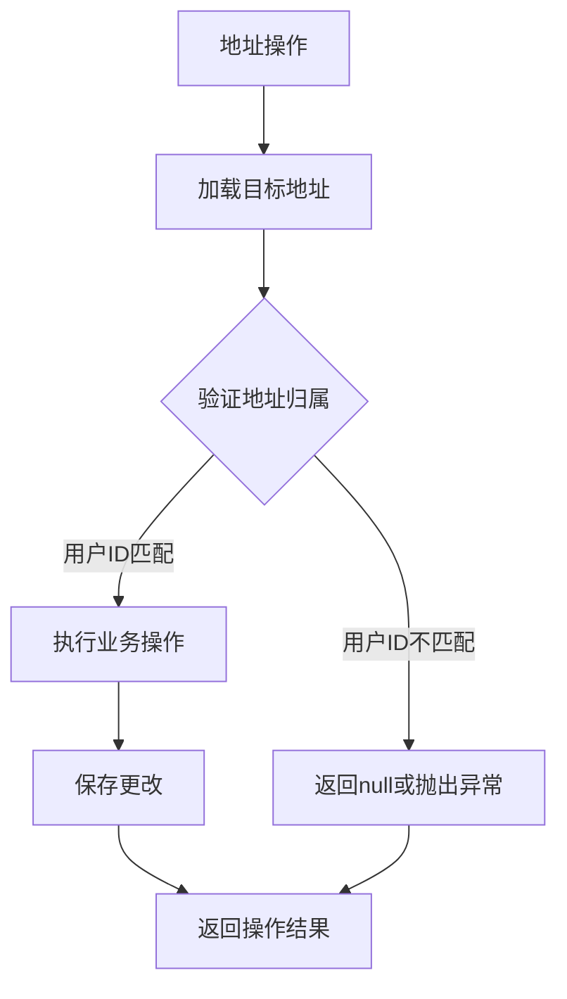
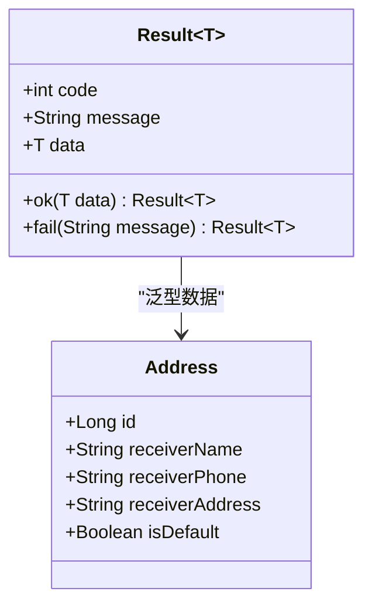
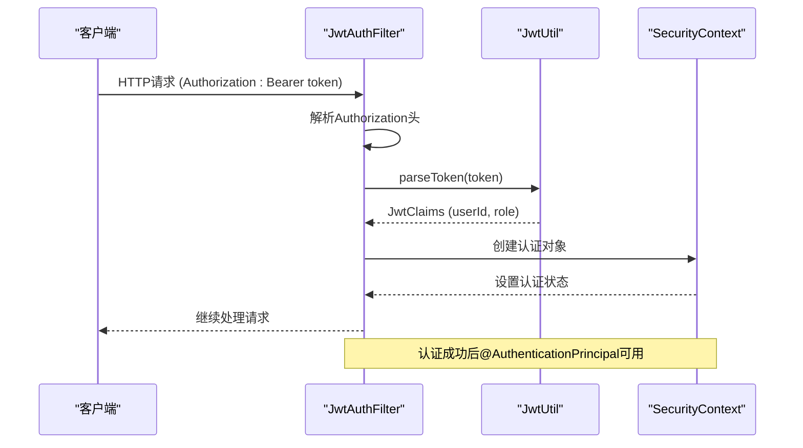

# 用户地址控制器

<cite>
**本文档引用的文件**
- [UserAddressController.java](file://backend/src/main/java/com/mall/controller/user/UserAddressController.java)
- [AddressService.java](file://backend/src/main/java/com/mall/service/AddressService.java)
- [AddressRepository.java](file://backend/src/main/java/com/mall/repository/AddressRepository.java)
- [Address.java](file://backend/src/main/java/com/mall/entity/Address.java)
- [Result.java](file://backend/src/main/java/com/mall/dto/Result.java)
- [JwtAuthFilter.java](file://backend/src/main/java/com/mall/security/JwtAuthFilter.java)
- [application.yml](file://backend/src/main/resources/application.yml)
- [user.js](file://frontend/src/api/user.js)
- [Role.java](file://backend/src/main/java/com/mall/common/Role.java)
- [User.java](file://backend/src/main/java/com/mall/entity/User.java)
</cite>

## 目录
1. [简介](#简介)
2. [项目结构](#项目结构)
3. [核心组件](#核心组件)
4. [架构概览](#架构概览)
5. [详细组件分析](#详细组件分析)
6. [依赖关系分析](#依赖关系分析)
7. [性能考虑](#性能考虑)
8. [故障排除指南](#故障排除指南)
9. [结论](#结论)

## 简介

用户地址控制器是电商系统中负责管理用户收货地址的核心组件。该控制器实现了完整的地址管理功能，包括地址列表查询、新增地址、更新地址、删除地址、设置默认地址等操作。通过RESTful API设计，为前端提供了标准化的地址管理接口。

本控制器采用Spring Boot框架构建，结合JWT认证机制，确保只有经过身份验证的用户才能访问其个人地址信息。系统遵循分层架构设计，将业务逻辑、数据访问和表现层清晰分离。

## 项目结构

用户地址控制器位于后端项目的用户控制层，采用标准的MVC架构模式：



**图表来源**
- [UserAddressController.java:1-73](file://backend/src/main/java/com/mall/controller/user/UserAddressController.java#L1-L73)
- [AddressService.java:1-91](file://backend/src/main/java/com/mall/service/AddressService.java#L1-L91)
- [AddressRepository.java:1-22](file://backend/src/main/java/com/mall/repository/AddressRepository.java#L1-L22)

**章节来源**
- [UserAddressController.java:1-73](file://backend/src/main/java/com/mall/controller/user/UserAddressController.java#L1-L73)
- [application.yml:1-36](file://backend/src/main/resources/application.yml#L1-L36)

## 核心组件

### 用户地址控制器

UserAddressController是地址管理功能的入口点，提供以下RESTful接口：

- **GET /user/address** - 获取当前用户的地址列表
- **GET /user/address/{id}** - 获取指定地址详情
- **POST /user/address** - 新增地址
- **PUT /user/address/{id}** - 更新地址
- **DELETE /user/address/{id}** - 删除地址
- **PUT /user/address/{id}/default** - 设置默认地址
- **GET /user/address/default** - 获取默认地址

### 地址服务层

AddressService封装了所有地址相关的业务逻辑，包括：
- 用户地址查询和排序
- 地址创建、更新、删除
- 默认地址管理和设置
- 数据一致性保证

### 地址仓储层

AddressRepository提供数据访问功能，支持：
- 基于用户ID的地址查询
- 默认地址查找
- 地址计数统计

**章节来源**
- [UserAddressController.java:13-72](file://backend/src/main/java/com/mall/controller/user/UserAddressController.java#L13-L72)
- [AddressService.java:12-90](file://backend/src/main/java/com/mall/service/AddressService.java#L12-L90)
- [AddressRepository.java:11-21](file://backend/src/main/java/com/mall/repository/AddressRepository.java#L11-L21)

## 架构概览

用户地址控制器采用分层架构设计，确保关注点分离和代码可维护性：



**图表来源**
- [UserAddressController.java:19-23](file://backend/src/main/java/com/mall/controller/user/UserAddressController.java#L19-L23)
- [AddressService.java:17-19](file://backend/src/main/java/com/mall/service/AddressService.java#L17-L19)
- [AddressRepository.java:13-15](file://backend/src/main/java/com/mall/repository/AddressRepository.java#L13-L15)

### 数据模型关系



**图表来源**
- [User.java:17-75](file://backend/src/main/java/com/mall/entity/User.java#L17-L75)
- [Address.java:10-47](file://backend/src/main/java/com/mall/entity/Address.java#L10-L47)

## 详细组件分析

### UserAddressController 实现分析

UserAddressController采用Lombok的@RequiredArgsConstructor注解自动注入AddressService依赖，体现了依赖注入的最佳实践。

#### 认证机制

控制器使用@AuthenticationPrincipal注解从安全上下文中提取当前认证用户信息，确保每个地址操作都绑定到正确的用户上下文。

#### 地址列表查询



**图表来源**
- [UserAddressController.java:19-23](file://backend/src/main/java/com/mall/controller/user/UserAddressController.java#L19-L23)
- [AddressService.java:17-19](file://backend/src/main/java/com/mall/service/AddressService.java#L17-L19)

#### 地址创建流程



**图表来源**
- [UserAddressController.java:34-38](file://backend/src/main/java/com/mall/controller/user/UserAddressController.java#L34-L38)
- [AddressService.java:27-34](file://backend/src/main/java/com/mall/service/AddressService.java#L27-L34)

#### 默认地址设置逻辑

```mermaid
flowchart TD
Start([PUT /user/address/{id}/default]) --> ValidateAddress["验证地址是否存在且属于当前用户"]
ValidateAddress --> AddressExists{"地址存在?"}
AddressExists --> |否| ReturnError["返回错误: 地址不存在"]
AddressExists --> |是| UnsetDefault["清除用户其他默认地址"]
UnsetDefault --> SetDefault["设置当前地址为默认地址"]
SetDefault --> SaveAddress["保存地址变更"]
SaveAddress --> ReturnSuccess["返回成功响应"]
ReturnError --> End([结束])
ReturnSuccess --> End
UnsetDefault --> ClearLoop["遍历用户地址列表"]
ClearLoop --> CheckDefault{"检查是否为默认地址"}
CheckDefault --> |是| ClearFlag["清除默认标志"]
CheckDefault --> |否| NextAddress["检查下一个地址"]
ClearFlag --> NextAddress
NextAddress --> ClearLoop
```

**图表来源**
- [UserAddressController.java:55-62](file://backend/src/main/java/com/mall/controller/user/UserAddressController.java#L55-L62)
- [AddressService.java:67-85](file://backend/src/main/java/com/mall/service/AddressService.java#L67-L85)

**章节来源**
- [UserAddressController.java:1-73](file://backend/src/main/java/com/mall/controller/user/UserAddressController.java#L1-L73)

### AddressService 业务逻辑分析

AddressService实现了完整的地址管理业务规则，重点关注数据一致性和用户权限验证。

#### 权限验证机制

服务层在每个操作前都会验证地址的所有权，确保用户只能操作自己的地址数据：



**图表来源**
- [AddressService.java:21-25](file://backend/src/main/java/com/mall/service/AddressService.java#L21-L25)

#### 事务管理策略

所有写操作（创建、更新、删除、设置默认地址）都使用@Transactional注解，确保数据操作的原子性：

- **创建地址**：自动处理默认地址冲突
- **更新地址**：部分字段更新，保持其他字段不变
- **删除地址**：级联删除相关数据
- **设置默认**：自动取消其他默认地址

**章节来源**
- [AddressService.java:1-91](file://backend/src/main/java/com/mall/service/AddressService.java#L1-L91)

### AddressRepository 数据访问分析

AddressRepository继承JpaRepository，提供类型安全的数据访问方法：

#### 查询方法设计

| 方法 | 功能 | 参数 | 返回值 |
|------|------|------|--------|
| findByUserIdOrderByIsDefaultDescCreatedAtDesc | 按用户ID查询地址并排序 | Long userId | List<Address> |
| findByUserOrderByIsDefaultDescCreatedAtDesc | 按用户实体查询地址 | User user | List<Address> |
| findDefaultByUser | 查找用户的默认地址 | User user | Address |
| countByUserId | 统计用户地址数量 | Long userId | long |

#### 自定义查询优化

使用@Query注解优化默认地址查找，避免不必要的数据传输：

```sql
SELECT a FROM Address a WHERE a.user = ?1 AND a.isDefault = true
```

**章节来源**
- [AddressRepository.java:1-22](file://backend/src/main/java/com/mall/repository/AddressRepository.java#L1-L22)

### Address 实体模型分析

Address实体类定义了完整的地址数据结构，包含以下关键字段：

#### 核心字段说明

| 字段名 | 类型 | 约束 | 描述 |
|--------|------|------|------|
| id | Long | 主键 | 地址唯一标识 |
| user | User | 外键，非空 | 关联的用户 |
| receiverName | String | 非空，长度32 | 收货人姓名 |
| receiverPhone | String | 非空，长度20 | 收货人电话 |
| receiverAddress | String | 非空，长度255 | 收货地址 |
| detailAddress | String | 长度64 | 详细地址信息 |
| province | String | 长度32 | 省份 |
| city | String | 长度32 | 城市 |
| district | String | 长度32 | 区县 |
| isDefault | Boolean | 非空，默认false | 是否为默认地址 |
| createdAt | LocalDateTime | 非空 | 创建时间 |
| updatedAt | LocalDateTime | 非空 | 更新时间 |

#### 时间戳管理

使用@PrePersist和@PreUpdate注解自动管理创建和更新时间，确保数据的审计完整性。

**章节来源**
- [Address.java:1-60](file://backend/src/main/java/com/mall/entity/Address.java#L1-L60)

### Result 统一响应格式

Result类提供统一的API响应格式，简化前后端交互：

#### 响应结构



**图表来源**
- [Result.java:10-23](file://backend/src/main/java/com/mall/dto/Result.java#L10-L23)

**章节来源**
- [Result.java:1-24](file://backend/src/main/java/com/mall/dto/Result.java#L1-L24)

## 依赖关系分析

### 安全认证集成

系统采用JWT（JSON Web Token）进行用户认证，通过JwtAuthFilter拦截HTTP请求并验证令牌有效性。

#### 认证流程



**图表来源**
- [JwtAuthFilter.java:30-47](file://backend/src/main/java/com/mall/security/JwtAuthFilter.java#L30-L47)

#### JWT配置

应用配置文件中定义了JWT相关的安全参数：

- **secret**: 密钥字符串（至少256位）
- **expiration-ms**: 令牌过期时间（毫秒）
- **context-path**: 应用上下文路径

**章节来源**
- [JwtAuthFilter.java:1-57](file://backend/src/main/java/com/mall/security/JwtAuthFilter.java#L1-L57)
- [application.yml:27-30](file://backend/src/main/resources/application.yml#L27-L30)

### 前端API集成

前端通过user.js模块调用后端API，实现了完整的地址管理功能：

#### API调用映射

| 后端接口 | 前端函数 | HTTP方法 | 功能描述 |
|----------|----------|----------|----------|
| GET /user/address | getAddresses() | GET | 获取地址列表 |
| GET /user/address/{id} | getAddress(id) | GET | 获取地址详情 |
| POST /user/address | createAddress(data) | POST | 新增地址 |
| PUT /user/address/{id} | updateAddress(id, data) | PUT | 更新地址 |
| DELETE /user/address/{id} | deleteAddress(id) | DELETE | 删除地址 |
| PUT /user/address/{id}/default | setDefaultAddress(id) | PUT | 设置默认地址 |
| GET /user/address/default | getDefaultAddress() | GET | 获取默认地址 |

**章节来源**
- [user.js:128-161](file://frontend/src/api/user.js#L128-L161)

## 性能考虑

### 查询优化策略

1. **索引优化**：建议在address表的user_id和is_default字段上建立复合索引
2. **懒加载配置**：使用FetchType.LAZY避免不必要的关联数据加载
3. **批量操作**：对于大量地址操作，考虑使用批量更新减少数据库往返

### 缓存策略

虽然当前实现没有使用缓存，但可以考虑：
- 将用户的默认地址缓存到Redis中
- 缓存最近使用的地址列表
- 使用Etag机制实现条件请求

### 并发控制

- 使用@Transactional注解确保操作的原子性
- 在高并发场景下考虑使用乐观锁防止数据竞争

## 故障排除指南

### 常见错误及解决方案

#### 401 未授权错误
**原因**：JWT令牌无效或缺失
**解决方案**：重新登录获取新的访问令牌

#### 403 禁止访问
**原因**：用户权限不足或令牌过期
**解决方案**：检查用户角色和令牌有效期

#### 404 地址不存在
**原因**：尝试访问不属于当前用户的地址
**解决方案**：确认地址ID和用户关联关系

#### 400 数据验证失败
**原因**：地址字段不符合约束条件
**解决方案**：检查必填字段和数据格式

### 日志监控

系统配置了详细的日志级别，便于问题诊断：
- `com.mall`: 业务日志
- `org.springframework.security`: 安全相关日志

**章节来源**
- [application.yml:32-36](file://backend/src/main/resources/application.yml#L32-L36)

## 结论

用户地址控制器是一个设计良好的RESTful API实现，具有以下特点：

### 技术优势
- **清晰的分层架构**：控制器、服务层、仓储层职责明确
- **完善的认证机制**：基于JWT的安全访问控制
- **统一的响应格式**：Result类提供一致的API输出
- **数据一致性保障**：事务管理确保操作原子性

### 功能完整性
- 支持完整的CRUD操作
- 提供默认地址管理功能
- 实现用户权限验证
- 包含错误处理和状态码管理

### 扩展性考虑
- 模块化设计便于功能扩展
- 接口设计符合RESTful规范
- 支持未来添加更多地址相关功能

该控制器为电商系统的地址管理提供了稳定可靠的基础，能够满足大多数应用场景的需求。通过合理的架构设计和最佳实践的应用，确保了系统的可维护性和可扩展性。