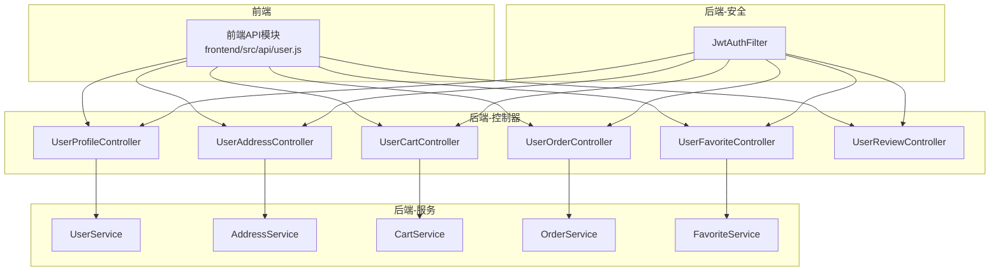
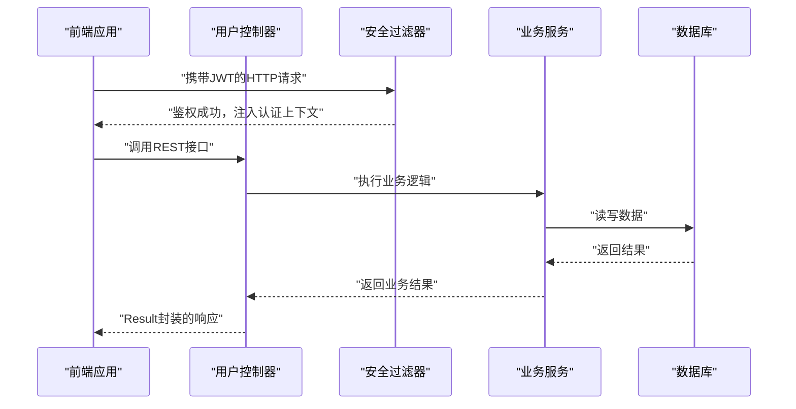
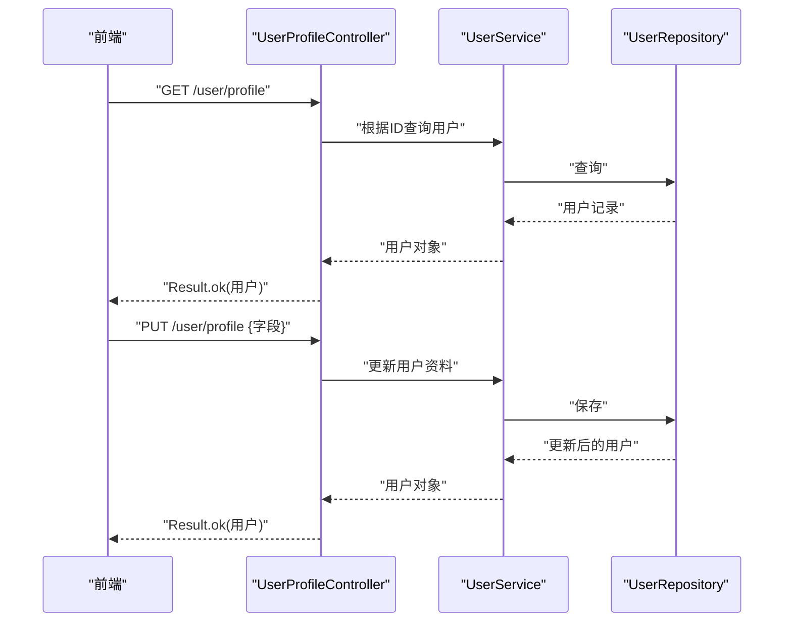
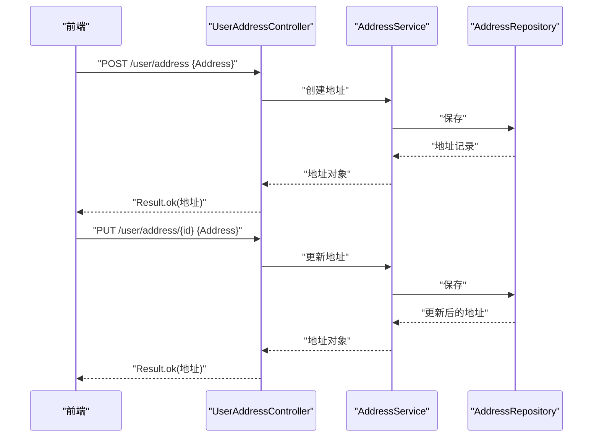
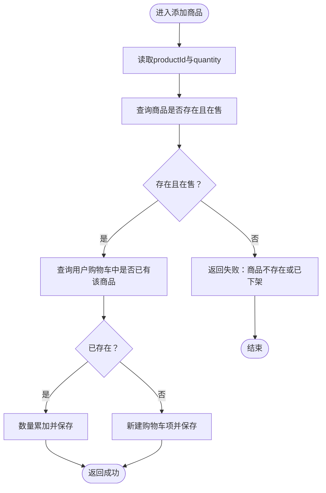
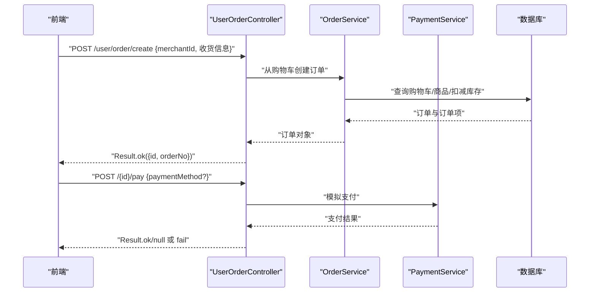
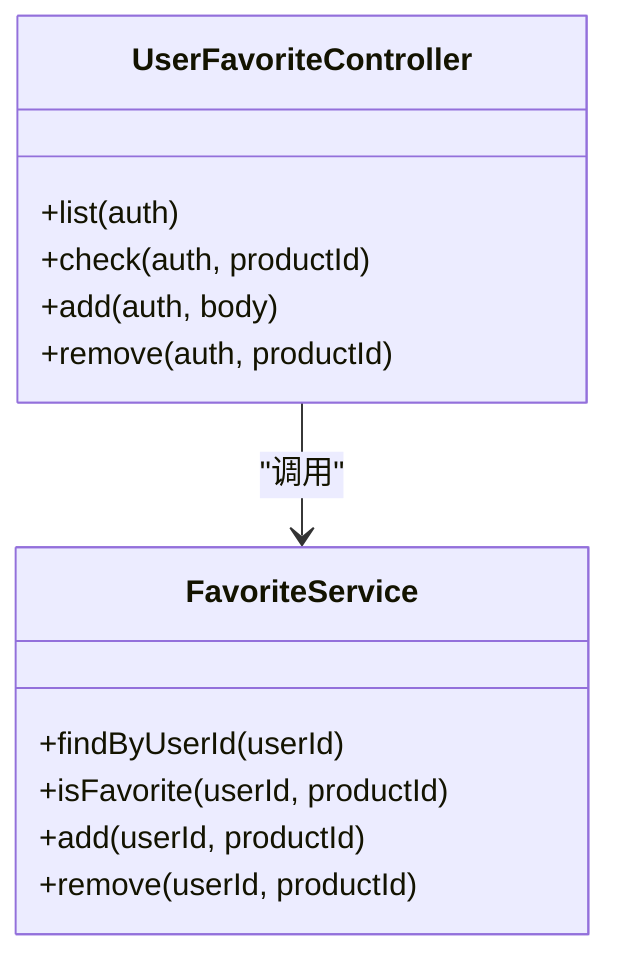
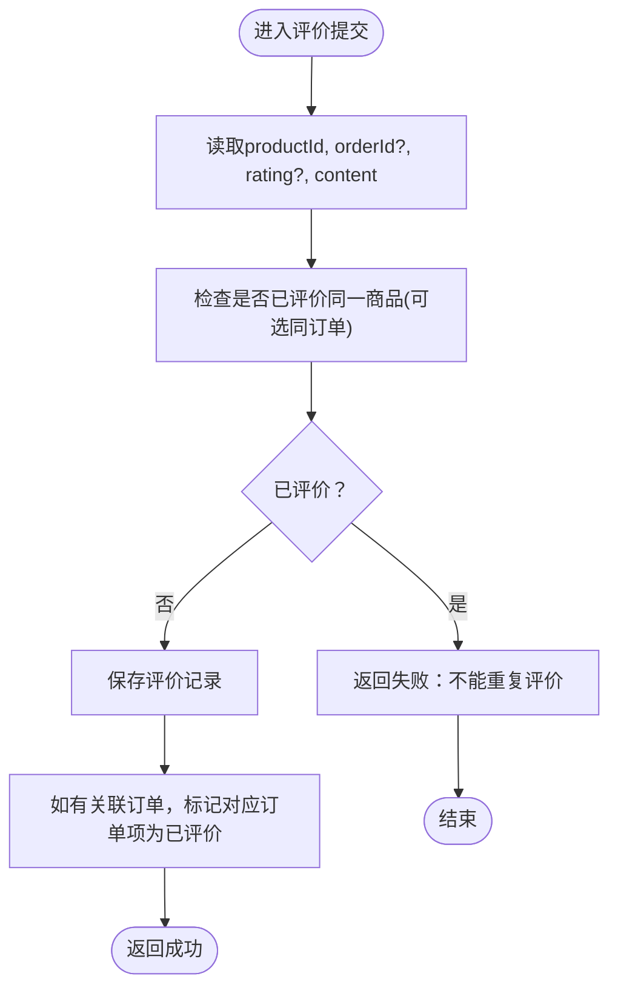
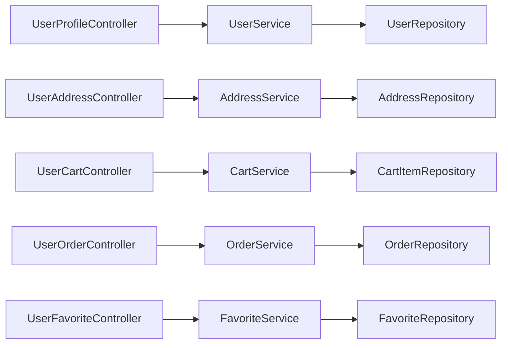

# 用户控制器

<cite>
**本文引用的文件**
- [UserProfileController.java](file://backend/src/main/java/com/mall/controller/user/UserProfileController.java)
- [UserAddressController.java](file://backend/src/main/java/com/mall/controller/user/UserAddressController.java)
- [UserCartController.java](file://backend/src/main/java/com/mall/controller/user/UserCartController.java)
- [UserOrderController.java](file://backend/src/main/java/com/mall/controller/user/UserOrderController.java)
- [UserFavoriteController.java](file://backend/src/main/java/com/mall/controller/user/UserFavoriteController.java)
- [UserReviewController.java](file://backend/src/main/java/com/mall/controller/user/UserReviewController.java)
- [UserService.java](file://backend/src/main/java/com/mall/service/UserService.java)
- [AddressService.java](file://backend/src/main/java/com/mall/service/AddressService.java)
- [CartService.java](file://backend/src/main/java/com/mall/service/CartService.java)
- [OrderService.java](file://backend/src/main/java/com/mall/service/OrderService.java)
- [FavoriteService.java](file://backend/src/main/java/com/mall/service/FavoriteService.java)
- [JwtAuthFilter.java](file://backend/src/main/java/com/mall/security/JwtAuthFilter.java)
- [User.java](file://backend/src/main/java/com/mall/entity/User.java)
- [Address.java](file://backend/src/main/java/com/mall/entity/Address.java)
- [CartItem.java](file://backend/src/main/java/com/mall/entity/CartItem.java)
- [Order.java](file://backend/src/main/java/com/mall/entity/Order.java)
- [Result.java](file://backend/src/main/java/com/mall/dto/Result.java)
- [user.js](file://frontend/src/api/user.js)
</cite>

## 目录
1. [简介](#简介)
2. [项目结构](#项目结构)
3. [核心组件](#核心组件)
4. [架构总览](#架构总览)
5. [详细组件分析](#详细组件分析)
6. [依赖分析](#依赖分析)
7. [性能考虑](#性能考虑)
8. [故障排查指南](#故障排查指南)
9. [结论](#结论)
10. [附录](#附录)

## 简介
本文件面向电商商城系统的“用户控制器”群组，系统性梳理用户个人资料、收货地址、购物车、订单、收藏夹与评价六大模块的控制器实现与RESTful API设计。文档覆盖：
- URL路径规范与HTTP方法使用
- 请求参数与响应数据格式
- 权限验证机制与数据访问控制
- 控制器与Service层交互模式
- 接口文档、请求/响应示例与错误处理指引
目标是帮助开发者快速理解并正确集成用户相关功能。

## 项目结构
用户控制器位于后端模块的用户包下，采用按功能分层的组织方式：控制器层负责接收请求、鉴权与调用Service；Service层封装业务逻辑；Repository层负责数据持久化；前端通过统一的API模块调用后端接口。

图表来源
- [user.js](file://frontend/src/api/user.js)
- [UserProfileController.java](file://backend/src/main/java/com/mall/controller/user/UserProfileController.java)
- [UserAddressController.java](file://backend/src/main/java/com/mall/controller/user/UserAddressController.java)
- [UserCartController.java](file://backend/src/main/java/com/mall/controller/user/UserCartController.java)
- [UserOrderController.java](file://backend/src/main/java/com/mall/controller/user/UserOrderController.java)
- [UserFavoriteController.java](file://backend/src/main/java/com/mall/controller/user/UserFavoriteController.java)
- [UserReviewController.java](file://backend/src/main/java/com/mall/controller/user/UserReviewController.java)
- [JwtAuthFilter.java](file://backend/src/main/java/com/mall/security/JwtAuthFilter.java)

章节来源
- [user.js](file://frontend/src/api/user.js)
- [UserProfileController.java](file://backend/src/main/java/com/mall/controller/user/UserProfileController.java)
- [UserAddressController.java](file://backend/src/main/java/com/mall/controller/user/UserAddressController.java)
- [UserCartController.java](file://backend/src/main/java/com/mall/controller/user/UserCartController.java)
- [UserOrderController.java](file://backend/src/main/java/com/mall/controller/user/UserOrderController.java)
- [UserFavoriteController.java](file://backend/src/main/java/com/mall/controller/user/UserFavoriteController.java)
- [UserReviewController.java](file://backend/src/main/java/com/mall/controller/user/UserReviewController.java)
- [JwtAuthFilter.java](file://backend/src/main/java/com/mall/security/JwtAuthFilter.java)

## 核心组件
- 控制器层：提供RESTful接口，接收请求参数，调用Service执行业务，返回Result封装的统一响应。
- 服务层：封装业务规则，包含事务控制、状态校验、库存扣减、退款同步等。
- 实体与仓库：映射数据库表结构，提供查询与保存能力。
- 安全过滤器：基于JWT解析用户身份，注入认证上下文。

章节来源
- [Result.java](file://backend/src/main/java/com/mall/dto/Result.java)
- [JwtAuthFilter.java](file://backend/src/main/java/com/mall/security/JwtAuthFilter.java)

## 架构总览
用户控制器遵循“控制器-服务-仓储”的分层架构，前端通过统一的API模块调用后端接口。控制器通过Spring Security的Authentication或@AuthenticationPrincipal获取当前用户标识，确保操作仅限于本人数据。

图表来源
- [JwtAuthFilter.java](file://backend/src/main/java/com/mall/security/JwtAuthFilter.java)
- [UserProfileController.java](file://backend/src/main/java/com/mall/controller/user/UserProfileController.java)
- [UserAddressController.java](file://backend/src/main/java/com/mall/controller/user/UserAddressController.java)
- [UserCartController.java](file://backend/src/main/java/com/mall/controller/user/UserCartController.java)
- [UserOrderController.java](file://backend/src/main/java/com/mall/controller/user/UserOrderController.java)
- [UserFavoriteController.java](file://backend/src/main/java/com/mall/controller/user/UserFavoriteController.java)
- [UserReviewController.java](file://backend/src/main/java/com/mall/controller/user/UserReviewController.java)

## 详细组件分析

### 用户个人资料接口
- 基础路径：/user/profile
- 方法与用途
  - GET：获取当前登录用户资料
  - PUT：更新当前登录用户资料
- 请求参数
  - GET：无
  - PUT：JSON对象，可包含昵称、头像、性别、邮箱、电话、收货人姓名、手机、地址等字段
- 响应数据
  - 成功：Result.ok(用户对象)
  - 失败：Result.fail(错误信息)
- 权限与访问控制
  - 使用Authentication获取当前用户ID，仅允许修改本人资料
- 错误处理
  - 用户不存在：返回失败
  - 参数异常：捕获异常并返回失败

图表来源
- [UserProfileController.java](file://backend/src/main/java/com/mall/controller/user/UserProfileController.java)
- [UserService.java](file://backend/src/main/java/com/mall/service/UserService.java)
- [User.java](file://backend/src/main/java/com/mall/entity/User.java)

章节来源
- [UserProfileController.java](file://backend/src/main/java/com/mall/controller/user/UserProfileController.java)
- [UserService.java](file://backend/src/main/java/com/mall/service/UserService.java)
- [User.java](file://backend/src/main/java/com/mall/entity/User.java)

### 收货地址接口
- 基础路径：/user/address
- 方法与用途
  - GET：获取当前用户地址列表
  - GET /{id}：获取指定地址详情
  - POST：新增地址
  - PUT /{id}：更新地址
  - DELETE /{id}：删除地址
  - PUT /{id}/default：设为默认地址
  - GET /default：获取默认地址
- 请求参数
  - 新增/更新：Address对象（收货人、电话、省市区、详细地址、是否默认等）
  - 设置默认：路径参数id
  - 获取默认：无
- 响应数据
  - 成功：Result.ok(地址或列表)
  - 失败：Result.fail(错误信息)
- 权限与访问控制
  - 使用@AuthenticationPrincipal注入User，所有操作均校验地址归属
- 错误处理
  - 地址不存在：返回失败
  - 默认地址设置：若设置为默认则自动取消其他默认标记

图表来源
- [UserAddressController.java](file://backend/src/main/java/com/mall/controller/user/UserAddressController.java)
- [AddressService.java](file://backend/src/main/java/com/mall/service/AddressService.java)
- [Address.java](file://backend/src/main/java/com/mall/entity/Address.java)

章节来源
- [UserAddressController.java](file://backend/src/main/java/com/mall/controller/user/UserAddressController.java)
- [AddressService.java](file://backend/src/main/java/com/mall/service/AddressService.java)
- [Address.java](file://backend/src/main/java/com/mall/entity/Address.java)

### 购物车接口
- 基础路径：/user/cart
- 方法与用途
  - GET：查询当前用户购物车
  - POST /add：添加商品到购物车
  - PUT /quantity：修改商品数量
  - DELETE /{productId}：从购物车移除商品
- 请求参数
  - 添加：productId、quantity（可选，默认1）
  - 修改数量：productId、quantity
  - 移除：路径参数productId
- 响应数据
  - 成功：Result.ok(列表或单项)
  - 失败：Result.fail(错误信息)
- 权限与访问控制
  - 使用Authentication获取当前用户ID，仅操作本人购物车
- 错误处理
  - 商品不存在或已下架：抛出异常并返回失败
  - 数量小于等于0：删除该项

图表来源
- [UserCartController.java](file://backend/src/main/java/com/mall/controller/user/UserCartController.java)
- [CartService.java](file://backend/src/main/java/com/mall/service/CartService.java)
- [CartItem.java](file://backend/src/main/java/com/mall/entity/CartItem.java)

章节来源
- [UserCartController.java](file://backend/src/main/java/com/mall/controller/user/UserCartController.java)
- [CartService.java](file://backend/src/main/java/com/mall/service/CartService.java)
- [CartItem.java](file://backend/src/main/java/com/mall/entity/CartItem.java)

### 订单接口
- 基础路径：/user/order
- 方法与用途
  - POST /create：从购物车创建订单（需传入商户ID与收货信息）
  - GET：分页查询我的订单（含订单项）
  - GET /{id}：查询订单详情（含订单项）
  - POST /{id}/pay：模拟支付（可选支付方式）
  - POST /{id}/confirm-receive：确认收货
  - POST /{id}/complete：完成订单
  - POST /{id}/cancel：收货前取消订单
  - POST /{id}/refund-request：申请退货/退款
  - POST /{orderId}/items/{itemId}/refund-request：针对单个订单项申请退款
  - POST /{orderId}/items/batch-refund-request：批量申请多个订单项退款
- 请求参数
  - 创建订单：merchantId、receiverName、receiverPhone、receiverAddress
  - 支付：paymentMethod（可选，默认微信）
  - 退款：reason（可选，最多256字符）
  - 批量退款：reason、itemIds列表、itemQuantities映射
- 响应数据
  - 成功：Result.ok(订单ID+订单号或空数据)
  - 失败：Result.fail(错误信息)
- 权限与访问控制
  - 所有订单操作均校验订单归属（userId），防止越权
- 错误处理
  - 订单不存在、状态不允许、数量不合法等均抛出异常并返回失败
  - 退款申请会同步订单整体状态

图表来源
- [UserOrderController.java](file://backend/src/main/java/com/mall/controller/user/UserOrderController.java)
- [OrderService.java](file://backend/src/main/java/com/mall/service/OrderService.java)

章节来源
- [UserOrderController.java](file://backend/src/main/java/com/mall/controller/user/UserOrderController.java)
- [OrderService.java](file://backend/src/main/java/com/mall/service/OrderService.java)
- [Order.java](file://backend/src/main/java/com/mall/entity/Order.java)

### 收藏夹接口
- 基础路径：/user/favorite
- 方法与用途
  - GET：查询收藏商品列表
  - GET /check：检查商品是否已收藏
  - POST /add：新增收藏
  - DELETE /{productId}：取消收藏
- 请求参数
  - 检查：productId
  - 新增：productId
  - 取消：路径参数productId
- 响应数据
  - 成功：Result.ok(列表或布尔值)
  - 失败：Result.fail(错误信息)
- 权限与访问控制
  - 使用Authentication获取当前用户ID，仅操作本人收藏
- 错误处理
  - 商品不存在：抛出异常并返回失败
  - 重复收藏：幂等处理（已存在则忽略）

图表来源
- [UserFavoriteController.java](file://backend/src/main/java/com/mall/controller/user/UserFavoriteController.java)
- [FavoriteService.java](file://backend/src/main/java/com/mall/service/FavoriteService.java)

章节来源
- [UserFavoriteController.java](file://backend/src/main/java/com/mall/controller/user/UserFavoriteController.java)
- [FavoriteService.java](file://backend/src/main/java/com/mall/service/FavoriteService.java)

### 评价接口
- 基础路径：/user/review
- 方法与用途
  - POST：新增商品评价（可选关联订单）
- 请求参数
  - productId、orderId（可选）、rating（默认5）、content
- 响应数据
  - 成功：Result.ok(评价对象)
  - 失败：Result.fail(错误信息)
- 权限与访问控制
  - 使用Authentication获取当前用户ID，仅能评价本人购买的商品
- 错误处理
  - 重复评价：返回失败
  - 关联订单：将对应订单项标记为已评价

图表来源
- [UserReviewController.java](file://backend/src/main/java/com/mall/controller/user/UserReviewController.java)

章节来源
- [UserReviewController.java](file://backend/src/main/java/com/mall/controller/user/UserReviewController.java)

## 依赖分析
- 控制器与服务
  - 每个控制器均依赖对应的Service，实现业务解耦
- 服务与仓储
  - 服务层通过Repository访问数据库，部分操作使用事务保证一致性
- 安全过滤器
  - JwtAuthFilter解析Authorization头中的Bearer Token，提取用户ID与角色，注入认证上下文

图表来源
- [UserProfileController.java](file://backend/src/main/java/com/mall/controller/user/UserProfileController.java)
- [UserAddressController.java](file://backend/src/main/java/com/mall/controller/user/UserAddressController.java)
- [UserCartController.java](file://backend/src/main/java/com/mall/controller/user/UserCartController.java)
- [UserOrderController.java](file://backend/src/main/java/com/mall/controller/user/UserOrderController.java)
- [UserFavoriteController.java](file://backend/src/main/java/com/mall/controller/user/UserFavoriteController.java)
- [UserService.java](file://backend/src/main/java/com/mall/service/UserService.java)
- [AddressService.java](file://backend/src/main/java/com/mall/service/AddressService.java)
- [CartService.java](file://backend/src/main/java/com/mall/service/CartService.java)
- [OrderService.java](file://backend/src/main/java/com/mall/service/OrderService.java)
- [FavoriteService.java](file://backend/src/main/java/com/mall/service/FavoriteService.java)

章节来源
- [JwtAuthFilter.java](file://backend/src/main/java/com/mall/security/JwtAuthFilter.java)

## 性能考虑
- 分页查询：订单列表使用Pageable分页，避免一次性加载大量数据
- 批量退款：支持批量选择订单项进行退款，减少多次请求开销
- 事务边界：关键操作（下单、退款）使用@Transactional，确保一致性
- 缓存建议：可在Service层引入缓存（如Redis）存储热门商品与用户信息，降低数据库压力（概念性建议，非现有实现）

## 故障排查指南
- 认证失败
  - 现象：返回未授权或无法解析用户
  - 排查：确认请求头Authorization格式为Bearer Token，且Token有效
- 权限不足
  - 现象：访问他人资源被拒绝
  - 排查：核对控制器中对userId的校验逻辑
- 参数非法
  - 现象：添加购物车/收藏/评价时报错
  - 排查：检查productId、quantity、收货信息、评分与描述长度
- 状态异常
  - 现象：取消订单/申请退款失败
  - 排查：确认订单当前状态是否允许变更，数量是否合法

章节来源
- [JwtAuthFilter.java](file://backend/src/main/java/com/mall/security/JwtAuthFilter.java)
- [UserOrderController.java](file://backend/src/main/java/com/mall/controller/user/UserOrderController.java)
- [OrderService.java](file://backend/src/main/java/com/mall/service/OrderService.java)

## 结论
用户控制器群组以清晰的RESTful设计与严格的权限控制，实现了从个人资料、地址、购物车到订单、收藏与评价的完整用户功能闭环。通过Service层封装业务规则与事务控制，配合统一的Result响应格式，提升了系统的可维护性与扩展性。建议在后续迭代中完善缓存策略与更细粒度的权限校验，持续优化用户体验。

## 附录

### 统一响应格式
- 字段
  - code：状态码（200表示成功，400表示业务失败）
  - message：提示信息
  - data：返回的数据对象或列表
- 示例
  - 成功：{ code: 200, message: "success", data: {...} }
  - 失败：{ code: 400, message: "错误信息", data: null }

章节来源
- [Result.java](file://backend/src/main/java/com/mall/dto/Result.java)

### 前端调用参考
- 个人资料
  - GET /user/profile
  - PUT /user/profile {字段}
- 收货地址
  - GET /user/address
  - GET /user/address/{id}
  - POST /user/address {Address}
  - PUT /user/address/{id} {Address}
  - DELETE /user/address/{id}
  - PUT /user/address/{id}/default
  - GET /user/address/default
- 购物车
  - GET /user/cart
  - POST /user/cart/add {productId, quantity?}
  - PUT /user/cart/quantity {productId, quantity}
  - DELETE /user/cart/{productId}
- 订单
  - POST /user/order/create {merchantId, receiverName, receiverPhone, receiverAddress}
  - GET /user/order?page&size
  - GET /user/order/{id}
  - POST /user/order/{id}/pay {paymentMethod?}
  - POST /user/order/{id}/confirm-receive
  - POST /user/order/{id}/complete
  - POST /user/order/{id}/cancel
  - POST /user/order/{id}/refund-request {reason?}
  - POST /user/order/{orderId}/items/{itemId}/refund-request {reason?}
  - POST /user/order/{orderId}/items/batch-refund-request {reason, itemIds[], itemQuantities:{id:qty}}
- 收藏
  - GET /user/favorite
  - GET /user/favorite/check?productId={id}
  - POST /user/favorite/add {productId}
  - DELETE /user/favorite/{productId}
- 评价
  - POST /user/review {productId, orderId?, rating?, content}

章节来源
- [user.js](file://frontend/src/api/user.js)