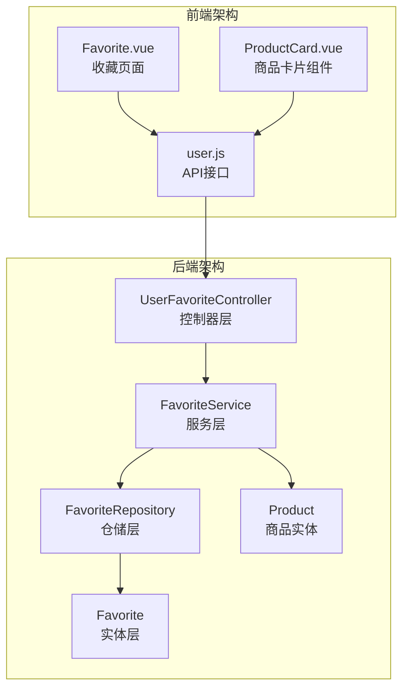
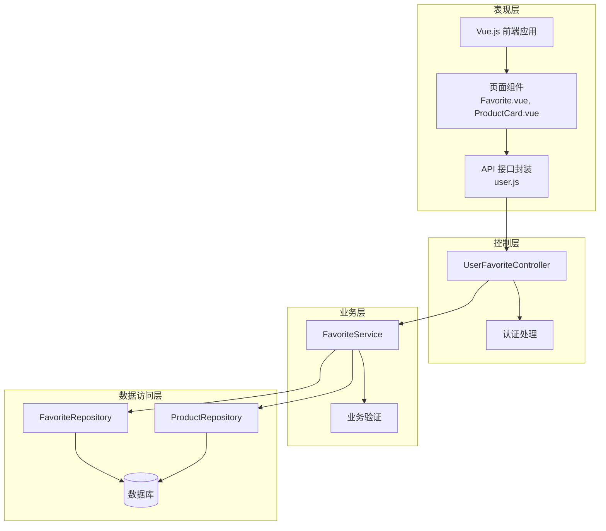
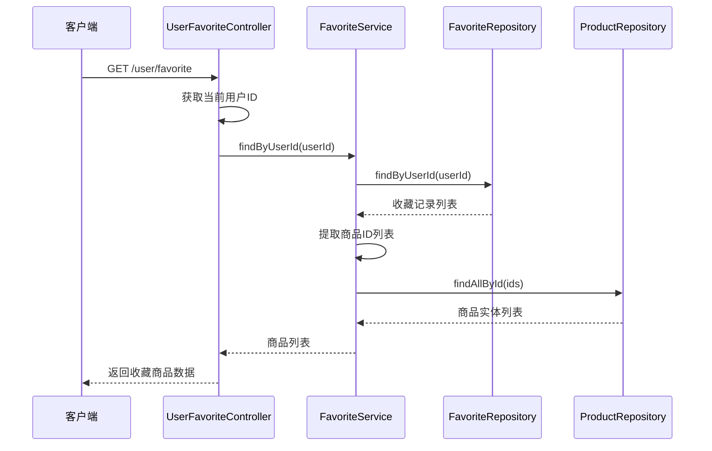
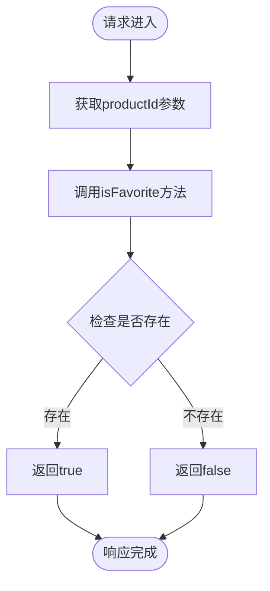
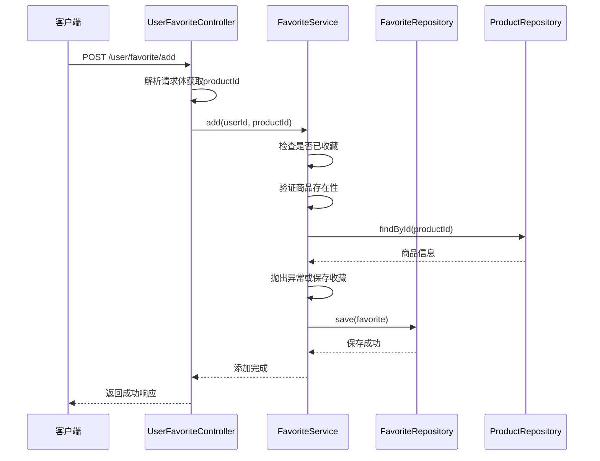
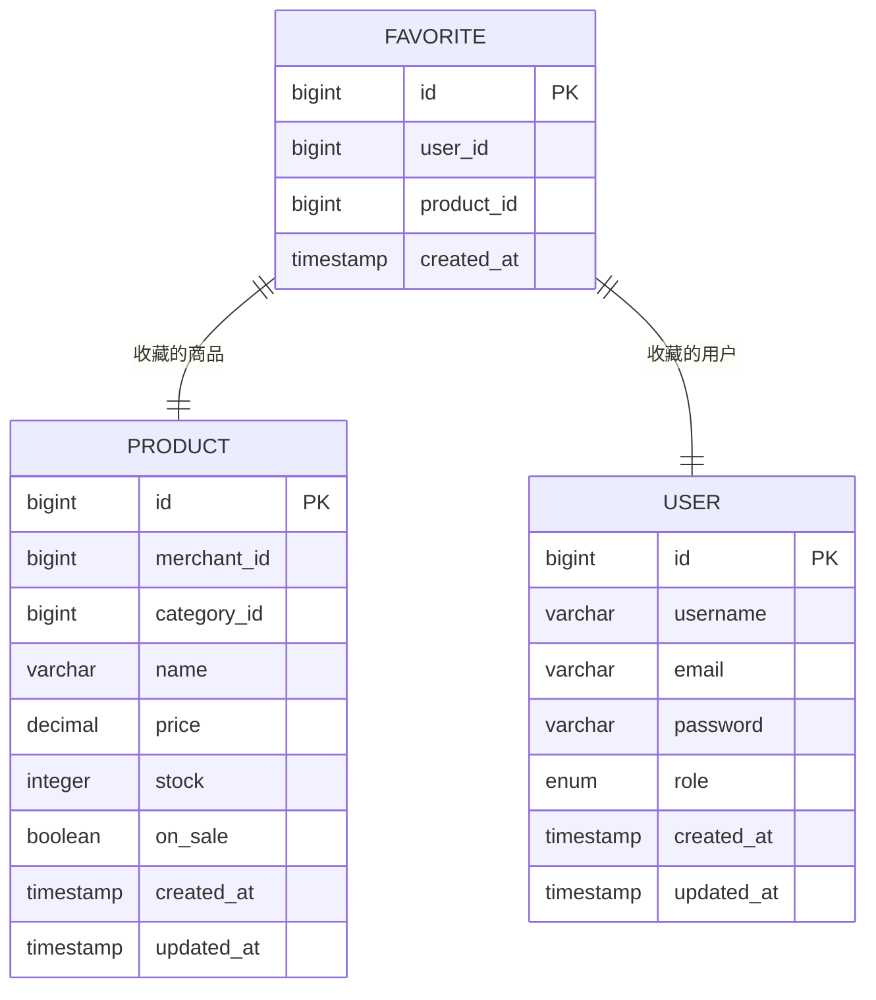
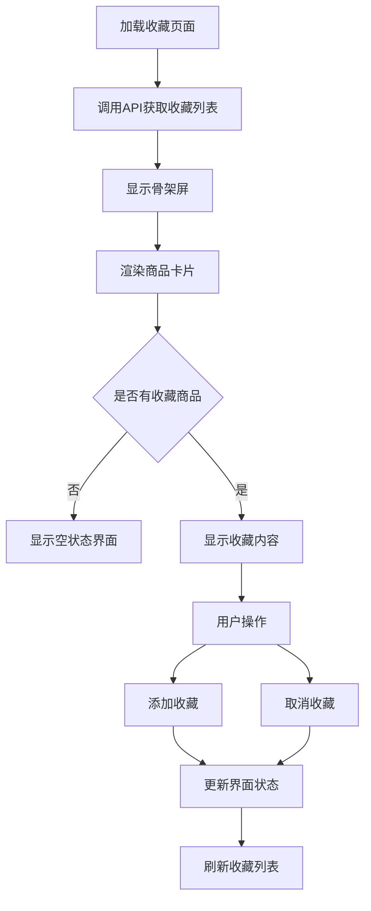
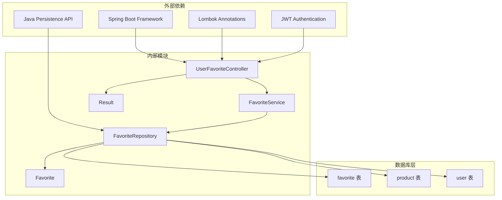

# 用户收藏夹控制器

<cite>
**本文档引用的文件**
- [UserFavoriteController.java](file://backend/src/main/java/com/mall/controller/user/UserFavoriteController.java)
- [FavoriteService.java](file://backend/src/main/java/com/mall/service/FavoriteService.java)
- [FavoriteRepository.java](file://backend/src/main/java/com/mall/repository/FavoriteRepository.java)
- [Favorite.java](file://backend/src/main/java/com/mall/entity/Favorite.java)
- [Product.java](file://backend/src/main/java/com/mall/entity/Product.java)
- [Result.java](file://backend/src/main/java/com/mall/dto/Result.java)
- [Favorite.vue](file://frontend/src/views/user/Favorite.vue)
- [user.js](file://frontend/src/api/user.js)
- [ProductCard.vue](file://frontend/src/components/ProductCard.vue)
</cite>

## 目录
1. [简介](#简介)
2. [项目结构](#项目结构)
3. [核心组件](#核心组件)
4. [架构概览](#架构概览)
5. [详细组件分析](#详细组件分析)
6. [依赖关系分析](#依赖关系分析)
7. [性能考虑](#性能考虑)
8. [故障排除指南](#故障排除指南)
9. [结论](#结论)

## 简介

用户收藏夹控制器是电商系统中重要的功能模块，负责管理用户的商品收藏操作。该模块实现了完整的收藏夹业务逻辑，包括收藏商品的查询、添加收藏、取消收藏等功能。通过RESTful API接口，用户可以方便地管理自己的收藏商品，提升购物体验。

本控制器采用Spring Boot框架构建，使用了分层架构设计，包括控制器层、服务层、仓储层和实体层，确保了代码的可维护性和可扩展性。

## 项目结构

用户收藏夹功能在项目中的组织结构如下：

**图表来源**
- [UserFavoriteController.java:14-18](file://backend/src/main/java/com/mall/controller/user/UserFavoriteController.java#L14-L18)
- [FavoriteService.java:14-16](file://backend/src/main/java/com/mall/service/FavoriteService.java#L14-L16)
- [FavoriteRepository.java:9-18](file://backend/src/main/java/com/mall/repository/FavoriteRepository.java#L9-L18)

**章节来源**
- [UserFavoriteController.java:1-60](file://backend/src/main/java/com/mall/controller/user/UserFavoriteController.java#L1-L60)
- [FavoriteService.java:1-43](file://backend/src/main/java/com/mall/service/FavoriteService.java#L1-L43)

## 核心组件

### 控制器层 - UserFavoriteController

UserFavoriteController是收藏夹功能的入口点，提供了四个主要的REST API接口：

1. **收藏列表查询** (`GET /user/favorite`)
2. **收藏状态检查** (`GET /user/favorite/check`)
3. **添加收藏** (`POST /user/favorite/add`)
4. **取消收藏** (`DELETE /user/favorite/{productId}`)

控制器使用Lombok的`@RequiredArgsConstructor`注解自动生成构造函数，注入FavoriteService依赖。

**章节来源**
- [UserFavoriteController.java:14-18](file://backend/src/main/java/com/mall/controller/user/UserFavoriteController.java#L14-L18)
- [UserFavoriteController.java:27-58](file://backend/src/main/java/com/mall/controller/user/UserFavoriteController.java#L27-L58)

### 服务层 - FavoriteService

FavoriteService实现了收藏夹的核心业务逻辑，包含以下关键方法：

- `findByUserId`: 根据用户ID查询收藏商品列表
- `isFavorite`: 检查商品是否已被收藏
- `add`: 添加商品到收藏夹
- `remove`: 从收藏夹移除商品

服务层使用事务注解确保数据一致性，并进行必要的业务验证。

**章节来源**
- [FavoriteService.java:14-16](file://backend/src/main/java/com/mall/service/FavoriteService.java#L14-L16)
- [FavoriteService.java:21-41](file://backend/src/main/java/com/mall/service/FavoriteService.java#L21-L41)

### 仓储层 - FavoriteRepository

FavoriteRepository继承JPA的JpaRepository接口，提供了收藏记录的数据库操作方法：

- `findByUserId`: 按用户ID查询收藏记录
- `findByUserIdAndProductId`: 按用户ID和商品ID查询收藏记录
- `existsByUserIdAndProductId`: 检查用户是否收藏了指定商品
- `deleteByUserIdAndProductId`: 按用户ID和商品ID删除收藏记录

**章节来源**
- [FavoriteRepository.java:9-18](file://backend/src/main/java/com/mall/repository/FavoriteRepository.java#L9-L18)

### 实体层 - Favorite

Favorite实体类映射到数据库的favorite表，包含以下字段：
- `id`: 主键标识
- `userId`: 用户ID
- `productId`: 商品ID
- `createdAt`: 创建时间

实体类使用唯一约束确保同一用户不能重复收藏同一商品。

**章节来源**
- [Favorite.java:8-35](file://backend/src/main/java/com/mall/entity/Favorite.java#L8-L35)

## 架构概览

用户收藏夹系统的整体架构采用经典的三层架构模式：

**图表来源**
- [UserFavoriteController.java:14-20](file://backend/src/main/java/com/mall/controller/user/UserFavoriteController.java#L14-L20)
- [FavoriteService.java:18-19](file://backend/src/main/java/com/mall/service/FavoriteService.java#L18-L19)
- [FavoriteRepository.java:9-18](file://backend/src/main/java/com/mall/repository/FavoriteRepository.java#L9-L18)

## 详细组件分析

### API接口设计与实现

#### 收藏列表查询接口

**接口定义**: `GET /user/favorite`

该接口用于获取当前登录用户的所有收藏商品。控制器通过Authentication对象获取当前用户ID，然后调用服务层方法查询收藏列表。

**图表来源**
- [UserFavoriteController.java:28-32](file://backend/src/main/java/com/mall/controller/user/UserFavoriteController.java#L28-L32)
- [FavoriteService.java:21-25](file://backend/src/main/java/com/mall/service/FavoriteService.java#L21-L25)

**章节来源**
- [UserFavoriteController.java:27-32](file://backend/src/main/java/com/mall/controller/user/UserFavoriteController.java#L27-L32)
- [FavoriteService.java:21-25](file://backend/src/main/java/com/mall/service/FavoriteService.java#L21-L25)

#### 收藏状态检查接口

**接口定义**: `GET /user/favorite/check`

该接口用于检查指定商品是否已被当前用户收藏。接口接收productId参数，返回布尔值表示收藏状态。

**图表来源**
- [UserFavoriteController.java:35-39](file://backend/src/main/java/com/mall/controller/user/UserFavoriteController.java#L35-L39)
- [FavoriteService.java:27-29](file://backend/src/main/java/com/mall/service/FavoriteService.java#L27-L29)

**章节来源**
- [UserFavoriteController.java:34-39](file://backend/src/main/java/com/mall/controller/user/UserFavoriteController.java#L34-L39)
- [FavoriteService.java:27-29](file://backend/src/main/java/com/mall/service/FavoriteService.java#L27-L29)

#### 添加收藏接口

**接口定义**: `POST /user/favorite/add`

该接口用于向当前用户的收藏夹添加商品。接口接收JSON格式的请求体，包含productId字段。

**图表来源**
- [UserFavoriteController.java:42-51](file://backend/src/main/java/com/mall/controller/user/UserFavoriteController.java#L42-L51)
- [FavoriteService.java:31-36](file://backend/src/main/java/com/mall/service/FavoriteService.java#L31-L36)

**章节来源**
- [UserFavoriteController.java:41-51](file://backend/src/main/java/com/mall/controller/user/UserFavoriteController.java#L41-L51)
- [FavoriteService.java:31-36](file://backend/src/main/java/com/mall/service/FavoriteService.java#L31-L36)

#### 取消收藏接口

**接口定义**: `DELETE /user/favorite/{productId}`

该接口用于从当前用户的收藏夹中移除指定商品。接口通过路径参数接收productId。

**章节来源**
- [UserFavoriteController.java:53-58](file://backend/src/main/java/com/mall/controller/user/UserFavoriteController.java#L53-L58)
- [FavoriteService.java:38-41](file://backend/src/main/java/com/mall/service/FavoriteService.java#L38-L41)

### 数据结构设计

#### 收藏实体模型

收藏功能的数据结构设计简洁而高效：

**图表来源**
- [Favorite.java:17-28](file://backend/src/main/java/com/mall/entity/Favorite.java#L17-L28)
- [Product.java:18-88](file://backend/src/main/java/com/mall/entity/Product.java#L18-L88)

#### 响应数据模型

系统使用统一的响应格式，通过Result类封装所有API响应：

- `code`: 状态码（200表示成功，400表示失败）
- `message`: 响应消息
- `data`: 实际响应数据

**章节来源**
- [Result.java:10-23](file://backend/src/main/java/com/mall/dto/Result.java#L10-L23)

### 业务逻辑与用户体验

#### 前端集成实现

前端收藏功能通过Vue.js组件实现，提供了良好的用户体验：

**图表来源**
- [Favorite.vue:65-93](file://frontend/src/views/user/Favorite.vue#L65-L93)
- [user.js:38-56](file://frontend/src/api/user.js#L38-L56)

**章节来源**
- [Favorite.vue:1-175](file://frontend/src/views/user/Favorite.vue#L1-L175)
- [user.js:38-56](file://frontend/src/api/user.js#L38-L56)

#### 商品卡片组件集成

商品卡片组件集成了收藏功能，用户可以在商品详情页面直接进行收藏操作：

**章节来源**
- [ProductCard.vue:1-261](file://frontend/src/components/ProductCard.vue#L1-L261)

## 依赖关系分析

用户收藏夹模块的依赖关系清晰明确，遵循了分层架构的最佳实践：

**图表来源**
- [UserFavoriteController.java:1-12](file://backend/src/main/java/com/mall/controller/user/UserFavoriteController.java#L1-L12)
- [FavoriteService.java:1-12](file://backend/src/main/java/com/mall/service/FavoriteService.java#L1-L12)
- [FavoriteRepository.java:1-7](file://backend/src/main/java/com/mall/repository/FavoriteRepository.java#L1-L7)

### 关键依赖关系

1. **控制器依赖服务层**: UserFavoriteController仅依赖FavoriteService接口，实现了松耦合设计
2. **服务层依赖仓储层**: FavoriteService同时依赖FavoriteRepository和ProductRepository，确保业务逻辑的完整性
3. **仓储层依赖JPA**: FavoriteRepository继承JpaRepository，自动获得CRUD操作能力
4. **实体层依赖注解**: Favorite实体类使用JPA注解进行数据库映射

**章节来源**
- [UserFavoriteController.java:20-25](file://backend/src/main/java/com/mall/controller/user/UserFavoriteController.java#L20-L25)
- [FavoriteService.java:18-19](file://backend/src/main/java/com/mall/service/FavoriteService.java#L18-L19)

## 性能考虑

### 查询优化策略

1. **批量查询优化**: 收藏列表查询采用批量ID查询方式，避免N+1查询问题
2. **索引设计**: favorite表的(user_id, product_id)组合建立了唯一索引，确保查询效率
3. **缓存策略**: 可以考虑在服务层添加缓存机制，减少重复查询

### 并发处理

1. **事务隔离**: 使用@Transactional注解确保收藏操作的原子性
2. **唯一约束**: 数据库层面的唯一约束防止并发情况下的重复收藏
3. **乐观锁**: 可以考虑添加版本号字段支持乐观锁机制

### 前端性能优化

1. **骨架屏**: 收藏页面使用骨架屏技术提升用户体验
2. **懒加载**: 商品卡片组件采用懒加载机制
3. **状态管理**: 使用Vuex进行状态管理，避免重复请求

## 故障排除指南

### 常见问题及解决方案

#### 1. 收藏商品不存在

**问题描述**: 添加收藏时抛出"商品不存在"异常

**解决方案**: 
- 检查商品ID的有效性
- 确认商品状态为在售状态
- 验证商品是否被删除

**章节来源**
- [FavoriteService.java:34](file://backend/src/main/java/com/mall/service/FavoriteService.java#L34)

#### 2. 重复收藏问题

**问题描述**: 同一用户重复收藏同一商品

**解决方案**:
- 利用数据库唯一约束防止重复插入
- 在服务层进行重复检查
- 前端禁用重复收藏按钮

**章节来源**
- [Favorite.java:9](file://backend/src/main/java/com/mall/entity/Favorite.java#L9)
- [FavoriteService.java:33](file://backend/src/main/java/com/mall/service/FavoriteService.java#L33)

#### 3. 权限验证问题

**问题描述**: 未登录用户访问收藏接口

**解决方案**:
- 确保Spring Security配置正确
- 验证JWT令牌有效性
- 检查用户认证状态

### 调试技巧

1. **日志记录**: 在关键业务节点添加日志输出
2. **异常处理**: 使用try-catch捕获并记录异常信息
3. **单元测试**: 编写针对收藏功能的单元测试

**章节来源**
- [UserFavoriteController.java:48-50](file://backend/src/main/java/com/mall/controller/user/UserFavoriteController.java#L48-L50)

## 结论

用户收藏夹控制器是一个设计良好、实现完整的功能模块。通过采用分层架构和最佳实践，该模块具备了以下特点：

1. **清晰的职责分离**: 控制器、服务、仓储、实体各司其职
2. **完善的错误处理**: 统一的异常处理机制和用户友好的错误提示
3. **良好的用户体验**: 前后端配合实现流畅的收藏操作体验
4. **可扩展性强**: 模块化设计便于后续功能扩展

该实现为电商系统提供了可靠的收藏功能基础，用户可以通过简洁直观的界面管理自己的商品收藏，提升了整体的购物体验。未来可以根据业务需求进一步优化性能和扩展更多功能特性。