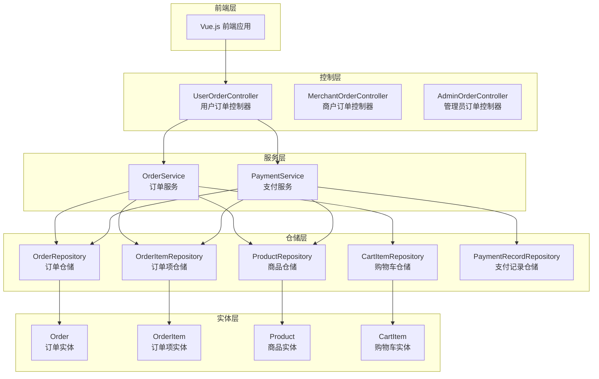
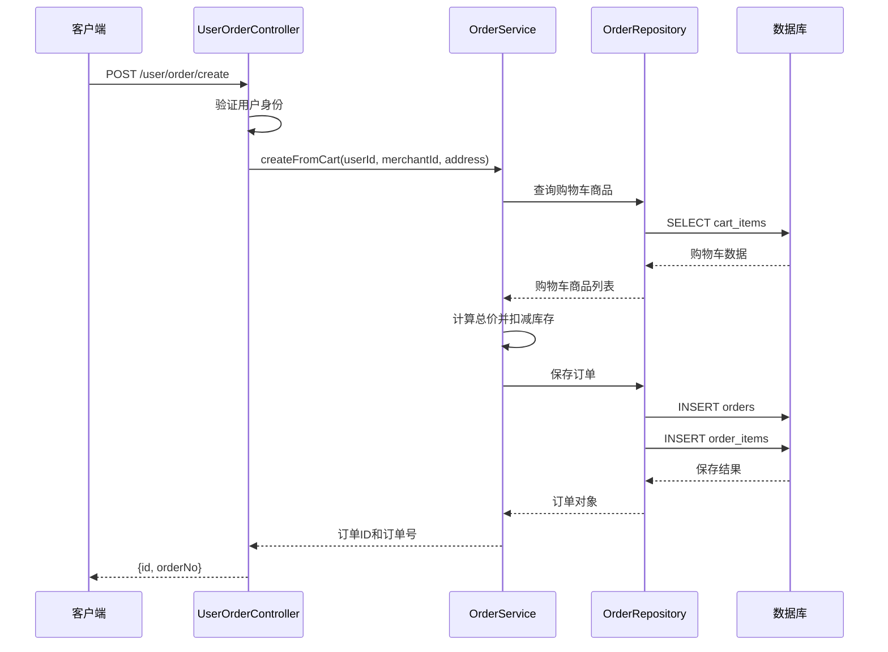
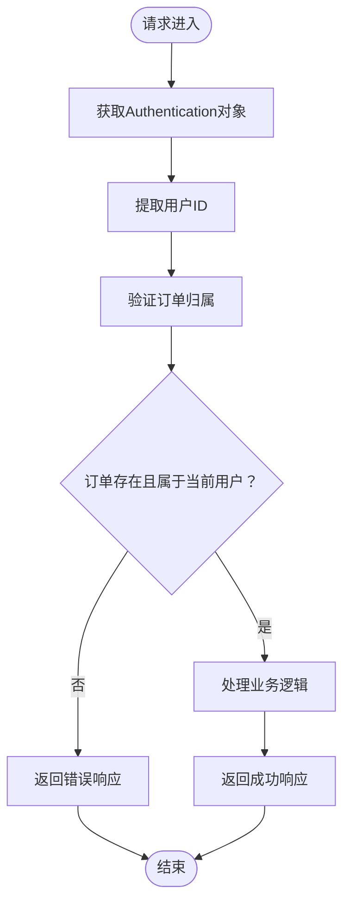
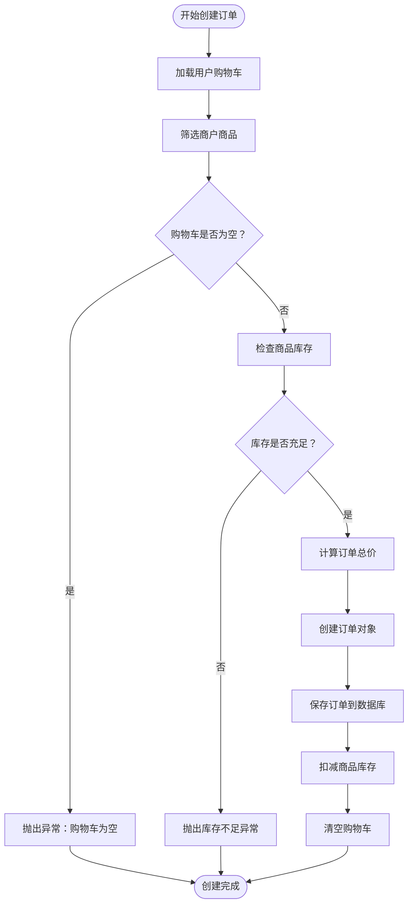
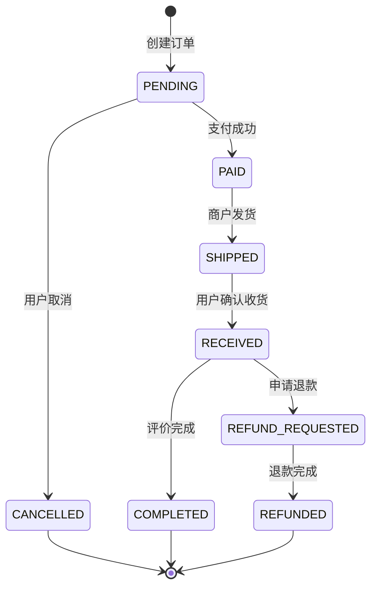
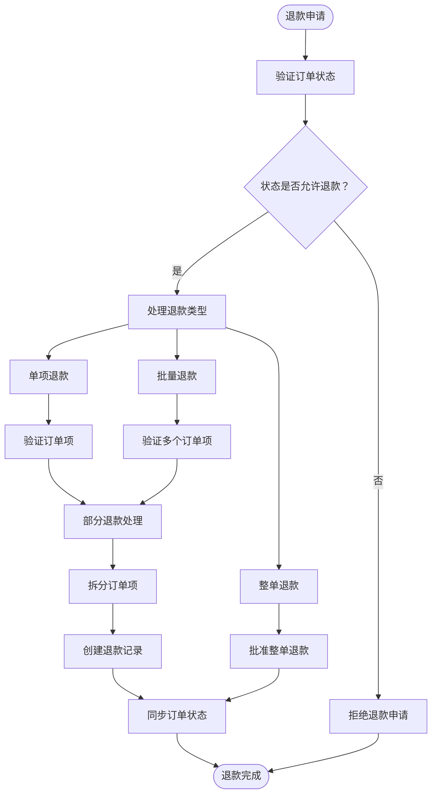
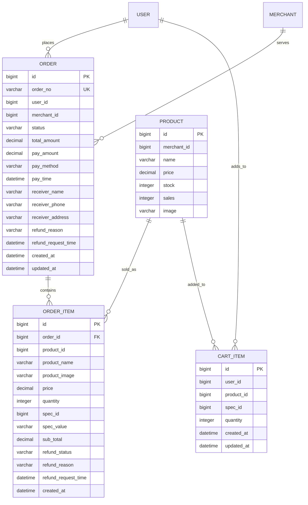
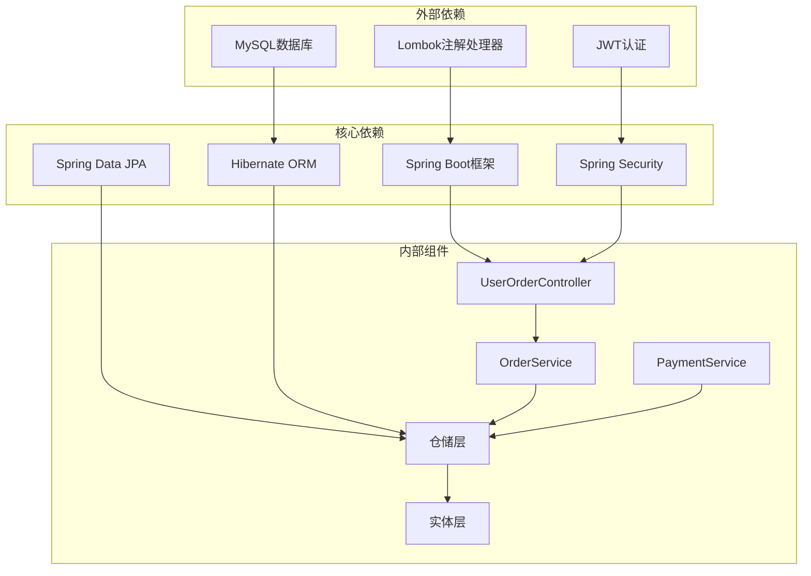
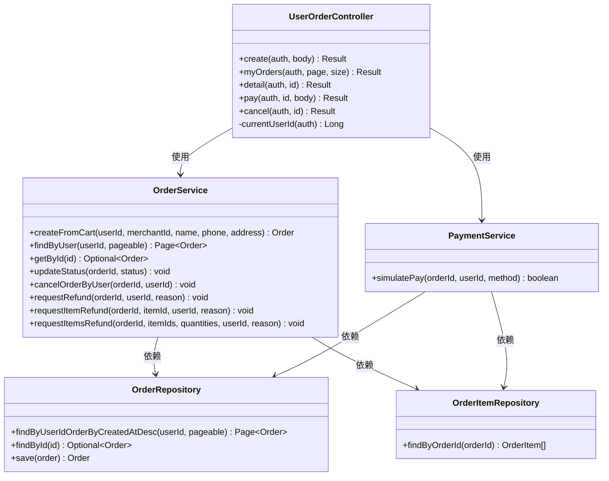
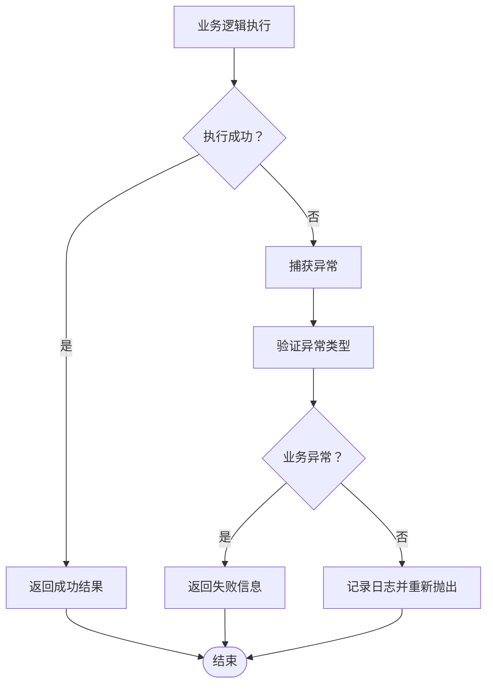

# 用户订单控制器

<cite>
**本文档引用的文件**
- [UserOrderController.java](file://backend/src/main/java/com/mall/controller/user/UserOrderController.java)
- [OrderService.java](file://backend/src/main/java/com/mall/service/OrderService.java)
- [OrderRepository.java](file://backend/src/main/java/com/mall/repository/OrderRepository.java)
- [Order.java](file://backend/src/main/java/com/mall/entity/Order.java)
- [OrderItem.java](file://backend/src/main/java/com/mall/entity/OrderItem.java)
- [PaymentService.java](file://backend/src/main/java/com/mall/service/PaymentService.java)
- [Result.java](file://backend/src/main/java/com/mall/dto/Result.java)
- [application.yml](file://backend/src/main/resources/application.yml)
</cite>

## 目录
1. [简介](#简介)
2. [项目结构](#项目结构)
3. [核心组件](#核心组件)
4. [架构概览](#架构概览)
5. [详细组件分析](#详细组件分析)
6. [依赖关系分析](#依赖关系分析)
7. [性能考虑](#性能考虑)
8. [故障排除指南](#故障排除指南)
9. [结论](#结论)

## 简介

用户订单控制器是电商系统中负责处理用户订单相关操作的核心组件。本文档全面介绍了UserOrderController的完整实现，包括订单创建、订单查询、订单支付、订单状态更新和订单取消等功能。系统采用RESTful API设计，提供了完整的订单生命周期管理能力，涵盖了从购物车下单到完成评价的整个业务流程。

## 项目结构

基于Spring Boot的分层架构设计，用户订单控制器位于controller层，通过服务层协调各个仓储层组件，实现了清晰的职责分离和良好的可维护性。

**图表来源**
- [UserOrderController.java:19-23](file://backend/src/main/java/com/mall/controller/user/UserOrderController.java#L19-L23)
- [OrderService.java:23-26](file://backend/src/main/java/com/mall/service/OrderService.java#L23-L26)

**章节来源**
- [UserOrderController.java:19-23](file://backend/src/main/java/com/mall/controller/user/UserOrderController.java#L19-L23)
- [application.yml:1-36](file://backend/src/main/resources/application.yml#L1-L36)

## 核心组件

用户订单控制器包含以下核心功能模块：

### 订单创建模块
- 从购物车批量创建订单
- 自动计算商品总价
- 扣减商品库存
- 生成唯一订单号

### 订单查询模块
- 分页查询用户订单列表
- 获取订单详细信息
- 查询订单项明细

### 订单支付模块
- 模拟支付流程
- 支付方式管理
- 支付记录生成

### 订单状态管理模块
- 支持多种订单状态转换
- 状态验证和约束
- 自动状态同步

### 退款申请模块
- 支持整单退款
- 支持单项退款
- 支持批量退款
- 部分数量退款处理

**章节来源**
- [UserOrderController.java:33-196](file://backend/src/main/java/com/mall/controller/user/UserOrderController.java#L33-L196)
- [OrderService.java:33-279](file://backend/src/main/java/com/mall/service/OrderService.java#L33-L279)

## 架构概览

系统采用经典的MVC架构模式，结合Spring Security进行权限控制，通过事务管理确保数据一致性。

**图表来源**
- [UserOrderController.java:34-50](file://backend/src/main/java/com/mall/controller/user/UserOrderController.java#L34-L50)
- [OrderService.java:34-88](file://backend/src/main/java/com/mall/service/OrderService.java#L34-L88)

**章节来源**
- [UserOrderController.java:34-50](file://backend/src/main/java/com/mall/controller/user/UserOrderController.java#L34-L50)
- [OrderService.java:34-88](file://backend/src/main/java/com/mall/service/OrderService.java#L34-L88)

## 详细组件分析

### UserOrderController 控制器

UserOrderController作为RESTful API的入口点，提供了完整的订单管理功能。

#### 主要接口设计

| 接口 | 方法 | 路径 | 功能描述 |
|------|------|------|----------|
| 创建订单 | POST | `/user/order/create` | 从购物车创建订单 |
| 查询订单列表 | GET | `/user/order` | 分页查询用户订单 |
| 获取订单详情 | GET | `/user/order/{id}` | 获取订单及订单项详情 |
| 支付订单 | POST | `/user/order/{id}/pay` | 订单支付 |
| 确认收货 | POST | `/user/order/{id}/confirm-receive` | 用户确认收货 |
| 完成订单 | POST | `/user/order/{id}/complete` | 完成订单评价 |
| 取消订单 | POST | `/user/order/{id}/cancel` | 用户取消订单 |
| 申请退款 | POST | `/user/order/{id}/refund-request` | 整单退款申请 |
| 单项退款申请 | POST | `/user/order/{id}/items/{itemId}/refund-request` | 单个订单项退款申请 |
| 批量退款申请 | POST | `/user/order/{id}/items/batch-refund-request` | 多个订单项批量退款申请 |

#### 权限控制机制

控制器使用Spring Security进行权限验证，通过Authentication参数获取当前登录用户ID，确保订单操作的安全性。

**图表来源**
- [UserOrderController.java:28-31](file://backend/src/main/java/com/mall/controller/user/UserOrderController.java#L28-L31)
- [UserOrderController.java:90-99](file://backend/src/main/java/com/mall/controller/user/UserOrderController.java#L90-L99)

**章节来源**
- [UserOrderController.java:28-31](file://backend/src/main/java/com/mall/controller/user/UserOrderController.java#L28-L31)
- [UserOrderController.java:88-100](file://backend/src/main/java/com/mall/controller/user/UserOrderController.java#L88-L100)

### OrderService 服务层

OrderService是订单业务逻辑的核心实现，负责处理复杂的订单状态转换和数据一致性保证。

#### 订单创建流程

订单创建过程涉及多个步骤，包括购物车验证、库存检查、价格计算和数据库持久化。

**图表来源**
- [OrderService.java:34-88](file://backend/src/main/java/com/mall/service/OrderService.java#L34-L88)

#### 订单状态管理

系统支持完整的订单状态流转，确保业务逻辑的正确性和数据的一致性。

**图表来源**
- [Order.java:31-33](file://backend/src/main/java/com/mall/entity/Order.java#L31-L33)
- [OrderService.java:115-121](file://backend/src/main/java/com/mall/service/OrderService.java#L115-L121)

#### 退款处理机制

系统支持灵活的退款处理，包括整单退款、单项退款和批量退款。

**图表来源**
- [OrderService.java:166-240](file://backend/src/main/java/com/mall/service/OrderService.java#L166-L240)

**章节来源**
- [OrderService.java:34-88](file://backend/src/main/java/com/mall/service/OrderService.java#L34-L88)
- [OrderService.java:115-145](file://backend/src/main/java/com/mall/service/OrderService.java#L115-L145)
- [OrderService.java:166-240](file://backend/src/main/java/com/mall/service/OrderService.java#L166-L240)

### 数据模型设计

系统采用标准的电商订单模型，通过实体关系实现数据的完整性和一致性。

**图表来源**
- [Order.java:18-81](file://backend/src/main/java/com/mall/entity/Order.java#L18-L81)
- [OrderItem.java:18-71](file://backend/src/main/java/com/mall/entity/OrderItem.java#L18-L71)
- [CartItem.java:17-48](file://backend/src/main/java/com/mall/entity/CartItem.java#L17-L48)

**章节来源**
- [Order.java:18-81](file://backend/src/main/java/com/mall/entity/Order.java#L18-L81)
- [OrderItem.java:18-71](file://backend/src/main/java/com/mall/entity/OrderItem.java#L18-L71)
- [CartItem.java:17-48](file://backend/src/main/java/com/mall/entity/CartItem.java#L17-L48)

## 依赖关系分析

系统采用松耦合的设计，通过接口抽象实现组件间的解耦。

**图表来源**
- [UserOrderController.java:3-11](file://backend/src/main/java/com/mall/controller/user/UserOrderController.java#L3-L11)
- [OrderService.java:3-22](file://backend/src/main/java/com/mall/service/OrderService.java#L3-L22)

### 组件交互模式

系统采用命令模式和策略模式相结合的方式，通过服务层协调各个组件的交互。

**图表来源**
- [UserOrderController.java:25-26](file://backend/src/main/java/com/mall/controller/user/UserOrderController.java#L25-L26)
- [OrderService.java:28-31](file://backend/src/main/java/com/mall/service/OrderService.java#L28-L31)
- [PaymentService.java:25-28](file://backend/src/main/java/com/mall/service/PaymentService.java#L25-L28)

**章节来源**
- [UserOrderController.java:25-26](file://backend/src/main/java/com/mall/controller/user/UserOrderController.java#L25-L26)
- [OrderService.java:28-31](file://backend/src/main/java/com/mall/service/OrderService.java#L28-L31)
- [PaymentService.java:25-28](file://backend/src/main/java/com/mall/service/PaymentService.java#L25-L28)

## 性能考虑

### 数据访问优化

系统通过合理的索引设计和查询优化提升性能表现：

- 在`orders`表上建立用户ID和创建时间的复合索引
- 在`order_item`表上建立订单ID的索引
- 使用分页查询避免大数据集的全量加载

### 缓存策略

建议在高并发场景下引入缓存机制：

- Redis缓存热门商品信息
- 缓存用户购物车数据
- 缓存订单状态统计信息

### 异步处理

对于耗时的操作建议采用异步处理：

- 支付回调通知异步处理
- 订单状态变更通知异步发送
- 退款处理异步执行

## 故障排除指南

### 常见错误类型

| 错误类型 | 触发条件 | 解决方案 |
|----------|----------|----------|
| 订单不存在 | 订单ID无效或不属于当前用户 | 检查订单归属验证逻辑 |
| 库存不足 | 商品库存小于购买数量 | 提示用户减少购买数量 |
| 状态不允许 | 当前订单状态不支持该操作 | 显示正确的操作按钮 |
| 支付失败 | 支付状态异常或网络问题 | 重试支付或联系客服 |

### 异常处理策略

系统采用统一的异常处理机制，通过Result包装器返回标准化的响应格式。

**图表来源**
- [UserOrderController.java:47-49](file://backend/src/main/java/com/mall/controller/user/UserOrderController.java#L47-L49)
- [OrderService.java:127-133](file://backend/src/main/java/com/mall/service/OrderService.java#L127-L133)

### 调试技巧

1. **启用SQL日志**：在application.yml中设置`show-sql: true`查看实际执行的SQL语句
2. **检查事务边界**：确保关键业务逻辑在@Transactional注解范围内
3. **验证权限控制**：确认Authentication对象正确传递和使用
4. **监控性能指标**：关注数据库连接池和查询性能

**章节来源**
- [UserOrderController.java:47-49](file://backend/src/main/java/com/mall/controller/user/UserOrderController.java#L47-L49)
- [OrderService.java:127-133](file://backend/src/main/java/com/mall/service/OrderService.java#L127-L133)

## 结论

用户订单控制器作为电商系统的核心组件，通过清晰的架构设计和完善的业务逻辑实现了完整的订单生命周期管理。系统采用RESTful API设计，提供了丰富的订单操作接口，支持多种支付方式和退款处理模式。

### 主要优势

1. **完整的业务覆盖**：从下单到完成评价的全流程支持
2. **严格的状态控制**：确保订单状态转换的正确性和一致性
3. **灵活的退款机制**：支持整单、单项和批量退款处理
4. **安全的权限控制**：基于JWT的用户身份验证和授权
5. **可扩展的架构**：模块化设计便于功能扩展和维护

### 改进建议

1. **引入消息队列**：处理支付回调和订单状态变更通知
2. **增强缓存策略**：提升高并发场景下的响应性能
3. **完善监控体系**：添加APM监控和日志分析
4. **优化前端交互**：提供更好的用户体验和错误提示

通过持续的优化和完善，用户订单控制器将成为一个稳定、高效、易用的电商订单管理解决方案。