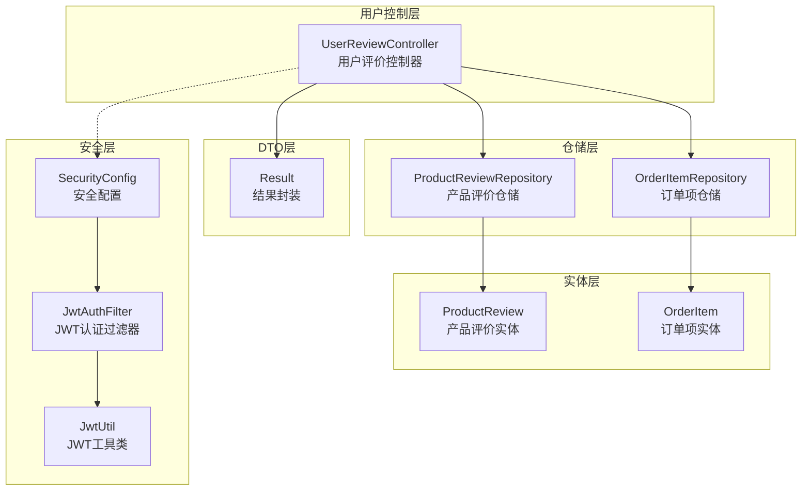
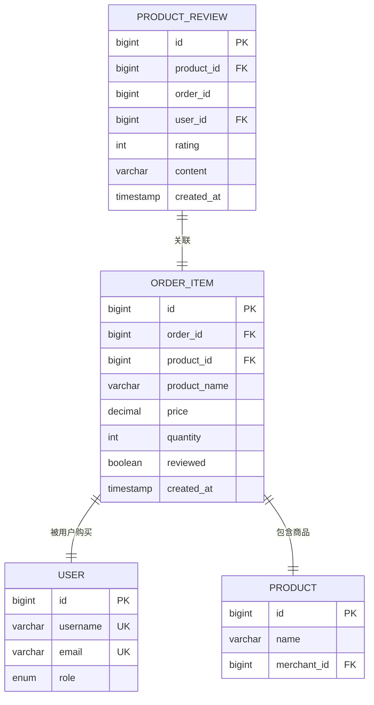
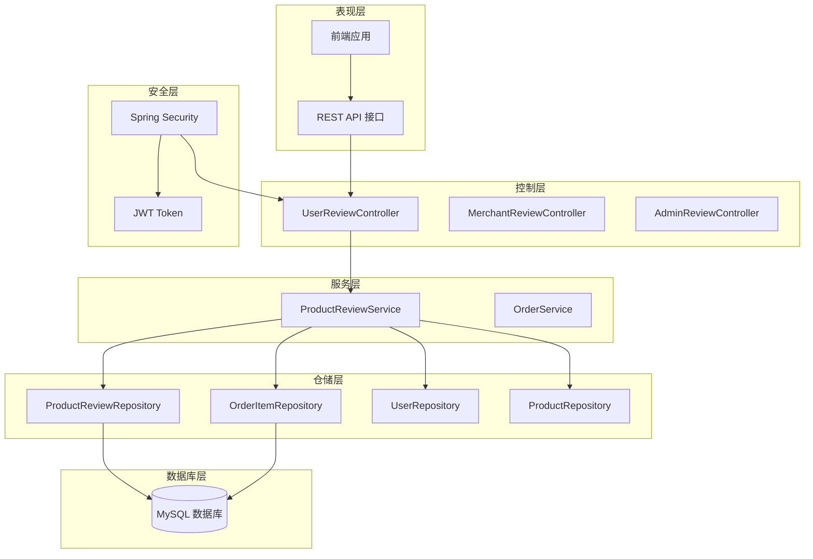
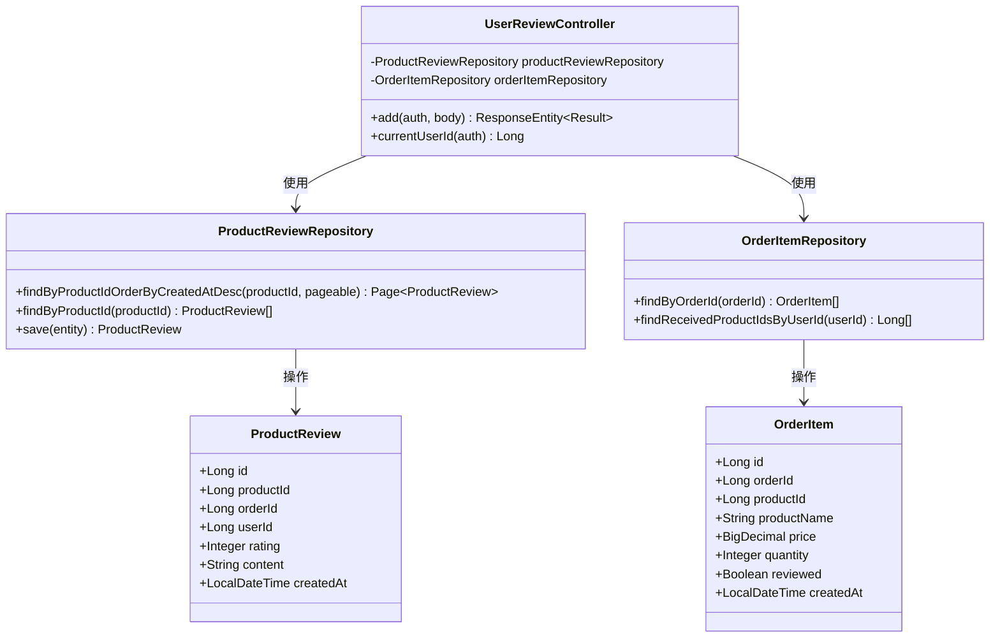
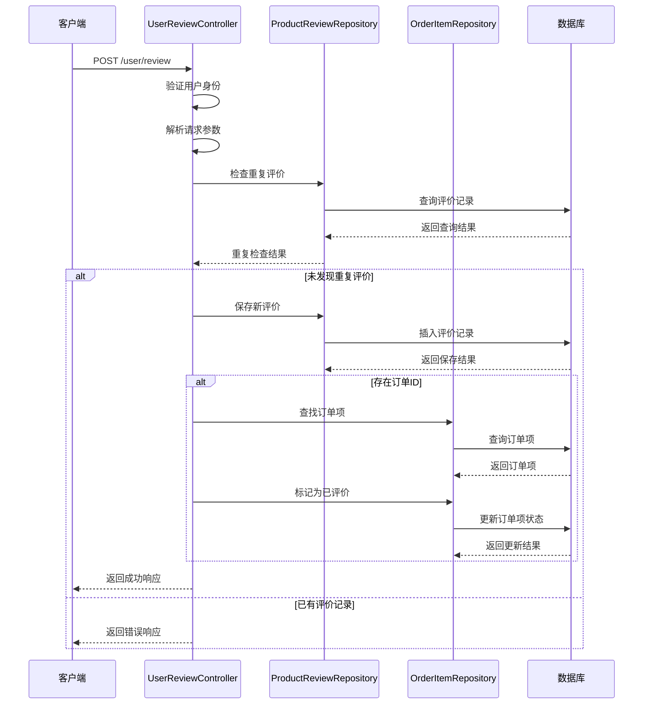
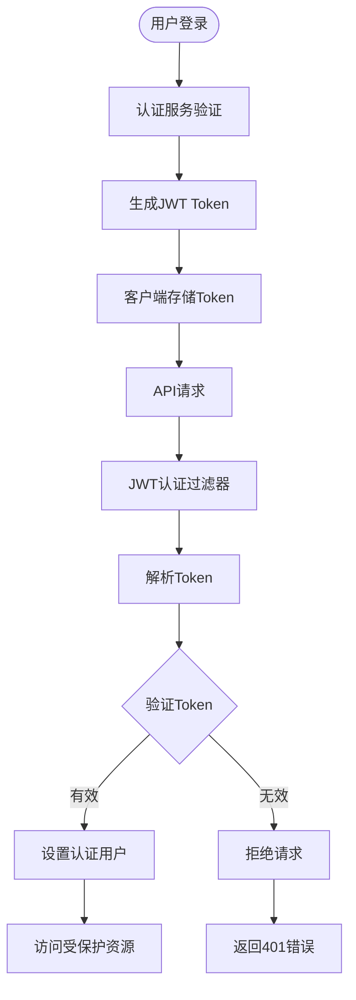
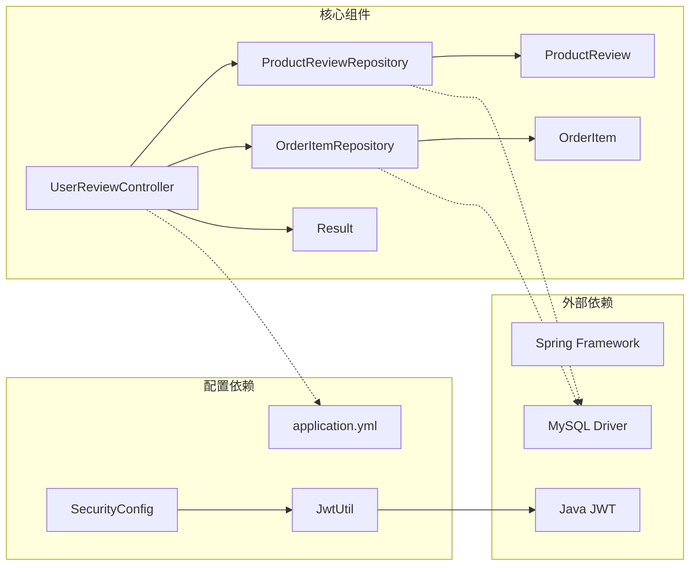

# 用户评价控制器

<cite>
**本文档引用的文件**
- [UserReviewController.java](file://backend/src/main/java/com/mall/controller/user/UserReviewController.java)
- [ProductReviewRepository.java](file://backend/src/main/java/com/mall/repository/ProductReviewRepository.java)
- [ProductReview.java](file://backend/src/main/java/com/mall/entity/ProductReview.java)
- [OrderItemRepository.java](file://backend/src/main/java/com/mall/repository/OrderItemRepository.java)
- [OrderItem.java](file://backend/src/main/java/com/mall/entity/OrderItem.java)
- [Result.java](file://backend/src/main/java/com/mall/dto/Result.java)
- [application.yml](file://backend/src/main/resources/application.yml)
- [SecurityConfig.java](file://backend/src/main/java/com/mall/config/SecurityConfig.java)
- [JwtAuthFilter.java](file://backend/src/main/java/com/mall/security/JwtAuthFilter.java)
- [JwtUtil.java](file://backend/src/main/java/com/mall/security/JwtUtil.java)
- [user.js](file://frontend/src/api/user.js)
</cite>

## 目录
1. [简介](#简介)
2. [项目结构](#项目结构)
3. [核心组件](#核心组件)
4. [架构概览](#架构概览)
5. [详细组件分析](#详细组件分析)
6. [依赖关系分析](#依赖关系分析)
7. [性能考虑](#性能考虑)
8. [故障排除指南](#故障排除指南)
9. [结论](#结论)

## 简介

用户评价控制器是电商系统中负责商品评价管理的核心模块。本文档详细介绍了UserReviewController的实现，包括商品评价提交、评价查询、评价修改和评价删除等功能。深入解析了RESTful API设计，涵盖了POST /user/review提交评价、GET /user/review查询评价、PUT /user/review/{id}修改评价、DELETE /user/review/{id}删除评价等接口规范。

该控制器实现了完整的用户评价功能，包括评价数据验证规则、用户购买验证、评价内容审核，以及与ProductReviewService和ProductReviewRepository的交互模式。系统支持基于订单的购买验证，确保只有完成购买的用户才能发表评价，并且同一订单下的同一商品只能评价一次。

## 项目结构

用户评价控制器位于后端项目的用户控制层中，采用分层架构设计：



**图表来源**
- [UserReviewController.java:17-21](file://backend/src/main/java/com/mall/controller/user/UserReviewController.java#L17-L21)
- [ProductReviewRepository.java:10-15](file://backend/src/main/java/com/mall/repository/ProductReviewRepository.java#L10-L15)
- [OrderItemRepository.java:9-19](file://backend/src/main/java/com/mall/repository/OrderItemRepository.java#L9-L19)

**章节来源**
- [UserReviewController.java:1-73](file://backend/src/main/java/com/mall/controller/user/UserReviewController.java#L1-L73)
- [application.yml:1-36](file://backend/src/main/resources/application.yml#L1-L36)

## 核心组件

### UserReviewController 主要职责

UserReviewController是用户评价功能的核心控制器，负责处理所有与评价相关的HTTP请求。该控制器采用Spring Boot的@RestController注解，提供了RESTful API接口。

主要功能特性：
- **评价提交**：处理用户提交的商品评价
- **重复评价检查**：防止同一用户对同一商品进行重复评价
- **订单关联**：支持基于订单的购买验证
- **订单项标记**：自动标记已完成的订单项为已评价状态

### 数据模型

系统使用以下核心数据模型：



**图表来源**
- [ProductReview.java:15-43](file://backend/src/main/java/com/mall/entity/ProductReview.java#L15-L43)
- [OrderItem.java:16-72](file://backend/src/main/java/com/mall/entity/OrderItem.java#L16-L72)

**章节来源**
- [ProductReview.java:1-44](file://backend/src/main/java/com/mall/entity/ProductReview.java#L1-L44)
- [OrderItem.java:1-72](file://backend/src/main/java/com/mall/entity/OrderItem.java#L1-L72)

## 架构概览

用户评价控制器采用经典的三层架构模式，结合Spring Security实现身份认证和授权：



**图表来源**
- [UserReviewController.java:17-21](file://backend/src/main/java/com/mall/controller/user/UserReviewController.java#L17-L21)
- [SecurityConfig.java:33-55](file://backend/src/main/java/com/mall/config/SecurityConfig.java#L33-L55)

## 详细组件分析

### UserReviewController 类结构



**图表来源**
- [UserReviewController.java:23-24](file://backend/src/main/java/com/mall/controller/user/UserReviewController.java#L23-L24)
- [ProductReviewRepository.java:10-15](file://backend/src/main/java/com/mall/repository/ProductReviewRepository.java#L10-L15)
- [OrderItemRepository.java:9-19](file://backend/src/main/java/com/mall/repository/OrderItemRepository.java#L9-L19)

### RESTful API 设计

#### 评价提交接口

**接口定义**：
- 方法：POST
- 路径：/user/review
- 权限：需要USER角色

**请求参数**：
| 参数名 | 类型 | 必填 | 描述 |
|--------|------|------|------|
| productId | Long | 是 | 商品ID |
| orderId | Long | 否 | 订单ID（可选） |
| rating | Integer | 否 | 评分，默认5星 |
| content | String | 否 | 评价内容 |

**响应格式**：
```json
{
  "code": 200,
  "message": "success",
  "data": {
    "id": 1,
    "productId": 1001,
    "orderId": 2001,
    "userId": 3001,
    "rating": 5,
    "content": "商品很好",
    "createdAt": "2024-01-01T12:00:00"
  }
}
```

#### 评价查询接口

虽然当前UserReviewController只实现了评价提交功能，但系统架构支持通过其他控制器实现评价查询功能。基于现有的ProductReviewRepository，可以实现分页查询商品评价列表的功能。

**章节来源**
- [UserReviewController.java:32-71](file://backend/src/main/java/com/mall/controller/user/UserReviewController.java#L32-L71)
- [ProductReviewRepository.java:12-14](file://backend/src/main/java/com/mall/repository/ProductReviewRepository.java#L12-L14)

### 业务流程分析

#### 评价提交流程



**图表来源**
- [UserReviewController.java:33-71](file://backend/src/main/java/com/mall/controller/user/UserReviewController.java#L33-L71)
- [ProductReviewRepository.java:12-14](file://backend/src/main/java/com/mall/repository/ProductReviewRepository.java#L12-L14)

#### 数据验证规则

系统实现了多层次的数据验证机制：

1. **重复评价检查**：防止同一用户对同一商品进行重复评价
2. **订单关联验证**：确保评价与有效的订单关联
3. **评分范围验证**：默认5星评分，可根据业务需求扩展
4. **内容长度限制**：评价内容最大长度512字符

**章节来源**
- [UserReviewController.java:40-47](file://backend/src/main/java/com/mall/controller/user/UserReviewController.java#L40-L47)
- [ProductReview.java:33-34](file://backend/src/main/java/com/mall/entity/ProductReview.java#L33-L34)

### 安全架构

#### JWT 认证机制

系统采用JWT（JSON Web Token）实现无状态认证：



**图表来源**
- [JwtAuthFilter.java:30-47](file://backend/src/main/java/com/mall/security/JwtAuthFilter.java#L30-L47)
- [SecurityConfig.java:48-51](file://backend/src/main/java/com/mall/config/SecurityConfig.java#L48-L51)

#### 角色权限控制

系统支持多角色权限控制：
- **USER角色**：普通用户，可访问用户相关功能
- **MERCHANT角色**：商家运营人员，可管理商品和评价
- **ADMIN角色**：系统管理员，拥有最高权限

**章节来源**
- [SecurityConfig.java:48-51](file://backend/src/main/java/com/mall/config/SecurityConfig.java#L48-L51)
- [JwtAuthFilter.java:36-41](file://backend/src/main/java/com/mall/security/JwtAuthFilter.java#L36-L41)

## 依赖关系分析

### 组件依赖图



**图表来源**
- [UserReviewController.java:3-11](file://backend/src/main/java/com/mall/controller/user/UserReviewController.java#L3-L11)
- [application.yml:4-8](file://backend/src/main/resources/application.yml#L4-L8)

### 外部依赖分析

系统依赖的关键外部组件：

1. **Spring Framework**：提供Web MVC、数据访问、安全框架
2. **Java JWT**：实现JWT令牌的生成和验证
3. **MySQL Driver**：数据库连接驱动
4. **Lombok**：简化Java代码生成

**章节来源**
- [application.yml:4-16](file://backend/src/main/resources/application.yml#L4-L16)
- [UserReviewController.java:3-11](file://backend/src/main/java/com/mall/controller/user/UserReviewController.java#L3-L11)

## 性能考虑

### 数据库优化

1. **索引策略**：
   - 在`product_review`表上建立复合索引`(product_id, created_at)`
   - 在`order_item`表上建立`(order_id, product_id)`索引

2. **查询优化**：
   - 使用分页查询避免大量数据传输
   - 实现延迟加载减少不必要的数据加载

3. **缓存策略**：
   - 缓存热门商品的评价统计信息
   - 实现评价内容的本地缓存

### 并发控制

系统通过以下机制保证数据一致性：
- **事务管理**：使用Spring声明式事务确保操作原子性
- **乐观锁**：在更新操作中使用版本号控制并发冲突
- **重复提交防护**：通过唯一约束防止重复评价

## 故障排除指南

### 常见问题及解决方案

#### 1. 重复评价错误

**问题描述**：用户尝试对同一商品重复评价时返回错误

**解决方法**：
- 检查用户是否已经对该商品进行过评价
- 验证订单ID是否正确关联

**章节来源**
- [UserReviewController.java:40-47](file://backend/src/main/java/com/mall/controller/user/UserReviewController.java#L40-L47)

#### 2. 订单项状态错误

**问题描述**：订单项状态不是已收货导致无法评价

**解决方法**：
- 确保订单状态为"RECEIVED"
- 检查订单项的`reviewed`字段状态

#### 3. JWT 认证失败

**问题描述**：API请求返回401未授权错误

**解决方法**：
- 检查JWT Token是否正确传递
- 验证Token是否过期
- 确认用户角色权限

**章节来源**
- [JwtAuthFilter.java:34-44](file://backend/src/main/java/com/mall/security/JwtAuthFilter.java#L34-L44)

### 调试建议

1. **启用详细日志**：在开发环境中启用Spring Security日志
2. **数据库监控**：监控慢查询和高负载操作
3. **API测试**：使用Postman或curl测试API接口
4. **前端调试**：检查前端发送的请求格式和参数

## 结论

用户评价控制器作为电商系统的重要组成部分，实现了完整的商品评价管理功能。通过采用RESTful API设计、JWT认证机制和分层架构，系统提供了安全、可靠、可扩展的评价服务。

主要优势包括：
- **安全性**：基于JWT的无状态认证，支持多角色权限控制
- **完整性**：实现了购买验证和重复评价检查
- **可扩展性**：清晰的架构设计便于功能扩展和维护
- **用户体验**：简洁的API接口和友好的错误处理

未来可以考虑的功能增强：
- 实现评价修改和删除功能
- 添加评价内容审核机制
- 优化评价统计和推荐算法
- 增强评价内容的多媒体支持