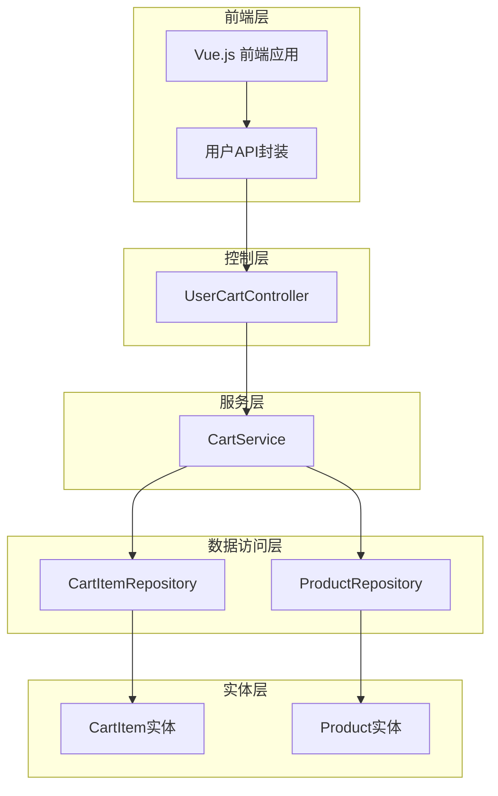
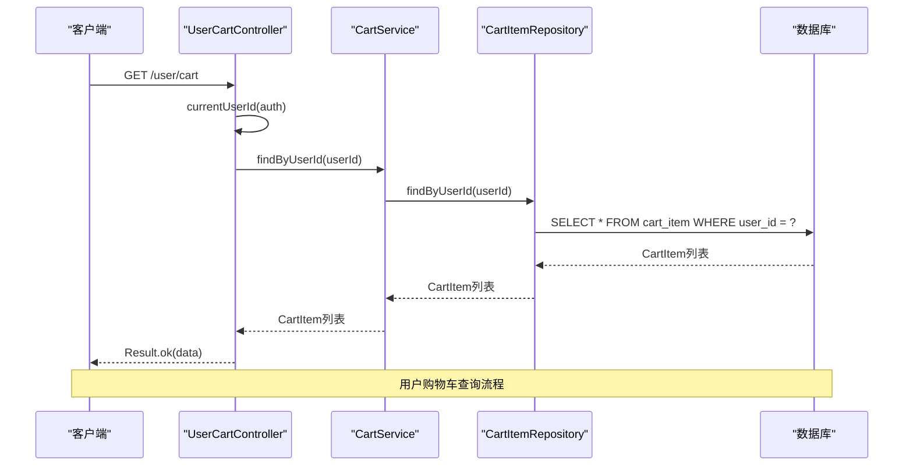
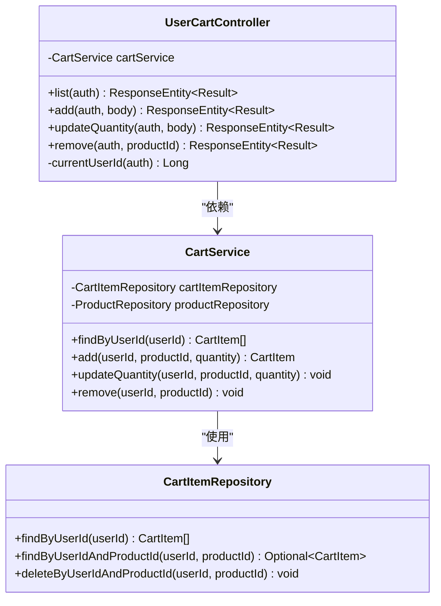
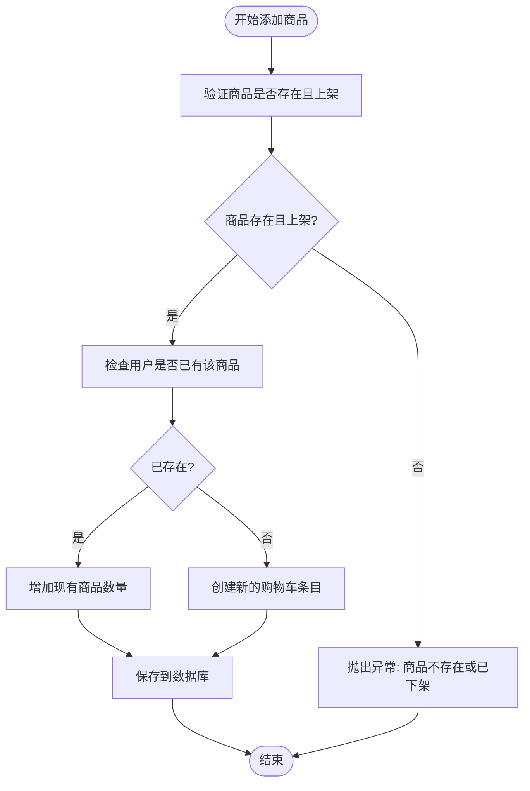
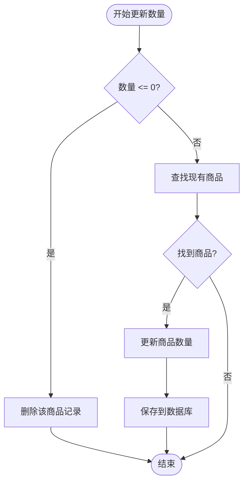
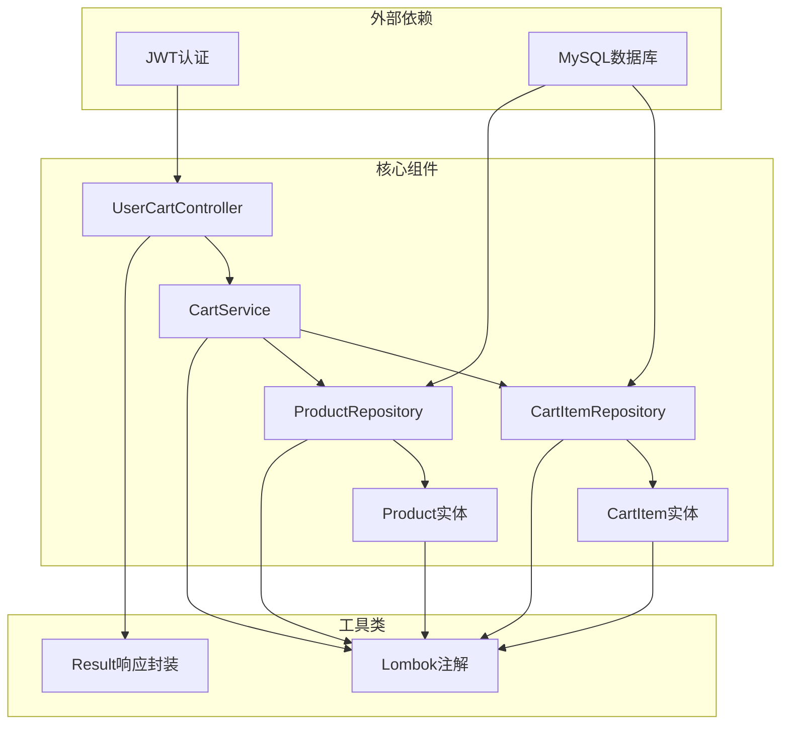
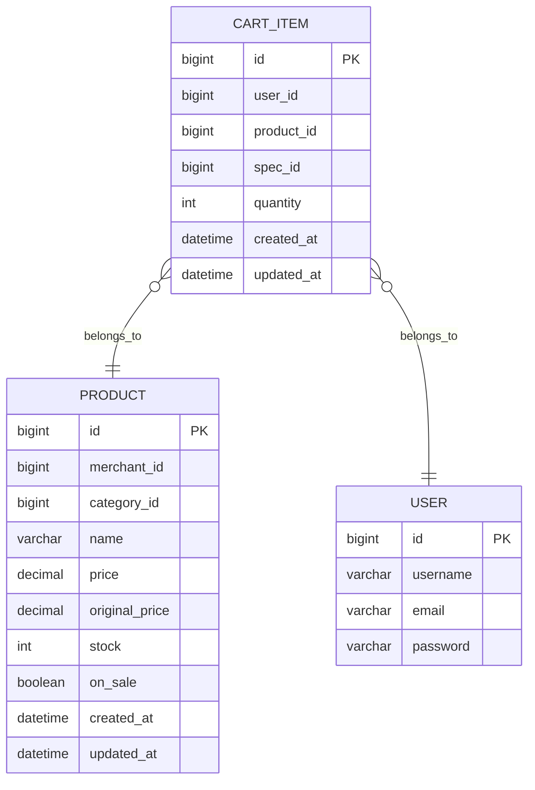

# 用户购物车控制器

<cite>
**本文档引用的文件**
- [UserCartController.java](file://backend/src/main/java/com/mall/controller/user/UserCartController.java)
- [CartService.java](file://backend/src/main/java/com/mall/service/CartService.java)
- [CartItemRepository.java](file://backend/src/main/java/com/mall/repository/CartItemRepository.java)
- [CartItem.java](file://backend/src/main/java/com/mall/entity/CartItem.java)
- [CartItemDTO.java](file://backend/src/main/java/com/mall/dto/CartItemDTO.java)
- [CartItemRequest.java](file://backend/src/main/java/com/mall/dto/CartItemRequest.java)
- [Product.java](file://backend/src/main/java/com/mall/entity/Product.java)
- [ProductRepository.java](file://backend/src/main/java/com/mall/repository/ProductRepository.java)
- [Result.java](file://backend/src/main/java/com/mall/dto/Result.java)
- [application.yml](file://backend/src/main/resources/application.yml)
- [Cart.vue](file://frontend/src/views/user/Cart.vue)
- [user.js](file://frontend/src/api/user.js)
</cite>

## 目录
1. [简介](#简介)
2. [项目结构](#项目结构)
3. [核心组件](#核心组件)
4. [架构概览](#架构概览)
5. [详细组件分析](#详细组件分析)
6. [依赖关系分析](#依赖关系分析)
7. [性能考虑](#性能考虑)
8. [故障排除指南](#故障排除指南)
9. [结论](#结论)
10. [附录](#附录)

## 简介

用户购物车控制器是电商系统中的核心功能模块，负责管理用户的购物车操作。本文档深入解析UserCartController的实现，包括购物车商品查询、添加商品、修改数量、删除商品等功能。详细说明GET /user/cart、POST /user/cart/add、PUT /user/cart/quantity、DELETE /user/cart/{productId}等API的设计和实现。

该系统采用Spring Boot + Spring MVC + JPA的技术栈，实现了完整的购物车业务逻辑，包括商品数量验证、价格计算逻辑，以及与CartService和CartItemRepository的交互模式。

## 项目结构

购物车功能在MVC架构中按照层次清晰地组织：



**图表来源**
- [UserCartController.java:14-66](file://backend/src/main/java/com/mall/controller/user/UserCartController.java#L14-L66)
- [CartService.java:14-61](file://backend/src/main/java/com/mall/service/CartService.java#L14-L61)
- [CartItemRepository.java:9-20](file://backend/src/main/java/com/mall/repository/CartItemRepository.java#L9-L20)

**章节来源**
- [UserCartController.java:1-67](file://backend/src/main/java/com/mall/controller/user/UserCartController.java#L1-L67)
- [application.yml:1-36](file://backend/src/main/resources/application.yml#L1-L36)

## 核心组件

### 控制器层

UserCartController作为RESTful API的入口点，提供了四个主要的购物车操作接口：

1. **GET /user/cart** - 查询当前用户购物车
2. **POST /user/cart/add** - 添加商品到购物车
3. **PUT /user/cart/quantity** - 更新购物车商品数量
4. **DELETE /user/cart/{productId}** - 从购物车移除商品

每个接口都通过Authentication对象获取当前登录用户ID，并调用CartService执行相应的业务逻辑。

**章节来源**
- [UserCartController.java:27-65](file://backend/src/main/java/com/mall/controller/user/UserCartController.java#L27-L65)

### 服务层

CartService实现了购物车的核心业务逻辑，包含以下关键方法：

- `findByUserId(Long userId)` - 根据用户ID查询购物车列表
- `add(Long userId, Long productId, int quantity)` - 添加商品到购物车
- `updateQuantity(Long userId, Long productId, int quantity)` - 更新商品数量
- `remove(Long userId, Long productId)` - 移除指定商品

所有操作都在事务性上下文中执行，确保数据一致性。

**章节来源**
- [CartService.java:21-60](file://backend/src/main/java/com/mall/service/CartService.java#L21-L60)

### 数据访问层

CartItemRepository继承自JpaRepository，提供了购物车数据的CRUD操作：
- `findByUserId(Long userId)` - 查询用户购物车
- `findByUserIdAndProductId(Long userId, Long productId)` - 根据用户和商品查询
- `deleteByUserIdAndProductId(Long userId, Long productId)` - 删除用户商品

**章节来源**
- [CartItemRepository.java:9-20](file://backend/src/main/java/com/mall/repository/CartItemRepository.java#L9-L20)

## 架构概览

购物车系统的整体架构遵循经典的三层架构模式：



**图表来源**
- [UserCartController.java:28-32](file://backend/src/main/java/com/mall/controller/user/UserCartController.java#L28-L32)
- [CartService.java:21-23](file://backend/src/main/java/com/mall/service/CartService.java#L21-L23)
- [CartItemRepository.java:11](file://backend/src/main/java/com/mall/repository/CartItemRepository.java#L11)

**章节来源**
- [UserCartController.java:14-66](file://backend/src/main/java/com/mall/controller/user/UserCartController.java#L14-L66)
- [CartService.java:14-61](file://backend/src/main/java/com/mall/service/CartService.java#L14-L61)

## 详细组件分析

### UserCartController 实现分析

#### 类结构图



**图表来源**
- [UserCartController.java:18-25](file://backend/src/main/java/com/mall/controller/user/UserCartController.java#L18-L25)
- [CartService.java:18-19](file://backend/src/main/java/com/mall/service/CartService.java#L18-L19)
- [CartItemRepository.java:9-19](file://backend/src/main/java/com/mall/repository/CartItemRepository.java#L9-L19)

#### API 接口设计

##### GET /user/cart - 购物车查询

该接口用于获取当前登录用户的购物车内容：

**请求参数：**
- 无显式参数，通过Authentication对象获取用户ID

**响应格式：**
- 成功：Result.ok(List<CartItem>)
- 失败：Result.fail(String)

**业务逻辑：**
1. 从Authentication对象提取用户ID
2. 调用CartService.findByUserId(userId)
3. 返回Result包装的购物车列表

**章节来源**
- [UserCartController.java:27-32](file://backend/src/main/java/com/mall/controller/user/UserCartController.java#L27-L32)
- [CartService.java:21-23](file://backend/src/main/java/com/mall/service/CartService.java#L21-L23)

##### POST /user/cart/add - 添加商品到购物车

该接口支持向购物车添加商品，包含商品数量验证：

**请求体参数：**
- productId: 商品ID (必需)
- quantity: 商品数量 (可选，默认为1)

**响应格式：**
- 成功：Result.ok(CartItem)
- 失败：Result.fail(String)

**业务逻辑：**
1. 解析请求体中的productId和quantity
2. 调用CartService.add(userId, productId, quantity)
3. 在add方法中进行商品存在性和状态验证
4. 如果商品已存在则增加数量，否则创建新记录

**章节来源**
- [UserCartController.java:34-45](file://backend/src/main/java/com/mall/controller/user/UserCartController.java#L34-L45)
- [CartService.java:25-43](file://backend/src/main/java/com/mall/service/CartService.java#L25-L43)

##### PUT /user/cart/quantity - 更新商品数量

该接口用于修改购物车中商品的数量：

**请求体参数：**
- productId: 商品ID (必需)
- quantity: 新的数量 (必需)

**业务逻辑：**
1. 当quantity <= 0时，直接删除该商品记录
2. 否则更新现有商品的数量

**章节来源**
- [UserCartController.java:47-58](file://backend/src/main/java/com/mall/controller/user/UserCartController.java#L47-L58)
- [CartService.java:45-55](file://backend/src/main/java/com/mall/service/CartService.java#L45-L55)

##### DELETE /user/cart/{productId} - 移除商品

该接口用于从购物车中移除指定商品：

**路径参数：**
- productId: 商品ID

**业务逻辑：**
直接调用CartService.remove(userId, productId)删除对应记录

**章节来源**
- [UserCartController.java:60-65](file://backend/src/main/java/com/mall/controller/user/UserCartController.java#L60-L65)
- [CartService.java:57-60](file://backend/src/main/java/com/mall/service/CartService.java#L57-L60)

### CartService 业务逻辑分析

#### 商品添加流程



**图表来源**
- [CartService.java:26-43](file://backend/src/main/java/com/mall/service/CartService.java#L26-L43)

#### 数量更新流程



**图表来源**
- [CartService.java:46-55](file://backend/src/main/java/com/mall/service/CartService.java#L46-L55)

**章节来源**
- [CartService.java:14-61](file://backend/src/main/java/com/mall/service/CartService.java#L14-L61)

### 数据模型分析

#### CartItem 实体结构

CartItem实体定义了购物车的数据结构，包含以下关键字段：

| 字段名 | 类型 | 描述 | 约束 |
|--------|------|------|------|
| id | Long | 主键ID | 自增 |
| userId | Long | 用户ID | 非空 |
| productId | Long | 商品ID | 非空 |
| specId | Long | 规格ID | 可为空 |
| quantity | Integer | 商品数量 | 非空，默认1 |
| createdAt | LocalDateTime | 创建时间 | 非空，不可更新 |
| updatedAt | LocalDateTime | 更新时间 | 可为空 |

**唯一约束：**
- (user_id, product_id) - 确保同一用户不能重复添加同一商品
- (user_id, product_id, spec_id) - 支持规格化的购物车条目

**章节来源**
- [CartItem.java:8-49](file://backend/src/main/java/com/mall/entity/CartItem.java#L8-L49)

#### DTO 对象设计

##### CartItemDTO
用于API响应的购物车数据传输对象，包含商品的完整信息：

- id: 购物车条目ID
- productId: 商品ID
- productName: 商品名称
- productImage: 商品图片
- price: 商品价格
- specId: 规格ID
- specValue: 规格值
- specName: 规格名称
- quantity: 数量
- totalPrice: 小计金额

##### CartItemRequest
用于API请求的商品信息传输对象：

- productId: 商品ID
- specId: 规格ID (可为空)
- quantity: 数量

**章节来源**
- [CartItemDTO.java:11-32](file://backend/src/main/java/com/mall/dto/CartItemDTO.java#L11-L32)
- [CartItemRequest.java:9-16](file://backend/src/main/java/com/mall/dto/CartItemRequest.java#L9-L16)

## 依赖关系分析

### 组件依赖图



**图表来源**
- [UserCartController.java:3-9](file://backend/src/main/java/com/mall/controller/user/UserCartController.java#L3-L9)
- [CartService.java:3-8](file://backend/src/main/java/com/mall/service/CartService.java#L3-L8)
- [application.yml:4-8](file://backend/src/main/resources/application.yml#L4-L8)

### 数据库关系图



**图表来源**
- [CartItem.java:17-31](file://backend/src/main/java/com/mall/entity/CartItem.java#L17-L31)
- [Product.java:18-78](file://backend/src/main/java/com/mall/entity/Product.java#L18-L78)

**章节来源**
- [CartItemRepository.java:9-20](file://backend/src/main/java/com/mall/repository/CartItemRepository.java#L9-L20)
- [ProductRepository.java:13-124](file://backend/src/main/java/com/mall/repository/ProductRepository.java#L13-L124)

## 性能考虑

### 数据库优化策略

1. **索引优化**
   - cart_item表的唯一约束确保查询效率
   - 建议在user_id和product_id上建立复合索引

2. **查询优化**
   - 使用JPA的@Query注解优化复杂查询
   - 避免N+1查询问题，使用批量加载

3. **缓存策略**
   - 考虑在Redis中缓存热门商品信息
   - 购物车数据可以短期缓存以减少数据库压力

### 事务管理

- 所有购物车操作都在@Transactional注解的方法中执行
- 确保数据一致性和原子性操作

### 前端性能优化

前端购物车页面实现了骨架屏加载和懒加载机制，提升用户体验：

- 使用Element UI的加载状态组件
- 异步加载商品详情信息
- 实时计算总价，避免重复计算

## 故障排除指南

### 常见错误及解决方案

#### 商品不存在或已下架
**错误信息：** "商品不存在或已下架"
**可能原因：**
- 商品ID无效
- 商品已下架
- 商品已被删除

**解决方案：**
- 验证商品ID的有效性
- 检查商品的onSale状态
- 提供友好的错误提示

#### 数量验证失败
**错误信息：** 数量必须大于0
**可能原因：**
- 请求参数quantity <= 0
- 传入了负数或零

**解决方案：**
- 在前端进行数量验证
- 提供最小数量限制（通常为1）

#### 数据库约束冲突
**错误信息：** 违反唯一约束
**可能原因：**
- 同一用户重复添加同一商品
- 规格ID冲突

**解决方案：**
- 使用唯一约束防止重复添加
- 提供规格化支持

**章节来源**
- [CartService.java:27-28](file://backend/src/main/java/com/mall/service/CartService.java#L27-L28)
- [CartItemRepository.java:83-84](file://backend/src/main/resources/mall.sql#L83-L84)

### 调试建议

1. **启用SQL日志**
   ```yaml
   spring:
     jpa:
       show-sql: true
   ```

2. **检查JWT令牌**
   - 确保用户已正确登录
   - 验证JWT令牌的有效期

3. **监控数据库连接**
   - 检查数据库连接池配置
   - 监控慢查询

## 结论

用户购物车控制器实现了完整的购物车管理功能，具有以下特点：

1. **清晰的架构设计** - 遵循MVC模式，职责分离明确
2. **完善的业务逻辑** - 包含商品验证、数量管理、状态控制
3. **良好的扩展性** - 支持规格化购物车条目
4. **可靠的错误处理** - 提供详细的错误信息和处理机制

该系统为电商应用提供了稳定可靠的购物车功能基础，支持后续的功能扩展和性能优化。

## 附录

### API 接口规范

#### GET /user/cart
- **功能：** 查询当前用户购物车
- **认证：** 需要JWT令牌
- **响应：** Result<List<CartItem>>

#### POST /user/cart/add
- **功能：** 添加商品到购物车
- **请求体：** {productId: number, quantity?: number}
- **响应：** Result<CartItem>

#### PUT /user/cart/quantity
- **功能：** 更新商品数量
- **请求体：** {productId: number, quantity: number}
- **响应：** Result<void>

#### DELETE /user/cart/{productId}
- **功能：** 移除购物车商品
- **路径参数：** productId
- **响应：** Result<void>

### 前端集成示例

前端通过user.js中的API函数与后端交互：

```javascript
// 获取购物车列表
getCart()

// 添加商品到购物车
addCart({ productId: 1, quantity: 2 })

// 更新商品数量
updateCartQuantity({ productId: 1, quantity: 3 })

// 移除商品
removeCart(1)
```

**章节来源**
- [user.js:18-36](file://frontend/src/api/user.js#L18-L36)
- [Cart.vue:375-421](file://frontend/src/views/user/Cart.vue#L375-L421)