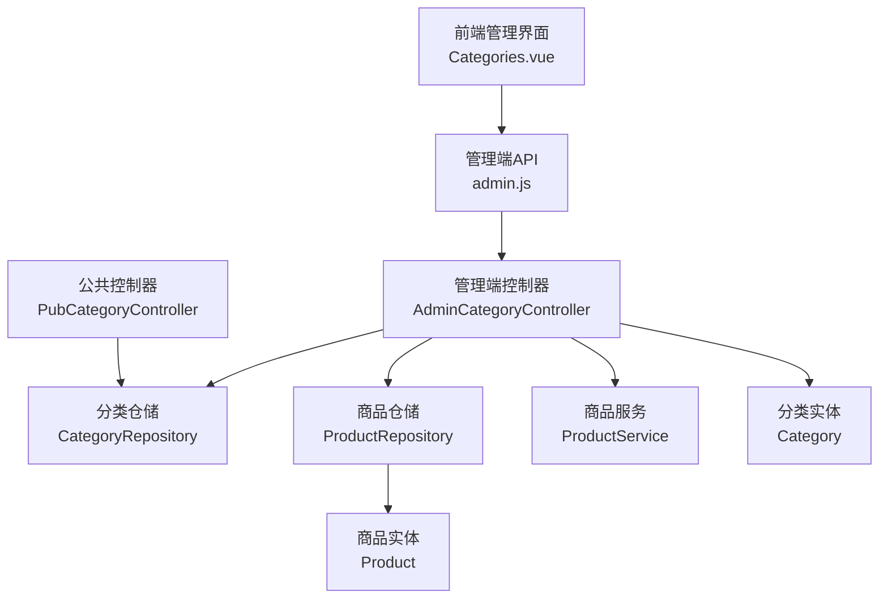
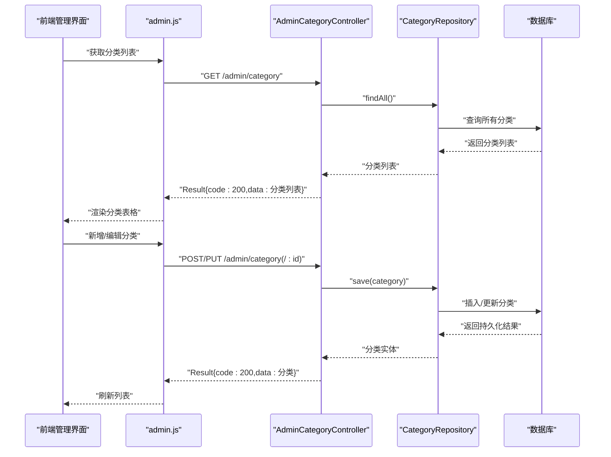
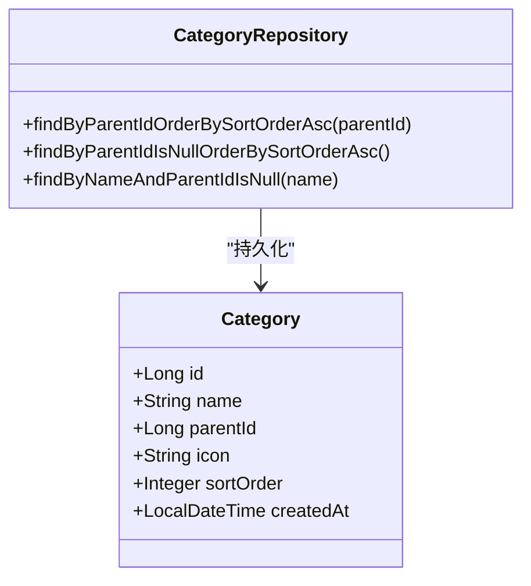
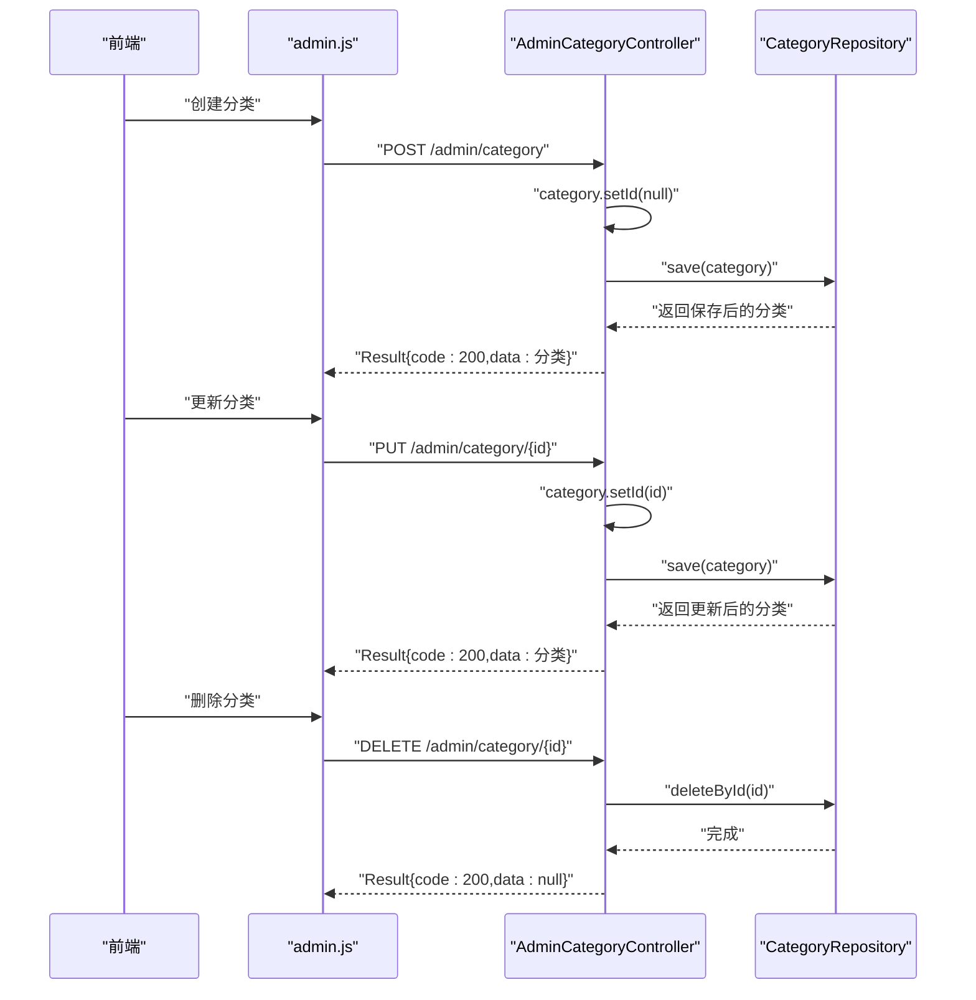
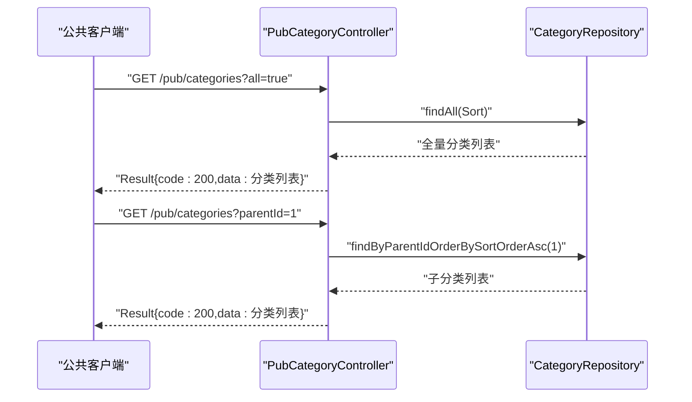
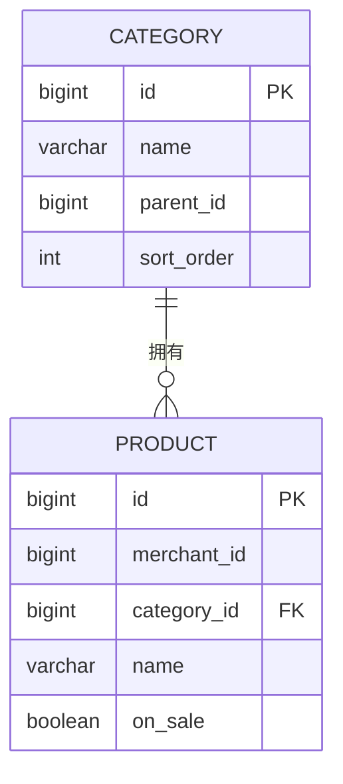
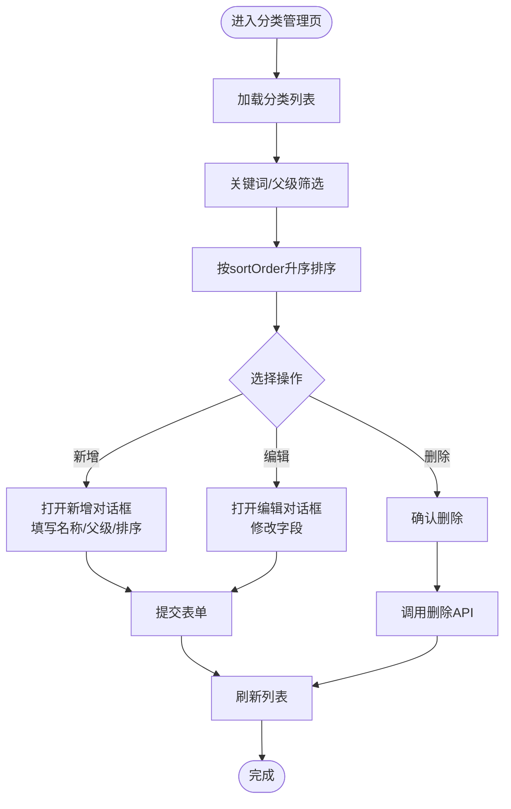
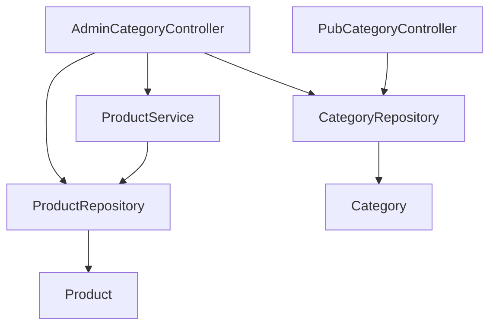

# 管理员商品分类管理

<cite>
**本文档引用的文件**
- [Category.java](file://backend/src/main/java/com/mall/entity/Category.java)
- [CategoryRepository.java](file://backend/src/main/java/com/mall/repository/CategoryRepository.java)
- [AdminCategoryController.java](file://backend/src/main/java/com/mall/controller/admin/AdminCategoryController.java)
- [PubCategoryController.java](file://backend/src/main/java/com/mall/controller/pub/PubCategoryController.java)
- [Product.java](file://backend/src/main/java/com/mall/entity/Product.java)
- [ProductRepository.java](file://backend/src/main/java/com/mall/repository/ProductRepository.java)
- [ProductService.java](file://backend/src/main/java/com/mall/service/ProductService.java)
- [Categories.vue](file://frontend/src/views/admin/Categories.vue)
- [admin.js](file://frontend/src/api/admin.js)
- [application.yml](file://backend/src/main/resources/application.yml)
- [Result.java](file://backend/src/main/java/com/mall/dto/Result.java)
</cite>

## 目录
1. [简介](#简介)
2. [项目结构](#项目结构)
3. [核心组件](#核心组件)
4. [架构总览](#架构总览)
5. [详细组件分析](#详细组件分析)
6. [依赖关系分析](#依赖关系分析)
7. [性能考虑](#性能考虑)
8. [故障排除指南](#故障排除指南)
9. [结论](#结论)
10. [附录](#附录)

## 简介
本技术文档围绕管理员商品分类管理功能展开，系统性解析分类的层级结构设计、增删改查操作、排序与层级关系维护、树形结构实现原理、父子分类关联机制、分类与商品关联统计，以及与商品管理模块的集成关系。文档还提供完整的分类管理API接口定义、分类缓存策略与性能优化建议，并对分类数据导入导出与批量更新等高级功能进行实现细节说明。

## 项目结构
后端采用Spring Boot + JPA架构，前端使用Vue 3 + Element Plus构建管理界面。分类管理涉及以下关键层次：
- 实体层：Category（分类）、Product（商品）
- 数据访问层：CategoryRepository、ProductRepository
- 控制器层：AdminCategoryController（管理端）、PubCategoryController（公共端）
- 服务层：ProductService（商品服务）
- 前端视图与API：Categories.vue、admin.js
- 配置：application.yml（数据库、JPA、JWT等）

图表来源
- [AdminCategoryController.java:1-47](file://backend/src/main/java/com/mall/controller/admin/AdminCategoryController.java#L1-L47)
- [PubCategoryController.java:1-37](file://backend/src/main/java/com/mall/controller/pub/PubCategoryController.java#L1-L37)
- [CategoryRepository.java:1-17](file://backend/src/main/java/com/mall/repository/CategoryRepository.java#L1-L17)
- [ProductRepository.java:1-125](file://backend/src/main/java/com/mall/repository/ProductRepository.java#L1-L125)
- [ProductService.java:1-126](file://backend/src/main/java/com/mall/service/ProductService.java#L1-L126)
- [Category.java:1-41](file://backend/src/main/java/com/mall/entity/Category.java#L1-L41)
- [Product.java:1-101](file://backend/src/main/java/com/mall/entity/Product.java#L1-L101)
- [Categories.vue:1-236](file://frontend/src/views/admin/Categories.vue#L1-L236)
- [admin.js:1-129](file://frontend/src/api/admin.js#L1-L129)

章节来源
- [AdminCategoryController.java:1-47](file://backend/src/main/java/com/mall/controller/admin/AdminCategoryController.java#L1-L47)
- [PubCategoryController.java:1-37](file://backend/src/main/java/com/mall/controller/pub/PubCategoryController.java#L1-L37)
- [CategoryRepository.java:1-17](file://backend/src/main/java/com/mall/repository/CategoryRepository.java#L1-L17)
- [ProductRepository.java:1-125](file://backend/src/main/java/com/mall/repository/ProductRepository.java#L1-L125)
- [ProductService.java:1-126](file://backend/src/main/java/com/mall/service/ProductService.java#L1-L126)
- [Category.java:1-41](file://backend/src/main/java/com/mall/entity/Category.java#L1-L41)
- [Product.java:1-101](file://backend/src/main/java/com/mall/entity/Product.java#L1-L101)
- [Categories.vue:1-236](file://frontend/src/views/admin/Categories.vue#L1-L236)
- [admin.js:1-129](file://frontend/src/api/admin.js#L1-L129)

## 核心组件
- 分类实体（Category）：包含自增ID、名称、父级ID、图标、排序字段、创建时间等，支持层级父子关系与排序。
- 分类仓储（CategoryRepository）：提供按父级查询、顶级查询、名称唯一性校验等方法。
- 管理端控制器（AdminCategoryController）：提供分类列表、创建、更新、删除的REST接口。
- 公共分类控制器（PubCategoryController）：提供按父级或全量查询的公开接口。
- 商品实体（Product）：包含分类ID字段，用于建立分类与商品的关联。
- 商品仓储（ProductRepository）：提供按分类查询商品、公开端按分类查询等方法。
- 商品服务（ProductService）：封装商品查询逻辑，包括按分类查询。
- 前端分类页面（Categories.vue）：提供分类列表、搜索、筛选、排序、新增/编辑/删除交互。
- 前端API（admin.js）：封装管理端分类相关HTTP请求。

章节来源
- [Category.java:1-41](file://backend/src/main/java/com/mall/entity/Category.java#L1-L41)
- [CategoryRepository.java:1-17](file://backend/src/main/java/com/mall/repository/CategoryRepository.java#L1-L17)
- [AdminCategoryController.java:1-47](file://backend/src/main/java/com/mall/controller/admin/AdminCategoryController.java#L1-L47)
- [PubCategoryController.java:1-37](file://backend/src/main/java/com/mall/controller/pub/PubCategoryController.java#L1-L37)
- [Product.java:1-101](file://backend/src/main/java/com/mall/entity/Product.java#L1-L101)
- [ProductRepository.java:1-125](file://backend/src/main/java/com/mall/repository/ProductRepository.java#L1-L125)
- [ProductService.java:1-126](file://backend/src/main/java/com/mall/service/ProductService.java#L1-L126)
- [Categories.vue:1-236](file://frontend/src/views/admin/Categories.vue#L1-L236)
- [admin.js:1-129](file://frontend/src/api/admin.js#L1-L129)

## 架构总览
管理员分类管理采用经典的MVC分层架构，前后端分离：
- 前端通过admin.js调用后端管理端接口，AdminCategoryController处理请求，CategoryRepository访问数据库。
- 公共端PubCategoryController提供用户侧分类查询，基于CategoryRepository实现。
- 商品模块通过ProductRepository与ProductService与分类建立关联，支持按分类查询商品。

图表来源
- [AdminCategoryController.java:20-45](file://backend/src/main/java/com/mall/controller/admin/AdminCategoryController.java#L20-L45)
- [CategoryRepository.java:9-16](file://backend/src/main/java/com/mall/repository/CategoryRepository.java#L9-L16)
- [admin.js:58-76](file://frontend/src/api/admin.js#L58-L76)

## 详细组件分析

### 分类实体与仓储设计
- 分类实体（Category）通过parentId实现父子层级关系；sortOrder控制同级排序；createdAt自动记录创建时间。
- 分类仓储提供：
  - 按父级查询并按sortOrder升序排列
  - 查询顶级分类（parentId为空）
  - 按名称与父级组合进行唯一性校验（用于避免同级重名）

图表来源
- [Category.java:15-40](file://backend/src/main/java/com/mall/entity/Category.java#L15-L40)
- [CategoryRepository.java:9-16](file://backend/src/main/java/com/mall/repository/CategoryRepository.java#L9-L16)

章节来源
- [Category.java:15-40](file://backend/src/main/java/com/mall/entity/Category.java#L15-L40)
- [CategoryRepository.java:9-16](file://backend/src/main/java/com/mall/repository/CategoryRepository.java#L9-L16)

### 管理端分类API
- 列表查询：GET /admin/category 返回所有分类
- 创建分类：POST /admin/category 接收分类对象，清空ID后保存
- 更新分类：PUT /admin/category/{id} 接收分类对象，设置ID后保存
- 删除分类：DELETE /admin/category/{id} 根据ID删除

图表来源
- [AdminCategoryController.java:20-45](file://backend/src/main/java/com/mall/controller/admin/AdminCategoryController.java#L20-L45)
- [admin.js:58-76](file://frontend/src/api/admin.js#L58-L76)

章节来源
- [AdminCategoryController.java:20-45](file://backend/src/main/java/com/mall/controller/admin/AdminCategoryController.java#L20-L45)
- [admin.js:58-76](file://frontend/src/api/admin.js#L58-L76)

### 公共分类接口与树形结构
- 公共分类接口支持两种模式：
  - all=true：返回全量分类，按sortOrder与ID升序排列
  - parentId为空：返回顶级分类
  - 指定parentId：返回该父级下的子分类，按sortOrder升序排列
- 前端Categories.vue实现了本地过滤、筛选、排序与父子名称映射，便于在管理端直观展示层级关系。

图表来源
- [PubCategoryController.java:21-36](file://backend/src/main/java/com/mall/controller/pub/PubCategoryController.java#L21-L36)
- [CategoryRepository.java:11-13](file://backend/src/main/java/com/mall/repository/CategoryRepository.java#L11-L13)

章节来源
- [PubCategoryController.java:21-36](file://backend/src/main/java/com/mall/controller/pub/PubCategoryController.java#L21-L36)
- [Categories.vue:119-155](file://frontend/src/views/admin/Categories.vue#L119-L155)

### 分类与商品关联及统计
- 商品实体（Product）包含categoryId字段，建立与分类的直接关联。
- 商品仓储（ProductRepository）提供按分类查询商品的方法，商品服务（ProductService）封装了管理端与公开端的查询逻辑。
- 可基于此实现“分类商品数量统计”、“分类销售占比”等报表需求（当前报表中存在分类销售占比的计算逻辑，但存在简化映射问题，详见故障排除指南）。

图表来源
- [Category.java:19-25](file://backend/src/main/java/com/mall/entity/Category.java#L19-L25)
- [Product.java:22-26](file://backend/src/main/java/com/mall/entity/Product.java#L22-L26)

章节来源
- [ProductRepository.java:19-19](file://backend/src/main/java/com/mall/repository/ProductRepository.java#L19-L19)
- [ProductService.java:37-50](file://backend/src/main/java/com/mall/service/ProductService.java#L37-L50)

### 前端分类管理界面
- 支持新增、编辑、删除分类，输入名称、父级、排序等字段。
- 提供关键词搜索（名称/ID）与父级筛选，列表按sortOrder升序排列。
- 通过admin.js封装的API与后端交互，统一返回Result结构。

图表来源
- [Categories.vue:157-214](file://frontend/src/views/admin/Categories.vue#L157-L214)
- [admin.js:58-76](file://frontend/src/api/admin.js#L58-L76)

章节来源
- [Categories.vue:157-214](file://frontend/src/views/admin/Categories.vue#L157-L214)
- [admin.js:58-76](file://frontend/src/api/admin.js#L58-L76)

## 依赖关系分析
- 控制器依赖仓储与服务，仓储依赖JPA与数据库。
- 公共控制器与管理端控制器共享同一仓储，实现数据一致性。
- 商品模块通过仓储与服务与分类建立关联，形成业务闭环。

图表来源
- [AdminCategoryController.java:18-18](file://backend/src/main/java/com/mall/controller/admin/AdminCategoryController.java#L18-L18)
- [PubCategoryController.java:19-19](file://backend/src/main/java/com/mall/controller/pub/PubCategoryController.java#L19-L19)
- [ProductService.java:20-20](file://backend/src/main/java/com/mall/service/ProductService.java#L20-L20)

章节来源
- [AdminCategoryController.java:18-18](file://backend/src/main/java/com/mall/controller/admin/AdminCategoryController.java#L18-L18)
- [PubCategoryController.java:19-19](file://backend/src/main/java/com/mall/controller/pub/PubCategoryController.java#L19-L19)
- [ProductService.java:20-20](file://backend/src/main/java/com/mall/service/ProductService.java#L20-L20)

## 性能考虑
- 查询优化
  - 使用CategoryRepository提供的按父级查询与顶级查询方法，避免全表扫描。
  - 公共端all=true时使用复合排序（sortOrder与id），确保稳定顺序。
- 分页与排序
  - 商品与分类查询均支持分页与排序，建议前端传入合理的Pageable参数以控制数据量。
- 缓存策略
  - 当前未见显式缓存实现。可考虑：
    - 对热门分类树进行短期缓存（如Redis），结合分类变更事件失效。
    - 对公共分类列表设置ETag或Last-Modified，利用HTTP缓存。
- 并发与事务
  - 分类创建/更新/删除应处于独立事务，避免并发导致的排序错乱。
- 日志与监控
  - 开启JPA SQL日志（开发环境）以便排查慢查询；生产环境谨慎开启。

## 故障排除指南
- 分类删除失败或出现外键约束错误
  - 若分类下仍有商品，删除会触发数据库外键约束。应在删除前清理或迁移商品归属。
- 同级分类重名
  - 仓储提供按名称与父级的唯一性校验，避免重复。若出现异常，检查输入参数与唯一性规则。
- 公共端分类名称映射问题
  - 报表中存在分类ID到名称的简单映射（示例代码），实际应从Category表获取准确名称，避免显示错误。
- 前端排序与筛选异常
  - 确保sortOrder字段正确更新；前端过滤逻辑依赖本地数组，注意空值与类型转换。

章节来源
- [CategoryRepository.java:15-15](file://backend/src/main/java/com/mall/repository/CategoryRepository.java#L15-L15)
- [AdminReportController.java:96-122](file://backend/src/main/java/com/mall/controller/admin/AdminReportController.java#L96-L122)
- [Categories.vue:134-155](file://frontend/src/views/admin/Categories.vue#L134-L155)

## 结论
管理员商品分类管理功能以清晰的层级模型与简洁的API实现，支撑了分类的增删改查、排序与层级关系维护。通过与商品模块的紧密耦合，实现了分类与商品的强关联统计与查询。建议后续完善缓存策略、增强唯一性校验与错误处理，并在报表中使用真实分类名称映射，进一步提升系统稳定性与用户体验。

## 附录

### API接口定义（管理端）
- 获取分类列表
  - 方法：GET
  - 路径：/admin/category
  - 返回：Result<List<Category>>
- 创建分类
  - 方法：POST
  - 路径：/admin/category
  - 请求体：Category（不含ID）
  - 返回：Result<Category>
- 更新分类
  - 方法：PUT
  - 路径：/admin/category/{id}
  - 请求体：Category（含ID）
  - 返回：Result<Category>
- 删除分类
  - 方法：DELETE
  - 路径：/admin/category/{id}
  - 返回：Result<Void>

章节来源
- [AdminCategoryController.java:20-45](file://backend/src/main/java/com/mall/controller/admin/AdminCategoryController.java#L20-L45)
- [admin.js:58-76](file://frontend/src/api/admin.js#L58-L76)

### 配置要点
- 数据库与JPA
  - 数据源与方言配置见application.yml
  - JPA DDL自动更新，建议生产环境关闭
- 服务器端口与上下文路径
  - 端口8080，上下文路径/api
- JWT配置
  - 密钥与过期时间在application.yml中定义

章节来源
- [application.yml:1-36](file://backend/src/main/resources/application.yml#L1-L36)