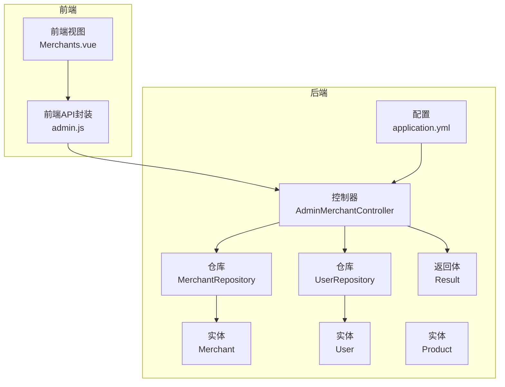
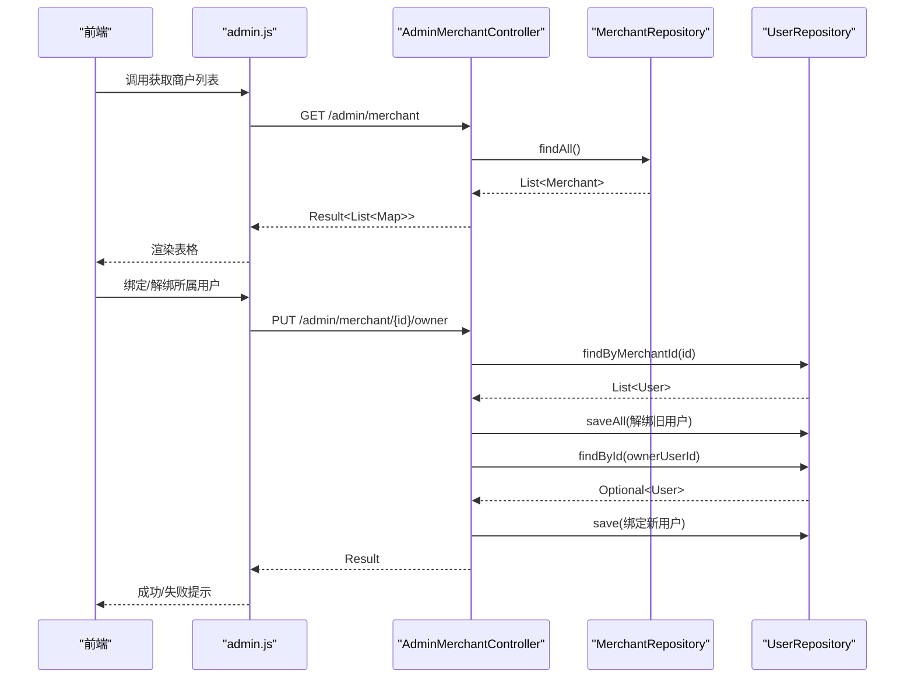
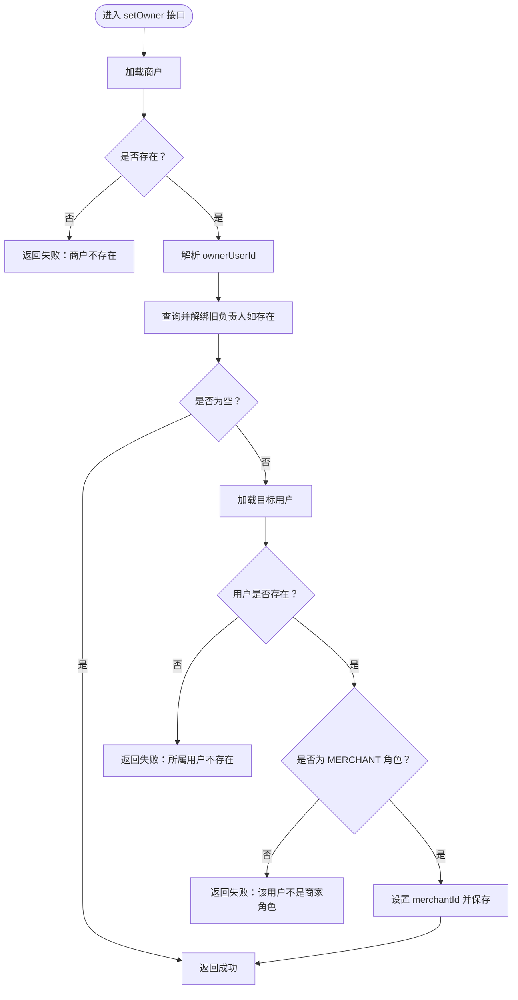
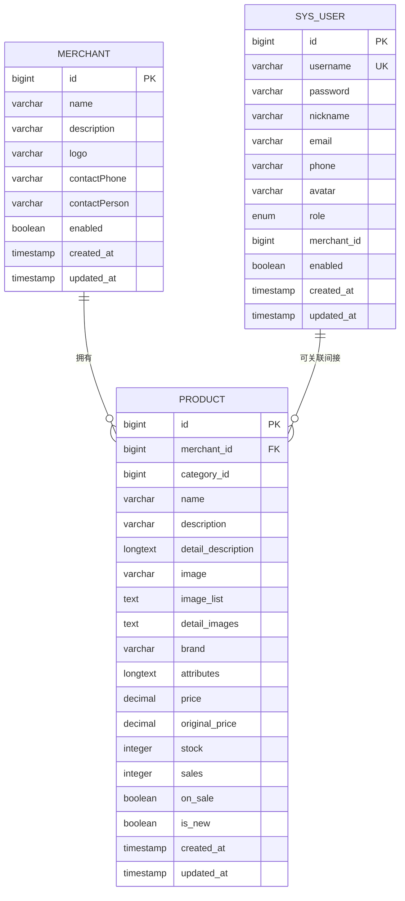
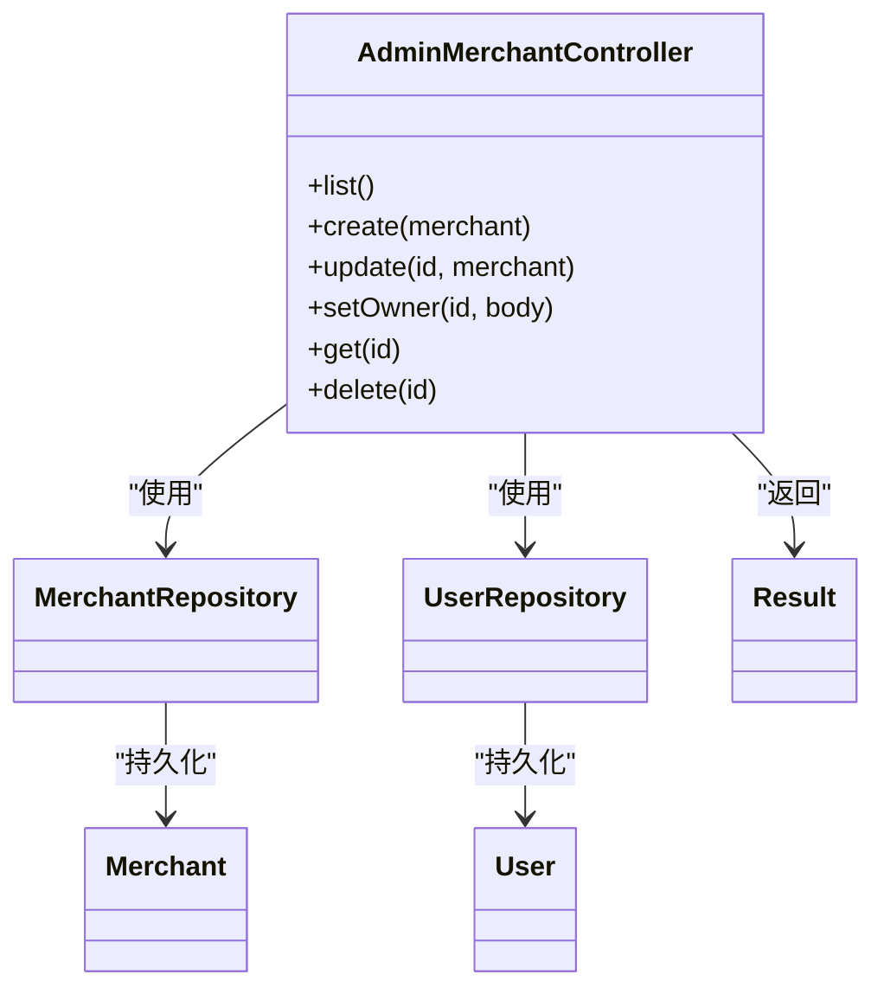

# 管理员商户管理

<cite>
**本文引用的文件**
- [AdminMerchantController.java](file://backend/src/main/java/com/mall/controller/admin/AdminMerchantController.java)
- [Merchant.java](file://backend/src/main/java/com/mall/entity/Merchant.java)
- [MerchantRepository.java](file://backend/src/main/java/com/mall/repository/MerchantRepository.java)
- [User.java](file://backend/src/main/java/com/mall/entity/User.java)
- [UserRepository.java](file://backend/src/main/java/com/mall/repository/UserRepository.java)
- [Role.java](file://backend/src/main/java/com/mall/common/Role.java)
- [Result.java](file://backend/src/main/java/com/mall/dto/Result.java)
- [application.yml](file://backend/src/main/resources/application.yml)
- [Merchants.vue](file://frontend/src/views/admin/Merchants.vue)
- [admin.js](file://frontend/src/api/admin.js)
- [AdminReviewController.java](file://backend/src/main/java/com/mall/controller/admin/AdminReviewController.java)
- [Product.java](file://backend/src/main/java/com/mall/entity/Product.java)
- [MerchantReviewController.java](file://backend/src/main/java/com/mall/controller/merchant/MerchantReviewController.java)
- [MerchantOrderController.java](file://backend/src/main/java/com/mall/controller/merchant/MerchantOrderController.java)
</cite>

## 目录
1. [简介](#简介)
2. [项目结构](#项目结构)
3. [核心组件](#核心组件)
4. [架构总览](#架构总览)
5. [详细组件分析](#详细组件分析)
6. [依赖分析](#依赖分析)
7. [性能考虑](#性能考虑)
8. [故障排查指南](#故障排查指南)
9. [结论](#结论)
10. [附录](#附录)

## 简介
本技术文档围绕“管理员商户管理”功能展开，系统性阐述管理员如何对商户进行全生命周期管理，包括商户信息维护、商户状态控制、商户与用户绑定、商户与商品/订单的关联关系，以及与评价管理的协同机制。同时提供完整的API接口清单与调用说明，帮助开发者快速集成与扩展。

## 项目结构
后端采用Spring Boot + JPA的数据访问层，前端使用Vue + Element Plus构建管理界面。商户管理功能主要由管理员控制器负责，配合实体、仓库与通用返回体实现统一的数据交互格式。

图表来源
- [AdminMerchantController.java:1-122](file://backend/src/main/java/com/mall/controller/admin/AdminMerchantController.java#L1-L122)
- [MerchantRepository.java:1-9](file://backend/src/main/java/com/mall/repository/MerchantRepository.java#L1-L9)
- [UserRepository.java:1-20](file://backend/src/main/java/com/mall/repository/UserRepository.java#L1-L20)
- [Merchant.java:1-56](file://backend/src/main/java/com/mall/entity/Merchant.java#L1-L56)
- [User.java:1-88](file://backend/src/main/java/com/mall/entity/User.java#L1-L88)
- [Result.java:1-24](file://backend/src/main/java/com/mall/dto/Result.java#L1-L24)
- [application.yml:1-36](file://backend/src/main/resources/application.yml#L1-L36)

章节来源
- [AdminMerchantController.java:1-122](file://backend/src/main/java/com/mall/controller/admin/AdminMerchantController.java#L1-L122)
- [application.yml:1-36](file://backend/src/main/resources/application.yml#L1-L36)

## 核心组件
- 管理端商户控制器：提供商户列表、新增、更新、删除、绑定/解绑所属用户等接口。
- 实体模型：商户、用户、商品，定义字段与业务约束。
- 仓库接口：基于JPA的CRUD与自定义查询。
- 返回体：统一封装响应码、消息与数据。
- 配置：数据库连接、JPA方言、JWT密钥与过期时间等。

章节来源
- [AdminMerchantController.java:26-120](file://backend/src/main/java/com/mall/controller/admin/AdminMerchantController.java#L26-L120)
- [Merchant.java:15-56](file://backend/src/main/java/com/mall/entity/Merchant.java#L15-L56)
- [User.java:17-88](file://backend/src/main/java/com/mall/entity/User.java#L17-L88)
- [MerchantRepository.java:1-9](file://backend/src/main/java/com/mall/repository/MerchantRepository.java#L1-L9)
- [UserRepository.java:10-19](file://backend/src/main/java/com/mall/repository/UserRepository.java#L10-L19)
- [Result.java:10-23](file://backend/src/main/java/com/mall/dto/Result.java#L10-L23)

## 架构总览
管理员商户管理遵循“控制器-服务-仓库-实体”的分层架构。前端通过HTTP请求调用后端REST接口，控制器负责参数校验与业务编排，仓库访问数据库，实体承载业务模型，返回体统一输出格式。

图表来源
- [admin.js:33-56](file://frontend/src/api/admin.js#L33-L56)
- [AdminMerchantController.java:26-105](file://backend/src/main/java/com/mall/controller/admin/AdminMerchantController.java#L26-L105)
- [MerchantRepository.java:1-9](file://backend/src/main/java/com/mall/repository/MerchantRepository.java#L1-L9)
- [UserRepository.java:10-19](file://backend/src/main/java/com/mall/repository/UserRepository.java#L10-L19)

## 详细组件分析

### 控制器：AdminMerchantController
- 列表查询：返回商户基础信息及所属用户信息（用户名、昵称），便于管理员直观掌握商户归属。
- 新增/更新：支持名称、描述、LOGO、联系方式、联系人、启用状态等字段的维护。
- 绑定/解绑所属用户：同一时间仅允许一个用户作为某商户的负责人；若传入空值则执行解绑。
- 单查/删除：提供详情查询与删除能力。

图表来源
- [AdminMerchantController.java:76-105](file://backend/src/main/java/com/mall/controller/admin/AdminMerchantController.java#L76-L105)
- [UserRepository.java:18-18](file://backend/src/main/java/com/mall/repository/UserRepository.java#L18-L18)
- [Role.java:3-7](file://backend/src/main/java/com/mall/common/Role.java#L3-L7)

章节来源
- [AdminMerchantController.java:26-120](file://backend/src/main/java/com/mall/controller/admin/AdminMerchantController.java#L26-L120)

### 实体模型：Merchant、User、Product
- Merchant：包含名称、描述、LOGO、联系方式、联系人、启用状态、创建/更新时间戳等。
- User：包含用户名、昵称、邮箱、手机号、头像、性别、收货信息、角色、所属商户ID、启用状态、创建/更新时间戳等。
- Product：包含所属商户ID、分类ID、名称、描述、详情、图片、品牌、属性、价格、库存、销量、上下架状态、创建/更新时间戳等。

图表来源
- [Merchant.java:15-56](file://backend/src/main/java/com/mall/entity/Merchant.java#L15-L56)
- [User.java:17-88](file://backend/src/main/java/com/mall/entity/User.java#L17-L88)
- [Product.java:16-101](file://backend/src/main/java/com/mall/entity/Product.java#L16-L101)

章节来源
- [Merchant.java:15-56](file://backend/src/main/java/com/mall/entity/Merchant.java#L15-L56)
- [User.java:17-88](file://backend/src/main/java/com/mall/entity/User.java#L17-L88)
- [Product.java:16-101](file://backend/src/main/java/com/mall/entity/Product.java#L16-L101)

### 仓库与数据访问
- MerchantRepository：继承JPA接口，提供按主键、分页、自定义查询等能力。
- UserRepository：提供按角色查询、按商户ID查询、按用户名查询等常用方法。
- 数据库方言与DDL策略在配置中定义，确保实体与表结构自动同步。

章节来源
- [MerchantRepository.java:1-9](file://backend/src/main/java/com/mall/repository/MerchantRepository.java#L1-L9)
- [UserRepository.java:10-19](file://backend/src/main/java/com/mall/repository/UserRepository.java#L10-L19)
- [application.yml:9-17](file://backend/src/main/resources/application.yml#L9-L17)

### 前端集成：商户管理页面
- 列表展示：支持启用/禁用切换、编辑、删除。
- 新增/编辑弹窗：填写名称、所属用户、描述、启用状态等。
- 绑定逻辑：提交后先保存商户信息，再调用绑定接口设置负责人。

章节来源
- [Merchants.vue:12-76](file://frontend/src/views/admin/Merchants.vue#L12-L76)
- [Merchants.vue:104-198](file://frontend/src/views/admin/Merchants.vue#L104-L198)
- [admin.js:33-56](file://frontend/src/api/admin.js#L33-L56)

### 评价与违规处理联动
- 管理端评价控制器：提供分页查询、删除、批量删除能力，支持按商品ID与最低评分过滤。
- 运营端评价控制器：仅允许运营查看与删除其名下商品的评价，保障权限隔离。
- 违规处理建议：可通过禁用商户（enabled=false）与删除不当评价实现快速处置；后续可扩展违规计分与封禁策略。

章节来源
- [AdminReviewController.java:24-90](file://backend/src/main/java/com/mall/controller/admin/AdminReviewController.java#L24-L90)
- [MerchantReviewController.java:31-129](file://backend/src/main/java/com/mall/controller/merchant/MerchantReviewController.java#L31-L129)

### 订单与发货流程
- 运营端订单控制器：支持发货（需订单处于已支付状态）、同意退款（需订单处于退款申请中）。
- 与商户管理的关联：通过订单中的商户ID与运营登录上下文进行权限校验，确保仅能操作自己名下的订单。

章节来源
- [MerchantOrderController.java:61-85](file://backend/src/main/java/com/mall/controller/merchant/MerchantOrderController.java#L61-L85)

## 依赖分析
- 控制器依赖：AdminMerchantController 依赖 MerchantRepository 与 UserRepository，用于数据读写与权限校验。
- 实体依赖：User 与 Merchant 通过 merchantId 字段形成一对多关系；Product 通过 merchantId 关联到商户。
- 返回体：Result 提供统一的响应结构，简化前后端对接。
- 配置：application.yml 定义数据库连接、JPA方言与JWT配置，影响实体映射与安全认证。

图表来源
- [AdminMerchantController.java:23-24](file://backend/src/main/java/com/mall/controller/admin/AdminMerchantController.java#L23-L24)
- [MerchantRepository.java:7-7](file://backend/src/main/java/com/mall/repository/MerchantRepository.java#L7-L7)
- [UserRepository.java:10-10](file://backend/src/main/java/com/mall/repository/UserRepository.java#L10-L10)
- [Merchant.java:15-56](file://backend/src/main/java/com/mall/entity/Merchant.java#L15-L56)
- [User.java:17-88](file://backend/src/main/java/com/mall/entity/User.java#L17-L88)
- [Result.java:10-23](file://backend/src/main/java/com/mall/dto/Result.java#L10-L23)

## 性能考虑
- 列表查询：当前实现为一次性加载全部商户并组装结果，适合中小规模数据；若数据量增大，建议引入分页与索引优化。
- 绑定逻辑：解绑旧负责人时批量保存，注意事务边界与锁竞争；可考虑在事务内合并更新以减少往返。
- 评价管理：管理员端对全量评价进行过滤与排序，建议在数据库层面增加索引（如商品ID、评分、创建时间）以提升查询效率。
- 数据库方言：MySQL方言与DDL策略已在配置中定义，确保实体与表结构一致，避免不必要的迁移开销。

## 故障排查指南
- 商户不存在：绑定接口在加载商户失败时直接返回错误，检查商户ID是否正确。
- 所属用户不存在：绑定接口在加载用户失败时返回错误，检查用户ID与角色。
- 非商家角色：绑定接口要求用户角色为MERCHANT，否则拒绝绑定。
- 启用状态切换失败：前端切换开关后立即调用更新接口，若失败需回滚开关状态并提示错误。
- 评价删除权限：运营端仅能删除其名下商品的评价，跨商户删除会被拒绝。

章节来源
- [AdminMerchantController.java:78-104](file://backend/src/main/java/com/mall/controller/admin/AdminMerchantController.java#L78-L104)
- [MerchantReviewController.java:112-129](file://backend/src/main/java/com/mall/controller/merchant/MerchantReviewController.java#L112-L129)
- [AdminReviewController.java:66-76](file://backend/src/main/java/com/mall/controller/admin/AdminReviewController.java#L66-L76)

## 结论
管理员商户管理功能以简洁的REST接口实现了商户信息维护、状态控制与负责人绑定，结合实体模型与仓库层提供了清晰的数据访问路径。通过与评价、订单模块的协作，形成了从内容治理到交易执行的闭环。建议后续扩展商户等级、保证金与违规处理等运营控制机制，以满足更复杂的业务场景。

## 附录

### 管理端商户管理API一览
- 获取商户列表
  - 方法：GET
  - 路径：/admin/merchant
  - 参数：无
  - 返回：Result<List<Map>>
- 新增商户
  - 方法：POST
  - 路径：/admin/merchant
  - 请求体：Merchant 对象（id可为空）
  - 返回：Result<Merchant>
- 更新商户
  - 方法：PUT
  - 路径：/admin/merchant/{id}
  - 请求体：Merchant 对象（id为路径参数）
  - 返回：Result<Merchant>
- 查询单个商户
  - 方法：GET
  - 路径：/admin/merchant/{id}
  - 返回：Result<Merchant>
- 删除商户
  - 方法：DELETE
  - 路径：/admin/merchant/{id}
  - 返回：Result<Void>
- 绑定/解绑所属用户
  - 方法：PUT
  - 路径：/admin/merchant/{id}/owner
  - 请求体：{ ownerUserId: number | null }
  - 返回：Result<Void>

章节来源
- [AdminMerchantController.java:26-120](file://backend/src/main/java/com/mall/controller/admin/AdminMerchantController.java#L26-L120)
- [admin.js:33-56](file://frontend/src/api/admin.js#L33-L56)

### 前端调用示例（对应接口）
- 获取商户列表：getMerchants()
- 新增商户：createMerchant(data)
- 更新商户：updateMerchant(id, data)
- 删除商户：deleteMerchant(id)
- 绑定/解绑所属用户：setMerchantOwner(id, ownerUserId)

章节来源
- [admin.js:33-56](file://frontend/src/api/admin.js#L33-L56)
- [Merchants.vue:115-198](file://frontend/src/views/admin/Merchants.vue#L115-L198)

### 与用户、商品、订单的关联关系
- 商户与用户：User.merchantId 外键关联 Merchant.id，用于标识商户负责人。
- 商户与商品：Product.merchantId 外键关联 Merchant.id，用于运营侧的商品管理与权限控制。
- 商户与订单：通过订单中的商户ID与运营登录上下文进行权限校验，确保仅能操作自己名下的订单。

章节来源
- [User.java:61-62](file://backend/src/main/java/com/mall/entity/User.java#L61-L62)
- [Product.java:22-23](file://backend/src/main/java/com/mall/entity/Product.java#L22-L23)
- [MerchantOrderController.java:61-85](file://backend/src/main/java/com/mall/controller/merchant/MerchantOrderController.java#L61-L85)