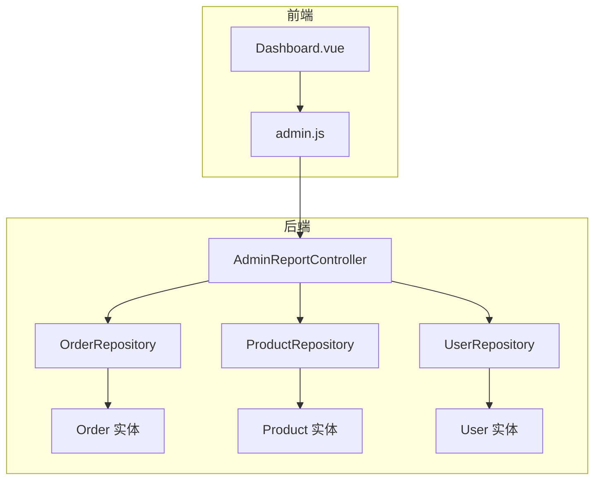
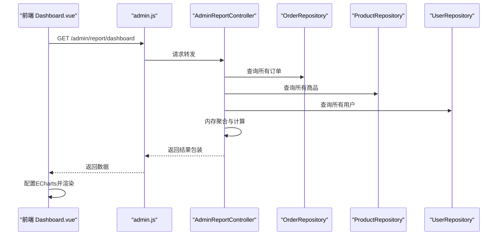
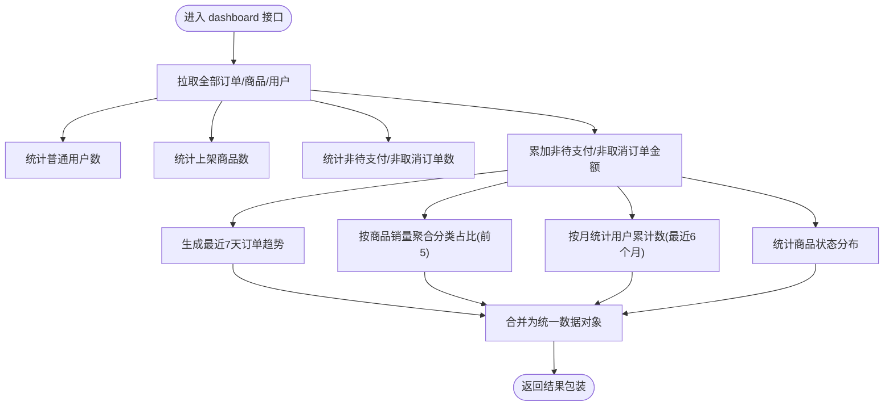
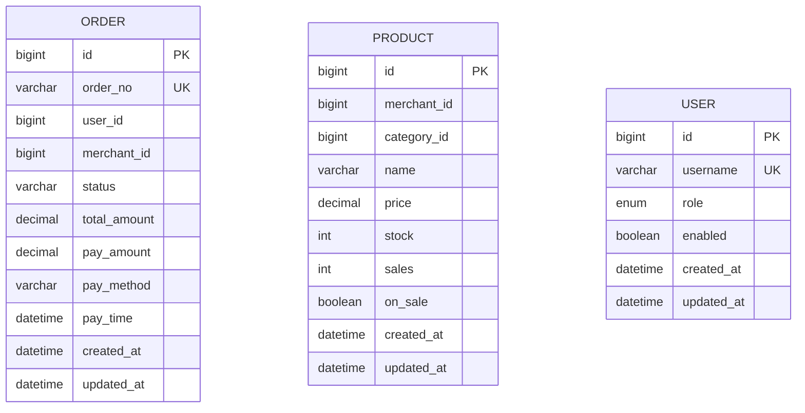
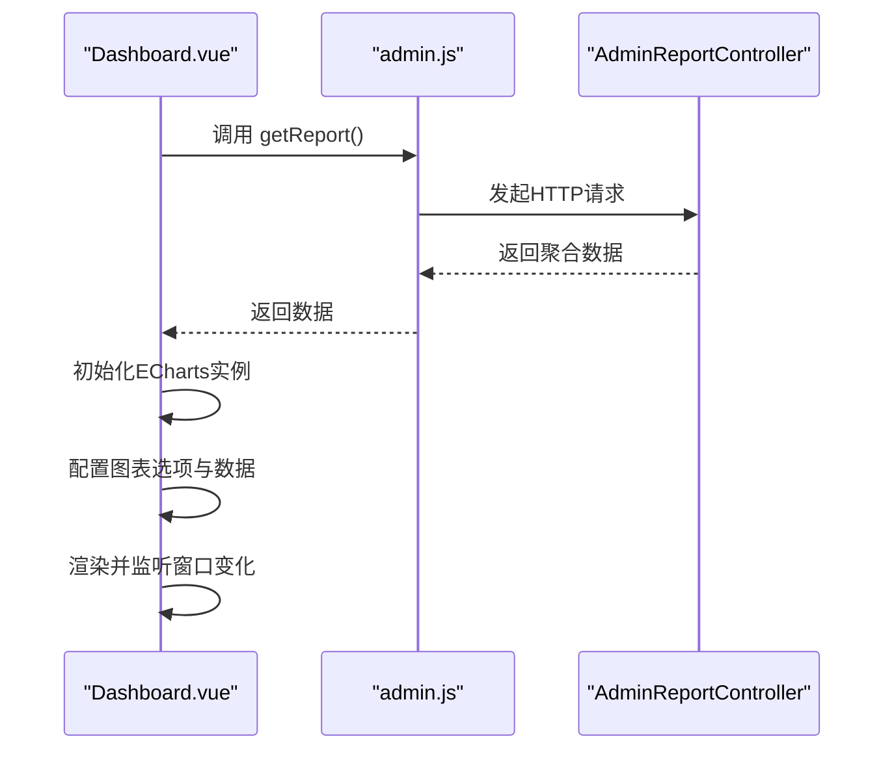
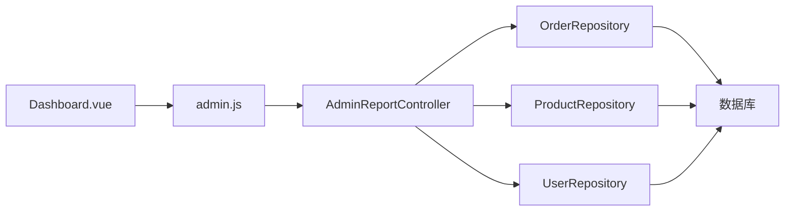

# 管理员报表统计

<cite>
**本文引用的文件**
- [AdminReportController.java](file://backend/src/main/java/com/mall/controller/admin/AdminReportController.java)
- [Order.java](file://backend/src/main/java/com/mall/entity/Order.java)
- [Product.java](file://backend/src/main/java/com/mall/entity/Product.java)
- [User.java](file://backend/src/main/java/com/mall/entity/User.java)
- [OrderRepository.java](file://backend/src/main/java/com/mall/repository/OrderRepository.java)
- [ProductRepository.java](file://backend/src/main/java/com/mall/repository/ProductRepository.java)
- [UserRepository.java](file://backend/src/main/java/com/mall/repository/UserRepository.java)
- [application.yml](file://backend/src/main/resources/application.yml)
- [admin.js](file://frontend/src/api/admin.js)
- [Dashboard.vue](file://frontend/src/views/admin/Dashboard.vue)
</cite>

## 目录
1. [简介](#简介)
2. [项目结构](#项目结构)
3. [核心组件](#核心组件)
4. [架构总览](#架构总览)
5. [详细组件分析](#详细组件分析)
6. [依赖分析](#依赖分析)
7. [性能考虑](#性能考虑)
8. [故障排查指南](#故障排查指南)
9. [结论](#结论)
10. [附录](#附录)

## 简介
本技术文档围绕管理员报表统计功能展开，重点解析后台首页看板的数据聚合与可视化实现，包括销售报表生成、用户统计分析、商品销售排行等模块。文档覆盖数据聚合算法、时间维度统计、多维度分析方法，并提供完整的报表API接口说明、实时性保障、缓存策略与性能优化建议，以及自定义报表生成、数据导出与图表展示的扩展思路。

## 项目结构
后端采用Spring Boot + JPA的分层架构，报表统计位于管理端控制器层，通过仓储层访问数据库实体；前端使用Vue + ECharts进行数据展示与交互。

**图表来源**
- [AdminReportController.java:34-77](file://backend/src/main/java/com/mall/controller/admin/AdminReportController.java#L34-L77)
- [OrderRepository.java:13-27](file://backend/src/main/java/com/mall/repository/OrderRepository.java#L13-L27)
- [ProductRepository.java](file://backend/src/main/java/com/mall/repository/ProductRepository.java)
- [UserRepository.java:10-19](file://backend/src/main/java/com/mall/repository/UserRepository.java#L10-L19)
- [Order.java:16-82](file://backend/src/main/java/com/mall/entity/Order.java#L16-L82)
- [Product.java:16-100](file://backend/src/main/java/com/mall/entity/Product.java#L16-L100)
- [User.java:17-87](file://backend/src/main/java/com/mall/entity/User.java#L17-L87)
- [Dashboard.vue:148-526](file://frontend/src/views/admin/Dashboard.vue#L148-L526)
- [admin.js:8-11](file://frontend/src/api/admin.js#L8-L11)

**章节来源**
- [AdminReportController.java:23-77](file://backend/src/main/java/com/mall/controller/admin/AdminReportController.java#L23-L77)
- [Dashboard.vue:148-526](file://frontend/src/views/admin/Dashboard.vue#L148-L526)
- [admin.js:8-11](file://frontend/src/api/admin.js#L8-L11)

## 核心组件
- 管理端报表控制器：负责聚合看板指标与图表数据，返回统一结果包装。
- 数据实体：订单、商品、用户实体承载业务字段与时间戳。
- 仓储接口：提供基础查询与分页能力，支撑报表统计。
- 前端看板：发起请求、渲染ECharts图表、响应式布局与交互。

关键职责与边界：
- 控制器：聚合用户数、商品数、订单数、总销售额、最近7天订单趋势、分类销售占比、最近6个月用户增长、商品状态分布。
- 仓储：提供全量查询能力以支持聚合逻辑（当前实现为内存流式处理）。
- 前端：负责请求触发、数据接收、ECharts配置与渲染。

**章节来源**
- [AdminReportController.java:28-175](file://backend/src/main/java/com/mall/controller/admin/AdminReportController.java#L28-L175)
- [Order.java:16-82](file://backend/src/main/java/com/mall/entity/Order.java#L16-L82)
- [Product.java:16-100](file://backend/src/main/java/com/mall/entity/Product.java#L16-L100)
- [User.java:17-87](file://backend/src/main/java/com/mall/entity/User.java#L17-L87)
- [OrderRepository.java:13-27](file://backend/src/main/java/com/mall/repository/OrderRepository.java#L13-L27)
- [Dashboard.vue:148-526](file://frontend/src/views/admin/Dashboard.vue#L148-L526)

## 架构总览
管理员报表统计遵循“前端请求 → 控制器聚合 → 仓储读取 → 实体聚合 → 前端渲染”的闭环流程。控制器通过JPA仓储获取全量数据，再在内存中进行过滤与聚合，最终返回统一结果对象供前端展示。

**图表来源**
- [Dashboard.vue:182-193](file://frontend/src/views/admin/Dashboard.vue#L182-L193)
- [admin.js:8-11](file://frontend/src/api/admin.js#L8-L11)
- [AdminReportController.java:34-77](file://backend/src/main/java/com/mall/controller/admin/AdminReportController.java#L34-L77)
- [OrderRepository.java:13-27](file://backend/src/main/java/com/mall/repository/OrderRepository.java#L13-L27)
- [ProductRepository.java](file://backend/src/main/java/com/mall/repository/ProductRepository.java)
- [UserRepository.java:10-19](file://backend/src/main/java/com/mall/repository/UserRepository.java#L10-L19)

## 详细组件分析

### 报表控制器：AdminReportController
- 接口路径：/admin/report/dashboard
- 功能点：
  - 用户总数：筛选普通用户角色，统计数量。
  - 商品总数：筛选上架商品，统计数量。
  - 订单总数：排除待支付与已取消状态，统计数量。
  - 总销售额：排除待支付与已取消状态，累加订单金额并保留两位小数。
  - 最近7天订单趋势：按自然日聚合，生成长度为7的整型数组。
  - 分类销售占比：基于商品销量聚合，取前5个分类，返回名称与值。
  - 最近6个月用户增长：按月统计截止到当月最后时刻的累计用户数。
  - 商品状态分布：统计“销售中/已售罄/已下架”三类数量。

- 数据聚合算法要点：
  - 使用Java Stream对全量实体进行过滤与聚合，时间复杂度O(n)级。
  - 日期范围计算采用本地日期与时间工具，确保跨时区一致性。
  - 销售额与数量均进行必要的舍入与类型转换，保证输出稳定。

- 错误处理与健壮性：
  - 对空值进行安全处理（如订单金额为空时按零处理）。
  - 对分类名称采用占位映射，实际项目建议关联分类表获取真实名称。

**图表来源**
- [AdminReportController.java:34-175](file://backend/src/main/java/com/mall/controller/admin/AdminReportController.java#L34-L175)

**章节来源**
- [AdminReportController.java:34-175](file://backend/src/main/java/com/mall/controller/admin/AdminReportController.java#L34-L175)

### 数据模型与仓储
- 订单实体：包含订单号、用户与商户标识、状态、金额、支付方式与时间、创建与更新时间等字段。
- 商品实体：包含分类、价格、库存、销量、上下架状态等字段。
- 用户实体：包含角色、启用状态、创建时间等字段。
- 仓储接口：提供基础查询与分页能力，当前报表聚合依赖全量查询。

**图表来源**
- [Order.java:16-82](file://backend/src/main/java/com/mall/entity/Order.java#L16-L82)
- [Product.java:16-100](file://backend/src/main/java/com/mall/entity/Product.java#L16-L100)
- [User.java:17-87](file://backend/src/main/java/com/mall/entity/User.java#L17-L87)

**章节来源**
- [OrderRepository.java:13-27](file://backend/src/main/java/com/mall/repository/OrderRepository.java#L13-L27)
- [ProductRepository.java](file://backend/src/main/java/com/mall/repository/ProductRepository.java)
- [UserRepository.java:10-19](file://backend/src/main/java/com/mall/repository/UserRepository.java#L10-L19)

### 前端集成与图表渲染
- 请求入口：Dashboard.vue在生命周期内调用admin.js中的getReport接口。
- 数据绑定：将后端返回的指标与趋势数据绑定到ECharts实例。
- 图表类型：
  - 订单趋势：折线图（平滑曲线、面积填充）。
  - 分类销售占比：环形饼图（带强调样式与百分比标签）。
  - 用户增长：折线图（平滑曲线、面积填充）。
  - 商品状态：环形饼图（分类标签与颜色区分）。
- 响应式与交互：根据容器尺寸自动调整图表大小，销毁时释放资源。

**图表来源**
- [Dashboard.vue:182-526](file://frontend/src/views/admin/Dashboard.vue#L182-L526)
- [admin.js:8-11](file://frontend/src/api/admin.js#L8-L11)

**章节来源**
- [Dashboard.vue:148-526](file://frontend/src/views/admin/Dashboard.vue#L148-L526)
- [admin.js:8-11](file://frontend/src/api/admin.js#L8-L11)

## 依赖分析
- 控制器依赖仓储接口，仓储依赖JPA与数据库。
- 前端依赖admin.js封装的HTTP请求，依赖ECharts进行可视化。
- 应用配置文件定义了数据库连接、JPA方言与服务器端口等运行环境。

**图表来源**
- [Dashboard.vue:148-526](file://frontend/src/views/admin/Dashboard.vue#L148-L526)
- [admin.js:8-11](file://frontend/src/api/admin.js#L8-L11)
- [AdminReportController.java:29-31](file://backend/src/main/java/com/mall/controller/admin/AdminReportController.java#L29-L31)
- [OrderRepository.java:13-27](file://backend/src/main/java/com/mall/repository/OrderRepository.java#L13-L27)
- [ProductRepository.java](file://backend/src/main/java/com/mall/repository/ProductRepository.java)
- [UserRepository.java:10-19](file://backend/src/main/java/com/mall/repository/UserRepository.java#L10-L19)

**章节来源**
- [application.yml:4-25](file://backend/src/main/resources/application.yml#L4-L25)

## 性能考虑
- 当前实现为内存聚合，适合中小规模数据。对于大规模数据，建议：
  - 在仓储层引入原生SQL或JPA原生查询，利用数据库侧聚合与索引。
  - 对时间维度建立合适索引（如订单创建时间、用户创建时间）。
  - 引入缓存层（如Redis）存储热点看板数据，设置合理TTL与失效策略。
  - 分页与条件查询：结合前端分页参数，避免一次性加载全量数据。
  - 结果压缩与传输：对趋势数组与占比数据进行压缩传输。
  - 并发控制：在高并发场景下限制聚合接口的并发量，防止阻塞。
- 实时性保障：
  - 可通过定时任务异步刷新缓存，前端轮询或WebSocket推送增量更新。
  - 对高频指标（如当日销售额）可采用内存+落盘双写策略，提升读取性能。

[本节为通用性能建议，不直接分析具体文件，故无“章节来源”]

## 故障排查指南
- 常见问题与定位：
  - 接口返回空数据：检查数据库连接与表结构是否匹配实体定义。
  - 时间维度异常：确认系统时区与数据库时区一致，避免跨时区导致的日期偏移。
  - 图表渲染失败：检查ECharts实例初始化与容器尺寸，确保在DOM挂载后执行。
  - 权限不足：确认请求头携带的认证信息正确，且具备管理员权限。
- 日志与监控：
  - 启用后端SQL日志与请求日志，定位慢查询与异常请求。
  - 前端控制台查看网络请求状态码与响应体，辅助定位问题。

**章节来源**
- [application.yml:32-36](file://backend/src/main/resources/application.yml#L32-L36)

## 结论
管理员报表统计功能通过“控制器聚合 + 前端可视化”的模式实现了核心指标与多维图表的快速呈现。当前实现简洁直观，适合中小型业务场景；随着数据规模增长，建议引入数据库侧聚合、缓存与索引优化，并完善权限与监控体系，以进一步提升稳定性与性能。

## 附录

### 报表API接口文档
- 接口名称：后台看板数据
- 请求方式：GET
- 请求地址：/admin/report/dashboard
- 请求头：需包含有效的认证信息
- 成功响应：包含以下字段的对象
  - userCount：long，普通用户总数
  - productCount：long，上架商品总数
  - orderCount：long，非待支付/非取消订单总数
  - totalRevenue：decimal，非待支付/非取消订单总金额（保留两位小数）
  - orderTrend：array<int>，长度为7，表示最近7天的订单数
  - categorySales：array<object>，最多5项，每项包含name与value
  - userGrowth：array<int>，长度为6，表示最近6个月的累计用户数
  - productStatus：object，包含“销售中/已售罄/已下架”的数量统计
- 失败响应：标准错误响应（由全局异常处理器统一返回）

**章节来源**
- [AdminReportController.java:34-175](file://backend/src/main/java/com/mall/controller/admin/AdminReportController.java#L34-L175)

### 自定义报表与高级功能建议
- 自定义报表生成：在控制器新增按时间范围、分类、商户等维度的聚合接口，返回可下载的Excel或CSV。
- 数据导出：后端提供导出接口，前端触发浏览器下载，支持分页与筛选条件。
- 图表展示：除现有ECharts外，可引入更多可视化库（如AntV G2）以满足复杂分析需求。
- 缓存策略：对看板高频指标设置TTL，定期异步刷新；对明细数据采用LRU缓存，降低数据库压力。
- 实时性增强：结合消息队列或WebSocket推送最新订单与销售动态，前端即时更新。

[本节为概念性扩展建议，不直接分析具体文件，故无“章节来源”]