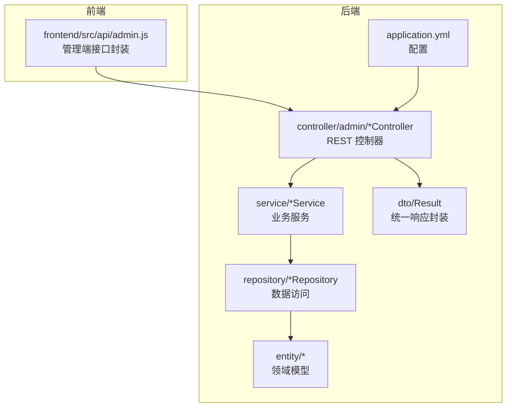
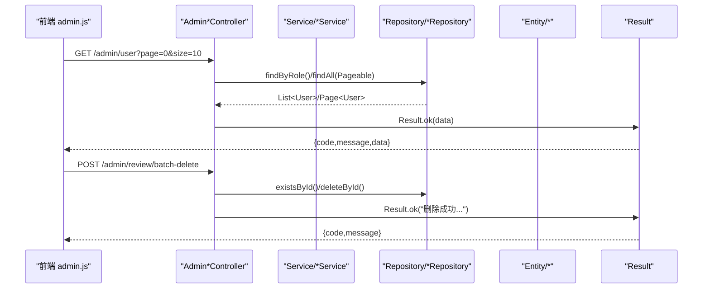
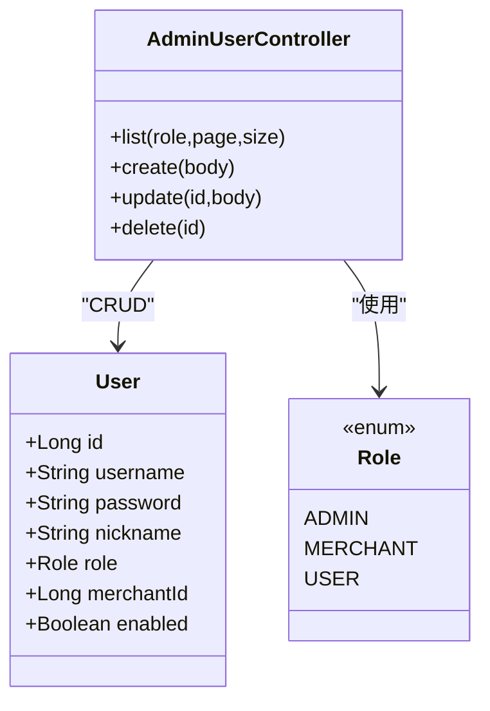
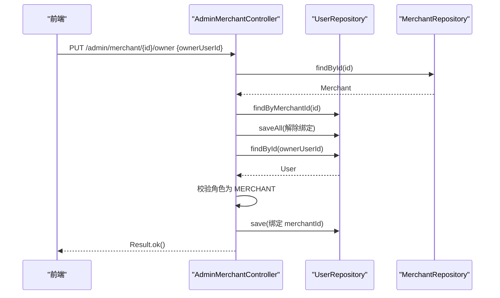
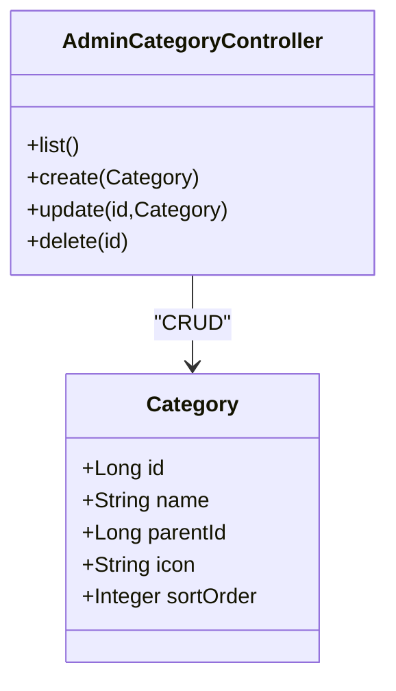
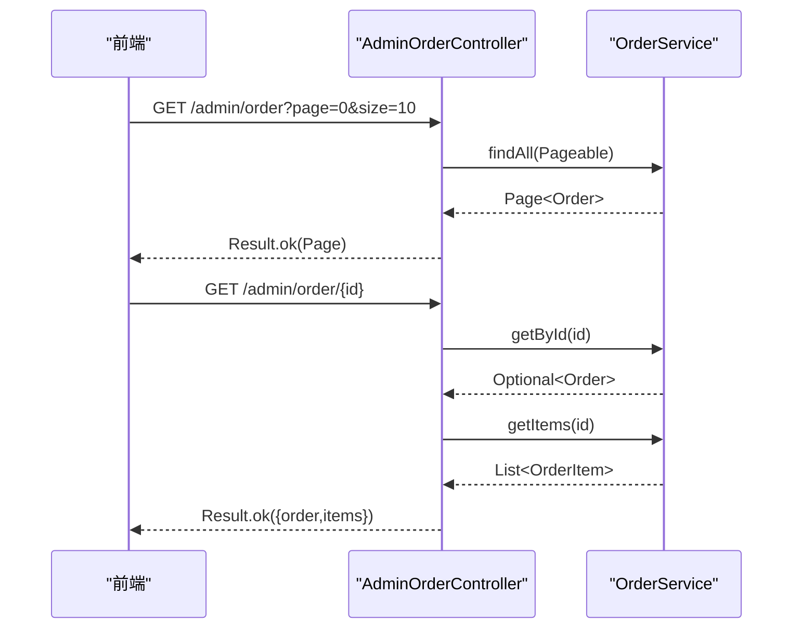
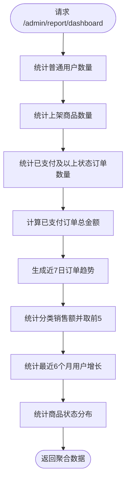
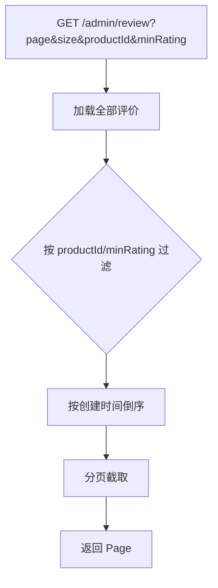
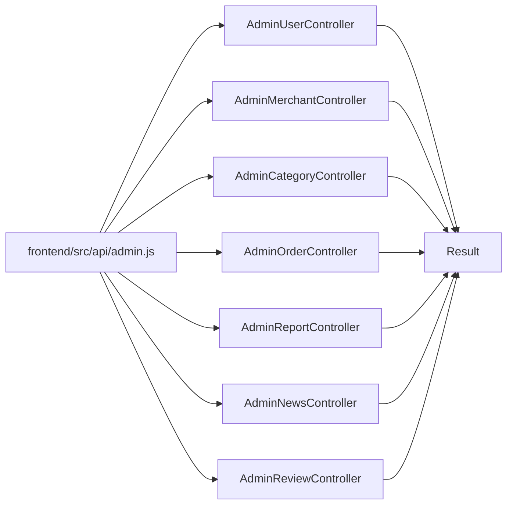

# 管理员控制器

<cite>
**本文引用的文件**
- [AdminUserController.java](file://backend/src/main/java/com/mall/controller/admin/AdminUserController.java)
- [AdminMerchantController.java](file://backend/src/main/java/com/mall/controller/admin/AdminMerchantController.java)
- [AdminCategoryController.java](file://backend/src/main/java/com/mall/controller/admin/AdminCategoryController.java)
- [AdminOrderController.java](file://backend/src/main/java/com/mall/controller/admin/AdminOrderController.java)
- [AdminReportController.java](file://backend/src/main/java/com/mall/controller/admin/AdminReportController.java)
- [AdminNewsController.java](file://backend/src/main/java/com/mall/controller/admin/AdminNewsController.java)
- [AdminReviewController.java](file://backend/src/main/java/com/mall/controller/admin/AdminReviewController.java)
- [Role.java](file://backend/src/main/java/com/mall/common/Role.java)
- [User.java](file://backend/src/main/java/com/mall/entity/User.java)
- [Merchant.java](file://backend/src/main/java/com/mall/entity/Merchant.java)
- [Category.java](file://backend/src/main/java/com/mall/entity/Category.java)
- [Order.java](file://backend/src/main/java/com/mall/entity/Order.java)
- [ProductReview.java](file://backend/src/main/java/com/mall/entity/ProductReview.java)
- [application.yml](file://backend/src/main/resources/application.yml)
- [admin.js](file://frontend/src/api/admin.js)
- [JwtAuthFilter.java](file://backend/src/main/java/com/mall/security/JwtAuthFilter.java)
- [Result.java](file://backend/src/main/java/com/mall/dto/Result.java)
</cite>

## 目录
1. [简介](#简介)
2. [项目结构](#项目结构)
3. [核心组件](#核心组件)
4. [架构总览](#架构总览)
5. [详细组件分析](#详细组件分析)
6. [依赖分析](#依赖分析)
7. [性能考虑](#性能考虑)
8. [故障排查指南](#故障排查指南)
9. [结论](#结论)
10. [附录](#附录)

## 简介
本文件面向电商商城系统的“管理员控制器群组”，系统性梳理后台管理的核心接口与实现，覆盖管理员用户管理、商户审核、商品分类管理、订单监管、报表分析、新闻发布与评价管理等模块。文档重点解析：
- 管理员权限控制机制与用户状态管理策略
- 商户审核与账号绑定流程
- 商品分类体系维护与查询
- 后台管理界面的数据接口设计、分页与过滤、批量操作与导出思路
- 控制器与实体、仓储、服务层的协作关系
- 完整的管理接口清单、调用流程示例与权限控制指南

## 项目结构
后端采用标准分层架构，管理员控制器位于 controller/admin 包，统一通过 RestController 提供 REST 接口；前端通过 admin.js 封装调用。

图示来源
- [AdminUserController.java:17-81](file://backend/src/main/java/com/mall/controller/admin/AdminUserController.java#L17-L81)
- [AdminMerchantController.java:17-122](file://backend/src/main/java/com/mall/controller/admin/AdminMerchantController.java#L17-L122)
- [AdminCategoryController.java:12-47](file://backend/src/main/java/com/mall/controller/admin/AdminCategoryController.java#L12-L47)
- [AdminOrderController.java:17-45](file://backend/src/main/java/com/mall/controller/admin/AdminOrderController.java#L17-L45)
- [AdminReportController.java:23-176](file://backend/src/main/java/com/mall/controller/admin/AdminReportController.java#L23-L176)
- [AdminNewsController.java:13-48](file://backend/src/main/java/com/mall/controller/admin/AdminNewsController.java#L13-L48)
- [AdminReviewController.java:16-92](file://backend/src/main/java/com/mall/controller/admin/AdminReviewController.java#L16-L92)
- [application.yml:1-36](file://backend/src/main/resources/application.yml#L1-L36)
- [admin.js:1-129](file://frontend/src/api/admin.js#L1-L129)

章节来源
- [application.yml:1-36](file://backend/src/main/resources/application.yml#L1-L36)
- [admin.js:1-129](file://frontend/src/api/admin.js#L1-L129)

## 核心组件
- 管理员用户管理：支持分页查询、按角色过滤、创建（密码加密）、更新（昵称、启用状态、绑定商户）、删除。
- 商户审核与账号绑定：支持查询、创建、更新、删除；支持将运营角色用户绑定为某商户的负责人，确保唯一性。
- 商品分类管理：支持查询、创建、更新、删除。
- 订单监管：支持分页查询全站订单、查询订单详情（含订单项）。
- 报表分析：提供后台看板聚合指标（用户数、商品数、订单数、总销售额）、近7日订单趋势、分类销售占比、用户增长趋势、商品状态分布。
- 新闻发布：支持资讯/公告的增删改查。
- 评价管理：支持分页查询、按商品与最低评分过滤、删除单条与批量删除。

章节来源
- [AdminUserController.java:26-79](file://backend/src/main/java/com/mall/controller/admin/AdminUserController.java#L26-L79)
- [AdminMerchantController.java:26-120](file://backend/src/main/java/com/mall/controller/admin/AdminMerchantController.java#L26-L120)
- [AdminCategoryController.java:20-45](file://backend/src/main/java/com/mall/controller/admin/AdminCategoryController.java#L20-L45)
- [AdminOrderController.java:25-43](file://backend/src/main/java/com/mall/controller/admin/AdminOrderController.java#L25-L43)
- [AdminReportController.java:33-77](file://backend/src/main/java/com/mall/controller/admin/AdminReportController.java#L33-L77)
- [AdminNewsController.java:21-46](file://backend/src/main/java/com/mall/controller/admin/AdminNewsController.java#L21-L46)
- [AdminReviewController.java:24-90](file://backend/src/main/java/com/mall/controller/admin/AdminReviewController.java#L24-L90)

## 架构总览
管理员控制器通过统一的 Result 响应封装返回数据，前端通过 admin.js 的方法调用对应路径。权限基于 JWT 解析，控制器未直接显式声明 Spring Security 注解，但通过全局过滤器注入认证上下文。

图示来源
- [admin.js:13-31](file://frontend/src/api/admin.js#L13-L31)
- [AdminUserController.java:26-36](file://backend/src/main/java/com/mall/controller/admin/AdminUserController.java#L26-L36)
- [AdminReviewController.java:78-90](file://backend/src/main/java/com/mall/controller/admin/AdminReviewController.java#L78-L90)
- [Result.java:16-22](file://backend/src/main/java/com/mall/dto/Result.java#L16-L22)

## 详细组件分析

### 管理员用户管理（AdminUserController）
- 接口能力
  - 分页查询用户，可按角色过滤
  - 创建用户（密码加密存储，启用状态默认开启）
  - 更新用户基础信息（昵称、启用状态、绑定商户）
  - 删除用户
- 关键点
  - 密码使用 PasswordEncoder 加密
  - 角色枚举来自 Role
  - 返回统一 Result 结构
- 数据模型
  - User 实体包含用户名、昵称、邮箱、电话、头像、性别、收货人信息、角色、商户绑定、启用状态、时间戳等字段

图示来源
- [AdminUserController.java:17-81](file://backend/src/main/java/com/mall/controller/admin/AdminUserController.java#L17-L81)
- [User.java:10-88](file://backend/src/main/java/com/mall/entity/User.java#L10-L88)
- [Role.java:3-7](file://backend/src/main/java/com/mall/common/Role.java#L3-L7)

章节来源
- [AdminUserController.java:26-79](file://backend/src/main/java/com/mall/controller/admin/AdminUserController.java#L26-L79)
- [User.java:10-88](file://backend/src/main/java/com/mall/entity/User.java#L10-L88)
- [Role.java:3-7](file://backend/src/main/java/com/mall/common/Role.java#L3-L7)

### 商户审核与账号绑定（AdminMerchantController）
- 接口能力
  - 查询商户列表并附带所属运营账号信息
  - 创建、更新、删除商户
  - 绑定/解绑运营负责人账号（唯一绑定约束）
- 关键点
  - setOwner 接口在绑定前会解除该商户当前所有绑定账号，再校验目标用户是否为运营角色并进行绑定
  - 返回统一 Result 结果

图示来源
- [AdminMerchantController.java:76-105](file://backend/src/main/java/com/mall/controller/admin/AdminMerchantController.java#L76-L105)
- [User.java:56-62](file://backend/src/main/java/com/mall/entity/User.java#L56-L62)
- [Merchant.java:8-56](file://backend/src/main/java/com/mall/entity/Merchant.java#L8-L56)

章节来源
- [AdminMerchantController.java:26-120](file://backend/src/main/java/com/mall/controller/admin/AdminMerchantController.java#L26-L120)
- [User.java:56-62](file://backend/src/main/java/com/mall/entity/User.java#L56-L62)
- [Merchant.java:8-56](file://backend/src/main/java/com/mall/entity/Merchant.java#L8-L56)

### 商品分类管理（AdminCategoryController）
- 接口能力
  - 查询分类列表
  - 创建、更新、删除分类
- 数据模型
  - Category 支持父级分类、图标、排序、时间戳

图示来源
- [AdminCategoryController.java:12-47](file://backend/src/main/java/com/mall/controller/admin/AdminCategoryController.java#L12-L47)
- [Category.java:8-41](file://backend/src/main/java/com/mall/entity/Category.java#L8-L41)

章节来源
- [AdminCategoryController.java:20-45](file://backend/src/main/java/com/mall/controller/admin/AdminCategoryController.java#L20-L45)
- [Category.java:8-41](file://backend/src/main/java/com/mall/entity/Category.java#L8-L41)

### 订单监管（AdminOrderController）
- 接口能力
  - 分页查询全站订单
  - 查询订单详情（含订单项）
- 协作关系
  - 使用 OrderService 获取订单与订单项数据

图示来源
- [AdminOrderController.java:25-43](file://backend/src/main/java/com/mall/controller/admin/AdminOrderController.java#L25-L43)
- [Order.java:9-83](file://backend/src/main/java/com/mall/entity/Order.java#L9-L83)

章节来源
- [AdminOrderController.java:25-43](file://backend/src/main/java/com/mall/controller/admin/AdminOrderController.java#L25-L43)
- [Order.java:9-83](file://backend/src/main/java/com/mall/entity/Order.java#L9-L83)

### 报表分析（AdminReportController）
- 接口能力
  - 后台看板：用户数、商品数、订单数、总销售额
  - 近7日订单趋势
  - 分类销售占比（前5）
  - 用户增长趋势（最近6个月）
  - 商品状态分布（销售中/已售罄/已下架）
- 数据来源
  - User、Product、Order 仓储统计

图示来源
- [AdminReportController.java:33-174](file://backend/src/main/java/com/mall/controller/admin/AdminReportController.java#L33-L174)

章节来源
- [AdminReportController.java:33-174](file://backend/src/main/java/com/mall/controller/admin/AdminReportController.java#L33-L174)

### 新闻发布（AdminNewsController）
- 接口能力
  - 查询资讯列表
  - 创建、更新、删除资讯
- 数据模型
  - News 实体（未在本文件展示，但控制器基于 NewsRepository）

章节来源
- [AdminNewsController.java:21-46](file://backend/src/main/java/com/mall/controller/admin/AdminNewsController.java#L21-L46)

### 评价管理（AdminReviewController）
- 接口能力
  - 分页查询评价，支持按商品 ID 与最低评分过滤
  - 删除单条评价
  - 批量删除评价
- 处理逻辑
  - 先全量加载，再应用过滤、排序与分页，最后封装为 Page 返回

图示来源
- [AdminReviewController.java:24-64](file://backend/src/main/java/com/mall/controller/admin/AdminReviewController.java#L24-L64)

章节来源
- [AdminReviewController.java:24-90](file://backend/src/main/java/com/mall/controller/admin/AdminReviewController.java#L24-L90)
- [ProductReview.java:8-44](file://backend/src/main/java/com/mall/entity/ProductReview.java#L8-L44)

## 依赖分析
- 控制器依赖仓储或服务层，实现业务编排与数据访问分离
- 统一响应封装 Result 提供一致的返回结构
- 前端通过 admin.js 调用后端接口，参数与分页约定清晰

图示来源
- [admin.js:1-129](file://frontend/src/api/admin.js#L1-L129)
- [Result.java:10-23](file://backend/src/main/java/com/mall/dto/Result.java#L10-L23)

章节来源
- [admin.js:1-129](file://frontend/src/api/admin.js#L1-L129)
- [Result.java:10-23](file://backend/src/main/java/com/mall/dto/Result.java#L10-L23)

## 性能考虑
- 评价分页采用“全量加载+内存过滤+分页”模式，适用于中小规模数据；若数据量大，建议在仓储层实现数据库侧过滤与排序，减少内存压力。
- 报表统计涉及多实体聚合，建议对常用统计字段建立索引，避免全表扫描。
- 批量删除评价时逐条校验存在性，建议在仓储层提供批量删除接口以降低往返次数。

## 故障排查指南
- 统一错误返回
  - 控制器普遍使用 Result.fail 返回错误信息，前端可直接读取 message 字段进行提示。
- 常见问题定位
  - 用户创建失败：检查用户名是否重复、角色枚举是否正确、密码是否加密。
  - 商户负责人绑定失败：确认目标用户角色为运营、且未被其他商户占用。
  - 订单详情不存在：确认订单 ID 是否正确。
  - 评价删除失败：确认评价 ID 是否存在。
- 权限与认证
  - 控制器未显式标注 @PreAuthorize，但通过 JWT 过滤器注入认证上下文，需确保前端携带正确的 Authorization Bearer Token。

章节来源
- [AdminUserController.java:45-47](file://backend/src/main/java/com/mall/controller/admin/AdminUserController.java#L45-L47)
- [AdminMerchantController.java:98-101](file://backend/src/main/java/com/mall/controller/admin/AdminMerchantController.java#L98-L101)
- [AdminOrderController.java:37-38](file://backend/src/main/java/com/mall/controller/admin/AdminOrderController.java#L37-L38)
- [AdminReviewController.java:70-71](file://backend/src/main/java/com/mall/controller/admin/AdminReviewController.java#L70-L71)
- [JwtAuthFilter.java:30-47](file://backend/src/main/java/com/mall/security/JwtAuthFilter.java#L30-L47)

## 结论
管理员控制器群组提供了完善的后台管理能力，涵盖用户、商户、分类、订单、报表、新闻与评价等关键模块。通过统一的 Result 响应与清晰的接口设计，配合前端 admin.js 的封装，能够高效支撑后台管理界面的数据交互。建议后续优化评价与报表等模块的数据库侧过滤与索引策略，以提升大规模数据场景下的性能与稳定性。

## 附录

### 管理接口清单与调用示例
- 用户管理
  - GET /admin/user?page=0&size=10&role=USER
  - POST /admin/user {username,password,nickname,role,merchantId}
  - PUT /admin/user/{id} {nickname,enabled,merchantId}
  - DELETE /admin/user/{id}
- 商户管理
  - GET /admin/merchant
  - POST /admin/merchant {name,...}
  - PUT /admin/merchant/{id} {name,...}
  - PUT /admin/merchant/{id}/owner {ownerUserId}
  - DELETE /admin/merchant/{id}
- 分类管理
  - GET /admin/category
  - POST /admin/category {name,parent_id,...}
  - PUT /admin/category/{id} {name,...}
  - DELETE /admin/category/{id}
- 订单监管
  - GET /admin/order?page=0&size=10
  - GET /admin/order/{id}
- 报表分析
  - GET /admin/report/dashboard
- 新闻发布
  - GET /admin/news
  - POST /admin/news {title,...}
  - PUT /admin/news/{id} {title,...}
  - DELETE /admin/news/{id}
- 评价管理
  - GET /admin/review?page=0&size=10&productId=&minRating=
  - DELETE /admin/review/{reviewId}
  - POST /admin/review/batch-delete [ids...]

章节来源
- [admin.js:8-129](file://frontend/src/api/admin.js#L8-L129)