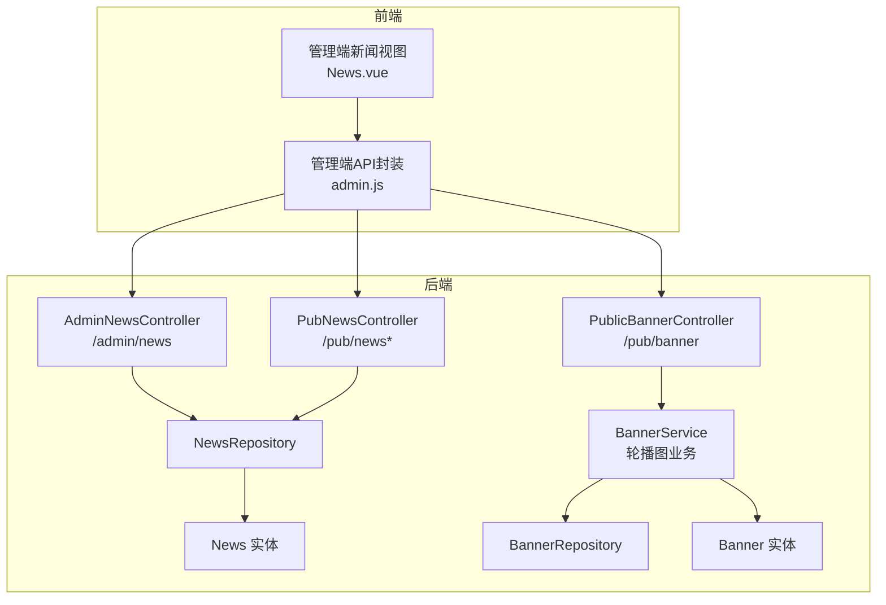
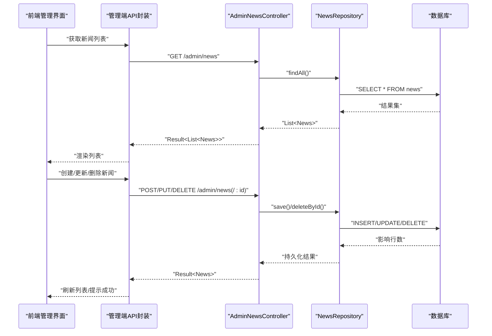
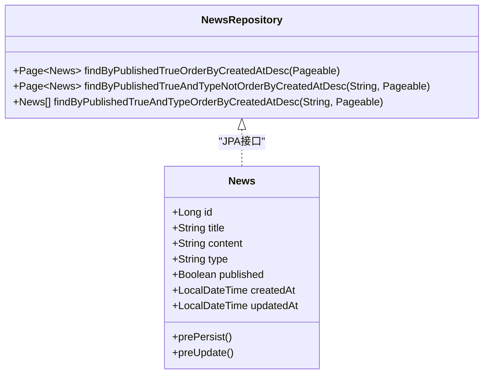
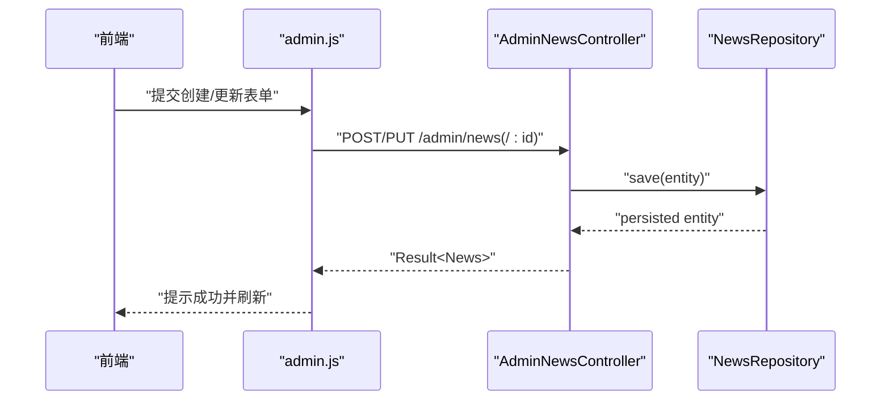
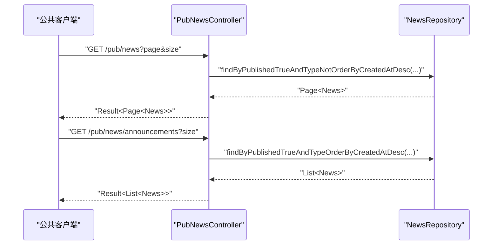
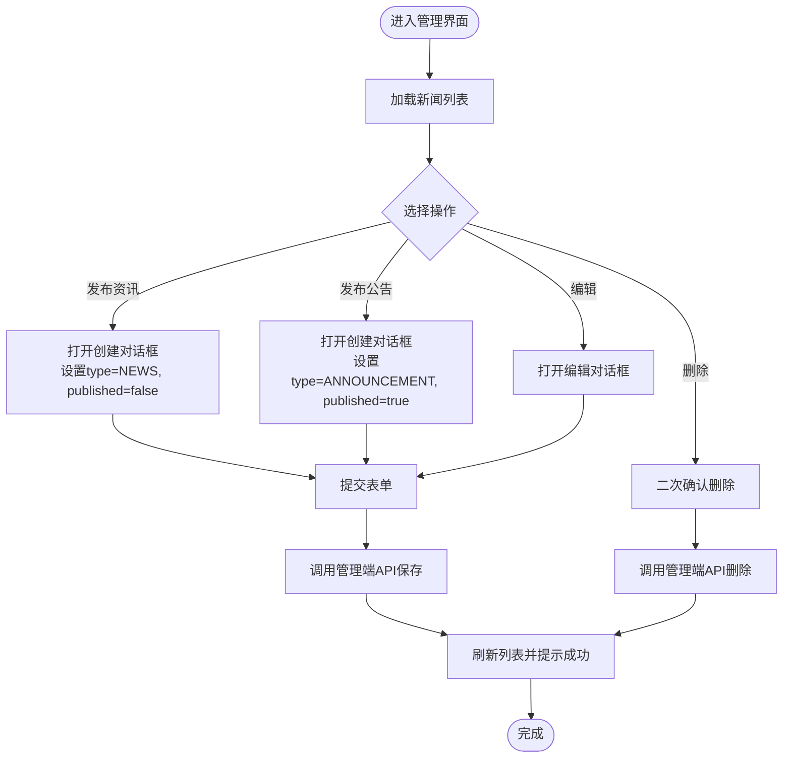
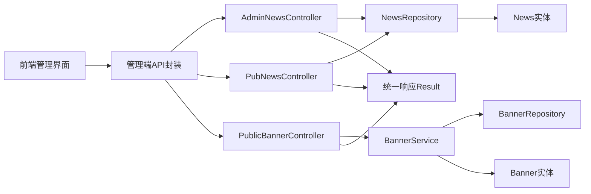

# 管理员新闻内容管理

<cite>
**本文档引用的文件**
- [AdminNewsController.java](file://backend/src/main/java/com/mall/controller/admin/AdminNewsController.java)
- [PubNewsController.java](file://backend/src/main/java/com/mall/controller/pub/PubNewsController.java)
- [News.java](file://backend/src/main/java/com/mall/entity/News.java)
- [NewsRepository.java](file://backend/src/main/java/com/mall/repository/NewsRepository.java)
- [Banner.java](file://backend/src/main/java/com/mall/entity/Banner.java)
- [BannerDTO.java](file://backend/src/main/java/com/mall/dto/BannerDTO.java)
- [BannerRepository.java](file://backend/src/main/java/com/mall/repository/BannerRepository.java)
- [BannerService.java](file://backend/src/main/java/com/mall/service/BannerService.java)
- [PublicBannerController.java](file://backend/src/main/java/com/mall/controller/pub/PublicBannerController.java)
- [News.vue](file://frontend/src/views/admin/News.vue)
- [admin.js](file://frontend/src/api/admin.js)
- [application.yml](file://backend/src/main/resources/application.yml)
- [DataInitializer.java](file://backend/src/main/java/com/mall/config/DataInitializer.java)
- [Result.java](file://backend/src/main/java/com/mall/dto/Result.java)
- [Role.java](file://backend/src/main/java/com/mall/common/Role.java)
- [banner.sql](file://backend/src/main/resources/banner.sql)
</cite>

## 目录
1. [简介](#简介)
2. [项目结构](#项目结构)
3. [核心组件](#核心组件)
4. [架构总览](#架构总览)
5. [详细组件分析](#详细组件分析)
6. [依赖关系分析](#依赖关系分析)
7. [性能考虑](#性能考虑)
8. [故障排除指南](#故障排除指南)
9. [结论](#结论)
10. [附录](#附录)

## 简介
本文件面向管理员新闻内容管理功能，系统性阐述资讯与公告的发布、编辑、删除机制，轮播图管理能力，内容审核与发布时间控制现状，内容分类与展示优先级策略，以及完整的管理端API接口定义。同时说明当前代码库中未实现的功能点（如内容审核流程、发布时间控制、内容缓存策略、SEO优化、移动端适配），并给出基于现有代码的实现建议与最佳实践。

## 项目结构
后端采用Spring Boot + JPA分层架构，前端使用Vue 3 + Element Plus构建管理界面。新闻与公告管理由管理端控制器统一处理，公共接口负责对外展示；轮播图独立实体与服务，支持与商品关联并按权重排序。

**图表来源**
- [AdminNewsController.java:13-47](file://backend/src/main/java/com/mall/controller/admin/AdminNewsController.java#L13-L47)
- [PubNewsController.java:13-35](file://backend/src/main/java/com/mall/controller/pub/PubNewsController.java#L13-L35)
- [NewsRepository.java:10-18](file://backend/src/main/java/com/mall/repository/NewsRepository.java#L10-L18)
- [BannerService.java:16-84](file://backend/src/main/java/com/mall/service/BannerService.java#L16-L84)
- [PublicBannerController.java:12-22](file://backend/src/main/java/com/mall/controller/pub/PublicBannerController.java#L12-L22)
- [News.vue:131-269](file://frontend/src/views/admin/News.vue#L131-L269)
- [admin.js:88-111](file://frontend/src/api/admin.js#L88-L111)

**章节来源**
- [AdminNewsController.java:13-47](file://backend/src/main/java/com/mall/controller/admin/AdminNewsController.java#L13-L47)
- [PubNewsController.java:13-35](file://backend/src/main/java/com/mall/controller/pub/PubNewsController.java#L13-L35)
- [NewsRepository.java:10-18](file://backend/src/main/java/com/mall/repository/NewsRepository.java#L10-L18)
- [BannerService.java:16-84](file://backend/src/main/java/com/mall/service/BannerService.java#L16-L84)
- [PublicBannerController.java:12-22](file://backend/src/main/java/com/mall/controller/pub/PublicBannerController.java#L12-L22)
- [News.vue:131-269](file://frontend/src/views/admin/News.vue#L131-L269)
- [admin.js:88-111](file://frontend/src/api/admin.js#L88-L111)

## 核心组件
- 管理端新闻控制器：提供新闻与公告的增删改查接口，支持草稿与发布的状态切换。
- 新闻实体与仓储：定义News实体字段、JPA注解及自定义查询方法，支持按发布状态与类型筛选。
- 公共新闻控制器：提供资讯列表与公告列表的公开查询接口。
- 轮播图服务与控制器：提供轮播图列表查询与DTO转换，支持与商品关联展示。
- 前端管理界面：提供新闻与公告的创建、编辑、删除、搜索与状态切换UI。

**章节来源**
- [AdminNewsController.java:19-46](file://backend/src/main/java/com/mall/controller/admin/AdminNewsController.java#L19-L46)
- [News.java:16-50](file://backend/src/main/java/com/mall/entity/News.java#L16-L50)
- [NewsRepository.java:11-17](file://backend/src/main/java/com/mall/repository/NewsRepository.java#L11-L17)
- [PubNewsController.java:19-34](file://backend/src/main/java/com/mall/controller/pub/PubNewsController.java#L19-L34)
- [BannerService.java:22-75](file://backend/src/main/java/com/mall/service/BannerService.java#L22-L75)
- [PublicBannerController.java:15-21](file://backend/src/main/java/com/mall/controller/pub/PublicBannerController.java#L15-L21)
- [News.vue:134-268](file://frontend/src/views/admin/News.vue#L134-L268)

## 架构总览
管理端新闻内容管理遵循“控制器-服务-仓储-实体”的分层设计，前端通过HTTP请求调用后端REST接口，后端以统一响应包装返回数据。

**图表来源**
- [AdminNewsController.java:21-46](file://backend/src/main/java/com/mall/controller/admin/AdminNewsController.java#L21-L46)
- [NewsRepository.java:11-17](file://backend/src/main/java/com/mall/repository/NewsRepository.java#L11-L17)
- [admin.js:88-111](file://frontend/src/api/admin.js#L88-L111)
- [News.vue:178-253](file://frontend/src/views/admin/News.vue#L178-L253)

## 详细组件分析

### 新闻实体与仓储
- 实体字段包含标题、内容、类型（资讯/公告）、发布状态、创建与更新时间戳。
- 仓储提供按发布状态与类型筛选的查询方法，支持分页与排序。
- 实体在持久化前自动填充创建与更新时间。

**图表来源**
- [News.java:16-50](file://backend/src/main/java/com/mall/entity/News.java#L16-L50)
- [NewsRepository.java:11-17](file://backend/src/main/java/com/mall/repository/NewsRepository.java#L11-L17)

**章节来源**
- [News.java:16-50](file://backend/src/main/java/com/mall/entity/News.java#L16-L50)
- [NewsRepository.java:11-17](file://backend/src/main/java/com/mall/repository/NewsRepository.java#L11-L17)

### 管理端新闻控制器
- 提供新闻与公告的列表查询、创建、更新、删除接口。
- 使用统一响应包装返回数据，便于前端处理。

**图表来源**
- [AdminNewsController.java:27-39](file://backend/src/main/java/com/mall/controller/admin/AdminNewsController.java#L27-L39)
- [admin.js:93-101](file://frontend/src/api/admin.js#L93-L101)
- [News.vue:214-235](file://frontend/src/views/admin/News.vue#L214-L235)

**章节来源**
- [AdminNewsController.java:21-46](file://backend/src/main/java/com/mall/controller/admin/AdminNewsController.java#L21-L46)
- [admin.js:88-111](file://frontend/src/api/admin.js#L88-L111)
- [News.vue:178-253](file://frontend/src/views/admin/News.vue#L178-L253)

### 公共新闻控制器
- 对外提供资讯列表与公告列表查询接口，支持分页与数量限制。
- 资讯列表默认排除公告类型，公告列表按最新时间排序。

**图表来源**
- [PubNewsController.java:21-34](file://backend/src/main/java/com/mall/controller/pub/PubNewsController.java#L21-L34)
- [NewsRepository.java:13-17](file://backend/src/main/java/com/mall/repository/NewsRepository.java#L13-L17)

**章节来源**
- [PubNewsController.java:19-34](file://backend/src/main/java/com/mall/controller/pub/PubNewsController.java#L19-L34)
- [NewsRepository.java:13-17](file://backend/src/main/java/com/mall/repository/NewsRepository.java#L13-L17)

### 轮播图管理
- 轮播图实体包含标题、关联商品ID、图片URL、跳转链接、排序权重与启用状态。
- 服务层提供轮播图列表查询与DTO转换，支持与商品信息联动展示。
- 公共控制器提供轮播图列表查询接口，仅返回启用且按排序权重升序排列的数据。

```mermaid
classDiagram
class Banner {
+Long id
+String title
+Long productId
+String imageUrl
+String link
+Integer sortOrder
+Boolean enabled
+LocalDateTime createdAt
+LocalDateTime updatedAt
+prePersist()
+preUpdate()
}
class BannerDTO {
+Long id
+String title
+Long productId
+String imageUrl
+String link
+Integer sortOrder
+Boolean enabled
+String name
+String description
+BigDecimal price
+String image
+Integer sales
+String categoryName
+String productName
+String productImage
+String productDescription
+BigDecimal productPrice
+String productCategoryName
+Integer productSales
}
class BannerService {
+listAll() BannerDTO[]
+listPublic() BannerDTO[]
+toDTO(Banner) BannerDTO
+toPublicDTO(Banner) BannerDTO
+save(Banner) Banner
+delete(Long)
+getById(Long) Optional~Banner~
}
class PublicBannerController {
+list() BannerDTO[]
}
BannerService --> Banner : "读取/保存"
BannerService --> BannerDTO : "转换"
PublicBannerController --> BannerService : "依赖"
```

**图表来源**
- [Banner.java:14-58](file://backend/src/main/java/com/mall/entity/Banner.java#L14-L58)
- [BannerDTO.java:7-32](file://backend/src/main/java/com/mall/dto/BannerDTO.java#L7-L32)
- [BannerService.java:18-83](file://backend/src/main/java/com/mall/service/BannerService.java#L18-L83)
- [PublicBannerController.java:15-21](file://backend/src/main/java/com/mall/controller/pub/PublicBannerController.java#L15-L21)

**章节来源**
- [Banner.java:14-58](file://backend/src/main/java/com/mall/entity/Banner.java#L14-L58)
- [BannerDTO.java:7-32](file://backend/src/main/java/com/mall/dto/BannerDTO.java#L7-L32)
- [BannerService.java:22-75](file://backend/src/main/java/com/mall/service/BannerService.java#L22-L75)
- [PublicBannerController.java:15-21](file://backend/src/main/java/com/mall/controller/pub/PublicBannerController.java#L15-L21)

### 前端管理界面
- 提供新闻与公告的创建、编辑、删除、搜索与状态切换UI。
- 支持草稿与公告两种类型，公告默认发布状态。
- 表单校验包括标题与内容长度限制。

**图表来源**
- [News.vue:178-253](file://frontend/src/views/admin/News.vue#L178-L253)
- [admin.js:88-111](file://frontend/src/api/admin.js#L88-L111)

**章节来源**
- [News.vue:134-268](file://frontend/src/views/admin/News.vue#L134-L268)
- [admin.js:88-111](file://frontend/src/api/admin.js#L88-L111)

## 依赖关系分析
- 控制器依赖仓储进行数据访问，服务层依赖仓储与实体进行业务逻辑处理。
- 前端通过API封装调用后端REST接口，统一响应格式便于错误处理与状态提示。
- 应用配置文件定义了数据库连接、JPA方言、日志级别与JWT密钥等关键参数。

**图表来源**
- [AdminNewsController.java:19-24](file://backend/src/main/java/com/mall/controller/admin/AdminNewsController.java#L19-L24)
- [PubNewsController.java:19-26](file://backend/src/main/java/com/mall/controller/pub/PubNewsController.java#L19-L26)
- [PublicBannerController.java:15-21](file://backend/src/main/java/com/mall/controller/pub/PublicBannerController.java#L15-L21)
- [NewsRepository.java:11-17](file://backend/src/main/java/com/mall/repository/NewsRepository.java#L11-L17)
- [BannerService.java:18-25](file://backend/src/main/java/com/mall/service/BannerService.java#L18-L25)
- [Result.java:10-22](file://backend/src/main/java/com/mall/dto/Result.java#L10-L22)

**章节来源**
- [application.yml:1-36](file://backend/src/main/resources/application.yml#L1-L36)
- [Result.java:10-22](file://backend/src/main/java/com/mall/dto/Result.java#L10-L22)

## 性能考虑
- 数据库索引：轮播图表包含(enabled, sort_order)复合索引，有助于按启用状态与排序权重快速检索。
- 查询优化：新闻仓储提供按发布状态与类型的筛选查询，避免全表扫描。
- 分页策略：公共新闻接口支持分页参数，减少一次性传输大量数据。
- 建议：对高频查询增加二级缓存（如Redis）以降低数据库压力；对富文本内容可考虑CDN加速与懒加载。

**章节来源**
- [banner.sql:11-13](file://backend/src/main/resources/banner.sql#L11-L13)
- [NewsRepository.java:13-17](file://backend/src/main/java/com/mall/repository/NewsRepository.java#L13-L17)

## 故障排除指南
- 统一响应格式：所有接口返回统一的Result结构，前端可通过code字段判断是否成功。
- 权限与角色：系统定义了ADMIN、MERCHANT、USER三种角色，管理端功能需具备管理员权限。
- 初始化数据：应用启动时会初始化管理员、运营、用户与示例公告数据，确保演示环境可用。
- 常见问题：
  - 创建/更新失败：检查标题与内容长度限制，确认type与published字段值。
  - 删除确认：删除操作需二次确认，避免误删。
  - 公共接口异常：确认新闻已发布且类型正确，公告列表不包含资讯类型。

**章节来源**
- [Result.java:10-22](file://backend/src/main/java/com/mall/dto/Result.java#L10-L22)
- [Role.java:3-7](file://backend/src/main/java/com/mall/common/Role.java#L3-L7)
- [DataInitializer.java:30-92](file://backend/src/main/java/com/mall/config/DataInitializer.java#L30-L92)

## 结论
当前代码库提供了完整的管理员新闻内容管理基础能力：支持资讯与公告的创建、编辑、删除与列表查询，公共接口可按类型分别展示资讯与公告。轮播图管理通过独立实体与服务实现，支持与商品关联展示。内容审核流程、发布时间控制、内容缓存策略、SEO优化与移动端适配等功能尚未实现，可在现有基础上扩展，以满足更复杂的业务需求。

## 附录

### 管理端新闻管理API接口文档
- 获取新闻列表
  - 方法：GET
  - 路径：/admin/news
  - 请求参数：无
  - 响应：Result<List<News>>
- 创建新闻/公告
  - 方法：POST
  - 路径：/admin/news
  - 请求体：News（type: NEWS/ANNOUNCEMENT, published: Boolean）
  - 响应：Result<News>
- 更新新闻/公告
  - 方法：PUT
  - 路径：/admin/news/{id}
  - 请求体：News（包含id）
  - 响应：Result<News>
- 删除新闻/公告
  - 方法：DELETE
  - 路径：/admin/news/{id}
  - 响应：Result<Void>

**章节来源**
- [AdminNewsController.java:21-46](file://backend/src/main/java/com/mall/controller/admin/AdminNewsController.java#L21-L46)
- [admin.js:88-111](file://frontend/src/api/admin.js#L88-L111)

### 公共新闻展示API接口文档
- 分页查询资讯列表（不含公告）
  - 方法：GET
  - 路径：/pub/news
  - 参数：page（默认0）、size（默认10）
  - 响应：Result<Page<News>>
- 查询最新公告列表
  - 方法：GET
  - 路径：/pub/news/announcements
  - 参数：size（默认5）
  - 响应：Result<List<News>>

**章节来源**
- [PubNewsController.java:21-34](file://backend/src/main/java/com/mall/controller/pub/PubNewsController.java#L21-L34)

### 轮播图管理API接口文档
- 获取轮播图列表（仅启用且按排序权重升序）
  - 方法：GET
  - 路径：/pub/banner
  - 响应：List<BannerDTO>

**章节来源**
- [PublicBannerController.java:18-21](file://backend/src/main/java/com/mall/controller/pub/PublicBannerController.java#L18-L21)
- [BannerService.java:27-33](file://backend/src/main/java/com/mall/service/BannerService.java#L27-L33)

### 内容审核流程、发布时间控制、内容分类管理与展示优先级
- 当前实现：新闻实体包含published字段，公共接口按published=True过滤；类型字段区分NEWS与ANNOUNCEMENT。
- 未实现功能：内容审核流程（审批人、状态流转）、发布时间控制（定时发布）、内容分类管理（分类表与关联）、展示优先级控制（综合权重计算）。
- 建议扩展：
  - 审核流程：新增审核状态枚举与审批记录表，结合定时任务实现定时发布。
  - 分类管理：引入Category实体与News-Category关联表，支持多级分类与标签。
  - 展示优先级：综合权重=排序权重+发布时间系数+人工置顶标记，按权重降序排序。

**章节来源**
- [News.java:28-33](file://backend/src/main/java/com/mall/entity/News.java#L28-L33)
- [NewsRepository.java:13-17](file://backend/src/main/java/com/mall/repository/NewsRepository.java#L13-L17)

### 内容缓存策略、SEO优化、移动端适配
- 缓存策略：建议对公共新闻列表与轮播图列表增加Redis缓存，设置合理TTL；热点内容可预热。
- SEO优化：公共新闻详情页可生成静态化路由与元数据，支持Open Graph与结构化数据。
- 移动端适配：前端组件使用响应式布局与弹性单位，图片资源采用WebP格式与懒加载。

**章节来源**
- [application.yml:1-36](file://backend/src/main/resources/application.yml#L1-L36)