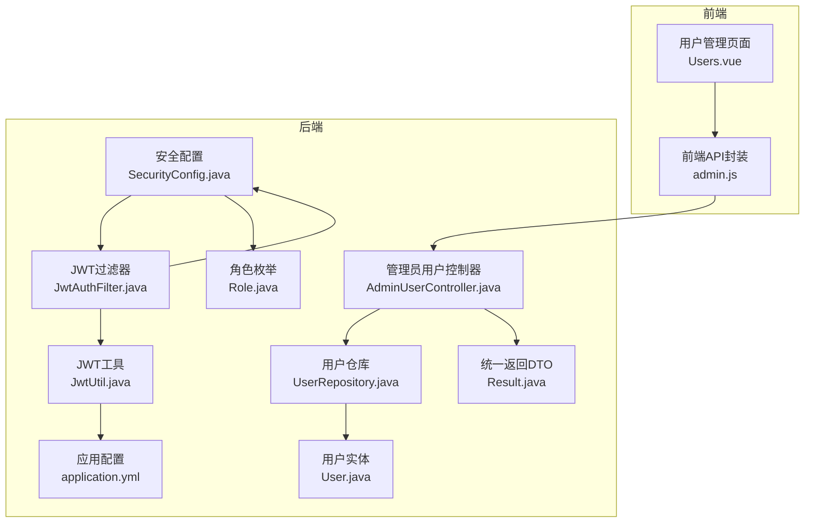
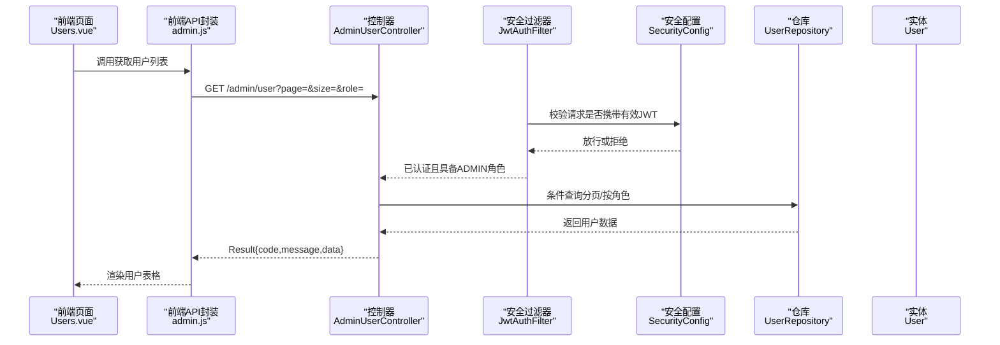
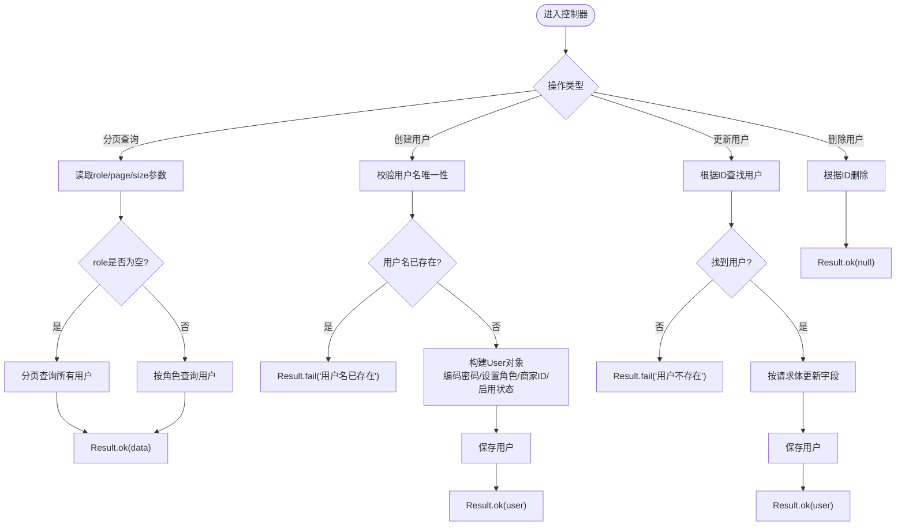
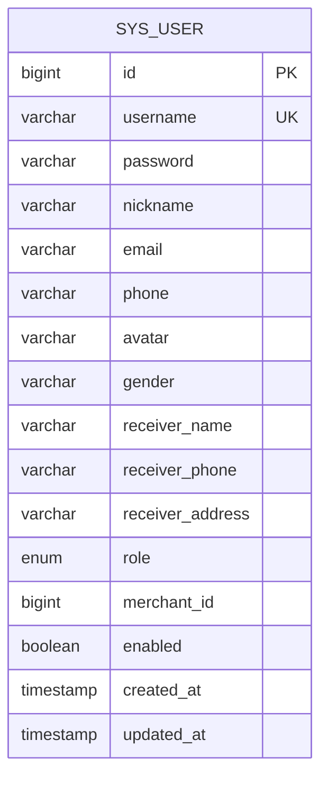
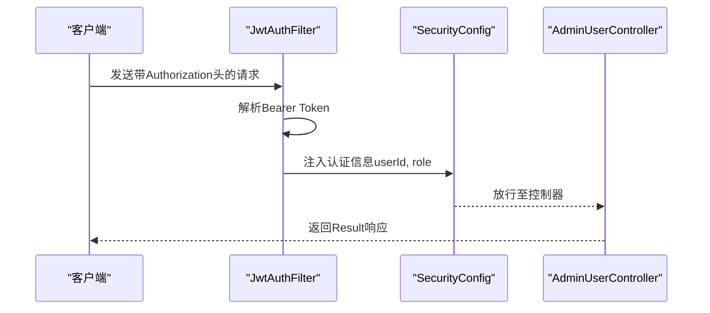
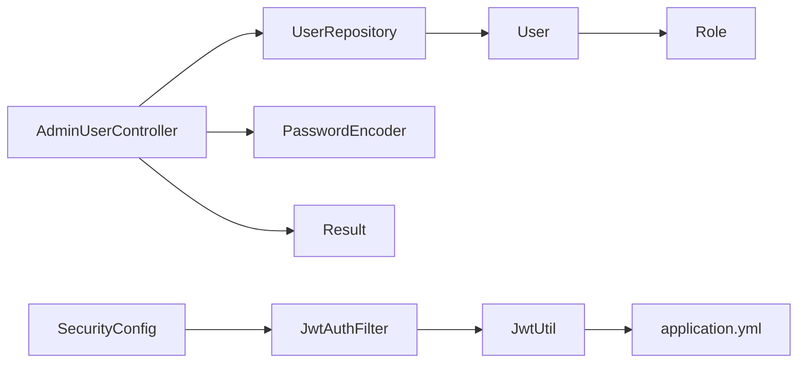

# 管理员用户管理

<cite>
**本文引用的文件**
- [AdminUserController.java](file://backend/src/main/java/com/mall/controller/admin/AdminUserController.java)
- [User.java](file://backend/src/main/java/com/mall/entity/User.java)
- [UserRepository.java](file://backend/src/main/java/com/mall/repository/UserRepository.java)
- [Role.java](file://backend/src/main/java/com/mall/common/Role.java)
- [Result.java](file://backend/src/main/java/com/mall/dto/Result.java)
- [SecurityConfig.java](file://backend/src/main/java/com/mall/config/SecurityConfig.java)
- [JwtAuthFilter.java](file://backend/src/main/java/com/mall/security/JwtAuthFilter.java)
- [JwtUtil.java](file://backend/src/main/java/com/mall/security/JwtUtil.java)
- [application.yml](file://backend/src/main/resources/application.yml)
- [admin.js](file://frontend/src/api/admin.js)
- [Users.vue](file://frontend/src/views/admin/Users.vue)
- [DataInitializer.java](file://backend/src/main/java/com/mall/config/DataInitializer.java)
</cite>

## 目录
1. [简介](#简介)
2. [项目结构](#项目结构)
3. [核心组件](#核心组件)
4. [架构总览](#架构总览)
5. [详细组件分析](#详细组件分析)
6. [依赖分析](#依赖分析)
7. [性能考虑](#性能考虑)
8. [故障排查指南](#故障排查指南)
9. [结论](#结论)
10. [附录](#附录)

## 简介
本技术文档围绕“管理员用户管理”功能展开，聚焦于管理员端用户控制器的实现与交互，涵盖用户分页查询、用户创建、用户信息更新、用户删除等核心能力；同时深入解析用户角色过滤机制、密码加密处理、用户状态管理、商家绑定功能，并提供完整的API接口文档、安全控制策略与权限验证流程说明，以及与用户实体模型的交互关系。文档面向开发与运维人员，既提供代码级细节，也给出可操作的最佳实践建议。

## 项目结构
后端采用Spring Boot + Spring Security + Spring Data JPA架构，管理员用户管理位于后端模块的admin控制器层，配合实体、仓库、安全配置与工具类协同工作。前端通过统一请求封装调用后端接口，展示用户列表与执行增删改操作。

图表来源
- [AdminUserController.java:1-81](file://backend/src/main/java/com/mall/controller/admin/AdminUserController.java#L1-L81)
- [UserRepository.java:1-20](file://backend/src/main/java/com/mall/repository/UserRepository.java#L1-L20)
- [User.java:1-88](file://backend/src/main/java/com/mall/entity/User.java#L1-L88)
- [Role.java:1-8](file://backend/src/main/java/com/mall/common/Role.java#L1-L8)
- [Result.java:1-24](file://backend/src/main/java/com/mall/dto/Result.java#L1-L24)
- [SecurityConfig.java:1-74](file://backend/src/main/java/com/mall/config/SecurityConfig.java#L1-L74)
- [JwtAuthFilter.java:1-57](file://backend/src/main/java/com/mall/security/JwtAuthFilter.java#L1-L57)
- [JwtUtil.java:1-48](file://backend/src/main/java/com/mall/security/JwtUtil.java#L1-L48)
- [application.yml:1-36](file://backend/src/main/resources/application.yml#L1-L36)

章节来源
- [AdminUserController.java:1-81](file://backend/src/main/java/com/mall/controller/admin/AdminUserController.java#L1-L81)
- [SecurityConfig.java:1-74](file://backend/src/main/java/com/mall/config/SecurityConfig.java#L1-L74)
- [application.yml:1-36](file://backend/src/main/resources/application.yml#L1-L36)

## 核心组件
- 管理员用户控制器：提供用户分页查询、创建、更新、删除接口，内置角色过滤、密码加密、状态管理与商家绑定字段处理。
- 用户实体：定义用户表结构、字段约束、枚举角色、启用状态、创建/更新时间戳及与地址的一对多关系。
- 用户仓库：继承JPA仓库，提供按用户名、角色、商家ID等条件查询方法。
- 角色枚举：定义ADMIN、MERCHANT、USER三类角色。
- 统一返回DTO：封装code、message、data，规范前后端交互格式。
- 安全配置：基于JWT的无状态认证，限定/admin/**路径需ADMIN角色访问。
- JWT工具链：生成与解析JWT令牌，注入用户ID、用户名、角色声明。
- 前端API封装与视图：提供用户列表、新增/编辑弹窗、删除确认与统一消息反馈。

章节来源
- [AdminUserController.java:1-81](file://backend/src/main/java/com/mall/controller/admin/AdminUserController.java#L1-L81)
- [User.java:1-88](file://backend/src/main/java/com/mall/entity/User.java#L1-L88)
- [UserRepository.java:1-20](file://backend/src/main/java/com/mall/repository/UserRepository.java#L1-L20)
- [Role.java:1-8](file://backend/src/main/java/com/mall/common/Role.java#L1-L8)
- [Result.java:1-24](file://backend/src/main/java/com/mall/dto/Result.java#L1-L24)
- [SecurityConfig.java:1-74](file://backend/src/main/java/com/mall/config/SecurityConfig.java#L1-L74)
- [JwtAuthFilter.java:1-57](file://backend/src/main/java/com/mall/security/JwtAuthFilter.java#L1-L57)
- [JwtUtil.java:1-48](file://backend/src/main/java/com/mall/security/JwtUtil.java#L1-L48)
- [admin.js:1-129](file://frontend/src/api/admin.js#L1-L129)
- [Users.vue:1-150](file://frontend/src/views/admin/Users.vue#L1-L150)

## 架构总览
管理员用户管理遵循经典的分层架构：前端通过HTTP请求调用后端REST接口；后端控制器接收请求，进行参数校验与业务处理；仓库层负责数据持久化；安全层在进入控制器前完成身份鉴别与授权；JWT工具负责令牌签发与解析。

图表来源
- [AdminUserController.java:26-36](file://backend/src/main/java/com/mall/controller/admin/AdminUserController.java#L26-L36)
- [SecurityConfig.java:48-52](file://backend/src/main/java/com/mall/config/SecurityConfig.java#L48-L52)
- [JwtAuthFilter.java:30-47](file://backend/src/main/java/com/mall/security/JwtAuthFilter.java#L30-L47)
- [UserRepository.java:10-19](file://backend/src/main/java/com/mall/repository/UserRepository.java#L10-L19)
- [Result.java:16-22](file://backend/src/main/java/com/mall/dto/Result.java#L16-L22)

## 详细组件分析

### 控制器：AdminUserController
- 职责
  - 分页查询用户，支持按角色过滤。
  - 创建用户，密码加密存储，支持设置昵称、角色、商家ID与默认启用状态。
  - 更新用户信息（昵称、启用状态、商家ID）。
  - 删除用户。
- 关键点
  - 分页参数：page从0开始，size默认10。
  - 角色过滤：当传入role参数时，使用仓库按角色查询；否则使用分页查询。
  - 密码加密：使用BCryptPasswordEncoder对明文密码进行编码后再保存。
  - 商家绑定：仅当角色为MERCHANT时有效，支持设置merchantId或清空。
  - 统一返回：使用Result封装响应，成功code=200，失败code=400。

图表来源
- [AdminUserController.java:26-79](file://backend/src/main/java/com/mall/controller/admin/AdminUserController.java#L26-L79)

章节来源
- [AdminUserController.java:1-81](file://backend/src/main/java/com/mall/controller/admin/AdminUserController.java#L1-L81)

### 实体模型：User
- 字段说明
  - 基础字段：username（唯一）、password（不参与JSON序列化）、nickname、email、phone、avatar、gender。
  - 收货人信息：receiverName、receiverPhone、receiverAddress。
  - 角色与商家：role（枚举）、merchantId（仅运营角色有效）。
  - 启用状态：enabled，默认true。
  - 时间戳：createdAt（插入时写入）、updatedAt（插入/更新时写入）。
  - 地址关联：一对多，懒加载，JSON忽略。
- 约束与行为
  - username唯一且非空。
  - password非空，使用BCrypt加密存储。
  - enabled布尔值控制账户可用性。
  - merchantId与角色MERCHANT绑定。

图表来源
- [User.java:10-87](file://backend/src/main/java/com/mall/entity/User.java#L10-L87)

章节来源
- [User.java:1-88](file://backend/src/main/java/com/mall/entity/User.java#L1-L88)

### 仓库接口：UserRepository
- 方法
  - 按用户名查询与存在性检查。
  - 按角色查询用户列表。
  - 按商家ID查询用户列表。
- 作用
  - 为控制器提供数据访问能力，支撑分页查询、角色过滤与商家绑定查询。

章节来源
- [UserRepository.java:1-20](file://backend/src/main/java/com/mall/repository/UserRepository.java#L1-L20)

### 角色枚举：Role
- 取值：ADMIN、MERCHANT、USER。
- 用途：与安全配置中的hasRole映射，决定访问控制。

章节来源
- [Role.java:1-8](file://backend/src/main/java/com/mall/common/Role.java#L1-L8)

### 统一返回DTO：Result
- 结构：code、message、data。
- 成功：code=200，message="success"。
- 失败：code=400，message为具体错误信息。
- 使用：控制器在不同分支返回Result.ok或Result.fail。

章节来源
- [Result.java:1-24](file://backend/src/main/java/com/mall/dto/Result.java#L1-L24)

### 安全控制与权限验证
- 路由规则
  - /admin/** 需要ADMIN角色。
  - /merchant/** 需要MERCHANT角色。
  - /user/** 需要USER角色。
- 认证流程
  - 请求头携带Authorization: Bearer <token>。
  - JwtAuthFilter解析令牌，提取userId、username、role，构造认证上下文。
  - SecurityConfig将JwtAuthFilter前置到过滤链中，确保每个/admin/**请求均经过鉴权。
- 密码编码
  - SecurityConfig提供BCryptPasswordEncoder Bean，控制器创建用户时使用该编码器加密密码。

图表来源
- [JwtAuthFilter.java:30-47](file://backend/src/main/java/com/mall/security/JwtAuthFilter.java#L30-L47)
- [SecurityConfig.java:34-54](file://backend/src/main/java/com/mall/config/SecurityConfig.java#L34-L54)
- [AdminUserController.java:26-79](file://backend/src/main/java/com/mall/controller/admin/AdminUserController.java#L26-L79)

章节来源
- [SecurityConfig.java:1-74](file://backend/src/main/java/com/mall/config/SecurityConfig.java#L1-L74)
- [JwtAuthFilter.java:1-57](file://backend/src/main/java/com/mall/security/JwtAuthFilter.java#L1-L57)
- [JwtUtil.java:1-48](file://backend/src/main/java/com/mall/security/JwtUtil.java#L1-L48)

### 前端集成
- API封装
  - 提供获取用户列表、创建用户、更新用户、删除用户的HTTP方法。
- 页面组件
  - Users.vue展示用户表格，支持新增、编辑、删除操作。
  - 表单字段包含用户名、密码（新增时必填）、昵称、角色、启用状态。
  - 统一消息提示：成功/失败提示与列表刷新。

章节来源
- [admin.js:13-31](file://frontend/src/api/admin.js#L13-L31)
- [Users.vue:1-150](file://frontend/src/views/admin/Users.vue#L1-L150)

## 依赖分析
- 控制器依赖
  - UserRepository：数据访问。
  - PasswordEncoder：密码加密。
  - Result：统一响应。
- 实体依赖
  - Role：角色枚举。
  - Jackson注解：JsonIgnore、@OneToMany等。
- 仓库依赖
  - JPA接口：JpaRepository。
- 安全依赖
  - SecurityConfig：路由与过滤器配置。
  - JwtAuthFilter：令牌解析与认证上下文注入。
  - JwtUtil：令牌生成与解析。
- 配置依赖
  - application.yml：数据库、JPA、JWT配置。

图表来源
- [AdminUserController.java:23-24](file://backend/src/main/java/com/mall/controller/admin/AdminUserController.java#L23-L24)
- [UserRepository.java:10-19](file://backend/src/main/java/com/mall/repository/UserRepository.java#L10-L19)
- [User.java:56-65](file://backend/src/main/java/com/mall/entity/User.java#L56-L65)
- [SecurityConfig.java:27-31](file://backend/src/main/java/com/mall/config/SecurityConfig.java#L27-L31)
- [JwtAuthFilter.java:24-28](file://backend/src/main/java/com/mall/security/JwtAuthFilter.java#L24-L28)
- [JwtUtil.java:15-21](file://backend/src/main/java/com/mall/security/JwtUtil.java#L15-L21)
- [application.yml:27-30](file://backend/src/main/resources/application.yml#L27-L30)

章节来源
- [AdminUserController.java:1-81](file://backend/src/main/java/com/mall/controller/admin/AdminUserController.java#L1-L81)
- [UserRepository.java:1-20](file://backend/src/main/java/com/mall/repository/UserRepository.java#L1-L20)
- [User.java:1-88](file://backend/src/main/java/com/mall/entity/User.java#L1-L88)
- [SecurityConfig.java:1-74](file://backend/src/main/java/com/mall/config/SecurityConfig.java#L1-L74)
- [JwtAuthFilter.java:1-57](file://backend/src/main/java/com/mall/security/JwtAuthFilter.java#L1-L57)
- [JwtUtil.java:1-48](file://backend/src/main/java/com/mall/security/JwtUtil.java#L1-L48)
- [application.yml:1-36](file://backend/src/main/resources/application.yml#L1-L36)

## 性能考虑
- 分页查询
  - 控制器默认每页10条，避免一次性返回大量数据；建议前端合理设置分页大小与滚动加载。
- 数据库索引
  - username应建立唯一索引（实体已定义unique），提升查询与去重效率。
- 查询优化
  - 按角色过滤使用仓库方法，避免在内存中二次筛选。
- 编码成本
  - 密码加密使用BCrypt，计算成本较高，建议批量导入或异步处理场景下谨慎并发。
- 安全过滤
  - JwtAuthFilter仅解析一次令牌，后续请求复用认证上下文，减少重复开销。

## 故障排查指南
- 常见错误与定位
  - 用户名已存在：创建用户时返回失败，检查用户名唯一性校验。
  - 用户不存在：更新用户时返回失败，检查ID是否正确。
  - 权限不足：访问/admin/**返回未授权，确认JWT是否携带且角色为ADMIN。
  - 参数缺失：前端表单必填项未填写导致提交失败，检查表单校验逻辑。
- 日志与配置
  - application.yml中开启日志级别，便于追踪认证与业务异常。
  - 初始化脚本DataInitializer提供默认管理员、运营与用户账号，便于测试。

章节来源
- [AdminUserController.java:45-47](file://backend/src/main/java/com/mall/controller/admin/AdminUserController.java#L45-L47)
- [AdminUserController.java:65-66](file://backend/src/main/java/com/mall/controller/admin/AdminUserController.java#L65-L66)
- [SecurityConfig.java:48-52](file://backend/src/main/java/com/mall/config/SecurityConfig.java#L48-L52)
- [application.yml:32-36](file://backend/src/main/resources/application.yml#L32-L36)
- [DataInitializer.java:30-38](file://backend/src/main/java/com/mall/config/DataInitializer.java#L30-L38)

## 结论
管理员用户管理功能以清晰的分层架构实现，控制器承担业务编排职责，仓库与实体保障数据一致性，安全配置与JWT工具确保访问控制与身份可信。通过角色过滤、密码加密、状态管理与商家绑定，系统实现了管理员对用户生命周期的完整管控。建议在生产环境中进一步完善分页索引、令牌刷新策略与审计日志，持续提升安全性与可观测性。

## 附录

### API 接口文档

- 获取用户列表
  - 方法与路径：GET /admin/user
  - 认证：需要ADMIN角色
  - 查询参数
    - role：可选，字符串，支持ADMIN/MERCHANT/USER
    - page：可选，整数，从0开始的页码，默认0
    - size：可选，整数，默认10
  - 响应
    - 成功：Result{code=200, message="success", data=分页结果或列表}
    - 失败：Result{code=400, message=错误信息}

- 创建用户
  - 方法与路径：POST /admin/user
  - 认证：需要ADMIN角色
  - 请求体字段
    - username：字符串，必填，唯一
    - password：字符串，必填，创建时自动加密
    - nickname：字符串，可选
    - role：字符串，必填，ADMIN/MERCHANT/USER
    - merchantId：长整型，可选，仅当role为MERCHANT时有效
    - enabled：布尔值，可选，默认true
  - 响应
    - 成功：Result{code=200, message="success", data=新建用户}
    - 失败：Result{code=400, message=错误信息}

- 更新用户
  - 方法与路径：PUT /admin/user/{id}
  - 认证：需要ADMIN角色
  - 路径参数
    - id：长整型，用户ID
  - 请求体字段（可选）
    - nickname：字符串
    - enabled：布尔值
    - merchantId：长整型，可选（null表示解绑）
  - 响应
    - 成功：Result{code=200, message="success", data=更新后的用户}
    - 失败：Result{code=400, message=错误信息}

- 删除用户
  - 方法与路径：DELETE /admin/user/{id}
  - 认证：需要ADMIN角色
  - 路径参数
    - id：长整型，用户ID
  - 响应
    - 成功：Result{code=200, message="success", data=null}
    - 失败：Result{code=400, message=错误信息}

章节来源
- [AdminUserController.java:26-79](file://backend/src/main/java/com/mall/controller/admin/AdminUserController.java#L26-L79)
- [Result.java:16-22](file://backend/src/main/java/com/mall/dto/Result.java#L16-L22)
- [SecurityConfig.java:48-52](file://backend/src/main/java/com/mall/config/SecurityConfig.java#L48-L52)

### 最佳实践
- 安全
  - 使用HTTPS传输，保护Authorization头与敏感数据。
  - 定期轮换JWT密钥，严格限制过期时间。
  - 对管理员操作增加审计日志与二次确认。
- 性能
  - 为高频查询字段（如username、role、merchantId）建立索引。
  - 合理设置分页大小，避免超大页码与过多数据返回。
- 可维护性
  - 统一使用Result封装响应，便于前端一致处理。
  - 将密码加密逻辑集中在控制器或服务层，避免散落各处。
- 可观测性
  - 开启必要的日志级别，记录关键业务事件与异常堆栈。
  - 在网关或过滤器层增加请求追踪ID，便于跨服务定位问题。