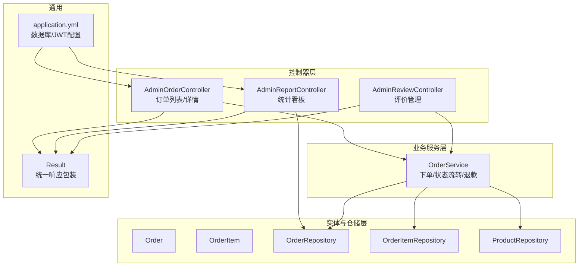
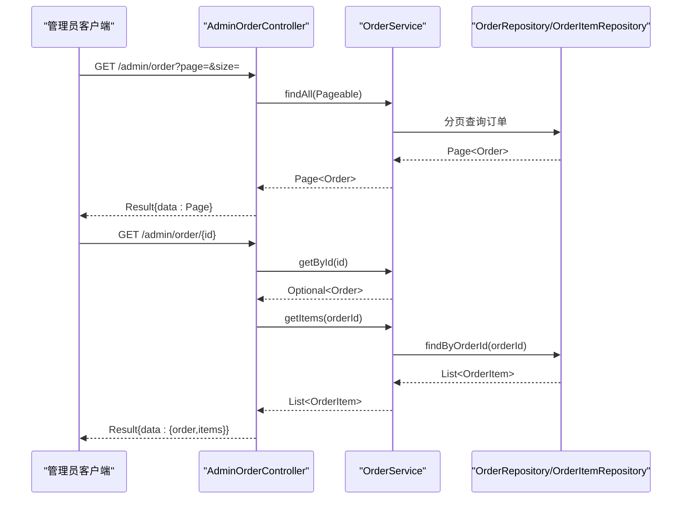
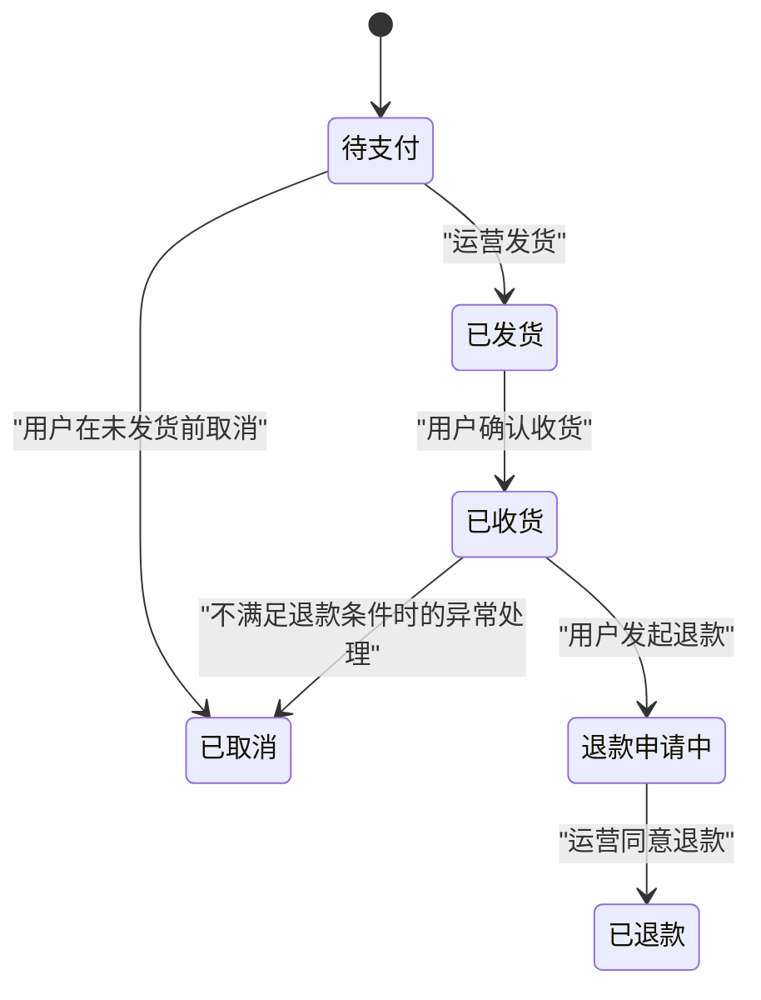
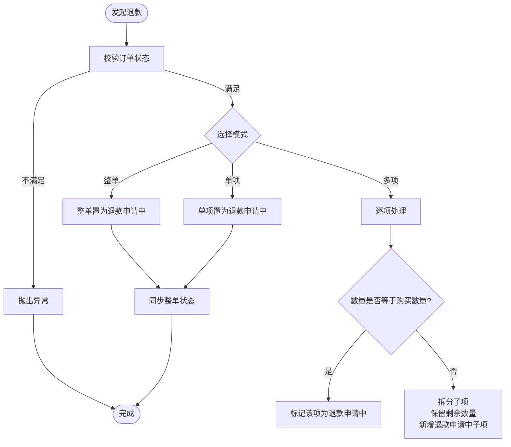
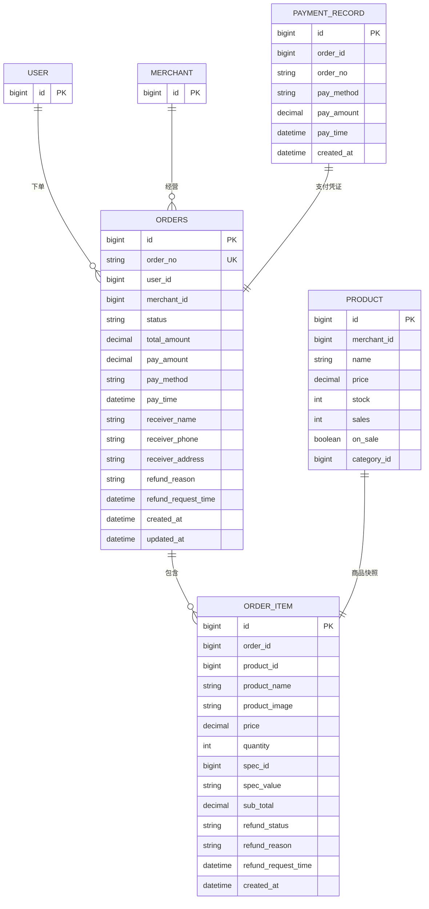
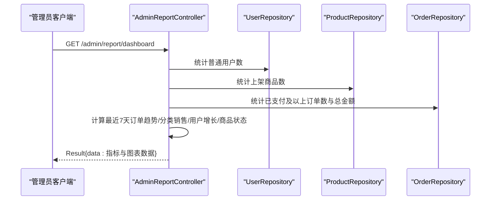
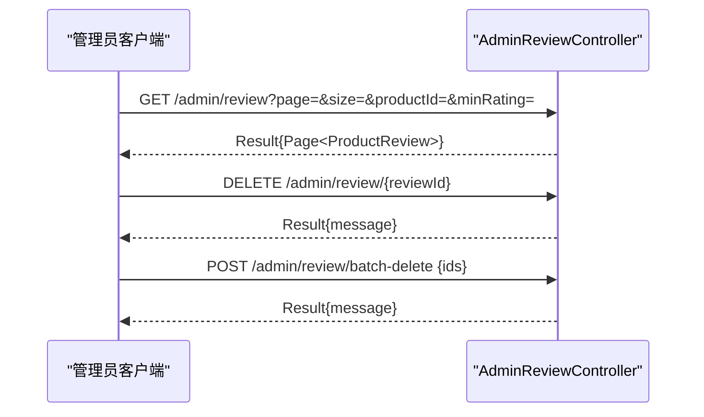
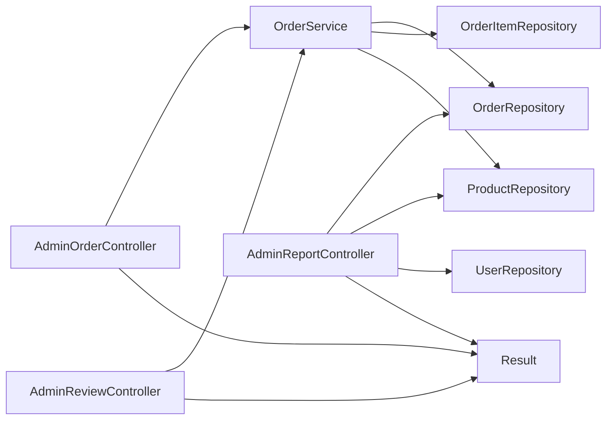

# 管理员订单管理

<cite>
**本文引用的文件**
- [AdminOrderController.java](file://backend/src/main/java/com/mall/controller/admin/AdminOrderController.java)
- [OrderService.java](file://backend/src/main/java/com/mall/service/OrderService.java)
- [Order.java](file://backend/src/main/java/com/mall/entity/Order.java)
- [OrderItem.java](file://backend/src/main/java/com/mall/entity/OrderItem.java)
- [OrderRepository.java](file://backend/src/main/java/com/mall/repository/OrderRepository.java)
- [OrderItemRepository.java](file://backend/src/main/java/com/mall/repository/OrderItemRepository.java)
- [AdminReportController.java](file://backend/src/main/java/com/mall/controller/admin/AdminReportController.java)
- [Result.java](file://backend/src/main/java/com/mall/dto/Result.java)
- [application.yml](file://backend/src/main/resources/application.yml)
- [AdminReviewController.java](file://backend/src/main/java/com/mall/controller/admin/AdminReviewController.java)
- [PaymentRecord.java](file://backend/src/main/java/com/mall/entity/PaymentRecord.java)
- [ProductRepository.java](file://backend/src/main/java/com/mall/repository/ProductRepository.java)
</cite>

## 目录
1. [简介](#简介)
2. [项目结构](#项目结构)
3. [核心组件](#核心组件)
4. [架构总览](#架构总览)
5. [详细组件分析](#详细组件分析)
6. [依赖分析](#依赖分析)
7. [性能考虑](#性能考虑)
8. [故障排查指南](#故障排查指南)
9. [结论](#结论)
10. [附录](#附录)

## 简介
本技术文档围绕管理员订单管理功能展开，系统性阐述订单统计分析、订单审核监管、异常订单处理、状态流转控制、退款处理流程、订单数据汇总统计、查询筛选与批量处理、订单导出能力，以及完整的订单管理API接口定义。同时解释订单与商品、用户、支付模块的关联关系与数据完整性保障机制。

## 项目结构
后端采用Spring Boot + JPA分层架构，管理员订单相关代码集中在以下包与文件：
- 控制器层：/backend/src/main/java/com/mall/controller/admin
- 业务服务层：/backend/src/main/java/com/mall/service
- 实体与仓储层：/backend/src/main/java/com/mall/entity 与 /backend/src/main/java/com/mall/repository
- DTO与配置：/backend/src/main/java/com/mall/dto 与 /backend/src/main/resources/application.yml

**图表来源**
- [AdminOrderController.java:1-45](file://backend/src/main/java/com/mall/controller/admin/AdminOrderController.java#L1-L45)
- [AdminReportController.java:1-176](file://backend/src/main/java/com/mall/controller/admin/AdminReportController.java#L1-L176)
- [AdminReviewController.java:1-92](file://backend/src/main/java/com/mall/controller/admin/AdminReviewController.java#L1-L92)
- [OrderService.java:1-280](file://backend/src/main/java/com/mall/service/OrderService.java#L1-L280)
- [Order.java:1-83](file://backend/src/main/java/com/mall/entity/Order.java#L1-L83)
- [OrderItem.java:1-73](file://backend/src/main/java/com/mall/entity/OrderItem.java#L1-L73)
- [OrderRepository.java:1-28](file://backend/src/main/java/com/mall/repository/OrderRepository.java#L1-L28)
- [OrderItemRepository.java:1-20](file://backend/src/main/java/com/mall/repository/OrderItemRepository.java#L1-L20)
- [Result.java:1-24](file://backend/src/main/java/com/mall/dto/Result.java#L1-L24)
- [application.yml:1-36](file://backend/src/main/resources/application.yml#L1-L36)

**章节来源**
- [AdminOrderController.java:1-45](file://backend/src/main/java/com/mall/controller/admin/AdminOrderController.java#L1-L45)
- [AdminReportController.java:1-176](file://backend/src/main/java/com/mall/controller/admin/AdminReportController.java#L1-L176)
- [AdminReviewController.java:1-92](file://backend/src/main/java/com/mall/controller/admin/AdminReviewController.java#L1-L92)
- [OrderService.java:1-280](file://backend/src/main/java/com/mall/service/OrderService.java#L1-L280)
- [Order.java:1-83](file://backend/src/main/java/com/mall/entity/Order.java#L1-L83)
- [OrderItem.java:1-73](file://backend/src/main/java/com/mall/entity/OrderItem.java#L1-L73)
- [OrderRepository.java:1-28](file://backend/src/main/java/com/mall/repository/OrderRepository.java#L1-L28)
- [OrderItemRepository.java:1-20](file://backend/src/main/java/com/mall/repository/OrderItemRepository.java#L1-L20)
- [Result.java:1-24](file://backend/src/main/java/com/mall/dto/Result.java#L1-L24)
- [application.yml:1-36](file://backend/src/main/resources/application.yml#L1-L36)

## 核心组件
- 管理端订单接口：提供全站订单分页查询与订单详情（含订单项）查询。
- 订单服务：负责下单、状态流转、退款申请与审批、库存扣减与回补。
- 订单实体与订单项实体：描述订单主表与明细表字段、退款状态与评价标记。
- 报表接口：提供后台看板指标（用户数、商品数、订单数、总销售额、趋势与分布）。
- 统一响应包装：Result类用于前后端一致的响应结构。

关键职责与边界：
- 控制器负责参数接收、分页与返回封装。
- 服务层负责业务规则、事务控制与跨实体一致性。
- 仓储层负责数据访问与查询优化。
- DTO负责输出结构标准化。

**章节来源**
- [AdminOrderController.java:25-43](file://backend/src/main/java/com/mall/controller/admin/AdminOrderController.java#L25-L43)
- [OrderService.java:33-88](file://backend/src/main/java/com/mall/service/OrderService.java#L33-L88)
- [OrderService.java:115-161](file://backend/src/main/java/com/mall/service/OrderService.java#L115-L161)
- [OrderService.java:166-278](file://backend/src/main/java/com/mall/service/OrderService.java#L166-L278)
- [AdminReportController.java:33-77](file://backend/src/main/java/com/mall/controller/admin/AdminReportController.java#L33-L77)
- [Result.java:16-22](file://backend/src/main/java/com/mall/dto/Result.java#L16-L22)

## 架构总览
管理员订单管理遵循经典的MVC+分层架构，请求自控制器进入，经服务层执行业务逻辑，持久化由JPA仓储完成。统计分析通过报表控制器聚合订单、商品、用户数据，统一返回给前端看板。

**图表来源**
- [AdminOrderController.java:25-43](file://backend/src/main/java/com/mall/controller/admin/AdminOrderController.java#L25-L43)
- [OrderService.java:105-113](file://backend/src/main/java/com/mall/service/OrderService.java#L105-L113)
- [OrderRepository.java:17-21](file://backend/src/main/java/com/mall/repository/OrderRepository.java#L17-L21)
- [OrderItemRepository.java:11](file://backend/src/main/java/com/mall/repository/OrderItemRepository.java#L11)

## 详细组件分析

### 订单状态流转控制
订单状态包含：PENDING（待支付）、PAID（已支付，当前代码未显式设置）、SHIPPED（已发货）、RECEIVED（已收货）、CANCELLED（已取消）、REFUND_REQUESTED（退款申请中）、REFUNDED（已退款）。服务层严格校验状态转换前置条件，确保业务正确性。

**图表来源**
- [Order.java:31-33](file://backend/src/main/java/com/mall/entity/Order.java#L31-L33)
- [OrderService.java:123-145](file://backend/src/main/java/com/mall/service/OrderService.java#L123-L145)
- [OrderService.java:147-161](file://backend/src/main/java/com/mall/service/OrderService.java#L147-L161)
- [OrderService.java:254-278](file://backend/src/main/java/com/mall/service/OrderService.java#L254-L278)

**章节来源**
- [Order.java:31-33](file://backend/src/main/java/com/mall/entity/Order.java#L31-L33)
- [OrderService.java:123-145](file://backend/src/main/java/com/mall/service/OrderService.java#L123-L145)
- [OrderService.java:147-161](file://backend/src/main/java/com/mall/service/OrderService.java#L147-L161)
- [OrderService.java:254-278](file://backend/src/main/java/com/mall/service/OrderService.java#L254-L278)

### 退款处理流程
支持三种退款场景：
- 整单退款：仅限“已收货”状态订单发起，直接置为“退款申请中”，随后运营同意则标记为“已退款”。
- 单项退款：针对某一个订单项发起，单项状态变为“退款申请中”，若所有项均处于“退款申请中/已退款”，整单同步为“退款申请中”。
- 多项退款（批量）：可选择多个订单项与对应数量进行部分退款，若数量等于购买数量则直接标记该项为“退款申请中”，否则拆分子订单项，保留剩余数量并新增一条退款申请中的子项。

**图表来源**
- [OrderService.java:147-161](file://backend/src/main/java/com/mall/service/OrderService.java#L147-L161)
- [OrderService.java:166-185](file://backend/src/main/java/com/mall/service/OrderService.java#L166-L185)
- [OrderService.java:187-240](file://backend/src/main/java/com/mall/service/OrderService.java#L187-L240)
- [OrderService.java:242-252](file://backend/src/main/java/com/mall/service/OrderService.java#L242-L252)

**章节来源**
- [OrderService.java:147-161](file://backend/src/main/java/com/mall/service/OrderService.java#L147-L161)
- [OrderService.java:166-185](file://backend/src/main/java/com/mall/service/OrderService.java#L166-L185)
- [OrderService.java:187-240](file://backend/src/main/java/com/mall/service/OrderService.java#L187-L240)
- [OrderService.java:242-252](file://backend/src/main/java/com/mall/service/OrderService.java#L242-L252)

### 订单数据模型与关联关系
订单与订单项采用一对多关系，订单项记录商品快照与单项退款状态；订单与用户、商户建立外键关联；支付记录独立存储以保证支付数据完整性。

**图表来源**
- [Order.java:22-70](file://backend/src/main/java/com/mall/entity/Order.java#L22-L70)
- [OrderItem.java:22-63](file://backend/src/main/java/com/mall/entity/OrderItem.java#L22-L63)
- [PaymentRecord.java:23-36](file://backend/src/main/java/com/mall/entity/PaymentRecord.java#L23-L36)
- [ProductRepository.java:13-124](file://backend/src/main/java/com/mall/repository/ProductRepository.java#L13-L124)

**章节来源**
- [Order.java:22-70](file://backend/src/main/java/com/mall/entity/Order.java#L22-L70)
- [OrderItem.java:22-63](file://backend/src/main/java/com/mall/entity/OrderItem.java#L22-L63)
- [PaymentRecord.java:23-36](file://backend/src/main/java/com/mall/entity/PaymentRecord.java#L23-L36)
- [ProductRepository.java:13-124](file://backend/src/main/java/com/mall/repository/ProductRepository.java#L13-L124)

### 订单统计分析与看板
报表接口提供：
- 基础指标：用户总数（仅普通用户）、商品总数（仅上架）、订单总数（已支付及以上状态）、总销售额（已支付及以上）。
- 趋势与分布：最近7天订单数、分类销售TopN、最近6个月用户增长、商品状态分布（销售中/已售罄/已下架）。

**图表来源**
- [AdminReportController.java:33-77](file://backend/src/main/java/com/mall/controller/admin/AdminReportController.java#L33-L77)
- [AdminReportController.java:79-147](file://backend/src/main/java/com/mall/controller/admin/AdminReportController.java#L79-L147)
- [AdminReportController.java:149-174](file://backend/src/main/java/com/mall/controller/admin/AdminReportController.java#L149-L174)

**章节来源**
- [AdminReportController.java:33-77](file://backend/src/main/java/com/mall/controller/admin/AdminReportController.java#L33-L77)
- [AdminReportController.java:79-147](file://backend/src/main/java/com/mall/controller/admin/AdminReportController.java#L79-L147)
- [AdminReportController.java:149-174](file://backend/src/main/java/com/mall/controller/admin/AdminReportController.java#L149-L174)

### 订单查询筛选与批量处理
- 订单列表：支持分页查询全站订单。
- 订单详情：返回订单与订单项明细。
- 评价管理：支持按商品ID与最低评分筛选评价，支持删除与批量删除。

**图表来源**
- [AdminReviewController.java:24-64](file://backend/src/main/java/com/mall/controller/admin/AdminReviewController.java#L24-L64)
- [AdminReviewController.java:66-90](file://backend/src/main/java/com/mall/controller/admin/AdminReviewController.java#L66-L90)

**章节来源**
- [AdminOrderController.java:25-43](file://backend/src/main/java/com/mall/controller/admin/AdminOrderController.java#L25-L43)
- [AdminReviewController.java:24-64](file://backend/src/main/java/com/mall/controller/admin/AdminReviewController.java#L24-L64)
- [AdminReviewController.java:66-90](file://backend/src/main/java/com/mall/controller/admin/AdminReviewController.java#L66-L90)

### 订单与商品、用户、支付模块的关联与完整性
- 订单与用户：通过userId关联，用于用户维度查询与权限校验。
- 订单与商户：通过merchantId关联，用于运营维度查询与退款审批校验。
- 订单与商品：通过订单项中的productId与快照字段保存购买时的价格、图片、规格等，避免后续价格变动影响历史记录。
- 支付模块：支付记录独立实体，记录支付方式、金额与时间，保证支付数据完整性与审计需求。

**章节来源**
- [Order.java:25-29](file://backend/src/main/java/com/mall/entity/Order.java#L25-L29)
- [OrderItem.java:25-48](file://backend/src/main/java/com/mall/entity/OrderItem.java#L25-L48)
- [PaymentRecord.java:23-36](file://backend/src/main/java/com/mall/entity/PaymentRecord.java#L23-L36)

## 依赖分析
- 控制器依赖服务层，服务层依赖仓储层与实体。
- 报表控制器依赖用户、商品、订单仓储进行聚合统计。
- 统一响应Result贯穿所有控制器，保证返回结构一致。

**图表来源**
- [AdminOrderController.java:23](file://backend/src/main/java/com/mall/controller/admin/AdminOrderController.java#L23)
- [AdminReportController.java:29-31](file://backend/src/main/java/com/mall/controller/admin/AdminReportController.java#L29-L31)
- [AdminReviewController.java:22](file://backend/src/main/java/com/mall/controller/admin/AdminReviewController.java#L22)
- [OrderService.java:28-31](file://backend/src/main/java/com/mall/service/OrderService.java#L28-L31)
- [Result.java:16-22](file://backend/src/main/java/com/mall/dto/Result.java#L16-L22)

**章节来源**
- [AdminOrderController.java:23](file://backend/src/main/java/com/mall/controller/admin/AdminOrderController.java#L23)
- [AdminReportController.java:29-31](file://backend/src/main/java/com/mall/controller/admin/AdminReportController.java#L29-L31)
- [AdminReviewController.java:22](file://backend/src/main/java/com/mall/controller/admin/AdminReviewController.java#L22)
- [OrderService.java:28-31](file://backend/src/main/java/com/mall/service/OrderService.java#L28-L31)
- [Result.java:16-22](file://backend/src/main/java/com/mall/dto/Result.java#L16-L22)

## 性能考虑
- 分页查询：控制器与服务层均使用Pageable，避免一次性加载全量数据。
- 批量处理：报表聚合在内存中进行，建议在数据量较大时引入数据库层面的聚合查询或缓存中间表。
- 事务边界：退款与库存操作在事务内执行，确保一致性但需关注长事务带来的锁竞争。
- 查询优化：仓储层提供按用户、商户、状态的分页查询，减少不必要的全表扫描。

[本节为通用指导，无需具体文件来源]

## 故障排查指南
- 订单不存在：详情查询返回失败提示，检查订单ID与权限。
- 状态不可变更：取消、退款申请、审批均受状态前置条件限制，需核对当前状态。
- 库存不足：下单时会校验库存，若不足需提示用户或运营调整。
- 退款数量非法：批量退款时数量必须在购买数量范围内，否则抛出异常。
- 统计偏差：报表基于已支付及以上状态订单计算，确保状态一致性。

**章节来源**
- [AdminOrderController.java:35-42](file://backend/src/main/java/com/mall/controller/admin/AdminOrderController.java#L35-L42)
- [OrderService.java:123-145](file://backend/src/main/java/com/mall/service/OrderService.java#L123-L145)
- [OrderService.java:147-161](file://backend/src/main/java/com/mall/service/OrderService.java#L147-L161)
- [OrderService.java:187-210](file://backend/src/main/java/com/mall/service/OrderService.java#L187-L210)
- [AdminReportController.java:50-62](file://backend/src/main/java/com/mall/controller/admin/AdminReportController.java#L50-L62)

## 结论
管理员订单管理功能以清晰的分层架构实现订单全生命周期管理，涵盖统计分析、状态流转、退款处理与评价管理。通过严格的前置条件校验与事务控制，保障业务正确性与数据一致性。建议在高并发场景下进一步优化统计查询与缓存策略，并完善异常订单的自动识别与人工复核流程。

[本节为总结性内容，无需具体文件来源]

## 附录

### 完整API接口清单（管理员端）

- 订单列表
  - 方法：GET
  - 路径：/admin/order
  - 参数：page（默认0）、size（默认10）
  - 返回：Result{data: Page<Order>}

- 订单详情
  - 方法：GET
  - 路径：/admin/order/{id}
  - 返回：Result{data: {order: Order, items: List<OrderItem>}}

- 退款管理（示例：运营同意单项退款）
  - 方法：POST（建议改为运营专用接口路径）
  - 路径：/admin/order/refund/approve-item
  - 请求体：{orderId, itemId, merchantId}
  - 返回：Result{message/status}

- 评价管理
  - 分页查询：GET /admin/review?page=&size=&productId=&minRating=
  - 删除单条：DELETE /admin/review/{reviewId}
  - 批量删除：POST /admin/review/batch-delete {ids}

- 统计看板
  - GET /admin/report/dashboard
  - 返回：用户数、商品数、订单数、总销售额、趋势与分布等

**章节来源**
- [AdminOrderController.java:25-43](file://backend/src/main/java/com/mall/controller/admin/AdminOrderController.java#L25-L43)
- [AdminReviewController.java:24-90](file://backend/src/main/java/com/mall/controller/admin/AdminReviewController.java#L24-L90)
- [AdminReportController.java:33-77](file://backend/src/main/java/com/mall/controller/admin/AdminReportController.java#L33-L77)