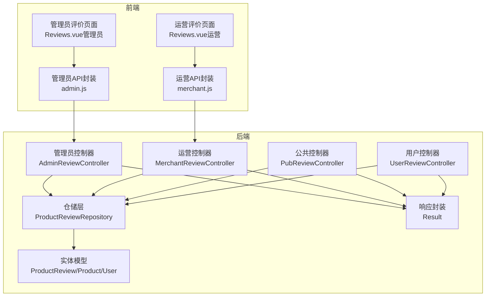
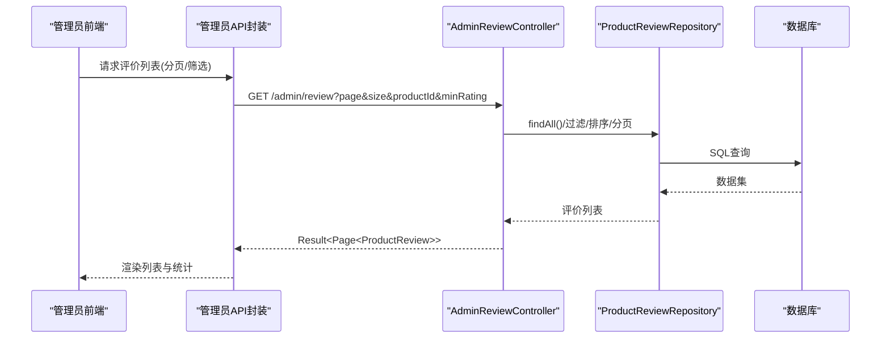
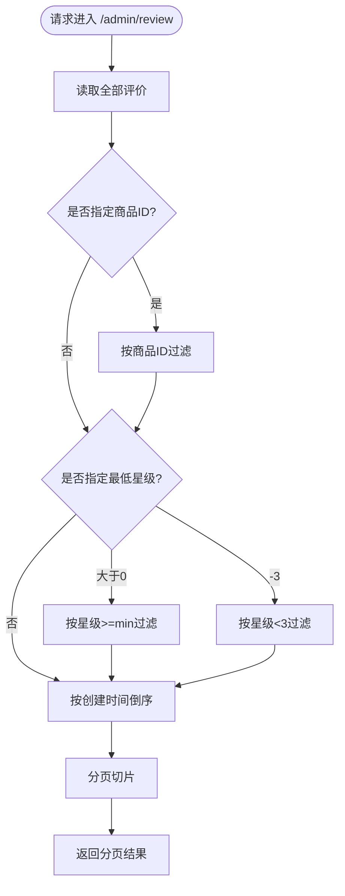
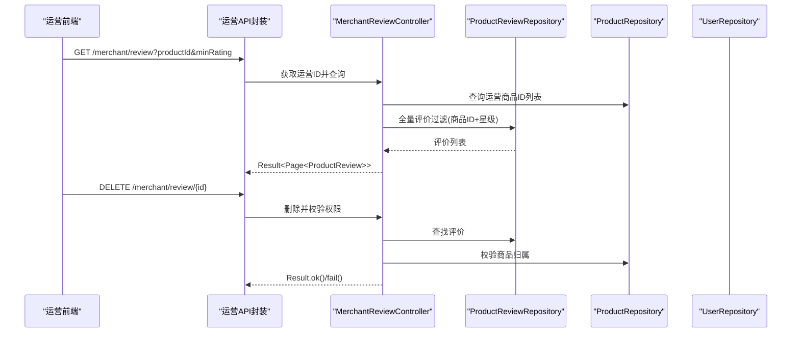
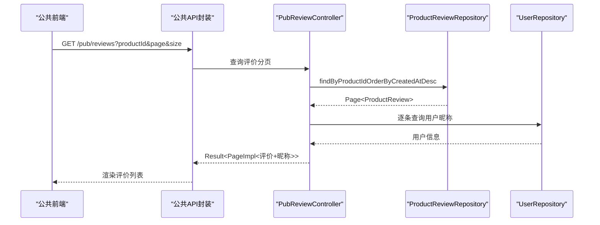
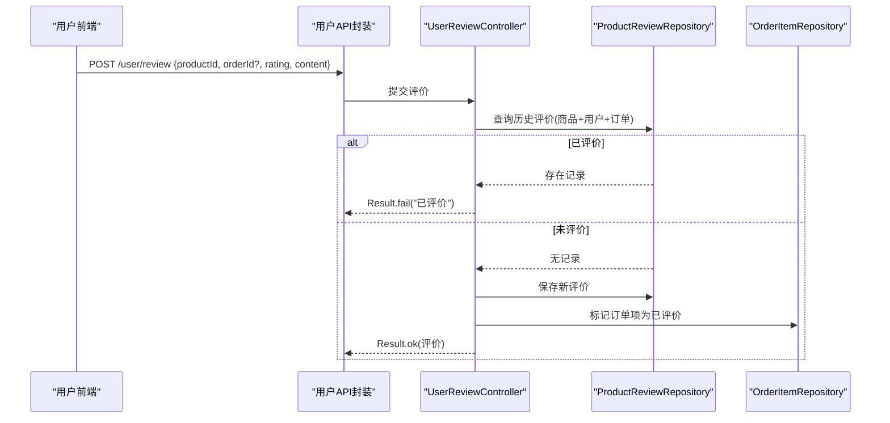
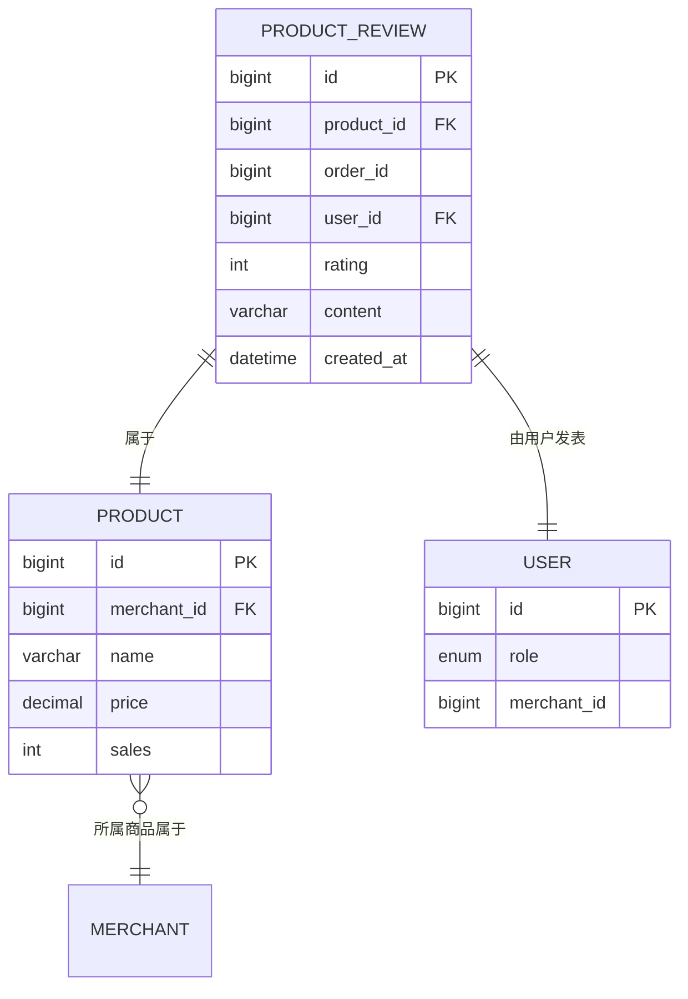
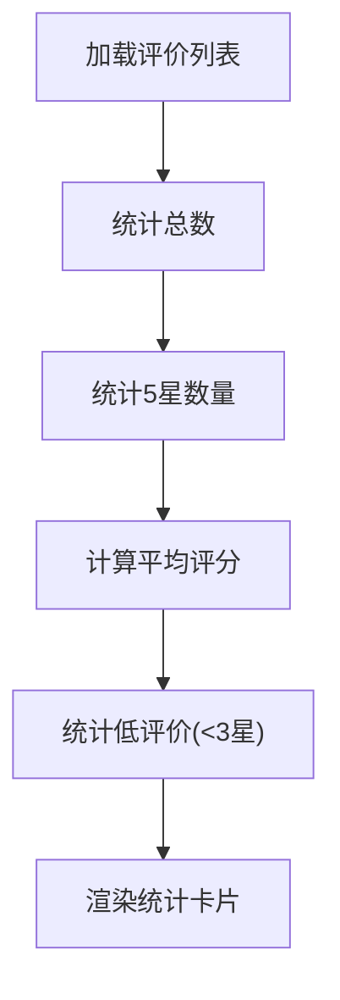
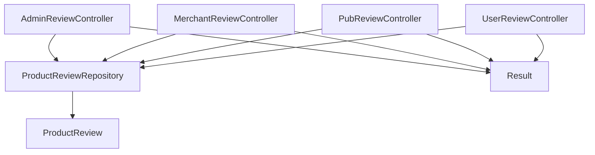

# 管理员评价管理

<cite>
**本文档引用的文件**
- [AdminReviewController.java](file://backend/src/main/java/com/mall/controller/admin/AdminReviewController.java)
- [ProductReview.java](file://backend/src/main/java/com/mall/entity/ProductReview.java)
- [ProductReviewRepository.java](file://backend/src/main/java/com/mall/repository/ProductReviewRepository.java)
- [Result.java](file://backend/src/main/java/com/mall/dto/Result.java)
- [PubReviewController.java](file://backend/src/main/java/com/mall/controller/pub/PubReviewController.java)
- [UserReviewController.java](file://backend/src/main/java/com/mall/controller/user/UserReviewController.java)
- [MerchantReviewController.java](file://backend/src/main/java/com/mall/controller/merchant/MerchantReviewController.java)
- [Product.java](file://backend/src/main/java/com/mall/entity/Product.java)
- [User.java](file://backend/src/main/java/com/mall/entity/User.java)
- [application.yml](file://backend/src/main/resources/application.yml)
- [admin.js](file://frontend/src/api/admin.js)
- [merchant.js](file://frontend/src/api/merchant.js)
- [Reviews.vue（管理员）](file://frontend/src/views/admin/Reviews.vue)
- [Reviews.vue（运营）](file://frontend/src/views/merchant/Reviews.vue)
- [product_review 表结构](file://mall.sql)
</cite>

## 目录
1. [简介](#简介)
2. [项目结构](#项目结构)
3. [核心组件](#核心组件)
4. [架构概览](#架构概览)
5. [详细组件分析](#详细组件分析)
6. [依赖分析](#依赖分析)
7. [性能考虑](#性能考虑)
8. [故障排除指南](#故障排除指南)
9. [结论](#结论)
10. [附录](#附录)

## 简介
本技术文档聚焦于管理员评价管理功能，系统性解析商品评价审核、评价内容管理、评价数据统计的实现机制；详细说明评价真实性验证、恶意评价识别、评价屏蔽处理等策略；提供完整的评价管理API接口文档，覆盖评价查看、内容审核、删除处理等操作；解释评价与商品、用户之间的关联关系，以及评价数据对商品排名的影响机制；包含评价数据分析、用户反馈统计等高级功能的实现细节。

## 项目结构
后端采用Spring Boot + Spring Data JPA架构，前端基于Vue 3 + Element Plus构建。管理员端与运营端分别提供独立的评价管理界面与接口，通过统一的数据模型与仓储层支撑。

**图表来源**
- [AdminReviewController.java:16-92](file://backend/src/main/java/com/mall/controller/admin/AdminReviewController.java#L16-L92)
- [MerchantReviewController.java:21-157](file://backend/src/main/java/com/mall/controller/merchant/MerchantReviewController.java#L21-L157)
- [PubReviewController.java:19-64](file://backend/src/main/java/com/mall/controller/pub/PubReviewController.java#L19-L64)
- [UserReviewController.java:17-73](file://backend/src/main/java/com/mall/controller/user/UserReviewController.java#L17-L73)
- [ProductReviewRepository.java:10-15](file://backend/src/main/java/com/mall/repository/ProductReviewRepository.java#L10-L15)
- [ProductReview.java:15-43](file://backend/src/main/java/com/mall/entity/ProductReview.java#L15-L43)
- [Result.java:10-23](file://backend/src/main/java/com/mall/dto/Result.java#L10-L23)

**章节来源**
- [application.yml:1-36](file://backend/src/main/resources/application.yml#L1-L36)

## 核心组件
- 管理员控制器：提供平台级评价列表查询、单条与批量删除能力。
- 运营控制器：提供运营所属商品的评价列表查询、单条与批量删除能力，并进行运营权限校验。
- 公共控制器：提供按商品分页查询评价列表，并补充用户昵称信息。
- 用户控制器：提供用户提交评价的能力，并防止重复评价。
- 仓储层：提供按商品分页查询、按商品ID查询等方法。
- 实体模型：定义评价、商品、用户之间的字段与关系。
- 响应封装：统一返回格式，便于前后端交互。

**章节来源**
- [AdminReviewController.java:24-90](file://backend/src/main/java/com/mall/controller/admin/AdminReviewController.java#L24-L90)
- [MerchantReviewController.java:39-155](file://backend/src/main/java/com/mall/controller/merchant/MerchantReviewController.java#L39-L155)
- [PubReviewController.java:28-61](file://backend/src/main/java/com/mall/controller/pub/PubReviewController.java#L28-L61)
- [UserReviewController.java:31-71](file://backend/src/main/java/com/mall/controller/user/UserReviewController.java#L31-L71)
- [ProductReviewRepository.java:10-15](file://backend/src/main/java/com/mall/repository/ProductReviewRepository.java#L10-L15)
- [ProductReview.java:15-43](file://backend/src/main/java/com/mall/entity/ProductReview.java#L15-L43)
- [Result.java:10-23](file://backend/src/main/java/com/mall/dto/Result.java#L10-L23)

## 架构概览
管理员与运营端均通过各自的控制器访问仓储层，仓储层基于JPA与MySQL持久化。前端通过API封装调用后端接口，管理员端支持全站评价的筛选与删除，运营端仅限其名下商品的评价管理。

**图表来源**
- [AdminReviewController.java:24-64](file://backend/src/main/java/com/mall/controller/admin/AdminReviewController.java#L24-L64)
- [ProductReviewRepository.java:10-15](file://backend/src/main/java/com/mall/repository/ProductReviewRepository.java#L10-L15)

## 详细组件分析

### 管理员评价管理
- 功能点
  - 分页查询所有评价，支持按商品ID与最低星级筛选。
  - 删除单条与批量删除评价。
  - 返回统一结果封装，便于前端展示。
- 关键逻辑
  - 先全量查询，再在内存中应用过滤条件与排序，最后分页切片。
  - 删除前检查是否存在，避免无效删除。
- 安全与权限
  - 控制器未做角色校验，建议在拦截器或安全配置中增加管理员鉴权。

**图表来源**
- [AdminReviewController.java:24-64](file://backend/src/main/java/com/mall/controller/admin/AdminReviewController.java#L24-L64)

**章节来源**
- [AdminReviewController.java:24-90](file://backend/src/main/java/com/mall/controller/admin/AdminReviewController.java#L24-L90)
- [Result.java:10-23](file://backend/src/main/java/com/mall/dto/Result.java#L10-L23)

### 运营评价管理
- 功能点
  - 查询运营名下所有商品的评价，支持按商品ID与最低星级筛选。
  - 查询单个商品的所有评价。
  - 删除单条与批量删除评价，并进行运营权限校验。
- 关键逻辑
  - 先获取运营的所有商品ID，再从全量评价中筛选属于其商品的评价。
  - 删除时校验评价所属商品是否属于当前运营，避免越权删除。
- 安全与权限
  - 通过当前登录用户映射到运营ID，并校验商品归属。

**图表来源**
- [MerchantReviewController.java:39-155](file://backend/src/main/java/com/mall/controller/merchant/MerchantReviewController.java#L39-L155)
- [ProductReviewRepository.java:10-15](file://backend/src/main/java/com/mall/repository/ProductReviewRepository.java#L10-L15)
- [Product.java:16-23](file://backend/src/main/java/com/mall/entity/Product.java#L16-L23)
- [User.java:56-62](file://backend/src/main/java/com/mall/entity/User.java#L56-L62)

**章节来源**
- [MerchantReviewController.java:39-155](file://backend/src/main/java/com/mall/controller/merchant/MerchantReviewController.java#L39-L155)

### 公共评价接口
- 功能点
  - 按商品ID分页查询评价列表。
  - 为每条评价补充用户昵称（若无昵称则回退用户名），并返回统一分页包装。
- 关键逻辑
  - 使用仓储层提供的按商品分页查询方法。
  - 通过用户ID关联用户表获取昵称。

**图表来源**
- [PubReviewController.java:28-61](file://backend/src/main/java/com/mall/controller/pub/PubReviewController.java#L28-L61)
- [ProductReviewRepository.java:12-14](file://backend/src/main/java/com/mall/repository/ProductReviewRepository.java#L12-L14)
- [User.java:30-31](file://backend/src/main/java/com/mall/entity/User.java#L30-L31)

**章节来源**
- [PubReviewController.java:28-61](file://backend/src/main/java/com/mall/controller/pub/PubReviewController.java#L28-L61)

### 用户评价提交
- 功能点
  - 用户提交商品评价，防止重复评价。
  - 可选绑定订单ID，提交后标记该订单项为已评价。
- 关键逻辑
  - 按商品ID与用户ID（及订单ID）查询历史评价，若存在则拒绝重复提交。
  - 保存评价后更新对应订单项状态。

**图表来源**
- [UserReviewController.java:31-71](file://backend/src/main/java/com/mall/controller/user/UserReviewController.java#L31-L71)

**章节来源**
- [UserReviewController.java:31-71](file://backend/src/main/java/com/mall/controller/user/UserReviewController.java#L31-L71)

### 数据模型与关联关系
- 实体模型
  - 评价：包含商品ID、订单ID、用户ID、评分、内容、创建时间。
  - 商品：包含商户ID、名称、价格、销量等。
  - 用户：包含角色、运营ID等。
- 关联关系
  - 评价与商品：一对多（一个商品可有多条评价）。
  - 评价与用户：一对多（一个用户可有多条评价）。
  - 商品与商户：一对多（一个商户可有多件商品）。

**图表来源**
- [product_review 表结构:366-375](file://mall.sql#L366-L375)
- [ProductReview.java:15-43](file://backend/src/main/java/com/mall/entity/ProductReview.java#L15-L43)
- [Product.java:16-23](file://backend/src/main/java/com/mall/entity/Product.java#L16-L23)
- [User.java:56-62](file://backend/src/main/java/com/mall/entity/User.java#L56-L62)

**章节来源**
- [product_review 表结构:366-375](file://mall.sql#L366-L375)
- [ProductReview.java:15-43](file://backend/src/main/java/com/mall/entity/ProductReview.java#L15-L43)
- [Product.java:16-23](file://backend/src/main/java/com/mall/entity/Product.java#L16-L23)
- [User.java:56-62](file://backend/src/main/java/com/mall/entity/User.java#L56-L62)

### 评价数据统计与高级功能
- 统计维度
  - 总评价数、5星评价数、平均评分、低评价（<3星）数量。
- 实现方式
  - 前端在加载评价列表后进行聚合计算，形成统计卡片。
  - 可扩展后端提供聚合接口，如按商品/运营维度统计。

**图表来源**
- [Reviews.vue（管理员）:262-316](file://frontend/src/views/admin/Reviews.vue#L262-L316)
- [Reviews.vue（运营）:262-316](file://frontend/src/views/merchant/Reviews.vue#L262-L316)

**章节来源**
- [Reviews.vue（管理员）:262-316](file://frontend/src/views/admin/Reviews.vue#L262-L316)
- [Reviews.vue（运营）:262-316](file://frontend/src/views/merchant/Reviews.vue#L262-L316)

## 依赖分析
- 控制器与仓储
  - 管理员与运营控制器均依赖仓储层进行数据查询与删除。
  - 仓储层基于JPA，提供按商品分页查询与按商品ID查询。
- 控制器与实体
  - 控制器直接操作实体对象，仓储层负责持久化。
- 前后端依赖
  - 前端通过API封装调用后端接口，统一使用Result响应格式。

**图表来源**
- [AdminReviewController.java:22-22](file://backend/src/main/java/com/mall/controller/admin/AdminReviewController.java#L22-L22)
- [MerchantReviewController.java:27-29](file://backend/src/main/java/com/mall/controller/merchant/MerchantReviewController.java#L27-L29)
- [PubReviewController.java:25-26](file://backend/src/main/java/com/mall/controller/pub/PubReviewController.java#L25-L26)
- [UserReviewController.java:23-24](file://backend/src/main/java/com/mall/controller/user/UserReviewController.java#L23-L24)
- [ProductReviewRepository.java:10-15](file://backend/src/main/java/com/mall/repository/ProductReviewRepository.java#L10-L15)
- [Result.java:10-23](file://backend/src/main/java/com/mall/dto/Result.java#L10-L23)

**章节来源**
- [ProductReviewRepository.java:10-15](file://backend/src/main/java/com/mall/repository/ProductReviewRepository.java#L10-L15)

## 性能考虑
- 内存过滤与分页
  - 管理员控制器先全量查询再在内存中过滤与排序，可能在数据量较大时产生性能瓶颈。建议改为数据库侧过滤与排序，或使用分页查询后端处理。
- 查询效率
  - 运营控制器需先查询运营商品ID列表，再过滤全量评价，建议优化为JOIN查询或限制商品数量。
- 响应封装
  - 统一Result封装简化了前端处理，但需注意错误码与消息的一致性。

[本节为通用性能讨论，不直接分析具体文件]

## 故障排除指南
- 评价删除失败
  - 现象：返回“评价不存在”或“无权限删除”。
  - 排查：确认评价ID是否存在；确认评价所属商品是否属于当前运营。
- 重复评价
  - 现象：提交评价时报错“该商品已评价，不能重复评价”。
  - 排查：确认是否已针对同一订单或同一商品提交过评价。
- 评价列表为空
  - 现象：筛选条件导致结果为空。
  - 排查：检查商品ID与最低星级参数是否正确；尝试清除筛选条件重试。

**章节来源**
- [AdminReviewController.java:66-76](file://backend/src/main/java/com/mall/controller/admin/AdminReviewController.java#L66-L76)
- [MerchantReviewController.java:112-132](file://backend/src/main/java/com/mall/controller/merchant/MerchantReviewController.java#L112-L132)
- [UserReviewController.java:40-47](file://backend/src/main/java/com/mall/controller/user/UserReviewController.java#L40-L47)

## 结论
管理员与运营端的评价管理功能以清晰的职责划分实现了评价的查看、筛选与删除。通过统一的实体模型与仓储层，系统在功能上具备良好的扩展性。建议后续优化内存过滤与分页策略，增强真实评价验证与恶意评价识别能力，并完善评价屏蔽与统计分析功能，以提升平台治理水平与用户体验。

## 附录

### 管理员评价管理API接口文档
- 查询评价列表
  - 方法：GET
  - 路径：/admin/review
  - 参数：
    - page：页码（默认0）
    - size：每页大小（默认10）
    - productId：商品ID（可选）
    - minRating：最低星级（>0表示≥min，-3表示<3，可选）
  - 返回：分页结果，包含评价列表与总数
- 删除单条评价
  - 方法：DELETE
  - 路径：/admin/review/{reviewId}
  - 返回：操作结果
- 批量删除评价
  - 方法：POST
  - 路径：/admin/review/batch-delete
  - 请求体：评价ID数组
  - 返回：删除成功数量

**章节来源**
- [AdminReviewController.java:24-90](file://backend/src/main/java/com/mall/controller/admin/AdminReviewController.java#L24-L90)
- [admin.js:115-129](file://frontend/src/api/admin.js#L115-L129)

### 运营评价管理API接口文档
- 查询评价列表
  - 方法：GET
  - 路径：/merchant/review
  - 参数：与管理员接口一致
  - 返回：分页结果（仅限运营名下商品）
- 查询单个商品的评价
  - 方法：GET
  - 路径：/merchant/review/product/{productId}
  - 返回：该商品评价列表
- 删除单条评价
  - 方法：DELETE
  - 路径：/merchant/review/{reviewId}
  - 返回：操作结果（需具备商品归属权限）
- 批量删除评价
  - 方法：POST
  - 路径：/merchant/review/batch-delete
  - 请求体：评价ID数组
  - 返回：删除成功数量

**章节来源**
- [MerchantReviewController.java:39-155](file://backend/src/main/java/com/mall/controller/merchant/MerchantReviewController.java#L39-L155)
- [merchant.js:92-110](file://frontend/src/api/merchant.js#L92-L110)

### 公共评价接口文档
- 查询商品评价列表
  - 方法：GET
  - 路径：/pub/reviews
  - 参数：
    - productId：商品ID（必填）
    - page：页码（默认0）
    - size：每页大小（默认10）
  - 返回：分页结果，包含评价与用户昵称

**章节来源**
- [PubReviewController.java:28-61](file://backend/src/main/java/com/mall/controller/pub/PubReviewController.java#L28-L61)

### 用户评价提交接口文档
- 提交评价
  - 方法：POST
  - 路径：/user/review
  - 请求体：
    - productId：商品ID
    - orderId：订单ID（可选）
    - rating：评分
    - content：评价内容
  - 返回：保存后的评价或错误信息

**章节来源**
- [UserReviewController.java:31-71](file://backend/src/main/java/com/mall/controller/user/UserReviewController.java#L31-L71)

### 评价与商品、用户关联关系
- 评价与商品：一对多（一个商品可有多条评价）
- 评价与用户：一对多（一个用户可有多条评价）
- 商品与商户：一对多（一个商户可有多件商品）

**章节来源**
- [ProductReview.java:21-28](file://backend/src/main/java/com/mall/entity/ProductReview.java#L21-L28)
- [Product.java:22-23](file://backend/src/main/java/com/mall/entity/Product.java#L22-L23)
- [User.java:56-62](file://backend/src/main/java/com/mall/entity/User.java#L56-L62)

### 评价数据对商品排名的影响机制
- 当前实现
  - 商品销量字段在商品实体中存在，但未见直接由评价驱动的排名算法实现。
- 建议
  - 引入综合评分与权重（如评价数、好评率、时效性）计算商品综合指数，作为排序依据。
  - 提供按综合指数排序的接口与前端展示。

[本小节为概念性建议，不直接分析具体文件]