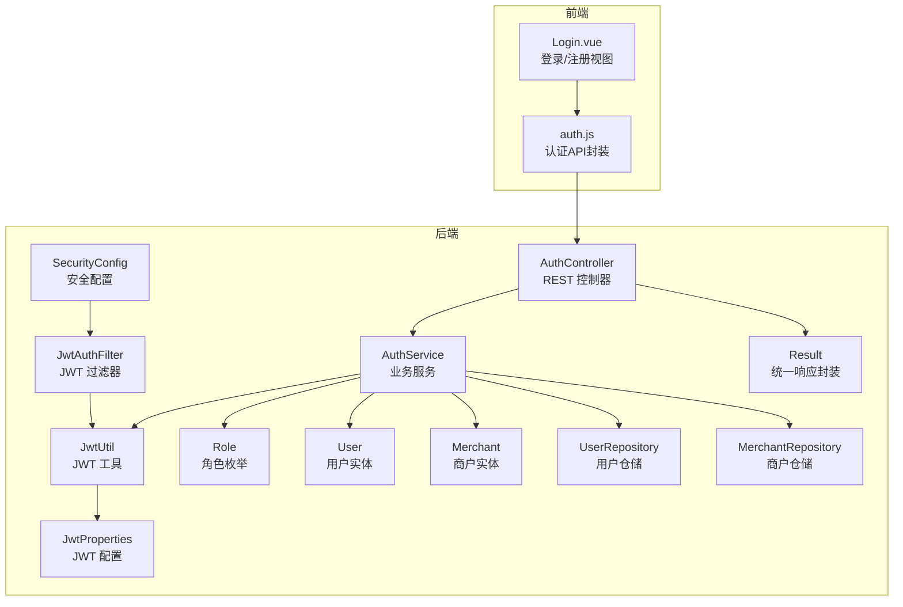
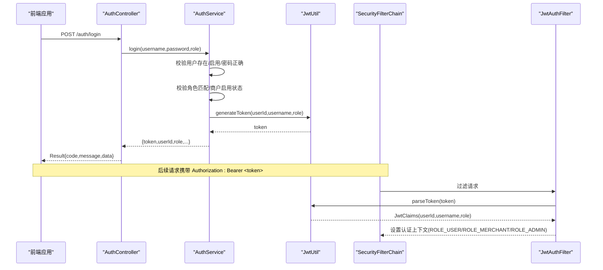
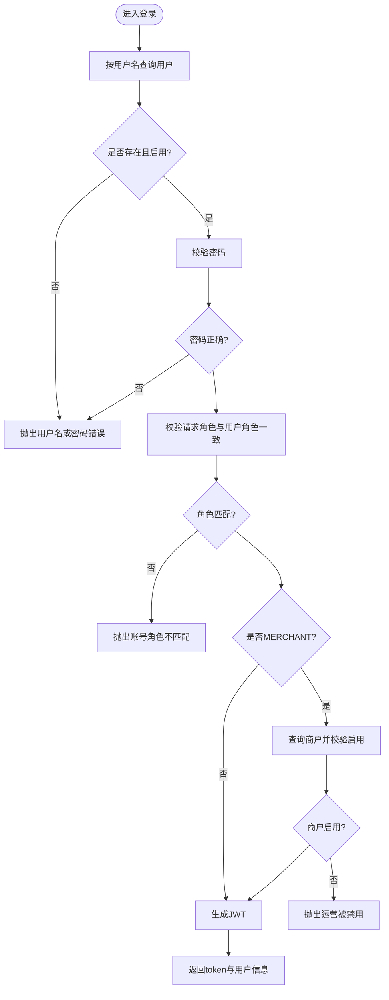
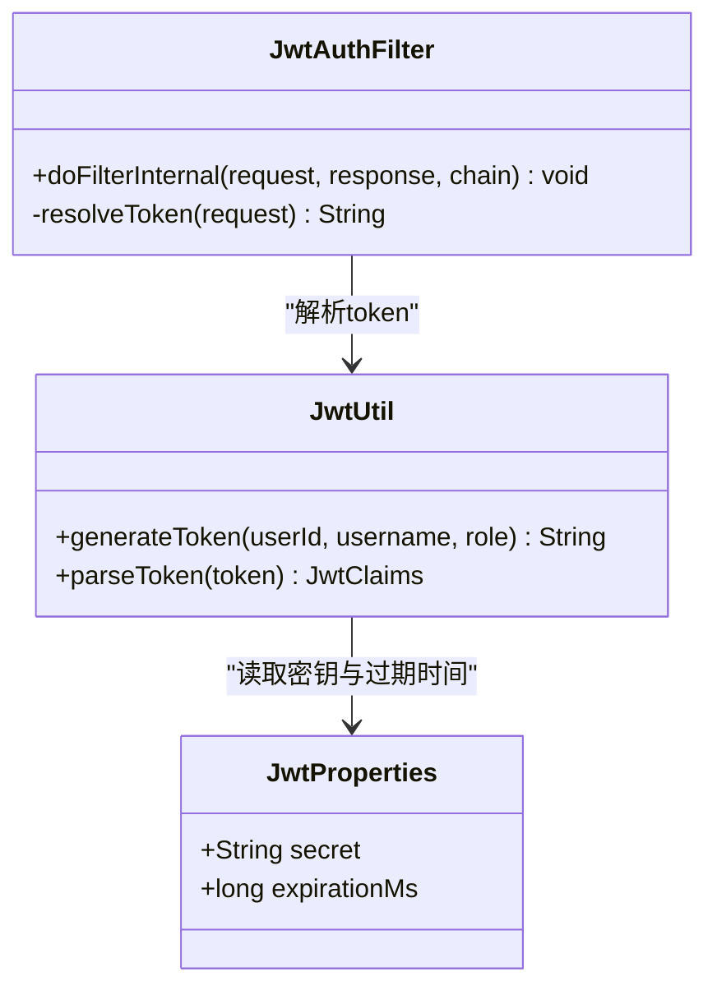
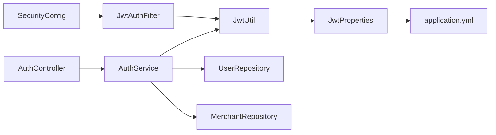

# 认证控制器

<cite>
**本文引用的文件**
- [AuthController.java](file://backend/src/main/java/com/mall/controller/AuthController.java)
- [AuthService.java](file://backend/src/main/java/com/mall/service/AuthService.java)
- [JwtUtil.java](file://backend/src/main/java/com/mall/security/JwtUtil.java)
- [JwtAuthFilter.java](file://backend/src/main/java/com/mall/security/JwtAuthFilter.java)
- [JwtProperties.java](file://backend/src/main/java/com/mall/config/JwtProperties.java)
- [SecurityConfig.java](file://backend/src/main/java/com/mall/config/SecurityConfig.java)
- [Result.java](file://backend/src/main/java/com/mall/dto/Result.java)
- [Role.java](file://backend/src/main/java/com/mall/common/Role.java)
- [User.java](file://backend/src/main/java/com/mall/entity/User.java)
- [Merchant.java](file://backend/src/main/java/com/mall/entity/Merchant.java)
- [UserRepository.java](file://backend/src/main/java/com/mall/repository/UserRepository.java)
- [MerchantRepository.java](file://backend/src/main/java/com/mall/repository/MerchantRepository.java)
- [application.yml](file://backend/src/main/resources/application.yml)
- [auth.js](file://frontend/src/api/auth.js)
- [Login.vue](file://frontend/src/views/Login.vue)
</cite>

## 目录
1. [简介](#简介)
2. [项目结构](#项目结构)
3. [核心组件](#核心组件)
4. [架构总览](#架构总览)
5. [详细组件分析](#详细组件分析)
6. [依赖分析](#依赖分析)
7. [性能考虑](#性能考虑)
8. [故障排查指南](#故障排查指南)
9. [结论](#结论)
10. [附录](#附录)

## 简介
本文件面向电商商城系统的认证控制器，系统性梳理用户登录与注册接口的设计与实现，覆盖RESTful API规范、请求参数校验、响应数据封装、JWT令牌生成与验证、多角色登录支持（ADMIN、MERCHANT、USER）、异常处理策略、安全验证规则及与AuthService的协作模式。文档同时提供前后端对接的接口说明与使用示例，帮助开发者快速实现安全可靠的用户认证体系。

## 项目结构
认证相关代码主要分布在后端的controller、service、security、config、dto、common、entity、repository等包中，并通过Spring Security进行全局安全控制；前端通过独立的API模块与后端交互。

图表来源
- [AuthController.java:1-73](file://backend/src/main/java/com/mall/controller/AuthController.java#L1-L73)
- [AuthService.java:1-92](file://backend/src/main/java/com/mall/service/AuthService.java#L1-L92)
- [JwtUtil.java:1-48](file://backend/src/main/java/com/mall/security/JwtUtil.java#L1-L48)
- [JwtProperties.java:1-18](file://backend/src/main/java/com/mall/config/JwtProperties.java#L1-L18)
- [SecurityConfig.java:1-74](file://backend/src/main/java/com/mall/config/SecurityConfig.java#L1-L74)
- [JwtAuthFilter.java:1-57](file://backend/src/main/java/com/mall/security/JwtAuthFilter.java#L1-L57)
- [Result.java:1-24](file://backend/src/main/java/com/mall/dto/Result.java#L1-L24)
- [Role.java:1-8](file://backend/src/main/java/com/mall/common/Role.java#L1-L8)
- [User.java:1-88](file://backend/src/main/java/com/mall/entity/User.java#L1-L88)
- [Merchant.java:1-56](file://backend/src/main/java/com/mall/entity/Merchant.java#L1-L56)
- [UserRepository.java:1-20](file://backend/src/main/java/com/mall/repository/UserRepository.java#L1-L20)
- [MerchantRepository.java:1-9](file://backend/src/main/java/com/mall/repository/MerchantRepository.java#L1-L9)
- [auth.js:1-26](file://frontend/src/api/auth.js#L1-L26)
- [Login.vue:1-1103](file://frontend/src/views/Login.vue#L1-L1103)

章节来源
- [AuthController.java:1-73](file://backend/src/main/java/com/mall/controller/AuthController.java#L1-L73)
- [SecurityConfig.java:1-74](file://backend/src/main/java/com/mall/config/SecurityConfig.java#L1-L74)
- [application.yml:1-36](file://backend/src/main/resources/application.yml#L1-L36)

## 核心组件
- 认证控制器（AuthController）：暴露登录/注册REST接口，负责接收请求体、参数校验、调用AuthService并统一封装响应。
- 认证服务（AuthService）：执行登录校验（用户名、密码、角色匹配、商户启用状态）、生成JWT、执行用户注册。
- 安全过滤器（JwtAuthFilter）：从HTTP头解析Bearer Token，解析JWT并注入Spring Security上下文。
- JWT工具（JwtUtil）：基于密钥生成与解析JWT，携带用户标识与角色声明。
- 安全配置（SecurityConfig）：定义无状态会话、放行/auth路径、按角色限制访问特定路径。
- 统一响应（Result）：统一返回码、消息与数据结构。
- 角色枚举（Role）：ADMIN、MERCHANT、USER三类角色。
- 实体与仓储：User、Merchant及其JPA仓储，用于查询用户与商户状态。

章节来源
- [AuthController.java:1-73](file://backend/src/main/java/com/mall/controller/AuthController.java#L1-L73)
- [AuthService.java:1-92](file://backend/src/main/java/com/mall/service/AuthService.java#L1-L92)
- [JwtUtil.java:1-48](file://backend/src/main/java/com/mall/security/JwtUtil.java#L1-L48)
- [JwtAuthFilter.java:1-57](file://backend/src/main/java/com/mall/security/JwtAuthFilter.java#L1-L57)
- [SecurityConfig.java:1-74](file://backend/src/main/java/com/mall/config/SecurityConfig.java#L1-L74)
- [Result.java:1-24](file://backend/src/main/java/com/mall/dto/Result.java#L1-L24)
- [Role.java:1-8](file://backend/src/main/java/com/mall/common/Role.java#L1-L8)
- [User.java:1-88](file://backend/src/main/java/com/mall/entity/User.java#L1-L88)
- [Merchant.java:1-56](file://backend/src/main/java/com/mall/entity/Merchant.java#L1-L56)
- [UserRepository.java:1-20](file://backend/src/main/java/com/mall/repository/UserRepository.java#L1-L20)
- [MerchantRepository.java:1-9](file://backend/src/main/java/com/mall/repository/MerchantRepository.java#L1-L9)

## 架构总览
认证流程由前端发起登录/注册请求，后端控制器接收并调用认证服务完成校验与业务处理，成功后返回JWT与用户信息；后续请求由安全过滤器解析JWT并注入认证上下文，配合安全配置实现基于角色的权限控制。

图表来源
- [AuthController.java:18-35](file://backend/src/main/java/com/mall/controller/AuthController.java#L18-L35)
- [AuthService.java:28-59](file://backend/src/main/java/com/mall/service/AuthService.java#L28-L59)
- [JwtUtil.java:23-44](file://backend/src/main/java/com/mall/security/JwtUtil.java#L23-L44)
- [SecurityConfig.java:34-54](file://backend/src/main/java/com/mall/config/SecurityConfig.java#L34-L54)
- [JwtAuthFilter.java:30-47](file://backend/src/main/java/com/mall/security/JwtAuthFilter.java#L30-L47)

## 详细组件分析

### 认证控制器（AuthController）
- 路径与方法
  - POST /auth/login：接收username、password、role，进行基础参数校验后调用AuthService.login并统一封装结果。
  - POST /auth/register：接收username、password、nickname、gender、email、phone、receiverName、receiverPhone、receiverAddress，进行必填项校验后调用AuthService.registerUser并统一封装结果。
- 参数校验
  - 登录：用户名/密码非空；角色非空且非空白；角色与用户实际角色一致。
  - 注册：用户名与密码非空；昵称非空；其余字段可为空。
- 异常处理
  - 捕获AuthService抛出的运行时异常，转换为统一失败响应。
- 响应封装
  - 使用Result封装code、message、data，成功返回200，失败返回400。

章节来源
- [AuthController.java:18-71](file://backend/src/main/java/com/mall/controller/AuthController.java#L18-L71)
- [Result.java:16-22](file://backend/src/main/java/com/mall/dto/Result.java#L16-L22)

### 认证服务（AuthService）
- 登录流程
  - 查询用户并检查启用状态；校验密码；校验请求角色与用户角色一致；若为MERCHANT，检查商户启用状态；生成JWT并返回token与用户信息。
- 注册流程
  - 校验用户名唯一；构建User实体（默认角色USER、启用状态true、密码加密）；保存至数据库。
- 关键依赖
  - UserRepository：按用户名查询、判断唯一、按角色/商户ID查询。
  - MerchantRepository：按ID查询商户启用状态。
  - PasswordEncoder：BCrypt密码编码器。
  - JwtUtil：生成JWT。

图表来源
- [AuthService.java:28-59](file://backend/src/main/java/com/mall/service/AuthService.java#L28-L59)
- [UserRepository.java:12-14](file://backend/src/main/java/com/mall/repository/UserRepository.java#L12-L14)
- [MerchantRepository.java:1-9](file://backend/src/main/java/com/mall/repository/MerchantRepository.java#L1-L9)

章节来源
- [AuthService.java:28-90](file://backend/src/main/java/com/mall/service/AuthService.java#L28-L90)
- [UserRepository.java:12-18](file://backend/src/main/java/com/mall/repository/UserRepository.java#L12-L18)
- [MerchantRepository.java:1-9](file://backend/src/main/java/com/mall/repository/MerchantRepository.java#L1-L9)

### JWT工具与过滤器（JwtUtil、JwtAuthFilter）
- JwtUtil
  - 基于配置的secret与过期时间生成JWT，claims包含userId、username、role；解析时校验签名并提取claims。
- JwtAuthFilter
  - 从Authorization头解析Bearer token；解析成功后构造UsernamePasswordAuthenticationToken并注入SecurityContext；异常则忽略继续处理。

图表来源
- [JwtUtil.java:23-44](file://backend/src/main/java/com/mall/security/JwtUtil.java#L23-L44)
- [JwtAuthFilter.java:30-47](file://backend/src/main/java/com/mall/security/JwtAuthFilter.java#L30-L47)
- [JwtProperties.java:15-16](file://backend/src/main/java/com/mall/config/JwtProperties.java#L15-L16)

章节来源
- [JwtUtil.java:23-44](file://backend/src/main/java/com/mall/security/JwtUtil.java#L23-L44)
- [JwtAuthFilter.java:30-47](file://backend/src/main/java/com/mall/security/JwtAuthFilter.java#L30-L47)
- [JwtProperties.java:15-16](file://backend/src/main/java/com/mall/config/JwtProperties.java#L15-L16)

### 安全配置（SecurityConfig）
- 无状态会话（STATELESS）
- 放行路径：/auth/**、图片公开访问路径
- 角色授权：/user/**要求USER；/merchant/**要求MERCHANT；/admin/**要求ADMIN
- 过滤器链：在UsernamePasswordAuthenticationFilter之前添加JwtAuthFilter

章节来源
- [SecurityConfig.java:34-54](file://backend/src/main/java/com/mall/config/SecurityConfig.java#L34-L54)

### 统一响应与角色枚举
- Result：统一返回结构（code、message、data），成功ok、失败fail工厂方法。
- Role：ADMIN、MERCHANT、USER三类角色。

章节来源
- [Result.java:16-22](file://backend/src/main/java/com/mall/dto/Result.java#L16-L22)
- [Role.java:3-7](file://backend/src/main/java/com/mall/common/Role.java#L3-L7)

### 数据模型与仓储
- User：包含用户名、密码（加密存储）、昵称、性别、邮箱、手机、头像、角色、商户ID、启用状态等字段。
- Merchant：包含名称、描述、Logo、联系方式、启用状态等字段。
- UserRepository/MerchantRepository：提供按用户名、角色、商户ID等查询能力。

章节来源
- [User.java:19-86](file://backend/src/main/java/com/mall/entity/User.java#L19-L86)
- [Merchant.java:17-54](file://backend/src/main/java/com/mall/entity/Merchant.java#L17-L54)
- [UserRepository.java:12-18](file://backend/src/main/java/com/mall/repository/UserRepository.java#L12-L18)
- [MerchantRepository.java:1-9](file://backend/src/main/java/com/mall/repository/MerchantRepository.java#L1-L9)

## 依赖分析
- 控制器依赖服务：AuthController依赖AuthService完成业务逻辑。
- 服务依赖工具与仓储：AuthService依赖JwtUtil生成token、UserRepository/MerchantRepository查询用户与商户。
- 安全层依赖：SecurityConfig装配JwtAuthFilter，JwtAuthFilter依赖JwtUtil。
- 配置依赖：JwtUtil依赖JwtProperties；JwtProperties由application.yml提供secret与过期时间。

图表来源
- [AuthController.java:16-16](file://backend/src/main/java/com/mall/controller/AuthController.java#L16-L16)
- [AuthService.java:22-25](file://backend/src/main/java/com/mall/service/AuthService.java#L22-L25)
- [JwtUtil.java:18-21](file://backend/src/main/java/com/mall/security/JwtUtil.java#L18-L21)
- [JwtAuthFilter.java:26-27](file://backend/src/main/java/com/mall/security/JwtAuthFilter.java#L26-L27)
- [SecurityConfig.java:29-31](file://backend/src/main/java/com/mall/config/SecurityConfig.java#L29-L31)
- [JwtProperties.java:18-18](file://backend/src/main/java/com/mall/config/JwtProperties.java#L18-L18)
- [application.yml:28-30](file://backend/src/main/resources/application.yml#L28-L30)

章节来源
- [AuthController.java:16-16](file://backend/src/main/java/com/mall/controller/AuthController.java#L16-L16)
- [AuthService.java:22-25](file://backend/src/main/java/com/mall/service/AuthService.java#L22-L25)
- [JwtUtil.java:18-21](file://backend/src/main/java/com/mall/security/JwtUtil.java#L18-L21)
- [JwtAuthFilter.java:26-27](file://backend/src/main/java/com/mall/security/JwtAuthFilter.java#L26-L27)
- [SecurityConfig.java:29-31](file://backend/src/main/java/com/mall/config/SecurityConfig.java#L29-L31)
- [JwtProperties.java:18-18](file://backend/src/main/java/com/mall/config/JwtProperties.java#L18-L18)
- [application.yml:28-30](file://backend/src/main/resources/application.yml#L28-L30)

## 性能考虑
- 密码校验采用BCrypt，安全性高但计算成本较高，建议在高并发场景下结合连接池与缓存策略优化用户查询。
- JWT解析为轻量操作，建议保持合理的过期时间以平衡安全与性能。
- 角色授权在过滤器中完成，避免重复鉴权逻辑，提升整体吞吐。

## 故障排查指南
- 登录失败
  - 现象：返回“用户名或密码错误”或“账号角色不匹配”或“运营已被禁用”。
  - 排查：确认用户名存在且启用；确认密码正确；确认选择的角色与用户角色一致；若为MERCHANT，确认商户处于启用状态。
- 注册失败
  - 现象：返回“用户名已存在”。
  - 排查：确保用户名唯一；检查必填字段（用户名、密码、昵称、手机号）是否填写完整。
- JWT无效
  - 现象：后续请求401或权限不足。
  - 排查：确认Authorization头格式为Bearer <token>；确认token未过期；确认secret与后端一致；检查SecurityConfig是否正确注入JwtAuthFilter。
- CORS问题
  - 现象：跨域请求被拒绝。
  - 排查：确认application.yml中CORS允许的源与方法配置正确。

章节来源
- [AuthService.java:30-46](file://backend/src/main/java/com/mall/service/AuthService.java#L30-L46)
- [AuthController.java:23-34](file://backend/src/main/java/com/mall/controller/AuthController.java#L23-L34)
- [JwtAuthFilter.java:30-47](file://backend/src/main/java/com/mall/security/JwtAuthFilter.java#L30-L47)
- [SecurityConfig.java:58-67](file://backend/src/main/java/com/mall/config/SecurityConfig.java#L58-L67)

## 结论
该认证控制器通过清晰的分层设计与严格的参数校验，实现了多角色登录与JWT鉴权的闭环。结合Spring Security的无状态配置与自定义过滤器，能够稳定支撑电商商城的用户认证需求。建议在生产环境中进一步完善日志审计、限流策略与密码复杂度规则，持续提升系统安全性与稳定性。

## 附录

### 接口文档

- 登录接口
  - 方法与路径：POST /auth/login
  - 请求体参数
    - username: string，必填
    - password: string，必填
    - role: enum，必填，取值范围：USER、MERCHANT、ADMIN
  - 成功响应
    - code: number，200
    - message: string，success
    - data.token: string，JWT令牌
    - data.userId: number，用户ID
    - data.username: string，用户名
    - data.role: string，角色
    - data.nickname: string，昵称
    - data.avatar: string，头像URL
    - data.gender: string，性别
    - data.merchantId: number，商户ID（MERCHANT角色时有效）
  - 失败响应
    - code: number，400
    - message: string，错误原因
    - data: null

- 注册接口
  - 方法与路径：POST /auth/register
  - 请求体参数
    - username: string，必填
    - password: string，必填
    - nickname: string，必填
    - gender: string，可选
    - email: string，可选
    - phone: string，可选
    - receiverName: string，可选
    - receiverPhone: string，可选
    - receiverAddress: string，可选
  - 成功响应
    - code: number，200
    - message: string，success
    - data.message: string，注册成功
  - 失败响应
    - code: number，400
    - message: string，错误原因
    - data: null

- 前端调用示例
  - 登录
    - 调用位置：[auth.js:14-16](file://frontend/src/api/auth.js#L14-L16)
    - 前端页面：[Login.vue:470-530](file://frontend/src/views/Login.vue#L470-L530)
  - 注册
    - 调用位置：[auth.js:23-25](file://frontend/src/api/auth.js#L23-L25)
    - 前端页面：[Login.vue:541-566](file://frontend/src/views/Login.vue#L541-L566)

章节来源
- [AuthController.java:18-71](file://backend/src/main/java/com/mall/controller/AuthController.java#L18-L71)
- [auth.js:14-25](file://frontend/src/api/auth.js#L14-L25)
- [Login.vue:470-566](file://frontend/src/views/Login.vue#L470-L566)