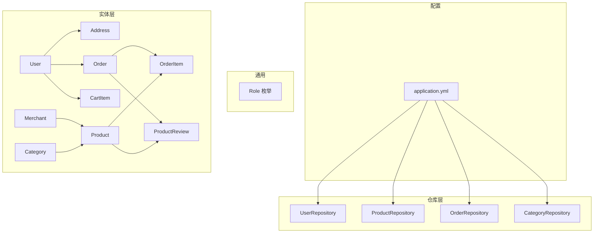
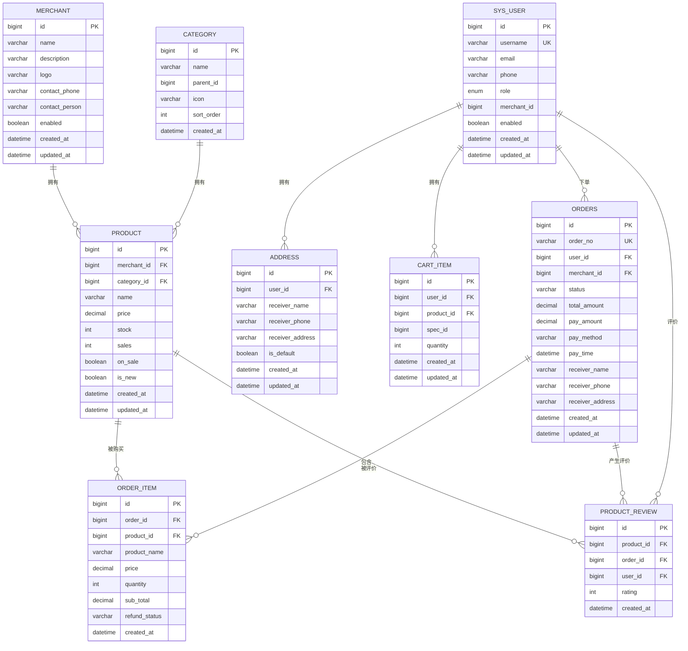
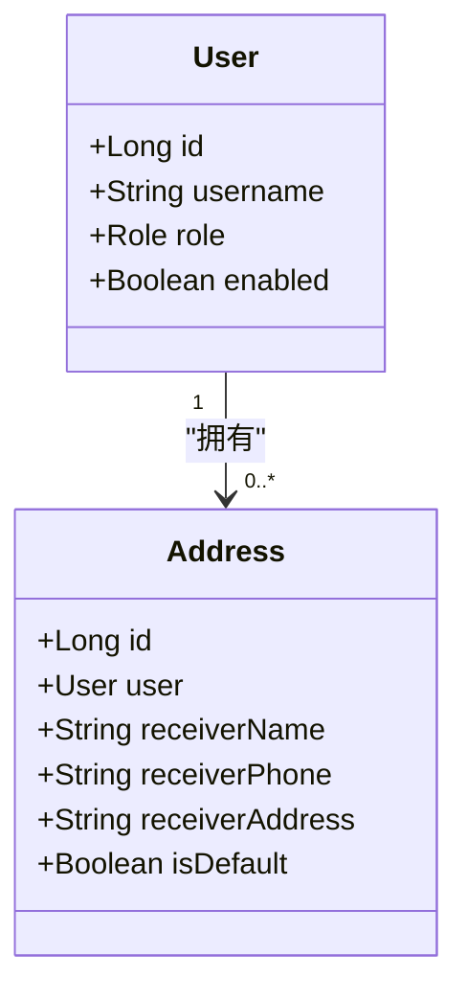
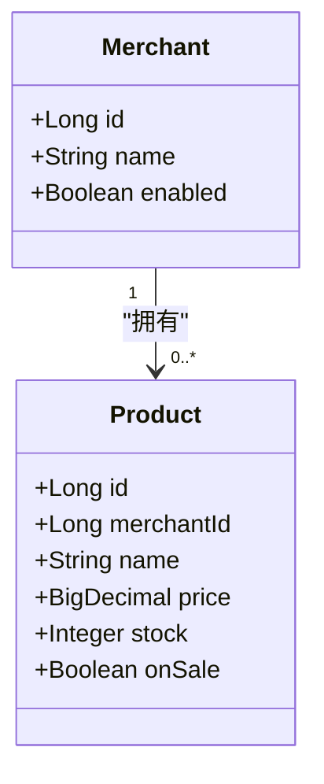
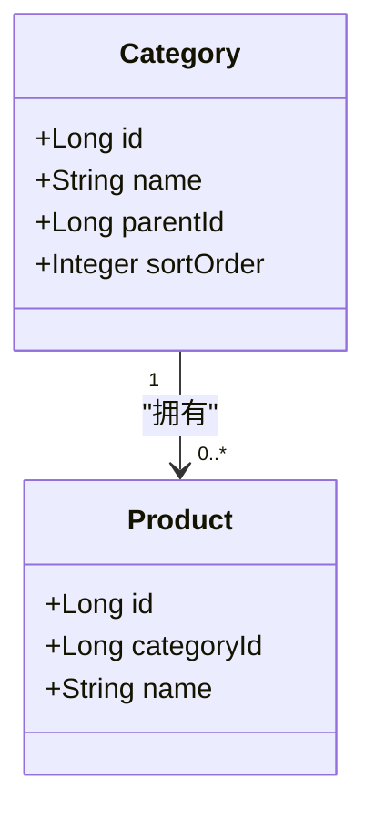
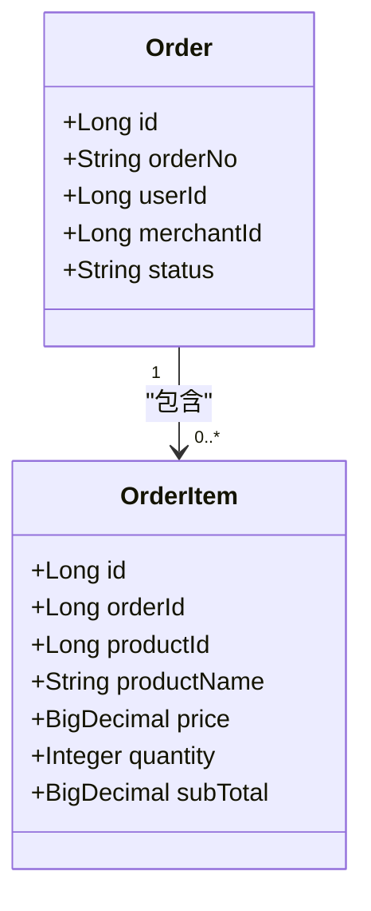
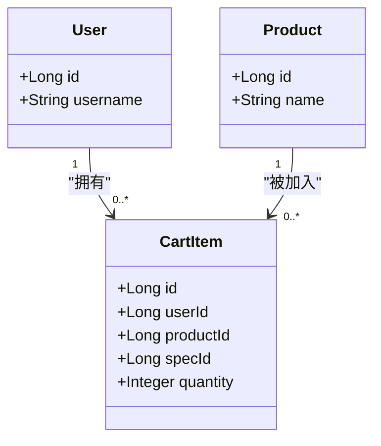
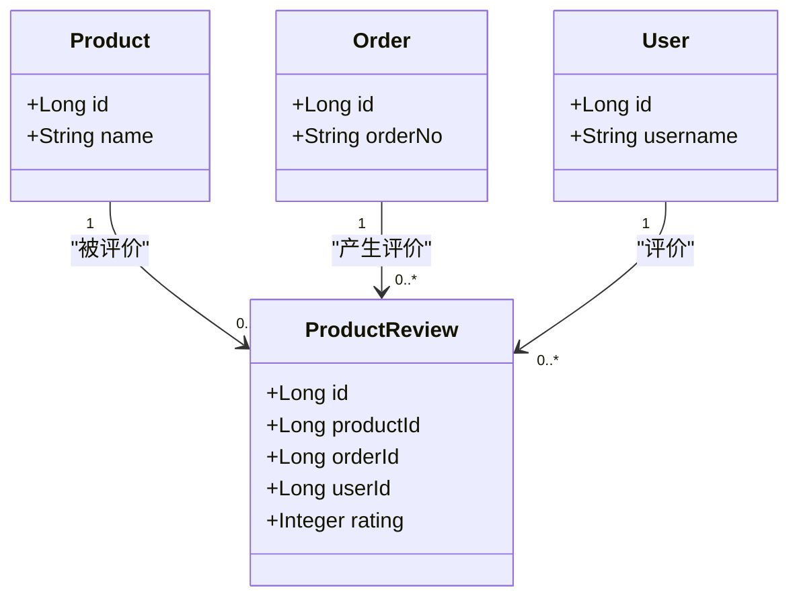
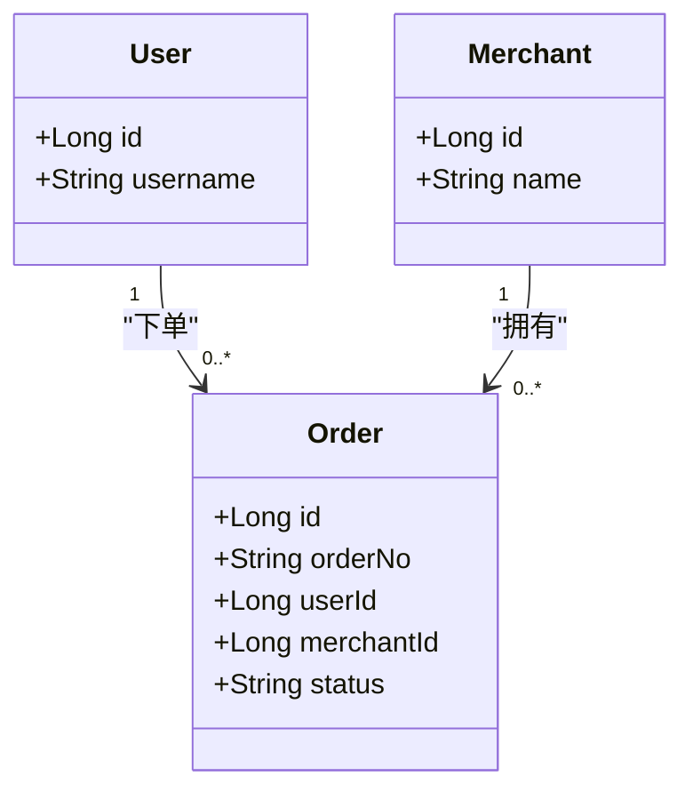
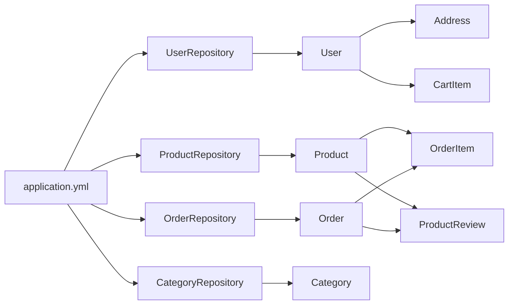

# 实体关系与约束

<cite>
**本文引用的文件**
- [application.yml](file://backend/src/main/resources/application.yml)
- [Role.java](file://backend/src/main/java/com/mall/common/Role.java)
- [User.java](file://backend/src/main/java/com/mall/entity/User.java)
- [Address.java](file://backend/src/main/java/com/mall/entity/Address.java)
- [Merchant.java](file://backend/src/main/java/com/mall/entity/Merchant.java)
- [Category.java](file://backend/src/main/java/com/mall/entity/Category.java)
- [Product.java](file://backend/src/main/java/com/mall/entity/Product.java)
- [Order.java](file://backend/src/main/java/com/mall/entity/Order.java)
- [OrderItem.java](file://backend/src/main/java/com/mall/entity/OrderItem.java)
- [CartItem.java](file://backend/src/main/java/com/mall/entity/CartItem.java)
- [ProductReview.java](file://backend/src/main/java/com/mall/entity/ProductReview.java)
- [UserRepository.java](file://backend/src/main/java/com/mall/repository/UserRepository.java)
- [ProductRepository.java](file://backend/src/main/java/com/mall/repository/ProductRepository.java)
- [OrderRepository.java](file://backend/src/main/java/com/mall/repository/OrderRepository.java)
- [CategoryRepository.java](file://backend/src/main/java/com/mall/repository/CategoryRepository.java)
</cite>

## 目录
1. [简介](#简介)
2. [项目结构](#项目结构)
3. [核心组件](#核心组件)
4. [架构总览](#架构总览)
5. [详细组件分析](#详细组件分析)
6. [依赖分析](#依赖分析)
7. [性能考虑](#性能考虑)
8. [故障排查指南](#故障排查指南)
9. [结论](#结论)
10. [附录](#附录)

## 简介
本文件面向电商商城系统的数据库实体关系与约束，系统性梳理实体间的一对一、一对多、多对多关系，明确外键约束、级联策略、引用完整性保障机制，并结合实际代码中的注解与仓库查询定义，给出索引策略建议与一致性约束实现方式。文档同时提供可直接映射到源码的ER图与实体关系图，帮助开发者快速理解整体架构。

## 项目结构
后端采用Spring Boot + JPA/Hibernate，实体类位于entity包，仓库接口位于repository包，JPA配置在application.yml中。下图展示与本主题密切相关的模块与文件：

图表来源
- [application.yml:1-36](file://backend/src/main/resources/application.yml#L1-L36)
- [Role.java:1-8](file://backend/src/main/java/com/mall/common/Role.java#L1-L8)
- [User.java:1-88](file://backend/src/main/java/com/mall/entity/User.java#L1-L88)
- [Address.java:1-60](file://backend/src/main/java/com/mall/entity/Address.java#L1-L60)
- [Merchant.java:1-56](file://backend/src/main/java/com/mall/entity/Merchant.java#L1-L56)
- [Category.java:1-41](file://backend/src/main/java/com/mall/entity/Category.java#L1-L41)
- [Product.java:1-101](file://backend/src/main/java/com/mall/entity/Product.java#L1-L101)
- [Order.java:1-83](file://backend/src/main/java/com/mall/entity/Order.java#L1-L83)
- [OrderItem.java:1-73](file://backend/src/main/java/com/mall/entity/OrderItem.java#L1-L73)
- [CartItem.java:1-50](file://backend/src/main/java/com/mall/entity/CartItem.java#L1-L50)
- [ProductReview.java:1-44](file://backend/src/main/java/com/mall/entity/ProductReview.java#L1-L44)
- [UserRepository.java:1-20](file://backend/src/main/java/com/mall/repository/UserRepository.java#L1-L20)
- [ProductRepository.java:1-125](file://backend/src/main/java/com/mall/repository/ProductRepository.java#L1-L125)
- [OrderRepository.java:1-28](file://backend/src/main/java/com/mall/repository/OrderRepository.java#L1-L28)
- [CategoryRepository.java:1-17](file://backend/src/main/java/com/mall/repository/CategoryRepository.java#L1-L17)

章节来源
- [application.yml:1-36](file://backend/src/main/resources/application.yml#L1-L36)
- [User.java:1-88](file://backend/src/main/java/com/mall/entity/User.java#L1-L88)
- [Product.java:1-101](file://backend/src/main/java/com/mall/entity/Product.java#L1-L101)
- [Order.java:1-83](file://backend/src/main/java/com/mall/entity/Order.java#L1-L83)
- [Category.java:1-41](file://backend/src/main/java/com/mall/entity/Category.java#L1-L41)
- [Merchant.java:1-56](file://backend/src/main/java/com/mall/entity/Merchant.java#L1-L56)
- [Address.java:1-60](file://backend/src/main/java/com/mall/entity/Address.java#L1-L60)
- [OrderItem.java:1-73](file://backend/src/main/java/com/mall/entity/OrderItem.java#L1-L73)
- [CartItem.java:1-50](file://backend/src/main/java/com/mall/entity/CartItem.java#L1-L50)
- [ProductReview.java:1-44](file://backend/src/main/java/com/mall/entity/ProductReview.java#L1-L44)
- [UserRepository.java:1-20](file://backend/src/main/java/com/mall/repository/UserRepository.java#L1-L20)
- [ProductRepository.java:1-125](file://backend/src/main/java/com/mall/repository/ProductRepository.java#L1-L125)
- [OrderRepository.java:1-28](file://backend/src/main/java/com/mall/repository/OrderRepository.java#L1-L28)
- [CategoryRepository.java:1-17](file://backend/src/main/java/com/mall/repository/CategoryRepository.java#L1-L17)

## 核心组件
- 实体与表映射
  - 用户与地址：用户与地址为典型的一对多关系，地址通过外键引用用户。
  - 商户与商品：商户与商品为典型的一对多关系，商品通过外键引用商户。
  - 分类与商品：分类与商品为典型的一对多关系，商品通过外键引用分类。
  - 订单与订单项：订单与订单项为典型的一对多关系，订单项通过外键引用订单。
  - 用户与购物车：用户与购物车为典型的一对多关系，购物车通过外键引用用户。
  - 商品与购物车：商品与购物车为典型的一对多关系，购物车通过外键引用商品。
  - 商品与评价：商品与评价为典型的一对多关系，评价通过外键引用商品。
  - 订单与评价：订单与评价为典型的一对多关系，评价通过外键引用订单。
  - 用户与评价：用户与评价为典型的一对多关系，评价通过外键引用用户。
- 外键与级联
  - 地址、订单项、购物车、评价等实体均使用外键约束；未见显式声明级联删除或更新策略，通常遵循数据库默认行为。
- 唯一性与索引
  - 用户名唯一、订单编号唯一、购物车组合唯一约束（用户+商品+规格）。
  - 查询接口覆盖了大量按字段过滤与排序的场景，建议在高频查询列上建立索引以提升性能。
- 引用完整性
  - 通过外键约束与非空约束保证引用完整性；枚举类型用于状态字段，减少非法值风险。

章节来源
- [User.java:73-75](file://backend/src/main/java/com/mall/entity/User.java#L73-L75)
- [Address.java:15-17](file://backend/src/main/java/com/mall/entity/Address.java#L15-L17)
- [Product.java:22-26](file://backend/src/main/java/com/mall/entity/Product.java#L22-L26)
- [Category.java:24-25](file://backend/src/main/java/com/mall/entity/Category.java#L24-L25)
- [OrderItem.java:22-26](file://backend/src/main/java/com/mall/entity/OrderItem.java#L22-L26)
- [Order.java:25-29](file://backend/src/main/java/com/mall/entity/Order.java#L25-L29)
- [CartItem.java:9-28](file://backend/src/main/java/com/mall/entity/CartItem.java#L9-L28)
- [ProductReview.java:21-28](file://backend/src/main/java/com/mall/entity/ProductReview.java#L21-L28)
- [UserRepository.java:12-18](file://backend/src/main/java/com/mall/repository/UserRepository.java#L12-L18)
- [ProductRepository.java:15-124](file://backend/src/main/java/com/mall/repository/ProductRepository.java#L15-L124)
- [OrderRepository.java:15-26](file://backend/src/main/java/com/mall/repository/OrderRepository.java#L15-L26)
- [CategoryRepository.java:11-15](file://backend/src/main/java/com/mall/repository/CategoryRepository.java#L11-L15)

## 架构总览
下图展示与本主题相关的实体关系与约束，映射到具体实体类与仓库接口：

图表来源
- [User.java:19-86](file://backend/src/main/java/com/mall/entity/User.java#L19-L86)
- [Address.java:11-58](file://backend/src/main/java/com/mall/entity/Address.java#L11-L58)
- [Merchant.java:17-49](file://backend/src/main/java/com/mall/entity/Merchant.java#L17-L49)
- [Category.java:17-39](file://backend/src/main/java/com/mall/entity/Category.java#L17-L39)
- [Product.java:18-99](file://backend/src/main/java/com/mall/entity/Product.java#L18-L99)
- [Order.java:18-81](file://backend/src/main/java/com/mall/entity/Order.java#L18-L81)
- [OrderItem.java:18-71](file://backend/src/main/java/com/mall/entity/OrderItem.java#L18-L71)
- [CartItem.java:17-48](file://backend/src/main/java/com/mall/entity/CartItem.java#L17-L48)
- [ProductReview.java:17-42](file://backend/src/main/java/com/mall/entity/ProductReview.java#L17-L42)

## 详细组件分析

### 用户与地址（一对一/一对多）
- 关系：用户与地址为典型的一对多关系，一个用户可拥有多个收货地址，默认地址由字段控制。
- 外键与约束：地址实体通过外键引用用户；地址字段存在非空约束与默认值。
- 级联策略：未在实体中声明级联删除或更新策略，通常遵循数据库默认行为。
- 索引建议：按用户维度查询地址时，可在用户ID上建立索引；默认地址查询可考虑在默认字段上建立索引。

图表来源
- [User.java:19-86](file://backend/src/main/java/com/mall/entity/User.java#L19-L86)
- [Address.java:15-17](file://backend/src/main/java/com/mall/entity/Address.java#L15-L17)

章节来源
- [User.java:73-75](file://backend/src/main/java/com/mall/entity/User.java#L73-L75)
- [Address.java:15-17](file://backend/src/main/java/com/mall/entity/Address.java#L15-L17)

### 商户与商品（一对多）
- 关系：商户与商品为典型的一对多关系，商品属于某个商户。
- 外键与约束：商品实体通过外键引用商户；商品字段存在非空约束与默认值。
- 级联策略：未在实体中声明级联删除或更新策略。
- 索引建议：按商户维度查询商品时，可在商户ID上建立索引；上架状态与销量排序查询可考虑在上架与销量字段上建立复合索引。

图表来源
- [Merchant.java:17-49](file://backend/src/main/java/com/mall/entity/Merchant.java#L17-L49)
- [Product.java:22-26](file://backend/src/main/java/com/mall/entity/Product.java#L22-L26)

章节来源
- [Product.java:22-26](file://backend/src/main/java/com/mall/entity/Product.java#L22-L26)

### 分类与商品（一对多）
- 关系：分类与商品为典型的一对多关系，商品属于某个分类。
- 外键与约束：商品实体通过外键引用分类；分类字段存在非空约束与默认值。
- 级联策略：未在实体中声明级联删除或更新策略。
- 索引建议：按分类维度查询商品时，可在分类ID上建立索引；树形分类查询可考虑在父分类ID与排序字段上建立复合索引。

图表来源
- [Category.java:24-25](file://backend/src/main/java/com/mall/entity/Category.java#L24-L25)
- [Product.java:25-26](file://backend/src/main/java/com/mall/entity/Product.java#L25-L26)

章节来源
- [Category.java:24-25](file://backend/src/main/java/com/mall/entity/Category.java#L24-L25)
- [Product.java:25-26](file://backend/src/main/java/com/mall/entity/Product.java#L25-L26)

### 订单与订单项（一对多）
- 关系：订单与订单项为典型的一对多关系，订单包含多个订单项。
- 外键与约束：订单项实体通过外键引用订单与商品；订单项字段存在非空约束与默认值。
- 级联策略：未在实体中声明级联删除或更新策略。
- 索引建议：按订单维度查询订单项时，可在订单ID上建立索引；按商品维度统计时，可在商品ID上建立索引。

图表来源
- [Order.java:25-29](file://backend/src/main/java/com/mall/entity/Order.java#L25-L29)
- [OrderItem.java:22-26](file://backend/src/main/java/com/mall/entity/OrderItem.java#L22-L26)

章节来源
- [Order.java:25-29](file://backend/src/main/java/com/mall/entity/Order.java#L25-L29)
- [OrderItem.java:22-26](file://backend/src/main/java/com/mall/entity/OrderItem.java#L22-L26)

### 购物车（一对多）
- 关系：用户与购物车为典型的一对多关系；商品与购物车为典型的一对多关系。
- 外键与约束：购物车实体通过外键引用用户与商品；购物车存在组合唯一约束（用户+商品+规格），避免重复添加相同规格的商品。
- 级联策略：未在实体中声明级联删除或更新策略。
- 索引建议：按用户维度查询购物车时，可在用户ID上建立索引；按商品维度查询时，可在商品ID上建立索引；组合唯一索引已覆盖用户+商品+规格。

图表来源
- [User.java:19-21](file://backend/src/main/java/com/mall/entity/User.java#L19-L21)
- [Product.java:18-20](file://backend/src/main/java/com/mall/entity/Product.java#L18-L20)
- [CartItem.java:9-28](file://backend/src/main/java/com/mall/entity/CartItem.java#L9-L28)

章节来源
- [CartItem.java:9-28](file://backend/src/main/java/com/mall/entity/CartItem.java#L9-L28)

### 商品与评价（一对多）
- 关系：商品与评价为典型的一对多关系；订单与评价为典型的一对多关系；用户与评价为典型的一对多关系。
- 外键与约束：评价实体通过外键引用商品、订单与用户；评价字段存在非空约束与默认值。
- 级联策略：未在实体中声明级联删除或更新策略。
- 索引建议：按商品维度查询评价时，可在商品ID上建立索引；按用户维度查询评价时，可在用户ID上建立索引；按订单维度查询评价时，可在订单ID上建立索引。

图表来源
- [Product.java:18-20](file://backend/src/main/java/com/mall/entity/Product.java#L18-L20)
- [Order.java:18-21](file://backend/src/main/java/com/mall/entity/Order.java#L18-L21)
- [User.java:19-21](file://backend/src/main/java/com/mall/entity/User.java#L19-L21)
- [ProductReview.java:21-28](file://backend/src/main/java/com/mall/entity/ProductReview.java#L21-L28)

章节来源
- [ProductReview.java:21-28](file://backend/src/main/java/com/mall/entity/ProductReview.java#L21-L28)

### 订单与用户（一对多）
- 关系：用户与订单为典型的一对多关系；商户与订单为典型的一对多关系。
- 外键与约束：订单实体通过外键引用用户与商户；订单字段存在非空约束与默认值。
- 级联策略：未在实体中声明级联删除或更新策略。
- 索引建议：按用户维度查询订单时，可在用户ID上建立索引；按商户维度查询订单时，可在商户ID上建立索引；按订单号查询时，可在订单号上建立唯一索引。

图表来源
- [User.java:19-21](file://backend/src/main/java/com/mall/entity/User.java#L19-L21)
- [Merchant.java:17-19](file://backend/src/main/java/com/mall/entity/Merchant.java#L17-L19)
- [Order.java:22-29](file://backend/src/main/java/com/mall/entity/Order.java#L22-L29)

章节来源
- [Order.java:22-29](file://backend/src/main/java/com/mall/entity/Order.java#L22-L29)

## 依赖分析
- 配置依赖：JPA配置决定DDL策略与方言；应用启动时根据实体生成或更新表结构。
- 仓库依赖：各仓库接口继承JPA基础接口，提供按条件查询与分页能力；部分查询使用原生或JPQL，体现复杂筛选逻辑。
- 实体依赖：实体间通过外键关联，形成稳定的层次化模型；枚举类型统一状态值域，降低业务错误概率。

图表来源
- [application.yml:9-16](file://backend/src/main/resources/application.yml#L9-L16)
- [UserRepository.java:10](file://backend/src/main/java/com/mall/repository/UserRepository.java#L10)
- [ProductRepository.java:13](file://backend/src/main/java/com/mall/repository/ProductRepository.java#L13)
- [OrderRepository.java:13](file://backend/src/main/java/com/mall/repository/OrderRepository.java#L13)
- [CategoryRepository.java:9](file://backend/src/main/java/com/mall/repository/CategoryRepository.java#L9)

章节来源
- [application.yml:9-16](file://backend/src/main/resources/application.yml#L9-L16)
- [UserRepository.java:10-18](file://backend/src/main/java/com/mall/repository/UserRepository.java#L10-L18)
- [ProductRepository.java:13-124](file://backend/src/main/java/com/mall/repository/ProductRepository.java#L13-L124)
- [OrderRepository.java:13-27](file://backend/src/main/java/com/mall/repository/OrderRepository.java#L13-L27)
- [CategoryRepository.java:9-16](file://backend/src/main/java/com/mall/repository/CategoryRepository.java#L9-L16)

## 性能考虑
- 索引策略
  - 主键索引：所有实体的主键均为自增ID，天然具备主键索引。
  - 唯一索引：用户名、订单号具备唯一约束；购物车具备组合唯一约束（用户+商品+规格）。
  - 复合索引：建议在以下组合上建立复合索引以提升查询性能：
    - 用户维度：用户ID（地址、购物车、订单、评价）
    - 商户维度：商户ID（商品、订单）
    - 商品维度：商品ID（订单项、购物车、评价）
    - 分类维度：分类ID（商品）
    - 订单维度：订单号（订单）
    - 状态维度：状态（订单）、上架状态（商品）、销量（商品）
- 查询优化
  - 使用仓库接口提供的按条件查询方法，避免全表扫描。
  - 对高频查询字段（如用户名、订单号、商品名称、分类ID、商户ID、状态）建立索引。
- DDL策略
  - 当前配置为自动更新DDL，开发阶段便利但生产环境建议改为严格模式，确保结构变更受控。

章节来源
- [application.yml:11](file://backend/src/main/resources/application.yml#L11)
- [UserRepository.java:12-18](file://backend/src/main/java/com/mall/repository/UserRepository.java#L12-L18)
- [ProductRepository.java:15-124](file://backend/src/main/java/com/mall/repository/ProductRepository.java#L15-L124)
- [OrderRepository.java:15-26](file://backend/src/main/java/com/mall/repository/OrderRepository.java#L15-L26)
- [CategoryRepository.java:11-15](file://backend/src/main/java/com/mall/repository/CategoryRepository.java#L11-L15)

## 故障排查指南
- 外键约束冲突
  - 现象：插入或更新时提示违反外键约束。
  - 排查：确认被引用实体是否存在且状态有效（如商户启用、用户存在）。
  - 参考：实体外键字段与仓库查询中对关联实体状态的限制。
- 唯一约束冲突
  - 现象：用户名重复、订单号重复、购物车重复项。
  - 排查：检查唯一约束字段是否重复；购物车重复项需合并数量而非新增。
  - 参考：用户名唯一、订单号唯一、购物车组合唯一约束。
- 级联行为不明确
  - 现象：删除用户或商户后，相关数据未同步清理。
  - 排查：当前实体未声明级联策略，删除操作不会自动级联；如需级联，请在实体中显式配置。
- 查询性能问题
  - 现象：按用户/商户/商品维度查询慢。
  - 排查：确认相关字段是否建立索引；优化查询条件与分页参数。
- 状态一致性问题
  - 现象：订单状态流转异常或评价状态不一致。
  - 排查：检查状态字段是否使用枚举或限定值域；业务流程中避免跳过中间状态。

章节来源
- [User.java:23-28](file://backend/src/main/java/com/mall/entity/User.java#L23-L28)
- [Order.java:22-29](file://backend/src/main/java/com/mall/entity/Order.java#L22-L29)
- [CartItem.java:9](file://backend/src/main/java/com/mall/entity/CartItem.java#L9)
- [ProductRepository.java:34-91](file://backend/src/main/java/com/mall/repository/ProductRepository.java#L34-L91)
- [OrderRepository.java:25-26](file://backend/src/main/java/com/mall/repository/OrderRepository.java#L25-L26)

## 结论
本系统通过清晰的实体关系与外键约束，构建了稳定的一对多与一对一模型；用户名、订单号与购物车组合唯一约束确保了关键业务字段的唯一性；仓库接口提供了丰富的按条件查询能力。建议在高频查询字段上补充复合索引，并在生产环境调整DDL策略以增强结构稳定性。通过上述约束与索引策略，系统能够有效保障数据一致性与查询性能。

## 附录
- 数据库配置要点
  - 方言与DDL策略：MySQL方言与自动更新DDL。
  - 日志与格式化：SQL日志与格式化输出便于调试。
- 角色枚举
  - 角色类型：管理员、运营、用户，用于区分用户权限与业务归属。

章节来源
- [application.yml:5-16](file://backend/src/main/resources/application.yml#L5-L16)
- [Role.java:3-7](file://backend/src/main/java/com/mall/common/Role.java#L3-L7)