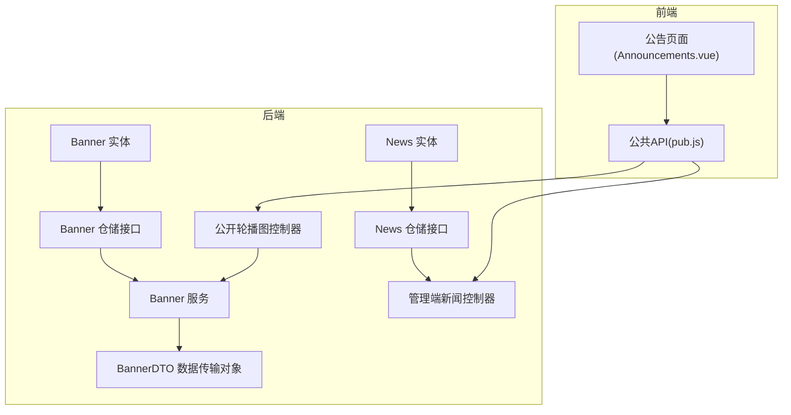
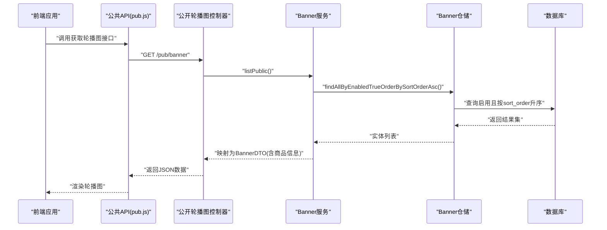
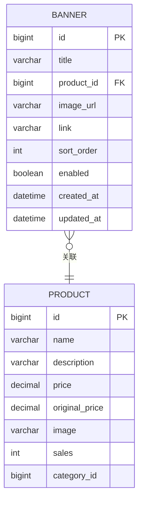
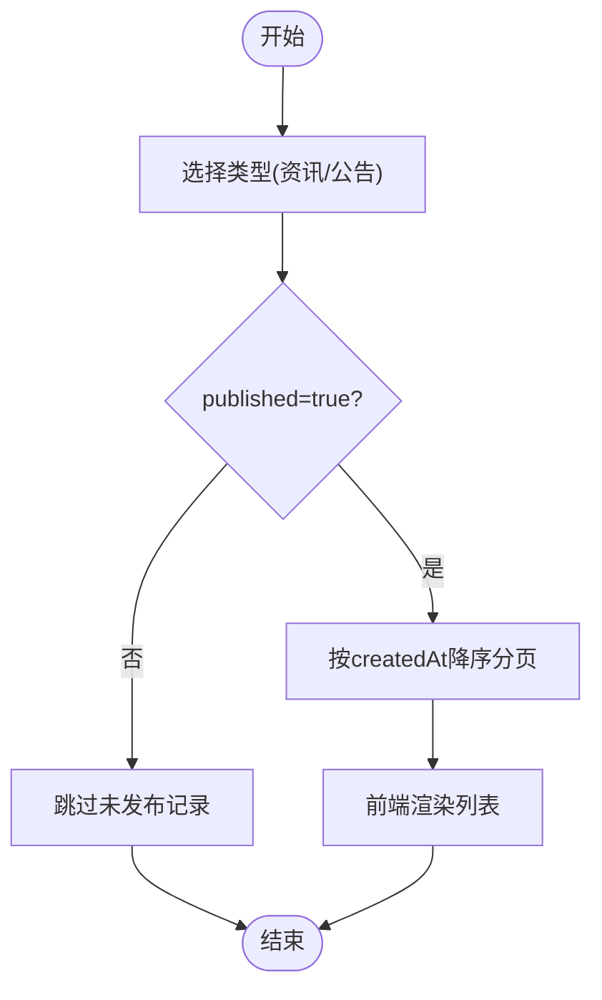
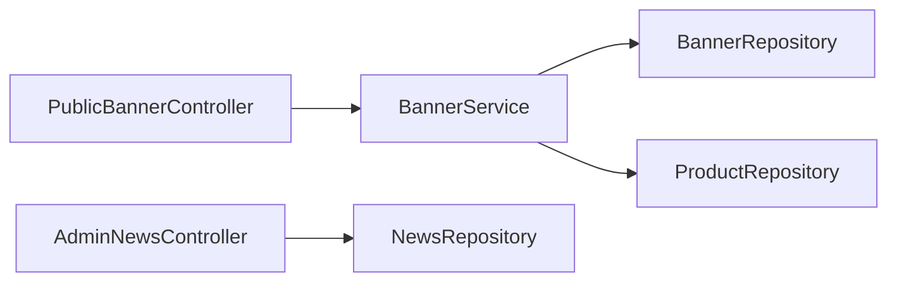

# 内容管理实体

<cite>
**本文引用的文件**
- [Banner.java](file://backend/src/main/java/com/mall/entity/Banner.java)
- [News.java](file://backend/src/main/java/com/mall/entity/News.java)
- [BannerDTO.java](file://backend/src/main/java/com/mall/dto/BannerDTO.java)
- [BannerService.java](file://backend/src/main/java/com/mall/service/BannerService.java)
- [BannerRepository.java](file://backend/src/main/java/com/mall/repository/BannerRepository.java)
- [PublicBannerController.java](file://backend/src/main/java/com/mall/controller/pub/PublicBannerController.java)
- [AdminNewsController.java](file://backend/src/main/java/com/mall/controller/admin/AdminNewsController.java)
- [NewsRepository.java](file://backend/src/main/java/com/mall/repository/NewsRepository.java)
- [banner.sql](file://backend/src/main/resources/banner.sql)
- [pub.js](file://frontend/src/api/pub.js)
- [Announcements.vue](file://frontend/src/views/user/Announcements.vue)
- [Product.java](file://backend/src/main/java/com/mall/entity/Product.java)
</cite>

## 目录
1. [简介](#简介)
2. [项目结构](#项目结构)
3. [核心组件](#核心组件)
4. [架构总览](#架构总览)
5. [详细组件分析](#详细组件分析)
6. [依赖分析](#依赖分析)
7. [性能考虑](#性能考虑)
8. [故障排除指南](#故障排除指南)
9. [结论](#结论)
10. [附录](#附录)

## 简介
本文件聚焦于系统中的内容管理实体：Banner轮播图实体与News新闻实体。通过对实体字段定义、业务处理流程、前后端交互以及数据库结构的深入分析，帮助读者理解轮播图的展示逻辑、新闻的发布时间管理策略，并给出内容实体在SEO优化与移动端适配方面的设计建议，以及后台管理与前台展示字段分离的设计思路。

## 项目结构
后端采用Spring Boot + JPA分层架构，内容管理相关模块位于entity、dto、repository、service、controller包中；前端通过API模块统一调用公共接口，实现轮播图与新闻的展示。

图表来源
- [Banner.java:1-60](file://backend/src/main/java/com/mall/entity/Banner.java#L1-L60)
- [News.java:1-52](file://backend/src/main/java/com/mall/entity/News.java#L1-L52)
- [BannerDTO.java:1-33](file://backend/src/main/java/com/mall/dto/BannerDTO.java#L1-L33)
- [BannerRepository.java:1-10](file://backend/src/main/java/com/mall/repository/BannerRepository.java#L1-L10)
- [NewsRepository.java:1-19](file://backend/src/main/java/com/mall/repository/NewsRepository.java#L1-L19)
- [BannerService.java:1-85](file://backend/src/main/java/com/mall/service/BannerService.java#L1-L85)
- [PublicBannerController.java:1-23](file://backend/src/main/java/com/mall/controller/pub/PublicBannerController.java#L1-L23)
- [AdminNewsController.java:1-48](file://backend/src/main/java/com/mall/controller/admin/AdminNewsController.java#L1-L48)
- [pub.js:1-74](file://frontend/src/api/pub.js#L1-L74)
- [Announcements.vue:1-36](file://frontend/src/views/user/Announcements.vue#L1-L36)

章节来源
- [Banner.java:1-60](file://backend/src/main/java/com/mall/entity/Banner.java#L1-L60)
- [News.java:1-52](file://backend/src/main/java/com/mall/entity/News.java#L1-L52)
- [BannerDTO.java:1-33](file://backend/src/main/java/com/mall/dto/BannerDTO.java#L1-L33)
- [BannerRepository.java:1-10](file://backend/src/main/java/com/mall/repository/BannerRepository.java#L1-L10)
- [NewsRepository.java:1-19](file://backend/src/main/java/com/mall/repository/NewsRepository.java#L1-L19)
- [BannerService.java:1-85](file://backend/src/main/java/com/mall/service/BannerService.java#L1-L85)
- [PublicBannerController.java:1-23](file://backend/src/main/java/com/mall/controller/pub/PublicBannerController.java#L1-L23)
- [AdminNewsController.java:1-48](file://backend/src/main/java/com/mall/controller/admin/AdminNewsController.java#L1-L48)
- [pub.js:1-74](file://frontend/src/api/pub.js#L1-L74)
- [Announcements.vue:1-36](file://frontend/src/views/user/Announcements.vue#L1-L36)

## 核心组件
- Banner轮播图实体：包含标题、关联商品ID、图片URL、跳转链接、排序权重、启用状态及时间戳字段，支持按启用状态与排序权重升序查询。
- News新闻实体：包含标题、内容、类型（资讯/公告）、发布状态及时间戳字段，支持按发布状态与类型筛选的分页查询。
- BannerDTO：在Banner基础上扩展商品展示信息，用于前后端数据传输与展示。
- BannerService：封装轮播图列表查询、公开列表过滤、商品信息填充与保存逻辑。
- 控制器：PublicBannerController提供公开轮播图接口；AdminNewsController提供管理端新闻增删改查接口。
- 前端API：pub.js提供轮播图与新闻的公共接口调用；Announcements.vue展示公告列表。

章节来源
- [Banner.java:1-60](file://backend/src/main/java/com/mall/entity/Banner.java#L1-L60)
- [News.java:1-52](file://backend/src/main/java/com/mall/entity/News.java#L1-L52)
- [BannerDTO.java:1-33](file://backend/src/main/java/com/mall/dto/BannerDTO.java#L1-L33)
- [BannerService.java:1-85](file://backend/src/main/java/com/mall/service/BannerService.java#L1-L85)
- [PublicBannerController.java:1-23](file://backend/src/main/java/com/mall/controller/pub/PublicBannerController.java#L1-L23)
- [AdminNewsController.java:1-48](file://backend/src/main/java/com/mall/controller/admin/AdminNewsController.java#L1-L48)
- [pub.js:1-74](file://frontend/src/api/pub.js#L1-L74)
- [Announcements.vue:1-36](file://frontend/src/views/user/Announcements.vue#L1-L36)

## 架构总览
下图展示了从前端到后端的请求链路与数据流转，重点体现Banner与News两类内容的读取路径与权限控制。

图表来源
- [PublicBannerController.java:1-23](file://backend/src/main/java/com/mall/controller/pub/PublicBannerController.java#L1-L23)
- [BannerService.java:1-85](file://backend/src/main/java/com/mall/service/BannerService.java#L1-L85)
- [BannerRepository.java:1-10](file://backend/src/main/java/com/mall/repository/BannerRepository.java#L1-L10)
- [banner.sql:1-14](file://backend/src/main/resources/banner.sql#L1-L14)
- [pub.js:55-58](file://frontend/src/api/pub.js#L55-L58)

## 详细组件分析

### Banner轮播图实体数据模型
- 字段设计
  - 标题：长度限制，用于后台管理与前端展示标题显示。
  - 关联商品ID：外键约束至商品表，确保轮播图指向有效商品。
  - 图片URL：必填，存储轮播图主图地址。
  - 跳转链接：可选，若为空则默认跳转至商品详情。
  - 排序权重：整型，决定轮播图展示顺序，数值越小优先级越高。
  - 启用状态：布尔值，控制是否参与展示。
  - 时间戳：自动维护创建与更新时间。
- 展示逻辑
  - 后台查询：按启用状态为真、按排序权重升序排列。
  - 公开接口：仅返回启用的轮播图，并进一步过滤掉无商品或无主图的商品信息，保证展示质量。
  - 商品信息填充：当存在有效商品时，填充名称、描述、价格、原价、主图、销量与品类等信息，形成完整的BannerDTO。
- 数据库索引
  - 复合索引覆盖(enabled, sort_order)，提升查询效率。

图表来源
- [Banner.java:1-60](file://backend/src/main/java/com/mall/entity/Banner.java#L1-L60)
- [Product.java:1-101](file://backend/src/main/java/com/mall/entity/Product.java#L1-L101)
- [banner.sql:1-14](file://backend/src/main/resources/banner.sql#L1-L14)

章节来源
- [Banner.java:1-60](file://backend/src/main/java/com/mall/entity/Banner.java#L1-L60)
- [BannerDTO.java:1-33](file://backend/src/main/java/com/mall/dto/BannerDTO.java#L1-L33)
- [BannerService.java:1-85](file://backend/src/main/java/com/mall/service/BannerService.java#L1-L85)
- [BannerRepository.java:1-10](file://backend/src/main/java/com/mall/repository/BannerRepository.java#L1-L10)
- [banner.sql:1-14](file://backend/src/main/resources/banner.sql#L1-L14)
- [Product.java:1-101](file://backend/src/main/java/com/mall/entity/Product.java#L1-L101)

### News新闻实体数据模型
- 字段设计
  - 标题：长度限制，用于新闻与公告的标题展示。
  - 内容：长文本，承载新闻正文。
  - 类型：标识资讯或公告，便于前端分类展示。
  - 发布状态：布尔值，控制是否对外发布。
  - 时间戳：自动维护创建与更新时间。
- 发布管理
  - 管理端接口：提供新闻的增删改查，便于后台编辑与发布。
  - 公共查询：仓储提供按发布状态与类型筛选的分页查询，支持按发布时间倒序排列。
- 前端展示
  - 公告页面通过公共API获取公告列表并渲染，显示标题、发布时间与内容摘要。

图表来源
- [News.java:1-52](file://backend/src/main/java/com/mall/entity/News.java#L1-L52)
- [NewsRepository.java:1-19](file://backend/src/main/java/com/mall/repository/NewsRepository.java#L1-L19)
- [AdminNewsController.java:1-48](file://backend/src/main/java/com/mall/controller/admin/AdminNewsController.java#L1-L48)
- [pub.js:50-53](file://frontend/src/api/pub.js#L50-L53)
- [Announcements.vue:1-36](file://frontend/src/views/user/Announcements.vue#L1-L36)

章节来源
- [News.java:1-52](file://backend/src/main/java/com/mall/entity/News.java#L1-L52)
- [NewsRepository.java:1-19](file://backend/src/main/java/com/mall/repository/NewsRepository.java#L1-L19)
- [AdminNewsController.java:1-48](file://backend/src/main/java/com/mall/controller/admin/AdminNewsController.java#L1-L48)
- [pub.js:50-53](file://frontend/src/api/pub.js#L50-L53)
- [Announcements.vue:1-36](file://frontend/src/views/user/Announcements.vue#L1-L36)

### 展示逻辑与字段分离设计
- 后台管理字段与前台展示字段分离
  - 后台管理：Banner实体包含完整字段，便于编辑与配置；News实体包含内容与类型字段，便于后台发布管理。
  - 前台展示：通过BannerDTO扩展商品信息，仅暴露必要字段；News在前端以简洁列表形式展示标题、发布时间与内容片段。
- 权限与可见性控制
  - 轮播图：仅启用状态为真的记录参与展示；公开接口进一步过滤无效商品信息。
  - 新闻：仅发布状态为真的记录对外展示；按类型区分资讯与公告，便于前端分类渲染。

章节来源
- [BannerDTO.java:1-33](file://backend/src/main/java/com/mall/dto/BannerDTO.java#L1-L33)
- [BannerService.java:1-85](file://backend/src/main/java/com/mall/service/BannerService.java#L1-L85)
- [PublicBannerController.java:1-23](file://backend/src/main/java/com/mall/controller/pub/PublicBannerController.java#L1-L23)
- [AdminNewsController.java:1-48](file://backend/src/main/java/com/mall/controller/admin/AdminNewsController.java#L1-L48)

### SEO优化与移动端适配设计
- SEO优化建议
  - 标题与描述：Banner标题与商品描述可用于生成页面标题与Meta描述；News实体的标题与摘要可用于SEO优化。
  - 结构化数据：可在前端注入结构化数据(JSON-LD)，提升搜索引擎对商品与新闻内容的理解。
  - 可访问性：为图片提供alt属性，为链接提供明确的aria-label，提升可访问性。
- 移动端适配
  - 视口设置：已在HTML模板中设置viewport，确保移动端正确缩放。
  - 响应式布局：使用弹性布局与媒体查询，适配不同屏幕尺寸；图片采用响应式尺寸与懒加载策略。
  - 性能优化：压缩静态资源，合理拆分JS/CSS，减少首屏加载时间。

章节来源
- [index.html:1-11](file://frontend/public/index.html#L1-L11)
- [Announcements.vue:1-36](file://frontend/src/views/user/Announcements.vue#L1-L36)

## 依赖分析
- 组件耦合
  - BannerService依赖BannerRepository与ProductRepository，负责业务逻辑与数据装配。
  - PublicBannerController仅依赖BannerService，保持控制器薄层职责。
  - AdminNewsController依赖NewsRepository，提供管理端接口。
- 外部依赖
  - JPA仓储接口继承JpaRepository，天然具备分页与排序能力。
  - 数据库层面通过索引优化查询性能。

图表来源
- [PublicBannerController.java:1-23](file://backend/src/main/java/com/mall/controller/pub/PublicBannerController.java#L1-L23)
- [BannerService.java:1-85](file://backend/src/main/java/com/mall/service/BannerService.java#L1-L85)
- [BannerRepository.java:1-10](file://backend/src/main/java/com/mall/repository/BannerRepository.java#L1-L10)
- [AdminNewsController.java:1-48](file://backend/src/main/java/com/mall/controller/admin/AdminNewsController.java#L1-L48)
- [NewsRepository.java:1-19](file://backend/src/main/java/com/mall/repository/NewsRepository.java#L1-L19)

章节来源
- [BannerService.java:1-85](file://backend/src/main/java/com/mall/service/BannerService.java#L1-L85)
- [BannerRepository.java:1-10](file://backend/src/main/java/com/mall/repository/BannerRepository.java#L1-L10)
- [NewsRepository.java:1-19](file://backend/src/main/java/com/mall/repository/NewsRepository.java#L1-L19)
- [PublicBannerController.java:1-23](file://backend/src/main/java/com/mall/controller/pub/PublicBannerController.java#L1-L23)
- [AdminNewsController.java:1-48](file://backend/src/main/java/com/mall/controller/admin/AdminNewsController.java#L1-L48)

## 性能考虑
- 查询优化
  - Banner查询使用复合索引(enabled, sort_order)，避免全表扫描。
  - News查询按published与type进行过滤，结合分页避免一次性加载过多数据。
- DTO映射
  - 使用DTO进行前后端数据传输，减少不必要的字段序列化与网络传输。
- 缓存策略
  - 对热点轮播图与新闻列表可引入缓存层，降低数据库压力；注意缓存失效策略与一致性。

章节来源
- [banner.sql:1-14](file://backend/src/main/resources/banner.sql#L1-L14)
- [BannerRepository.java:1-10](file://backend/src/main/java/com/mall/repository/BannerRepository.java#L1-L10)
- [NewsRepository.java:1-19](file://backend/src/main/java/com/mall/repository/NewsRepository.java#L1-L19)
- [BannerService.java:1-85](file://backend/src/main/java/com/mall/service/BannerService.java#L1-L85)

## 故障排除指南
- 轮播图不显示
  - 检查enabled字段是否为true；确认sort_order排序是否正确。
  - 确认商品ID有效且商品主图非空；检查toPublicDTO过滤逻辑是否剔除了无效记录。
- 新闻未发布
  - 检查published字段是否为true；确认type字段是否符合预期。
  - 确认分页参数与排序条件是否正确。
- 前端无法获取数据
  - 检查公共API路径与参数；确认CORS与鉴权配置。

章节来源
- [BannerService.java:1-85](file://backend/src/main/java/com/mall/service/BannerService.java#L1-L85)
- [BannerRepository.java:1-10](file://backend/src/main/java/com/mall/repository/BannerRepository.java#L1-L10)
- [NewsRepository.java:1-19](file://backend/src/main/java/com/mall/repository/NewsRepository.java#L1-L19)
- [pub.js:55-58](file://frontend/src/api/pub.js#L55-L58)

## 结论
本文件系统梳理了Banner轮播图与News新闻两大内容实体的数据模型与业务流程，明确了后台管理字段与前台展示字段的分离设计思路，并给出了SEO优化与移动端适配的实践建议。通过合理的索引设计、DTO映射与分页查询，系统在功能完整性与性能之间取得了良好平衡。

## 附录
- 关键字段速览
  - Banner：title、productId、imageUrl、link、sortOrder、enabled、createdAt、updatedAt
  - News：title、content、type、published、createdAt、updatedAt
- 前端调用示例
  - 获取轮播图：/pub/banner
  - 获取公告列表：/pub/news/announcements

章节来源
- [Banner.java:1-60](file://backend/src/main/java/com/mall/entity/Banner.java#L1-L60)
- [News.java:1-52](file://backend/src/main/java/com/mall/entity/News.java#L1-L52)
- [pub.js:55-58](file://frontend/src/api/pub.js#L55-L58)