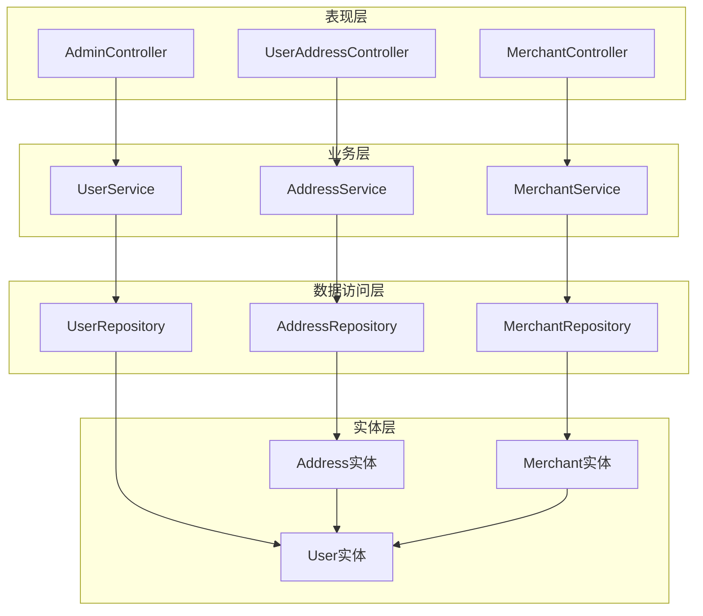
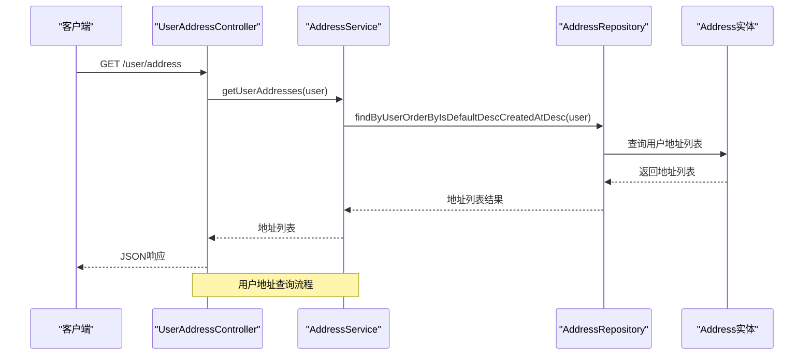
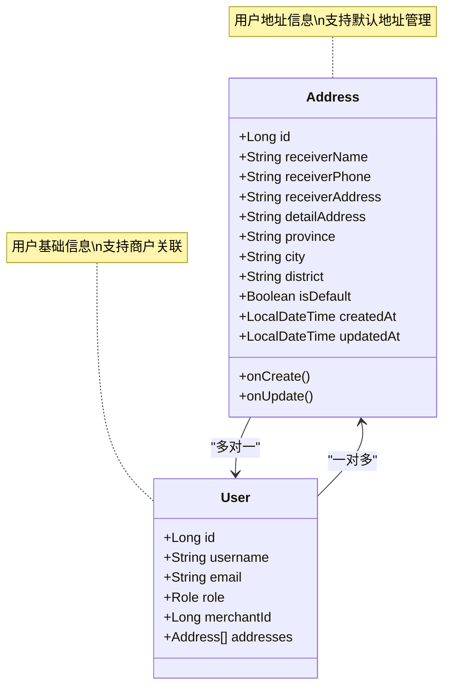
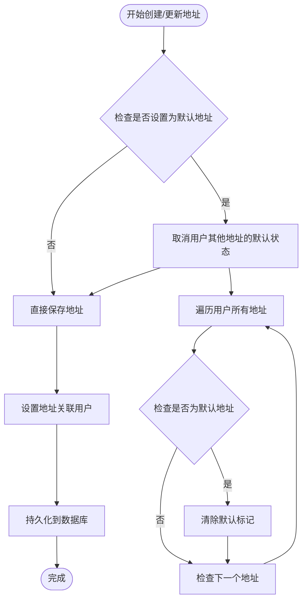
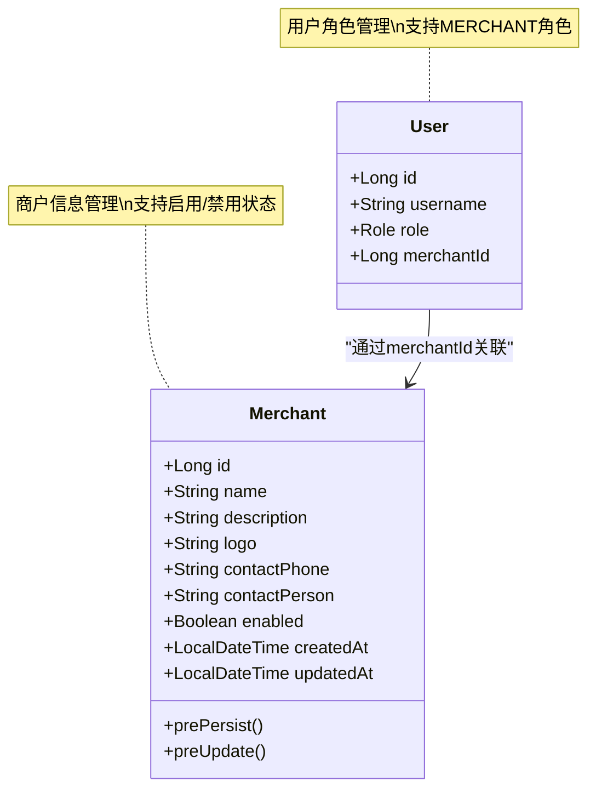
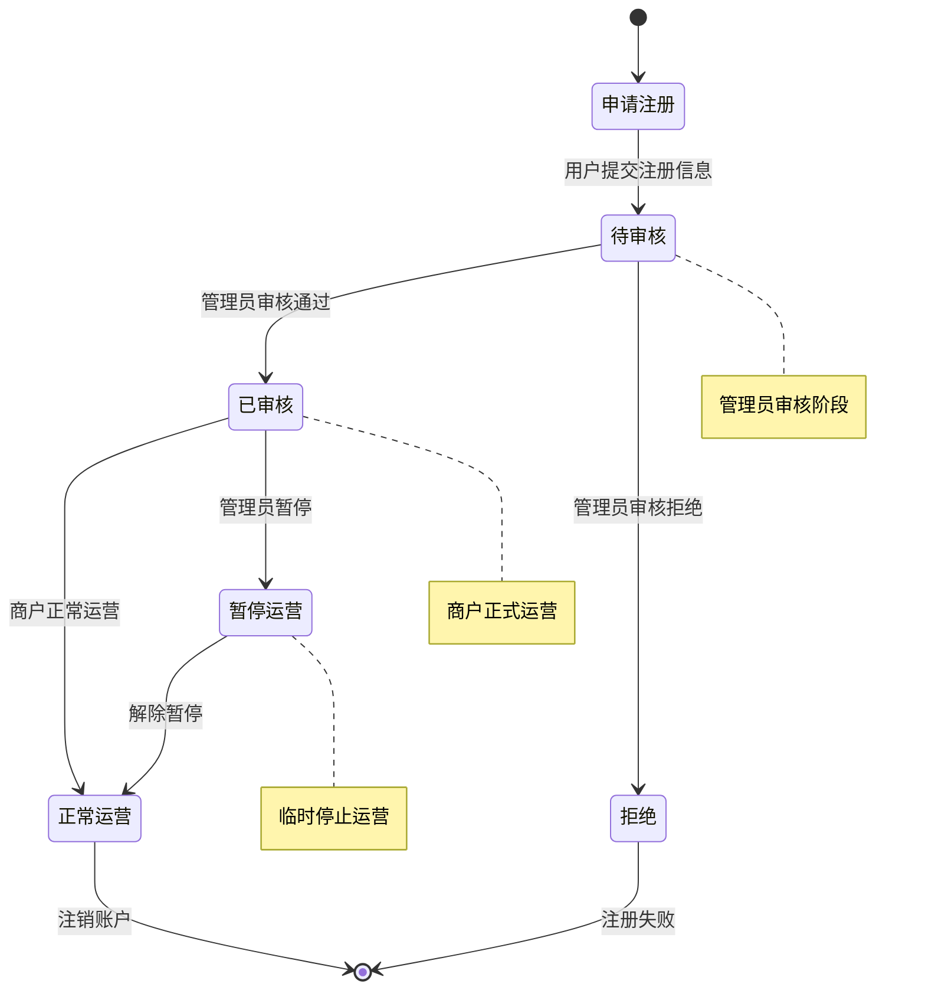

# 地址与商户实体

<cite>
**本文档引用的文件**
- [Address.java](file://backend/src/main/java/com/mall/entity/Address.java)
- [Merchant.java](file://backend/src/main/java/com/mall/entity/Merchant.java)
- [User.java](file://backend/src/main/java/com/mall/entity/User.java)
- [AddressRepository.java](file://backend/src/main/java/com/mall/repository/AddressRepository.java)
- [MerchantRepository.java](file://backend/src/main/java/com/mall/repository/MerchantRepository.java)
- [AddressService.java](file://backend/src/main/java/com/mall/service/AddressService.java)
- [UserService.java](file://backend/src/main/java/com/mall/service/UserService.java)
- [UserAddressController.java](file://backend/src/main/java/com/mall/controller/user/UserAddressController.java)
- [Role.java](file://backend/src/main/java/com/mall/common/Role.java)
- [Product.java](file://backend/src/main/java/com/mall/entity/Product.java)
</cite>

## 目录
1. [简介](#简介)
2. [项目结构](#项目结构)
3. [核心组件](#核心组件)
4. [架构概览](#架构概览)
5. [详细组件分析](#详细组件分析)
6. [依赖关系分析](#依赖关系分析)
7. [性能考虑](#性能考虑)
8. [故障排除指南](#故障排除指南)
9. [结论](#结论)

## 简介

本文档深入分析了电商系统中的两个核心实体：Address地址实体和Merchant商户实体。通过详细解析实体字段定义、关系映射、业务逻辑和数据流，为开发者提供全面的技术参考。重点涵盖用户与地址的一对多关系、商户与用户的关联关系、地址实体的默认值设置和状态管理，以及商户实体的审核流程相关字段设计。

## 项目结构

基于Spring Boot项目的标准分层架构，实体层位于`backend/src/main/java/com/mall/entity/`目录下，采用JPA注解进行ORM映射。项目遵循经典的三层架构模式：表现层（Controller）、业务层（Service）、数据访问层（Repository）。



**图表来源**
- [UserAddressController.java:1-73](file://backend/src/main/java/com/mall/controller/user/UserAddressController.java#L1-L73)
- [AddressService.java:1-91](file://backend/src/main/java/com/mall/service/AddressService.java#L1-L91)
- [AddressRepository.java:1-22](file://backend/src/main/java/com/mall/repository/AddressRepository.java#L1-L22)

**章节来源**
- [application.yml:1-36](file://backend/src/main/resources/application.yml#L1-L36)

## 核心组件

### Address地址实体

Address实体是用户地址管理的核心，采用JPA注解进行数据库映射，支持完整的地址信息存储和管理功能。

#### 字段定义与约束

| 字段名 | 类型 | 约束 | 描述 |
|--------|------|------|------|
| id | Long | 主键, 自增 | 地址唯一标识符 |
| user | User | 外键, 非空 | 关联的用户对象 |
| receiverName | String | 非空, 长度32 | 收货人姓名 |
| receiverPhone | String | 非空, 长度20 | 收货人电话 |
| receiverAddress | String | 非空, 长度255 | 收货人详细地址 |
| detailAddress | String | 长度64 | 详细地址补充信息 |
| province | String | 长度32 | 省份信息 |
| city | String | 长度32 | 城市信息 |
| district | String | 长度32 | 区县信息 |
| isDefault | Boolean | 非空 | 是否为默认地址 |
| createdAt | LocalDateTime | 非空 | 创建时间 |
| updatedAt | LocalDateTime | 非空 | 更新时间 |

#### 默认值设置

地址实体在创建时自动设置默认值：
- `isDefault`: 默认为false，确保新创建的地址不会意外成为默认地址
- `createdAt`和`updatedAt`: 在`@PrePersist`方法中自动设置为当前时间

#### 状态管理

地址实体实现了完整的时间戳管理机制：
- 使用`@PrePersist`和`@PreUpdate`回调方法自动维护时间戳
- 支持软删除概念（通过`enabled`字段实现），但当前实体中未包含此字段

**章节来源**
- [Address.java:1-60](file://backend/src/main/java/com/mall/entity/Address.java#L1-L60)

### Merchant商户实体

Merchant实体代表电商平台中的商户信息，包含完整的商户基本信息和运营状态管理。

#### 字段定义与约束

| 字段名 | 类型 | 约束 | 描述 |
|--------|------|------|------|
| id | Long | 主键, 自增 | 商户唯一标识符 |
| name | String | 非空, 长度64 | 商户名称 |
| description | String | 长度200 | 商户描述信息 |
| logo | String | 长度128 | 商户logo图片地址 |
| contactPhone | String | 长度20 | 联系电话 |
| contactPerson | String | 长度64 | 联系人姓名 |
| enabled | Boolean | 非空 | 商户启用状态 |
| createdAt | LocalDateTime | 非空, 不可更新 | 创建时间 |
| updatedAt | LocalDateTime | 可更新 | 更新时间 |

#### 审核流程相关字段设计

商户实体的设计体现了完整的审核流程：
- `enabled`字段作为核心审核状态标志，默认为true表示已审核通过
- 通过修改`enabled`状态实现商户的启用/禁用管理
- 支持管理员对商户进行审核操作

**章节来源**
- [Merchant.java:1-56](file://backend/src/main/java/com/mall/entity/Merchant.java#L1-L56)

### User用户实体

User实体作为系统的用户基础模型，包含了用户的基本信息和与商户的关联关系。

#### 用户与商户的关联关系

User实体通过以下字段实现与商户的关联：
- `merchantId`: Long类型，存储关联的商户ID
- `role`: Role枚举，支持ADMIN、MERCHANT、USER三种角色
- `merchant`字段：通过`merchantId`与Merchant实体建立关联

#### 用户地址关系

User实体通过`addresses`字段与Address实体建立一对多关系：
- `@OneToMany(mappedBy = "user")`: 建立双向关联
- 支持一个用户拥有多个地址信息

**章节来源**
- [User.java:1-88](file://backend/src/main/java/com/mall/entity/User.java#L1-L88)

## 架构概览

系统采用分层架构设计，实体层负责数据模型定义，业务层处理业务逻辑，表现层提供RESTful API接口。



**图表来源**
- [UserAddressController.java:19-23](file://backend/src/main/java/com/mall/controller/user/UserAddressController.java#L19-L23)
- [AddressService.java:17-19](file://backend/src/main/java/com/mall/service/AddressService.java#L17-L19)
- [AddressRepository.java:13-15](file://backend/src/main/java/com/mall/repository/AddressRepository.java#L13-L15)

**章节来源**
- [UserAddressController.java:1-73](file://backend/src/main/java/com/mall/controller/user/UserAddressController.java#L1-L73)

## 详细组件分析

### 地址实体关系分析

Address实体与User实体建立了多对一的关系，这种设计符合实际业务场景：



**图表来源**
- [Address.java:15-17](file://backend/src/main/java/com/mall/entity/Address.java#L15-L17)
- [User.java:73-75](file://backend/src/main/java/com/mall/entity/User.java#L73-L75)

#### 地址默认值管理流程

系统实现了智能的默认地址管理机制：



**图表来源**
- [AddressService.java:28-34](file://backend/src/main/java/com/mall/service/AddressService.java#L28-L34)
- [AddressService.java:78-85](file://backend/src/main/java/com/mall/service/AddressService.java#L78-L85)

**章节来源**
- [AddressService.java:1-91](file://backend/src/main/java/com/mall/service/AddressService.java#L1-L91)

### 商户实体业务逻辑

Merchant实体的业务逻辑主要体现在用户与商户的关联关系上：



**图表来源**
- [Merchant.java:17-37](file://backend/src/main/java/com/mall/entity/Merchant.java#L17-L37)
- [User.java:60-62](file://backend/src/main/java/com/mall/entity/User.java#L60-L62)

#### 商户审核流程

系统通过Role枚举和merchantId字段实现商户审核流程：



**图表来源**
- [Role.java:1-8](file://backend/src/main/java/com/mall/common/Role.java#L1-L8)
- [User.java:60-62](file://backend/src/main/java/com/mall/entity/User.java#L60-L62)

**章节来源**
- [Role.java:1-8](file://backend/src/main/java/com/mall/common/Role.java#L1-L8)

### 数据访问层分析

AddressRepository和MerchantRepository提供了针对实体的数据库操作方法：

#### AddressRepository功能特性

- `findByUserIdOrderByIsDefaultDescCreatedAtDesc()`: 按用户查询地址，优先显示默认地址
- `findDefaultByUser()`: 获取用户的默认地址
- `countByUserId()`: 统计用户地址数量

#### 商户关联查询

通过UserRepository可以查询特定商户下的所有用户：
- `findByMerchantId()`: 查询指定商户ID关联的所有用户

**章节来源**
- [AddressRepository.java:1-22](file://backend/src/main/java/com/mall/repository/AddressRepository.java#L1-L22)
- [MerchantRepository.java:1-9](file://backend/src/main/java/com/mall/repository/MerchantRepository.java#L1-L9)

## 依赖关系分析

系统中的实体间存在复杂的依赖关系，通过外键约束和级联操作实现数据完整性。

```mermaid
graph TB
subgraph "数据库表关系"
UserTable[sys_user表]
AddressTable[address表]
MerchantTable[merchant表]
ProductTable[product表]
end
subgraph "实体关系"
UserEntity[User实体]
AddressEntity[Address实体]
MerchantEntity[Merchant实体]
ProductEntity[Product实体]
end
UserTable --> AddressTable
UserTable --> MerchantTable
MerchantTable --> ProductTable
UserEntity --> AddressEntity
UserEntity --> MerchantEntity
MerchantEntity --> ProductEntity
AddressTable -.->|user_id外键| UserTable
ProductTable -.->|merchant_id外键| MerchantTable
note for AddressTable "用户地址表\n支持默认地址管理"
note for MerchantTable "商户信息表\n支持启用状态"
note for ProductTable "商品表\n关联商户信息"
```

**图表来源**
- [Address.java:15-17](file://backend/src/main/java/com/mall/entity/Address.java#L15-L17)
- [Product.java:22-23](file://backend/src/main/java/com/mall/entity/Product.java#L22-L23)

### 复杂度分析

#### 时间复杂度
- 地址查询：O(n log n)，其中n为用户地址数量，排序操作为主要开销
- 默认地址查找：O(n)，需要遍历用户地址以找到默认地址
- 商户关联查询：O(m)，其中m为商户下的用户数量

#### 空间复杂度
- 实体对象：O(1)，每个实体占用固定内存空间
- 查询结果集：O(n)，返回的地址或用户列表

**章节来源**
- [AddressRepository.java:13-18](file://backend/src/main/java/com/mall/repository/AddressRepository.java#L13-L18)
- [UserRepository.java:18](file://backend/src/main/java/com/mall/repository/UserRepository.java#L18)

## 性能考虑

### 查询优化策略

1. **索引设计建议**
   - 在`address.user_id`上建立索引以加速地址查询
   - 在`address.is_default`上建立索引以优化默认地址查找
   - 在`merchant.id`上建立索引以加速商户关联查询

2. **缓存策略**
   - 对常用地址查询结果进行缓存
   - 缓存用户默认地址信息减少数据库访问

3. **批量操作**
   - 批量更新默认地址状态以减少事务开销
   - 合并相似的查询操作

### 内存管理

- 使用懒加载（FetchType.LAZY）避免不必要的关联数据加载
- 控制查询结果集大小，避免内存溢出
- 及时释放不再使用的实体对象

## 故障排除指南

### 常见问题及解决方案

#### 地址默认值冲突

**问题描述**：多个地址同时被设置为默认地址

**解决方案**：
- 系统在创建或更新地址时自动调用`unsetDefaultForUser()`方法
- 确保在事务中执行默认地址切换操作

#### 用户与地址权限验证

**问题描述**：用户尝试访问不属于自己的地址

**解决方案**：
- 在`getAddressById()`方法中添加权限验证
- 确保地址的`user.id`与当前用户ID匹配

#### 商户关联异常

**问题描述**：用户角色与merchantId不一致

**解决方案**：
- 在更新用户信息时验证角色类型
- 确保只有MERCHANT角色用户才能关联商户

**章节来源**
- [AddressService.java:21-25](file://backend/src/main/java/com/mall/service/AddressService.java#L21-L25)
- [AdminMerchantController.java:98-103](file://backend/src/main/java/com/mall/controller/admin/AdminMerchantController.java#L98-L103)

## 结论

Address地址实体和Merchant商户实体构成了电商系统的核心数据模型。通过精心设计的字段约束、关系映射和业务逻辑，系统实现了完整的地址管理和商户运营功能。

关键设计亮点包括：
- **智能默认地址管理**：自动维护用户默认地址状态，避免重复默认地址
- **灵活的角色关联**：通过Role枚举和merchantId实现商户与用户的精确关联
- **完善的审核流程**：通过enabled字段和管理员控制实现商户审核机制
- **高效的查询优化**：合理的索引设计和查询策略确保系统性能

这些设计为后续的功能扩展和系统优化奠定了坚实的基础，能够满足电商系统在地址管理、商户运营等方面的各种需求。