# 支撑实体详解

<cite>
**本文档引用的文件**
- [Address.java](file://backend/src/main/java/com/mall/entity/Address.java)
- [Merchant.java](file://backend/src/main/java/com/mall/entity/Merchant.java)
- [OrderItem.java](file://backend/src/main/java/com/mall/entity/OrderItem.java)
- [CartItem.java](file://backend/src/main/java/com/mall/entity/CartItem.java)
- [Favorite.java](file://backend/src/main/java/com/mall/entity/Favorite.java)
- [ProductReview.java](file://backend/src/main/java/com/mall/entity/ProductReview.java)
- [Banner.java](file://backend/src/main/java/com/mall/entity/Banner.java)
- [News.java](file://backend/src/main/java/com/mall/entity/News.java)
- [PaymentRecord.java](file://backend/src/main/java/com/mall/entity/PaymentRecord.java)
- [AddressRepository.java](file://backend/src/main/java/com/mall/repository/AddressRepository.java)
- [CartItemRepository.java](file://backend/src/main/java/com/mall/repository/CartItemRepository.java)
- [FavoriteRepository.java](file://backend/src/main/java/com/mall/repository/FavoriteRepository.java)
- [ProductReviewRepository.java](file://backend/src/main/java/com/mall/repository/ProductReviewRepository.java)
- [BannerRepository.java](file://backend/src/main/java/com/mall/repository/BannerRepository.java)
- [NewsRepository.java](file://backend/src/main/java/com/mall/repository/NewsRepository.java)
- [PaymentRecordRepository.java](file://backend/src/main/java/com/mall/repository/PaymentRecordRepository.java)
- [OrderItemRepository.java](file://backend/src/main/java/com/mall/repository/OrderItemRepository.java)
</cite>

## 目录
1. [简介](#简介)
2. [项目结构](#项目结构)
3. [核心组件](#核心组件)
4. [架构总览](#架构总览)
5. [详细组件分析](#详细组件分析)
6. [依赖分析](#依赖分析)
7. [性能考虑](#性能考虑)
8. [故障排查指南](#故障排查指南)
9. [结论](#结论)

## 简介
本文件聚焦电商商城系统中的支撑实体，围绕以下实体进行数据模型设计解析：Address 地址、Merchant 商户、OrderItem 订单项、CartItem 购物车项、Favorite 收藏、ProductReview 商品评价、Banner 轮播图、News 新闻、PaymentRecord 支付记录。我们将从业务用途、字段定义、关联关系、数据流向与支撑能力等方面进行系统化说明，并给出实体间引用关系与控制流图示。

## 项目结构
后端采用 Spring Boot + JPA 的分层架构，实体位于 entity 包，仓储接口位于 repository 包，服务与控制器在 service 与 controller 包中。支撑实体均以 JPA 注解标注，具备标准的时间戳维护与唯一约束策略，便于在业务流程中实现数据一致性与可追溯性。

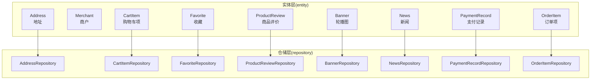

图表来源
- [Address.java:1-60](file://backend/src/main/java/com/mall/entity/Address.java#L1-L60)
- [Merchant.java:1-56](file://backend/src/main/java/com/mall/entity/Merchant.java#L1-L56)
- [OrderItem.java:1-73](file://backend/src/main/java/com/mall/entity/OrderItem.java#L1-L73)
- [CartItem.java:1-50](file://backend/src/main/java/com/mall/entity/CartItem.java#L1-L50)
- [Favorite.java:1-35](file://backend/src/main/java/com/mall/entity/Favorite.java#L1-L35)
- [ProductReview.java:1-44](file://backend/src/main/java/com/mall/entity/ProductReview.java#L1-L44)
- [Banner.java:1-60](file://backend/src/main/java/com/mall/entity/Banner.java#L1-L60)
- [News.java:1-52](file://backend/src/main/java/com/mall/entity/News.java#L1-L52)
- [PaymentRecord.java:1-46](file://backend/src/main/java/com/mall/entity/PaymentRecord.java#L1-L46)
- [AddressRepository.java:1-22](file://backend/src/main/java/com/mall/repository/AddressRepository.java#L1-L22)
- [CartItemRepository.java:1-21](file://backend/src/main/java/com/mall/repository/CartItemRepository.java#L1-L21)
- [FavoriteRepository.java:1-19](file://backend/src/main/java/com/mall/repository/FavoriteRepository.java#L1-L19)
- [ProductReviewRepository.java:1-16](file://backend/src/main/java/com/mall/repository/ProductReviewRepository.java#L1-L16)
- [BannerRepository.java:1-10](file://backend/src/main/java/com/mall/repository/BannerRepository.java#L1-L10)
- [NewsRepository.java:1-19](file://backend/src/main/java/com/mall/repository/NewsRepository.java#L1-L19)
- [PaymentRecordRepository.java:1-8](file://backend/src/main/java/com/mall/repository/PaymentRecordRepository.java#L1-L8)
- [OrderItemRepository.java:1-20](file://backend/src/main/java/com/mall/repository/OrderItemRepository.java#L1-L20)

章节来源
- [Address.java:1-60](file://backend/src/main/java/com/mall/entity/Address.java#L1-L60)
- [Merchant.java:1-56](file://backend/src/main/java/com/mall/entity/Merchant.java#L1-L56)
- [OrderItem.java:1-73](file://backend/src/main/java/com/mall/entity/OrderItem.java#L1-L73)
- [CartItem.java:1-50](file://backend/src/main/java/com/mall/entity/CartItem.java#L1-L50)
- [Favorite.java:1-35](file://backend/src/main/java/com/mall/entity/Favorite.java#L1-L35)
- [ProductReview.java:1-44](file://backend/src/main/java/com/mall/entity/ProductReview.java#L1-L44)
- [Banner.java:1-60](file://backend/src/main/java/com/mall/entity/Banner.java#L1-L60)
- [News.java:1-52](file://backend/src/main/java/com/mall/entity/News.java#L1-L52)
- [PaymentRecord.java:1-46](file://backend/src/main/java/com/mall/entity/PaymentRecord.java#L1-L46)
- [AddressRepository.java:1-22](file://backend/src/main/java/com/mall/repository/AddressRepository.java#L1-L22)
- [CartItemRepository.java:1-21](file://backend/src/main/java/com/mall/repository/CartItemRepository.java#L1-L21)
- [FavoriteRepository.java:1-19](file://backend/src/main/java/com/mall/repository/FavoriteRepository.java#L1-L19)
- [ProductReviewRepository.java:1-16](file://backend/src/main/java/com/mall/repository/ProductReviewRepository.java#L1-L16)
- [BannerRepository.java:1-10](file://backend/src/main/java/com/mall/repository/BannerRepository.java#L1-L10)
- [NewsRepository.java:1-19](file://backend/src/main/java/com/mall/repository/NewsRepository.java#L1-L19)
- [PaymentRecordRepository.java:1-8](file://backend/src/main/java/com/mall/repository/PaymentRecordRepository.java#L1-L8)
- [OrderItemRepository.java:1-20](file://backend/src/main/java/com/mall/repository/OrderItemRepository.java#L1-L20)

## 核心组件
- Address 地址：承载用户收货信息与默认地址标记，支持按用户聚合与默认地址检索。
- Merchant 商户：描述入驻商户的基础信息与启用状态，支撑商品与订单的归属管理。
- OrderItem 订单项：记录下单时的商品快照、单价、数量、小计、退款状态与评价标记。
- CartItem 购物车项：记录用户的加购行为，支持按用户+商品+规格去重，保障购物车幂等。
- Favorite 收藏：记录用户对商品的偏好，支持去重与批量查询。
- ProductReview 商品评价：记录用户对已收货商品的评分与评论，支撑评价分页与商品维度查询。
- Banner 轮播图：承载首页轮播位配置，支持启用筛选与排序权重。
- News 新闻：系统资讯与公告的统一载体，支持类型区分与发布状态。
- PaymentRecord 支付记录：模拟支付完成后的落库记录，确保支付数据完整性与可审计性。

章节来源
- [Address.java:1-60](file://backend/src/main/java/com/mall/entity/Address.java#L1-L60)
- [Merchant.java:1-56](file://backend/src/main/java/com/mall/entity/Merchant.java#L1-L56)
- [OrderItem.java:1-73](file://backend/src/main/java/com/mall/entity/OrderItem.java#L1-L73)
- [CartItem.java:1-50](file://backend/src/main/java/com/mall/entity/CartItem.java#L1-L50)
- [Favorite.java:1-35](file://backend/src/main/java/com/mall/entity/Favorite.java#L1-L35)
- [ProductReview.java:1-44](file://backend/src/main/java/com/mall/entity/ProductReview.java#L1-L44)
- [Banner.java:1-60](file://backend/src/main/java/com/mall/entity/Banner.java#L1-L60)
- [News.java:1-52](file://backend/src/main/java/com/mall/entity/News.java#L1-L52)
- [PaymentRecord.java:1-46](file://backend/src/main/java/com/mall/entity/PaymentRecord.java#L1-L46)

## 架构总览
下图展示支撑实体在仓储层的职责边界与典型查询路径，体现“按用户/商品/订单”维度的数据组织与检索策略。

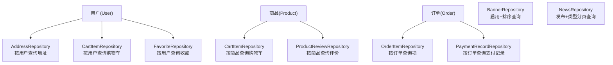

图表来源
- [AddressRepository.java:1-22](file://backend/src/main/java/com/mall/repository/AddressRepository.java#L1-L22)
- [CartItemRepository.java:1-21](file://backend/src/main/java/com/mall/repository/CartItemRepository.java#L1-L21)
- [FavoriteRepository.java:1-19](file://backend/src/main/java/com/mall/repository/FavoriteRepository.java#L1-L19)
- [OrderItemRepository.java:1-20](file://backend/src/main/java/com/mall/repository/OrderItemRepository.java#L1-L20)
- [PaymentRecordRepository.java:1-8](file://backend/src/main/java/com/mall/repository/PaymentRecordRepository.java#L1-L8)
- [ProductReviewRepository.java:1-16](file://backend/src/main/java/com/mall/repository/ProductReviewRepository.java#L1-L16)
- [BannerRepository.java:1-10](file://backend/src/main/java/com/mall/repository/BannerRepository.java#L1-L10)
- [NewsRepository.java:1-19](file://backend/src/main/java/com/mall/repository/NewsRepository.java#L1-L19)

## 详细组件分析

### Address 地址实体
- 业务用途：存储用户收货地址，支持默认地址标记与多地址管理。
- 关键字段与约束：
  - 用户外键：与用户建立多对一关系，用于按用户聚合地址。
  - 收件人姓名、电话、省市区、详细地址：构成完整收货信息。
  - 默认标记：用于快速定位用户默认收货地址。
  - 时间戳：自动维护创建与更新时间。
- 典型查询：
  - 按用户查询并按默认优先、创建时间降序排列。
  - 查询用户的默认地址。
- 数据流向：用户在下单时选择或使用默认地址；订单结算与发货据此生成物流信息。

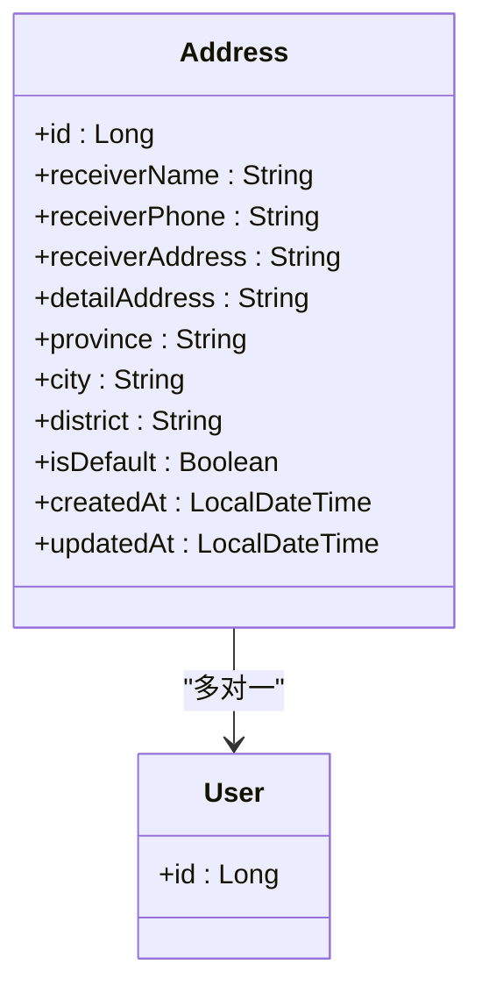

图表来源
- [Address.java:1-60](file://backend/src/main/java/com/mall/entity/Address.java#L1-L60)

章节来源
- [Address.java:1-60](file://backend/src/main/java/com/mall/entity/Address.java#L1-L60)
- [AddressRepository.java:1-22](file://backend/src/main/java/com/mall/repository/AddressRepository.java#L1-L22)

### Merchant 商户实体
- 业务用途：描述平台入驻商户的基本信息与运营状态。
- 关键字段与约束：
  - 名称、描述、Logo、联系方式、联系人：用于商户展示与沟通。
  - 启用状态：控制商户是否参与销售。
  - 时间戳：自动维护创建与更新时间。
- 数据流向：商户信息用于商品列表、订单结算页的商户标识，以及后台管理与报表统计。

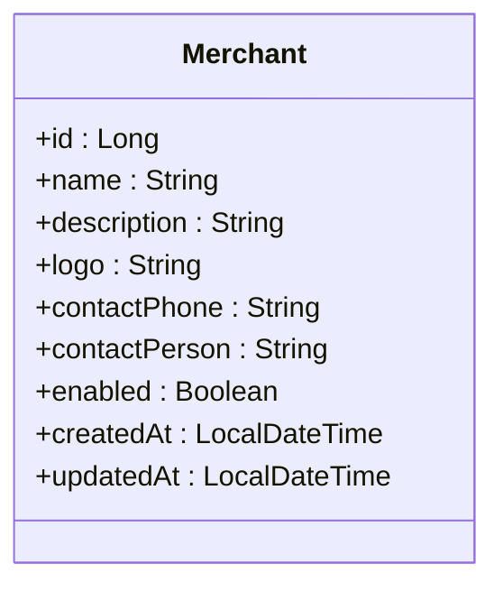

图表来源
- [Merchant.java:1-56](file://backend/src/main/java/com/mall/entity/Merchant.java#L1-L56)

章节来源
- [Merchant.java:1-56](file://backend/src/main/java/com/mall/entity/Merchant.java#L1-L56)

### OrderItem 订单项实体
- 业务用途：记录订单中单个商品的购买快照与售后状态。
- 关键字段与约束：
  - 订单ID、商品ID：建立与订单与商品的关联。
  - 商品名称、图片：快照保留下单时的信息。
  - 单价、数量、小计：计算与核对金额。
  - 规格ID与规格值：记录购买时的规格组合快照。
  - 退款状态、原因与申请时间：支撑售后流程。
  - 已评价标记：防止重复评价。
  - 创建时间：用于排序与统计。
- 数据流向：订单结算后生成订单项；售后流程更新退款状态；评价完成后标记已评价。

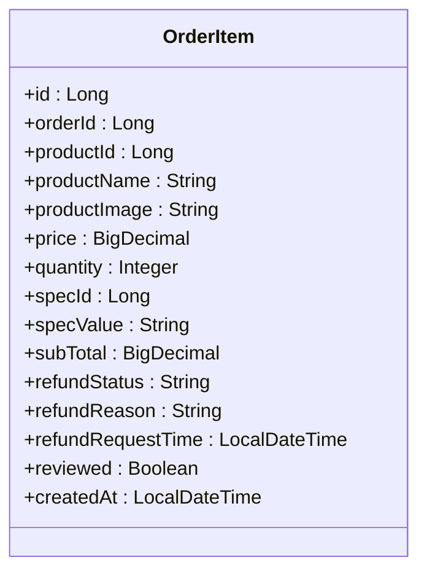

图表来源
- [OrderItem.java:1-73](file://backend/src/main/java/com/mall/entity/OrderItem.java#L1-L73)

章节来源
- [OrderItem.java:1-73](file://backend/src/main/java/com/mall/entity/OrderItem.java#L1-L73)
- [OrderItemRepository.java:1-20](file://backend/src/main/java/com/mall/repository/OrderItemRepository.java#L1-L20)

### CartItem 购物车项实体
- 业务用途：记录用户的加购行为，支持规格级去重与数量变更。
- 关键字段与约束：
  - 用户ID、商品ID、规格ID：三元唯一约束，避免重复加购。
  - 数量：默认为1，支持增删改。
  - 时间戳：自动维护创建与更新时间。
- 数据流向：用户加购商品后持久化；下单前读取购物车并生成订单项；清空购物车或删除单项。

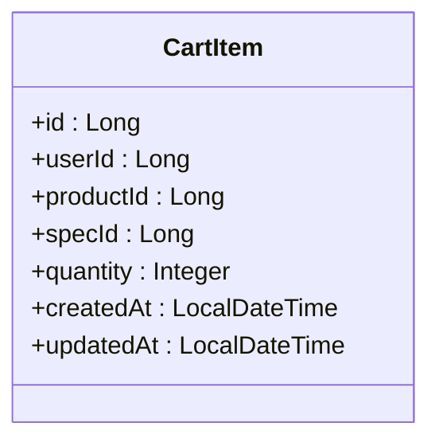

图表来源
- [CartItem.java:1-50](file://backend/src/main/java/com/mall/entity/CartItem.java#L1-L50)

章节来源
- [CartItem.java:1-50](file://backend/src/main/java/com/mall/entity/CartItem.java#L1-L50)
- [CartItemRepository.java:1-21](file://backend/src/main/java/com/mall/repository/CartItemRepository.java#L1-L21)

### Favorite 收藏实体
- 业务用途：记录用户对商品的偏好，支持收藏夹管理。
- 关键字段与约束：
  - 用户ID、商品ID：二元唯一约束，避免重复收藏。
  - 创建时间：用于排序与统计。
- 数据流向：用户收藏商品后持久化；支持按用户查询收藏列表；取消收藏时删除记录。

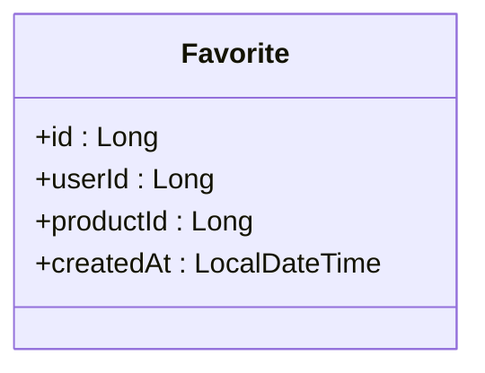

图表来源
- [Favorite.java:1-35](file://backend/src/main/java/com/mall/entity/Favorite.java#L1-L35)

章节来源
- [Favorite.java:1-35](file://backend/src/main/java/com/mall/entity/Favorite.java#L1-L35)
- [FavoriteRepository.java:1-19](file://backend/src/main/java/com/mall/repository/FavoriteRepository.java#L1-L19)

### ProductReview 商品评价实体
- 业务用途：记录用户对已收货商品的评分与评论，支撑评价体系。
- 关键字段与约束：
  - 商品ID、订单ID、用户ID：建立与商品、订单、用户的关联。
  - 评分与内容：评价的核心信息。
  - 创建时间：用于评价排序与统计。
- 数据流向：用户提交评价；按商品维度分页查询；与订单项的“已评价”标记协同。

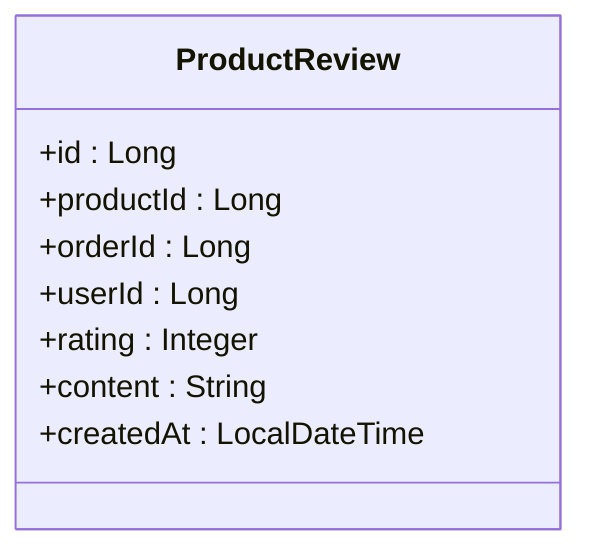

图表来源
- [ProductReview.java:1-44](file://backend/src/main/java/com/mall/entity/ProductReview.java#L1-L44)

章节来源
- [ProductReview.java:1-44](file://backend/src/main/java/com/mall/entity/ProductReview.java#L1-L44)
- [ProductReviewRepository.java:1-16](file://backend/src/main/java/com/mall/repository/ProductReviewRepository.java#L1-L16)

### Banner 轮播图实体
- 业务用途：承载首页轮播位配置，引导流量至指定商品或页面。
- 关键字段与约束：
  - 标题、关联商品ID、图片URL、跳转链接：轮播位内容与入口。
  - 排序权重：决定轮播顺序。
  - 启用状态：控制轮播位生效。
  - 时间戳：自动维护创建与更新时间。
- 数据流向：前端按启用且排序查询轮播图；点击进入商品详情或自定义链接。

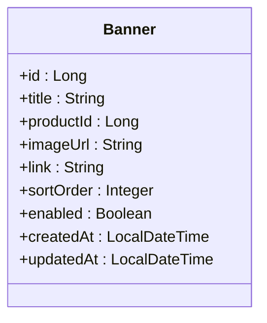

图表来源
- [Banner.java:1-60](file://backend/src/main/java/com/mall/entity/Banner.java#L1-L60)

章节来源
- [Banner.java:1-60](file://backend/src/main/java/com/mall/entity/Banner.java#L1-L60)
- [BannerRepository.java:1-10](file://backend/src/main/java/com/mall/repository/BannerRepository.java#L1-L10)

### News 新闻实体
- 业务用途：统一承载系统资讯与公告，支持分页与类型筛选。
- 关键字段与约束：
  - 标题、内容：信息主体。
  - 类型：区分资讯与公告。
  - 发布状态：控制是否对外展示。
  - 时间戳：自动维护创建与更新时间。
- 数据流向：后台发布后前台分页展示；按类型与发布状态筛选。

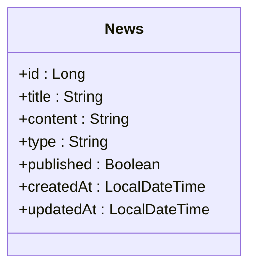

图表来源
- [News.java:1-52](file://backend/src/main/java/com/mall/entity/News.java#L1-L52)

章节来源
- [News.java:1-52](file://backend/src/main/java/com/mall/entity/News.java#L1-L52)
- [NewsRepository.java:1-19](file://backend/src/main/java/com/mall/repository/NewsRepository.java#L1-L19)

### PaymentRecord 支付记录实体
- 业务用途：模拟支付完成后写入的支付记录，保证支付数据完整性与可审计性。
- 关键字段与约束：
  - 订单ID、订单号、支付方式、支付金额、支付时间：支付事实的原子记录。
  - 创建时间：用于审计与对账。
- 数据流向：支付完成后持久化记录；与订单状态联动；用于财务对账与报表。

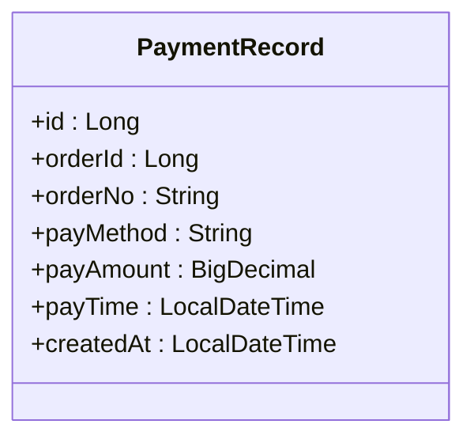

图表来源
- [PaymentRecord.java:1-46](file://backend/src/main/java/com/mall/entity/PaymentRecord.java#L1-L46)

章节来源
- [PaymentRecord.java:1-46](file://backend/src/main/java/com/mall/entity/PaymentRecord.java#L1-L46)
- [PaymentRecordRepository.java:1-8](file://backend/src/main/java/com/mall/repository/PaymentRecordRepository.java#L1-L8)

## 依赖分析
- 实体与仓储的耦合度低，通过 JPA Repository 提供 CRUD 与定制查询，符合分层原则。
- 多数实体具备唯一约束（购物车、收藏），避免重复数据；时间戳自动维护，减少业务侧样板代码。
- OrderItem 与 PaymentRecord 分别服务于“订单明细”和“支付事实”，二者通过订单ID产生间接关联，支撑订单到支付的闭环校验。

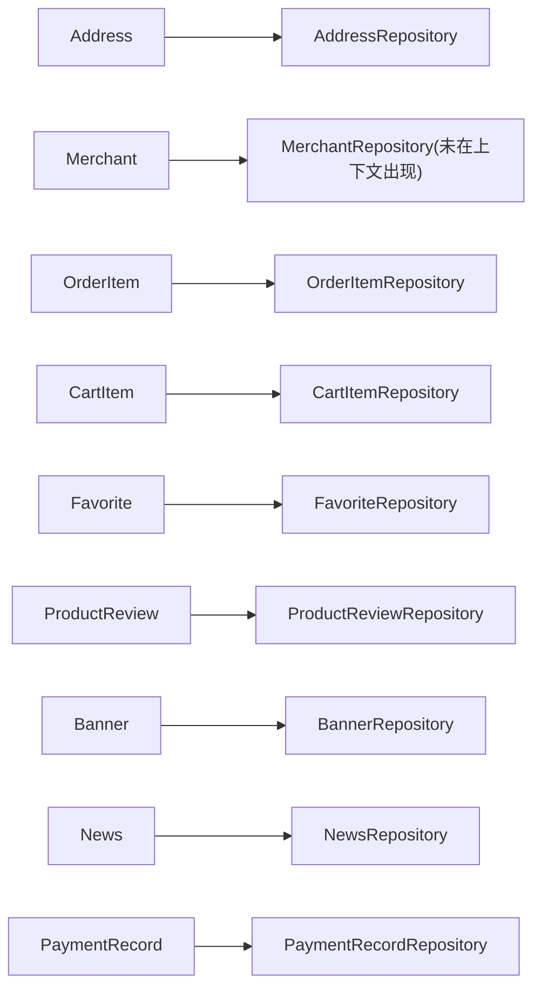

图表来源
- [AddressRepository.java:1-22](file://backend/src/main/java/com/mall/repository/AddressRepository.java#L1-L22)
- [OrderItemRepository.java:1-20](file://backend/src/main/java/com/mall/repository/OrderItemRepository.java#L1-L20)
- [CartItemRepository.java:1-21](file://backend/src/main/java/com/mall/repository/CartItemRepository.java#L1-L21)
- [FavoriteRepository.java:1-19](file://backend/src/main/java/com/mall/repository/FavoriteRepository.java#L1-L19)
- [ProductReviewRepository.java:1-16](file://backend/src/main/java/com/mall/repository/ProductReviewRepository.java#L1-L16)
- [BannerRepository.java:1-10](file://backend/src/main/java/com/mall/repository/BannerRepository.java#L1-L10)
- [NewsRepository.java:1-19](file://backend/src/main/java/com/mall/repository/NewsRepository.java#L1-L19)
- [PaymentRecordRepository.java:1-8](file://backend/src/main/java/com/mall/repository/PaymentRecordRepository.java#L1-L8)

章节来源
- [AddressRepository.java:1-22](file://backend/src/main/java/com/mall/repository/AddressRepository.java#L1-L22)
- [OrderItemRepository.java:1-20](file://backend/src/main/java/com/mall/repository/OrderItemRepository.java#L1-L20)
- [CartItemRepository.java:1-21](file://backend/src/main/java/com/mall/repository/CartItemRepository.java#L1-L21)
- [FavoriteRepository.java:1-19](file://backend/src/main/java/com/mall/repository/FavoriteRepository.java#L1-L19)
- [ProductReviewRepository.java:1-16](file://backend/src/main/java/com/mall/repository/ProductReviewRepository.java#L1-L16)
- [BannerRepository.java:1-10](file://backend/src/main/java/com/mall/repository/BannerRepository.java#L1-L10)
- [NewsRepository.java:1-19](file://backend/src/main/java/com/mall/repository/NewsRepository.java#L1-L19)
- [PaymentRecordRepository.java:1-8](file://backend/src/main/java/com/mall/repository/PaymentRecordRepository.java#L1-L8)

## 性能考虑
- 唯一约束与索引：购物车与收藏的复合唯一约束可有效避免重复数据；建议在高频查询列（如用户ID、商品ID、订单ID、启用状态、排序权重）建立索引以提升查询性能。
- 分页与排序：新闻与评价采用分页与按时间倒序，建议结合数据库索引优化；轮播图按启用与排序权重查询，需确保相关列有合适索引。
- 时间戳与审计：统一的创建/更新时间维护减少了业务侧逻辑复杂度，同时便于审计与统计。

## 故障排查指南
- 地址默认冲突：若默认地址设置异常，检查默认标记字段与查询逻辑，确认同一用户仅有一个默认地址。
- 购物车重复加购：若出现重复记录，检查三元唯一约束是否生效，确认用户ID、商品ID、规格ID传参正确。
- 收藏重复：若收藏失败或重复，检查二元唯一约束与去重逻辑。
- 评价与售后：若评价无法提交或售后状态不更新，检查订单项的“已评价”标记与退款状态字段更新逻辑。
- 轮播图显示异常：若轮播图未显示或顺序错误，检查启用状态与排序权重字段。
- 新闻分页异常：若分页结果不正确，检查发布状态与类型筛选条件。
- 支付记录缺失：若支付后无记录，检查支付完成后的持久化流程与订单ID关联。

章节来源
- [AddressRepository.java:1-22](file://backend/src/main/java/com/mall/repository/AddressRepository.java#L1-L22)
- [CartItemRepository.java:1-21](file://backend/src/main/java/com/mall/repository/CartItemRepository.java#L1-L21)
- [FavoriteRepository.java:1-19](file://backend/src/main/java/com/mall/repository/FavoriteRepository.java#L1-L19)
- [ProductReviewRepository.java:1-16](file://backend/src/main/java/com/mall/repository/ProductReviewRepository.java#L1-L16)
- [BannerRepository.java:1-10](file://backend/src/main/java/com/mall/repository/BannerRepository.java#L1-L10)
- [NewsRepository.java:1-19](file://backend/src/main/java/com/mall/repository/NewsRepository.java#L1-L19)
- [PaymentRecordRepository.java:1-8](file://backend/src/main/java/com/mall/repository/PaymentRecordRepository.java#L1-L8)
- [OrderItemRepository.java:1-20](file://backend/src/main/java/com/mall/repository/OrderItemRepository.java#L1-L20)

## 结论
上述支撑实体围绕用户、商品、订单与运营场景构建了完整的数据骨架。通过明确的字段语义、唯一约束与时间戳维护，配合仓储层的定制查询，实现了地址管理、购物车、收藏、评价、轮播、新闻与支付记录等关键能力的数据支撑。在后续扩展中，建议持续完善索引策略与审计日志，以进一步提升查询性能与系统可观测性。