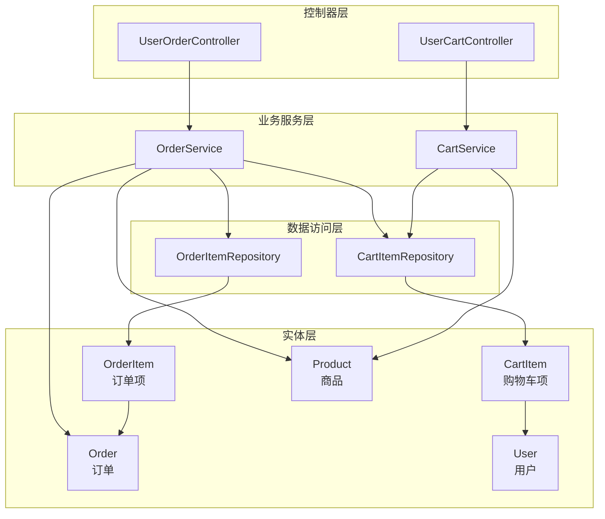
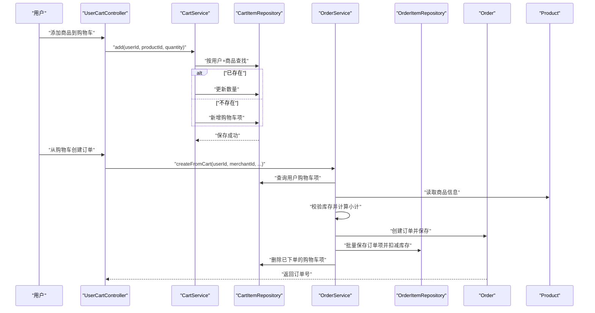
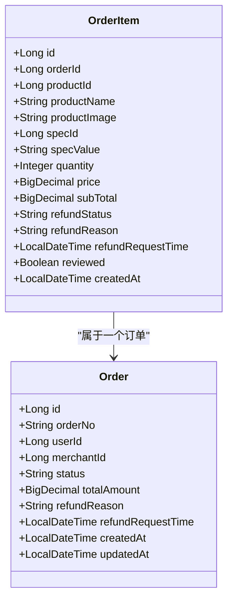
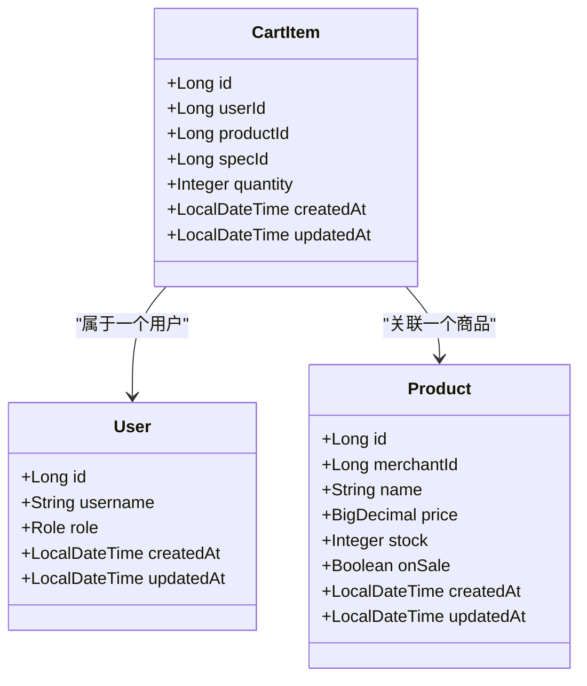
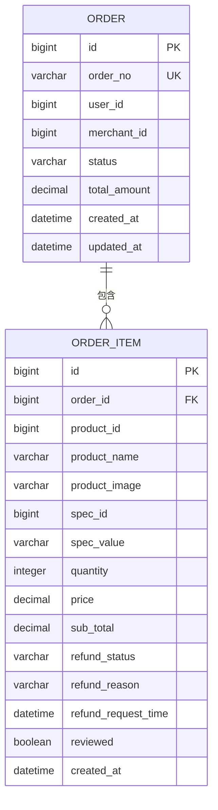
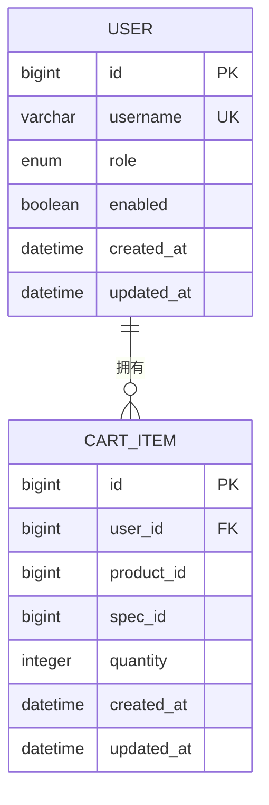
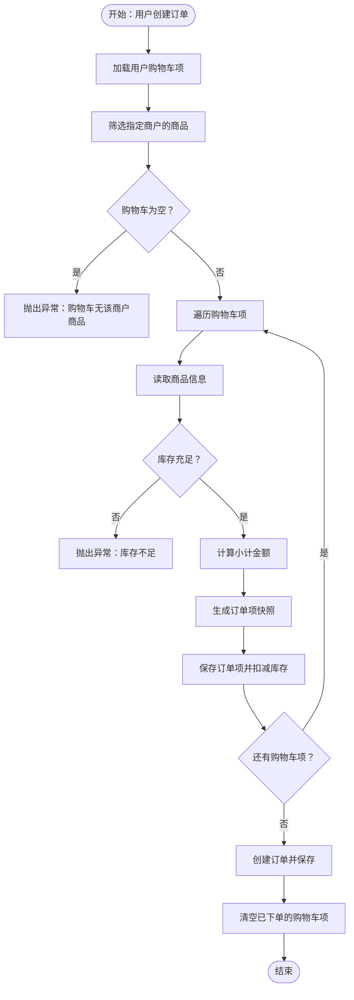
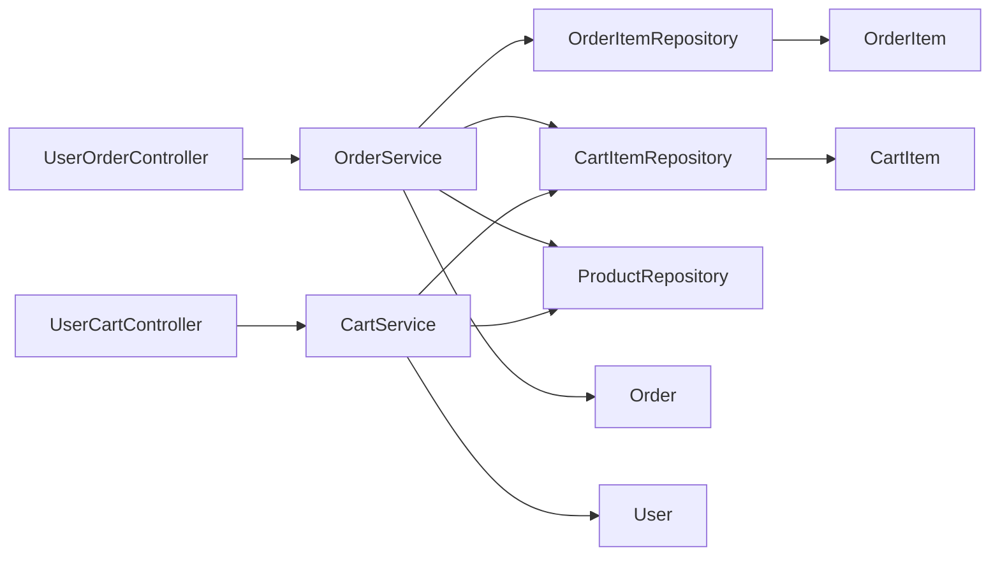

# 订单与购物车实体

<cite>
**本文引用的文件**
- [OrderItem.java](file://backend/src/main/java/com/mall/entity/OrderItem.java)
- [CartItem.java](file://backend/src/main/java/com/mall/entity/CartItem.java)
- [Order.java](file://backend/src/main/java/com/mall/entity/Order.java)
- [User.java](file://backend/src/main/java/com/mall/entity/User.java)
- [Product.java](file://backend/src/main/java/com/mall/entity/Product.java)
- [OrderItemRepository.java](file://backend/src/main/java/com/mall/repository/OrderItemRepository.java)
- [CartItemRepository.java](file://backend/src/main/java/com/mall/repository/CartItemRepository.java)
- [OrderService.java](file://backend/src/main/java/com/mall/service/OrderService.java)
- [CartService.java](file://backend/src/main/java/com/mall/service/CartService.java)
- [UserCartController.java](file://backend/src/main/java/com/mall/controller/user/UserCartController.java)
- [UserOrderController.java](file://backend/src/main/java/com/mall/controller/user/UserOrderController.java)
</cite>

## 目录
1. [简介](#简介)
2. [项目结构](#项目结构)
3. [核心组件](#核心组件)
4. [架构总览](#架构总览)
5. [详细组件分析](#详细组件分析)
6. [依赖分析](#依赖分析)
7. [性能考虑](#性能考虑)
8. [故障排查指南](#故障排查指南)
9. [结论](#结论)

## 简介
本文件聚焦于电商系统中的两个关键实体：订单项（OrderItem）与购物车项（CartItem），并围绕它们的字段定义、数据模型、业务关系与处理流程展开系统化说明。重点包括：
- 订单项字段定义与价格计算逻辑
- 购物车项字段定义与临时存储机制
- 订单项与订单的一对多关系
- 购物车项与用户的关联关系
- 订单项与购物车项的转换逻辑设计

## 项目结构
本项目采用典型的分层架构，实体位于 entity 层，业务逻辑在 service 层，对外接口在 controller 层，数据访问在 repository 层。与订单项和购物车项直接相关的模块如下：
- 实体层：OrderItem、CartItem、Order、User、Product
- 数据访问层：OrderItemRepository、CartItemRepository
- 业务服务层：OrderService、CartService
- 控制器层：UserOrderController、UserCartController

图表来源
- [OrderItem.java:1-73](file://backend/src/main/java/com/mall/entity/OrderItem.java#L1-L73)
- [CartItem.java:1-50](file://backend/src/main/java/com/mall/entity/CartItem.java#L1-L50)
- [Order.java:1-83](file://backend/src/main/java/com/mall/entity/Order.java#L1-L83)
- [User.java:1-88](file://backend/src/main/java/com/mall/entity/User.java#L1-L88)
- [Product.java:1-101](file://backend/src/main/java/com/mall/entity/Product.java#L1-L101)
- [OrderItemRepository.java:1-20](file://backend/src/main/java/com/mall/repository/OrderItemRepository.java#L1-L20)
- [CartItemRepository.java:1-21](file://backend/src/main/java/com/mall/repository/CartItemRepository.java#L1-L21)
- [OrderService.java:1-280](file://backend/src/main/java/com/mall/service/OrderService.java#L1-L280)
- [CartService.java:1-62](file://backend/src/main/java/com/mall/service/CartService.java#L1-L62)
- [UserOrderController.java:1-198](file://backend/src/main/java/com/mall/controller/user/UserOrderController.java#L1-L198)
- [UserCartController.java:1-67](file://backend/src/main/java/com/mall/controller/user/UserCartController.java#L1-L67)

章节来源
- [OrderItem.java:1-73](file://backend/src/main/java/com/mall/entity/OrderItem.java#L1-L73)
- [CartItem.java:1-50](file://backend/src/main/java/com/mall/entity/CartItem.java#L1-L50)
- [Order.java:1-83](file://backend/src/main/java/com/mall/entity/Order.java#L1-L83)
- [User.java:1-88](file://backend/src/main/java/com/mall/entity/User.java#L1-L88)
- [Product.java:1-101](file://backend/src/main/java/com/mall/entity/Product.java#L1-L101)
- [OrderItemRepository.java:1-20](file://backend/src/main/java/com/mall/repository/OrderItemRepository.java#L1-L20)
- [CartItemRepository.java:1-21](file://backend/src/main/java/com/mall/repository/CartItemRepository.java#L1-L21)
- [OrderService.java:1-280](file://backend/src/main/java/com/mall/service/OrderService.java#L1-L280)
- [CartService.java:1-62](file://backend/src/main/java/com/mall/service/CartService.java#L1-L62)
- [UserOrderController.java:1-198](file://backend/src/main/java/com/mall/controller/user/UserOrderController.java#L1-L198)
- [UserCartController.java:1-67](file://backend/src/main/java/com/mall/controller/user/UserCartController.java#L1-L67)

## 核心组件
本节对订单项与购物车项进行字段级解析，并说明其与订单、用户、商品的关系。

- 订单项（OrderItem）
  - 关键字段
    - 订单标识：orderId（外键关联订单）
    - 商品标识：productId（外键关联商品）
    - 商品快照：productName、productImage（用于订单历史快照）
    - 规格快照：specId、specValue（记录下单时的规格信息）
    - 数量与单价：quantity、price
    - 小计金额：subTotal（price × quantity）
    - 退款状态与原因：refundStatus、refundReason、refundRequestTime
    - 评价标记：reviewed（默认未评价）
    - 创建时间：createdAt（持久化前自动填充）
  - 价格计算
    - 小计金额 = 单价 × 数量
    - 订单总金额由服务层聚合，订单项仅保存单项金额
  - 退款状态
    - 支持单品退款申请与整体订单退款状态同步

- 购物车项（CartItem）
  - 关键字段
    - 用户标识：userId（外键关联用户）
    - 商品标识：productId（外键关联商品）
    - 规格标识：specId（可空，用于区分不同规格）
    - 数量：quantity（默认1）
    - 时间戳：createdAt、updatedAt（持久化前后自动填充）
  - 唯一约束
    - 用户+商品+规格的唯一组合，避免重复加入相同规格商品
  - 临时存储机制
    - 购物车项仅存在于数据库中，作为下单前的临时集合
    - 下单成功后会清空对应购物车项

- 订单（Order）
  - 关键字段
    - 订单号：orderNo（唯一）
    - 用户与商户：userId、merchantId
    - 订单状态：status（待支付、已支付、已发货、已收货、已取消等）
    - 金额：totalAmount、payAmount、payMethod、payTime
    - 收货信息：receiverName、receiverPhone、receiverAddress
    - 退款信息：refundReason、refundRequestTime
    - 时间戳：createdAt、updatedAt

- 用户（User）
  - 关键字段
    - 用户名、密码、昵称、邮箱、电话、头像、性别
    - 角色与启用状态：role、enabled
    - 收货人信息：receiverName、receiverPhone、receiverAddress
    - 地址列表：addresses（一对多）

- 商品（Product）
  - 关键字段
    - 商户与分类：merchantId、categoryId
    - 名称、描述、图片、详情页轮播图
    - 价格与原价：price、originalPrice
    - 库存与销量：stock、sales
    - 上架状态：onSale
    - 新品标记：isNew
    - 时间戳：createdAt、updatedAt

章节来源
- [OrderItem.java:18-71](file://backend/src/main/java/com/mall/entity/OrderItem.java#L18-L71)
- [CartItem.java:17-48](file://backend/src/main/java/com/mall/entity/CartItem.java#L17-L48)
- [Order.java:18-81](file://backend/src/main/java/com/mall/entity/Order.java#L18-L81)
- [User.java:19-86](file://backend/src/main/java/com/mall/entity/User.java#L19-L86)
- [Product.java:18-99](file://backend/src/main/java/com/mall/entity/Product.java#L18-L99)

## 架构总览
订单项与购物车项在系统中的交互路径如下：
- 用户通过购物车控制器管理购物车项
- 订单服务根据购物车项生成订单与订单项，并扣减库存
- 订单控制器提供订单查询、状态更新、退款申请等操作
- 订单项与购物车项均与商品存在关联，且在下单时形成“快照”以保证历史一致性

图表来源
- [UserCartController.java:27-45](file://backend/src/main/java/com/mall/controller/user/UserCartController.java#L27-L45)
- [CartService.java:25-43](file://backend/src/main/java/com/mall/service/CartService.java#L25-L43)
- [UserOrderController.java:33-50](file://backend/src/main/java/com/mall/controller/user/UserOrderController.java#L33-L50)
- [OrderService.java:33-88](file://backend/src/main/java/com/mall/service/OrderService.java#L33-L88)
- [OrderItemRepository.java:11](file://backend/src/main/java/com/mall/repository/OrderItemRepository.java#L11)
- [CartItemRepository.java:11-15](file://backend/src/main/java/com/mall/repository/CartItemRepository.java#L11-L15)

## 详细组件分析

### 订单项（OrderItem）数据模型
- 字段定义与含义
  - 订单标识：orderId，用于建立与订单的一对多关系
  - 商品标识：productId，用于建立与商品的关联
  - 商品快照：productName、productImage，确保历史订单项不受商品信息变更影响
  - 规格快照：specId、specValue，记录下单时的规格信息
  - 数量与单价：quantity、price，用于计算小计
  - 小计金额：subTotal，price × quantity
  - 退款状态：refundStatus（null、申请中、已退款）、refundReason、refundRequestTime
  - 评价标记：reviewed，默认未评价
  - 创建时间：createdAt，持久化前自动填充
- 价格计算
  - 小计金额 = 单价 × 数量
  - 订单总金额由服务层聚合，订单项仅保存单项金额
- 退款状态
  - 支持单品退款申请与整体订单退款状态同步
  - 当所有订单项均处于“申请中/已退款”时，订单整体状态同步为“申请中”

图表来源
- [OrderItem.java:18-71](file://backend/src/main/java/com/mall/entity/OrderItem.java#L18-L71)
- [Order.java:18-81](file://backend/src/main/java/com/mall/entity/Order.java#L18-L81)

章节来源
- [OrderItem.java:18-71](file://backend/src/main/java/com/mall/entity/OrderItem.java#L18-L71)
- [OrderItemRepository.java:11-18](file://backend/src/main/java/com/mall/repository/OrderItemRepository.java#L11-L18)
- [OrderService.java:43-88](file://backend/src/main/java/com/mall/service/OrderService.java#L43-L88)

### 购物车项（CartItem）数据模型
- 字段定义与含义
  - 用户标识：userId，用于建立与用户的关联
  - 商品标识：productId，用于建立与商品的关联
  - 规格标识：specId，可空，用于区分不同规格
  - 数量：quantity，默认1
  - 时间戳：createdAt、updatedAt，持久化前后自动填充
- 唯一约束
  - 用户+商品+规格的唯一组合，避免重复加入相同规格商品
- 临时存储机制
  - 购物车项仅存在于数据库中，作为下单前的临时集合
  - 下单成功后会清空对应购物车项

图表来源
- [CartItem.java:17-48](file://backend/src/main/java/com/mall/entity/CartItem.java#L17-L48)
- [User.java:19-86](file://backend/src/main/java/com/mall/entity/User.java#L19-L86)
- [Product.java:18-99](file://backend/src/main/java/com/mall/entity/Product.java#L18-L99)

章节来源
- [CartItem.java:17-48](file://backend/src/main/java/com/mall/entity/CartItem.java#L17-L48)
- [CartItemRepository.java:11-19](file://backend/src/main/java/com/mall/repository/CartItemRepository.java#L11-L19)
- [CartService.java:25-60](file://backend/src/main/java/com/mall/service/CartService.java#L25-L60)

### 订单项与订单的一对多关系
- 关系说明
  - 一个订单包含多个订单项，每个订单项属于一个订单
  - 订单项通过 orderId 关联到订单
- 业务要点
  - 订单总金额由订单项的小计累加得到
  - 订单项在下单时会复制商品的快照信息，确保历史一致性
  - 退款场景下，订单项支持单品退款与整体订单退款状态同步

图表来源
- [Order.java:18-81](file://backend/src/main/java/com/mall/entity/Order.java#L18-L81)
- [OrderItem.java:18-71](file://backend/src/main/java/com/mall/entity/OrderItem.java#L18-L71)

章节来源
- [Order.java:18-81](file://backend/src/main/java/com/mall/entity/Order.java#L18-L81)
- [OrderItem.java:18-71](file://backend/src/main/java/com/mall/entity/OrderItem.java#L18-L71)
- [OrderItemRepository.java:11](file://backend/src/main/java/com/mall/repository/OrderItemRepository.java#L11)

### 购物车项与用户的一对多关系
- 关系说明
  - 一个用户可以拥有多个购物车项，每个购物车项属于一个用户
  - 购物车项通过 userId 关联到用户
- 业务要点
  - 购物车项是临时存储，用于下单前的集合
  - 唯一约束防止重复加入相同规格商品

图表来源
- [User.java:19-86](file://backend/src/main/java/com/mall/entity/User.java#L19-L86)
- [CartItem.java:17-48](file://backend/src/main/java/com/mall/entity/CartItem.java#L17-L48)

章节来源
- [User.java:19-86](file://backend/src/main/java/com/mall/entity/User.java#L19-L86)
- [CartItem.java:17-48](file://backend/src/main/java/com/mall/entity/CartItem.java#L17-L48)
- [CartItemRepository.java:11-15](file://backend/src/main/java/com/mall/repository/CartItemRepository.java#L11-L15)

### 订单项与购物车项的转换逻辑设计
- 转换触发点
  - 用户从购物车创建订单时，服务层将购物车项转换为订单项
- 转换步骤
  - 读取购物车项集合
  - 校验商品是否存在且上架
  - 校验库存是否充足
  - 计算小计金额（单价 × 数量）
  - 生成订单项快照（复制商品名称、图片、规格等）
  - 保存订单项并扣减商品库存
  - 清空已下单的购物车项
- 退款场景下的拆分
  - 支持对部分订单项进行退款申请
  - 若申请数量小于购买数量，则拆分订单项，保留剩余数量并新建退款申请项

图表来源
- [OrderService.java:33-88](file://backend/src/main/java/com/mall/service/OrderService.java#L33-L88)
- [CartService.java:25-43](file://backend/src/main/java/com/mall/service/CartService.java#L25-L43)

章节来源
- [OrderService.java:33-88](file://backend/src/main/java/com/mall/service/OrderService.java#L33-L88)
- [OrderService.java:187-240](file://backend/src/main/java/com/mall/service/OrderService.java#L187-L240)
- [CartService.java:25-43](file://backend/src/main/java/com/mall/service/CartService.java#L25-L43)

## 依赖分析
- 实体间依赖
  - OrderItem 依赖 Order（一对多）
  - CartItem 依赖 User（一对多）
  - 订单与商品、购物车与商品之间存在业务关联
- 服务层依赖
  - OrderService 依赖 OrderItemRepository、CartItemRepository、ProductRepository
  - CartService 依赖 CartItemRepository、ProductRepository
- 控制器层依赖
  - UserOrderController 依赖 OrderService、PaymentService
  - UserCartController 依赖 CartService

图表来源
- [UserOrderController.java:25-50](file://backend/src/main/java/com/mall/controller/user/UserOrderController.java#L25-L50)
- [UserCartController.java:20-45](file://backend/src/main/java/com/mall/controller/user/UserCartController.java#L20-L45)
- [OrderService.java:28-31](file://backend/src/main/java/com/mall/service/OrderService.java#L28-L31)
- [CartService.java:18-19](file://backend/src/main/java/com/mall/service/CartService.java#L18-L19)

章节来源
- [OrderService.java:28-31](file://backend/src/main/java/com/mall/service/OrderService.java#L28-L31)
- [CartService.java:18-19](file://backend/src/main/java/com/mall/service/CartService.java#L18-L19)
- [UserOrderController.java:25-50](file://backend/src/main/java/com/mall/controller/user/UserOrderController.java#L25-L50)
- [UserCartController.java:20-45](file://backend/src/main/java/com/mall/controller/user/UserCartController.java#L20-L45)

## 性能考虑
- 查询优化
  - 订单项按订单查询使用索引列（orderId），建议在数据库层面建立相应索引
  - 购物车项按用户查询使用索引列（userId），并利用唯一约束减少重复插入
- 写入优化
  - 批量保存订单项时尽量合并事务，减少数据库往返
  - 扣减库存与保存订单项在同一事务内完成，保证一致性
- 缓存策略
  - 对热门商品的库存与价格可做缓存，降低数据库压力
  - 购物车项为临时数据，可考虑内存缓存提升响应速度

## 故障排查指南
- 购物车添加失败
  - 商品不存在或已下架：检查商品状态与上架状态
  - 数量非法：确保数量大于0
- 下单失败
  - 库存不足：检查商品库存与购买数量
  - 购物车为空或无该商户商品：确认购物车项归属
- 退款申请异常
  - 订单状态不允许退款：仅“已收货”或“退款申请中”可申请
  - 退款数量不合法：申请数量需在购买数量范围内
  - 已申请退款：同一订单项不能重复申请

章节来源
- [CartService.java:25-43](file://backend/src/main/java/com/mall/service/CartService.java#L25-L43)
- [OrderService.java:49-51](file://backend/src/main/java/com/mall/service/OrderService.java#L49-L51)
- [OrderService.java:123-145](file://backend/src/main/java/com/mall/service/OrderService.java#L123-L145)
- [OrderService.java:147-161](file://backend/src/main/java/com/mall/service/OrderService.java#L147-L161)
- [OrderService.java:166-185](file://backend/src/main/java/com/mall/service/OrderService.java#L166-L185)
- [OrderService.java:189-240](file://backend/src/main/java/com/mall/service/OrderService.java#L189-L240)

## 结论
- 订单项与购物车项分别承担“历史快照”与“临时集合”的职责，二者在下单流程中实现平滑转换
- 通过唯一约束与事务控制，保障了数据一致性与用户体验
- 在退款场景下，支持单品与批量退款，并能同步订单整体状态，提升运营效率
- 建议持续关注查询与写入性能，结合缓存与索引策略进一步优化系统表现