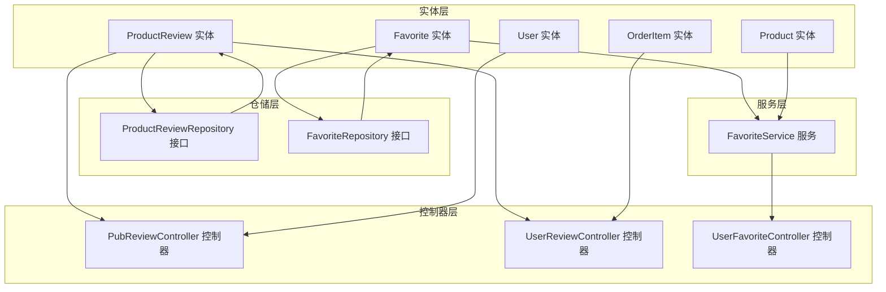
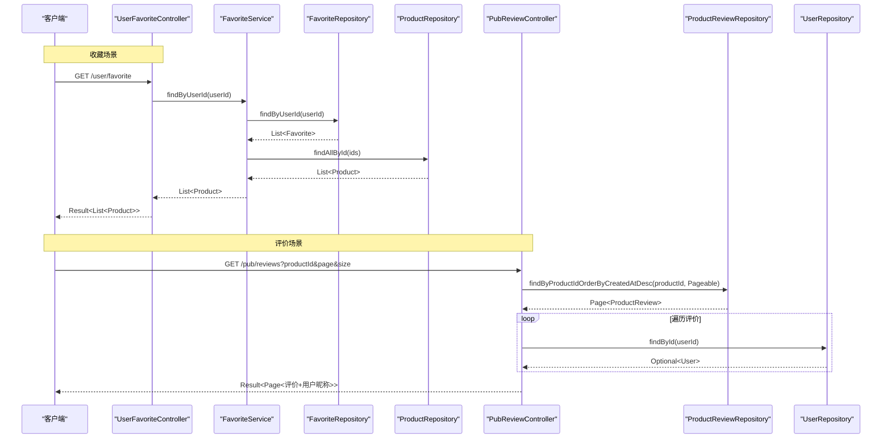
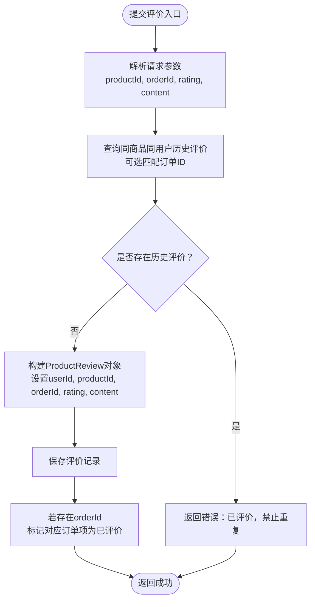
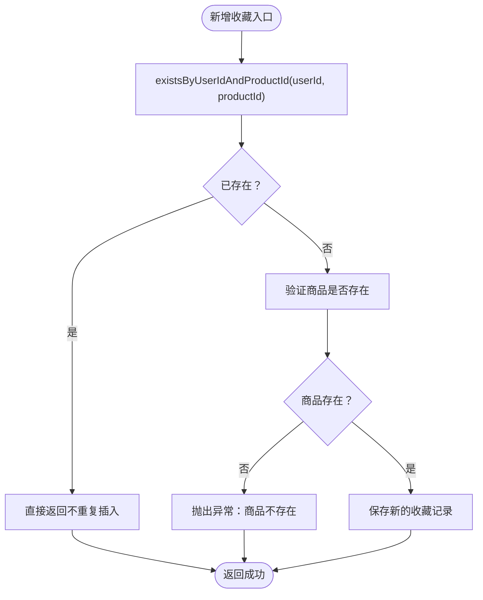
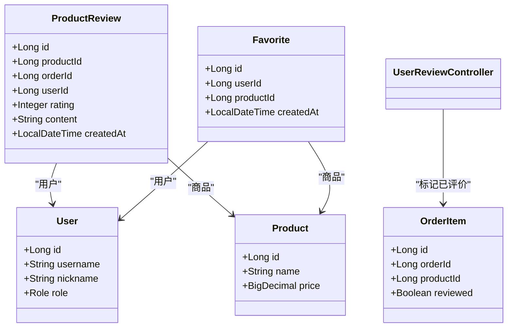

# 评价与收藏实体

<cite>
**本文档引用的文件**
- [ProductReview.java](file://backend/src/main/java/com/mall/entity/ProductReview.java)
- [Favorite.java](file://backend/src/main/java/com/mall/entity/Favorite.java)
- [ProductReviewRepository.java](file://backend/src/main/java/com/mall/repository/ProductReviewRepository.java)
- [FavoriteRepository.java](file://backend/src/main/java/com/mall/repository/FavoriteRepository.java)
- [FavoriteService.java](file://backend/src/main/java/com/mall/service/FavoriteService.java)
- [UserFavoriteController.java](file://backend/src/main/java/com/mall/controller/user/UserFavoriteController.java)
- [PubReviewController.java](file://backend/src/main/java/com/mall/controller/pub/PubReviewController.java)
- [UserReviewController.java](file://backend/src/main/java/com/mall/controller/user/UserReviewController.java)
- [User.java](file://backend/src/main/java/com/mall/entity/User.java)
- [Product.java](file://backend/src/main/java/com/mall/entity/Product.java)
- [OrderItem.java](file://backend/src/main/java/com/mall/entity/OrderItem.java)
- [application.yml](file://backend/src/main/resources/application.yml)
</cite>

## 目录
1. [简介](#简介)
2. [项目结构](#项目结构)
3. [核心组件](#核心组件)
4. [架构总览](#架构总览)
5. [详细组件分析](#详细组件分析)
6. [依赖分析](#依赖分析)
7. [性能考虑](#性能考虑)
8. [故障排除指南](#故障排除指南)
9. [结论](#结论)
10. [附录](#附录)

## 简介
本文件聚焦于两个核心业务实体：商品评价（ProductReview）与收藏（Favorite）。我们将从数据模型设计、字段语义、业务规则、性能优化与扩展性等方面进行系统化梳理，并结合控制器与服务层实现，给出端到端的业务流程图与关键算法流程图，帮助开发者快速理解与维护相关功能。

## 项目结构
围绕评价与收藏功能，后端采用标准的分层架构：
- 实体层：定义持久化模型与约束
- 仓储层：基于Spring Data JPA的仓库接口
- 服务层：封装业务逻辑与事务控制
- 控制器层：对外暴露REST接口

图表来源
- [ProductReview.java:1-44](file://backend/src/main/java/com/mall/entity/ProductReview.java#L1-L44)
- [Favorite.java:1-35](file://backend/src/main/java/com/mall/entity/Favorite.java#L1-L35)
- [ProductReviewRepository.java:1-16](file://backend/src/main/java/com/mall/repository/ProductReviewRepository.java#L1-L16)
- [FavoriteRepository.java:1-19](file://backend/src/main/java/com/mall/repository/FavoriteRepository.java#L1-L19)
- [FavoriteService.java:1-43](file://backend/src/main/java/com/mall/service/FavoriteService.java#L1-L43)
- [PubReviewController.java:1-64](file://backend/src/main/java/com/mall/controller/pub/PubReviewController.java#L1-L64)
- [UserReviewController.java:1-73](file://backend/src/main/java/com/mall/controller/user/UserReviewController.java#L1-L73)
- [UserFavoriteController.java:1-60](file://backend/src/main/java/com/mall/controller/user/UserFavoriteController.java#L1-L60)

章节来源
- [application.yml:1-36](file://backend/src/main/resources/application.yml#L1-L36)

## 核心组件
本节概述两个实体的职责边界与关键字段设计。

- 商品评价（ProductReview）
  - 关联关系：用户（userId）、商品（productId）、可选订单（orderId）
  - 评分机制：整数评分，默认值为5；支持1~5分范围（由上层校验保证）
  - 内容与时间：评价内容长度限制，自动记录创建时间
  - 审核设计：当前未见显式审核字段或状态字段，内容直接入库；如需审核可在现有基础上扩展

- 收藏（Favorite）
  - 关联关系：用户（userId）、商品（productId）
  - 去重逻辑：数据库唯一约束（user_id, product_id），防止重复收藏
  - 时间戳：自动记录创建时间
  - 查询优化：提供按用户查询与按用户+商品查询的仓库方法

章节来源
- [ProductReview.java:17-42](file://backend/src/main/java/com/mall/entity/ProductReview.java#L17-L42)
- [Favorite.java:17-33](file://backend/src/main/java/com/mall/entity/Favorite.java#L17-L33)
- [FavoriteRepository.java:9-18](file://backend/src/main/java/com/mall/repository/FavoriteRepository.java#L9-L18)

## 架构总览
下图展示从用户请求到数据持久化的完整调用链路，涵盖收藏与评价两大场景。

图表来源
- [UserFavoriteController.java:28-32](file://backend/src/main/java/com/mall/controller/user/UserFavoriteController.java#L28-L32)
- [FavoriteService.java:21-25](file://backend/src/main/java/com/mall/service/FavoriteService.java#L21-L25)
- [FavoriteRepository.java:11](file://backend/src/main/java/com/mall/repository/FavoriteRepository.java#L11)
- [PubReviewController.java:29-61](file://backend/src/main/java/com/mall/controller/pub/PubReviewController.java#L29-L61)
- [ProductReviewRepository.java:12](file://backend/src/main/java/com/mall/repository/ProductReviewRepository.java#L12)

## 详细组件分析

### 商品评价实体（ProductReview）
- 字段设计
  - 主键与标识：自增主键
  - 关联字段：商品ID、订单ID（可空）、用户ID
  - 评分：整型，带默认值；前端应限制在合理范围
  - 内容：字符串，长度上限；为空时可写入空串
  - 时间：创建时间自动注入，不可更新
- 业务规则
  - 重复评价防护：同一用户对同一商品（可选同一订单）不允许重复提交
  - 订单项标记：提交评价后，对应订单项标记为“已评价”
- 数据流与处理逻辑

图表来源
- [UserReviewController.java:33-71](file://backend/src/main/java/com/mall/controller/user/UserReviewController.java#L33-L71)
- [ProductReviewRepository.java:14](file://backend/src/main/java/com/mall/repository/ProductReviewRepository.java#L14)

章节来源
- [ProductReview.java:17-42](file://backend/src/main/java/com/mall/entity/ProductReview.java#L17-L42)
- [UserReviewController.java:33-71](file://backend/src/main/java/com/mall/controller/user/UserReviewController.java#L33-L71)
- [OrderItem.java:60-63](file://backend/src/main/java/com/mall/entity/OrderItem.java#L60-L63)

### 收藏实体（Favorite）
- 字段设计
  - 主键与标识：自增主键
  - 关联字段：用户ID、商品ID
  - 唯一约束：(user_id, product_id)，天然去重
  - 时间：创建时间自动注入
- 业务规则
  - 增加收藏：若已存在则忽略；若商品不存在则抛出异常
  - 删除收藏：按用户+商品删除
  - 查询收藏：按用户查询所有收藏商品
  - 检查收藏：判断某用户是否收藏某商品
- 数据流与处理逻辑

图表来源
- [FavoriteService.java:31-36](file://backend/src/main/java/com/mall/service/FavoriteService.java#L31-L36)
- [FavoriteRepository.java:15](file://backend/src/main/java/com/mall/repository/FavoriteRepository.java#L15)

章节来源
- [Favorite.java:17-33](file://backend/src/main/java/com/mall/entity/Favorite.java#L17-L33)
- [FavoriteRepository.java:9-18](file://backend/src/main/java/com/mall/repository/FavoriteRepository.java#L9-L18)
- [FavoriteService.java:21-41](file://backend/src/main/java/com/mall/service/FavoriteService.java#L21-L41)

### 评价与收藏的业务价值分析
- 评价（ProductReview）
  - 信任与口碑：用户真实反馈提升平台可信度
  - 质量监控：通过评分分布与内容分析发现产品问题
  - 推荐依据：为后续协同过滤与个性化推荐提供输入
  - 订单闭环：标记订单项已评价，完善购后流程
- 收藏（Favorite）
  - 用户偏好建模：收藏行为作为兴趣信号，支撑推荐系统
  - 转化促进：收藏商品便于二次购买，提高转化率
  - 去重与一致性：唯一约束确保收藏集合的准确性
  - 查询优化：按用户聚合收藏，减少跨表JOIN成本

## 依赖分析
- 实体间关系
  - ProductReview 与 User：一对多（用户可有多条评价）
  - ProductReview 与 Product：一对多（商品可有多条评价）
  - Favorite 与 User：一对多（用户可有多条收藏）
  - Favorite 与 Product：一对多（商品可被多人收藏）
  - UserReviewController 依赖 OrderItem 以标记已评价
- 仓储与服务
  - FavoriteService 使用 FavoriteRepository 与 ProductRepository 组合查询
  - PubReviewController 使用 ProductReviewRepository 与 UserRepository 组合返回带用户昵称的评价列表

图表来源
- [ProductReview.java:17-42](file://backend/src/main/java/com/mall/entity/ProductReview.java#L17-L42)
- [Favorite.java:17-33](file://backend/src/main/java/com/mall/entity/Favorite.java#L17-L33)
- [User.java:17-88](file://backend/src/main/java/com/mall/entity/User.java#L17-L88)
- [Product.java:16-101](file://backend/src/main/java/com/mall/entity/Product.java#L16-L101)
- [OrderItem.java:16-73](file://backend/src/main/java/com/mall/entity/OrderItem.java#L16-L73)

章节来源
- [UserReviewController.java:23-29](file://backend/src/main/java/com/mall/controller/user/UserReviewController.java#L23-L29)
- [PubReviewController.java:25-26](file://backend/src/main/java/com/mall/controller/pub/PubReviewController.java#L25-L26)

## 性能考虑
- 收藏查询优化
  - 已有按用户查询与按用户+商品查询的方法，建议在高频查询路径上增加索引（如 user_id、product_id）
  - 批量查询商品详情时使用批量加载（findAllById），避免N+1问题
- 评价分页与关联
  - 分页查询按创建时间倒序，适合瀑布流展示
  - 为评价列表补充用户昵称时，建议在DAO层或DTO映射阶段合并，减少多次查询
- 唯一约束与并发
  - 收藏唯一约束由数据库保证，避免重复插入；在高并发下仍建议在服务层做幂等检查（当前已实现）
- 事务与一致性
  - 收藏新增与商品存在性校验应在同一事务内，避免脏读
  - 评价提交与订单项标记在同一事务内，确保一致性

## 故障排除指南
- 收藏失败
  - 现象：新增收藏返回失败
  - 可能原因：商品不存在、数据库唯一约束冲突
  - 处理建议：确认商品ID有效性；检查是否已收藏；查看日志定位异常
- 重复评价
  - 现象：提交评价提示已评价
  - 可能原因：同一用户对同一商品已有评价
  - 处理建议：引导用户修改或删除旧评价后再提交
- 评价列表缺失用户昵称
  - 现象：评价列表显示匿名用户
  - 可能原因：用户不存在或昵称为空
  - 处理建议：完善用户信息或兜底显示用户名

章节来源
- [FavoriteService.java:31-36](file://backend/src/main/java/com/mall/service/FavoriteService.java#L31-L36)
- [UserReviewController.java:40-47](file://backend/src/main/java/com/mall/controller/user/UserReviewController.java#L40-L47)
- [PubReviewController.java:45-52](file://backend/src/main/java/com/mall/controller/pub/PubReviewController.java#L45-L52)

## 结论
- ProductReview与Favorite均采用简洁明确的字段设计，满足核心业务需求
- 收藏通过唯一约束与服务层幂等检查实现去重，查询路径清晰
- 评价通过重复防护与订单项标记形成闭环，便于后续推荐与质量分析
- 建议在现有基础上扩展审核字段与状态管理，以增强内容治理能力

## 附录
- 接口与实体对照
  - 收藏接口：GET /user/favorite、GET /user/favorite/check、POST /user/favorite/add、DELETE /user/favorite/{productId}
  - 评价接口：GET /pub/reviews、POST /user/review
- 数据库配置参考
  - 数据源与JPA方言、DDL策略等配置位于应用配置文件中

章节来源
- [UserFavoriteController.java:28-58](file://backend/src/main/java/com/mall/controller/user/UserFavoriteController.java#L28-L58)
- [PubReviewController.java:29-61](file://backend/src/main/java/com/mall/controller/pub/PubReviewController.java#L29-L61)
- [application.yml:4-17](file://backend/src/main/resources/application.yml#L4-L17)