# 数据模型设计

<cite>
**本文引用的文件**
- [User.java](file://backend/src/main/java/com/mall/entity/User.java)
- [Product.java](file://backend/src/main/java/com/mall/entity/Product.java)
- [Order.java](file://backend/src/main/java/com/mall/entity/Order.java)
- [Category.java](file://backend/src/main/java/com/mall/entity/Category.java)
- [Address.java](file://backend/src/main/java/com/mall/entity/Address.java)
- [Merchant.java](file://backend/src/main/java/com/mall/entity/Merchant.java)
- [OrderItem.java](file://backend/src/main/java/com/mall/entity/OrderItem.java)
- [CartItem.java](file://backend/src/main/java/com/mall/entity/CartItem.java)
- [Favorite.java](file://backend/src/main/java/com/mall/entity/Favorite.java)
- [ProductReview.java](file://backend/src/main/java/com/mall/entity/ProductReview.java)
- [Role.java](file://backend/src/main/java/com/mall/common/Role.java)
- [ProductRepository.java](file://backend/src/main/java/com/mall/repository/ProductRepository.java)
- [OrderRepository.java](file://backend/src/main/java/com/mall/repository/OrderRepository.java)
- [UserRepository.java](file://backend/src/main/java/com/mall/repository/UserRepository.java)
- [ProductCreateRequest.java](file://backend/src/main/java/com/mall/dto/ProductCreateRequest.java)
</cite>

## 目录
1. [简介](#简介)
2. [项目结构](#项目结构)
3. [核心组件](#核心组件)
4. [架构总览](#架构总览)
5. [详细组件分析](#详细组件分析)
6. [依赖分析](#依赖分析)
7. [性能考虑](#性能考虑)
8. [故障排查指南](#故障排查指南)
9. [结论](#结论)
10. [附录](#附录)

## 简介
本文件面向电商商城系统的核心数据模型，围绕 JPA 实体类进行系统化梳理，覆盖用户(User)、商品(Product)、订单(Order)、分类(Category)、地址(Address)、商户(Merchant)、订单项(OrderItem)、购物车(CartItem)、收藏(Favorite)、商品评价(ProductReview)等实体。重点阐述字段定义、关系映射、约束条件、索引策略、Lombok 注解使用、实体生命周期回调以及数据验证规则，并通过 ER 图与实体关系图帮助开发者快速把握整体数据库设计。

## 项目结构
后端采用 Spring Boot + JPA 的分层组织方式，实体位于 entity 包，仓库接口位于 repository 包，业务 DTO 位于 dto 包，通用枚举位于 common 包。实体与仓库接口共同构成数据模型与访问层。

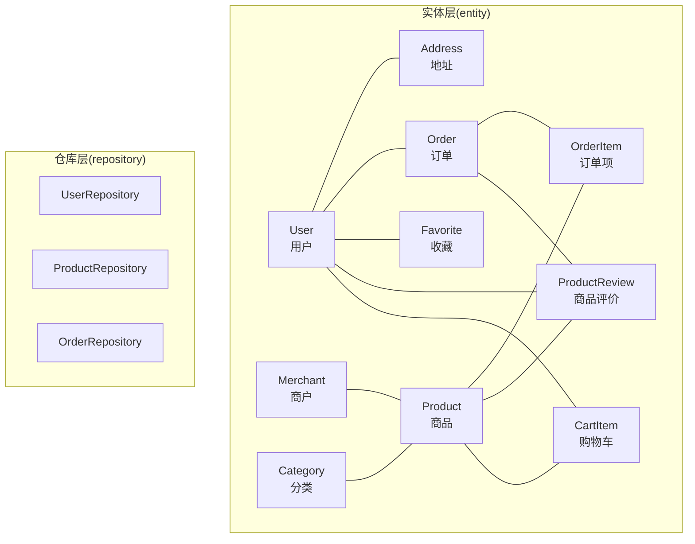

图表来源
- [User.java:73-75](file://backend/src/main/java/com/mall/entity/User.java#L73-L75)
- [Address.java:15-17](file://backend/src/main/java/com/mall/entity/Address.java#L15-L17)
- [Order.java:25-29](file://backend/src/main/java/com/mall/entity/Order.java#L25-L29)
- [OrderItem.java:22-26](file://backend/src/main/java/com/mall/entity/OrderItem.java#L22-L26)
- [Product.java:22-26](file://backend/src/main/java/com/mall/entity/Product.java#L22-L26)
- [Category.java:24-25](file://backend/src/main/java/com/mall/entity/Category.java#L24-L25)
- [CartItem.java:21-28](file://backend/src/main/java/com/mall/entity/CartItem.java#L21-L28)
- [Favorite.java:21-25](file://backend/src/main/java/com/mall/entity/Favorite.java#L21-L25)
- [ProductReview.java:21-28](file://backend/src/main/java/com/mall/entity/ProductReview.java#L21-L28)

章节来源
- [User.java:10-87](file://backend/src/main/java/com/mall/entity/User.java#L10-L87)
- [Product.java:9-100](file://backend/src/main/java/com/mall/entity/Product.java#L9-L100)
- [Order.java:9-82](file://backend/src/main/java/com/mall/entity/Order.java#L9-L82)
- [Category.java:8-40](file://backend/src/main/java/com/mall/entity/Category.java#L8-L40)
- [Address.java:7-59](file://backend/src/main/java/com/mall/entity/Address.java#L7-L59)
- [Merchant.java:8-55](file://backend/src/main/java/com/mall/entity/Merchant.java#L8-L55)
- [OrderItem.java:9-72](file://backend/src/main/java/com/mall/entity/OrderItem.java#L9-L72)
- [CartItem.java:8-49](file://backend/src/main/java/com/mall/entity/CartItem.java#L8-L49)
- [Favorite.java:8-34](file://backend/src/main/java/com/mall/entity/Favorite.java#L8-L34)
- [ProductReview.java:8-43](file://backend/src/main/java/com/mall/entity/ProductReview.java#L8-L43)

## 核心组件
- 用户(User)
  - 关键字段：用户名唯一、密码脱敏、角色枚举、默认收货人信息、启用状态、时间戳。
  - 关系：一对多拥有地址；一对多收藏；一对多评价；一对多订单；与商户存在运营关联 merchantId。
  - 约束：username 唯一；createdAt 不可更新；Lombok 构造器与 Builder。
  - 生命周期：@PrePersist/@PreUpdate 统一注入时间戳。
- 商品(Product)
  - 关键字段：所属商户与分类、名称、描述、详情、图片集、品牌、属性、价格、库存、销量、上下架状态、新品标记。
  - 关系：与商户、分类、订单项、购物车、收藏、评价存在关联。
  - 约束：价格精度与小数位；stock/sales 默认值；onSale 默认上架；Lombok 构造器与 Builder。
  - 生命周期：@PrePersist/@PreUpdate 统一注入时间戳。
- 订单(Order)
  - 关键字段：订单号唯一、用户与商户、状态、金额、支付信息、收货人信息、退款状态与时间。
  - 关系：与用户、商户、订单项存在一对多关系。
  - 约束：orderNo 唯一；金额精度与小数位；Lombok 构造器与 Builder。
  - 生命周期：@PrePersist/@PreUpdate 统一注入时间戳。
- 分类(Category)
  - 关键字段：名称、父级分类、图标、排序、时间戳。
  - 关系：自引用父子层级；与商品一对多。
  - 约束：sortOrder 默认值；createdAt 不可更新；Lombok 构造器与 Builder。
  - 生命周期：@PrePersist 统一注入时间戳。
- 地址(Address)
  - 关键字段：归属用户、收货人、电话、省市区、详细地址、默认标记、时间戳。
  - 关系：多对一归属用户。
  - 约束：isDefault 默认否；Lombok @Data。
  - 生命周期：@PrePersist/@PreUpdate 统一注入时间戳。
- 商户(Merchant)
  - 关键字段：名称、描述、Logo、联系方式、启用状态、时间戳。
  - 关系：一对多商品。
  - 约束：enabled 默认启用；Lombok 构造器与 Builder。
  - 生命周期：@PrePersist/@PreUpdate 统一注入时间戳。
- 订单项(OrderItem)
  - 关键字段：归属订单与商品、快照名称与图片、单价、数量、规格快照、小计、退款状态与原因、是否评价。
  - 关系：与订单、商品存在多对一。
  - 约束：reviewed 默认未评价；Lombok 构造器与 Builder。
  - 生命周期：@PrePersist 统一注入时间戳。
- 购物车(CartItem)
  - 关键字段：用户、商品、规格、数量；唯一约束(user_id, product_id, spec_id)。
  - 关系：与用户、商品存在多对一。
  - 约束：quantity 默认1；唯一约束；Lombok 构造器与 Builder。
  - 生命周期：@PrePersist/@PreUpdate 统一注入时间戳。
- 收藏(Favorite)
  - 关键字段：用户、商品；唯一约束(user_id, product_id)。
  - 关系：与用户、商品存在多对一。
  - 约束：唯一约束；Lombok 构造器与 Builder。
  - 生命周期：@PrePersist 统一注入时间戳。
- 商品评价(ProductReview)
  - 关键字段：商品、订单、用户、评分、内容、时间戳。
  - 关系：与商品、订单、用户存在多对一。
  - 约束：rating 默认满分；Lombok 构造器与 Builder。
  - 生命周期：@PrePersist 统一注入时间戳。

章节来源
- [User.java:17-87](file://backend/src/main/java/com/mall/entity/User.java#L17-L87)
- [Product.java:16-100](file://backend/src/main/java/com/mall/entity/Product.java#L16-L100)
- [Order.java:16-82](file://backend/src/main/java/com/mall/entity/Order.java#L16-L82)
- [Category.java:15-40](file://backend/src/main/java/com/mall/entity/Category.java#L15-L40)
- [Address.java:10-59](file://backend/src/main/java/com/mall/entity/Address.java#L10-L59)
- [Merchant.java:15-55](file://backend/src/main/java/com/mall/entity/Merchant.java#L15-L55)
- [OrderItem.java:16-72](file://backend/src/main/java/com/mall/entity/OrderItem.java#L16-L72)
- [CartItem.java:15-49](file://backend/src/main/java/com/mall/entity/CartItem.java#L15-L49)
- [Favorite.java:15-34](file://backend/src/main/java/com/mall/entity/Favorite.java#L15-L34)
- [ProductReview.java:15-43](file://backend/src/main/java/com/mall/entity/ProductReview.java#L15-L43)
- [Role.java:3-7](file://backend/src/main/java/com/mall/common/Role.java#L3-L7)

## 架构总览
下图展示实体间的主要关系与外键约束，体现一对多与多对一的映射，以及关键唯一约束与索引策略的落地位置。

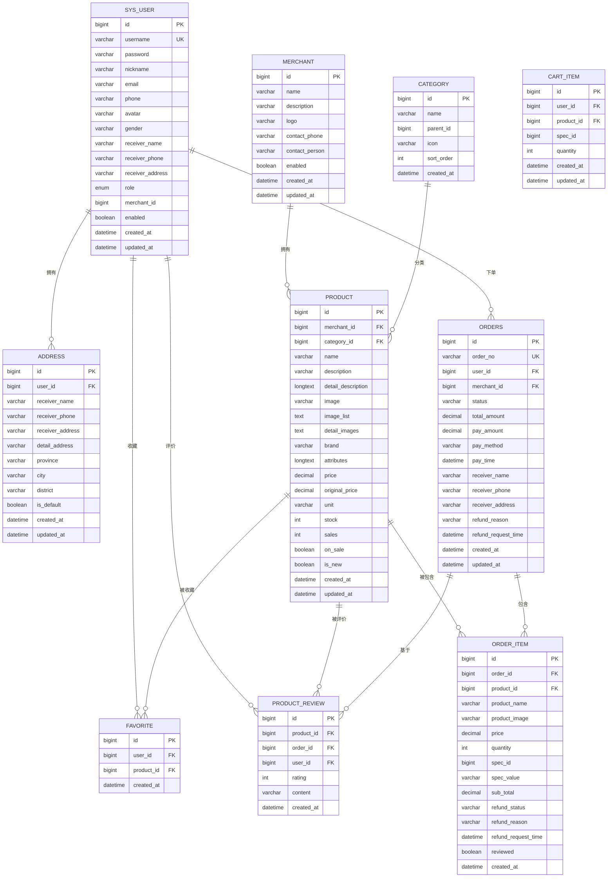

图表来源
- [User.java:19-75](file://backend/src/main/java/com/mall/entity/User.java#L19-L75)
- [Address.java:11-17](file://backend/src/main/java/com/mall/entity/Address.java#L11-L17)
- [Merchant.java:17-37](file://backend/src/main/java/com/mall/entity/Merchant.java#L17-L37)
- [Category.java:17-31](file://backend/src/main/java/com/mall/entity/Category.java#L17-L31)
- [Product.java:18-78](file://backend/src/main/java/com/mall/entity/Product.java#L18-L78)
- [Order.java:18-61](file://backend/src/main/java/com/mall/entity/Order.java#L18-L61)
- [OrderItem.java:18-52](file://backend/src/main/java/com/mall/entity/OrderItem.java#L18-L52)
- [CartItem.java:17-31](file://backend/src/main/java/com/mall/entity/CartItem.java#L17-L31)
- [Favorite.java:17-25](file://backend/src/main/java/com/mall/entity/Favorite.java#L17-L25)
- [ProductReview.java:17-34](file://backend/src/main/java/com/mall/entity/ProductReview.java#L17-L34)

## 详细组件分析

### 用户(User)实体
- 字段与约束
  - 主键自增 id
  - username 唯一且非空，长度限制
  - password 非空，使用 JSON 序列化时忽略
  - 角色枚举 role，非空
  - merchantId 仅在角色为商户时有效
  - 启用状态 enabled，默认 true
  - 时间戳 created_at(不可更新)、updated_at
- 关系映射
  - 一对多地址集合，mappedBy 指向 Address.user
  - 一对多收藏、一对多评价、一对多订单（由其他实体维护外键）
- Lombok 与生命周期
  - @Getter/@Setter/@NoArgsConstructor/@AllArgsConstructor/@Builder
  - @PrePersist/@PreUpdate 注入时间戳
- 外键与索引
  - Address.user_id 外键
  - username 唯一索引
  - createdAt 创建时间索引（建议）

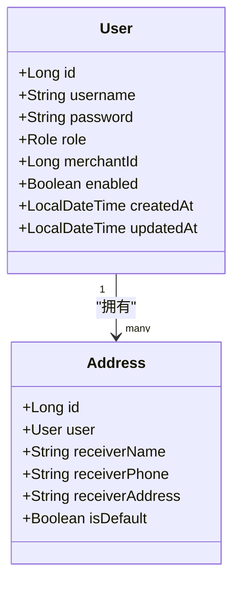

图表来源
- [User.java:17-75](file://backend/src/main/java/com/mall/entity/User.java#L17-L75)
- [Address.java:15-17](file://backend/src/main/java/com/mall/entity/Address.java#L15-L17)

章节来源
- [User.java:17-87](file://backend/src/main/java/com/mall/entity/User.java#L17-L87)
- [UserRepository.java:10-19](file://backend/src/main/java/com/mall/repository/UserRepository.java#L10-L19)

### 商品(Product)实体
- 字段与约束
  - 主键自增 id
  - merchantId 必填，categoryId 可空
  - 名称、描述、详情、图片集、品牌、属性、价格、原价、单位、库存、销量、上下架、新品标记
  - 价格与原价精度与小数位控制
  - 默认值：unit、stock、sales、onSale、isNew
  - 时间戳 created_at(不可更新)、updated_at
- 关系映射
  - 与 Merchant 多对一
  - 与 Category 多对一
  - 与 OrderItem 一对多
  - 与 CartItem 一对多
  - 与 Favorite 一对多
  - 与 ProductReview 一对多
- Lombok 与生命周期
  - @Getter/@Setter/@NoArgsConstructor/@AllArgsConstructor/@Builder
  - @PrePersist/@PreUpdate 注入时间戳
- 外键与索引
  - merchant_id、category_id 外键
  - onSale、categoryId、merchantId、isNew 等常用查询字段（建议建立索引）

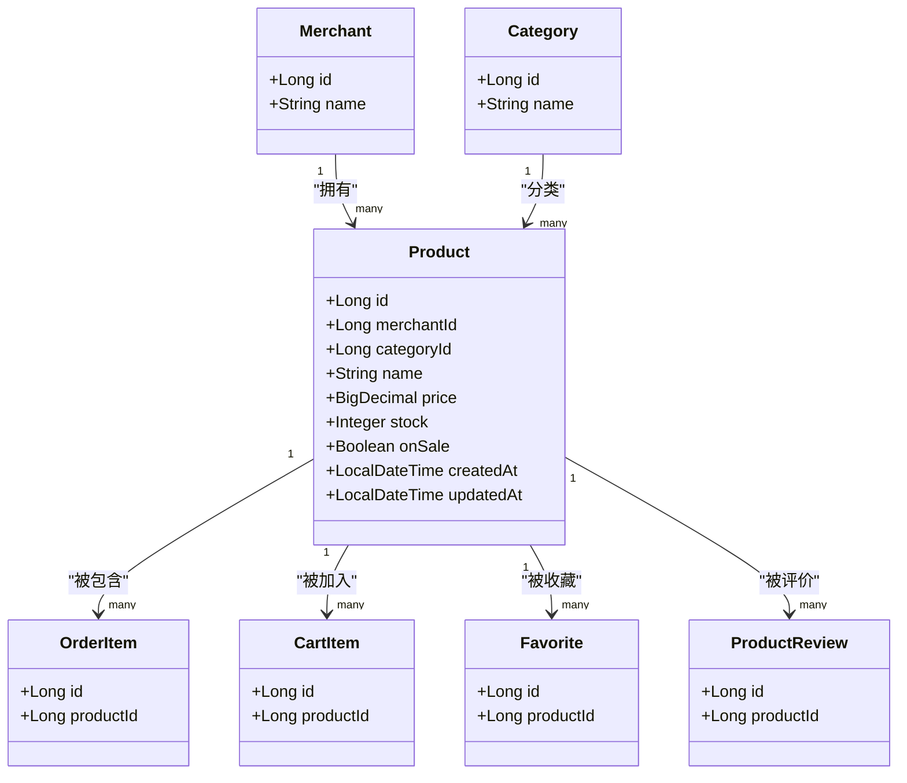

图表来源
- [Product.java:16-78](file://backend/src/main/java/com/mall/entity/Product.java#L16-L78)
- [Merchant.java:15-37](file://backend/src/main/java/com/mall/entity/Merchant.java#L15-L37)
- [Category.java:15-31](file://backend/src/main/java/com/mall/entity/Category.java#L15-L31)
- [OrderItem.java:16-26](file://backend/src/main/java/com/mall/entity/OrderItem.java#L16-L26)
- [CartItem.java:15-28](file://backend/src/main/java/com/mall/entity/CartItem.java#L15-L28)
- [Favorite.java:15-25](file://backend/src/main/java/com/mall/entity/Favorite.java#L15-L25)
- [ProductReview.java:15-28](file://backend/src/main/java/com/mall/entity/ProductReview.java#L15-L28)

章节来源
- [Product.java:16-100](file://backend/src/main/java/com/mall/entity/Product.java#L16-L100)
- [ProductRepository.java:13-124](file://backend/src/main/java/com/mall/repository/ProductRepository.java#L13-L124)

### 订单(Order)实体
- 字段与约束
  - 主键自增 id
  - orderNo 唯一且非空
  - user_id、merchant_id 必填
  - 订单状态、金额、支付方式、支付时间
  - 收货人信息、退款状态与时间
  - 时间戳 created_at(不可更新)、updated_at
- 关系映射
  - 与 User 多对一
  - 与 Merchant 多对一
  - 与 OrderItem 一对多
- Lombok 与生命周期
  - @Getter/@Setter/@NoArgsConstructor/@AllArgsConstructor/@Builder
  - @PrePersist/@PreUpdate 注入时间戳
- 外键与索引
  - user_id、merchant_id 外键
  - order_no 唯一索引
  - userId、merchantId、status 等常用查询字段（建议建立索引）

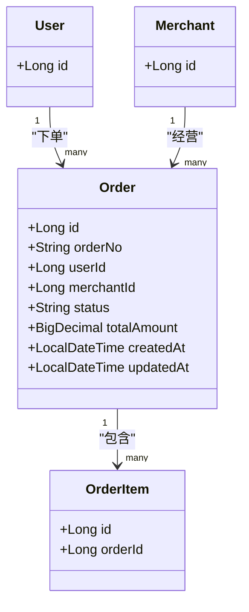

图表来源
- [Order.java:16-70](file://backend/src/main/java/com/mall/entity/Order.java#L16-L70)
- [User.java:19-21](file://backend/src/main/java/com/mall/entity/User.java#L19-L21)
- [Merchant.java:17-21](file://backend/src/main/java/com/mall/entity/Merchant.java#L17-L21)
- [OrderItem.java:16-23](file://backend/src/main/java/com/mall/entity/OrderItem.java#L16-L23)

章节来源
- [Order.java:16-82](file://backend/src/main/java/com/mall/entity/Order.java#L16-L82)
- [OrderRepository.java:13-27](file://backend/src/main/java/com/mall/repository/OrderRepository.java#L13-L27)

### 分类(Category)实体
- 字段与约束
  - 主键自增 id
  - name 非空，parentId 自引用
  - icon、sortOrder 默认值
  - createdAt 不可更新
- 关系映射
  - 与 Product 一对多
- Lombok 与生命周期
  - @Getter/@Setter/@NoArgsConstructor/@AllArgsConstructor/@Builder
  - @PrePersist 注入时间戳
- 外键与索引
  - categoryId 外键（在 Product 中）
  - sort_order、parent_id 等查询字段（建议建立索引）

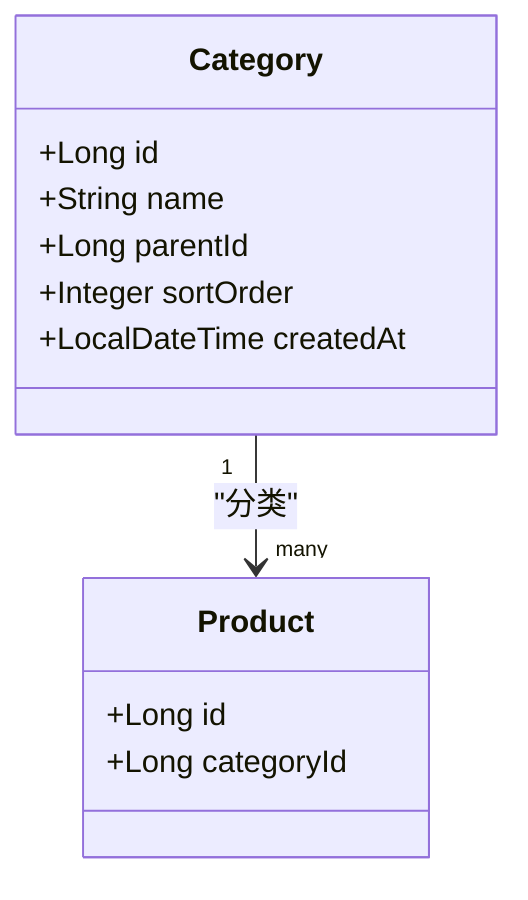

图表来源
- [Category.java:15-31](file://backend/src/main/java/com/mall/entity/Category.java#L15-L31)
- [Product.java:22-26](file://backend/src/main/java/com/mall/entity/Product.java#L22-L26)

章节来源
- [Category.java:15-40](file://backend/src/main/java/com/mall/entity/Category.java#L15-L40)

### 地址(Address)实体
- 字段与约束
  - 主键自增 id
  - user_id 外键必填
  - 收货人、电话、省市区、详细地址、默认标记
  - 时间戳 created_at、updated_at
- 关系映射
  - 与 User 多对一
- Lombok 与生命周期
  - @Data（生成 getter/setter/toString/equals/hashCode）
  - @PrePersist/@PreUpdate 注入时间戳
- 外键与索引
  - user_id 外键
  - isDefault 默认标记（建议索引）

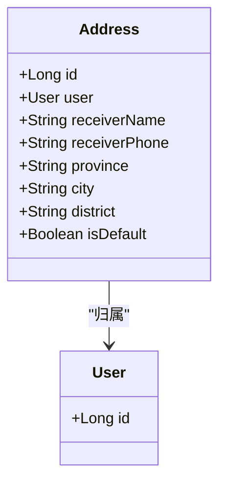

图表来源
- [Address.java:10-47](file://backend/src/main/java/com/mall/entity/Address.java#L10-L47)
- [User.java:19-21](file://backend/src/main/java/com/mall/entity/User.java#L19-L21)

章节来源
- [Address.java:10-59](file://backend/src/main/java/com/mall/entity/Address.java#L10-L59)

### 商户(Merchant)实体
- 字段与约束
  - 主键自增 id
  - name、description、logo、contactPhone、contactPerson
  - enabled 默认启用
  - 时间戳 created_at、updated_at
- 关系映射
  - 与 Product 一对多
- Lombok 与生命周期
  - @Getter/@Setter/@NoArgsConstructor/@AllArgsConstructor/@Builder
  - @PrePersist/@PreUpdate 注入时间戳
- 外键与索引
  - merchant_id 外键（在 Product、User 中）
  - enabled 查询字段（建议索引）

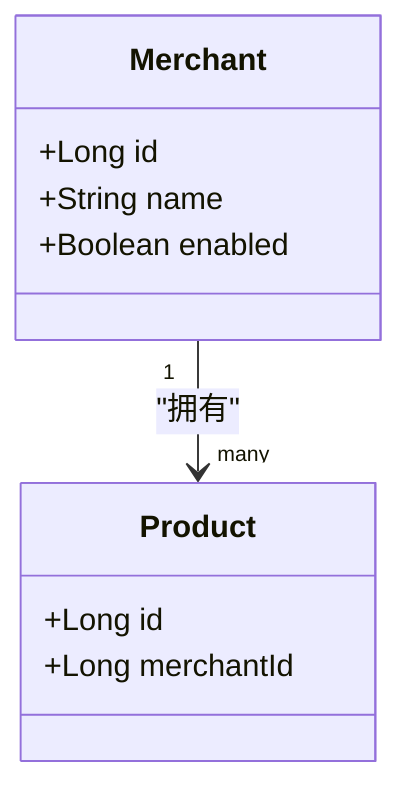

图表来源
- [Merchant.java:15-37](file://backend/src/main/java/com/mall/entity/Merchant.java#L15-L37)
- [Product.java:22-23](file://backend/src/main/java/com/mall/entity/Product.java#L22-L23)
- [User.java:60-62](file://backend/src/main/java/com/mall/entity/User.java#L60-L62)

章节来源
- [Merchant.java:15-55](file://backend/src/main/java/com/mall/entity/Merchant.java#L15-L55)

### 订单项(OrderItem)实体
- 字段与约束
  - 主键自增 id
  - order_id、product_id 必填
  - 快照名称、图片、单价、数量、规格快照、小计
  - 退款状态、原因与时间
  - reviewed 默认未评价
  - created_at 不可更新
- 关系映射
  - 与 Order 多对一
  - 与 Product 多对一
- Lombok 与生命周期
  - @Getter/@Setter/@NoArgsConstructor/@AllArgsConstructor/@Builder
  - @PrePersist 注入时间戳
- 外键与索引
  - order_id、product_id 外键
  - reviewed、refund_status 等查询字段（建议建立索引）

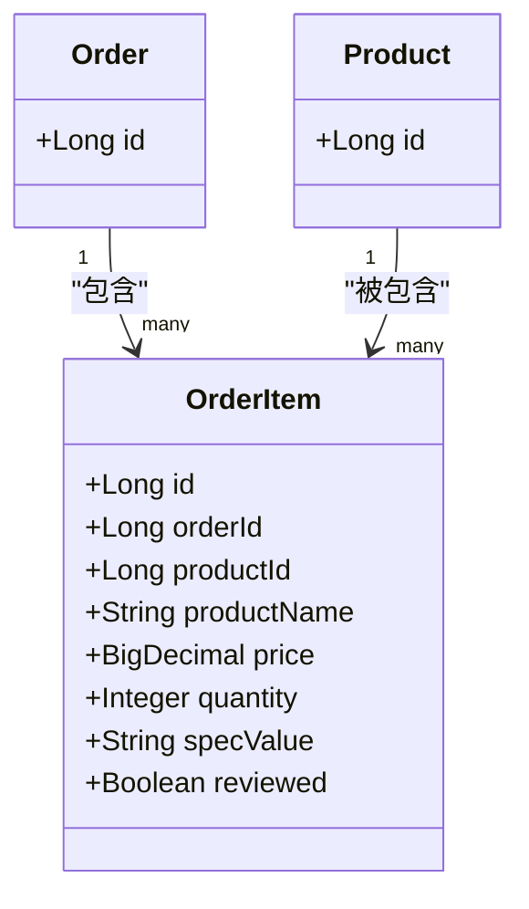

图表来源
- [OrderItem.java:16-52](file://backend/src/main/java/com/mall/entity/OrderItem.java#L16-L52)
- [Order.java:18-23](file://backend/src/main/java/com/mall/entity/Order.java#L18-L23)
- [Product.java:18-21](file://backend/src/main/java/com/mall/entity/Product.java#L18-L21)

章节来源
- [OrderItem.java:16-72](file://backend/src/main/java/com/mall/entity/OrderItem.java#L16-L72)

### 购物车(CartItem)实体
- 字段与约束
  - 主键自增 id
  - user_id、product_id、spec_id 必填
  - quantity 默认1
  - 唯一约束：(user_id, product_id, spec_id)
  - created_at、updated_at
- 关系映射
  - 与 User 多对一
  - 与 Product 多对一
- Lombok 与生命周期
  - @Getter/@Setter/@NoArgsConstructor/@AllArgsConstructor/@Builder
  - @PrePersist/@PreUpdate 注入时间戳
- 外键与索引
  - user_id、product_id、spec_id 外键
  - 唯一索引：(user_id, product_id, spec_id)

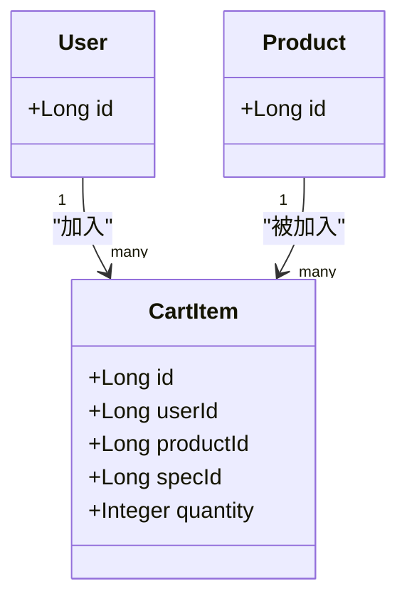

图表来源
- [CartItem.java:15-31](file://backend/src/main/java/com/mall/entity/CartItem.java#L15-L31)
- [User.java:19-21](file://backend/src/main/java/com/mall/entity/User.java#L19-L21)
- [Product.java:18-21](file://backend/src/main/java/com/mall/entity/Product.java#L18-L21)

章节来源
- [CartItem.java:15-49](file://backend/src/main/java/com/mall/entity/CartItem.java#L15-L49)

### 收藏(Favorite)实体
- 字段与约束
  - 主键自增 id
  - user_id、product_id 必填
  - 唯一约束：(user_id, product_id)
  - created_at 不可更新
- 关系映射
  - 与 User 多对一
  - 与 Product 多对一
- Lombok 与生命周期
  - @Getter/@Setter/@NoArgsConstructor/@AllArgsConstructor/@Builder
  - @PrePersist 注入时间戳
- 外键与索引
  - user_id、product_id 外键
  - 唯一索引：(user_id, product_id)

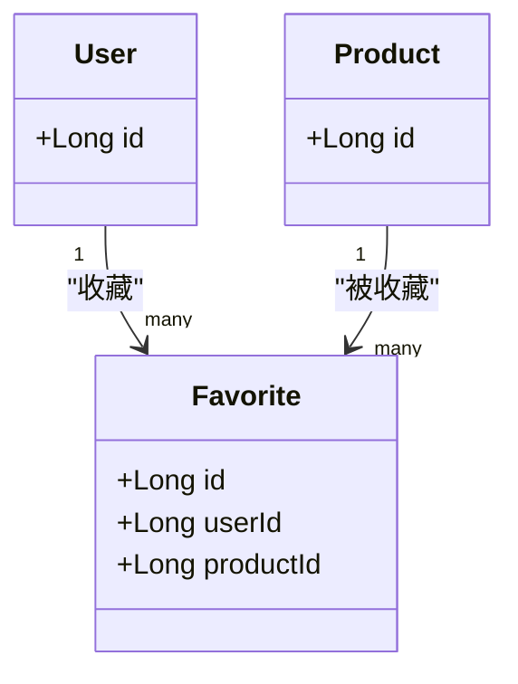

图表来源
- [Favorite.java:15-25](file://backend/src/main/java/com/mall/entity/Favorite.java#L15-L25)
- [User.java:19-21](file://backend/src/main/java/com/mall/entity/User.java#L19-L21)
- [Product.java:18-21](file://backend/src/main/java/com/mall/entity/Product.java#L18-L21)

章节来源
- [Favorite.java:15-34](file://backend/src/main/java/com/mall/entity/Favorite.java#L15-L34)

### 商品评价(ProductReview)实体
- 字段与约束
  - 主键自增 id
  - product_id、user_id 必填
  - order_id 可空（用于关联订单）
  - rating 默认5分
  - content 长度限制
  - created_at 不可更新
- 关系映射
  - 与 Product 多对一
  - 与 Order 多对一
  - 与 User 多对一
- Lombok 与生命周期
  - @Getter/@Setter/@NoArgsConstructor/@AllArgsConstructor/@Builder
  - @PrePersist 注入时间戳
- 外键与索引
  - product_id、user_id、order_id 外键
  - rating、productId、orderId 等查询字段（建议建立索引）

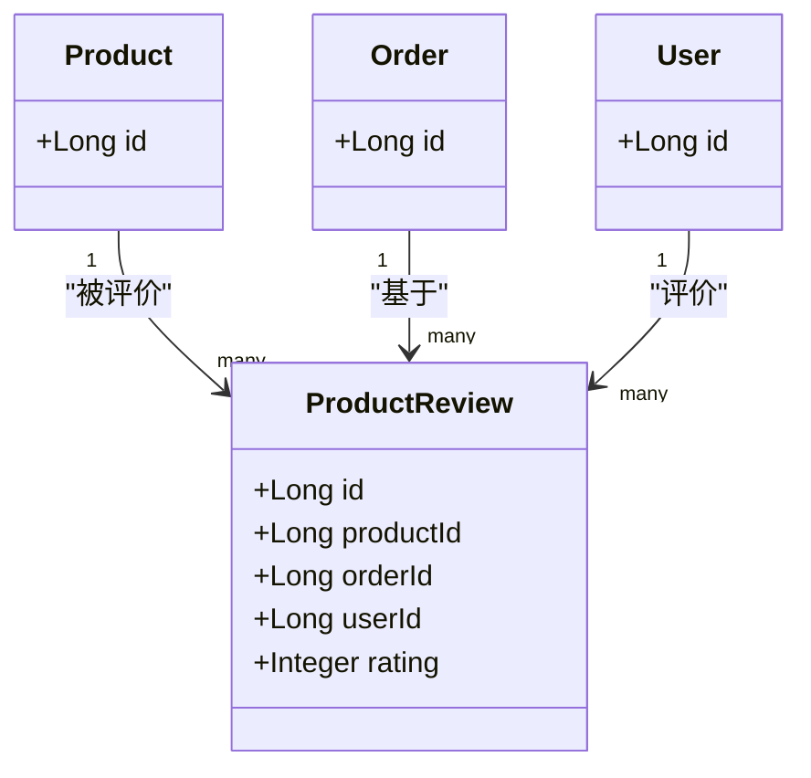

图表来源
- [ProductReview.java:15-34](file://backend/src/main/java/com/mall/entity/ProductReview.java#L15-L34)
- [Product.java:18-21](file://backend/src/main/java/com/mall/entity/Product.java#L18-L21)
- [Order.java:18-23](file://backend/src/main/java/com/mall/entity/Order.java#L18-L23)
- [User.java:19-21](file://backend/src/main/java/com/mall/entity/User.java#L19-L21)

章节来源
- [ProductReview.java:15-43](file://backend/src/main/java/com/mall/entity/ProductReview.java#L15-L43)

### 数据验证与业务规则
- 角色枚举 Role：ADMIN、MERCHANT、USER
- 用户与商户的运营关联：当角色为 MERCHANT 时，merchantId 有效
- 商品上架与商户启用联动：公开查询需同时满足 onSale=true 且 merchant.enabled=true
- 订单状态与退款流程：status 与 refund_* 字段配合实现退款状态管理
- 购物车与收藏的唯一性：通过唯一约束避免重复添加

章节来源
- [Role.java:3-7](file://backend/src/main/java/com/mall/common/Role.java#L3-L7)
- [User.java:60-62](file://backend/src/main/java/com/mall/entity/User.java#L60-L62)
- [ProductRepository.java:34-44](file://backend/src/main/java/com/mall/repository/ProductRepository.java#L34-L44)

## 依赖分析
- 实体间耦合
  - User 与 Address 为典型的“用户-地址”一对多
  - Order 与 OrderItem 为“订单-订单项”一对多
  - Product 与 Category、Merchant 存在多对一
  - Favorite 与 CartItem 通过 user_id、product_id 建立业务去重
- 外部依赖
  - JPA/Hibernate 提供实体映射与生命周期回调
  - Spring Data JPA 提供仓储接口与查询方法
- 循环依赖
  - 当前实体未见循环依赖，关系均为单向外键指向

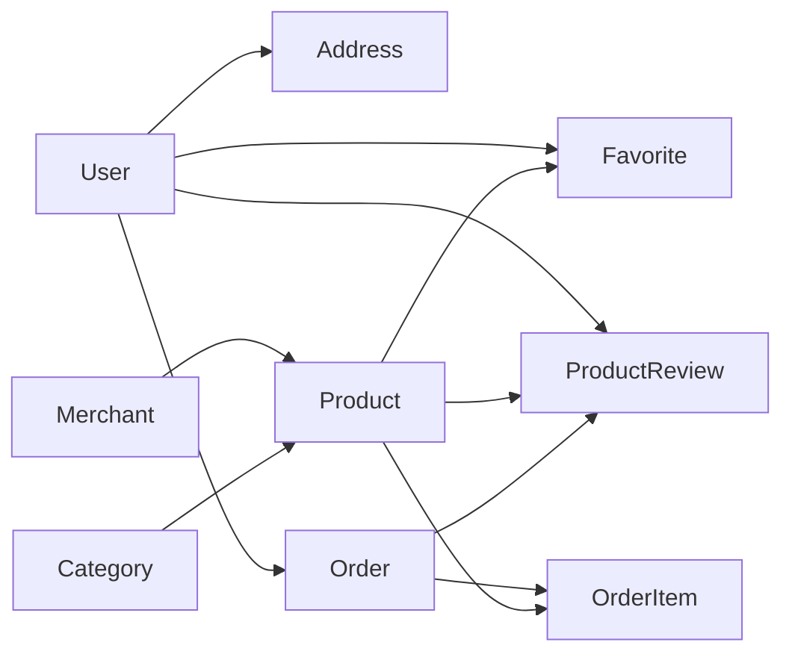

图表来源
- [User.java:73-75](file://backend/src/main/java/com/mall/entity/User.java#L73-L75)
- [Address.java:15-17](file://backend/src/main/java/com/mall/entity/Address.java#L15-L17)
- [Order.java:25-29](file://backend/src/main/java/com/mall/entity/Order.java#L25-L29)
- [OrderItem.java:22-26](file://backend/src/main/java/com/mall/entity/OrderItem.java#L22-L26)
- [Product.java:22-26](file://backend/src/main/java/com/mall/entity/Product.java#L22-L26)
- [Category.java:24-25](file://backend/src/main/java/com/mall/entity/Category.java#L24-L25)
- [Favorite.java:21-25](file://backend/src/main/java/com/mall/entity/Favorite.java#L21-L25)
- [ProductReview.java:21-28](file://backend/src/main/java/com/mall/entity/ProductReview.java#L21-L28)

章节来源
- [User.java:17-87](file://backend/src/main/java/com/mall/entity/User.java#L17-L87)
- [Product.java:16-100](file://backend/src/main/java/com/mall/entity/Product.java#L16-L100)
- [Order.java:16-82](file://backend/src/main/java/com/mall/entity/Order.java#L16-L82)
- [Category.java:15-40](file://backend/src/main/java/com/mall/entity/Category.java#L15-L40)
- [Address.java:10-59](file://backend/src/main/java/com/mall/entity/Address.java#L10-L59)
- [Merchant.java:15-55](file://backend/src/main/java/com/mall/entity/Merchant.java#L15-L55)
- [OrderItem.java:16-72](file://backend/src/main/java/com/mall/entity/OrderItem.java#L16-L72)
- [CartItem.java:15-49](file://backend/src/main/java/com/mall/entity/CartItem.java#L15-L49)
- [Favorite.java:15-34](file://backend/src/main/java/com/mall/entity/Favorite.java#L15-L34)
- [ProductReview.java:15-43](file://backend/src/main/java/com/mall/entity/ProductReview.java#L15-L43)

## 性能考虑
- 索引策略
  - 唯一索引：username（User）、orderNo（Order）、(user_id, product_id, spec_id)（CartItem）、(user_id, product_id)（Favorite）
  - 常用查询字段建议索引：productId、merchantId、categoryId、status、onSale、isNew、sales、createdAt
- 查询优化
  - 使用 Repository 方法或 @Query 进行精准过滤，避免全表扫描
  - 公开查询统一结合 onSale 与 Merchant.enabled 条件，减少无效数据返回
- 缓存与分页
  - 对高频查询结果（如热销、新品、分类商品）引入缓存与分页
- 写入优化
  - 批量插入/更新时注意实体生命周期回调与事务边界

## 故障排查指南
- 常见问题
  - 唯一约束冲突：用户名重复、购物车重复添加、收藏重复
  - 外键缺失：新增订单项时缺少 order_id 或 product_id
  - 时间戳异常：未触发 @PrePersist/@PreUpdate 导致 created_at 为空
- 排查步骤
  - 检查实体注解与唯一约束定义
  - 核对 Repository 查询条件与 SQL 片段
  - 确认业务流程中是否正确设置外键字段
  - 审核 DTO 与实体映射关系（如 ProductCreateRequest）

章节来源
- [User.java:23-28](file://backend/src/main/java/com/mall/entity/User.java#L23-L28)
- [OrderItem.java:22-26](file://backend/src/main/java/com/mall/entity/OrderItem.java#L22-L26)
- [CartItem.java:8-31](file://backend/src/main/java/com/mall/entity/CartItem.java#L8-L31)
- [Favorite.java:9-25](file://backend/src/main/java/com/mall/entity/Favorite.java#L9-L25)
- [ProductCreateRequest.java:14-31](file://backend/src/main/java/com/mall/dto/ProductCreateRequest.java#L14-L31)

## 结论
该数据模型以 JPA 实体为核心，围绕用户、商品、订单、分类、地址、商户等关键领域构建了清晰的一对多与多对一关系。通过 Lombok 简化样板代码，利用 @PrePersist/@PreUpdate 统一时间戳管理，结合唯一约束与外键保证数据一致性。配合 Spring Data JPA 的仓储接口与自定义查询，能够高效支撑管理端与公开端的业务场景。建议后续根据查询热点补充索引并引入缓存机制，进一步提升系统性能与稳定性。

## 附录
- 字段类型与精度参考
  - 金额：decimal(12,2)，确保足够覆盖高价值商品
  - 数量：int，满足常规库存与购买数量
  - 时间戳：datetime，统一使用 Java 8 时间 API
- DTO 映射建议
  - ProductCreateRequest 与 Product 字段一一对应，注意 images 列表转 detailImages 的处理逻辑