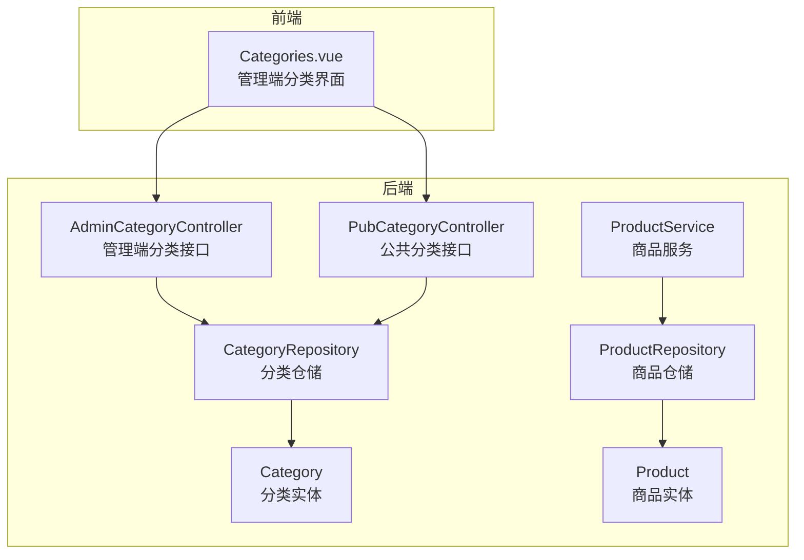
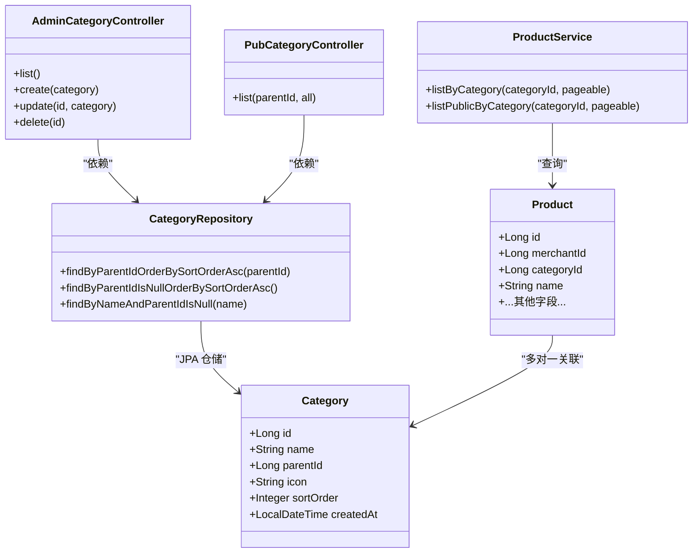
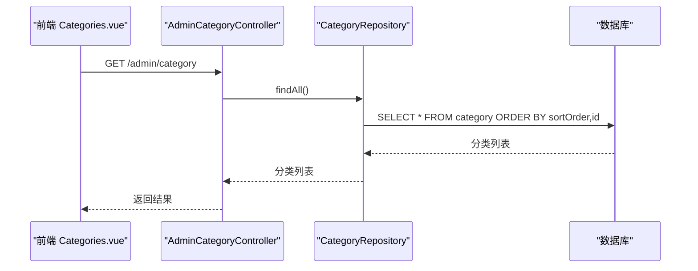
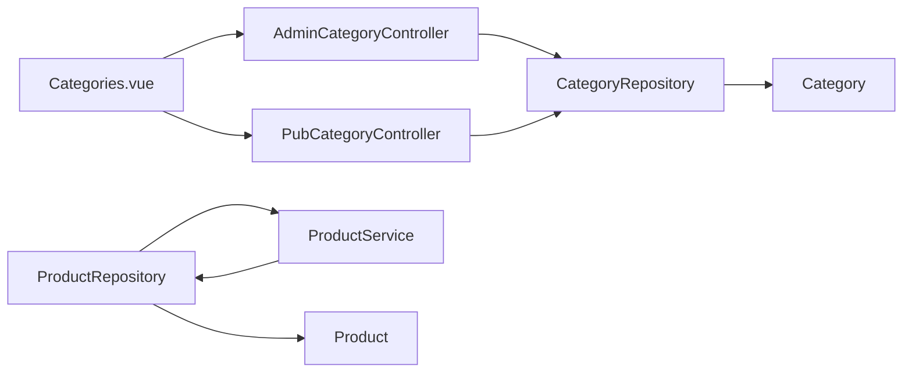
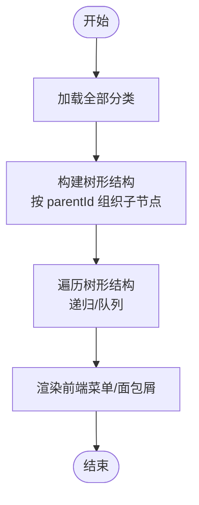

# 分类实体(Category)

<cite>
**本文引用的文件**
- [Category.java](file://backend/src/main/java/com/mall/entity/Category.java)
- [CategoryRepository.java](file://backend/src/main/java/com/mall/repository/CategoryRepository.java)
- [AdminCategoryController.java](file://backend/src/main/java/com/mall/controller/admin/AdminCategoryController.java)
- [PubCategoryController.java](file://backend/src/main/java/com/mall/controller/pub/PubCategoryController.java)
- [Product.java](file://backend/src/main/java/com/mall/entity/Product.java)
- [ProductService.java](file://backend/src/main/java/com/mall/service/ProductService.java)
- [Categories.vue](file://frontend/src/views/admin/Categories.vue)
- [application.yml](file://backend/src/main/resources/application.yml)
- [mall.sql](file://mall.sql)
</cite>

## 目录
1. [简介](#简介)
2. [项目结构](#项目结构)
3. [核心组件](#核心组件)
4. [架构总览](#架构总览)
5. [详细组件分析](#详细组件分析)
6. [依赖分析](#依赖分析)
7. [性能考虑](#性能考虑)
8. [故障排查指南](#故障排查指南)
9. [结论](#结论)
10. [附录](#附录)

## 简介
本文件面向 Category 分类实体，系统性梳理其数据模型、树形结构设计、父子关系实现、排序与层级管理、状态控制以及与商品实体的关联关系。同时提供字段清单、约束与索引设计建议、层级查询与遍历的实现思路，并给出可视化架构与流程图，帮助开发者快速理解与扩展分类体系。

## 项目结构
后端采用 Spring Boot + JPA 的分层架构：
- 实体层：Category、Product 等领域模型
- 数据访问层：CategoryRepository、ProductRepository 等
- 控制器层：AdminCategoryController（管理端）、PubCategoryController（公共端）
- 服务层：ProductService（商品相关查询与业务）
- 前端：Vue 组件 Categories.vue 负责分类管理界面与交互

图表来源
- [AdminCategoryController.java:1-47](file://backend/src/main/java/com/mall/controller/admin/AdminCategoryController.java#L1-L47)
- [PubCategoryController.java:1-38](file://backend/src/main/java/com/mall/controller/pub/PubCategoryController.java#L1-L38)
- [CategoryRepository.java:1-17](file://backend/src/main/java/com/mall/repository/CategoryRepository.java#L1-L17)
- [Category.java:1-41](file://backend/src/main/java/com/mall/entity/Category.java#L1-L41)
- [Product.java:1-101](file://backend/src/main/java/com/mall/entity/Product.java#L1-L101)
- [ProductService.java:1-126](file://backend/src/main/java/com/mall/service/ProductService.java#L1-L126)
- [Categories.vue:1-235](file://frontend/src/views/admin/Categories.vue#L1-L235)

章节来源
- [AdminCategoryController.java:1-47](file://backend/src/main/java/com/mall/controller/admin/AdminCategoryController.java#L1-L47)
- [PubCategoryController.java:1-38](file://backend/src/main/java/com/mall/controller/pub/PubCategoryController.java#L1-L38)
- [CategoryRepository.java:1-17](file://backend/src/main/java/com/mall/repository/CategoryRepository.java#L1-L17)
- [Category.java:1-41](file://backend/src/main/java/com/mall/entity/Category.java#L1-L41)
- [Product.java:1-101](file://backend/src/main/java/com/mall/entity/Product.java#L1-L101)
- [ProductService.java:1-126](file://backend/src/main/java/com/mall/service/ProductService.java#L1-L126)
- [Categories.vue:1-235](file://frontend/src/views/admin/Categories.vue#L1-L235)

## 核心组件
- 分类实体 Category：定义分类的标识、名称、父级、图标、排序、创建时间等字段；通过 JPA 注解映射到数据库表。
- 分类仓储 CategoryRepository：提供按父级查询、顶级查询、按名称+父级为空查询等方法。
- 分类控制器 AdminCategoryController：管理端 CRUD 接口，支持列表、创建、更新、删除。
- 分类控制器 PubCategoryController：公共端接口，支持按父级查询或全量查询（带排序）。
- 商品实体 Product：包含 categoryId 字段，建立与分类的多对一关联。
- 商品服务 ProductService：提供按分类查询商品的业务方法。
- 前端组件 Categories.vue：管理端分类管理界面，负责分类列表、筛选、排序与提交。

章节来源
- [Category.java:1-41](file://backend/src/main/java/com/mall/entity/Category.java#L1-L41)
- [CategoryRepository.java:1-17](file://backend/src/main/java/com/mall/repository/CategoryRepository.java#L1-L17)
- [AdminCategoryController.java:1-47](file://backend/src/main/java/com/mall/controller/admin/AdminCategoryController.java#L1-L47)
- [PubCategoryController.java:1-38](file://backend/src/main/java/com/mall/controller/pub/PubCategoryController.java#L1-L38)
- [Product.java:1-101](file://backend/src/main/java/com/mall/entity/Product.java#L1-L101)
- [ProductService.java:1-126](file://backend/src/main/java/com/mall/service/ProductService.java#L1-L126)
- [Categories.vue:1-235](file://frontend/src/views/admin/Categories.vue#L1-L235)

## 架构总览
分类系统围绕 Category 实体构建树形结构，通过 parentId 指向父节点，sortOrder 控制同级顺序，结合仓储与控制器实现层级查询与管理。

图表来源
- [Category.java:1-41](file://backend/src/main/java/com/mall/entity/Category.java#L1-L41)
- [Product.java:1-101](file://backend/src/main/java/com/mall/entity/Product.java#L1-L101)
- [CategoryRepository.java:1-17](file://backend/src/main/java/com/mall/repository/CategoryRepository.java#L1-L17)
- [AdminCategoryController.java:1-47](file://backend/src/main/java/com/mall/controller/admin/AdminCategoryController.java#L1-L47)
- [PubCategoryController.java:1-38](file://backend/src/main/java/com/mall/controller/pub/PubCategoryController.java#L1-L38)
- [ProductService.java:1-126](file://backend/src/main/java/com/mall/service/ProductService.java#L1-L126)

## 详细组件分析

### 数据模型与字段定义
- 主键与标识
  - id：自增主键，唯一标识每个分类。
- 名称与显示
  - name：非空，长度限制，用于分类名称展示。
  - icon：可选图标路径，用于前端展示。
- 层级与父子关系
  - parentId：指向父分类的 id，允许为 null 表示顶级分类。
- 排序与时间
  - sortOrder：整型排序字段，默认 0，用于同级排序。
  - createdAt：创建时间，不可更新，持久化前自动填充。
- 约束与默认值
  - name 非空且长度有限制。
  - sortOrder 默认 0。
  - parentId 可为空（顶级）。
  - createdAt 不可更新。

章节来源
- [Category.java:17-40](file://backend/src/main/java/com/mall/entity/Category.java#L17-L40)
- [mall.sql:95-103](file://mall.sql#L95-L103)

### 树形结构设计与父子关系
- 顶级分类：parentId 为 null 或 0（根据前端筛选逻辑），表示根节点。
- 子分类：通过 parentId 关联到父分类，形成树形层级。
- 同级排序：使用 sortOrder 升序排列，若同值则按 id 升序，保证稳定排序。
- 仓储查询：
  - 按父级查询子分类并按排序字段升序。
  - 查询顶级分类（父级为空）并按排序字段升序。
  - 按名称与父级为空查询唯一顶级分类（避免重复顶级名称）。

章节来源
- [CategoryRepository.java:11-15](file://backend/src/main/java/com/mall/repository/CategoryRepository.java#L11-L15)
- [PubCategoryController.java:22-36](file://backend/src/main/java/com/mall/controller/pub/PubCategoryController.java#L22-L36)
- [Categories.vue:144-153](file://frontend/src/views/admin/Categories.vue#L144-L153)

### 分类状态控制与层级管理的业务逻辑
- 状态控制：当前代码未直接暴露分类状态字段，如需启用/禁用可在实体中增加布尔字段并在仓储与控制器中扩展。
- 层级管理：
  - 前端 Categories.vue 支持按父级筛选、关键词搜索、排序调整。
  - 控制器 AdminCategoryController 提供 CRUD 接口，便于后台维护。
  - 公共端 PubCategoryController 支持按父级或全量查询，满足前台导航与筛选需求。

章节来源
- [AdminCategoryController.java:20-45](file://backend/src/main/java/com/mall/controller/admin/AdminCategoryController.java#L20-L45)
- [PubCategoryController.java:22-36](file://backend/src/main/java/com/mall/controller/pub/PubCategoryController.java#L22-L36)
- [Categories.vue:107-214](file://frontend/src/views/admin/Categories.vue#L107-L214)

### 分类与商品的关联关系与影响
- 多对一关联：Product.categoryId 指向 Category.id，一个分类可包含多个商品。
- 影响：
  - 商品查询：可通过 ProductService 按分类 ID 查询商品（管理端与公共端均有对应方法）。
  - 商品筛选：前端商品列表可按分类筛选，提升检索效率。
  - 数据一致性：删除分类需谨慎处理，避免孤儿商品或数据不一致。

章节来源
- [Product.java:25](file://backend/src/main/java/com/mall/entity/Product.java#L25)
- [ProductService.java:37-50](file://backend/src/main/java/com/mall/service/ProductService.java#L37-L50)

### 分类层级查询与遍历实现思路
- 仓储查询策略：
  - 顶级分类：按父级为空查询并排序。
  - 子分类：按指定父级查询并排序。
  - 全量查询：在公共端按排序字段升序返回所有分类。
- 前端遍历：
  - 将分类列表转换为树形结构，以 parentId 为键组织子节点。
  - 使用递归或队列进行层级遍历，渲染菜单或面包屑。
- 性能优化建议：
  - 在数据库层面为 parentId 和 sortOrder 建立复合索引，加速查询与排序。
  - 对于大规模分类，采用分页查询与懒加载策略。

图表来源
- [AdminCategoryController.java:21-24](file://backend/src/main/java/com/mall/controller/admin/AdminCategoryController.java#L21-L24)
- [CategoryRepository.java:9](file://backend/src/main/java/com/mall/repository/CategoryRepository.java#L9)

章节来源
- [AdminCategoryController.java:20-24](file://backend/src/main/java/com/mall/controller/admin/AdminCategoryController.java#L20-L24)
- [CategoryRepository.java:9-16](file://backend/src/main/java/com/mall/repository/CategoryRepository.java#L9-L16)

## 依赖分析
- 实体依赖：Category 与 Product 通过外键 categoryId 建立关联。
- 控制器依赖：AdminCategoryController 与 PubCategoryController 依赖 CategoryRepository。
- 服务依赖：ProductService 依赖 ProductRepository 并间接受分类影响。
- 前端依赖：Categories.vue 依赖分类接口，实现筛选与排序。

图表来源
- [Categories.vue:157-168](file://frontend/src/views/admin/Categories.vue#L157-L168)
- [AdminCategoryController.java:18](file://backend/src/main/java/com/mall/controller/admin/AdminCategoryController.java#L18)
- [PubCategoryController.java:19](file://backend/src/main/java/com/mall/controller/pub/PubCategoryController.java#L19)
- [CategoryRepository.java:9](file://backend/src/main/java/com/mall/repository/CategoryRepository.java#L9)
- [ProductService.java:20](file://backend/src/main/java/com/mall/service/ProductService.java#L20)

章节来源
- [Categories.vue:157-168](file://frontend/src/views/admin/Categories.vue#L157-L168)
- [AdminCategoryController.java:18](file://backend/src/main/java/com/mall/controller/admin/AdminCategoryController.java#L18)
- [PubCategoryController.java:19](file://backend/src/main/java/com/mall/controller/pub/PubCategoryController.java#L19)
- [CategoryRepository.java:9](file://backend/src/main/java/com/mall/repository/CategoryRepository.java#L9)
- [ProductService.java:20](file://backend/src/main/java/com/mall/service/ProductService.java#L20)

## 性能考虑
- 数据库索引建议
  - 为 category(parent_id, sort_order) 建立复合索引，提升按父级与排序查询性能。
  - 为 category(sort_order, id) 建立索引，优化全量排序查询。
- 查询策略
  - 优先使用仓储提供的按父级与排序查询，避免全表扫描。
  - 对于前端树形渲染，建议一次性拉取全量分类并本地构建树，减少多次往返。
- 分页与缓存
  - 对于超大分类树，采用分页或懒加载策略。
  - 对静态分类数据可引入缓存，降低数据库压力。

章节来源
- [CategoryRepository.java:11-15](file://backend/src/main/java/com/mall/repository/CategoryRepository.java#L11-L15)
- [PubCategoryController.java:28-34](file://backend/src/main/java/com/mall/controller/pub/PubCategoryController.java#L28-L34)

## 故障排查指南
- 常见问题
  - 重复顶级分类：可通过 findByNameAndParentIdIsNull 避免重复。
  - 排序异常：检查 sortOrder 是否正确设置，前端与后端排序逻辑保持一致。
  - 父级循环引用：前端表单校验禁止父级选择自身。
- 排查步骤
  - 确认数据库索引是否存在，必要时添加复合索引。
  - 检查控制器与仓储方法是否正确调用。
  - 核对前端筛选与排序逻辑，确保与后端一致。

章节来源
- [CategoryRepository.java:15](file://backend/src/main/java/com/mall/repository/CategoryRepository.java#L15)
- [Categories.vue:180-189](file://frontend/src/views/admin/Categories.vue#L180-L189)

## 结论
Category 分类实体通过简洁的字段设计与 JPA 仓储查询，实现了清晰的树形结构与稳定的排序机制。结合 AdminCategoryController 与 PubCategoryController，既能满足管理端的维护需求，也能支撑公共端的展示与筛选。后续可在实体中增加状态字段、完善索引与缓存策略，并在前端增强树形渲染与权限控制，进一步提升系统稳定性与用户体验。

## 附录

### 字段清单与约束
- 字段定义
  - id：主键，自增
  - name：非空，字符串，长度限制
  - parentId：可空，指向父分类
  - icon：可空，字符串，长度限制
  - sortOrder：非空，整数，默认 0
  - createdAt：非空，时间戳，不可更新
- 约束
  - name 非空
  - sortOrder 非空
  - parentId 可空（顶级）
  - createdAt 不可更新

章节来源
- [Category.java:17-40](file://backend/src/main/java/com/mall/entity/Category.java#L17-L40)
- [mall.sql:95-103](file://mall.sql#L95-L103)

### 索引设计建议
- 建议索引
  - category(parent_id, sort_order)：按父级与排序查询
  - category(sort_order, id)：全量排序查询
- 现状
  - 数据库脚本未显式声明索引，实际索引以 Hibernate DDL 或数据库默认为准。

章节来源
- [application.yml:11](file://backend/src/main/resources/application.yml#L11)
- [mall.sql:95-103](file://mall.sql#L95-L103)

### 分类层级查询与遍历流程

图表来源
- [PubCategoryController.java:28-36](file://backend/src/main/java/com/mall/controller/pub/PubCategoryController.java#L28-L36)
- [Categories.vue:120-155](file://frontend/src/views/admin/Categories.vue#L120-L155)