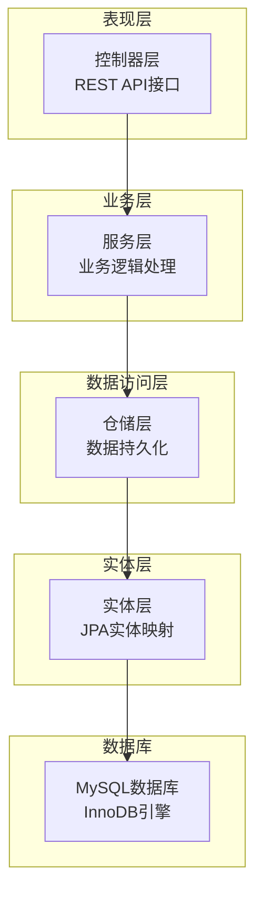
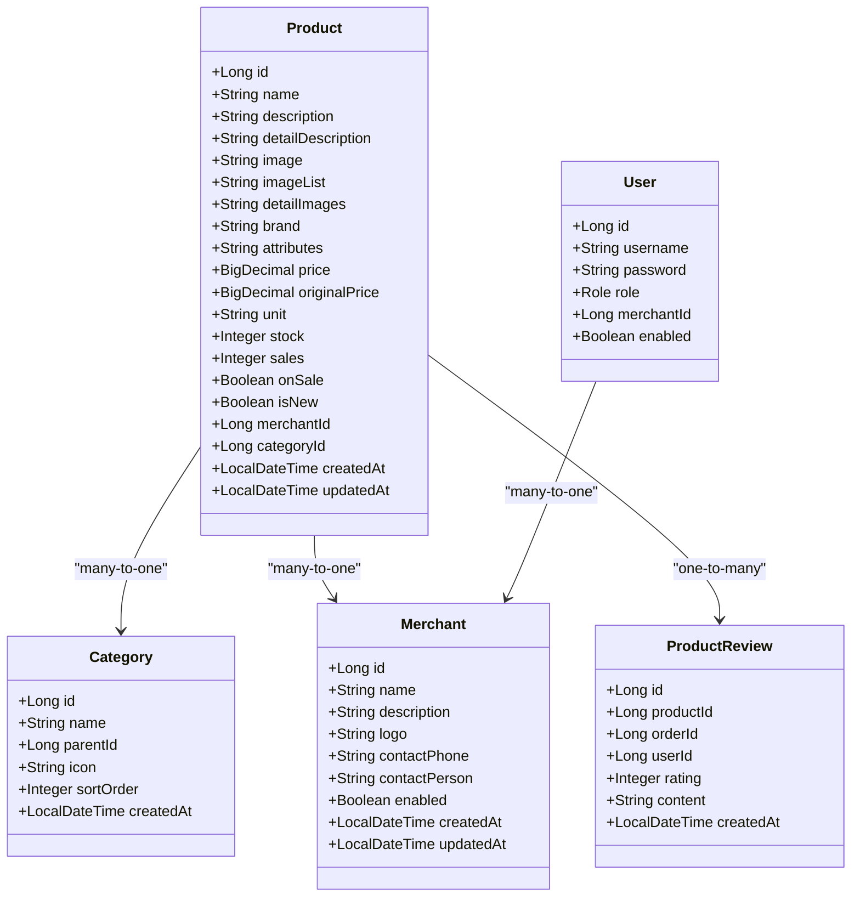
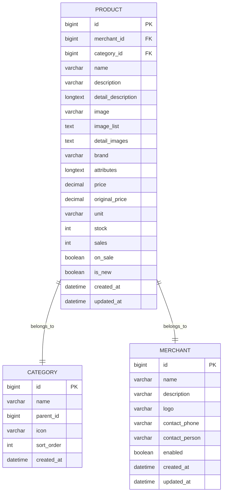
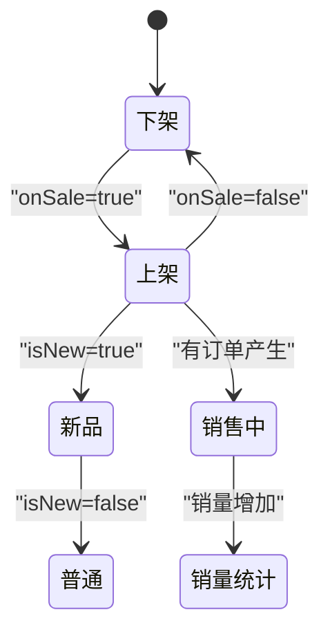
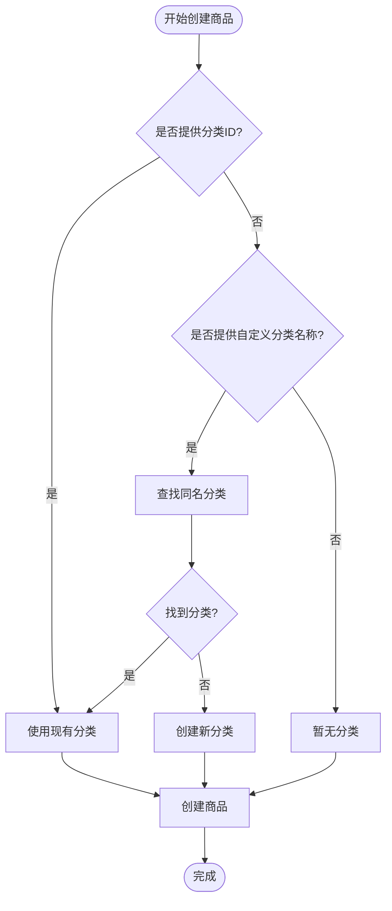
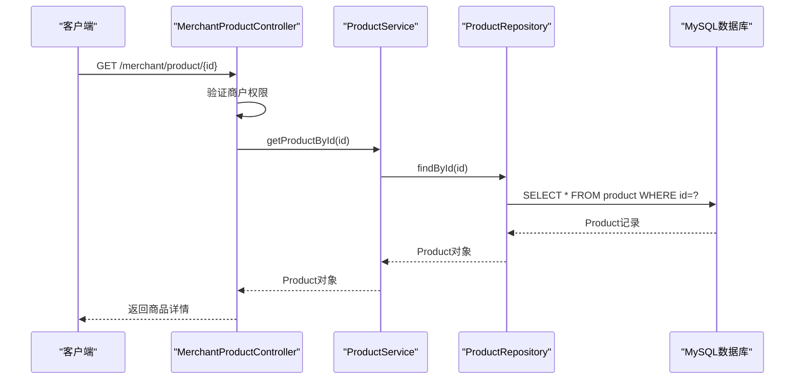
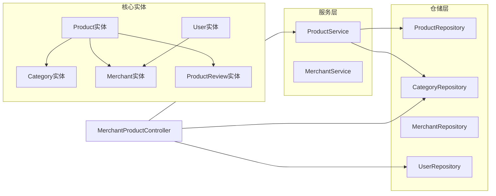

# 商品实体(Product)

<cite>
**本文档引用的文件**
- [Product.java](file://backend/src/main/java/com/mall/entity/Product.java)
- [ProductCreateRequest.java](file://backend/src/main/java/com/mall/dto/ProductCreateRequest.java)
- [ProductRepository.java](file://backend/src/main/java/com/mall/repository/ProductRepository.java)
- [ProductService.java](file://backend/src/main/java/com/mall/service/ProductService.java)
- [MerchantProductController.java](file://backend/src/main/java/com/mall/controller/merchant/MerchantProductController.java)
- [Category.java](file://backend/src/main/java/com/mall/entity/Category.java)
- [Merchant.java](file://backend/src/main/java/com/mall/entity/Merchant.java)
- [User.java](file://backend/src/main/java/com/mall/entity/User.java)
- [CategoryRepository.java](file://backend/src/main/java/com/mall/repository/CategoryRepository.java)
- [MerchantRepository.java](file://backend/src/main/java/com/mall/repository/MerchantRepository.java)
- [application.yml](file://backend/src/main/resources/application.yml)
- [mall.sql](file://mall.sql)
</cite>

## 目录
1. [简介](#简介)
2. [项目结构](#项目结构)
3. [核心组件](#核心组件)
4. [架构概览](#架构概览)
5. [详细组件分析](#详细组件分析)
6. [依赖关系分析](#依赖关系分析)
7. [性能考虑](#性能考虑)
8. [故障排除指南](#故障排除指南)
9. [结论](#结论)
10. [附录](#附录)

## 简介

本文档为Mall商城系统的商品实体(Product)提供全面的数据模型文档。Product实体是系统的核心业务对象，负责存储和管理商品的所有相关信息。该文档深入解析商品实体的字段定义、数据约束、业务逻辑以及与其他实体的关联关系。

系统采用Spring Boot + JPA + MySQL的技术栈，实现了完整的电商商品管理功能，包括商品创建、更新、查询、库存管理等核心业务流程。

## 项目结构

Mall项目的整体架构采用分层设计模式，遵循DDD（领域驱动设计）原则：

**图表来源**
- [Product.java:1-101](file://backend/src/main/java/com/mall/entity/Product.java#L1-L101)
- [ProductService.java:1-126](file://backend/src/main/java/com/mall/service/ProductService.java#L1-L126)
- [ProductRepository.java:1-125](file://backend/src/main/java/com/mall/repository/ProductRepository.java#L1-L125)

**章节来源**
- [Product.java:1-101](file://backend/src/main/java/com/mall/entity/Product.java#L1-L101)
- [application.yml:1-36](file://backend/src/main/resources/application.yml#L1-L36)

## 核心组件

### 商品实体核心属性

Product实体作为系统的核心业务对象，包含了电商商品管理所需的所有关键字段：

#### 基础信息字段
- **商品标识**: `id` - 主键，自增
- **商品名称**: `name` - 非空，长度128字符
- **商品描述**: `description` - 长度500字符
- **详细描述**: `detailDescription` - LONGTEXT类型，支持富文本内容

#### 图片资源字段
- **主图URL**: `image` - 长度512字符
- **商品多图**: `imageList` - TEXT类型，逗号分隔的多张图片URL
- **详情轮播图**: `detailImages` - TEXT类型，用于详情页轮播展示

#### 价格与库存字段
- **销售价格**: `price` - DECIMAL(12,2)，非空
- **原价**: `originalPrice` - DECIMAL(12,2)
- **库存数量**: `stock` - 整数，默认0
- **价格单位**: `unit` - 长度32字符，默认"件"

#### 状态与分类字段
- **上架状态**: `onSale` - 布尔值，默认true
- **新品标记**: `isNew` - 布尔值，默认false
- **分类关联**: `categoryId` - 关联到Category实体
- **商户关联**: `merchantId` - 关联到Merchant实体

#### 统计与时间字段
- **销量统计**: `sales` - 整数，默认0
- **创建时间**: `createdAt` - 非空，不可更新
- **更新时间**: `updatedAt` - 可更新

**章节来源**
- [Product.java:18-100](file://backend/src/main/java/com/mall/entity/Product.java#L18-L100)

## 架构概览

商品实体在系统中的整体架构关系如下：

**图表来源**
- [Product.java:16-100](file://backend/src/main/java/com/mall/entity/Product.java#L16-L100)
- [Category.java:15-40](file://backend/src/main/java/com/mall/entity/Category.java#L15-L40)
- [Merchant.java:15-55](file://backend/src/main/java/com/mall/entity/Merchant.java#L15-L55)
- [User.java:17-87](file://backend/src/main/java/com/mall/entity/User.java#L17-L87)
- [ProductReview.java:15-43](file://backend/src/main/java/com/mall/entity/ProductReview.java#L15-L43)

## 详细组件分析

### 数据库表结构设计

基于Product实体的数据库表结构设计充分考虑了电商系统的实际需求：

**图表来源**
- [mall.sql:328-350](file://mall.sql#L328-L350)
- [Product.java:18-100](file://backend/src/main/java/com/mall/entity/Product.java#L18-L100)

### 字段约束与精度配置

#### 数值类型字段
- **价格字段**: DECIMAL(12,2) - 支持最高9999999999.99的价格范围，精确到分
- **库存字段**: INT - 支持最大2147483647的库存数量
- **销量字段**: INT - 支持商品销量统计

#### 字符串字段
- **名称字段**: VARCHAR(128) - 商品名称限制
- **描述字段**: VARCHAR(500) - 简要描述限制
- **图片URL**: VARCHAR(512) - 单个图片URL长度限制
- **品牌字段**: VARCHAR(64) - 品牌名称限制
- **价格单位**: VARCHAR(32) - 默认"件"

#### 布尔状态字段
- **上架状态**: BOOLEAN - 控制商品是否对外销售
- **新品标记**: BOOLEAN - 标识新上架商品
- **启用状态**: 通过关联的Merchant实体控制

**章节来源**
- [Product.java:57-88](file://backend/src/main/java/com/mall/entity/Product.java#L57-L88)
- [mall.sql:328-349](file://mall.sql#L328-L349)

### 业务状态枚举设计

虽然Product实体中没有直接的状态枚举字段，但通过组合多个布尔字段实现了灵活的状态管理：

**图表来源**
- [Product.java:76-82](file://backend/src/main/java/com/mall/entity/Product.java#L76-L82)

### 商品分类关联设计

商品与分类的关联采用了一对多的关系设计：

#### 分类层级结构
- **顶级分类**: parentId为NULL
- **子分类**: 通过parentId关联到父分类
- **排序机制**: 通过sortOrder字段控制显示顺序

#### 分类创建流程

**图表来源**
- [MerchantProductController.java:69-85](file://backend/src/main/java/com/mall/controller/merchant/MerchantProductController.java#L69-L85)
- [CategoryRepository.java:15](file://backend/src/main/java/com/mall/repository/CategoryRepository.java#L15)

**章节来源**
- [Category.java:24-31](file://backend/src/main/java/com/mall/entity/Category.java#L24-L31)
- [MerchantProductController.java:69-85](file://backend/src/main/java/com/mall/controller/merchant/MerchantProductController.java#L69-L85)

### 商户关联设计

商品与商户的关联体现了Mall系统的多商户架构：

#### 用户角色与商户绑定
- **运营人员**: 通过User实体的merchantId字段关联到具体商户
- **权限控制**: 仅允许运营人员管理自己所属商户的商品
- **数据隔离**: 通过merchantId实现商户间的数据隔离

#### 商户启用状态
- **运营状态**: 通过Merchant实体的enabled字段控制商户是否启用
- **商品可见性**: 公共接口查询时需要同时满足商品上架且商户启用

**章节来源**
- [User.java:60-62](file://backend/src/main/java/com/mall/entity/User.java#L60-L62)
- [Merchant.java:36-37](file://backend/src/main/java/com/mall/entity/Merchant.java#L36-L37)
- [MerchantProductController.java:29-34](file://backend/src/main/java/com/mall/controller/merchant/MerchantProductController.java#L29-L34)

### 评分与销量统计设计

#### 销量统计字段
- **sales字段**: 记录商品总销量，用于排行榜和推荐算法
- **更新策略**: 在订单确认收货时更新销量统计

#### 评价系统集成
- **ProductReview实体**: 独立的评价表，与Product形成一对多关系
- **评分范围**: 1-5星评分系统
- **评价内容**: 支持文字评价和图片评价

**章节来源**
- [Product.java:72-74](file://backend/src/main/java/com/mall/entity/Product.java#L72-L74)
- [ProductReview.java:21-34](file://backend/src/main/java/com/mall/entity/ProductReview.java#L21-L34)

### 数据访问层设计

#### 查询接口设计
ProductRepository提供了丰富的查询接口，满足不同场景的需求：

**图表来源**
- [MerchantProductController.java:46-54](file://backend/src/main/java/com/mall/controller/merchant/MerchantProductController.java#L46-L54)
- [ProductService.java:22-25](file://backend/src/main/java/com/mall/service/ProductService.java#L22-L25)
- [ProductRepository.java:13](file://backend/src/main/java/com/mall/repository/ProductRepository.java#L13)

**章节来源**
- [ProductRepository.java:15-124](file://backend/src/main/java/com/mall/repository/ProductRepository.java#L15-L124)

## 依赖关系分析

### 实体间依赖关系

**图表来源**
- [Product.java:16-100](file://backend/src/main/java/com/mall/entity/Product.java#L16-L100)
- [ProductService.java:18-125](file://backend/src/main/java/com/mall/service/ProductService.java#L18-L125)
- [MerchantProductController.java:24-26](file://backend/src/main/java/com/mall/controller/merchant/MerchantProductController.java#L24-L26)

### 外部依赖分析

#### 技术栈依赖
- **Spring Boot**: 提供Web框架和依赖注入
- **JPA/Hibernate**: 提供ORM映射和数据库访问
- **MySQL**: 关系型数据库存储
- **Lombok**: 简化Java代码生成

#### 安全依赖
- **JWT认证**: 用户身份验证和授权
- **Spring Security**: 安全框架集成

**章节来源**
- [application.yml:1-36](file://backend/src/main/resources/application.yml#L1-L36)

## 性能考虑

### 数据库优化策略

#### 索引设计
- **主键索引**: Product表的主键索引
- **外键索引**: merchant_id和category_id的索引
- **查询优化**: 针对常用查询条件建立复合索引

#### 查询性能优化
- **分页查询**: 使用Pageable接口支持大数据量分页
- **条件过滤**: 通过JPA动态查询减少不必要的数据传输
- **懒加载**: 关联实体采用懒加载策略

### 缓存策略

#### 适用场景
- **分类数据**: 分类信息相对稳定，适合缓存
- **商品详情**: 商品详情访问频率高，适合缓存
- **热门商品**: 销量排行等热点数据适合缓存

#### 缓存实现建议
- **Redis缓存**: 使用Redis存储热点数据
- **缓存失效**: 基于商品更新事件触发缓存失效
- **多级缓存**: 结合本地缓存和分布式缓存

## 故障排除指南

### 常见问题及解决方案

#### 数据库连接问题
**症状**: 应用启动失败，提示数据库连接错误
**解决方案**: 
1. 检查application.yml中的数据库配置
2. 确认MySQL服务正常运行
3. 验证数据库用户名和密码

#### 实体映射异常
**症状**: 启动时报错，提示实体映射失败
**解决方案**:
1. 检查Product实体的注解配置
2. 确认数据库表结构与实体定义一致
3. 验证字段类型和约束条件

#### 权限验证失败
**症状**: 运营人员无法访问商品管理功能
**解决方案**:
1. 检查User实体的merchantId字段
2. 确认运营人员的角色权限
3. 验证JWT令牌的有效性

**章节来源**
- [application.yml:4-8](file://backend/src/main/resources/application.yml#L4-L8)
- [User.java:60-62](file://backend/src/main/java/com/mall/entity/User.java#L60-L62)

## 结论

Product商品实体作为Mall系统的核心业务对象，通过精心设计的字段结构、严格的约束条件和清晰的关联关系，为电商商品管理提供了完整的技术支撑。系统采用的分层架构和DDD设计原则确保了代码的可维护性和扩展性。

主要设计亮点包括：
- **灵活的状态管理**: 通过多个布尔字段组合实现复杂的商品状态控制
- **完善的分类体系**: 支持多级分类和动态分类创建
- **安全的权限控制**: 基于商户的多租户架构确保数据隔离
- **高效的查询接口**: 丰富的仓储查询方法满足各种业务场景

未来可以考虑的改进方向：
- 引入商品状态枚举统一管理
- 增加商品SKU系统支持多规格商品
- 实现商品评价的聚合统计功能
- 添加商品搜索的全文检索支持

## 附录

### 字段详细说明表

| 字段名 | 类型 | 约束 | 默认值 | 描述 |
|--------|------|------|--------|------|
| id | BIGINT | 主键, 自增 | 无 | 商品唯一标识 |
| name | VARCHAR(128) | 非空 | 无 | 商品名称 |
| description | VARCHAR(500) | 可空 | NULL | 商品简要描述 |
| detailDescription | LONGTEXT | 可空 | NULL | 商品详细描述 |
| image | VARCHAR(512) | 可空 | NULL | 商品主图URL |
| imageList | TEXT | 可空 | NULL | 多张商品图片URL |
| detailImages | TEXT | 可空 | NULL | 详情页轮播图URL |
| brand | VARCHAR(64) | 可空 | NULL | 商品品牌 |
| attributes | LONGTEXT | 可空 | NULL | 商品参数规格 |
| price | DECIMAL(12,2) | 非空 | 无 | 销售价格 |
| originalPrice | DECIMAL(12,2) | 可空 | NULL | 原价 |
| unit | VARCHAR(32) | 可空 | "件" | 价格单位 |
| stock | INT | 非空 | 0 | 库存数量 |
| sales | INT | 非空 | 0 | 销量统计 |
| onSale | BOOLEAN | 非空 | true | 上架状态 |
| isNew | BOOLEAN | 可空 | false | 新品标记 |
| merchantId | BIGINT | 非空 | 无 | 所属商户ID |
| categoryId | BIGINT | 可空 | NULL | 所属分类ID |
| createdAt | DATETIME | 非空, 不可更新 | 当前时间 | 创建时间 |
| updatedAt | DATETIME | 可空 | NULL | 更新时间 |

### API接口规范

#### 商品管理接口
- **GET /merchant/product**: 分页查询当前商户商品
- **GET /merchant/product/{id}**: 获取商品详情
- **POST /merchant/product**: 创建新商品
- **PUT /merchant/product/{id}**: 更新商品信息
- **DELETE /merchant/product/{id}**: 删除商品

#### 公共查询接口
- **GET /pub/product**: 获取所有上架商品
- **GET /pub/product/category/{id}**: 按分类获取商品
- **GET /pub/product/search**: 搜索商品
- **GET /pub/product/new**: 获取新品列表
- **GET /pub/product/rank**: 获取销量排行